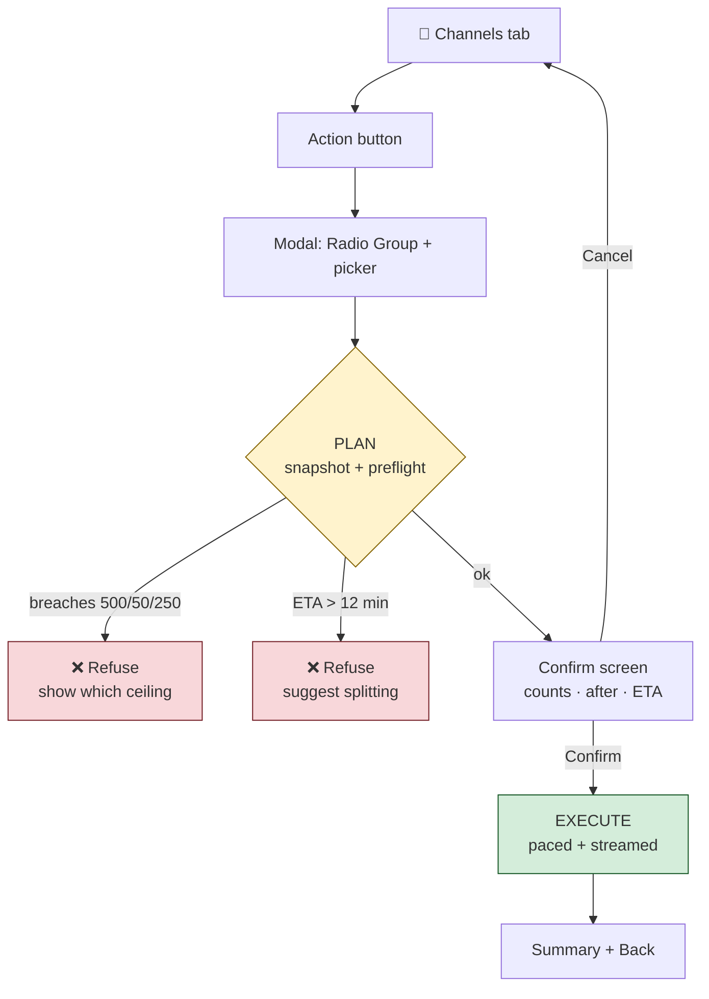
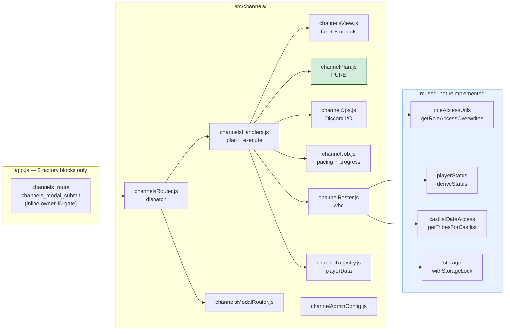
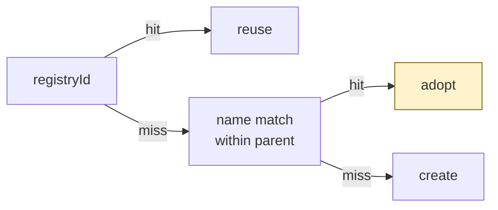
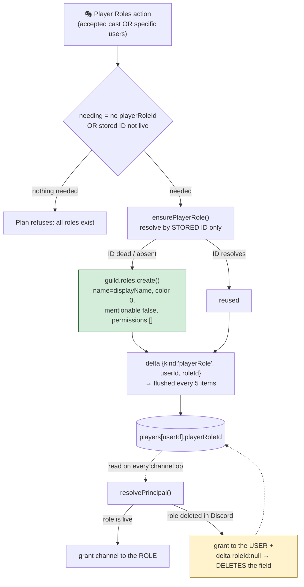

# 🔐 Channel Administration

**Status**: Live on the **CastBot Premium** surface (2026-08-16) — any **Manage Channels/Manage Roles** admin of a premium guild; unentitled guilds see lock-swapped buttons. The Season Manager 🔐 tab remains a dev surface visible only to `391415444084490240` (`CHANNEL_ADMIN_USER_IDS`). The test account (`1086246253819613274`) keeps only the player-facing alliance *request* flow (`ALLIANCE_REQUEST_USER_IDS`)
**Entry point**: `/menu` → Production Menu → Season Manager → **🔐 Channels** tab
**Code**: [`src/channels/`](../../src/channels/)
**Domain background**: [SurvivorContext.md](../concepts/SurvivorContext.md#the-org-domain)

---

## 🤔 What this is

ORG hosts create the same channels by hand every season: a confessional per player, a subs channel per player, a 1on1 channel per *pair* of players on a tribe, a personal role per player, and a Trusted Spectator role. A 16-player season is ~150 channels — and a tribe swap means doing the 1on1s again.

This automates it, and provides the **atomic channel/role primitives** the rest of CastBot never had. Before this, the shape `[{id: everyone, deny:[ViewChannel]}, ...roleAccessEntries]` was hand-rolled at four call sites, none of which checked Discord's guild ceilings.

The tab clones the Marooning tab's chrome and is expected to absorb the Marooning tab button in future.

## 🎯 The five actions

| Button | What it does |
|---|---|
| 🔐 **Roles** | Sets the server's single Trusted Spectator role |
| 🎭 **Auto Create** (was "Player Roles") | One personal Discord role per player (the voted-out kill switch). Creates + records only — assignment is 🟢 Activate's job |
| 🔗 **Manually Link** (was "Manual Roles") | Interop (2026-08-16): link ONE player to an EXISTING role (hand-made or another bot's) as their `playerRoleId` — same `{kind:'playerRole'}` delta the exec emits, so `resolvePrincipal`/kill-switch/roster line treat it identically. Applied on modal submit (data-pointer write only — no plan/confirm). **Records the link, never assigns the role** |
| 🟢 **Activate** | The reveal step (2026-08-16): assign linked roles to their players via a multi-select of CastBot-linked roles. Timing warning: before marooning, players/specs can read the member list and see who was cast |
| 🎙️ **Confessionals** | Create / update / delete `#name-confessional` |
| 🗳️ **Subs** | Create / update / delete `#name-subs`, or **convert application channels** into subs. Category placement select (RaP 0881, 2026-08-09): **Don't touch** (default, today's behaviour) / **Single category** (custom name, moves misplaced channels in) / **One per tribe** (`Balboa Subs` from the default castlist; tribe-less → fallback; re-run after a swap to migrate). Moves always use `moveChannelSafe` (`lockPermissions: false`) so overwrites survive. Per-tribe registry: `categories.subsByTribe` keyed by tribeRoleId |
| 🤝 **1 on 1s** | A private channel for every *pair* of players in a tribe |
| 🤝 **Alliances** | Secret member channels via the Alliance Manager — see [RaP 0892](../01-RaP/0892_20260728_Alliances_Analysis.md). Members + hosts only (**no** Trusted Spectator), name defaults to plain `alliance`, same-tribe warn-only guard, player request flow via /menu → Advanced (`ALLIANCE_REQUEST_USER_IDS` v1; the **requester is always auto-included** in the members — servivorg 2026-08-15). The player button is additionally gated per guild by Settings → 🕹️ Player Menu → Alliance Requests checkbox (`safariConfig.showAllianceButton`, **default OFF** — only an explicit `true` shows it). Review/approve requires Manage Channels/Roles (see Gating). Code: [`alliancePlan.js`](../../src/channels/alliancePlan.js) / [`allianceView.js`](../../src/channels/allianceView.js) / [`allianceHandlers.js`](../../src/channels/allianceHandlers.js) |

## 🪟 Two surfaces, one row (stage 1, 2026-08-08)

The 💬 Channels row now renders in **two** places from **one** definition — `buildChannelsSection(configId)` in [`channelsView.js`](../../src/channels/channelsView.js):

| Surface | Entry | How it gets a `configId` |
|---|---|---|
| Season Manager → 🔐 Channels | `season_channels_{configId}` | From the tab's own id |
| ⭐ CastBot Premium | rendered inline in `MenuBuilder.buildPremiumMenu` | `mostRecentConfigId(playerData, guildId)` — **no seasons → the row is omitted**, not broken |

**Nothing about the custom_ids, handlers, planners or storage changed.** That is the point of stage 1: the same ids work from both surfaces, so there is no second code path to keep in sync. `tests/premiumMenu.test.js` fails if the Premium menu ever hardcodes one of the row's ids instead of calling the shared builder.

**Row composition since 2026-08-08**: Confessionals · Subs · 1on1s · Alliances (🤝) · **Swap/Merge** — the last being a straight copy of the Castlist Hub button (`castlist_swap_merge_default`, existing handler, not configId-keyed). **Msg Category left the shared row** to free that slot: on the Season Manager tab it renders as its own row under the shared section; on Premium it lives in the **📢 Player Engagement** row (with Category Post), behind the same whitelist + configId gate as the Channels section.

**Return targets** are resolved from an in-memory `channelsOrigin` map ([`channelsHandlers.js`](../../src/channels/channelsHandlers.js)), written at render time by whichever surface drew the row and read by `backToChannelsSurface()` in [`channelsRouter.js`](../../src/channels/channelsRouter.js). Origin is **not** in the custom_id because every id already spends its budget on the configId, and the alliance parsers treat the trailing remainder *as* the configId (`alliancePlan.js:114-131`) — there is no free token. Known limitation: it tracks the *last render*, so clicking a stale Premium message after opening the Season Manager tab returns you to the tab.

**Budget check**: the Premium menu is ~28 components without the Channels section, ~35 with it for the fullest case (Reece on TEST: Ask CastBot ×2 + Entitlements + Player Engagement), against the 40 cap. The row is at Discord's hard 5-button ActionRow cap — a sixth action needs a second row.

> **Stage 2** (not built): drop `configId` from the ids entirely and give the two roster-dependent modals (Confessionals/Subs `accepted` mode) their own season picker. That deletes the origin map and frees ~44 chars of custom_id. **Stage 3**: migrate `channelAdmin[configId].{confessionals,subs,categories,lastRun}` to guild scope with a dual-read shim.

## 🏛️ Two-phase: nothing happens until you confirm

Every action is **plan → confirm → execute**. A modal submit never mutates Discord; it builds a preflight and shows you exact counts, guild-after totals, and an ETA. This matters because these jobs are big and irreversible.


```mermaid
flowchart TD
    A[🔐 Channels tab] --> B[Action button]
    B --> C[Modal: Radio Group + picker]
    C --> D{PLAN<br/>snapshot + preflight}
    D -->|breaches 500/50/250| E[❌ Refuse<br/>show which ceiling]
    D -->|ETA > 12 min| F[❌ Refuse<br/>suggest splitting]
    D -->|ok| G[Confirm screen<br/>counts · after · ETA]
    G -->|Cancel| A
    G -->|Confirm| H[EXECUTE<br/>paced + streamed]
    H --> I[Summary + Back]

    style D fill:#fff3cd,stroke:#856404
    style E fill:#f8d7da,stroke:#721c24
    style F fill:#f8d7da,stroke:#721c24
    style H fill:#d4edda,stroke:#155724
```

The plan is stashed server-side in a Map keyed by a short token — **not** in the `custom_id`, which has a hard 100-char limit (10 role IDs alone is ~190 chars). Plans are single-use and expire after 10 minutes.

## 🧱 Architecture


```mermaid
flowchart LR
    subgraph app["app.js — 2 factory blocks only"]
        R["channels_route<br/>channels_modal_submit<br/>(inline owner-ID gate)"]
    end
    subgraph channels["src/channels/"]
        RT[channelsRouter.js<br/>dispatch]
        H[channelsHandlers.js<br/>plan + execute]
        V[channelsView.js<br/>tab + 5 modals]
        M[channelsModalRouter.js]
        P[channelPlan.js<br/>PURE]
        O[channelOps.js<br/>Discord I/O]
        J[channelJob.js<br/>pacing + progress]
        G[channelRegistry.js<br/>playerData]
        S[channelRoster.js<br/>who]
        C[channelAdminConfig.js]
    end
    subgraph reuse["reused, not reimplemented"]
        RA[roleAccessUtils<br/>getRoleAccessOverwrites]
        PS[playerStatus<br/>deriveStatus]
        CD[castlistDataAccess<br/>getTribesForCastlist]
        ST[storage<br/>withStorageLock]
    end
    R --> RT
    RT --> H & M
    H --> P & O & J & G & S & V
    S --> PS & CD
    O --> RA
    G --> ST

    style P fill:#d4edda,stroke:#155724
    style reuse fill:#e7f1ff,stroke:#0d6efd
```

**Why the `create()` blocks stay in app.js**: two repo ratchets only scan `app.js` — the pre-commit legacy-handler counter (which wants `ButtonHandlerFactory.create` within 3 lines of the `} else if (custom_id`) and `tests/securityDeclarations.test.js` (which wants a gate *textually inside* the create block). So app.js keeps the two thin factory blocks with the inline owner-ID gate, and `channelsRouter.js` takes the body. app.js is also under a shrink-only line ratchet, which is why the bodies can't live there.

`channelPlan.js` is pure (no Discord/storage imports), which is why it carries the whole unit-test surface — `tests/channelPlan.test.js` imports the real functions rather than replicating them.

## 🔁 Idempotency: re-running IS the resume

Every operation is an upsert. `ensureChannel` resolves identity in this order:


```mermaid
flowchart LR
    A[registryId] -->|hit| R[reuse]
    A -->|miss| B[name match<br/>within parent]
    B -->|hit| AD[adopt]
    B -->|miss| CR[create]

    style AD fill:#fff3cd,stroke:#856404
```

Step 2 — **adopt by name** — is the whole interruption story. A run that dies halfway leaves channels the next run adopts instead of duplicating, *even if the registry never recorded them*. There is no resume state machine; you just run it again.

> This is a deliberate improvement on `mapExplorer.js:1602`, which persists channel IDs only *after* its whole loop completes — so an interrupt there orphans every channel it made.

The registry is flushed **every 5 items** (between Discord batches, never during — `withStorageLock` forbids network calls inside the lock and isn't re-entrant). A failed flush re-queues its deltas and the next flush retries.

## 🔑 Permission model

| Channel | Player | Trusted Spectator | Host (`globalRoleAccess`) |
|---|---|---|---|
| 🎙️ Confessional | player role **XOR** user | ✅ read + react, **no posting** | ✅ |
| 🗳️ Subs | player role **AND** user | ❌ | ✅ |
| 🤝 1on1 | both players, role-preferred | ❌ | ✅ |

- **Role-preferred** means: use the player's `playerRoleId` if that role is live, else grant the user directly (and clear the dead pointer). That's what makes removing one role strip a voted-out player from everything.
- **Subs deliberately grants both** — belt-and-braces against accidental lockout.

⚠️ **`mergeOverwrites` is mandatory.** A duplicate overwrite ID makes Discord reject the *entire* `channels.create()` with a 400 — and the Trusted Spectator role is very likely *also* in `globalRoleAccess`. `roleAccessUtils` only dedupes `@everyone` (`roleAccessUtils.js:51`).

## 🎭 Player Roles — the data lifecycle

`playerData[guildId].players[userId].playerRoleId` is a single role-ID string, **guild-scoped** (not season-scoped), and **this feature is its only writer in the entire codebase** — grep `playerRoleId` and every write lands in `src/channels/`. Everything else only reads it.


```mermaid
flowchart TD
    P["🎭 Player Roles action<br/>(accepted cast OR specific users)"] --> F{"needing = no playerRoleId<br/>OR stored ID not live"}
    F -->|nothing needed| Z[Plan refuses: all roles exist]
    F -->|needed| E["ensurePlayerRole()<br/>resolve by STORED ID only"]
    E -->|ID resolves| R[reused]
    E -->|"ID dead / absent"| C["guild.roles.create()<br/>name=displayName, color 0,<br/>mentionable false, permissions []"]
    C --> W["delta {kind:'playerRole', userId, roleId}<br/>→ flushed every 5 items"]
    R --> W
    W --> S[("players[userId].playerRoleId")]

    S -.->|"read on every channel op"| RP["resolvePrincipal()"]
    RP -->|role is live| G1[grant channel to the ROLE]
    RP -->|"role deleted in Discord"| G2["grant to the USER +<br/>delta roleId:null → DELETES the field"]
    G2 -.-> S

    style G2 fill:#fff3cd,stroke:#856404
    style C fill:#d4edda,stroke:#155724
```

**The three data-level behaviours that matter:**

1. **Creation is resolve-by-stored-ID-only** (`channelOps.js` `ensurePlayerRole`) — deliberately *never* by role name, because duplicate role names are legal in Discord and a name match could adopt a tribe or vanity role that happens to equal the player's display name. If the stored ID points at a role that no longer exists, it recreates rather than adopting.
2. **Self-healing clear.** `resolvePrincipal` (`channelOps.js:314`) is called on *every* channel operation that touches a player. If the stored `playerRoleId` isn't in the live role set, it falls back to granting the user directly **and emits `{kind:'playerRole', userId, roleId: null}`**, which makes `applyDeltas` `delete` the field (`channelRegistry.js:118`). So a host deleting a role in Discord silently repairs the data on the next run — no reconciliation job.
3. **Re-running only fills gaps.** The plan filter is `!m.playerRoleId || !snapshot.hasRole(m.playerRoleId)` (`channelsHandlers.js:395`), so a second run creates nothing and reports "already correct".

Roles are created with **no permissions and `mentionable: false`** — they are pure access handles, not permission grants. The feature **never deletes** a player role: removal is the host un-assigning it (that's the kill switch), which strips the player from every channel granted to that role at once.

> ✅ **Gap closed (2026-08-16): 🟢 Activate assigns the roles.** Creation (🎭 Auto Create) and linking (🔗 Manually Link) deliberately still do NOT assign — a player suddenly holding their personal role announces their casting status before the season does. **Activate** is the explicit reveal step: a modal String Select of the CastBot-linked roles (a Role Select can't be filtered, so the options ARE the links; ≤25 per pass, overflow named honestly), assigning each selected role to its linked player(s) with per-player failure reporting (`openActivateModal`/`applyActivateRoles`, `channelsHandlers.js`). The tab copy tells hosts to run it during/after marooning. Until Activate runs, `resolvePrincipal` may still permission a channel to a role nobody holds — that's now a deliberate pre-season state, not an accident.

## 💾 Data model

```jsonc
playerData[guildId].permissions.trustedSpectatorRoleId = "<roleId>"  // beside globalRoleAccess
playerData[guildId].players[userId].playerRoleId       = "<roleId>"  // vanityRoles[] is the precedent

playerData[guildId].channelAdmin = {
  version: 1,
  "<configId>": {                       // confessionals/subs are SEASON-scoped
    confessionals: { "<userId>": { channelId, name, categoryId, createdAt } },
    subs:          { "<userId>": { channelId, name, createdAt, convertedFrom } },
    categories:    { confessional: ["catId"], subs: ["catId"] },
    lastRun:       { "<action>": { at, userId, created, skipped, failed } }
  },
  oneOnOnes:  { "<pairKey>": { channelId, name, a, b, tribeRoleId, createdAt } },  // GUILD-scoped
  oneOnOneCategories: ["catId"],
  alliances: { "<allianceId>": { name, channelId, categoryId, members: [{userId, displayName, playerRoleId}],
               createdBy, requestedBy?, notify, configId, createdAt, updatedAt } },   // GUILD-scoped (RaP 0892)
  allianceCategories: ["catId"],
  allianceRequests: { "<requestId>": { requesterId, members, channelId, configId, status, allianceId?, createdAt } }
}
```

### 📅 Season coupling — what `configId` actually buys (design discussion, 2026-07-29)

The tab is reached as `season_channels_{configId}` and lives inside Season Manager, which *implies* channels belong to a season. They mostly don't. An audit of every action:

| Action | Needs the season? | Why |
|---|---|---|
| 🎙️ Confessionals (`accepted` mode) | **Yes** | roster **is** `getAcceptedCast(guildId, configId, guild)` — the season's applications filtered to cast/accepted/accepted_alt |
| 🗳️ Subs (`accepted`) | **Yes** | same roster |
| 🗳️ Subs (`convert`) | **Hard yes** | renames *that season's application channels* into subs channels |
| 🎭 Player Roles (`accepted`) | **Yes** | same roster |
| 🎙️/🗳️ either, `specific` mode | No | `expandMentionables` — the picker, not the season |
| 🤝 1 on 1s | No | roster from `getTribesForCastlist(guildId, 'default')` — tribes, never the season |
| 🤝 Alliances | No | guild-scoped registry; members from the Mentionable Select |
| 🔐 Roles (Trusted Spectator) | No | `playerData[guildId].permissions` |
| 📨 Msg Category | No | draft is stored under the season by *choice*; targets are channels |

So `configId` buys exactly one thing: **"create these channels for everyone accepted into this season" as a one-click op** — which is the flagship value of the tab, not a triviality. Everywhere else it is ceremony inherited from the Casting/Applications ID convention.

Two facts that make the coupling weaker than it looks:
- **Storage is already half guild-scoped.** Season-scoped: `confessionals`, `subs`, `categories`, `lastRun`, `broadcast`. Guild-scoped: `oneOnOnes`, `oneOnOneCategories`, and all three alliance buckets.
- **Many ORGs make a new server every season** ([SurvivorContext](../concepts/SurvivorContext.md)), which makes guild-scope and season-scope the *same thing* for those hosts. The season key only earns its keep when one server is reused across seasons — and even there, delete already lists every affected channel by name on the confirm screen, so the blast-radius safety net doesn't depend on it.
- **The archive feature does not use it.** `channelArchiver.js` has zero `configId`/`seasonId` references; runs are stored at `players[userId].archives` (user-scoped, capped 50). Any "archive needs the season" concern is speculative, not current.

**If the tab moves** (e.g. into the ⭐ Premium menu / action bar, per [RaP 0891](../01-RaP/0891_20260728_PremiumSubscriptions_Analysis.md)), the recommended shape is **guild-scoped entry, season resolved lazily inside the three roster actions**: no `configId` in the tab's custom_id, and the roster-dependent *modals* gain a season picker defaulting to the most-recent config, stating which season they'll use ("Accepted cast of **Season 14** — 16 players"). Consequences to price in first:
- Registry migration `channelAdmin[configId].{confessionals,subs,categories,lastRun}` → guild level, with a dual-read shim (27 of 190 guilds hold application data).
- Servers with no seasons: **hide** the roster modes rather than error; the manual/mentionable path is the universal one.
- Use the most-recent-config sort (`castlistHandlers.js:98-110`) as the default, **not** `activeSeason` — only 1 of 190 guilds has `activeSeason` set.
- Side benefit: dropping `configId` frees ~44 chars of the 100-char `custom_id` budget.

Two deliberate choices:
- **`oneOnOnes` is keyed globally by `pairKey`, not nested under `tribeRoleId`.** After a tribe swap the same pair reappears in a new tribe; global keying makes that adopt the existing channel instead of creating a second one.
- **`pairKey` is BigInt-sorted user IDs** (`${lo}_${hi}`), never names. Snowflakes vary in length, so string sorting puts `'999…'` (17 digits) *before* `'1000…'` (18 digits) — two different keys for one pair, i.e. duplicate channels.

## ⚠️ The conversion hazard (read before touching Subs)

`buildStatusSignals` (`playerStatus.js:74-75`) derives **withdrawn** (`/^✖️/`) and **submitted** (`/^☑/`) *exclusively from the live channel name* — there is no `withdrawn` data field, and `app.channelName` is stale.

So renaming `☑️reece-app` → `reece-subs` **silently and permanently destroys that signal** across Casting, Marooning and ÜberStatus. Three mitigations, all required:

1. **Refuse** to convert any app whose live name starts with `✖️` (withdrawn).
2. Before renaming, persist `app.completedAt` (the data-field signal `deriveStatus` already honours first) and `app.preConvertChannelName`.
3. Record `app.convertedToSubsAt`.

`tests/channelsSelector.test.js` pins this: without the `completedAt` stamp a converted player's status collapses to `new`.

## 📊 Scale — this is the main design constraint

1on1s are combinatorial, against a hard ceiling of **500 channels / 50 categories / 250 roles** per guild, at ~1 channel/sec:

| Tribe | 1on1 channels | Categories | Time |
|---|---|---|---|
| 8 | 28 | 1 | ~30s |
| 12 | 66 | 2 | ~1 min |
| 16 | 120 | 3 | ~2 min |
| 20 | 190 | 4 | ~3 min |
| 24 | 276 | 6 | ~5 min |

`preflightBudget` refuses anything that would breach a ceiling and names which one. Jobs estimated over **12 minutes** are refused too (the interaction token dies at 15).

Note the *two different 50s*: 50 categories per guild, and 50 channels per category. `planCategoryBuckets` handles the latter (overflowing into `1 on 1s 2`, `1 on 1s 3`…) and tops up a partially-filled category first.

## 🚧 Known constraints

- **Renames: 2 per 10 minutes, per channel.** Renaming is best-effort and never fails a job — the channel is still permissioned and registered, and reported as `renamePending`.
- **Concurrency**: an in-memory `jobLocks` map keyed `${guildId}:${action}` refuses a second simultaneous run. `withStorageLock` can't help here — a bulk run spans Discord calls, so its read-then-create is TOCTOU.
- **Delete never name-matches guild-wide.** It only touches registry entries and children of CastBot's own categories, and lists every channel by name on the confirm screen.
- **Departed members are dropped; bots are NOT** (changed 2026-08-08). Bots were originally dropped to stop a spectator bot in a tribe role generating n−1 useless 1on1 channels — but in practice tribe roles are never assigned to bots, and bot accounts are needed as stand-in players on test servers. The confirm screen now names anyone dropped.
- **Progress rides the webhook token**, not channel posts, so it survives deleting the channel you ran the job from. A 401 (expired token) is swallowed; the registry and the tab's `lastRun` line are the durable record.

## 🔒 Gating

**Two enforcement models by surface** since 2026-08-16, because **`restrictedUser` in BUTTON_REGISTRY enforces nothing** (RaP 0900 — it's documentation wearing a security costume) and because the whitelist alone let a permissionless account approve its own alliance request (servivorg, 2026-08-15):

1. **Authority — everywhere**: `requiresPermission: CHANNEL_ADMIN_PERMISSIONS` (**Manage Channels OR Manage Roles**, ANY-OF; Administrator and `globalRoleAccess` hosts pass via `memberHasAnyPermission`) on the `channels_route` and `channels_modal_submit` factory blocks in app.js. Enforced centrally *before* the handler and before any modal — this is what stops a random player clicking 🔍 Review on a public alliance-request card. It also satisfies the deploy-blocking ratchet in `tests/securityDeclarations.test.js`. There is **no user whitelist on the handlers** anymore (removed 2026-08-16 — it was blocking a premium server's other admins from features they could see).
2. **Premium surface** (`menuBuilder.buildPremiumMenu`): the Channels section renders for **every admin** of a guild with seasons — the menu itself is ManageRoles-gated, and unentitled guilds lock-swap every button to the upsell (`premium_locked_*`). This is the public path to Channel Administration.
3. **Season Manager 🔐 tab** (dev surface): still display-gated to `CHANNEL_ADMIN_USER_IDS` (Reece-only) via `buildSeasonNavRow` and the Edit-origin round trip — hidden, but no longer the only path.

**The split whitelist**: `ALLIANCE_REQUEST_USER_IDS` (Reece + test account) gates only the player-facing alliance *request* flow — requesting needs no authority because nothing is created without an admin's review. This keeps the test account a pure player-simulant: it can request, but sees no admin surfaces and cannot approve. Pinned by `tests/channelsSelector.test.js`.

The nav row is now **exactly 5 buttons** — Discord's hard per-ActionRow limit. There is no room for a sixth tab.

## 🧪 Tests

| File | Covers |
|---|---|
| `tests/channelPlan.test.js` | slugs, names ≤100, BigInt pair keys, pair combinatorics, overwrite merging, budget ceilings, category bucketing, collisions |
| `tests/channelRegistry.test.js` | delta application, idempotency, season vs guild scoping, dead-role clearing, the conversion signal stamp |
| `tests/channelsSelector.test.js` | the whitelist gate, 4-vs-5 tab rendering, Edit-origin round trip, roster resolution via the real status engine |

## 🔮 Not built yet

- ~~**Alliances**~~ — **shipped (v1, whitelist-hidden)** — see the Alliances row above and [RaP 0892](../01-RaP/0892_20260728_Alliances_Analysis.md). Still open there: public player requests, notify-on-edit.
- **Player role colour** — the `color` parameter is plumbed through `ensurePlayerRole` and defaults to `0` (uncoloured).
- Merging 🔐 Roles into Settings → Roles & Security.
- Season-scoped `playerRoleId` (currently guild-scoped, so a returning player reuses their old role).

## 📎 Related

- [SurvivorContext.md](../concepts/SurvivorContext.md) — what confessionals/subs/1on1s/alliances actually are
- [SeasonManager.md](SeasonManager.md) — the tab chrome this clones, and the casting status fields
- [RolesSecurity.md](RolesSecurity.md) — `globalRoleAccess`, reused here for host access
- [SafariMapSystem.md](SafariMapSystem.md) — the prior (unabstracted) bulk channel creation
