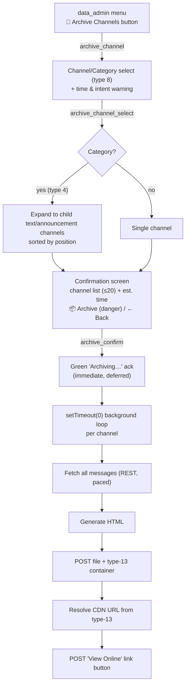

# 📂 Channel Archive

**Status:** ✅ Active (shipped) — single-channel and whole-category archiving to on-Discord HTML
**Location:** Reece's Stuff → Data → 🧹 Cleanup & Restart → **🧹 Archive Channels**
**Code:** `app.js` (`archive_channel` / `archive_channel_select` / `archive_confirm` handlers), `channelArchiver.js` (background run), `channelExportFetcher.js` (rate-limited REST), `channelExport.js` (HTML)
**Related:** [DiscordRateLimits.md](../standards/DiscordRateLimits.md) · [ComponentsV2.md](../standards/ComponentsV2.md) · [RaP 0917 — Privileged Intents](../01-RaP/) · [Backup Strategy](BackupStrategy.md)

> **Naming note:** the feature is presented to users as **"Archive"** even though it technically *exports* a channel's history to an HTML file. The underlying modules keep the legacy `export` names (`channelExport.js`, `generateExportHTML`, `*-export-*.html`); the user-facing UI, buttons, and this doc say "Archive."

---

## 🎯 What It Does

A popular host (whom Reece helps) reuses the **same Discord server season after season**, creating **300+ channels per season × ~6 seasons/year**. Discord caps a guild at **500 channels**, so the server fills up. The long-term goal is to free channel slots by exporting a channel's full history, storing it permanently, and (eventually) deleting the original.

**What ships today:** an admin selects a channel *or a whole category*, confirms, and the bot fetches every message via REST, renders a self-contained Discord-styled HTML file, and posts it back into the invoking channel as a downloadable attachment plus a "View Online" link button. Categories are expanded and archived channel-by-channel in one background pass.

**What it does NOT do yet:** it does not delete the original channel, and it does not move archives into a dedicated storage/index channel. So it produces archives but does not yet *reclaim* slots — see [Not Yet Built](#-not-yet-built).

---

## 🔌 Discord API — How Channel Content Is Retrieved

| Purpose | Endpoint | Method | Caller |
|---|---|---|---|
| **Fetch message history** | `GET /channels/{channel.id}/messages?limit=100[&before={cursor}]` | REST v10 via `node-fetch` directly | `fetchAllChannelMessages()` in `channelExportFetcher.js` |
| Resolve selected channel/category metadata | `GET /channels/{selectedId}` | shared `DiscordRequest()` | `archive_channel_select` |
| Expand a category to its children | `GET /guilds/{guildId}/channels` | shared `DiscordRequest()` | `archive_channel_select` |
| Post the archive (file + container) | `POST /channels/{invokedChannelId}/messages` (multipart) | `node-fetch` | `archive_confirm` background loop |
| Post the "View Online" link button | `POST /channels/{invokedChannelId}/messages` (JSON) | `node-fetch` | `archive_confirm` background loop |

**The content endpoint is `GET /channels/{id}/messages`** — the standard [Get Channel Messages](https://discord.com/developers/docs/resources/channel#get-channel-messages) REST route. Key facts:

- **`limit=100` is the hard ceiling.** There is no bulk endpoint; pagination via the `before` cursor (last message ID of the previous page) is mandatory.
- The message-content fetcher is **self-contained on purpose** — it does NOT route through the shared `DiscordRequest()` (which is load-bearing across prod and throws raw on 429). Isolating the experiment keeps the rest of the bot untouched.
- **Message Content Intent is required for text.** `content`, `embeds`, `attachments`, and `components` are redacted server-side (for both Gateway and REST) on any message the bot didn't author / isn't mentioned in, unless the **Message Content Intent toggle is ON in the Developer Portal**. This is a *portal toggle*, not a gateway-intent bitfield change — so enabling it for REST does **not** reintroduce the websocket-content memory cost RaP 0917 deliberately avoided. There is no code workaround; the redaction is server-side.

---

## 🪜 UI Flow

1. **`archive_channel`** (`updateMessage: true`) — renders a **channel/category select** (type 8, `channel_types: [0, 4, 5]` = Text + Category + Announcement) with the warning:
   > ⚠️ Large channels take time (~1 min per 3,000 messages — a 13k channel ≈ 4 min). Requires the **Message Content Intent** to be enabled, or message text will be blank.
2. **`archive_channel_select`** (`deferred: true`, `updateMessage: true`) —
   - Fetches the selection. If it's a **category (type 4)**, expands to all child text/announcement channels (types `0`, `5`) sorted by `position`; otherwise wraps the single channel in an array.
   - Stashes `{ channels, invokedChannelId }` in `global.pendingArchive` keyed by `${guildId}:${userId}`.
   - Renders a **confirmation screen**: channel list (up to 20, with overflow count), estimated time (`1–5 min` single / `N×1–N×5 min` for N channels), a red **📦 Archive** button (style 4), and **← Back**.
   - Edge case: empty category → orange "No text channels found" with a back button.
3. **`archive_confirm`** (`deferred: true`, `updateMessage: true`) —
   - Pops the stashed state (deletes the map entry). If missing → red "Session expired — please start over."
   - Returns an **immediate green "📦 Archiving…" ack** with a ← Data button.
   - Kicks off a **`setTimeout(0)` background loop** that runs *after* the factory sends the ack, so the per-channel work escapes the interaction response path. Each channel's archive message lands in the channel as it completes.

---

## 🔁 Per-Channel Archive Loop (background)

`app.js`'s `archive_confirm` just kicks off `archiveChannels(channels, invokedChannelId)` via `setTimeout(0)` — all the work lives in **`channelArchiver.js`**. For each channel:

1. **Fetch** — `fetchAllChannelMessages(channel.id, { onProgress })` → `{ messages, total429, batches }`, sorted oldest-first. Progress logs every 500 messages.
2. **Render** — `generateExportHTML(channel.name, messages)` → self-contained HTML string. Filename: `${channel.name}-export-${YYYY-MM-DD}.html`.
3. **Size check / split** — if the rendered HTML exceeds `SAFE_UPLOAD_BYTES` (9 MiB, under Discord's ~10 MiB upload cap), the messages are split into `ceil(bytes / 9MiB)` parts and each part is posted separately (`-partN` suffix, "Part i/N" in the header). Otherwise it posts as one message.
4. **Build container** — Components V2 type-17 container holding the channel header, message count + `<t:...:F>` timestamp, and a **type-13 (File) component** referencing `attachment://${filename}`.
5. **POST file (paced + retried)** — `multipart/form-data` to `POST /channels/{invokedChannelId}/messages` via the shared **`createMessagePoster`** (see [Write-path rate limits](#-write-path-rate-limits)), with `payload_json` carrying `flags: 1<<15` (IS_COMPONENTS_V2), `components: [container]`, and `attachments: [{ id: 0, filename }]`.
6. **Resolve CDN URL** — ⚠️ **for Components V2 + type-13 messages, Discord resolves the `attachment://` URL *inside the component* (`postData.components[...].file.url`), NOT in the top-level `attachments[]` array.** The code tries `attachments[0].url` first (fallback in case Discord changes behaviour), then recursively walks `components` for a type-13 whose `file.url` no longer starts with `attachment://`. This was the key gotcha — see commit `9de60a7e`.
7. **POST link button (paced + retried)** — a **second POST** (JSON, not a PATCH of the first message) creates a separate message with a style-5 link button: `View {channelName} Online` → `https://htmlpreview.github.io/?${cdnUrl}`. The label is truncated to fit Discord's 80-char button-label limit. (A separate POST was needed because editing/PATCHing the file message to add the button didn't work reliably — commit `9de60a7e`.)

Errors are caught per-channel: a red error message is posted to the channel and the loop continues. After the run, if more than one channel was requested, a **final summary** message is posted (`✅ N archived` / `⚠️ N archived, M failed`) so a run never ends silently.

---

## ⚡ Write-Path Rate Limits

> **Refined assumption (2026-06-13).** The original design assumed the bottleneck was the **read** path (`GET …/messages`) and paced *that*. In practice reads were never the problem — live runs show "0 rate-limit waits" on fetch. The bottleneck is the **write** path: posting archives back into the invoking channel.

**Why it 429-stormed:** every channel does **2 POSTs to the *same* channel** (file + link button). Archiving a category of N channels fires ~2×N `POST /channels/{id}/messages` at one channel, and `POST /channels/{id}/messages` has its own **per-channel bucket (~5 msgs / 5s)**. The old loop had **no write pacing and no retry**, so:
- File-POST 429 → `continue` → **the whole channel was silently skipped** (no archive posted, only a console error). This is the "seemed to silently fail" symptom.
- Button-POST 429 → file posted but no "View Online" button.
- Observed live: failures every ~2s, `retry_after` ≈ 0.3–0.45s, `scope: user` — textbook per-channel message-create bucket.

**Fix — `createMessagePoster(channelId)` in `channelExportFetcher.js`:** a single poster instance is created per run and used for *every* write. Because all writes target the one invoking channel (one bucket), it naturally serialises them. It:
- reads `x-ratelimit-remaining` / `x-ratelimit-reset-after` and spaces out the next POST when the budget is exhausted (pure, tested `computePostPacing()`);
- on 429, reads `retry_after`, waits, and **retries the same POST** (up to 8 times) — callers never see a rate-limit error, they just wait;
- returns non-429 errors (e.g. **413**) to the caller without retrying (a 413 is deterministic — retrying won't help; the size-split in step 3 prevents it instead).

**413 "Request entity too large":** Discord caps uploads at ~10 MiB (boost level 0). `#🪵logs` exceeded this and failed outright before the fix. Now handled proactively by splitting oversized HTML into parts (step 3); the poster also surfaces any residual 413 as a per-channel error instead of a silent skip.

**Scope note:** this feature is TEST-server-only, super-admin-only, with 1–2 users — so the goal is "don't generate a storm of errors / don't silently drop channels," not aggressive throughput. Slower-but-reliable is the right trade. The background run posts via raw bot REST (not the interaction token), so it is **not** bound by the 15-min interaction limit and can pace as long as needed.

---

## 🧩 Modules

### `channelArchiver.js` — background run orchestrator
`archiveChannels(channels, invokedChannelId)` — the whole per-channel loop (fetch → render → size-split → paced POST file → resolve CDN → paced POST button), per-channel error reporting, and the final run summary. Extracted from `app.js` so the router stays thin. Pure-ish glue; the rate-limit primitives it uses are unit-tested in the fetcher.

### `channelExportFetcher.js` — rate-limited REST (read **and** write)
- **`fetchAllChannelMessages(channelId, { onProgress, maxConsecutive429 = 10 })`** — read path. Header-driven pacing via pure, unit-tested `computeRateLimitDelay({ remaining, resetAfter })`: bursts the per-channel request budget, then sleeps `reset-after` (+150ms buffer) when exhausted. **429 backstop:** reads `retry_after`, sleeps, retries the *same* cursor; aborts after 10 consecutive 429s (Discord's invalid-request ceiling is 10,000 × 401/403/429 per 10 min → temporary Cloudflare IP ban, so it never blind-retries). Returns `{ messages, total429, batches }`, oldest-first.
- **`createMessagePoster(channelId, { maxRetries = 8 })`** — write path. Returns a bound poster that paces from response headers and transparently retries 429s (pure, unit-tested `computePostPacing()`). Handles both multipart (FormData) and JSON bodies; caller passes content headers only, the poster adds `Authorization`. See [Write-Path Rate Limits](#-write-path-rate-limits).

**Empirically measured** (CastBot-Dev, 2026-06-04): `GET /channels/{id}/messages?limit=100` → per-channel bucket, **limit 5 / window ≈5s**, sustainable ≈1 req/s, 429 `retry_after` ≈0.357s, scope `user`. Paced at the header rate, **zero 429s** across the test runs. The live archive in prod logs (2026-06-13) fetched a 2,721-message channel in 28 batches with **0 rate-limit waits**.

### `channelExport.js` — HTML generator
`generateExportHTML(channelName, messages, resolver)` → a single self-contained HTML document (all CSS inline, no external deps), Discord dark-theme styled, with a client-side search bar, author/avatar rendering, message grouping (same author within 7 min), date separators, embeds, image/file attachments, and reactions.

- **`extractComponentText(components)`** walks the Components V2 tree (type-10 Text Display + type-2 Button labels, recursing into containers/sections/action-rows and Section accessories) so **CastBot's own messages render** — their text lives in `components`, not `content`, and would otherwise show `[no content]`.
- **`renderContent(text, ctx)` / `renderInline(text, ctx)`** — a small Discord-flavoured markdown renderer (replaced the old `markdownToHtml`). Handles bold/italic/underline/strike/inline-code/URLs, **fenced code blocks**, **headings/blockquotes/lists**, **spoilers** (`||…||`, click/hover to reveal), **custom emoji** (`<:name:id>` → CDN ``), **timestamps** (`<t:unix:style>`), and **mentions** (see below). HTML-token outputs are stashed behind `\x00`/`\x01` sentinels before escaping and restored after — chosen specifically so bare digits in real text (e.g. "Top 5 players", code-block contents) can't collide with placeholders.

#### Mention resolution — names baked at archive time
Mentions render as Discord-style pills with **real names**, resolved **when the archive is generated** and baked into the static HTML. The opened file makes **no live calls** (it can't — no auth/CORS); an archive is therefore a point-in-time snapshot (later renames/deletes don't change it).

| Token | Resolved from | Cost |
|---|---|---|
| User `<@id>` / `<@!id>` | the message's own `mentions[]` (already in the fetched JSON), seeded by guild member cache | free |
| Role `<@&id>` | bot `guild.roles.cache` (name + colour) via the `resolver` built in `channelArchiver.js` | free (cache) |
| Channel `<#id>` | bot `guild.channels.cache` | free (cache) |
| `@everyone` / `@here`, emoji, timestamps | special-cased / parsed | free |

`channelArchiver.js` builds the `resolver = { users, roles, channels }` **once per run** from `client.guilds.cache.get(guildId)` (passed in from `archive_confirm` as `client` + `guildId`). Unresolvable IDs fall back to `unknown-user` / `deleted-role` / `deleted-channel`. **No per-mention REST calls** — important given the write-path rate-limit work.

---

## 🐞 Bugs Fixed Along The Way

1. **Rate-limit crash on large channels (read path).** The original export used a fixed 300ms delay (~3.3 req/s) against a ~1 req/s ceiling → guaranteed 429 past ~13 batches. Fixed by the header-aware fetcher.
2. **All content exported as `[no content]`.** Message Content Intent was off in the Developer Portal → REST returned empty `content`. Fixed by enabling the **portal toggle** for CastBot-Dev (no code/gateway change). Both CastBot (33 guilds) and CastBot-Dev (24) are under the 100-guild verification threshold, so the toggle is free.
3. **Components V2 (bot) messages rendered blank.** Bot text lives in `components` (type-10), not `content`. Fixed by `extractComponentText()`.
4. **CDN URL not in `attachments[]` for type-13 messages.** Discord puts the resolved URL inside the type-13 component. Fixed by the recursive `findType13Url()` walk.
5. **Write-path 429 storm + silent channel skips (2026-06-13).** Category archives fired ~2 message-POSTs per channel at one channel with no pacing/retry → constant 429s, and a 429 on the file POST silently skipped the whole channel. Fixed by routing all writes through `createMessagePoster` (paced + retried). See [Write-Path Rate Limits](#-write-path-rate-limits).
6. **413 on huge channels (2026-06-13).** `#🪵logs` HTML exceeded Discord's ~10 MiB upload cap and failed outright. Fixed by splitting oversized archives into <9 MiB parts.

---

## 🔘 Button Registry

Registered in `buttonHandlerFactory.js` `BUTTON_REGISTRY`:

| custom_id | Label | Style | Parent |
|---|---|---|---|
| `archive_channel` | Archive Channels | Secondary 🧹 | `data_admin` |
| `archive_channel_select` | Archive Channel Select | Secondary 🧹 | `archive_channel` |
| `archive_confirm` | Confirm Archive | Danger 📦 | `archive_channel_select` |

All three use `ButtonHandlerFactory.create()` (`[✨ FACTORY]` in logs). The two file/button POSTs in the background loop are raw `node-fetch` calls (not interactions), so they don't appear in the factory.

---

## ⚠️ Risks / Notes

- **Privacy/retention.** Archiving persists another server's message content to Discord's CDN (and the htmlpreview proxy reads it). The feature is gated behind Reece's Stuff (`data_admin`, super-admin only).
- **"View Online" link is fragile.** It proxies the Discord CDN URL through `htmlpreview.github.io`, and that CDN URL **expires ~24h**. The downloadable HTML attachment in the same message is permanent; the online link is convenience-only. (Permanent on-Discord storage is the motivation for the unbuilt stages below.)
- **Message Content Intent at 100+ guilds** would require Discord verification — not a concern at current guild counts.
- **No slot reclamation yet** — original channels are never deleted, so this doesn't address the 500-channel cap on its own.

---

## 🚧 Not Yet Built

These were designed in the original RaP but are **not implemented**. Kept here as the forward roadmap:

- **Pre-flight estimate + tracked background job** — a size estimate before confirming and a job that posts its own result, fully escaping the 15-min interaction token for very large channels. (Today the loop runs via `setTimeout` after a deferred ack, which works because the largest known channel ≈13k msgs ≈4 min, comfortably inside the token; there's no separate job tracker or progress edits.)
- **Dedicated on-Discord archive channel** — upload HTML to a permanent archive channel and record CDN URL + metadata, instead of posting back into the invoking channel. Would also fix the ~24h link-expiry fragility.
- **Slot reclamation** — export → archive → **delete original channel** (with export-verified confirmation, cf. nuke-category pattern). *This is the actual fix for the 500-channel cap.*
- **Index / "compression" channels** — a maintained index message linking each archived channel to its HTML, rolling older archives into linked sub-channels as the index grows.

---

## 📎 Original Trigger Prompt (verbatim, for historical context)

> document in a RaP now (or edit any existing RaP), answer my following questions, then re-paste your staged approach text for me to review
>
> my questions
> So GET /channels/{id}/messages?limit=100: <-- are you able to GET more than 100 messages at a time to make it more efficient?
> Not super concerned about the big channels, i checked the biggest and oldest one i could think of and it still only had 13k messages, however please ensure we put some warnings in the channel select screen
> execute stage 1 now
> I just tried to run an export and noticed a bit of a bug, all the messages are empty, see @temp/✨new-features-export-2026-06-04.html , proof that that channel has actual message content (its a fairly small channel, less than 100 messages I'd estimate)
>
> [Reece pasted the full #✨new-features changelog as proof of real content.]
>
> happy for you to go ahead with stage 1, try see if that thing i just mentioned is a bug and fix it
> ultrathink

*Earlier context (same session): the export feature was originally built undocumented over 4 commits Mar 23–28 2026; the overhaul into "Archive Channels" (confirmation screen, per-channel loop, type-13 file, htmlpreview button, CDN-from-component fix) landed Jun 2026 across commits `76003a75` → `9de60a7e`.*
