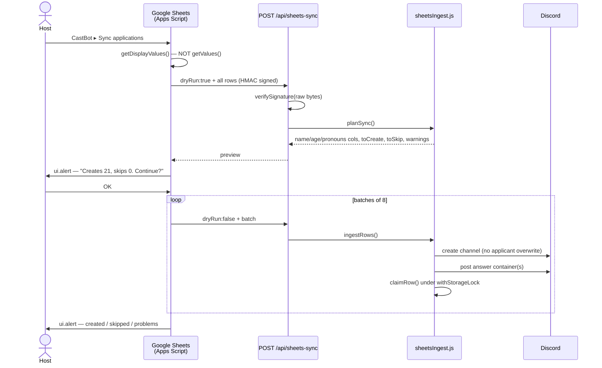

# 📜 Google Sheets Sync

**Status:** Active (production, 2026-07-31)
**Code:** [src/sheets/sheetsSync.js](../../src/sheets/sheetsSync.js) · [sheetsIngest.js](../../src/sheets/sheetsIngest.js) · [sheetsHandlers.js](../../src/sheets/sheetsHandlers.js)
**Tests:** [tests/sheetsSync.test.js](../../tests/sheetsSync.test.js)
**Entry point:** Season Manager → **📝 Apps** → the label-less **📜** button (far right of the Post/Import/Export row)

## 🤔 What this is for

CastBot's Season Applications assume the applicant is a Discord user: they click Apply, get a private channel, answer questions in it. That breaks for ORGs who **recruit off-Discord** — IRL leagues, or anyone whose funnel is Instagram/TikTok → Google Form. Their applicants may never join the server at all, but the *hosts* still run on Discord and still want the Casting tab.

Google Sheets Sync pushes a Google Form's response sheet into a season. CastBot creates one application channel per row and posts the answers into it — landing in exactly the shape a native application ends up in, so **Casting, Marooning, DNC and notes all work unchanged**.

**Direction of travel is Sheets → CastBot, always.** CastBot cannot pull; that would need Google API auth we deliberately avoid. The host triggers a sync from a menu the generated script installs in their own spreadsheet.

## 🏛️ Why it's shaped this way

Three design decisions came from a **real host sheet** (Melbourne Survivor, "Returnee Application (Fans vs Favourites)") that broke the first design. Keep them in mind before "simplifying" anything here.

### 1. Prescribed headers, not fuzzy matching
Only three columns are *mapped*: `Name`, `Age`, `Pronouns` — the only fields the Casting card's Overview block renders. **Every other column flows through as an arbitrary header→answer pair.**

Matching is **exact** (case-insensitive, trimmed), never fuzzy. The real sheet carried BOTH `What is your name?` (the Form question) and a hand-added `Name` column — any `/name/i` match picks the wrong one, silently, and casts the wrong data. Exact-match-and-fail-loudly beats guessing. `Name` is the only hard requirement; its absence is fatal and the error echoes the headers actually seen.

The host is therefore instructed to **title their Form questions exactly** `Name`, `Age`, `Pronouns`. On a Form Responses sheet the header IS the question text and can't be reliably renamed — Forms rewrites it — so the instruction is necessarily about question titles.

### 2. Answers are posted, never stored
Same as a native application: `playerData` holds the record, Discord holds the content. There is no `answers[]` field (RaP 0907 proposed one; still unbuilt). This was a deliberate call to sidestep storing applicant free-text, and it is the direct cause of the create-only sync semantics below.

### 3. Externals are first-class, not a special case
The Casting card turned out to be **already tolerant** of a non-member applicant — `guild.members.fetch()` is wrapped in try/catch with a synthetic-member fallback at nine call sites, and **no casting `custom_id` embeds a userId** (they're all channelId/appIndex/configId). So the integration cost was far lower than expected. See "What externals change" below.

## 🔄 Sync semantics (create-only, one-way)

Row identity is `sha256(lowercased Name + Timestamp)` — `rowKeyFor()`. Deliberately **not** row position: hosts sort and filter constantly, and a positional key would re-import everyone the first time someone sorted by name. After a successful import the key is stored as `sheetsSync.rowKeys[key] → channelId`; every sync skips rows it already holds.

| Host action | Result |
|---|---|
| Re-run sync, unchanged | All rows skipped, nothing created |
| New form response | New Timestamp → new key → new channel |
| **Edits an answer in an imported row** | **Nothing.** Key unchanged → skipped. The edit never reaches Discord |
| **Changes someone's `Name`** | **Duplicate.** New key → a second channel for the same person |
| Deletes a sheet row | Nothing removed from Discord |

Edits can't propagate because answers aren't stored and posted message ids aren't kept. All of this is surfaced to hosts in the **🔄 How records sync** section on the 📜 screen, and the tests assert that copy against the real `rowKeyFor` behaviour — change the key and the tests fail, forcing the copy to change with it.

> ⚠️ **Known gap:** deleting an imported applicant's Discord channel leaves the `rowKey` in place, so that row stays "already imported" and won't be recreated. A self-heal (verify the channel still exists before skipping) is unbuilt.

## 🔐 Security

- **Per-season HMAC-SHA256 secret**, generated on first Get Script, stored at `applicationConfigs[configId].sheetsSync.secret`.
- Verified over the **raw request bytes**. `/api/sheets-sync` is on the explicit skip list in app.js's global body-parser — `express.json()` must not touch it, both because the raw bytes are needed and because re-serializing a parsed object can reorder keys and invalidate a good signature. A `Buffer.isBuffer` tripwire in `handleSyncRequest` reports a regression rather than letting it masquerade as bad input.
- **Reset Link** rotates the secret, instantly invalidating the host's installed script (two-step red confirm).
- Secrets are **per-instance** — a script generated on test will not work against prod.

### Privacy — 🔒 Hide Columns
Real application forms carry emails, mobile numbers, emergency contacts and free-text **medical conditions**. Everything not excluded is posted into a channel the whole production role can read, permanently.

The picker lists every header seen on the last sync (CastBot cannot read the sheet on its own — this is the only way it learns the shape) and marks likely-sensitive ones with ⚠️. **Nothing is excluded by default** — guessing wrong on someone's form is worse than a nudge.

## ⚙️ How it works



**Why the confirm lives in Sheets:** there's no interaction token on the push path, so the host must confirm where the action originates. The dry run checks everything the import checks (including the category) so nothing can abort *after* the host has committed.

**Storage lock shape:** Discord work happens **outside** `withStorageLock`; only the record write is inside it (CLAUDE.md: nothing slow inside the lock). `claimRow()` re-checks the dedupe key inside the lock so concurrent syncs can't double-import — the loser deletes the channel it just created rather than orphaning it.

**Batching:** 8 rows per request, ~700ms pacing between channel creations. Channel create is one of Discord's tightest buckets and Apps Script's `UrlFetchApp` has its own timeout.

## 🧩 What externals change

An external applicant record carries `source: 'googleSheets'` plus an `external` block:

```javascript
playerData[guildId].applications[channelId] = {
  userId: 'ext_<hex>',        // synthetic, unique, derived from rowKey
  source: 'googleSheets',
  external: { rowKey, age, pronounName, timezoneName },
  // ...otherwise identical to a native application record
}
```

- **Synthetic `userId`, never blank.** `dncManager`, `channelRoster` and `castlistManager` key maps on userId — two applicants both holding `undefined` would silently collapse into one.
- **No per-applicant permission overwrite** at channel creation. There's nobody to grant access to, and passing a synthetic id to Discord 400s the create outright.
- **Demographics come from strings, not roles.** You cannot assign a pronoun/timezone role to someone who isn't in the server. `resolvePlayerDemographics` (castRankingManager.js) returns the `external` block for these records. The card renders role *names* as plain text anyway, so an external renders byte-identically to a native applicant.
- **Invites:** the existing `status_only` / `status_only_accepted` paths already exist for decisions communicated outside CastBot — that's the intended flow for externals.

## 🚧 Prerequisite: the Apply button

Imported applicants need a category to live in, which only exists once the season's **Apply button** is configured. A season at `stage: planning` has `categoryId: null` and the sync refuses.

This is surfaced in four places, because the first version refused with a bare `ok:false`, logged nothing, and the Apps Script rendered it as "Failed: 1" — the reason existed nowhere:
1. Step 1 of the Get Script instructions (ticked ✅ or flagged ⚠️ against real state; card turns amber when missing)
2. A `BEFORE YOU START` block in the generated `.gs` header (the script travels separately from Discord)
3. Step 1 of **🚀 How to sync** on the 📜 screen
4. A ⚠️ banner on the screen when the category is genuinely missing

## 🐛 Two bugs worth not re-introducing

**`getDisplayValues()`, never `getValues()`.** The real sheet's emergency phone arrived as `5.9855646E7` — Sheets coerced a leading-zero mobile to a float. Display values are what the host actually sees.

**Sign the UTF-8 bytes.** `Utilities.computeHmacSha256Signature(String, String)` does **not** encode non-ASCII as UTF-8, so any application containing an emoji or a curly apostrophe (i.e. all of them — Forms autocorrects quotes) produced an HMAC the server could never reproduce. The script hashes `Utilities.newBlob(body).getBytes()`. `diagnoseSignature()` exists so the server log distinguishes a client charset bug from a genuinely stale key via a latin1 probe.

## 📋 Data model

```javascript
applicationConfigs[configId].sheetsSync = {
  secret,          // hex, HMAC key — rotate via Reset Link
  createdAt, rotatedAt, lastSyncAt,
  rowKeys: {},     // rowKey → channelId (dedupe)
  seenHeaders: [], // from the last dry run — the only source for the Hide Columns picker
  excludeHeaders: []
}
```

## 🔮 Not built

- **`answers[]` storage** (RaP 0907) — would unlock edit propagation, CSV export and search
- **Self-heal on deleted channels** (see Known gap above)
- **Host-driven column mapping** — prescribed headers were chosen instead; if hosts trip over it repeatedly, a mapping select bolts on without changing the script
- **CastBot-hosted web form** — the strategic follow-on: `/apply/:configId` rendered from `config.questions[]`, optionally with Discord OAuth `guilds.join`, killing the Google dependency entirely

## Related

- [SeasonAppBuilder.md](SeasonAppBuilder.md) — the native, Discord-user application path
- [SeasonManager.md](SeasonManager.md#-casting-the-former-ranking-tab) — the Casting card these records feed
- [RaP 0907](../01-RaP/0907_20260621_CustomQuestionTypes_Analysis.md) — the unbuilt `answers[]` proposal
