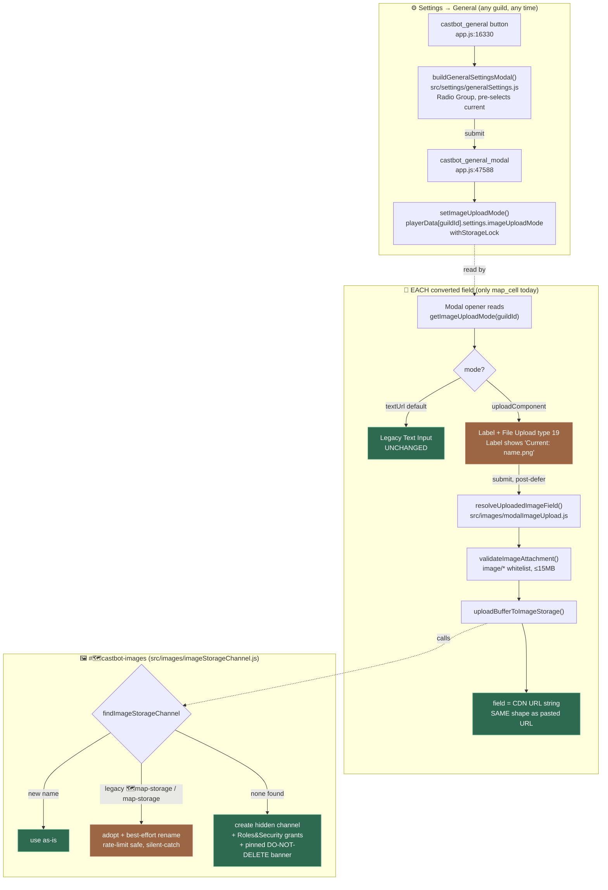

# 🖼️ Image Uploads (Media Gallery Migration)

**Status**: 🟡 **Active — infrastructure shipped, migration mostly done.** Converted: map cell location image (pilot), map create/update (download-source), enemy image, rich card shared def (+ challenges and channels consumers), dice/d20 result images, tips showcase. Remaining legacy: custom-action Display Text image (+ its legacy twin), Season App question images, and the legacy map-cell editor (retirement candidate) — see [RaP 0894 § Migration Backlog](../01-RaP/0894_20260720_ImageUploadComponent_Analysis.md#-migration-backlog--every-remaining-image-url-modal-input-swept-2026-07-20). Deployed to **TEST only** (castbot-blue). **Not on prod.**

**Read this if**: you're picking up the "convert legacy Image URL fields to native Discord uploads" work with no other context — a fresh Claude Code session, a new contributor, or future-you in six months.

**Related**: [RaP 0894 — original design doc](../01-RaP/0894_20260720_ImageUploadComponent_Analysis.md) (verbatim trigger prompt + full rationale) · [RolesSecurity.md](RolesSecurity.md) (channel permission grants) · [ComponentsV2.md](../standards/ComponentsV2.md) (File Upload type 19, Radio Group type 21) · [SafariMapSystem.md](SafariMapSystem.md) (map cell / anchor message context)

---

## TL;DR for a cold-start agent

1. **The infrastructure is done and reusable.** A per-guild toggle (Settings → General), a renamed shared image-storage channel (`#🗺️castbot-images`, was `#🗺️map-storage`), and a resolve-on-submit helper all exist and work for *any* image field you want to convert next.
2. **Converted so far**: map cell location image (pilot), map create/update image (download-source), enemy image, the rich-card shared modal def (cascading to challenges + channels msg composer), dice/d20 result images, and the tips showcase image. **Still legacy paste-URL**: custom-action "Display Text" image (modern + legacy twin), Season App question images, and the legacy `map_grid_edit_modal_` editor (retirement candidate) — inventory in [RaP 0894 § Migration Backlog](../01-RaP/0894_20260720_ImageUploadComponent_Analysis.md#-migration-backlog--every-remaining-image-url-modal-input-swept-2026-07-20).
3. **Converting another field** is a checklist against the working examples — see [§ How to Convert the Next Field](#-how-to-convert-the-next-field). The shared building blocks are `buildImageFieldLabel()` (modal side) and `resolveUploadedImageField({ fieldKey, currentValue })` (submit side), both in [src/images/modalImageUpload.js](../../src/images/modalImageUpload.js).
4. Nothing here has touched prod. Verify on TEST (`CastBot Test` in Discord) before ever asking to deploy further.

---

## Why this exists

CastBot's image fields were all "paste a Discord CDN URL" text inputs — an admin uploads an image somewhere in Discord, copies the media link, pastes it into a modal. Discord's modal **File Upload component (type 19)**, released after most of these fields were built, lets CastBot receive the file directly instead. Migrating every field at once was judged too risky, so this shipped as:

- A **guild-level opt-in toggle**, so servers (and CastBot's own rollout) can move field-by-field instead of a big-bang cutover.
- A **pilot on the lowest-risk field** — the Safari map location image — chosen because it's not yet in heavy production use, and proves backwards compatibility (the stored value must stay a plain URL string, since every consumer of that field reads it as one).
- A **channel rename** (`#🗺️map-storage` → `#🗺️castbot-images`) done in the same pass because the pilot needed a general-purpose image host, and the old map-only channel was the natural (and only) candidate — renamed in place so no data migration was needed.

Full original request (verbatim) and design rationale: [RaP 0894](../01-RaP/0894_20260720_ImageUploadComponent_Analysis.md).

---

## Architecture



### The three new modules

| Module | Responsibility | Key exports |
|---|---|---|
| [src/settings/generalSettings.js](../../src/settings/generalSettings.js) (141 lines) | The guild-wide Image Uploads toggle | `getImageUploadMode(guildId, playerData?)`, `setImageUploadMode(guildId, mode)`, `buildGeneralSettingsModal(currentMode)`, `parseGeneralSettingsSubmit(components)`, `handleGeneralSettingsSubmit(guildId, components)`, `IMAGE_UPLOAD_MODES` |
| [src/images/imageStorageChannel.js](../../src/images/imageStorageChannel.js) (149 lines) | The shared `#🗺️castbot-images` channel — find/create/rename/upload | `findImageStorageChannel(guild, {extraNames})`, `findOrCreateImageStorageChannel(guild)`, `uploadBufferToImageStorage(guild, buffer, filename, content)`, `IMAGE_STORAGE_CHANNEL_NAME`, `LEGACY_IMAGE_STORAGE_CHANNEL_NAMES` |
| [src/images/modalImageUpload.js](../../src/images/modalImageUpload.js) (168 lines) | Per-field submit-side resolution — the part you'll reuse when converting a new field | `extractImageUploadIntent(components, resolvedAttachments)`, `validateImageAttachment(attachment)`, `buildImageStorageFilename({context, originalName})`, `filenameFromImageUrl(url, maxLength?)`, `resolveUploadedImageField({fields, data, guild, context, description})`, `IMAGE_UPLOAD_COMPONENT_ID` |

All three keep heavy imports (discord.js, storage.js, safariConfigUI.js) **dynamic inside functions** — this is deliberate, not an oversight — so the pure logic (name matching, filename derivation, intent extraction, modal building) stays importable in `node:test` without booting Discord or touching disk. Don't "clean up" these into static imports.

### Data shapes

**New guild setting** (`playerData.json`, created lazily — absent means default, no migration needed):
```jsonc
playerData[guildId].settings.imageUploadMode  // 'textUrl' (default, unset) | 'uploadComponent'
```
Read via `getImageUploadMode()`, written via `setImageUploadMode()` (which wraps the load→mutate→save cycle in `withStorageLock` — see CLAUDE.md's storage-lock rule). Mirrors the existing `playerData[guildId].permissions` namespace idiom.

**The pilot field itself is UNCHANGED in shape** — this is the whole point of the backwards-compat requirement:
```jsonc
safariContent.json → [guildId].maps[mapId].coordinates[coord].baseContent.image  // plain URL string, always
```
Whether the URL got there by paste or by upload is invisible to every consumer (anchor Media Gallery, admin grid view, the legacy `map_grid_edit_modal_` editor, export). That's why `resolveUploadedImageField` always ends by setting `fields.image = <url string>` — no new field, no wrapper object.

**Storage channel identity** — unaffected by the rename (this was the whole risk-mitigation point):
```jsonc
[guildId].maps[mapId].mapStorageChannelId   // still this field name — internal ID, renaming the channel didn't touch it
[guildId].maps[mapId].mapStorageMessageId
[guildId].maps[mapId].coordinates[coord].fogMapUrl
```

---

## Converted fields — migration COMPLETE (2026-07-21)

Every image-URL modal input from the RaP 0894 sweep is now converted (or the editor retired). The full per-field table with dates and mechanics lives in the [RaP 0894 Migration Backlog](../01-RaP/0894_20260720_ImageUploadComponent_Analysis.md#-migration-backlog--every-remaining-image-url-modal-input-swept-2026-07-20); the short list:

- **Map cell "Location Image"** (the pilot, below) · **Enemy image** (same entity-resolver gate)
- **Map create/update** (download-source archetype — attachment URL passed straight to the build pipeline)
- **Rich Card shared modal** (`buildRichCardModal`) → wired consumers: **challenges**, **channels msg composer**
- **Dice/D20 result images** · **Tips showcase image**
- **Custom Action "Display Text" image** (`buildDisplayTextModal` in customActionUI.js) — the legacy `safari_action_modal_*_display_text` twin now **delegates** to the modern modal
- **Season app question image** (`buildQuestionModal` in applicationManager.js — replaced five inline modal copies; both submits parse via `collectModalFields` + resolver)
- **Retired outright**: the dead `map_grid_edit_` / `map_grid_edit_modal_` legacy map editor (zero emitters)

## The reference implementation: Safari map cell "Location Image"

This is the pilot conversion. Full flow, with line numbers as of commit `ef4ced37` (line numbers have since drifted — the shape is what matters):

1. **Modal opener** — `entity_field_group_map_cell_{coord}_info` button, two call sites both threading the mode through:
   - Factory opener: [app.js:29509-29511](../../app.js#L29509-L29511)
   - Legacy opener (`entity_edit_modal_*`, deprecated but still live): [app.js:32534-32536](../../app.js#L32534-L32536)
   - Both call `getImageUploadMode(guildId)` then `createFieldGroupModal(entityType, entityId, fieldGroup, entity, { imageUploadMode })`.

2. **Modal construction** — [fieldEditors.js:831](../../fieldEditors.js#L831) `createMapCellFieldModal(..., options)` → for the `info` field group, the image field comes from [fieldEditors.js:793](../../fieldEditors.js#L793) `buildMapCellImageField(currentValues, imageUploadMode)`:
   - `textUrl` (default): unchanged Label + Text Input, exactly as before this feature existed.
   - `uploadComponent`: Label + File Upload (`custom_id: IMAGE_UPLOAD_COMPONENT_ID = 'image_upload'`, `min_values: 0, max_values: 1`). The Label's `description` carries the existing-image state (`Current: a2_location.png — uploading replaces it.` via `filenameFromImageUrl`) — **there is deliberately no "remove image" control**; 0 files submitted = keep the current image. To clear an image, switch the guild back to Paste URL mode and empty the text field there.

3. **Modal submit** — the shared `entity_modal_submit_*` handler at [app.js:49351](../../app.js#L49351)+. After the existing `DEFERRED_UPDATE_MESSAGE` ack (validation must stay synchronous; everything below can be slow), a new block at [app.js:49435-49440](../../app.js#L49435-L49440) runs **only for `map_cell` + `info`**:
   ```js
   const { resolveUploadedImageField } = await import('./src/images/modalImageUpload.js');
   const guild = await client.guilds.fetch(guildId);
   await resolveUploadedImageField({ fields, data, guild, context: `${entityId.toLowerCase()}_location`,
     description: `Location image for ${entityId} (${guild.name})` });
   ```
   This mutates `fields` in place — deletes the raw `image_upload` key (so the attachment **snowflake ID** never accidentally lands in storage via the generic component-parsing path), and if a file was uploaded, downloads it, validates it, re-hosts it, and sets `fields.image` to the new CDN URL. Then `updateEntityFields(...)` saves exactly like the paste-URL path always did.

4. **Display** — no changes needed. `createAnchorMessageComponents` (safariButtonHelper.js) already renders `baseContent.image` as a Media Gallery (type 12) regardless of how the URL got there.

---

## 🧭 How to Convert the Next Field

This is the recipe, generalized from the one working example above. The next obvious candidate (flagged in RaP 0894) is the **enemy "info" modal** in `fieldEditors.js` — it has the identical image-as-text-input shape.

1. **Find the modal builder** for your target field group and its opener(s) (search for the field group's key in `entityManagementUI.js` `getFieldGroups()`, then the button that opens its modal in app.js).
2. **Thread `imageUploadMode` through**: add `options = {}` to the modal-builder function's signature (see `createMapCellFieldModal`), and at each opener call site do:
   ```js
   const { getImageUploadMode } = await import('./src/settings/generalSettings.js');
   const modal = createYourFieldModal(..., { imageUploadMode: await getImageUploadMode(guildId) });
   ```
3. **Use the shared `buildImageFieldLabel(...)`** (src/images/modalImageUpload.js) for the field itself — it handles both modes, the `Current: name.png — uploading replaces it.` description, custom text-input ids (`textCustomId`), and per-mode labels (`uploadLabel`). See the enemy field (fieldEditors.js), `buildProbabilityModal` (diceRoll.js), and the tips opener (app.js `edit_tip_`) for usage. Rich-card-based modals get it for free via `buildRichCardModal({ imageUploadMode })`.
4. **In the submit handler**, before the save, call:
   ```js
   const { resolveUploadedImageField } = await import('./src/images/modalImageUpload.js');
   const guild = await client.guilds.fetch(guildId);
   await resolveUploadedImageField({ fields, data, guild, context: '<your_entity>_<field>',
     fieldKey: 'image',            // whichever key your handler reads (result_image, image_url, ...)
     currentValue: existingUrl,    // REQUIRED if your save treats '' as "clear" — 0 files then keeps current
     description: '...' });
   ```
   Prefer a deferred handler (network inside); non-deferred is acceptable for admin-only flows where the responder can't be deferred (see the dice submits). Pick a `context` slug that's a useful filename in `#🗺️castbot-images` (fog-map convention: `a2_location.png`). Omit `currentValue` only when an absent key means "leave stored value untouched" (the entity-framework path).
5. **Nothing else changes** — no new storage field, no new display logic — *if and only if* your target field is already a plain URL string consumed the same way everywhere. If it isn't (e.g. an array of images, or a field that also feeds some non-URL-consuming code path), stop and design that separately; this pattern assumes 1:1 URL-string replacement.
6. **Write tests** mirroring `tests/modalImageUpload.test.js` for anything genuinely new; the shared helpers (`extractImageUploadIntent`, `validateImageAttachment`, `buildImageStorageFilename`, `filenameFromImageUrl`) are already covered and don't need re-testing per field.
7. **Verify on TEST** per the manual script below before running `win-restart.js` / `dev-restart.sh`.

You do **not** need to touch `src/images/imageStorageChannel.js` or `src/settings/generalSettings.js` at all for a new field — those are already shared and field-agnostic.

### ⚠️ Second archetype: download-source fields (e.g. map_update / map_create)

The recipe above is for **display-URL fields** (URL is stored and rendered → upload must be re-hosted for durability). Some fields are **download-source fields** instead: the URL is immediately fetched and processed, and the pipeline already durably re-hosts its own outputs. The map image (`map_update` button → `map_update_modal` → `executeMapBuild()` at mapExplorer.js:1715, which branches to create-vs-update internally) is the canonical example — it downloads the URL with 15MB/8MP guards, sharp-draws the grid, and posts original + gridded output + fog maps to `#🗺️castbot-images` itself.

For these fields, **do NOT call `resolveUploadedImageField`** (it would double-post the original). **This archetype is implemented — `map_update` is the working example:**

1. Opener branches on `getImageUploadMode()` via a pure extracted builder — [src/maps/mapUpdateModal.js](../../src/maps/mapUpdateModal.js) `buildMapUpdateModal(hasActiveMap, existingMap, imageUploadMode)`. Both modes now use the modern Label pattern (the modal was the last ActionRow+TextInput holdout in the map flow); upload mode swaps the URL text input for a **required** File Upload (`min_values: 1` — a build needs an image; there's no keep-current semantics).
2. Submit parses by custom_id via `collectModalFields()` (src/images/modalImageUpload.js — handles both Label and legacy ActionRow wrapper shapes; positional `components[0].components[0]` parsing was removed because the modal's shape now varies by mode), then derives the URL: textUrl → pasted `map_url` field; uploadComponent → `extractImageUploadIntent()` + `validateImageAttachment()` (both pure/sync — no fetch, so the handler stays synchronous until its defer) → `mapUrl = attachment.url`.
3. Everything downstream is untouched: the attachment URL stays fetchable ~24h (comfortably covering the low-memory `global.pendingMapBuilds` 10-minute Proceed-Anyway stash / `map_build_proceed` handler), and `executeMapBuild` consumes the URL exactly as if it were pasted. The Map Explorer's no-map instructions are mode-aware (upload mode: "upload your image directly in the form").

**🚨 Gotcha (cost a live failure on TEST, 2026-07-20): modal File Upload attachments resolve to `https://cdn.discordapp.com/ephemeral-attachments/...`, NOT `/attachments/`.** Any pasted-URL prefix guard in the submit path must be forked: keep it for hand-typed URLs, skip it when the URL came from `extractImageUploadIntent` (Discord's own resolved payload, already MIME/size validated). See the `map_update_modal` guard in app.js + `tests/mapUpdateModal.test.js` ("URL guard fork"). Audit for this on every future conversion — the legacy `map_grid_edit_modal_` and Tips editors carry the same style of cdn prefix check.

Decision rule when converting any field: *does existing code download this URL and re-host its own artifacts?* If yes → pass `attachment.url` straight through (this archetype). If the URL itself is what gets stored/displayed → re-host via `resolveUploadedImageField` (pilot archetype).

---

## The channel rename (`#🗺️map-storage` → `#🗺️castbot-images`)

Done as a prerequisite for the pilot (the upload needed a general-purpose host, not a map-only one). Fully centralized — before this change the channel name literal was duplicated in three places; now there's exactly one source of truth.

| Call site | Role | Now uses |
|---|---|---|
| `mapExplorer.js` `findOrCreateMapStorageChannel()` | The only CREATE path; also all 10+ posting callers (grid images, fog maps, blacklist overlays, player-location composites) | Delegates entirely to `findOrCreateImageStorageChannel()` — function name kept for caller compatibility |
| `mapCellUpdater.js` fog-map recovery (last-resort URL recovery when nothing else works) | Find-only | `findImageStorageChannel(guild)` |
| `safariImportExport.js` `storeRawImport()` (import audit trail) | Find-only, never creates | `findImageStorageChannel(guild, { extraNames: ['safari-storage'] })` — this call site historically also accepted an even older `safari-storage` name |

**Backwards compatibility**: lookup checks the new name first, then both legacy names (`🗺️map-storage`, `map-storage`). If a legacy-named channel is found, it's renamed in place (best-effort — `setName()` failures, e.g. Discord's 2-renames-per-10-minutes limit, are silently caught; the channel keeps working under its old name and the rename retries on the next call). **Nothing depends on the channel's Discord ID changing** — `mapStorageChannelId` fields in safariContent.json are internal identifiers used only for fresh-URL refetches, never for renaming logic, so the rename carries zero data-migration risk.

**On fresh creation**, the channel now also gets a pinned banner message (`IMAGE_STORAGE_CHANNEL_BANNER` in imageStorageChannel.js) — a loud "🚨 DO NOT DELETE" warning explaining that map images and uploaded images live there.

**Permissions unchanged in substance**: same `SAFARI_CHANNEL_ACCESS` bits (ViewChannel, SendMessages, ManageChannels) via `utils/roleAccessUtils.js`, granted at creation and merged in on every find (the channel outlives map deletion, so find-time merging matters — see [RolesSecurity.md](RolesSecurity.md)).

---

## Error handling & edge cases

- **Channel deleted by a user**: next image operation (upload or map build) find-or-creates it fresh (with the banner). Already-posted URLs embedded in Discord messages keep rendering — Discord re-signs CDN URLs embedded in *live* messages — but any *programmatic* refetch of a stale stored URL (used only as a last-resort fallback elsewhere in the map code) will fail; this is pre-existing behavior, unchanged by this feature.
- **Uploaded image message deleted directly**: same failure mode as a dead pasted URL always had — a broken image in the gallery. Explicitly accepted (matches "stored/retrieved in the same way our image-url solution currently works").
- **Non-image or oversized upload**: rejected via Discord's attachment metadata (`content_type`, `size`) **before any download**, then re-checked on the downloaded buffer as a defense-in-depth measure. Cap is 15MB (see `docs/incidents/01-MapImageOversizeOOM.md` for why that number). Rejection throws before `updateEntityFields` runs, so nothing partially saves — the user just gets the existing error card and can retry.
- **Attachment-snowflake leak**: the generic modal-field parser (`parseModalSubmission`) doesn't know about File Upload components — its fallback path would otherwise store the raw attachment **ID** as if it were the image URL. `resolveUploadedImageField` always deletes that raw key from `fields` first, upload or not.
- **No sharp/image processing**: bytes are re-posted to Discord verbatim (no resize/recompress), so none of the memory-guard preflight machinery from incident 01/06 applies here — that guard is only needed where libvips does native processing.

---

## What's explicitly NOT done

- **Every other image field is still paste-URL only** regardless of a guild's toggle setting — the toggle currently only affects the one wired-up field. Don't assume flipping the setting changes anything else yet.
- **No bulk/retroactive re-hosting** of already-pasted URLs — switching a guild to Upload Component mode does nothing to images already stored via paste; it only changes the *next* edit's modal.
- **No cleanup/retention policy** for `#🗺️castbot-images` — messages accumulate indefinitely (known, accepted tradeoff, same as the old map-storage channel always had).
- **Not deployed to prod.** Verified on TEST (castbot-blue) only.

---

## Verification (manual test script)

Run on **CastBot Test** in Discord (TEST/castbot-blue — never prod without explicit sign-off):

1. `/menu` → **Settings** → confirm a **General** button (CastBot logo emoji) sits left of **Player Menu**.
2. Click it → modal shows an "Image Uploads" field with **🔗 Paste URL** pre-selected (radio buttons, not a dropdown) when nothing's been set yet.
3. Switch to **🖼️ Upload Component**, submit → Settings menu refreshes, **⚙️ General** section now shows `Image Uploads: 🖼️ Upload Component`.
4. Open **Map Explorer**, edit a location's **info** field group → the "Location Image" field is now a native file-upload control instead of a text box. Upload an image.
5. Confirm the image now appears under the map in that location's anchor message (Media Gallery), and that `#🗺️castbot-images` exists in the server (renamed from `#🗺️map-storage` if the guild had used maps before; freshly created with the pinned DO-NOT-DELETE banner otherwise) with your image posted as `<coord>_location.<ext>`.
6. Re-open the same modal → the Label under "Location Image" should read `Current: <coord>_location.<ext> — uploading replaces it.` Submit with 0 files uploaded → confirm the image is unchanged (not cleared).
7. Switch the guild back to **🔗 Paste URL** → re-open the same modal → confirm it's back to a text input, prefilled with the stored (re-hosted) CDN URL, and normal paste/clear editing still works.

Automated coverage: `node --test tests/generalSettings.test.js tests/imageStorageChannel.test.js tests/modalImageUpload.test.js` (32 tests; also runs as part of the full suite in `win-restart.js` / `dev-restart.sh`).

---

## File index (everything this feature touched)

| File | What changed |
|---|---|
| `src/settings/generalSettings.js` | **NEW** |
| `src/images/imageStorageChannel.js` | **NEW** |
| `src/images/modalImageUpload.js` | **NEW** |
| `tests/generalSettings.test.js`, `tests/imageStorageChannel.test.js`, `tests/modalImageUpload.test.js` | **NEW** |
| `safariConfigUI.js` | General button in Settings menu (line 126); **⚙️ General** settings-display section (lines 321-323) |
| `fieldEditors.js` | `createFieldGroupModal` now accepts `options`; new `buildMapCellImageField()` (line 793); wired into `createMapCellFieldModal` (lines 831, 883) |
| `app.js` | `castbot_general` button route; `castbot_general_modal` submit; mode-threading in both map-cell modal openers; `resolveUploadedImageField` call in the shared entity-modal submit handler; `map_update` opener slimmed to the extracted builder; `map_update_modal` submit parses via `collectModalFields` + upload-URL derivation |
| `buttonHandlerFactory.js` | `castbot_general` BUTTON_REGISTRY entry (line 2160) |
| `src/maps/mapUpdateModal.js` | **NEW** — pure map create/update modal builder (both modes, Label pattern); `tests/mapUpdateModal.test.js` covers it |
| `mapExplorer.js` | `findOrCreateMapStorageChannel()` delegates to the shared module; progress-message wording updated; no-map Explorer instructions are mode-aware |
| `mapCellUpdater.js`, `safariImportExport.js` | Channel lookups switched to the shared `findImageStorageChannel()` |
| `utils/roleAccessUtils.js` | Comments updated to reference the new channel name |
| `CLAUDE.md`, `docs/03-features/RolesSecurity.md` | Stale `map-storage` mentions updated |
| `docs/01-RaP/0894_20260720_ImageUploadComponent_Analysis.md` | Original design doc — full trigger prompt + rationale |
