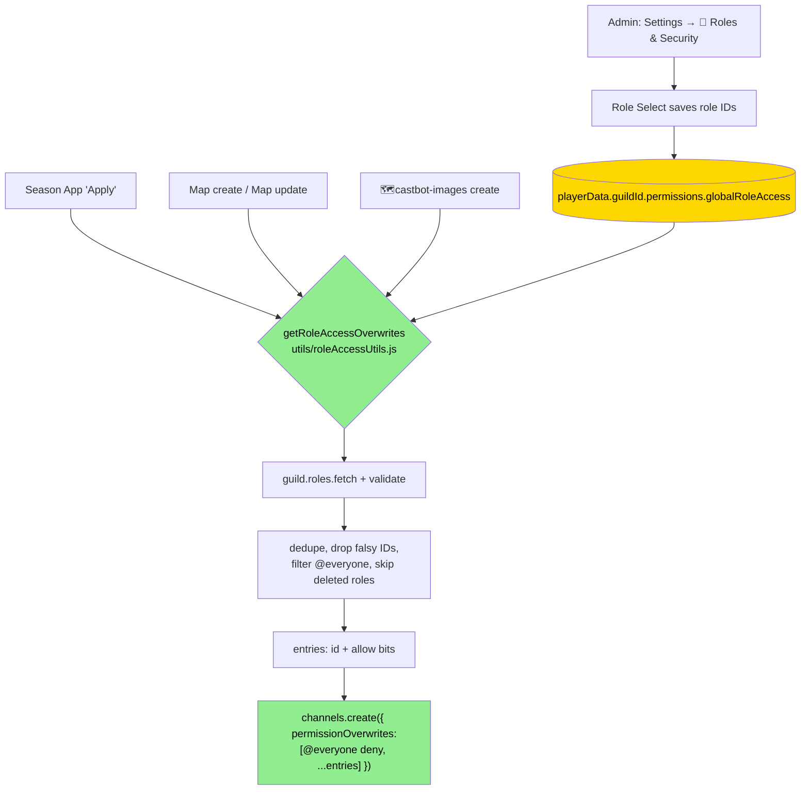

# 🔐 Roles & Security (`globalRoleAccess`)

**Status**: Active (Safari extension shipped 2026-07-10)

## Overview

Roles & Security lets server admins whitelist Discord roles that should have CastBot access **without** holding blanket Discord admin permissions. The trigger problem: many servers don't give their production team the Administrator permission, so prod members (other than the server owner) couldn't see CastBot's private channels.

Whitelisted roles receive **channel permission overwrites at channel-creation time** on channels CastBot creates. This is a *channel visibility* feature — it does **not** (yet) make members CastBot admins for menus/handlers (see [Future Work](#future-work)).

## UI & Configuration

- **Path**: `/menu` → Settings → ⚙️ Advanced → 🔐 Roles & Security
- **UI**: Role Select (type 6, min 1, max 10, pre-filled with current whitelist) + `Clear All Roles` (Danger) + `← Back to Settings`. Builder: `createRolesSecurityUI()` in `safariConfigUI.js`
- **Storage**: `playerData[guildId].permissions.globalRoleAccess` — array of up to 10 role IDs
- **Handlers** (app.js, ButtonHandlerFactory, gated on `MANAGE_ROLES`): `castbot_roles_security` (open), `castbot_roles_security_select` (save selection), `castbot_roles_security_clear` (empty the list). Registry entries in `buttonHandlerFactory.js`
- **Reset safety**: the Safari "Reset" confirmation explicitly does NOT clear the whitelist

## Enforcement Points

| System | Channels affected | When | Bits granted | Bits constant |
|---|---|---|---|---|
| Season Applications (`applicationManager.js`) | Application channel | On "Apply" (creation) | ViewChannel, SendMessages, ReadMessageHistory | `APPLICATION_CHANNEL_ACCESS` |
| Safari Map create (`mapExplorer.js`) | Map location channels (`#📍a1`…), 🗺️ Map Explorer categories incl. overflow "Group N" categories | At channel creation (overwrites ride `channels.create()`) | ViewChannel, SendMessages, ManageChannels | `SAFARI_CHANNEL_ACCESS` |
| Safari Map **update** (`updateMapImage`) | All existing location channels + their categories | Merged onto existing channels via per-role `permissionOverwrites.edit()` (`🔐 [MAP_UPDATE]` logs) | ViewChannel, SendMessages, ManageChannels | `SAFARI_CHANNEL_ACCESS` |
| 🗺️castbot-images (`findOrCreateImageStorageChannel` in [src/images/imageStorageChannel.js](../../src/images/imageStorageChannel.js); formerly 🗺️map-storage — legacy-named channels are adopted and renamed on find) | Hidden image-storage channel | At creation **and ensured on find** — the channel survives map deletion, so creation-only could never reach existing guilds (`🔐 [CASTBOT_IMAGES]` logs) | ViewChannel, SendMessages, ManageChannels | `SAFARI_CHANNEL_ACCESS` |

Location channels do **not** sync permissions from their category — every channel carries explicit overwrites, so the grant is applied at each creation site individually.

Whispers need no special handling: they post into existing location channels and inherit their permissions.

## When Grants Are (and Aren't) Applied

Grants are applied **during CastBot channel operations** — create a map, update a map, apply to a season. Changing the whitelist by itself does *not* sweep existing channels (explicit design decision, 2026-07-10):

- No surprise mass-mutation of live game channels on a Settings click
- No rate-limit burst outside an operation the admin explicitly triggered

To push a new whitelist onto an existing Safari map, run **Map Explorer → Update Map** (it merges grants onto all existing location channels, categories, and the 🗺️castbot-images storage channel before regenerating images). The ensure path (`ensureRoleAccessOnChannels`) uses per-role `permissionOverwrites.edit()` merges with a cache pre-check — already-granted roles cost zero API calls, and player/member overwrites are never disturbed. Player-level permission changes (movement, pause, deinit) likewise use per-member `.edit()` merges and **never disturb** role overwrites.

## System Flow



## Helper API — `utils/roleAccessUtils.js`

```javascript
import { getRoleAccessOverwrites, SAFARI_CHANNEL_ACCESS, APPLICATION_CHANNEL_ACCESS } from './utils/roleAccessUtils.js';

// Compute ONCE per operation, spread into every channels.create() in that operation:
const roleAccessEntries = await getRoleAccessOverwrites(guild, SAFARI_CHANNEL_ACCESS, {
  playerData,              // optional — pass if already loaded (zero extra I/O); else loaded via request-cached loadPlayerData(guild.id)
  logPrefix: 'MAP_CREATE'  // log tag: 🔐 [MAP_CREATE] Added globalRoleAccess role: ...
});

permissionOverwrites: [
  { id: guild.roles.everyone.id, deny: [PermissionFlagsBits.ViewChannel] }, // caller owns deny semantics
  ...roleAccessEntries
]
```

- `buildRoleAccessEntries({ roleIds, validRoleIds, everyoneRoleId, allow })` — the pure, I/O-free core (unit-tested)
- `ensureRoleAccessOnChannels(guild, channels, allow, { playerData, logPrefix })` — MERGE grants onto **existing** channels (per-role `.edit()`, never `.set()`); dedupes channels, skips roles already fully granted (cache check, no API call), per-channel errors are logged but non-fatal. Returns the number of overwrites actually edited. Used by Map Update and the map-storage find path.
- `hasAllRequiredBits(existingAllow, requiredBits)` — pure skip-check used by the ensure path (unit-tested)
- **Rule for new features**: any new CastBot function that creates access-restricted channels should call `getRoleAccessOverwrites` with an appropriate bits constant and spread entries **after** your `@everyone` deny. If your feature *reuses* long-lived channels, also call `ensureRoleAccessOnChannels` on them.

## Edge Cases & Failure Modes

- **Deleted whitelisted role**: skipped at creation with `🔐 [PREFIX] Skipping invalid globalRoleAccess role` warning; not removed from stored data. Stale overwrites on existing channels are inert (Discord prunes deleted-role overwrites).
- **`@everyone` in the whitelist**: filtered by the helper. Load-bearing — a stored `guild.id` would collide with the caller's `@everyone` deny entry (duplicate overwrite ID) and fail the entire `channels.create()` call, bricking map creation.
- **Bot must hold granted bits**: Discord requires the creator to hold any permission it allows in overwrites. Map creation's pre-flight (`createMapGridWithCustomImage`) requires ManageChannels + ManageRoles before any channel is created. Storage-channel creation outside the map flow shares the same failure class that private-channel creation already has (50013) — no new failure mode.
- **Zero rate-limit cost**: overwrites ride the existing `channels.create()` calls; the only extra API call is one `guild.roles.fetch()` per operation, and only when the whitelist is non-empty.
- **Spoiler surface**: whitelisted roles can see 🗺️castbot-images (full map originals + per-cell fog maps + uploaded location images). Intentional — the whitelist is for trusted production staff.

## Future Work

`globalRoleAccess` as an **OR condition in `hasAdminPermissions()`** — unlocking Production Menu and admin-gated features, not just channel visibility. Design considerations (member role list + guildId plumbing, playerData load per permission check, caching) are tracked in [SecurityArchitecture.md → Target State](../infrastructure-security/SecurityArchitecture.md). Not implemented.

## Testing

`tests/roleAccessUtils.test.js` — 14 cases over the pure core (replicated inline per [TestingStandards](../standards/TestingStandards.md)): empty/null whitelist, happy path, deleted-role skip, `@everyone` filter, dedupe, bit-set pass-through (guards ManageChannels leaking into application channels), composition invariant, falsy-ID safety.
