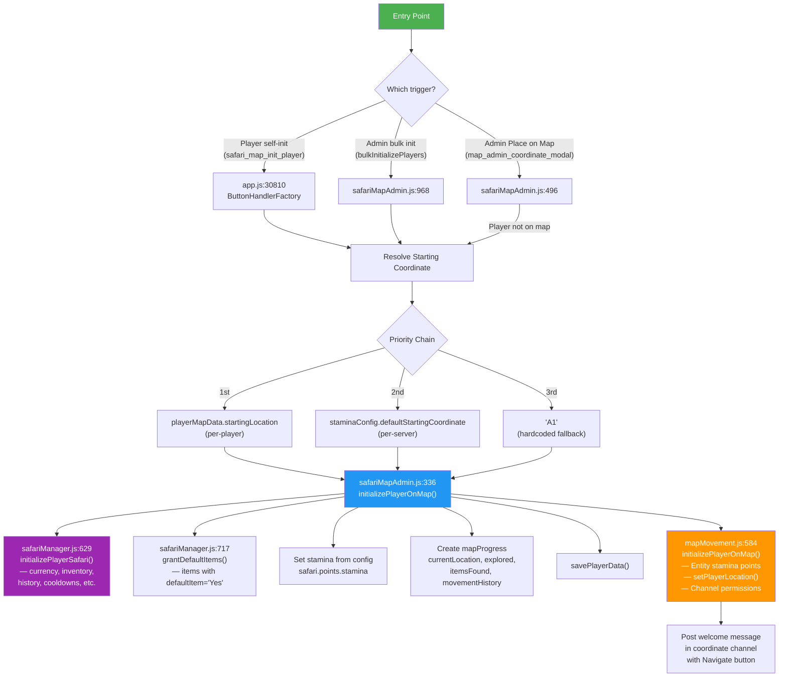
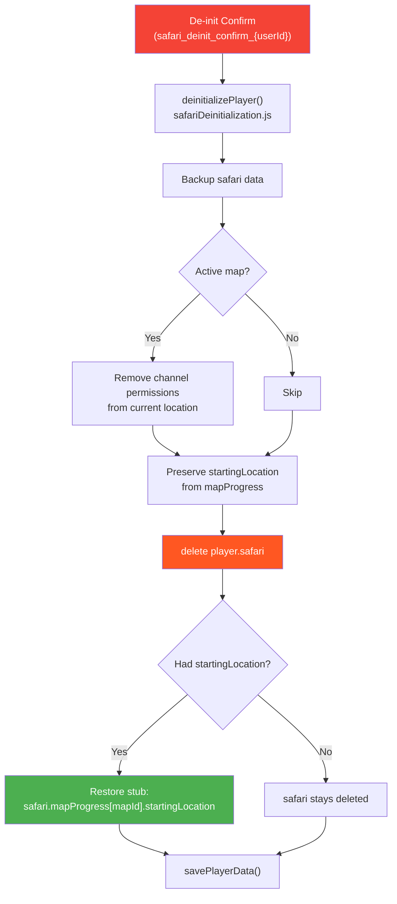

# Safari Player Initialization

**Moved from**: `docs/01-RaP/0957_20260228_SafariInitialization_Analysis.md`
**Original Date**: 2026-02-28
**Promoted to Feature Doc**: 2026-03-08
**Related**: Per-player starting location feature (commits 0434aa6e, 38810359, 086c8baa)

---

## Overview

Safari player initialization sets up a player's safari data structures, grants starting currency/items, places them on the map, and posts a welcome message. The process is admin-driven (bulk or per-player) or player-driven (self-init button).

---

## Architecture: Two Modules, One Initialization

Safari initialization is split across two modules that both have functions named `initializePlayerOnMap()`.

| Module | Function | Role |
|--------|----------|------|
| `safariMapAdmin.js:336` | `initializePlayerOnMap()` | **Orchestrator** — safari data, stamina, currency, inventory, map progress, welcome message |
| `mapMovement.js:584` | `initializePlayerOnMap()` | **Channel worker** — entity stamina points, player location record, Discord channel permissions |

The orchestrator calls the channel worker internally (line 417-420).

---

## Entry Points

Three entry points exist. All resolve a starting coordinate then call the orchestrator.

### 1. Player Self-Init (`safari_map_init_player`) — app.js:30810

**Trigger**: Player clicks "Start Exploring" in `/menu` → Map Explorer.

```
1. Check active map exists
2. Check player NOT already initialized (uses playerMapData?.currentLocation)
3. Resolve starting coordinate (per-player > server default > 'A1')
4. Call initializePlayerOnMap(guildId, userId, coordinate, client)
5. Return ephemeral "Welcome!" with channel link
```

### 2. Admin Bulk Init (`bulkInitializePlayers`) — safariMapAdmin.js:968

**Trigger**: Admin selects players via Start Safari UI, clicks "Start Safari".

```
1. For each selected userId:
2. Check if already initialized (loose check: currency || inventory || points)
3. Resolve starting coordinate (per-player > server default > 'A1')
4. Call initializePlayerOnMap(guildId, userId, coordinate, client)
5. Log via safariLogger
6. Return results array with per-player status
```

### 3. Admin Place on Map (`map_admin_coordinate_modal`) — safariMapAdmin.js:496

**Trigger**: Admin submits Location modal for an uninitialized player.

```
1. If player has no mapProgress → call initializePlayerOnMap(guildId, userId, coordinate)
2. If player already on map → use movePlayer() instead
```

---

## Initialization Flow



---

## Config Resolution: Decision Trees

### Starting Location

```
Caller resolves coordinate BEFORE calling initializePlayerOnMap():
│
├─ Does player have safari.mapProgress[mapId].startingLocation?
│   ├─ YES → use that (per-player override, survives de-init)
│   └─ NO ↓
│
├─ Does safariConfig.defaultStartingCoordinate exist?
│   (via getStaminaConfig() → getCustomTerms())
│   ├─ YES → use that (per-server config)
│   └─ NO → 'A1' (hardcoded fallback)
│
└─ Coordinate passed to initializePlayerOnMap(guildId, userId, coordinate)
    │
    └─ REDUNDANT SAFETY NET (line 345): if coordinate is falsy,
       function also falls back to staminaConfig.defaultStartingCoordinate
```

**Important**: The per-player `startingLocation` is resolved **at the call site**, not inside `initializePlayerOnMap()`. If a new caller passes `coordinate = null`, it gets server-default behavior but **skips** the per-player override.

| Level | Storage | Set By | UI |
|-------|---------|--------|-----|
| Per-player | `playerData → safari.mapProgress[mapId].startingLocation` | Location modal | Player Admin → Location |
| Per-server | `safariContent → safariConfig.defaultStartingCoordinate` | Stamina Settings modal | Prod Menu → Safari → Settings |
| Fallback | `'A1'` hardcoded | N/A | N/A |

### Starting Currency

```
initializePlayerOnMap() lines 351-361:
│
├─ Read defaultCurrency:
│   └─ safariData[guildId].safariConfig.defaultStartingCurrencyValue ?? 100
│       ├─ Config exists → use it (integer, set via Edit Safari Config modal)
│       └─ Config missing → 100 (hardcoded fallback)
│
├─ Read existingCurrency:
│   └─ playerData[guildId].players[userId].safari.currency || 0
│       ├─ Player has pre-existing currency (from admin Edit Gil) → preserve it
│       └─ No prior currency → 0
│
├─ Call initializePlayerSafari() — creates structure, sets currency = defaultCurrency
│   (overwritten immediately on next line)
│
└─ Final currency = existingCurrency + defaultCurrency (ADDITIVE)
    │
    Examples:
    ├─ Fresh player, config=100:        0 + 100 = 100
    ├─ Admin gave 50 pre-init:         50 + 100 = 150
    └─ Re-init after de-init:          (whatever survived) + 100
```

**No centralized getter.** The `?? 100` pattern is inline at `safariMapAdmin.js:351`. `getCustomTerms()` also reads this value (for display) but `initializePlayerOnMap` reads `safariConfig` directly.

### Default Items

```
grantDefaultItems(playerData, guildId, userId) — safariManager.js:717
│
├─ Does player have safari.inventory?
│   ├─ NO → return (warn, grant nothing)
│   └─ YES ↓
│
├─ Get all items for guild: safariData[guildId].items
│   └─ Filter: item.metadata.defaultItem === 'Yes'
│       ├─ No items match → return (grant nothing)
│       └─ Found N default items ↓
│
└─ For each default item:
    ├─ Does item still exist in safariData?
    │   ├─ NO → skip (warn, item was deleted)
    │   └─ YES ↓
    │
    └─ Add to inventory:
        ├─ Player doesn't have it → inventory[itemId] = 1
        └─ Player already has it → inventory[itemId] += 1 (ADDITIVE)
```

**Note**: Items are +1 per init. No "already granted" tracking. Re-init grants another copy of each default item.

### Starting Stamina

```
getStaminaConfig(guildId) — safariManager.js:8891
│
├─ startingStamina:
│   ├─ safariConfig.startingStamina exists → use it
│   └─ fallback → parseInt(process.env.STAMINA_MAX || '1')
│
├─ maxStamina:
│   ├─ safariConfig.maxStamina exists → use it
│   └─ fallback → parseInt(process.env.STAMINA_MAX || '1')
│
├─ regenerationMinutes:
│   ├─ safariConfig.staminaRegenerationMinutes exists → use it
│   └─ fallback → parseInt(process.env.STAMINA_REGEN_MINUTES || '3')
│
└─ defaultStartingCoordinate:
    └─ customTerms.defaultStartingCoordinate || 'A1'
```

---

## Config Resolution Symmetry

| Resource | Has centralized getter? | Fallback chain | Per-player override? |
|----------|------------------------|----------------|---------------------|
| **Location** | Yes (`getStaminaConfig`) | per-player `startingLocation` → `safariConfig.defaultStartingCoordinate` → `'A1'` | Yes (but resolved at call site) |
| **Currency** | No (inline `?? 100`) | `safariConfig.defaultStartingCurrencyValue` → `100` | No |
| **Items** | Yes (`getDefaultItems`) | `metadata.defaultItem === 'Yes'` → nothing | No |
| **Stamina** | Yes (`getStaminaConfig`) | `safariConfig` → `.env` → hardcoded | No |

### Architectural Gap: Currency

Currency is the only initialization resource without a centralized getter function. The `?? 100` fallback appears at:
- `safariMapAdmin.js:351` (orchestrator)
- `safariManager.js:6362` (other usage)

A `getStartingCurrency(guildId)` function would match the pattern of `getStaminaConfig()` and `getDefaultItems()`. This would be needed before adding any new initialization entry point.

---

## Reusability Assessment

The orchestrator function signature is clean and reusable:

```javascript
initializePlayerOnMap(guildId, userId, coordinate = null, client = null)
```

**What works well for new callers:**
- `coordinate = null` → falls back to server default automatically
- `client = null` → silent init (no welcome message, no channel permissions)
- Handles first-init and re-init (preserves `startingLocation` through cycles)
- Idempotent-safe: `initializePlayerSafari()` has defensive checks for all fields

**What new callers must know:**
1. Per-player `startingLocation` is resolved at the call site, not inside the function — pass `null` to skip it, or replicate the lookup
2. The `isPlayerInitialized()` check (`safari.points !== undefined`) is the canonical check — but `bulkInitializePlayers` uses a looser check (also checks currency/inventory)
3. Currency is additive — re-initializing a player gives them *another* defaultCurrency on top of existing

---

## "Is Initialized" — Single Source of Truth

```javascript
// safariPlayerUtils.js:16
export function isPlayerInitialized(player) {
  return player?.safari?.points !== undefined;
}
```

`safari.points` is ONLY set by `initializePlayerOnMap()`. Currency and inventory can exist pre-initialization (via admin Edit Gil / Edit Items), so they are not reliable indicators.

**Inconsistency**: `bulkInitializePlayers()` (line 985) uses a looser check: `currency || inventory || points`. This catches pre-init stubs but is not the canonical check.

---

## De-Initialization Flow



### What Survives De-Init

| Data | Preserved? | Notes |
|------|-----------|-------|
| `startingLocation` | Yes | Explicit preservation logic |
| `currency` | No | Backed up but not restored |
| `inventory` | No | Backed up but not restored |
| `mapProgress.currentLocation` | No | Player removed from map |
| `points/stamina` | No | Reset on re-init |
| `exploredCoordinates` | No | Reset on re-init |
| `movementHistory` | No | Reset on re-init |

---

## Data Structures

### playerData.json (per player)
```javascript
players[userId] = {
    safari: {
        // Core (set by initializePlayerSafari)
        currency: 100,
        inventory: { "item_123": 1 },
        history: [],
        achievements: [],
        cooldowns: {},
        buttonUses: {},
        storeHistory: [],
        lastInteraction: 1703001234567,

        // Map (set by initializePlayerOnMap)
        mapProgress: {
            "map_7x7_1753981993871": {
                currentLocation: "C2",
                startingLocation: "D1",
                exploredCoordinates: ["A1", "B1", "C2"],
                itemsFound: [],
                movementHistory: [
                    { from: null, to: "A1", timestamp: "..." },
                    { from: "A1", to: "B1", timestamp: "..." }
                ]
            }
        },

        // Stamina (set by initializePlayerOnMap)
        points: {
            stamina: {
                current: 1,
                maximum: 1,
                lastRegeneration: "2026-02-28T...",
                regenConfig: "hourly"
            }
        },

        isPaused: false
    }
}
```

### safariContent.json (entity points — separate storage)
```javascript
entityPoints: {
    "player_391415444084490240": {
        "stamina": {
            current: 1,
            max: 1,
            lastRegeneration: 1703001234567,
            lastUse: 1703001234567
        }
    }
}
```

**Dual stamina storage**: `safari.points.stamina` (playerData) and `entityPoints` (safariContent) can drift out of sync. Movement system reads entityPoints; admin UI reads safari.points.

---

## Historical Bugs (All Fixed)

### BUG 1: Self-Init Broken After De-Init With StartingLocation
- **Was**: `if (playerMapData)` matched stub `{ startingLocation: 'D1' }`, showing "already on map at **undefined**"
- **Fixed**: Now checks `playerMapData?.currentLocation` (app.js:30836)

### BUG 2: initializePlayerOnMap Overwrites startingLocation
- **Was**: Map progress assignment nuked preserved `startingLocation`
- **Fixed**: Now preserves via spread: `...(existingStartingLocation && { startingLocation: existingStartingLocation })` (safariMapAdmin.js:400)

### BUG 3: initializePlayerSafari Skips Currency When Stub Exists
- **Was**: After de-init with startingLocation, safari stub existed so full init block was skipped, leaving `currency: undefined`
- **Fixed**: Defensive check added: `if (safari.currency === undefined) { safari.currency = defaultCurrency }` (safariManager.js:654-657)

---

## Key Files

| File | What | Lines |
|------|------|-------|
| `safariMapAdmin.js` | Orchestrator: `initializePlayerOnMap()`, `bulkInitializePlayers()` | 336-483, 968-1055 |
| `safariManager.js` | `initializePlayerSafari()`, `grantDefaultItems()`, `getStaminaConfig()` | 629-683, 717-758, 8891-8923 |
| `safariPlayerUtils.js` | `isPlayerInitialized()`, `getInitializedPlayers()` | 1-50 |
| `mapMovement.js` | Channel worker: `initializePlayerOnMap()` | 584+ |
| `safariDeinitialization.js` | `deinitializePlayer()` | — |
| `safariStartSafari.js` | Start Safari UI (bulk init) | — |
| `app.js` | Button handlers for self-init and admin init | 30810, 31599 |
