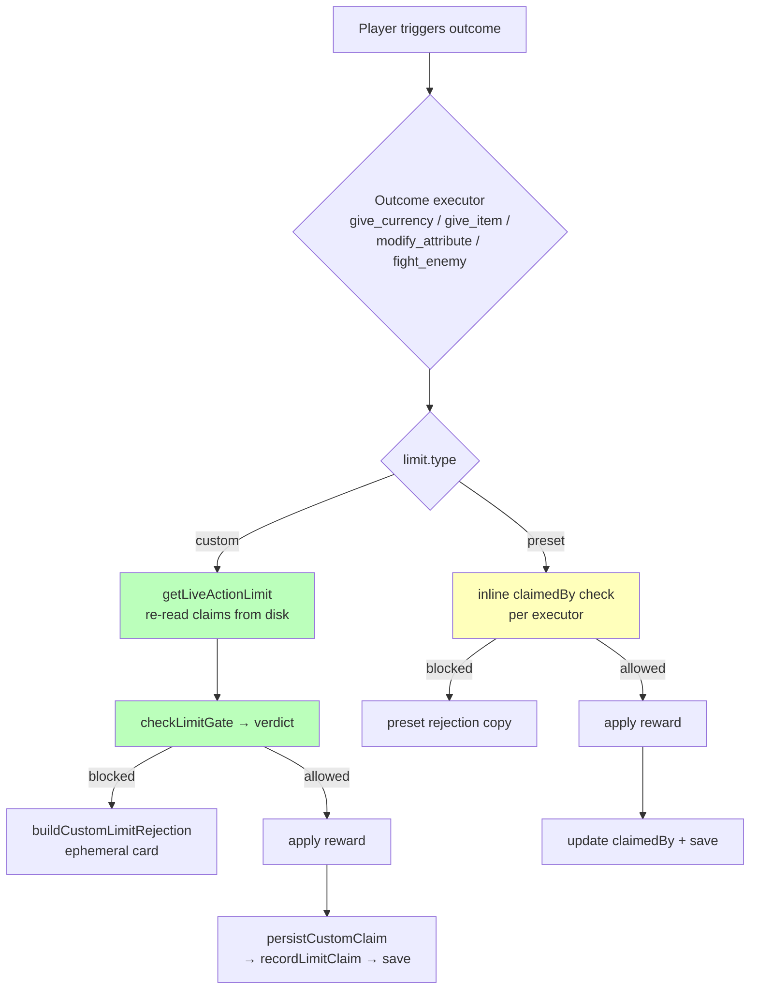

# Safari Usage Limits

**Status**: ✅ Active (in production since 2026-06-23)
**Scope**: Claim-gating for Safari **outcomes** — `give_currency`, `give_item`, `modify_attribute`, `fight_enemy`
**Related**: [SafariCustomActions](SafariCustomActions.md) (the Actions/Outcomes system limits attach to), [Attributes](Attributes.md), [EnemySystem](EnemySystem.md)
**Code**:
- `utils/periodUtils.js` — pure engine (`checkLimitGate` / `recordLimitClaim` + custom-window math) **and** the shared option/summary builders
- `safariManager.js` — the four outcome executors + `buildCustomLimitRejection` (player-facing copy)
- `customUsageLimitUI.js` — the ⚙️ Custom sub-config screen + Usage Template storage
- `claimsManager.js` / `claimsUI.js` — the admin "Player Claims" surface
- `app.js` — routing (`cl:` selects/buttons, `clm:` modal submits)
- Tests: `tests/periodUtils.test.js`, `tests/claimsManager.test.js`

> **Promotion note:** this document began as **RaP 0905** (deep analysis, 2026-06-23) and was promoted to a feature doc once the work shipped. The original design analysis and the verbatim trigger prompts are preserved below under [Design & Rationale](#-design--rationale-from-rap-0905).

---

## Overview

A **usage limit** lives at `action.config.limit` on a rewarding outcome and decides whether a given player may claim that outcome *right now*. There are five types — four fixed **presets** plus the configurable **Custom** type that exposes the whole design space — and a server-level **Usage Template** facility for saving and reusing Custom configs.

| Type | What it does | Tracking field | Scope |
|---|---|---|---|
| `unlimited` | Fire forever, no tracking | — | — |
| `once_per_player` | Each player once, ever | `claimedBy: []` (array of userIds) | per-player |
| `once_globally` | One player ever, total | `claimedBy: "userId"` (string) | global |
| `once_per_period` | Per-player rolling cooldown (e.g. once every 12h from *your* last use) | `claimedBy: { uid: ts }` (object) | per-player |
| `custom` | Orthogonal `maxClaims × scope × unique × reset` — covers everything above **and** new shapes | `claims: [{u,t}]` (array) | per-player or global |

The four presets are just specific corners of the Custom space (see [Custom limits](#custom-limits)). They are kept as first-class types for backward compatibility and zero-regression risk — **custom is additive**, the preset code paths are untouched.

### Where limits are enforced



> **Architecture note:** the **custom** type is fully delegated to the shared pure engine in `periodUtils.js`. The four **presets** still use their own inline `claimedBy` logic inside each executor (a known duplication — full migration onto the engine is deferred). `fight_enemy` was the first consumer of the shared engine (Tier B fix); this feature made it the path for custom across all four outcomes.

## The four presets

- **Unlimited** — default; no tracking, always allowed.
- **Once Per Player** — `claimedBy` is an array of userIds; blocked if the player is in it.
- **Once Globally** — `claimedBy` is a single userId; blocked for *everyone* once set (including the original claimer). Empty array/string are treated as "no claims" (the **empty-but-truthy hazard** — `[]`/`''` are truthy but mean unclaimed).
- **Once Per Period** — `claimedBy` is `{ userId: lastClaimMs }`; blocked while `now - last < periodMs`, reported with a countdown. This is a **per-player** rolling cooldown; `custom` with `scope:per_player, reset:rolling, maxClaims:1` reduces to exactly this.

## Custom limits

The Custom type (`type: 'custom'`) decomposes a usage limit into four orthogonal dimensions:

| Dimension | Values | Notes |
|---|---|---|
| **maxClaims (N)** | `1`, `N`, or `null` (uncapped) | how many claims allowed |
| **scope** | `per_player` · `global` | each player gets own N, or N shared server-wide |
| **unique** | `true` (distinct players) · `false` (total claims) | **global only**; ignored for per-player |
| **reset** | `none` · `rolling` · `fixed_window` | never resets / per-claim sliding window / shared recurring window |

New capabilities this unlocks that the presets can't express: *"first N players globally, no time limit"*, *"N unique players per fixed daily window"*, *"each player N times per fixed window"*, *"N claims per player on a rolling cooldown"*.

Custom tracking uses a dedicated `claims: [{u, t}]` array (never `claimedBy`) — this sidesteps the empty-but-truthy hazard entirely and keeps the presets byte-for-byte unchanged. The window a claim belongs to is **derived** from its timestamp `t`, never stored; stale claims are pruned lazily on each record (no cron). See **⚙️ Engine Logic** in the Design & Rationale section below for the math.

### The ⚙️ Custom sub-config screen

Selecting **⚙️ Custom…** in any outcome's Usage Limit select opens a dedicated LEAN Components V2 screen (`buildCustomLimitConfigUI` in `customUsageLimitUI.js`, routed under `cl:`):
- **Max Claims** select (1/2/3/5/10/25 + Unlimited + Other→modal)
- **Scope** select (Per Player / Global)
- **Unique** select (Distinct players / Total claims) — shown only when scope is Global; *distinct* is the recommended default
- **Reset** select (Never / Rolling cooldown / Fixed window) → reveals timing buttons:
  - **Window Length** (D/H/M modal, default 24h)
  - **Reset Time** (hh:mm modal, fixed_window only) — server-local time-of-day, anchored to the most-recent boundary ≤ now so it's active immediately on save
- **← Save & Back**, **Save as Template**, and (in template-edit mode) **Delete Template**

## Usage Templates

A **Usage Template** is a server-saved Custom config (stored at `safariData[guildId].usageTemplates`, capped at `MAX_USAGE_TEMPLATES = 5`). Once saved, the template appears as its own option in every outcome's Usage Limit select, so a complex config can be applied in one click.

- **Save** — "Save as Template" on the Custom screen captures the current config (strips `type`/`claims`/`templateId`) under a name + emoji.
- **Apply** — selecting a `tmpl:<id>` option copies the template's config onto the outcome (`{ type:'custom', ...template.config, templateId:id, claims:[] }`). Templates are stored as **copies** — editing a template never retro-mutates live outcomes, and `templateId` is provenance only (never affects behavior).
- **Delete** — runs a **usage scan** (`findTemplateUsages`): if the template is referenced by any outcome it **refuses** and lists where it's used, telling the admin to deal with those first (no cascade delete).

## Player Claims (admin)

The "Player Claims" admin surface (`claimsManager.js` / `claimsUI.js`) lets admins inspect and reset who has claimed an outcome, for **all** limit types including custom:
- View claimants with per-window claim counts and reset/cooldown countdowns
- **Manual Claim** (add a claim for a player), **Reset All**, and per-player clear
- For `once_per_period` / custom-timed limits, set a player's remaining cooldown (admin override may exceed the period via a future timestamp)

## Player-facing rejection messages

When a custom limit blocks a claim, `buildCustomLimitRejection` (in `safariManager.js`) returns an ephemeral card. Copy is tailored by verdict reason:

| Reason | When | Message shape |
|---|---|---|
| `custom_already_claimed` | global+unique, this player already claimed (others may still have slots) | `⏱️ **<label>** — you've already claimed this. Resets in **<countdown>**.`<br/>`-# > Nx <unit> remaining for other players until reset.` |
| `custom_window` | global window cap exhausted by anyone | `⏱️ **<label>** — the maximum amount available every **<period>** has already been claimed. Resets in **<countdown>**.` |
| `custom_cooldown` | rolling cooldown, this player | `⏱️ **<label>** — you can only claim this every **<period>**. Try again in **<countdown>**.` |
| `custom_exhausted` | permanent (reset:none) cap reached | `❌ **<label>** — no claims remaining.` |

The **"Nx \<unit\> remaining for other players until reset"** sub-line (added 2026-06-25) appears only on `custom_already_claimed` (a global type), where `N = verdict.remaining.claimsLeft` = `maxClaims − distinct claimants so far`. The unit noun is the item name for `give_item` (`3x Salt …`) and `stash of <currencyEmoji> <currencyName>` for `give_currency` (`3x stash of 🪙 Coins …`) — currency always uses the **per-server custom currency name/emoji** from `getCustomTerms()`, never a hardcoded "Coins". Durations are spelled out ("3 hours 5 minutes") via `formatCountdownVerbose`.

---

## 🤔 Design & Rationale (from RaP 0905)

> The remainder of this document is the original RaP 0905 deep analysis (2026-06-23), preserved verbatim for design context. Line numbers and "Implementing" status references are historical.

---

## 🤔 Plain English Problem

CastBot's Safari outcomes (give currency / give item / modify attribute / fight enemy) support exactly four usage limits, each a single fixed behaviour:

- **unlimited** — fire forever
- **once_per_player** — each player once, ever
- **once_globally** — one player ever, total
- **once_per_period** — per-player rolling cooldown (e.g. "once every 12h, counted from *your* last use")

A user needs combinations we can't currently express, e.g. **"let up to 5 unique players claim this, resetting every day."** Breaking that down reveals the four modes are actually points in a space of **orthogonal dimensions**:

| Dimension | Values |
|---|---|
| **maxClaims (N)** | 1, N, or unlimited |
| **scope** | per-player (each player gets own N) · global (N shared server-wide) |
| **unique** | distinct players vs total claims (global only) |
| **reset** | none · rolling (per-user cooldown) · fixed_window (shared recurring window) |

The existing four are just specific corners:
- `once_per_player` = N1 · per_player · none
- `once_globally` = N1 · global · unique · none
- `once_per_period` = N1 · per_player · rolling
- `unlimited` = N∞

The ask: a **Custom** option exposing the whole space, plus **Usage Templates** (server-saved Custom configs, max 5, reusable as their own select option). New discrete capabilities this unlocks that we never had: "first N players globally, no time limit"; "N unique players per fixed daily window"; "each player N times per fixed window".

## 🏛️ Historical Context

Enforcement grew organically and is duplicated:
- `utils/periodUtils.js` has pure `checkLimitGate()` / `recordLimitClaim()` — but only `fight_enemy` uses them (added in the Tier B fix).
- `executeGiveCurrency` / `executeGiveItem` / `executeModifyAttribute` each have their **own inline** copy of the check + claim logic (3× duplication), with per-type rejection messages (currency name / item emoji+name / attribute name).
- `claimsManager.js` + `claimsUI.js` are a newer admin "Player Claims" surface — a *fourth* copy of polymorphic `claimedBy` handling.

The data lives at `action.config.limit = { type, claimedBy, periodMs }`, where `claimedBy` is polymorphic: array (per_player), string (globally), object `{uid: ts}` (per_period). The **empty-but-truthy hazard** (`[]` and `''` are truthy but mean "no claims") forced normalization code everywhere.

## 💡 Solution

**One engine, additive custom type, new tracking field.**

1. **`type: 'custom'` uses a NEW `claims: [{u, t}]` array** — never `claimedBy`. This sidesteps the empty-but-truthy hazard and leaves the 4 presets byte-for-byte unchanged. Window index is derived from each claim's timestamp `t`, never stored.

2. **Extend the pure engine** `checkLimitGate()` / `recordLimitClaim()` in `periodUtils.js` to handle `custom`. fight_enemy already routes through it. The 3 inline executors get an **additive `custom` branch** (existing preset code untouched → zero regression risk; full migration deferred).

3. **Fixed-window = interval-recurring** (decided with user): `anchorMs` (absolute) + `periodMs`. `windowIndex = floor((now - anchorMs)/periodMs)`; claims from prior indices are stale (lazy reset, no cron). Modeled on `pointsManager.js` `full_reset` regen math. DST drift accepted for v1 (no guild-wide timezone infra exists).

4. **Templates stored as COPIES** with a `templateId` provenance tag. Editing a template never retro-mutates live outcomes; claims always live per-outcome. Delete scans usages and refuses (no cascade), listing where it's used.

### Decided design questions (user, 2026-06-23)

- **Fixed-window model** → **Interval recurring reset** (anchor + period; DST drift OK; no TZ infra).
- **Anchor entry** → **`hh:mm` only** (no date). "Day is redundant"; don't care if the time already passed today → anchor to the **most-recent** `hh:mm` boundary ≤ now, so it's active as soon as saved. `hh:mm` interpreted in **server-local time** for v1 (documented; per-guild TZ deferred). Period defaults to 24h, overridable via the existing D/H/M modal.
- **Unique toggle** → **Include it**, with **unique as the recommended default** and clear label/description copy explaining "N distinct players" vs "N total claims".
- **Usage Templates in v1** → Yes. Cap 5/server. Clicking a template option opens the Custom config UI prefilled + a Delete button (delete = usage scan, refuse-and-report if in use).

## 📐 Data Schemas

`config.limit` when `type:'custom'`:
```json
{
  "type": "custom",
  "maxClaims": 5,            // integer ≥1, or null = uncapped
  "scope": "global",         // 'per_player' | 'global'
  "unique": true,            // global only; ignored for per_player
  "reset": "fixed_window",   // 'none' | 'rolling' | 'fixed_window'
  "periodMs": 86400000,      // required when reset != 'none'
  "anchorMs": 1750000000000, // required when reset == 'fixed_window'
  "templateId": "tmpl_…",    // optional provenance only (never affects behavior)
  "claims": [ { "u": "userId", "t": 1750003600000 } ]
}
```

`safariData[guildId].usageTemplates` (cap `MAX_USAGE_TEMPLATES = 5`):
```json
{
  "tmpl_1750000000000": {
    "id": "tmpl_1750000000000",
    "name": "Daily 5 Unique",
    "emoji": "🗓️",
    "config": { "maxClaims":5, "scope":"global", "unique":true, "reset":"fixed_window", "periodMs":86400000, "anchorMs":1750000000000 },
    "metadata": { "createdBy":"uid", "createdAt":0, "lastModified":0 }
  }
}
```
Apply: `action.config.limit = { type:'custom', ...template.config, templateId:id, claims:[] }`.

## ⚙️ Engine Logic

- `windowIndexOf(t, anchorMs, periodMs)` = `Math.floor((t - anchorMs)/periodMs)`
- `relevantClaims(limit, now)`: none→all; fixed_window→same window index as now; rolling→`now - t < periodMs`
- `pruneCustomClaims(limit, now)`: drop stale (prior window / older than period) on every record
- **Decision** (in `checkLimitGate` custom branch):
  - per_player: `mine = rel.filter(u===userId)`; blocked if `maxClaims!=null && mine.length>=maxClaims`
  - global + !unique: blocked if `rel.length>=maxClaims`
  - global + unique: blocked `custom_already_claimed` if user in `rel`; else blocked `custom_exhausted` if `distinct>=maxClaims`
  - `windowResetMs = anchorMs + (windowIndex+1)*periodMs - now`; `cooldownMs` (rolling) = earliest relevant claim + period − now
- Verdict (additive — presets keep `{blocked, reason, remainingMs}`): adds `reason: 'custom_exhausted'|'custom_window'|'custom_cooldown'|'custom_already_claimed'` + `remaining: { claimsLeft, windowResetMs, cooldownMs }`.
- `rolling` with N>1 = sliding window (≤N claims within trailing periodMs). N=1 reduces exactly to once_per_period.

## 🖥️ UI

A generic Custom sub-config screen (LEAN, Components V2 UPDATE, in `customUsageLimitUI.js`), keyed by `type:buttonId:actionIndex[:itemId]`:
- Summary line + Max Claims select (1/2/3/5/10/25/∞ + Other→modal) + Scope select + Unique select (global only) + Reset select (none/rolling/fixed_window → opens period &/or hh:mm modal) + buttons (← Back, Save as Template, Delete[template mode]).
- Immediate save for attr/fight; deferred (`dropConfigState`) for item/currency — matches existing handlers.
- `rerenderOutcomeEditor(type, …)` dispatches back to the 4 heterogeneous render fns.
- `buildLimitOptions({…, includeCustom, templates})` surfaces ⚙️ Custom + one option per template (`tmpl:<id>`). quick-create passes `includeCustom:false`.

## ⚠️ Risks / Edge Cases

- **Clone-with-reset** (app.js ~48117) assumes `claimedBy`; must also reset `claims:[]` for custom (else cloned actions carry claimants).
- **`hasUnclaimedSubActions`** (safariManager ~7857) falls through to `false` for unknown types → would mis-report custom as exhausted, blocking consumables. Add custom branch.
- **Legacy fallback loops** (currency/item claim) only handle once_per_player/once_globally and match by amount — guard custom OUT (custom always has buttonId+actionIndex so never needs fallback).
- **Concurrency**: two players taking the Nth global slot can over-claim (load→check→save race). Single-process; documented small window for v1.
- **custom_id 100-char limit**: keep sub-screen ids compact; template id rides in select *values* (100-char OK).
- **DST drift** on 24h windows — documented, interval-based not calendar-based.

## Phasing

**v1 (this build)**: engine custom branch + all 4 executors + sub-config UI on all 4 types + buildLimitOptions + hasUnclaimedSubActions/clone/legacy fixes + claimsManager/UI custom support + Templates (save/apply/delete-with-scan/select-surfacing) + tests.
**Deferred**: per-guild timezone-correct windows, anchor time-of-day beyond hh:mm, "re-apply template to N outcomes" propagation, full template-manager polish, cross-process locking.

---

## 📜 Original Trigger Prompts (verbatim)

### Prompt 1 — the feature request
> Okie, so I've received a fairly complex request for a user:
> They effectively want to combine multiple options, e.g.
> Allow upto 5x unique players to claim / use an action, once every X periods
>
> Breaking it down, I see it like this:
> * Upto 5x unique players: This is /like/ once_per_player, but provides a cap per action usage. So an action with upto 3x players claiming it could have 3 unique players use it, but won't allow one player to use it 3 times, even if the other criteria are met. There are some potentially complex scenarios / use cases we need to think through as part of the design, e.g., if only one player uses an action capped at 3x players per 12 hours, can that player then use it again in hour 13 (the answer is yes, but this is just an example of a potentially complex use case)
> * You can also look at this as similar to once_globally; but it's N_times_globally
> * Once every X periods: Similar to once_per_period; HOWEVER; my understanding from the requirement from the user is it is more time-bound, e.g., we almost set a global time window (e.g., 9AM PST -> 8:59:59 PM PST). Once per period is currently specific to the end user, so that logic breaks here (I'll put an example use case below).
>
> The name for this would be something like: N_times_per_player_per_fixed_window
>
> Because this is quite a large / complex feature; and would introduce discrete functions not already provided by CastBot (e.g., currently you can't let "first 5 players claim an item globally, no time limit); I'm thinking we perhaps design this as a single, unified "Custom" frequency usage UI, which is fairly powerful and configurable; but also build out the underlying atomic functions if we ever want to offer stand-alone discrete options.
>
> My UX / UI thinking is:
> * Where the Usage Limit string select appears, add a custom option [something like  :gear: Custom string select option (description: Allows setting uses per first N players, reset after fixed time windows, etc).]
> * Unlike other string select options, this is complex enough to warrant its own UI following @docs/ui/LeanUserInterfaceDesign.md  (replace with webhook update)
> * UI allows customising all of the options described and per below, likely a button-modal combo (see Items for a good example - is there a @docs/enablers/EntityEditFramework.md use case here)
>
> Some other considerations:
> * Do we want to make the 'non-unique-players' an option (not the core requirement, but some potential use cases); e.g. one player could be the first and claim an action 5 times
> * The ephemeral message to a user who hasn't met the claim requirements needs to be very clear; the Once Per Period message is a good example to follow (state # of players + time period)
> * Perhaps we want a 'Usage Template' feature that adds this as a custom string select option in the server, capped at 5 per server;
> * Lets only design for Tier A / B for now, Tier C has many complexities and not the immediate ask
> * We need the Player Claims feature souped up to support this and definitely allow fine grained resetting.
> * We have several hour/minute/second UI Input (scheduled actions modal comes to mind) to lean on
>
> Ultrathink plan this out, identify any solution design options and recommendations and tldr. The biggest technical challenge I see is the absolute time tracking - mainly because it isn't a pattern we haven't implemented before; although perhaps this is just an easier version since things like once_per_period and even safari stamina regen involved dynamic storage of last action which it uses to calculate cooldowns. Create a RaP for this then we build!

### Prompt 2 — Usage Templates scope
> Lets push for the Usage Templates in our initial one-shot: Cap it at 5x per server, when the user clicks on it in the string select it opens the configure Custom Usage with all of the values pre-selected and provides a delete button which checks if the Custom Action Template is used anywhere and if so prints out what actions it is used on and advises the user to go deal with / delete it themselves.

### Prompt 3 — build authorization
> i need to go to volleyball now auto mode is on please one shot ultrathink build it all so its done by the time im back! tysm!

### Q&A decisions (AskUserQuestion, 2026-06-23)
- Window model → **Interval recurring reset**.
- Anchor entry → **hh:mm only, no date; starts when saved; anchor to most-recent boundary**.
- Unique toggle → **Include, unique = recommended default, clear copy**.
