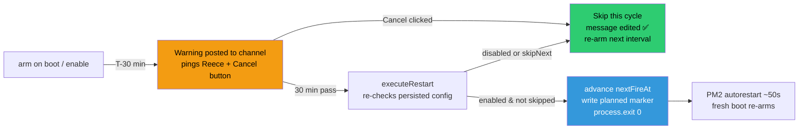

# Scheduled Auto-Restart (🌙)

**Status:** Built 2026-07-06, ships **disabled** — enable via the Data menu. Not yet enabled on prod.
**Design/rationale:** [RaP 0903 — Memory Footprint Analysis](../01-RaP/0903_20260706_MemoryFootprint_Analysis.md)
**Module:** [src/monitoring/restartScheduler.js](../../src/monitoring/restartScheduler.js)

## What & Why

Prod (448MB Lightsail, V8 heap capped at 320MB) accumulates heap drift and OOM-crashes every ~3–5 days (see [incident 03](../incidents/03-V8HeapOOMCrash.md), RaP 0915/0903). This feature converts those random crashes into **planned, warned, cancellable** restarts: the bot cleanly `process.exit(0)`s on a schedule, PM2 `autorestart: true` revives it in ~50s (the same path that recovers every crash today), and the heap resets to its ~85MB baseline — the OOM ceiling is never reached.

## Configuration UI

`/menu` → … → **Data** menu (`data_admin`, Reece-only) → 📊 Analytics row → **🌙 Auto-Restart** → modal:

| Field | Component | Notes |
|---|---|---|
| Schedule | String Select | `✅ Enable / Update` or `⏹️ Disable` (description shows current state) |
| Restart every… days / hours / minutes | 3× Text Input | Whole numbers, blanks = 0, combined via `combineDhm()` (same pattern as the Custom Action schedule modal — no format parsing). All three blank keeps the current interval. **Min 4h on prod** (restart-loop guard); **dev/test allow 1m** for flow testing (`getMinIntervalMs()`). Max 30d |
| Warning channel | Channel Select | Where the pre-restart warning posts. Defaults to the health-monitor channel (`1420926549921763339`) |

The warn window scales for short dev/test intervals: `warnMinutes = min(30, interval/2)` — a 1m test interval warns 30s ahead. Prod intervals (≥4h) always get the full 30-minute warning. (Modals cap at 5 top-level components, which is why current status lives in the select's description rather than a Text Display.)

On submit, a **non-ephemeral** Components V2 summary posts in the channel the Data menu was used in (interval, next restart timestamps, warning channel). The schedule recurs from submission time in perpetuity until disabled, and **persists across restarts** — including the restarts it causes itself.

## Runtime flow



- **Warning message** (Components V2, posted via the ProdWatchdog `channel.send` pattern): pings Reece (`allowedMentions`), shows `<t:…:R>` countdown, carries a `restart_sched_cancel_<fireEpoch>` Danger button.
- **Cancel button:** requires Manage Roles; edits the warning in place to "✅ Restart Canceled … next: <t>"; skips **that cycle only**. The fire-epoch in the custom_id makes stale clicks on old warnings inert.
- **Planned-restart marker:** before exiting, `logs/planned-restart.json` is written; `restartTracker.js` consumes it (<5 min old) and the Ultrathink restart history shows `🌙 planned` on those entries.

## Runaway-state guards (deliberate — don't simplify away)

1. Ships **disabled**; only the modal enables it
2. **Minimum interval 4h on prod** (1m on dev/test via `getMinIntervalMs()`), enforced at modal validation AND re-clamped inside `arm()`/`computeNextFire()` — a hand-edited/corrupted config can never restart-loop on prod; an invalid `intervalMs` **disables** the scheduler rather than guessing
3. **No successful warning → no restart.** If the warning post fails (deleted channel, missing perms), the cycle is skipped, `nextFireAt` advances, error logged
4. **Boot inside the warn window → pushed a full cycle.** The bot never restarts without the complete 30-min warning
5. `executeRestart()` **re-reads persisted config** at T+0 (`enabled`? `skipNext`?) — defends the cancel/disable race; `cancelTonight()` sets `skipNext` *first* for in-flight defense
6. Missed fires (downtime) **advance in whole interval steps** — never fire-on-boot
7. `process.exit(0)` **only under PM2 supervision** (`PRODUCTION==='TRUE'` or `INSTANCE_ROLE==='test'`). In dev (`nohup node`, nothing revives it) the full warn/cancel flow still runs, but fire time logs `DEV — would process.exit(0) now` and re-arms — fully testable, never kills the dev bot
8. Singleton; `arm()` always clears existing timers first — exactly one armed schedule
9. All timer callbacks try/catch-isolated (standard monitoring-module convention)

## Config schema

`playerData.environmentConfig.restartScheduler`:
```json
{
  "enabled": false,
  "intervalMs": 86400000,
  "warnMinutes": 30,
  "channelId": "1420926549921763339",
  "tagUserId": "391415444084490240",
  "nextFireAt": 1783418400000,
  "skipNext": false,
  "updatedBy": "391415444084490240",
  "updatedAt": 1783332000000
}
```
`nextFireAt` is persisted and advanced **before** the exit, so the reborn process arms the next cycle exactly on cadence.

## Enabling on prod (deployment checklist)

1. Deploy the code (`npm run deploy-remote-wsl` — needs Reece's explicit permission, as always)
2. **Set `PROD_WATCHDOG_THRESHOLD=2` in the TEST box `.env`** and restart the test bot. The watchdog probes prod every 60s with failure-threshold 1 — a planned ~50s restart would otherwise fire false `🔴 Prod Down`/`🟢 Recovered` alert pairs most cycles. Threshold 2 still alerts on genuine >2min outages
3. In prod Discord: Data menu → 🌙 Auto-Restart → Enable, `1d`, health-monitor channel. First restart lands one interval later — pick the submission time so the cadence hits the quiet window (6PM AWST / 10:00 UTC is the established maintenance window; submitting at 6PM AWST gives 6PM AWST daily)
4. Watch the first cycle: warning at T-30 in the channel, `🌙 planned` in the next Ultrathink restart history

## Testing

- `tests/restartScheduler.test.js` — 20 tests over the pure logic (`combineDhm`/`splitDhm`, `computeNextFire` incl. downtime catch-up/warn-window push/corruption clamps at both prod and dev floors, `isCancelCurrent` stale-click guard)
- Dev/test end-to-end: enable via the modal with a 1-minute interval (dev/test floor) — warning posts ~30s ahead, click Cancel, observe skip + re-arm in the logs. On dev the fire time logs `DEV — would process.exit(0)` instead of exiting; on the test box it genuinely restarts (PM2-supervised)

## Related

- [ProductionMonitoring.md](../infrastructure-security/ProductionMonitoring.md) — Ultrathink health monitor (restart history shows planned restarts)
- [PM2ErrorLogger.md](PM2ErrorLogger.md) — posts crash traces; planned restarts produce none
- [TestInstanceBlueGreen.md](TestInstanceBlueGreen.md) — ProdWatchdog lives on the test box
