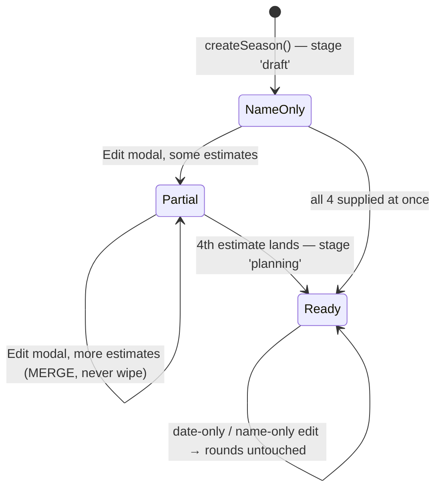

# Season Planner

**Status:** Active (shipped 2026-03-15, iterated through 2026-08-09)
**Entry:** `/menu` → Production Menu → 📅 **Season Manager** → pick a season → 📅 **Planner** tab (`apps_planner_{configId}`)
**Core module:** [seasonPlanner.js](../../seasonPlanner.js) · **Images:** [scheduleImageGenerator.js](../../scheduleImageGenerator.js) · **Tests:** [tests/seasonPlanner.test.js](../../tests/seasonPlanner.test.js)
**Related:** [SeasonManager](SeasonManager.md) (the shell this lives inside) · [SurvivorContext](../concepts/SurvivorContext.md) (domain glossary) · [Challenges](Challenges.md) · [SeasonPlannerUIPrototype](../ui/SeasonPlannerUIPrototype.md) (the original Discord-native mockup)

> **Promoted from RaP 0947** (2026-03-15). This document describes **what was built**, not the original spec. Where the build diverged from the spec, the build wins and the divergence is called out. Original trigger prompt is preserved in [§ Appendix](#appendix--original-trigger-prompt).

---

## 1. What It Is

The Season Planner turns four estimates — **cast size, swaps, FTC size, start date** — into a **round-by-round timeline** with real calendar dates, one challenge per round, and per-round editing. It answers the host's question *"if we maroon on March 7, when is the finale?"*

Its original goal was to **decouple season planning from season applications**. That happened, but not the way RaP 0947 proposed. The RaP planned a parallel build behind a Reece's Stuff button; instead, [RaP 0910](../01-RaP/0910_20260615_SeasonHubUnification_Analysis.md) **re-merged** Planner and Apps into the unified **Season Manager**. The decoupling that survived is at the **data** layer, not the UI layer:

- Rounds live in `playerData[guildId].seasonRounds[seasonId]` — a **guild-level tree**, not nested under `applicationConfigs`.
- Estimates live **on** the `applicationConfigs[configId]` entry, alongside the application fields.
- One selector, one create/edit modal, one config object shared with Apps/Casting/Marooning.

**Consequence worth internalizing:** rounds are keyed by `seasonId` while everything else is keyed by `configId`. Every planner code path does the `configId → config.seasonId → seasonRounds[seasonId]` hop. Rounds can therefore **outlive their estimates** (they live in a different tree), which is exactly why `buildPlannerView` checks estimate presence per-field rather than inferring readiness from "do rounds exist".

### Ownership split vs. Season Manager

| Owned here (SeasonPlanner.md) | Owned by [SeasonManager.md](SeasonManager.md) |
|---|---|
| Round generation, swap/merge placement | Nav row / active-tab pattern, ephemerality rules |
| **Day & date arithmetic** | Season selector + search |
| Round string selects, round-edit modals | Casting tab, Marooning tab, DNC |
| Schedule + Calendar images | Season deletion cascade |
| Challenge carry-over on regeneration | Create/Edit modal *routing* (the modal itself is built here) |

---

## 2. Setup Lifecycle — the four estimates

A season can exist with **only a name**. The planner is a progressive-disclosure layer on top.



### The four fields

| Config field | Modal `custom_id` | Rule | Structural? |
|---|---|---|---|
| `estimatedTotalPlayers` | `est_players` | int ≥ 1 | ✅ yes |
| `estimatedSwaps` | `est_swaps` | int ≥ 0 (**0 is valid** — always presence-check with `== null`, never falsy) | ✅ yes |
| `estimatedFTCPlayers` | `est_ftc` | int ≥ 1 **and** `< estimatedTotalPlayers` | ✅ yes |
| `estimatedStartDate` | `est_start_date` | `mm/dd/yyyy` → local-midnight epoch ms | ❌ no |

**"Structural" is the load-bearing distinction.** A change to players/swaps/FTC changes *how many rounds exist* → regenerate. A change to the start date only shifts *where the existing rounds land* → recompute at render time, never regenerate. See `updateSeason()` (seasonPlanner.js:1008).

### Incremental save — three bug fixes are encoded here

The spec said all-or-nothing. The build is **per-field save, all-or-nothing generation**, after three rounds of bug-fixing (commits `b0344949`, `25c3e3db`, `f3c73a92`):

1. **`validatePlannerFields()` validates each estimate independently.** An invalid or blank field yields `null` for that field only. The **only** thing that makes a submit invalid is a missing season name — nothing else blocks the save.
2. **`createSeason`/`updateSeason` persist only fields that are non-null,** and `updateSeason` **merges** — a blank field never wipes a previously-saved value. (The original bug: a host adding a player count wiped their swaps/FTC/date because the modal pre-fill was imperfect.)
3. **Round generation gates on the merged *config*, not the submit.** `hasPlannerData` on a single submit is not the trigger; `configComplete` (all four present on the stored config) is. So a host can complete setup across four separate edits.

> ⚠️ **`SeasonManager.md` previously said "validatePlannerFields() enforces all-or-nothing on estimates" and "updateSeason() only generates rounds the first time".** Both are stale — see 2 and 3 above, plus the structural-change regeneration path. Trust this document and the code.

Adjacent hazard, same family: **[applicationManager.js](../../applicationManager.js) app-button edits used to wipe planner estimates** because `saveApplicationConfig` overwrote with a 10-key whitelist. Fixed 2026-08-09 (`f3c73a92`) — it now merges and preserves `createdAt`. Guarded by [tests/applicationConfigPreservation.test.js](../../tests/applicationConfigPreservation.test.js). **If you add a new config field, that test is the one that catches its erasure.**

### The "not set up yet" state

`getMissingPlannerFields(config, rounds)` returns which of the four are absent. When any are missing, `buildPlannerView` renders `buildPlannerSetupPrompt(missing)` — a bulleted list of **only what's left** — and:

- **Schedule / Calendar buttons render `disabled: true`**
- **No page counter, no ◀ ▶ arrows** (they'd contradict a "you haven't set this up" prompt — and rounds may well exist from a previous config)

---

## 3. Data Model (as built)

### `applicationConfigs[configId]` additions

```javascript
{
  // ... existing application fields ...
  estimatedTotalPlayers: 18,        // structural
  estimatedSwaps: 2,                // structural — 0 is a real value
  estimatedFTCPlayers: 3,           // structural
  estimatedStartDate: 1772956800000,// epoch MS (not seconds — the spec said seconds; build uses Date.getTime())
  currentSeasonRoundID: 1,          // written, never read yet — reserved for Placements
  seasonIdeas: "Free-form ...",     // written on setup; NO UI renders it (see § 9)
  stage: 'draft' | 'planning'       // flips to 'planning' when all 4 estimates land
}
```

### `seasonRounds[seasonId][roundId]`

Round IDs are **`r{seasonRoundNo}`** — `r1`, `r2`, … `r17`. Human-readable, sequential, no insertion. Structural change ⇒ regenerate the whole set.

```javascript
"r1": {
  seasonRoundNo: 1,      // sequential position — the SORT KEY and the carry-over alignment key
  fNumber: 18,           // players remaining at round start; F1 = reunion
  exiledPlayers: 0,
  hasMarooning: true,    // added post-spec: lets marooningDays be 0 while marooning still exists
  marooningDays: 1,
  eventDays: 0,          // swap/merge event length (1 on generated swap/merge rounds)
  challengeIDs: {primary: "challenge_ab12…"},  // ONE challenge per round; `.primary` is the only key used
  tribalCouncilIDs: {},  // reserved, never populated
  ftcRound: false, swapRound: false, mergeRound: false,
  juryStart: false       // data-only, no feature reads it
}
```

**Fields that only exist after a host edit** — every read site uses `?? default`, so absence is normal, not corruption:

| Field | Default when absent | Set by |
|---|---|---|
| `tribalDays` | `1` | `edit_tribal` modal |
| `eliminations` | `1` | `edit_tribal` modal |
| `eventLabel` | `'Swap'`/`'Merge'` | `swap_merge` / `manage_event` |
| `speechDays`, `votesDays` | `1`, `1` | `ftc_speeches` / `ftc_votes` |
| `ftcNotes`, `speechNotes`, `votesNotes` | `''` | the respective modals |
| `host`, `challengeName` | `'TBC'`, generated title | legacy per-round fallbacks; the **challenge object** is authoritative now |

> **Do not "normalize" these by writing defaults on generation.** The `?? 1` pattern is what makes old rounds (pre-`hasMarooning`, pre-`tribalDays`) still render. `hasMarooning` in particular has an explicit back-compat read: `round.hasMarooning ?? (round.marooningDays > 0)`.

---

## 4. Round Generation

`generateSeasonRounds(totalPlayers, numSwaps, ftcPlayers)` (seasonPlanner.js:64):

1. One round per F-number from `F{totalPlayers}` down to `F{ftcPlayers}`.
2. Plus an `F1` **reunion** round — **skipped when `ftcPlayers === 1`**, so there's no duplicate F1.
3. Round 1 gets `hasMarooning: true, marooningDays: 1`.
4. The `F{ftcPlayers}` round gets `ftcRound: true`.

Round count = `totalPlayers - ftcPlayers + 1` (+1 for reunion, when FTC ≠ F1).

**Swaps** — `getSwapFNumbers`: first swap 2 eliminations in, then every 2 rounds. `18 players, 2 swaps → [F16, F14]`.

**Merge** — `getMergeFNumber`: `round(totalPlayers × 0.58)` clamped to **F10–F12**, then *decremented until it doesn't collide with a swap*. The collision guard is a post-spec addition (small casts put both at F10). Invariant asserted by tests: **no round is ever both `swapRound` and `mergeRound`**.

These are deliberately **best-guess defaults**, not a model of any real format. Hosts adjust per-round; nothing downstream assumes they're right.

### Regeneration carry-over (`generateAndStoreRounds`, commit `08edc57b`)

When a structural estimate changes, rounds are rebuilt from scratch. To avoid nuking host work, challenges are **carried over by `seasonRoundNo`, aligned from the earliest** (r1→r1, r2→r2, …):

- Hosts plan earliest-first, so 18→24 players moves round 2's challenge from F17 onto the new F23. That's the intended semantic — **alignment is by round position, not by F-number.**
- A carried challenge whose title is still an auto-default (`Challenge N (TBC)` / `Challenge N (FTC Speech)`) is **refreshed** for its new role; custom titles are kept verbatim.
- Extra new rounds get fresh challenges; surplus ones are **deleted** (matching `deleteSeason`'s cascade).

🔴 **Round-LEVEL edits are NOT carried.** `tribalDays`, `eliminations`, `exiledPlayers`, manual swap/merge placement, FTC notes — all reset to generated defaults on any structural change. There is no warning before this happens. This is the single most surprising planner behaviour; treat it as known-and-unfixed, not as a bug you just found.

---

## 5. ⭐ The Day Logic

**This is the heart of the feature.** Everything the host sees — select labels, option descriptions, both images — is derived from it. It is a **three-layer pipeline**, and keeping the layers straight is what makes the code tractable.

```
Layer 1  getRoundDuration(round)      → how many days this round consumes
Layer 2  calculateRoundDates(...)     → cumulative offset from season start = each round's DAY 0
Layer 3  (inside Layer 2)             → the named dates WITHIN a round (event/challenge/tribal/…)
```

### Design premise: days, not timestamps

The planner counts **whole days**, never hours. `startDate` is a local-midnight `Date`; every derived date is `new Date(base); d.setDate(d.getDate() + n)`. There are **no timezones anywhere** in the day logic — the RaP's timezone-aware display section was never built and remains backlog. Dates render via `formatDate()` as `"Sat 7 Mar"` (no year).

### Layer 1 — `getRoundDuration(round)` (seasonPlanner.js:124)

The **guard order matters** and is deliberate:

| # | Guard | Duration | Notes |
|---|---|---|---|
| 1 | `round.ftcRound` | `max(1, speechDays + votesDays)` | Checked **before** the F1 guard, so an FTC at F1 gets speeches+votes, not the 1-day reunion |
| 2 | `fNumber === 1` | `1` | Reunion |
| 3 | `hasMarooning` | `marooningDays + 1 + tribalDays` | |
| 4 | `swapRound \|\| mergeRound` | `eventDays + 1 + tribalDays` | |
| 5 | *(standard)* | `1 + tribalDays` | |

**The bare `1` in rows 3–5 is the challenge day. It is hard-coded and not configurable.** Every non-FTC, non-reunion round always spends exactly one day on its challenge. If a "multi-day challenge" is ever requested, this constant — in *both* files (see §7) — is what has to change.

Defaults applied at read time: `marooningDays ?? 1`, `eventDays ?? 1`, `tribalDays ?? 1`, `speechDays ?? 1`, `votesDays ?? 1`.

### Layer 2 — `calculateRoundDates(rounds, startDate, skippedMap)` (seasonPlanner.js:145)

Walks rounds **sorted by `seasonRoundNo`** (never by object key order — `r10` sorts before `r2` as a string), accumulating `currentDay`:

```javascript
for (const id of sortedRoundIds) {
  if (skippedMap?.has(id)) { dates[id] = {startOffset: currentDay, skipped: true}; continue; } // adds ZERO days
  ... compute this round's named dates from startDate + currentDay ...
  currentDay += getRoundDuration(round);
}
```

Rounds are **strictly back-to-back**. There is no concept of a rest day, a gap, or a fixed weekday anchor. Round N+1 begins the day after round N's last day.

### Layer 3 — the named dates within a round

Each round yields **only the date keys its type uses**. This is why select labels reference different keys per type — and why a mismatch between this function's guard order and the select builder's produces `undefined` in a label (see §6, known bug).

| Round type | Keys produced | Arithmetic (offsets from the round's day 0) |
|---|---|---|
| **FTC** (`ftcRound`) | `speeches`, `votes` | `speeches = day0`; `votes = day0 + speechDays` |
| **Reunion** (`fNumber === 1`) | `event` | `event = day0` |
| **Marooning** (`hasMarooning`) | `event`, `challenge`, `tribal` | `event = day0`; `challenge = day0 + marooningDays`; **`tribal = challenge + tribalDays`** |
| **Swap / Merge** | `event`, `challenge`, `tribal` | `event = day0`; `challenge = day0 + eventDays`; **`tribal = challenge + tribalDays`** |
| **Standard** | `challenge`, `tribal` | `challenge = day0`; **`tribal = challenge + tribalDays`** |

🔑 **`tribalDays` is an offset from the CHALLENGE day, not a length and not an offset from the round start.**

- `tribalDays: 0` → **live tribal**, same calendar day as the challenge. Round shortens by a day.
- `tribalDays: 1` → default, tribal the day after the challenge.
- `tribalDays: 2+` → "multi-day tribal"; the tribal *renders* on day `challenge + N`, and the round lengthens accordingly.

The same "0 = same day" convention applies to `marooningDays` and `eventDays`: **0 means the event shares the challenge's day, it does not mean "no event"**. Removal is a separate flag (`hasMarooning: false`, or `swapRound/mergeRound: false` via the "Remove" radio option).

### Multi-elimination → skipped rounds (`getSkippedRounds`)

If round X sets `eliminations: N` where N > 1, the **next N−1 rounds are skipped**: zero duration, no dates, and the select collapses to a single un-actionable option `F{f} ⦁ Skipped (F{x} eliminates {N})` with a ⏭️ emoji.

This is how double tribals work. The rounds still *exist* (F-numbers stay a contiguous descending run — the model never skips an F-number), they just consume no calendar. `eliminations: 0` (no-elim round) is accepted and consumes normal time, but **does not** cause a duplicate F-number — the F-sequence is fixed at generation and eliminations never feed back into it. That's a known modelling simplification.

### Worked example — 18 players, 2 swaps, F3, start Sat 7 Mar 2026

Swaps → `[F16, F14]`. Merge → `round(18 × 0.58) = 10` → F10 (no collision). 16 playable rounds + reunion = **17 rounds → 2 pages**.

| Round | F | Type | Duration | Day 0 | Dates rendered |
|---|---|---|---|---|---|
| r1 | F18 | Marooning | `1+1+1 = 3` | Sat 7 Mar | event Sat 7 · challenge Sun 8 · tribal Mon 9 |
| r2 | F17 | Standard | `1+1 = 2` | Tue 10 Mar | challenge Tue 10 · tribal Wed 11 |
| r3 | F16 | **Swap** | `1+1+1 = 3` | Thu 12 Mar | event Thu 12 · challenge Fri 13 · tribal Sat 14 |
| r4 | F15 | Standard | 2 | Sun 15 Mar | challenge Sun 15 · tribal Mon 16 |
| r5 | F14 | **Swap** | 3 | Tue 17 Mar | … |
| r6–r8 | F13–F11 | Standard | 2 each | | |
| r9 | F10 | **Merge** | 3 | | |
| r10–r15 | F9–F4 | Standard | 2 each | | |
| r16 | F3 | **FTC** | `1+1 = 2` | | speeches · votes |
| r17 | F1 | Reunion | 1 | | event |

**Season length: 37 days.** Set r2's tribal to live (`tribalDays: 0`) and every subsequent date shifts a day earlier — the whole timeline is a pure function of the estimates plus per-round overrides.

---

## 6. Round String Selects

The planner view is **one `type: 3` String Select per round**, each in its own Action Row. The select is used as a *disclosure widget*, not a picker: its default-selected first option is the round **summary**, and opening it reveals contextual actions.

### Layout & limits

- **`SELECTS_PER_PAGE = 10`** — 10 round selects per page + header + nav row + Schedule/Calendar row + bottom row. Sits close to Discord's 40-component cap; `validateComponentLimit` runs on every render. **Adding a component to this view means removing one.**
- `custom_id`: **`planner_round_{roundId}_{configId}`** — parsed by splitting on the **first** underscore after the prefix, because `configId` itself contains underscores (`config_{ts}_{userId}`).
- `placeholder`: `` `${round.seasonRoundNo}. ${options[0].label}` `` — so the collapsed select shows *"3. F16 ⦁ Thu 12 Mar ⦁ Swap ⦁ Challenge 3 (TBC)"*.
- Separator `⦁` is `DOT = '⦁'`.
- Option labels cap at **100 chars** (Discord). Only the challenge name is defensively truncated (>50 → 47+`...`); a long season/event label could still overflow.

### Option sets by round type (`buildRoundOptions`, seasonPlanner.js:532)

Every set begins with the `summary` option (`default: true`) and most contain a `divider` — **both are no-ops**, silently acknowledged with `type: 6` by the handler.

| Round type | Summary label | Actions (in order) |
|---|---|---|
| **Skipped** | `F{f} ⦁ Skipped (F{x} eliminates {n})` ⏭️ | *(none — summary only)* |
| **Reunion** (F1) | `F1 ⦁ {event} ⦁ Reunion` 🎉 | *(none)* |
| **FTC** | `F{f} (FTC) ⦁ {speeches} ⦁ Final Tribal Council` 🔥 | Speech Writing · Questioning/Votes · — · Manage FTC · Manage Marooning & Exile |
| **Marooning** | `F{f} ⦁ {event} ⦁ Marooning ⦁ {challenge name}` 🏝️ | Manage Marooning & Exile · Edit {challenge} · Edit F{f} Tribal ({elims}) · — · Add Swap/Merge · Manage FTC · Swap Events With Another Round |
| **Swap / Merge** | `F{f} ⦁ {event} ⦁ {eventLabel} ⦁ {challenge name}` 🔀 | Manage {eventLabel} · Edit {challenge} · Edit F{f} Tribal · — · Manage Marooning & Exile · Manage FTC · Swap Events |
| **Standard** | `F{f} ⦁ {challenge} ⦁ {challenge name}` ▫️ | Edit {challenge} · Edit F{f} Tribal · — · Manage Marooning & Exile · Add Swap/Merge · Manage FTC · Swap Events |

Plus, appended when `round.challengeIDs.primary` is set: **`Go to {challenge name}`** 🏃 (`value: go_challenge_{chalId}`) — opens the full [Challenges](Challenges.md) screen as a **new ephemeral message** so the planner stays open behind it.

### Where the dates surface

This is the direct link between §5 and the UI:

- **Summary label** carries the round's *anchor* date — `event` for marooning/swap/merge/reunion, `challenge` for standard, `speeches` for FTC.
- **Option `description`** carries the date of the thing that option edits: `Edit {challenge}` → `` `{dates.challenge} ⦁ {host}` ``; `Edit F{f} Tribal` → `` `{dates.tribal} ⦁ {host}` ``; `Manage Marooning` → `dates.event`; FTC's two phase options → `dates.speeches` / `dates.votes`.

So **the date a host sees next to "Edit Tribal" is `challenge + tribalDays`** — flipping tribal to live changes that description *and* pulls every later round a day earlier, in the same render.

- **Challenge name resolution:** linked challenge's `title` → `round.challengeName` (legacy) → `Challenge {n} (TBC)`.
- **Host** is `round.host ?? 'TBC'` — a **legacy per-round field the round modals never write**. In practice it always reads "TBC"; the real host lives on the challenge object (`creationHost`, set via the challenge quick-edit modal) and is **not** surfaced in the select descriptions. Low-hanging fix.

### 🐞 Known bug — FTC at F1 renders `undefined`

`buildRoundOptions` checks `f === 1` **before** `round.ftcRound`; `calculateRoundDates` and `getRoundDuration` both check `ftcRound` **first** (with explicit comments saying so). For a season configured with `estimatedFTCPlayers: 1` — which `validatePlannerFields` accepts, and which `generateSeasonRounds` explicitly supports by suppressing the duplicate reunion — the date map contains `{speeches, votes}` but the select builder reads `dates.event`, producing:

```
F1 ⦁ undefined ⦁ Reunion
```

The fix is to move the `round.ftcRound` guard above the `f === 1` guard in `buildRoundOptions` so all three functions agree. `buildRoundOptions` is module-private and untested; exporting it for a test is the natural companion change.

---

## 7. Schedule & Calendar Images

The two buttons under the round selects render PNGs via `sharp` ([scheduleImageGenerator.js](../../scheduleImageGenerator.js)) and **post them publicly to the current channel**, then re-render the planner:

- **📋 Schedule** → `generateVerticalTimeline` — a 4-column per-round timeline (F-number + duration, then one column per day).
- **📅 Calendar** → `generateMonthCalendar` — month grids with each day colour-coded by activity.

Both are disabled until all four estimates exist.

### 🔴 The day logic is DUPLICATED, and the copies disagree

`scheduleImageGenerator.js` carries its **own private copies** of `getRoundDuration`, `getSkippedRounds`, and a `calcDates` equivalent — it does **not** import from `seasonPlanner.js`. `getRoundDuration` is currently byte-identical, so **round start dates agree**. The *within-round* renderers do not:

| Divergence | Effect |
|---|---|
| `getScheduleColumns` hard-codes tribal at **challenge + 1**, ignoring `tribalDays` | A live tribal (`tribalDays: 0`) shows same-day in the select and next-day in the Schedule image. Multi-day tribals are likewise wrong. |
| `getDayActivities` emits a **fixed 2–3 entry** day list per round type | A 2-day marooning (duration 4) paints only 3 calendar cells → a blank day. A live tribal (duration 1) emits 2 entries → the tribal cell lands on the next round's day 0 and is overwritten. |

**If you change any day arithmetic, you must change it in both files.** The right fix is to export the pure helpers from `seasonPlanner.js` and delete the copies — the duplication predates the `tribalDays`/`hasMarooning` features, which is precisely why only one copy learned about them.

---

## 8. Round Editing

Selecting an action opens a modal built by `buildRoundModal(action, round, roundId, configId)`, `custom_id: planner_modal:{action}:{roundId}:{configId}`. Submissions are handled by `processRoundEdit()`, which loads → mutates → `savePlayerData` and re-renders the planner.

| Action | Modal fields | Writes |
|---|---|---|
| `edit_tribal` | Radio (0d / 1d / custom) + Custom Days + Eliminations | `tribalDays`, `eliminations` |
| `marooning` | Radio (none / 0d / 1d / custom) + Custom Days + Exiled Players | `hasMarooning`, `marooningDays`, `exiledPlayers` |
| `swap_merge` | Radio (Swap/Merge) + Label + Duration | `swapRound`/`mergeRound`, `eventLabel`, `eventDays` |
| `manage_event` | Radio (remove / 0d / 1d / custom) + Label | same, or clears the event |
| `ftc` | FTC Players + Notes | Clears `ftcRound` on **all** rounds, sets it on the round matching that F-number |
| `ftc_speeches` / `ftc_votes` | Duration + Notes | `speechDays`/`votesDays`, `*Notes` |
| `swap_round` | Target F-number (accepts `13`, `F13`, `f-13`) | **Swaps ~21 event fields** between two rounds; `fNumber` + `seasonRoundNo` stay put |
| `edit_challenge` | Challenge Name + Prepping Host (User Select) | Handled separately in app.js (`planner_challenge_edit:`) — writes the **challenge object**, not the round |

Notes:
- The **radio + "Custom Days" text** pairing is a workaround for Discord radio groups holding no free text. `custom_days` **takes priority** when non-empty, so typing `0` there is a valid shortcut regardless of the radio.
- `swap_round` swaps by an explicit field list. **A new round field must be added to that list** or it silently fails to travel.
- `processRoundEdit` does a plain load→mutate→save. It does **not** take `withStorageLock`. Planner edits are low-frequency, single-admin operations, so this hasn't bitten — but it is a latent lost-update path, and any batch/automated round mutation should adopt the lock.

---

## 9. Known Gaps & Orphans

**Orphaned handlers — registered, routable, but nothing renders the button:**

| custom_id | Status |
|---|---|
| `planner_ideas_*` | Handler + `planner_ideas_save:` modal are complete and `seasonIdeas` is written on setup and protected from erasure by tests — **but `buildPlannerView` never emits the button.** The `ideas` parameter it accepts (arg 6) is dead. Wiring one button back in ships the whole feature. |
| `planner_tribes_*` | No-op stub (`type: 6`). Tribes moved to the Marooning tab. |
| `planner_force_setup_*` | Superseded by the inline setup prompt + Edit button. |

**Other gaps:**
- **Timezone-aware dates never built.** No `Intl.DateTimeFormat`, no per-user format. Input is `mm/dd/yyyy` only; output is always `"Sat 7 Mar"`.
- **`currentSeasonRoundID`, `juryStart`, `tribalCouncilIDs`, `exiledPlayers`** are written/stored but nothing reads them. Reserved for [Placements](Placements.md) and future exile/jury mechanics.
- **No regeneration warning.** A structural estimate change silently resets round-level edits (§4).
- **One challenge per round.** `challengeIDs` is an object but only `.primary` is ever used.
- **Season Description** is still absent from the modal (5-field limit) — `explanatoryText` is now owned by the apply-button setup flow and deliberately untouched by `updateSeason`.

---

## 10. Tests

[tests/seasonPlanner.test.js](../../tests/seasonPlanner.test.js) (~60 cases) replicates the pure logic inline — no Discord, no file I/O — per [TestingStandards](../standards/TestingStandards.md):

`getSwapFNumbers` · `getMergeFNumber` (incl. swap-collision) · `generateSeasonRounds` (counts, F-sequence, marooning/FTC/reunion placement, no swap+merge overlap, no duplicate F1 reunion) · `parseStartDate` · `validatePlannerFields` · **`getRoundDuration` (every type + live-tribal + FTC-at-F1 + 0+0 minimum)** · end-to-end season length.

Related: [tests/seasonCreate.test.js](../../tests/seasonCreate.test.js), [tests/seasonDelete.test.js](../../tests/seasonDelete.test.js), [tests/seasonSelector.test.js](../../tests/seasonSelector.test.js), [tests/applicationConfigPreservation.test.js](../../tests/applicationConfigPreservation.test.js).

**Untested:** `buildRoundOptions` and `calculateRoundDates`' Layer-3 branches (module-private / view-coupled) — which is how the FTC-at-F1 label bug in §6 survived.

---

## Appendix — Original Trigger Prompt

> Transform and decouple the existing Season concept tied to applications to a general "Season Planner", allowing hosts to plan out how long their season will be, how many rounds, how many challenges, etc.

**Superseded design decisions from the original RaP**, kept for archaeology:
- *Parallel build behind `reeces_season_planner_mockup`, with a later "Production Toggle" phase* → superseded by RaP 0910's unification into Season Manager. The mockup id survives only as a legacy alias.
- *`estimatedStartDate` as Unix **seconds*** → built as epoch **milliseconds**.
- *`marooningDays: 1 for round 1, 0 for all others`* as the marooning signal → superseded by the explicit `hasMarooning` boolean, so `marooningDays: 0` can mean "same day as challenge".
- *Timezone-aware `mm/dd` vs `dd/mm` display* → still backlog, never built.
- *"Round regeneration destroys edits — warn user before regenerating"* (risk table) → the carry-over mechanism (§4) mitigates it for **challenges**; the warning was never built and round-level edits still reset.
