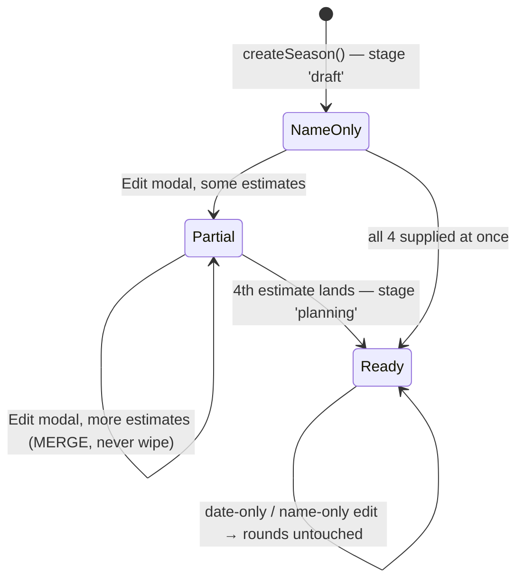

# Season Planner

**Status:** Active (shipped 2026-03-15, iterated through 2026-08-09)
**Entry:** `/menu` → Production Menu → 📅 **Season Manager** → pick a season → 📅 **Planner** tab (`apps_planner_{configId}`)
**Core modules:** [seasonRoundSchedule.js](../../seasonRoundSchedule.js) (day arithmetic — **the single source of truth**) · [seasonPlanner.js](../../seasonPlanner.js) (UI + persistence) · [scheduleImageGenerator.js](../../scheduleImageGenerator.js) (images)
**Tests:** [tests/seasonRoundSchedule.test.js](../../tests/seasonRoundSchedule.test.js) · [tests/seasonPlanner.test.js](../../tests/seasonPlanner.test.js)
**Related:** [SeasonManager](SeasonManager.md) (the shell this lives inside) · [SurvivorContext](../concepts/SurvivorContext.md) (domain glossary) · [Challenges](Challenges.md) · [SeasonPlannerUIPrototype](../ui/SeasonPlannerUIPrototype.md) (the original Discord-native mockup)

> **Promoted from RaP 0947** (2026-03-15). This document describes **what was built**, not the original spec. Where the build diverged from the spec, the build wins and the divergence is called out. Original trigger prompt is preserved in [§ Appendix](#appendix--original-trigger-prompt).

---

## 1. What It Is

The Season Planner turns four estimates — **cast size, swaps, FTC size, start date** — into a **round-by-round timeline** with real calendar dates, one challenge per round, and per-round editing. It answers the host's question *"if we maroon on March 7, when is the finale?"*

Its original goal was to **decouple season planning from season applications**. That happened, but not the way RaP 0947 proposed. The RaP planned a parallel build behind a Reece's Stuff button; instead, [RaP 0910](../01-RaP/0910_20260615_SeasonHubUnification_Analysis.md) **re-merged** Planner and Apps into the unified **Season Manager**. The decoupling that survived is at the **data** layer, not the UI layer:

- Rounds live in `playerData[guildId].seasonRounds[seasonId]` — a **guild-level tree**, not nested under `applicationConfigs`.
- Estimates live **on** the `applicationConfigs[configId]` entry, alongside the application fields.
- One selector, one create/edit modal, one config object shared with Apps/Casting/Marooning.

**Consequence worth internalizing:** rounds are keyed by `seasonId` while everything else is keyed by `configId`. Every planner code path does the `configId → config.seasonId → seasonRounds[seasonId]` hop. Rounds can therefore **outlive their estimates** (they live in a different tree), which is exactly why `buildPlannerView` checks estimate presence per-field rather than inferring readiness from "do rounds exist".

### Ownership split vs. Season Manager

| Owned here (SeasonPlanner.md) | Owned by [SeasonManager.md](SeasonManager.md) |
|---|---|
| Round generation, swap/merge placement | Nav row / active-tab pattern, ephemerality rules |
| **Day & date arithmetic** | Season selector + search |
| Round string selects, round-edit modals | Casting tab, Marooning tab, DNC |
| Schedule + Calendar images | Season deletion cascade |
| Challenge carry-over on regeneration | Create/Edit modal *routing* (the modal itself is built here) |

---

## 2. Setup Lifecycle — the four estimates

A season can exist with **only a name**. The planner is a progressive-disclosure layer on top.



### The four fields

| Config field | Modal `custom_id` | Rule | Structural? |
|---|---|---|---|
| `estimatedTotalPlayers` | `est_players` | int ≥ 1 | ✅ yes |
| `estimatedSwaps` | `est_swaps` | int ≥ 0 (**0 is valid** — always presence-check with `== null`, never falsy) | ✅ yes |
| `estimatedFTCPlayers` | `est_ftc` | int ≥ 1 **and** `< estimatedTotalPlayers` | ✅ yes |
| `estimatedStartDate` | `est_start_date` | `mm/dd/yyyy` → local-midnight epoch ms | ❌ no |

**"Structural" is the load-bearing distinction.** A change to players/swaps/FTC changes *how many rounds exist* → regenerate. A change to the start date only shifts *where the existing rounds land* → recompute at render time, never regenerate. See `updateSeason()` (seasonPlanner.js:1008).

### Incremental save — three bug fixes are encoded here

The spec said all-or-nothing. The build is **per-field save, all-or-nothing generation**, after three rounds of bug-fixing (commits `b0344949`, `25c3e3db`, `f3c73a92`):

1. **`validatePlannerFields()` validates each estimate independently.** An invalid or blank field yields `null` for that field only. The **only** thing that makes a submit invalid is a missing season name — nothing else blocks the save.
2. **`createSeason`/`updateSeason` persist only fields that are non-null,** and `updateSeason` **merges** — a blank field never wipes a previously-saved value. (The original bug: a host adding a player count wiped their swaps/FTC/date because the modal pre-fill was imperfect.)
3. **Round generation gates on the merged *config*, not the submit.** `hasPlannerData` on a single submit is not the trigger; `configComplete` (all four present on the stored config) is. So a host can complete setup across four separate edits.

> ⚠️ **`SeasonManager.md` previously said "validatePlannerFields() enforces all-or-nothing on estimates" and "updateSeason() only generates rounds the first time".** Both are stale — see 2 and 3 above, plus the structural-change regeneration path. Trust this document and the code.

Adjacent hazard, same family: **[applicationManager.js](../../applicationManager.js) app-button edits used to wipe planner estimates** because `saveApplicationConfig` overwrote with a 10-key whitelist. Fixed 2026-08-09 (`f3c73a92`) — it now merges and preserves `createdAt`. Guarded by [tests/applicationConfigPreservation.test.js](../../tests/applicationConfigPreservation.test.js). **If you add a new config field, that test is the one that catches its erasure.**

### The "not set up yet" state

`getMissingPlannerFields(config, rounds)` returns which of the four are absent. When any are missing, `buildPlannerView` renders `buildPlannerSetupPrompt(missing)` — a bulleted list of **only what's left** — and:

- **Schedule / Calendar buttons render `disabled: true`**
- **No page counter, no ◀ ▶ arrows** (they'd contradict a "you haven't set this up" prompt — and rounds may well exist from a previous config)

---

## 3. Data Model (as built)

### `applicationConfigs[configId]` additions

```javascript
{
  // ... existing application fields ...
  estimatedTotalPlayers: 18,        // structural
  estimatedSwaps: 2,                // structural — 0 is a real value
  estimatedFTCPlayers: 3,           // structural
  estimatedStartDate: 1772956800000,// epoch MS (not seconds — the spec said seconds; build uses Date.getTime())
  currentSeasonRoundID: 1,          // written, never read yet — reserved for Placements
  seasonIdeas: "Free-form ...",     // written on setup; NO UI renders it (see § 9)
  stage: 'draft' | 'planning'       // flips to 'planning' when all 4 estimates land
}
```

### `seasonRounds[seasonId][roundId]`

Round IDs are **`r{seasonRoundNo}`** — `r1`, `r2`, … `r17`. Human-readable, sequential, no insertion. Structural change ⇒ regenerate the whole set.

```javascript
"r1": {
  seasonRoundNo: 1,      // sequential position — the SORT KEY and the carry-over alignment key
  fNumber: 18,           // players remaining at round start; F1 = reunion
  exiledPlayers: 0,
  hasMarooning: true,    // added post-spec: lets marooningDays be 0 while marooning still exists
  marooningDays: 1,
  eventDays: 0,          // swap/merge event length (1 on generated swap/merge rounds)
  challengeIDs: {primary: "challenge_ab12…"},  // the round's MAIN (immunity) challenge
  tribalCouncilIDs: {},  // reserved, never populated
  ftcRound: false, swapRound: false, mergeRound: false,
  juryStart: false       // data-only, no feature reads it
}
```

**Fields that only exist after a host edit** — every read site uses `?? default`, so absence is normal, not corruption:

| Field | Default when absent | Set by |
|---|---|---|
| `tribalDays` | `1` | `edit_tribal` modal |
| `eliminations` | `1` | `edit_tribal` modal |
| `eventLabel` | `'Swap'`/`'Merge'` | `swap_merge` / `manage_event` |
| `speechDays`, `votesDays` | `1`, `1` | `ftc_speeches` / `ftc_votes` |
| `ftcNotes`, `speechNotes`, `votesNotes` | `''` | the respective modals |
| `host`, `challengeName` | `'TBC'`, generated title | legacy per-round fallbacks; the **challenge object** is authoritative now |
| `challengeDays` | `1` | `edit_challenge` modal — days the challenge **block** spans, always ≥ 1 ([§5](#challengedays--the-shared-block-budget)); the modal's "0 days" writes `tribalDays: 0` instead |
| `bonusChallengeId` | absent | `edit_challenge` modal — linked reward/bonus challenge |
| `bonusOrder` | `'first'` | `edit_challenge` modal — `'first'` \| `'same'` \| `'last'` |

> 🔴 **`bonusChallengeId` is a FLAT field, deliberately not `challengeIDs.bonus`.** Four existing sites replace that object wholesale — `app.js` (unlink + link, ~8960/8966), `challengeManager.deleteChallenge`, and `generateAndStoreRounds` — so a link stored inside it would be silently destroyed by linking any challenge from the Challenges menu, deleting the primary, or regenerating rounds. A flat field is structurally immune rather than depending on four correct edits plus future discipline.

> **Do not "normalize" these by writing defaults on generation.** The `?? 1` pattern is what makes old rounds (pre-`hasMarooning`, pre-`tribalDays`) still render. `hasMarooning` in particular has an explicit back-compat read: `round.hasMarooning ?? (round.marooningDays > 0)`.

---

## 4. Round Generation

`generateSeasonRounds(totalPlayers, numSwaps, ftcPlayers)` (seasonPlanner.js:64):

1. One round per F-number from `F{totalPlayers}` down to `F{ftcPlayers}`.
2. Plus an `F1` **reunion** round — **skipped when `ftcPlayers === 1`**, so there's no duplicate F1.
3. Round 1 gets `hasMarooning: true, marooningDays: 1`.
4. The `F{ftcPlayers}` round gets `ftcRound: true`.

Round count = `totalPlayers - ftcPlayers + 1` (+1 for reunion, when FTC ≠ F1).

**Swaps** — `getSwapFNumbers`: first swap 2 eliminations in, then every 2 rounds. `18 players, 2 swaps → [F16, F14]`.

**Merge** — `getMergeFNumber`: `round(totalPlayers × 0.58)` clamped to **F10–F12**, then *decremented until it doesn't collide with a swap*. The collision guard is a post-spec addition (small casts put both at F10). Invariant asserted by tests: **no round is ever both `swapRound` and `mergeRound`**.

These are deliberately **best-guess defaults**, not a model of any real format. Hosts adjust per-round; nothing downstream assumes they're right.

### Regeneration carry-over (`generateAndStoreRounds`, commit `08edc57b`)

When a structural estimate changes, rounds are rebuilt from scratch. To avoid nuking host work, challenges are **carried over by `seasonRoundNo`, aligned from the earliest** (r1→r1, r2→r2, …):

- Hosts plan earliest-first, so 18→24 players moves round 2's challenge from F17 onto the new F23. That's the intended semantic — **alignment is by round position, not by F-number.**
- A carried challenge whose title is still an auto-default (`Challenge N (TBC)` / `Challenge N (FTC Speech)`) is **refreshed** for its new role; custom titles are kept verbatim.
- Extra new rounds get fresh challenges; surplus ones are **deleted** (matching `deleteSeason`'s cascade).

🔴 **Most round-LEVEL edits are NOT carried.** `tribalDays`, `eliminations`, `exiledPlayers`, manual swap/merge placement, FTC notes — all reset to generated defaults on any structural change. There is no warning before this happens. This is the single most surprising planner behaviour; treat it as known-and-unfixed, not as a bug you just found.

**The exception is the challenge block** (`challengeDays`, `bonusChallengeId`, `bonusOrder`), which IS carried by `seasonRoundNo` alongside the challenge itself. That's not a style inconsistency — the bonus link points at a **real challenge object**, and dropping it wouldn't merely reset a setting: the sweep below would then see an unlinked season-owned challenge and **delete the host's reward challenge outright**. Every carried `bonusChallengeId` is added to `linkedChalIds` for exactly that reason. Guarded by `does NOT delete the reward challenge when the cast size changes` in [tests/challengeBonus.test.js](../../tests/challengeBonus.test.js) — verified to fail if the protection is removed.

---

## 5. ⭐ The Day Logic

**This is the heart of the feature.** Everything the host sees — select labels, option descriptions, both images — is derived from it. It is a **three-layer pipeline**, and keeping the layers straight is what makes the code tractable.

```
Layer 1  getRoundType(round)       → which of 6 shapes this round is
Layer 2  getRoundPhases(round)     → the named events inside it, at day OFFSETS from round start
Layer 3  getRoundDuration(round)   → how many days the round consumes
Layer 4  buildRoundSchedule(...)   → walks every round, cumulative offsets → real Dates
```

🔑 **It all lives in [seasonRoundSchedule.js](../../seasonRoundSchedule.js) — one pure, dependency-free module.** Both `seasonPlanner.js` (round selects) and `scheduleImageGenerator.js` (Schedule + Calendar) import from it. **Never reimplement day arithmetic in a consumer** — that is exactly how the two views drifted apart before ([§7](#7-schedule--calendar-images)).

Consumers present the same schedule three ways:

| Consumer | Entry point | Shape |
|---|---|---|
| Round string selects | `calculateRoundDates()` (seasonPlanner.js) | `{challenge: "Sat 7 Mar", tribal: …}` display strings |
| 📋 Schedule image | `buildRoundSchedule()` → `getScheduleColumns()` | 1–3 columns per round, same-day phases merged |
| 📅 Calendar image | `buildRoundSchedule()` → `expandRoundDays()` | exactly `duration` day cells |

### Design premise: days, not timestamps

The planner counts **whole days**, never hours. `startDate` is a local-midnight `Date`; every derived date is `new Date(base); d.setDate(d.getDate() + n)`. There are **no timezones anywhere** in the day logic — the RaP's timezone-aware display section was never built and remains backlog. Dates render via `formatDate()` as `"Sat 7 Mar"` (no year).

### Layers 1 & 3 — `getRoundType` and `getRoundDuration`

`getRoundType(round)` returns `'ftc' | 'reunion' | 'marooning' | 'swap' | 'merge' | 'standard'`. **Every consumer branches on it** — including `buildRoundOptions`, which used to derive the type itself and got it wrong (see below). The **guard order matters** and is deliberate:

| # | Guard | Duration | Notes |
|---|---|---|---|
| 1 | `round.ftcRound` | `max(1, speechDays + votesDays)` | Checked **before** the F1 guard, so an FTC at F1 gets speeches+votes, not the 1-day reunion |
| 2 | `fNumber === 1` | `1` | Reunion |
| 3 | `hasMarooning` | `marooningDays + challengeDays + tribalDays` | |
| 4 | `swapRound \|\| mergeRound` | `eventDays + challengeDays + tribalDays` | |
| 5 | *(standard)* | `challengeDays + tribalDays` | |

`getRoundDuration` doesn't actually evaluate those formulas — it returns **`lastPhaseOffset + 1`** (FTC excepted, whose two phases carry their own lengths). The table is what that reduces to.

Defaults applied at read time: `marooningDays ?? 1`, `eventDays ?? 1`, `tribalDays ?? 1`, `challengeDays ?? 1`, `speechDays ?? 1`, `votesDays ?? 1`.

### `challengeDays` — the shared block budget

The **challenge block** holds the main challenge plus any linked bonus, and **always spans exactly `challengeDays` days whether or not a bonus is present**:

```
blockStart = 0 (standard) | marooningDays (marooning) | eventDays (swap/merge)
blockEnd   = blockStart + challengeDays - 1
tribal@      blockEnd + tribalDays
```

That single invariant is why the feature needed **no data migration**: with `challengeDays` absent (= 1), `blockEnd === blockStart` and every formula collapses to the pre-bonus arithmetic exactly. Guarded by the `BACKWARDS COMPAT` case in [tests/seasonRoundSchedule.test.js](../../tests/seasonRoundSchedule.test.js).

**Adding a bonus never lengthens a round** — it shares the budget. A host who wants the reward to have its own day raises `challengeDays` to 2. Phase placement inside the block:

| `bonusOrder` | Phases |
|---|---|
| *(no bonus)* | `challenge@blockStart` |
| `first` | `bonus@blockStart` (1 day), `challenge@blockStart + 1` |
| `last` | `challenge@blockStart`, `bonus@blockEnd` (1 day) |
| `same`, **or `challengeDays === 1`** | `bonus@blockStart`, `challenge@blockStart` — **same offset, so they run concurrently** |

`challengeDays: 1` + a bonus **degrades to same-day automatically** — one day cannot hold two sequential challenges. There is no error state.

**A phase runs until the next phase begins.** Two consequences fall out of that one rule: phases sharing an offset (a live tribal, a same-day reward) run **concurrently for the whole block**, so a `same` reward on a 2-day challenge paints on *both* days; and a gap day (`tribalDays >= 2`) paints the phase it follows rather than rendering blank — the same rule multi-day marooning has always relied on.

### Layer 2 — `calculateRoundDates(rounds, startDate, skippedMap)` (seasonPlanner.js:145)

Walks rounds **sorted by `seasonRoundNo`** (never by object key order — `r10` sorts before `r2` as a string), accumulating `currentDay`:

```javascript
for (const id of sortedRoundIds) {
  if (skippedMap?.has(id)) { dates[id] = {startOffset: currentDay, skipped: true}; continue; } // adds ZERO days
  ... compute this round's named dates from startDate + currentDay ...
  currentDay += getRoundDuration(round);
}
```

Rounds are **strictly back-to-back**. There is no concept of a rest day, a gap, or a fixed weekday anchor. Round N+1 begins the day after round N's last day.

### Layer 3 — the named dates within a round

Each round yields **only the date keys its type uses**. This is why select labels reference different keys per type — and why a mismatch between this function's guard order and the select builder's produces `undefined` in a label (see §6, known bug).

| Round type | Keys produced | Arithmetic (offsets from the round's day 0) |
|---|---|---|
| **FTC** (`ftcRound`) | `speeches`, `votes` | `speeches = day0`; `votes = day0 + speechDays` |
| **Reunion** (`fNumber === 1`) | `event` | `event = day0` |
| **Marooning** (`hasMarooning`) | `event`, *(block)*, `tribal` | `event = day0`; block starts at `marooningDays`; **`tribal = blockEnd + tribalDays`** |
| **Swap / Merge** | `event`, *(block)*, `tribal` | `event = day0`; block starts at `eventDays`; **`tribal = blockEnd + tribalDays`** |
| **Standard** | *(block)*, `tribal` | block starts at `day0`; **`tribal = blockEnd + tribalDays`** |

*(block)* = `challenge` plus, when linked, `bonus` — see [§ challengeDays](#challengedays--the-shared-block-budget).

🔑 **`tribalDays` is an offset from the CHALLENGE BLOCK'S LAST DAY, not a length and not an offset from the round start.**

- `tribalDays: 0` → **live tribal**, same calendar day the block ends. Round shortens by a day.
- `tribalDays: 1` → default, tribal the day after.
- `tribalDays: 2+` → "multi-day tribal"; the tribal *renders* that many days later, and the round lengthens accordingly.

The same "0 = same day" convention applies to `marooningDays` and `eventDays`: **0 means the event shares the challenge's day, it does not mean "no event"**. Removal is a separate flag (`hasMarooning: false`, or `swapRound/mergeRound: false` via the "Remove" radio option).

### Multi-elimination → skipped rounds (`getSkippedRounds`)

If round X sets `eliminations: N` where N > 1, the **next N−1 rounds are skipped**: zero duration, no dates, and the select collapses to a single un-actionable option `F{f} ⦁ Skipped (F{x} eliminates {N})` with a ⏭️ emoji.

This is how double tribals work. The rounds still *exist* (F-numbers stay a contiguous descending run — the model never skips an F-number), they just consume no calendar. `eliminations: 0` (no-elim round) is accepted and consumes normal time, but **does not** cause a duplicate F-number — the F-sequence is fixed at generation and eliminations never feed back into it. That's a known modelling simplification.

### Worked example — 18 players, 2 swaps, F3, start Sat 7 Mar 2026

Swaps → `[F16, F14]`. Merge → `round(18 × 0.58) = 10` → F10 (no collision). 16 playable rounds + reunion = **17 rounds → 2 pages**.

| Round | F | Type | Duration | Day 0 | Dates rendered |
|---|---|---|---|---|---|
| r1 | F18 | Marooning | `1+1+1 = 3` | Sat 7 Mar | event Sat 7 · challenge Sun 8 · tribal Mon 9 |
| r2 | F17 | Standard | `1+1 = 2` | Tue 10 Mar | challenge Tue 10 · tribal Wed 11 |
| r3 | F16 | **Swap** | `1+1+1 = 3` | Thu 12 Mar | event Thu 12 · challenge Fri 13 · tribal Sat 14 |
| r4 | F15 | Standard | 2 | Sun 15 Mar | challenge Sun 15 · tribal Mon 16 |
| r5 | F14 | **Swap** | 3 | Tue 17 Mar | … |
| r6–r8 | F13–F11 | Standard | 2 each | | |
| r9 | F10 | **Merge** | 3 | | |
| r10–r15 | F9–F4 | Standard | 2 each | | |
| r16 | F3 | **FTC** | `1+1 = 2` | | speeches · votes |
| r17 | F1 | Reunion | 1 | | event |

**Season length: 37 days.** Set r2's tribal to live (`tribalDays: 0`) and every subsequent date shifts a day earlier — the whole timeline is a pure function of the estimates plus per-round overrides.

---

## 6. Round String Selects

The planner view is **one `type: 3` String Select per round**, each in its own Action Row. The select is used as a *disclosure widget*, not a picker: its default-selected first option is the round **summary**, and opening it reveals contextual actions.

### Layout & limits

- **`SELECTS_PER_PAGE = 10`** — 10 round selects per page + header + nav row + Schedule/Calendar row + bottom row. Sits close to Discord's 40-component cap; `validateComponentLimit` runs on every render. **Adding a component to this view means removing one.**
- `custom_id`: **`planner_round_{roundId}_{configId}`** — parsed by splitting on the **first** underscore after the prefix, because `configId` itself contains underscores (`config_{ts}_{userId}`).
- `placeholder`: `` `${round.seasonRoundNo}. ${options[0].label}` `` — so the collapsed select shows *"3. F16 ⦁ Thu 12 Mar ⦁ Swap ⦁ Challenge 3 (TBC)"*.
- Separator `⦁` is `DOT = '⦁'`.
- Option labels cap at **100 chars** (Discord). Only the challenge name is defensively truncated (>50 → 47+`...`); a long season/event label could still overflow.

### Option sets by round type (`buildRoundOptions`, seasonPlanner.js:532)

Every set begins with the `summary` option (`default: true`) and most contain a `divider` — **both are no-ops**, silently acknowledged with `type: 6` by the handler.

| Round type | Summary label | Actions (in order) |
|---|---|---|
| **Skipped** | `F{f} ⦁ Skipped (F{x} eliminates {n})` ⏭️ | *(none — summary only)* |
| **Reunion** (F1) | `F1 ⦁ {event} ⦁ Reunion` 🎉 | *(none)* |
| **FTC** | `F{f} (FTC) ⦁ {speeches} ⦁ Final Tribal Council` 🔥 | Speech Writing · Questioning/Votes · — · Manage FTC · Manage Marooning & Exile |
| **Marooning** | `F{f} ⦁ {event} ⦁ Marooning ⦁ {challenge name}` 🏝️ | Manage Marooning & Exile · Edit {challenge} · Edit F{f} Tribal ({elims}) · — · Add Swap/Merge · Manage FTC · Swap Events With Another Round |
| **Swap / Merge** | `F{f} ⦁ {event} ⦁ {eventLabel} ⦁ {challenge name}` 🔀 | Manage {eventLabel} · Edit {challenge} · Edit F{f} Tribal · — · Manage Marooning & Exile · Manage FTC · Swap Events |
| **Standard** | `F{f} ⦁ {challenge} ⦁ {challenge name}` ▫️ | Edit {challenge} · Edit F{f} Tribal · — · Manage Marooning & Exile · Add Swap/Merge · Manage FTC · Swap Events |

Plus, appended when `round.challengeIDs.primary` is set: **`Go to {challenge name}`** 🏃 (`value: go_challenge_{chalId}`) — opens the full [Challenges](Challenges.md) screen as a **new ephemeral message** so the planner stays open behind it.

### The bonus / reward challenge row

When `bonusChallengeId` is set the round gains **two** rows, both ordered chronologically by the same `chronological()` helper so the dropdown reads top-to-bottom in date order (`'first'`/`'same'` → above the main row, `'last'` → below):

| Row | Value | Purpose |
|---|---|---|
| 🎁 `{bonus title}` — next to `🤸 Edit {challenge}` | **`edit_challenge`** | Opens the **same Edit Challenge modal** as the main row. That modal owns the whole block (duration + bonus link + placement), so editing either side of the pair lands in one place. |
| 🎁 `Go to {bonus title}` — next to `🏃 Go to {challenge}` | `go_challenge_{bonusId}` | Jumps to the challenge's own screen. |

The main challenge's description is plain `{date} ⦁ {host}` — it does **not** name the bonus, since the bonus has its own row showing its real title.

**Dangling link** (challenge deleted out from under the round): renders `⚠️ Missing bonus challenge` as a no-op row rather than disappearing, and contributes no "Go to" row. The phase still occupies a day, so hiding it would make the timeline look wrong for no visible reason. `deleteChallenge` clears `bonusChallengeId`, so this should only appear after out-of-band data edits.

Option count: a standard round goes 9 → 11 with a bonus, well under Discord's 25. **No new components** — options aren't components, so the 40-component budget is untouched.

### 🔑 The host comes from the CHALLENGE, not the round

Descriptions render `{date} ⦁ {host}`. The host is `challenges[…].creationHost` resolved to a display name — **not** `round.host`, a legacy per-round field nothing has ever written. Reading it made every description say "TBC" even when a host was set (reported in prod, 2026-08-09).

`resolveHostNames(guild, challenges)` builds the id → name map from the **guild member cache only** — no `members.fetch`, which would be far too expensive per render and runs against the direction the codebase is moving. Unresolved ids fall back to `TBC` rather than leaking a raw snowflake. `buildPlannerView` takes the `guild` as its 10th argument; call sites pass `context.client?.guilds?.cache?.get(context.guildId)`.

Select option descriptions are **plain text** — a `<@id>` mention renders literally — which is why the name has to be resolved rather than mentioned.

### Where the dates surface

This is the direct link between §5 and the UI:

- **Summary label** carries the round's *anchor* date — `event` for marooning/swap/merge/reunion, `speeches` for FTC, and for a standard round the block's first day (which is the **bonus** when it leads).
- **Option `description`** carries the date of the thing that option edits: `Edit {challenge}` → `` `{dates.challenge} ⦁ {host}` ``; `Edit F{f} Tribal` → `` `{dates.tribal} ⦁ {host}` ``; the bonus row → `dates.bonus`; `Manage Marooning` → `dates.event`; FTC's two phase options → `dates.speeches` / `dates.votes`.

So **the date a host sees next to "Edit Tribal" is `blockEnd + tribalDays`** — flipping tribal to live, or raising `challengeDays`, changes that description *and* shifts every later round, in the same render.

- **Challenge name resolution:** linked challenge's `title` → `round.challengeName` (legacy) → `Challenge {n} (TBC)`.
- **Host** is the linked challenge's `creationHost`, resolved to a display name — see [§ the host comes from the challenge](#-the-host-comes-from-the-challenge-not-the-round). `round.host` is a dead legacy field; nothing reads it any more.

### ✅ Fixed — FTC at F1 used to render `undefined`

`buildRoundOptions` used to derive the round type itself, checking `f === 1` **before** `round.ftcRound`, while the date functions checked `ftcRound` **first**. For a season with `estimatedFTCPlayers: 1` — which `validatePlannerFields` accepts and `generateSeasonRounds` explicitly supports by suppressing the duplicate reunion — the date map held `{speeches, votes}` but the select read `dates.event`:

```
F1 ⦁ undefined ⦁ Reunion      ← before
F1 (FTC) ⦁ Wed 18 Mar ⦁ Final Tribal Council   ← now
```

Fixed structurally rather than by reordering two guards: `buildRoundOptions` now branches on the **shared `getRoundType()`**, so the option set can no longer disagree with the dates it was handed. Regression-guarded by `getRoundType — FTC beats reunion at F1` in [tests/seasonRoundSchedule.test.js](../../tests/seasonRoundSchedule.test.js).

**The general rule this encodes:** anything that needs to know "what kind of round is this?" calls `getRoundType(round)`. Re-deriving it locally is how these two views fell out of sync twice.

---

## 7. Schedule & Calendar Images

The two buttons under the round selects render PNGs via `sharp` ([scheduleImageGenerator.js](../../scheduleImageGenerator.js)) and **post them publicly to the current channel**, then re-render the planner:

- **📋 Schedule** → `generateVerticalTimeline` — a 4-column per-round timeline (F-number + duration, then one column per day).
- **📅 Calendar** → `generateMonthCalendar` — month grids with each day colour-coded by activity.

Both are disabled until all four estimates exist.

### ✅ Both images are built from the shared phase model

`scheduleImageGenerator.js` **imports** `buildRoundSchedule` / `expandRoundDays` from [seasonRoundSchedule.js](../../seasonRoundSchedule.js). It holds no day arithmetic of its own — only presentation (labels, truncation, colours, SVG).

- **`getScheduleColumns(roundSchedule, challenges)`** maps phases → columns, merging phases that share a calendar day. A 0-day marooning renders `Marooning + Challenge` in one column; a live tribal renders `{challenge} + F{n} Tribal`. Columns are **day-groups, not days** — a 3-day challenge is one column showing its start date, exactly as multi-day marooning always behaved. Merged titles are capped at **26 chars** (≈ what a 175px column fits at bold 13px Arial), because `Loved Ones Reward + Challenge 6` otherwise spilled into the neighbouring column.
- **`getDayActivities(roundSchedule, challenges)`** wraps `expandRoundDays`, which guarantees **exactly `getRoundDuration(round)` day slots**. That invariant is what keeps calendar cells aligned with round start dates. It returns a **list of activities per day**, and the calendar **stacks them as separate pills** (16px tall on an 18px pitch from y=30, so three still clear the 88px cell; capped at `MAX_CELL_PILLS`). A same-day reward therefore shows *both real titles* on *both* days of its block — `CrossWorlds Luau` above `Spam Musabi` — rather than one merged `Rwd + Chall` label on the first day only. Bonus pills paint pink (`ACTIVITY_COLORS.bonus`, deliberately far from the marooning cyan); the cell's accent bar and F-number take the colour of the day's **first** activity. The **Reward legend swatch only appears when the season uses one**, and legend spacing adapts so the extra item fits.

**Column count is adaptive.** A bonus lifts the worst case to **4** columns (`event` + `bonus` + `challenge` + `tribal`, all on distinct days). `generateVerticalTimeline` pre-computes every round's columns, takes the max, and sizes the canvas to it — so seasons without a bonus keep the original 3-column width rather than carrying a dead column. The x-position loop still guards against overflow (an unplaced column would emit `x="undefined"` into the SVG), and `Schedule image column ceiling` in [tests/seasonRoundSchedule.test.js](../../tests/seasonRoundSchedule.test.js) asserts no round shape can exceed 4.

**This used to be a duplicated copy, and the copies drifted:**

| Old divergence | Symptom | Now |
|---|---|---|
| `getScheduleColumns` hard-coded the tribal at **challenge + 1** | A live tribal (`tribalDays: 0`) read same-day in the select, next-day in the image | Reads the `tribal` phase date — identical to the select |
| `getDayActivities` emitted **fixed 2–3 entry** day lists | 2-day marooning (duration 4) painted 3 cells → blank day; live tribal (duration 1) emitted 2 → the tribal spilled onto the next round's day 0 and was overwritten | `expandRoundDays` fills every day; coincident phases share one cell |

The copies predated `tribalDays`/`hasMarooning`, which is exactly why only one of them learned about those fields. **Add day logic to `seasonRoundSchedule.js`, never to a consumer.**

---

## 8. Round Editing

Selecting an action opens a modal built by `buildRoundModal(action, round, roundId, configId)`, `custom_id: planner_modal:{action}:{roundId}:{configId}`. Submissions are handled by `processRoundEdit()`, which loads → mutates → `savePlayerData` and re-renders the planner.

| Action | Modal fields | Writes |
|---|---|---|
| `edit_tribal` | Radio (0d / 1d / custom) + Custom Days + Eliminations | `tribalDays`, `eliminations` |
| `marooning` | Radio (none / 0d / 1d / custom) + Custom Days + Exiled Players | `hasMarooning`, `marooningDays`, `exiledPlayers` |
| `swap_merge` | Radio (Swap/Merge) + Label + Duration | `swapRound`/`mergeRound`, `eventLabel`, `eventDays` |
| `manage_event` | Radio (remove / 0d / 1d / custom) + Label | same, or clears the event |
| `ftc` | FTC Players + Notes | Clears `ftcRound` on **all** rounds, sets it on the round matching that F-number |
| `ftc_speeches` / `ftc_votes` | Duration + Notes | `speechDays`/`votesDays`, `*Notes` |
| `swap_round` | Target F-number (accepts `13`, `F13`, `f-13`) | **Swaps ~24 event fields** between two rounds; `fNumber` + `seasonRoundNo` stay put |
| `edit_challenge` | see below | `buildChallengeEditModal` / `applyChallengeEdit` (seasonPlanner.js) — writes the challenge object **and** the round's block fields |

### The `edit_challenge` modal — exactly 5 components

Discord caps modals at 5 components and this one sits **at** the cap:

| # | Label | Component | Writes |
|---|---|---|---|
| 1 | Challenge Name | type 4 text | `challenge.title` |
| 2 | Prepping Host | type 5 user select | `challenge.creationHost` |
| 3 | Challenge Duration | type 3 string select, 0–6 days | `round.challengeDays` — **or `tribalDays`, see below** |
| 4 | Bonus / Reward Challenge | type 3 string select | `round.bonusChallengeId` |
| 5 | Bonus Placement | type 21 radio (Before · Same day · After) | `round.bonusOrder` |

- **Duration is a single control, not the marooning-style radio + "Custom Days" pair** — that pair is *two* components and would push this modal to 6. It's a **string select** rather than a radio because seven options each carrying a description line makes an already-5-field modal very tall, and the descriptions are where the logic is explained.

#### 🔑 "0 days" is sugar over `tribalDays`, never a stored `challengeDays: 0`

Picking **0 days** writes `challengeDays: 1, tribalDays: 0` — it does *not* store a zero.

The reason: `challengeDays: 0` would produce schedules **byte-identical** to the existing `tribalDays: 0` ("Edit Tribal → Same Day as Challenge") in every case — marooning 0d, marooning 1d+, and all-three-0d alike. Storing it would encode **one schedule in two fields**, so Edit Tribal could show "Separate Day (1d)" while the planner rendered them together. It would also admit `challengeDays: 0` + `tribalDays: 2`, which leaves a **blank day mid-round**.

Keeping `challengeDays >= 1` is exactly why this feature needed **no change to `seasonRoundSchedule.js`** — no clamp, no negative offsets, no empty days.

| Situation | Duration shows | Rationale |
|---|---|---|
| `challengeDays: 1, tribalDays: 0` | **0 days** | the collapsed state |
| `challengeDays: 3, tribalDays: 0` | **3 days** | a genuine 3-day block whose tribal lands on its last day — **not** flattened to 0 |
| `challengeDays: 1, tribalDays: 1` | 1 day | |

Writing back (`applyChallengeEdit`):

| Picked | Effect |
|---|---|
| `0` | `challengeDays = 1`, `tribalDays = 0` |
| `N ≥ 1` **while collapsed** | `challengeDays = N`, `tribalDays = 1` — the host means *separate them*, so the pick can't appear to do nothing |
| `N ≥ 1` otherwise | `challengeDays = N`, **`tribalDays` untouched** — a live tribal on a 3-day challenge survives a bump to 4 |

Both controls therefore always agree. `isCollapsedDuration()` is the single predicate behind the display and write rules.
- **The bonus picker only lists challenges that aren't already some round's `primary`** (`getBonusChallengeOptions`). That's both semantically right — a round's own immunity challenge shouldn't double as its reward — and what keeps the list under the 25-option cap, since an 18-player season generates 16 primaries on its own. The currently-linked bonus is always included so it can render as `default`.
- **Ordering is load-bearing, not cosmetic.** The list is capped at 24 + a "None" row, and a modal select can neither paginate nor search — so anything past 24 is *unreachable*. Sorting by `lastUpdated` descending guarantees the survivors are the challenges the host just touched. `lastUpdated` is reliably written by `createChallenge`, `updateChallenge` **and** `generateAndStoreRounds`; challenges somehow lacking it sort last rather than throwing. Overflow is logged.
- Hosts create the bonus challenge in the **Challenges menu first**, then link it here — the modal copy says so.
- The **Prepping Host is shared** between the main and bonus challenge. Accepted trade-off: a separate host field would need a 6th component.

Notes:
- `extractModalFields` reads **both `value` and `values[0]`** — text inputs and radios report the former, select menus the latter. Before that fix a Label-wrapped select was silently dropped.
- The **radio + "Custom Days" text** pairing (used by the *other* round modals) is a workaround for Discord radio groups holding no free text. `custom_days` **takes priority** when non-empty, so typing `0` there is a valid shortcut regardless of the radio.
- `swap_round` swaps by an explicit field list. **A new round field must be added to that list** or it silently fails to travel.
- `processRoundEdit` does a plain load→mutate→save. It does **not** take `withStorageLock`. Planner edits are low-frequency, single-admin operations, so this hasn't bitten — but it is a latent lost-update path, and any batch/automated round mutation should adopt the lock.

---

## 9. Known Gaps & Orphans

**Dormant handlers — registered, routable, but nothing renders the button.** These are **deliberately kept** (Reece, 2026-08-09: "some reasons for this, we may need to resurrect this at some point"). Do not delete them as dead code.

| custom_id | Status |
|---|---|
| `planner_ideas_*` | Handler + `planner_ideas_save:` modal are complete and `seasonIdeas` is written on setup and protected from erasure by tests — **but `buildPlannerView` never emits the button.** The `ideas` parameter it accepts (arg 6) is dead. Wiring one button back in ships the whole feature. |
| `planner_tribes_*` | No-op stub (`type: 6`). Tribes moved to the Marooning tab. |
| `planner_force_setup_*` | Superseded by the inline setup prompt + Edit button. |

**Other gaps:**
- **Timezone-aware dates never built.** No `Intl.DateTimeFormat`, no per-user format. Input is `mm/dd/yyyy` only; output is always `"Sat 7 Mar"`.
- **`currentSeasonRoundID`, `juryStart`, `tribalCouncilIDs`, `exiledPlayers`** are written/stored but nothing reads them. Reserved for [Placements](Placements.md) and future exile/jury mechanics.
- **No regeneration warning.** A structural estimate change silently resets round-level edits (§4).
- **Two challenges per round, maximum** — one main (`challengeIDs.primary`) plus one bonus (`bonusChallengeId`). `challengeIDs` still only ever uses `.primary`.
- **The bonus has no separate Prepping Host** — it shares the main challenge's, because a 6th modal component isn't available.
- **Bonus challenges aren't offered on FTC/reunion rounds** — those have no challenge phase, and the Edit Challenge option isn't shown there.
- **Season Description** is still absent from the modal (5-field limit) — `explanatoryText` is now owned by the apply-button setup flow and deliberately untouched by `updateSeason`.

---

## 10. Tests

**[tests/seasonRoundSchedule.test.js](../../tests/seasonRoundSchedule.test.js) (45 cases) imports the REAL module** — `seasonRoundSchedule.js` is pure and dependency-free precisely so it can be. Covers `getRoundType` (incl. FTC-beats-reunion-at-F1), `getRoundPhases` offsets, `getRoundDuration` parity with the pre-extraction implementation, `getSkippedRounds`, `sortRoundIds`, `buildRoundSchedule` (worked-example dates, live-tribal ripple, skipped rounds), date formatting — plus the **`expandRoundDays().length === getRoundDuration()` invariant** across 16 round shapes, which is the contract the calendar depends on.

[tests/seasonPlanner.test.js](../../tests/seasonPlanner.test.js) (~60 cases) replicates logic inline instead, because `seasonPlanner.js` pulls in storage + Discord — per [TestingStandards](../standards/TestingStandards.md). Covers `getSwapFNumbers` · `getMergeFNumber` (incl. swap-collision) · `generateSeasonRounds` · `parseStartDate` · `validatePlannerFields` · `getRoundDuration` · end-to-end season length.

**[tests/challengeBonus.test.js](../../tests/challengeBonus.test.js) (33 cases)** covers the bonus feature's non-date half, importing the real `seasonPlanner.js`: `extractModalFields` reading `values[]`, `getBonusChallengeOptions` filtering/capping/defaulting, `buildChallengeEditModal` staying at 5 components, `applyChallengeEdit` round-tripping and clearing, and — most importantly — **`generateAndStoreRounds` not deleting a linked reward challenge on regeneration**. That last group drives the real function against a plain fixture (it touches no storage, only the object it's handed), so it catches the regression rather than re-implementing it.

Related: [tests/seasonCreate.test.js](../../tests/seasonCreate.test.js), [tests/seasonDelete.test.js](../../tests/seasonDelete.test.js), [tests/seasonSelector.test.js](../../tests/seasonSelector.test.js), [tests/applicationConfigPreservation.test.js](../../tests/applicationConfigPreservation.test.js).

**Still untested:** `buildRoundOptions` (module-private, view-coupled). It no longer classifies rounds itself, so the class of bug that hid there is gone — but its label/description strings are unguarded. Exporting it would be the natural next step.

---

## Appendix — Original Trigger Prompt

> Transform and decouple the existing Season concept tied to applications to a general "Season Planner", allowing hosts to plan out how long their season will be, how many rounds, how many challenges, etc.

**Superseded design decisions from the original RaP**, kept for archaeology:
- *Parallel build behind `reeces_season_planner_mockup`, with a later "Production Toggle" phase* → superseded by RaP 0910's unification into Season Manager. The mockup id survives only as a legacy alias.
- *`estimatedStartDate` as Unix **seconds*** → built as epoch **milliseconds**.
- *`marooningDays: 1 for round 1, 0 for all others`* as the marooning signal → superseded by the explicit `hasMarooning` boolean, so `marooningDays: 0` can mean "same day as challenge".
- *Timezone-aware `mm/dd` vs `dd/mm` display* → still backlog, never built.
- *"Round regeneration destroys edits — warn user before regenerating"* (risk table) → the carry-over mechanism (§4) mitigates it for **challenges**; the warning was never built and round-level edits still reset.
