# Stamina Architecture

**Status**: 🟢 Production (As-Built)
**Last Updated**: 2026-07-16 ("Bigger Tank" — Phase-2 per-charge system removed)
**Purpose**: Authoritative, plain-English-first reference for how CastBot's Safari stamina system actually works — current vs max, regeneration cycles, consumable boosts, and permanent item boosts — after years of organic growth.

---

## Executive Summary

Stamina is the **movement budget** of the Safari map game. Every map move costs **1 stamina**. When a player runs out, they wait for it to regenerate. That simple idea has accreted five interacting mechanisms that are easy to confuse:

| # | Mechanism | One-line summary |
|---|-----------|------------------|
| 1 | **Current (numerator)** | How much stamina you have *right now* — the moves you can spend. |
| 2 | **Max (denominator)** | Your normal capacity. Regen (in full-reset mode) fills *up to* here, never past. |
| 3 | **Regeneration cycle** | Every `regenerationMinutes`, stamina comes back — either a **full reset** to max, or a **drip** of N. |
| 4 | **Consumable boost** | An item you *use up* to add temporary stamina — the one legitimate way to go **over max**. |
| 5 | **Permanent boost** | A non-consumable item you *hold* that **raises your max** — *+max only* (a "bigger tank"). |

**The single most important rule to internalize:** there is one number that is *current* (the numerator) and one number that is *max* (the denominator), and they are governed by **different rules**. `max` is almost entirely **derived from config + items** (CastBot recalculates and overwrites it on every read). `current` is the **real state** that goes down when you move and up when you regenerate.

```
effectiveMax = min(serverConfig.maxStamina + permanentBoostFromItems, MAX_STAMINA = 999)
current can EXCEED effectiveMax — but only via consumables / admin / drip-mode (see Consumable Boosts below)
```

### The glass-of-water metaphor

Think of stamina as a **glass of water**:

- **`max` is the height of the glass.** A permanent item (a Horse 🐎) gives you a *taller glass*. The server config sets the default glass height.
- **`current` is how much water is in it.** Moving pours water out. Regeneration pours water back in.
- **Full-reset regen** = a tap that, every cycle, fills the glass **right to the brim and stops**.
- **Drip regen** = a tap that adds **a fixed splash** each cycle — and (today) will *overflow the glass* if you let it (a known inconsistency — see item (e) in Recent Changes).
- **A consumable** = pouring an *extra bottle* in. The water can rise **above the rim** (over-max). It just sits there above the brim until you drink it down.

---

## The Hero Diagram — Functional Flow (non-technical)

This is the diagram to read first. It shows every state stamina can be in, the arrows between them, and five worked reset examples in plain English. (RED = a buggy/edge state, YELLOW = caution/over-max, GREEN = healthy.)

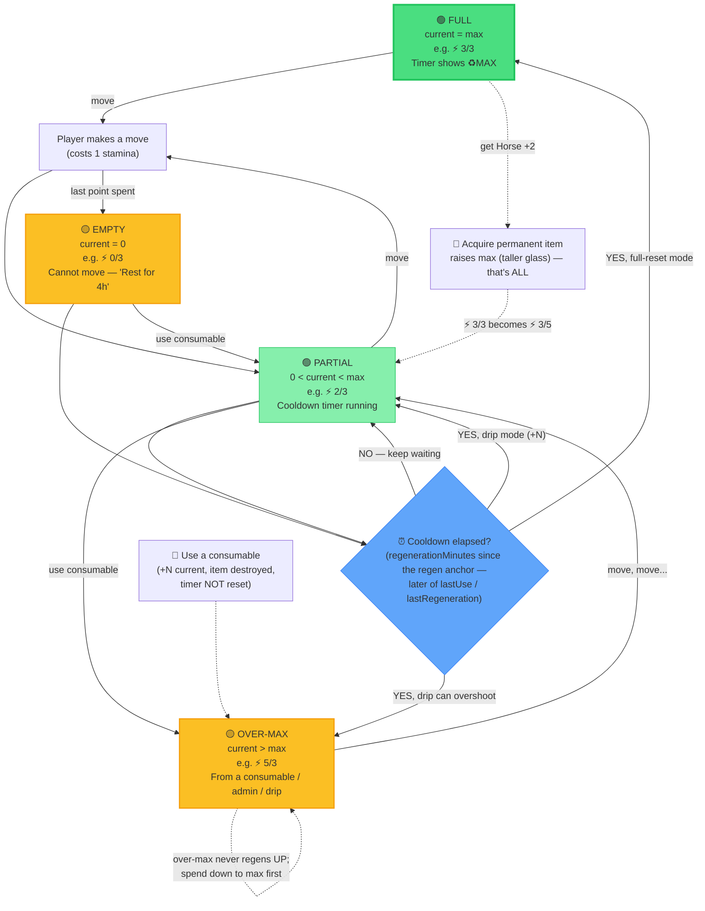

### Five reset examples (read alongside the diagram)

| # | Scenario | Config | Walk-through |
|---|----------|--------|--------------|
| **(a)** | **Spend 1 → full reset** | max 1, regen 12h, blank amount | `⚡ 1/1` → move → `⚡ 0/1` → wait 12h → **`⚡ 1/1`** (refilled to max, stops there). |
| **(b)** | **Drip climbing** | max 10, regen 60m, amount **3** | `⚡ 0/10` → +60m → `⚡ 3/10` → +60m → `⚡ 6/10` → +60m → `⚡ 9/10` → +60m → **`⚡ 12/10`** ⚠️ (drip overshoots — see item (e) in Recent Changes). |
| **(c)** | **Consumable over-max then deplete** | max 119 (e.g. big config), Energy Drink +2 | `⚡ 119/119` → use drink → **`⚡ 121/119`** → move → `120/119` → move → `119/119` → move → `118/119` (now back under max, normal regen resumes). |
| **(d)** | **Permanent +10 ring** | base max 99, Ring of Vigor (non-consumable, staminaBoost 10) | `effectiveMax = min(99 + 10, 999) = 109`. On the next read the max-reconcile snaps the stored `max` to 109 → display `⚡ 99/109`. Nothing else changes — the extra 10 capacity refills under the server's normal regen mode. Drop the ring and `max` snaps back to 99 (current clamps if needed). |
| **(e)** | **Admin set sticks** | admin types 98 via Player Admin | `setEntityPoints(…, 98, …, allowOverMax)` resets **both** `lastUse` and `lastRegeneration` to now, so the value **holds** for a full interval instead of being instantly regenerated away. On the next read, `max` is reconciled to the server's `effectiveMax`. |

---

## State Diagram (technical)

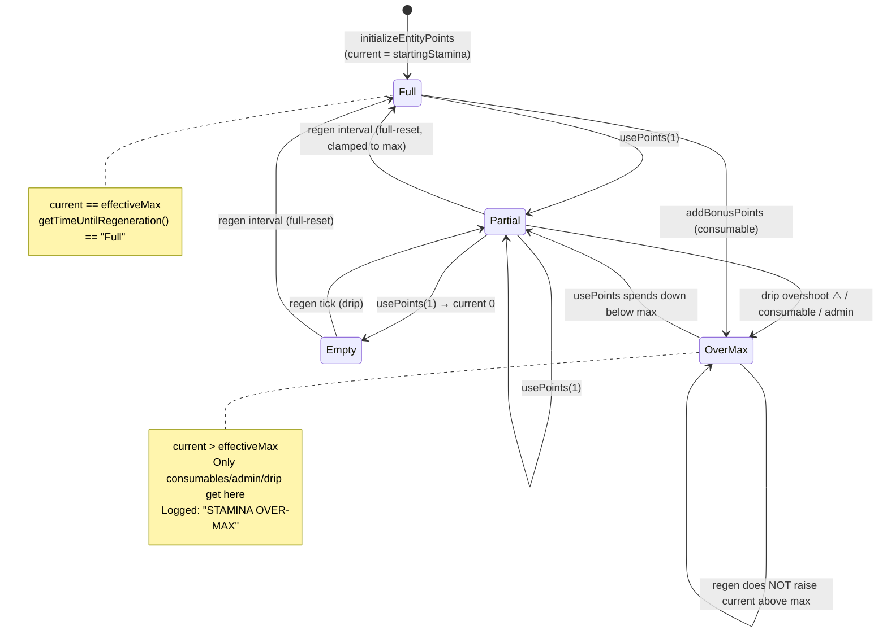

---

## Where everything lives — Data Shape

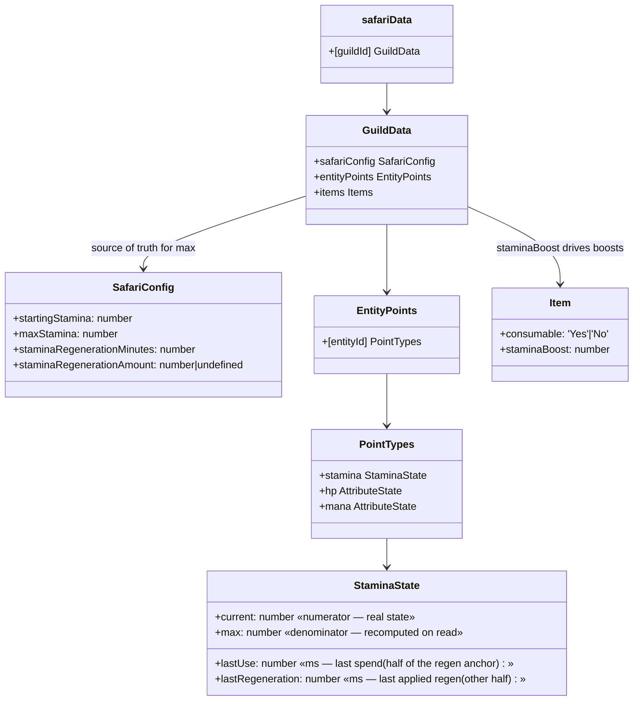

### The stamina record (per player, per guild)

```javascript
// safariData[guildId].entityPoints["player_<userId>"].stamina
{
  current: 2,                // numerator — the only "real" persisted state
  max: 3,                    // denominator — RECOMPUTED to effectiveMax on every read
  lastUse: 1718900000000,    // ms epoch of last spend — one half of the regen anchor
  lastRegeneration: 1718900000000  // ms epoch of last applied regen — the other half
}
```

- **`entityId`** is always `player_<userId>` for players. (Enemies/NPCs use other prefixes; only `player_` entities have inventories, so only they get item boosts — `calculatePermanentStaminaBoost` early-returns `0` otherwise. `pointsManager.js:16`.)
- **Legacy: `charges[]` (removed 2026-07-16).** Old records may still carry a Phase-2 per-charge array (`(number|null)[]`). It is **migrated away lazily, one-way**: any regen read (`calculateRegenerationWithCharges`, `pointsManager.js:328-334`) or admin set (`setEntityPoints`, `pointsManager.js:632-635`) deletes the array, clamps `current` to `effectiveMax`, and snaps `max` to the numeric `effectiveMax` (repairing the string-typed-max corruption some records carried). Log line: `🧹 Removed legacy charge array`.
- **Config does NOT live on the player.** `startingStamina / maxStamina / regenerationMinutes / regenerationAmount` live in `safariData[guildId].safariConfig` and are read fresh every time via `getStaminaConfig()` (`safariManager.js:9621`). The player's stored `max` is just a cache that gets reconciled.

---

## Config Resolution — `getStaminaConfig()`

`safariManager.js:9621`. Per-server config with a `.env` fallback chain. This is the **source of truth** for `max`.

```javascript
const config = {
  startingStamina:   safariConfig.startingStamina   ?? parseInt(process.env.STAMINA_MAX || '1'),
  maxStamina:        safariConfig.maxStamina        ?? parseInt(process.env.STAMINA_MAX || '1'),
  regenerationMinutes: safariConfig.staminaRegenerationMinutes ?? parseInt(process.env.STAMINA_REGEN_MINUTES || '3'),
  regenerationAmount: safariConfig.staminaRegenerationAmount ?? null,  // null = full reset
  defaultStartingCoordinate: customTerms.defaultStartingCoordinate || 'A1'
};
```

> ⚠️ **The `STAMINA_MAX || '1'` footgun.** If a server has **never** opened the Stamina config modal, `safariConfig.maxStamina` is `undefined`, so both starting and max stamina fall back to `process.env.STAMINA_MAX` — and if *that* is unset, **`1`**. New servers therefore default to a max of **1**, which surprises hosts who expect a generous default. (Note the inconsistency: `resetCustomTerms` seeds `maxStamina: 10` / `regen: 60min` — `safariManager.js:5608` — but the *live fallback* in `getStaminaConfig` and `getDefaultPointsConfig` is `1` / `3min`. The seed only applies when custom terms are explicitly reset.) `getDefaultPointsConfig()` (`pointsManager.js:194`) carries the same `STAMINA_MAX || '1'` default for the legacy points path.

**`regenerationAmount` semantics — the field that controls everything:**

| Stored value | Meaning | Mode |
|---|---|---|
| `null` / `undefined` (field deleted) | "max" | **Full reset** — refill to `effectiveMax` each interval, clamped. |
| a number `N` (1–99) | `N` | **Drip** — add `N` each interval (can overshoot — item (e) in Recent Changes). |

The admin sets this via the **Regen Amount (optional)** field in the Stamina config modal (its help text recommends leaving it blank = full reset). Blank or `0` → stored as `null` (the `delete` branch). A number → stored as that number (`app.js:47466`, save at `app.js:47518-47523`).

---

## The Read Path — `getEntityPoints()` does the work

There is **no background job**. Stamina is **calculated lazily on read** ("on-demand calculation"). Every time the game needs a player's stamina — they open the menu, try to move, use an item — `getEntityPoints()` runs, computes elapsed-time regen, and **saves the whole safari file** if anything changed.

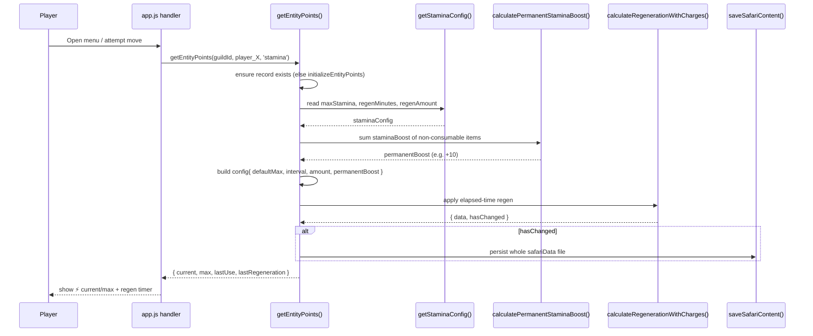

> 💡 **Read = write.** Because `getEntityPoints` saves when regen advances the clock, *reading* stamina can mutate and persist data. This is why the `lastUse` anchoring (below) matters so much — a bug here means every menu open could mint or destroy stamina.

### Decision flow inside `calculateRegenerationWithCharges()`

`pointsManager.js:314` (the name is historical — the per-charge path is gone). One function, one timer, two modes: full-reset and drip.

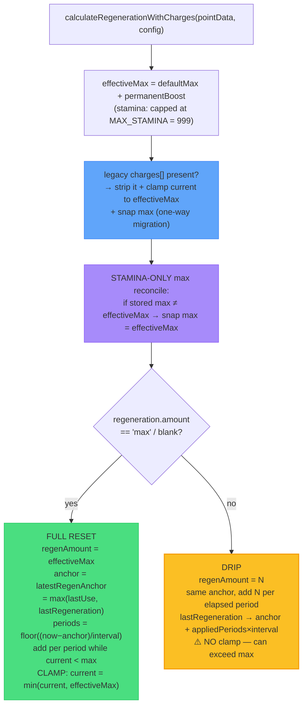

### The regen anchor: later of last spend and last applied regen

`pointsManager.js:304` (`latestRegenAnchor`), used at `:357`. The cooldown clock starts from **`max(lastUse, lastRegeneration)`** — the *later* of the last spend and the last applied regeneration. Both halves matter, and each alone is a shipped bug:

- **`lastUse` alone** re-grants on every check in **drip mode**: `lastUse` never advances when regen is applied, so `periods` stays > 0 and each read mints more — turning "+1 per 12h" into "full refill at 12h". (Fixed July 2026 — the anchor now includes `lastRegeneration`, which the drip branch advances to `anchor + appliedPeriods × interval`, preserving the fractional period.)
- **`lastRegeneration` alone** goes stale while a player idles at MAX (no regen ever fires), so their first spend after idling regenerates back **instantly** — the `618737f7` bug.

Taking the later of the two gives the player-facing promise in the guide — "12h after your last move (or your last top-up), you refill" — with neither failure mode. The loop applies regen **period by period**, stopping the moment `current >= effectiveMax`, then (in max mode only) does a final `Math.min` clamp so it can never overshoot.

---

## Full Reset vs Drip — side-by-side

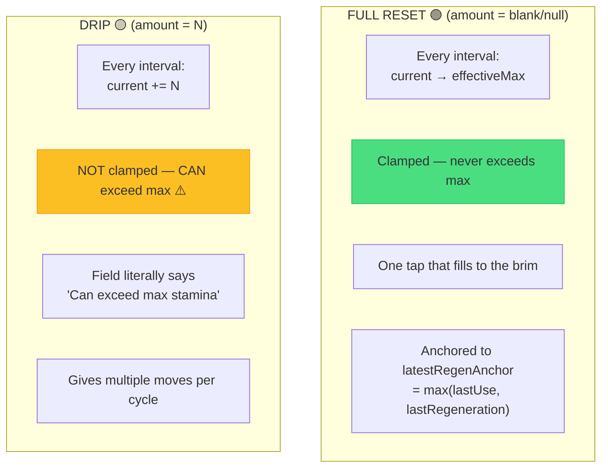

| Aspect | Full reset (`null`) | Drip (`N`) |
|---|---|---|
| Config field | blank / `0` | a number 1–99 |
| Per interval | refill to `effectiveMax` | `+N` |
| Can exceed max? | **No** (clamped, `pointsManager.js:376-378`) | **Yes** (intentional today — item (e) in Recent Changes) |
| Use case | classic "1 move per 12h" | "give 5 moves per cycle even if max is 1" |
| Anchor | `latestRegenAnchor` = max(`lastUse`, `lastRegeneration`) | same anchor; `lastRegeneration` advances by applied periods |

---

## Consumable Boosts — temporary over-max

`safariManager.js:2655` defines the `staminaBoost` field on items. A **consumable** (`consumable: 'Yes'`) with `staminaBoost > 0` is the *intended* way to exceed max. **Unchanged by the 2026-07-16 Bigger Tank change.**

When used (`app.js:16108`):

```javascript
const newStamina = await addBonusPoints(guildId, entityId, 'stamina', item.staminaBoost);
```

`addBonusPoints` (`pointsManager.js:791`):
- Adds to `current` **without capping at max** → over-max is allowed (3/3 → 4/3).
- **Does NOT reset the regen timer** — deliberate, so a player 5 minutes from a natural refill still gets it. (Comment: "consumable items don't punish players by restarting their cooldown.")
- Over-max stamina does **not** regenerate — regen only fires while `current < effectiveMax`.
- The item is consumed (removed from inventory) separately by the use handler.

Note the asymmetry with spending: `usePoints` **always** stamps `lastUse = now` on any spend (`pointsManager.js:446`) — every move restarts the countdown, whether the point spent was "natural" or consumable-granted. (The old Phase-2 distinction between real charges and bonus stamina is gone.)

---

## Permanent Boosts — Bigger Tank

A **non-consumable** item (`consumable: 'No'`) with `staminaBoost > 0` is a **permanent boost**. It does exactly one thing: **raise the holder's effective max** — a bigger tank. `calculatePermanentStaminaBoost` (`pointsManager.js:16`) sums the `staminaBoost` of all such held items:

```
effectiveMax = min(config.maxStamina + permanentBoost, MAX_STAMINA = 999)
```

- **No engine switch, no per-point timers, no `charges[]` array.** The extra capacity refills under the server's normal regeneration mode (full-reset or drip), on the same single anchor-based timer everyone else uses.
- **Numeric coercion at both ends.** Item editors historically stored `staminaBoost` as a *string*, and `99 + "01"` concatenates — a real prod record ended up with a `"9901"` max and a 9,901-slot null charges array. Now the value is coerced at **read** (`Number(item.staminaBoost) || 0`, `pointsManager.js:31`) *and* at **write** (`entityManager.updateEntityFields` coerces schema `type: 'number'` fields, `entityManager.js:136-141`). The `MAX_STAMINA` cap on `effectiveMax` is the final backstop.
- **Stacks additively** across items; losing an item shrinks `effectiveMax` on the next read and the max-reconcile snaps `max` down (current clamps via the migration/reconcile path if needed).

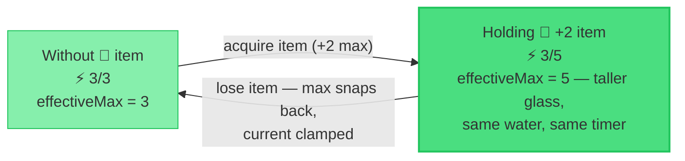

> 🪦 **History — the Phase-2 charge system (removed 2026-07-16).** From Nov 2025 to Jul 2026, holding a permanent item switched the player onto a per-charge engine: a `charges[]` array of length `effectiveMax`, each spent point regenerating on its own timer. It was the system's biggest source of complexity and corruption (see RaP [0965](../01-RaP/0965_20251124_PermanentStaminaItems_Analysis.md), [0946](../01-RaP/0946_20260315_RegenerationAmount_Analysis.md), [0938](../01-RaP/0938_20260320_StaminaRegenTimer_Analysis.md)). Leftover `charges` arrays are migrated away lazily — see the Data Shape section.

> Note the **modifier generalization** (Phase 5, `calculateAttributeModifiers`, `pointsManager.js:54`): the legacy `staminaBoost` field is now treated as a special case of a generic `attributeModifiers` system (`operation: 'addMax'`). Stamina keeps the old field for backward compatibility; other attributes (mana, hp) use `attributeModifiers`.

---

## The Max-Reconcile — why your stored `max` keeps changing

`pointsManager.js:336-349`. For **stamina only**, every read snaps the stored `max` to the freshly computed `effectiveMax`:

```javascript
if (pointType === 'stamina' && newData.max !== effectiveMax) {
    newData.max = effectiveMax;   // config + item boosts win, always
    hasChanged = true;
}
```

**Why this exists:** stamina `max` is *purely derived* (server config + item boosts), so snapping it is always correct. It fixes players stuck at a stale `max` (e.g. `1`, set before the admin ever configured `maxStamina`) that no amount of regen would otherwise correct.

**Why it's scoped to stamina (commit `242fea63`):** attributes like HP/Mana support an admin-set *custom per-player max* (`setPlayerAttribute`), which this would clobber. For non-stamina the mismatch is **logged only**, never changed (`pointsManager.js:346-349`).

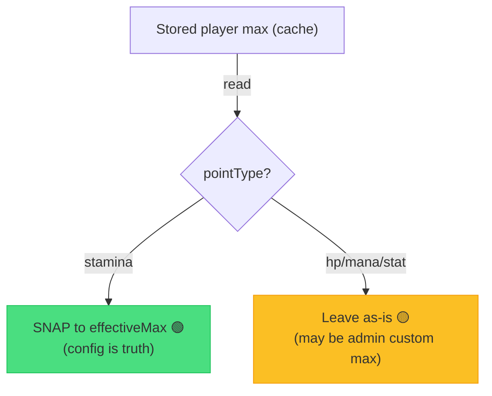

---

## Admin Set — making a value stick

Host path: `/menu` → 🧭 Player Admin → ⚡ Stamina → `createStaminaModal` (`safariMapAdmin.js:767`) → `setPlayerStamina` (`safariMapAdmin.js:636`) → `setEntityPoints(…, allowOverMax=true)` (`pointsManager.js:598`).

Key behaviors of `setEntityPoints`:
- `current = max(0, value)` — never below 0.
- If `max` given: `max = max(1, value)`; clamps `current` to `max` **unless** `allowOverMax` (admin path passes `true`, so admins can grant over-max).
- **Resets BOTH `lastUse` AND `lastRegeneration` to now** (`pointsManager.js:627-628`). This is critical (commit `2dd0f314`): because full-reset anchors to the regen anchor, only resetting `lastRegeneration` left a stale `lastUse` — the *very next read* thought a full period had elapsed and **instantly regenerated the admin's value away** (set 98 → immediately refilled). Treating a set as a fresh anchor makes it stick until the next interval.
- **Drops any legacy `charges[]` array on sight** (`pointsManager.js:632-635`) — same one-way migration as the regen read; an admin set never leaves a stale charge array behind.

The modal (`createStaminaModal`) deliberately shows the admin the **base max** (server config), subtracting item boosts, so they edit the base capacity, not the boosted total. Both inputs are capped at `MAX_STAMINA` digits.

---

## Admin Set Refresh — overriding the cooldown itself

Host path: `/menu` → 🧑‍🤝‍🧑 Players → select player → ⚡ Stamina → **♻️ Manually Set Refresh** (initialized players only) → `createRefreshModal` (`safariMapAdmin.js`, D/H/M/S fields cloned from the Schedule Action delay modal via `buildPeriodModalComponents({ includeSeconds: true })`) → `spm_refresh_modal_*` submit → `setRegenCountdown` (`pointsManager.js`).

**Time-shift semantics** (the design decision): the outcome must match *what would have happened had the player simply waited*. The pending timeline shifts by `delta = D − currentRemaining`:

- **Both anchors move** — `lastUse` and `lastRegeneration` are set to `latestRegenAnchor + delta` so the next period boundary lands at `now + D` (dual-anchor rule, same as Admin Set; `pointsManager.js:584-586`). Anchors may sit in the future — the regen loop's `floor((now − anchor)/interval)` stays ≤ 0 until then, so nothing regens early and nothing clobbers the value. Works identically in full-reset and drip mode.
- **`D = 0` is valid** — "refresh now": the refill (or next drip tick) fires on the player's next interaction.
- **Guard**: if nothing is pending (`getRegenRemainingMs` → null, i.e. ♻️ MAX), the submit is rejected with an informational message instead of silently doing nothing.
- **One-shot by design**: only the current cycle shifts. Later cycles run on the server interval, and any later spend restamps `lastUse` as normal — the same "timer restarts from your last move" rule players already have.
- `setRegenCountdown` first runs `getEntityPoints` so any lazily-pending regen applies **before** the shift (an already-elapsed cooldown must regenerate, not get pushed into the future). That read also performs the legacy-charges migration, so the shift always operates on migrated, single-timer state.

---

## The Input Ceiling — `MAX_STAMINA`

`config/safariLimits.js:38`. **One constant, `MAX_STAMINA = 999`**, is the single source of truth for the highest stamina value an admin may *type* — for both current and max, in **both** the server Stamina config modal **and** the per-player Set Stamina modal. `MAX_STAMINA_DIGITS` derives the modal `max_length` from it. This replaced scattered magic `99`s. It bounds only what can be typed; over-max above the denominator is still reachable via consumables/admin (commit history: "magic-99 removal").

Validation (`app.js:47468-47491`): starting `0–MAX_STAMINA`, max `1–MAX_STAMINA` and `>= starting`, regen minutes `1–99999`, regen amount blank or `1–99`.

`MAX_STAMINA` also caps the **engine side** since 2026-07-16: `effectiveMax` is clamped to it (`pointsManager.js:323`) as a belt-and-braces guard against corrupt stored data (the string-concat corruption produced a `9901` max on a real prod record).

---

## Lifecycle: Init → Spend → Regen → Boost

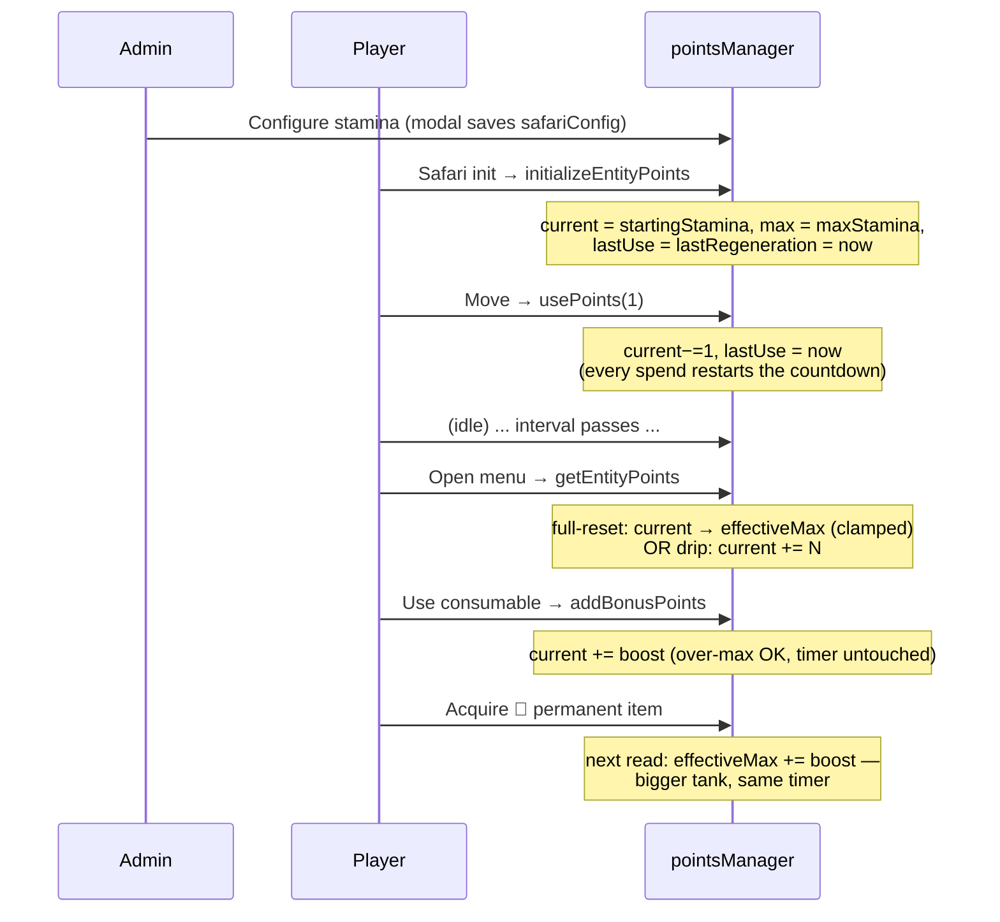

---

## Relationship to the generic Points / Attribute system (`pointsManager.js`)

**Stamina is not special infrastructure — it is one *instance* of a generic per-entity "points" engine.** `pointsManager.js` runs HP, mana, and every custom attribute (Strength, Luck, …) through the **exact same** functions stamina uses: `initializeEntityPoints`, `getEntityPoints`, `calculateRegenerationWithCharges`, `usePoints`, `setEntityPoints`. They all live side-by-side under one record:

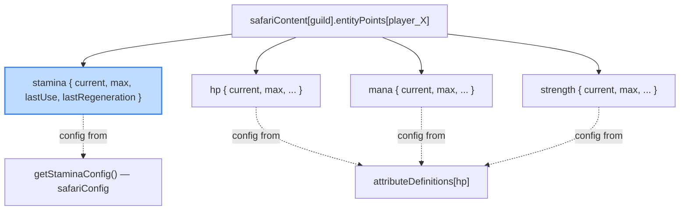

**Where they diverge today** (the things to reconcile if/when they're aligned):

| Aspect | Stamina | Other points/attributes (HP, mana, stats) |
|---|---|---|
| Config source | `getStaminaConfig()` → `safariConfig.{startingStamina,maxStamina,…}` | `attributeDefinitions[type]` (per-attribute `defaultMax`, regeneration) |
| Max-reconcile on read | **Yes** — `max` snapped to `effectiveMax` (stamina-only branch) | **No** — preserves admin-set custom `max` (`setPlayerAttribute`) |
| Per-player custom max | Not a concept (max is config-derived) | Supported via `setPlayerAttribute` / `attr_max` |
| Input ceiling | `MAX_STAMINA` (`config/safariLimits.js`) | Per-attribute, validated separately |
| Regen "amount=max" semantics | Full reset, now clamped | Same engine; depends on the attribute's `regeneration` block |
| Default fallback | `STAMINA_MAX ‖ 1` (the `||1` footgun) | `attrDef.defaultMax ?? defaultValue ?? 100` |

> 🎯 **Future goal (Reece):** *align* stamina with the generic points/attribute model so there's one consistent config surface, one reconcile policy, and one over-max rule across stamina + HP + mana + custom stats — rather than stamina carrying its own parallel config (`getStaminaConfig`), its own reconcile branch, and the `||1` default. The open drip-mode over-max decision (item **e** below) and the stamina-only reconcile (item **d**) are the main divergences to settle first. See [Attributes.md](Attributes.md) for the attribute side.

---

## Recent Changes & Known Inconsistencies

| Item | What changed / status | Reference |
|---|---|---|
| **(a) Over-mint bug fixed** 🟢 | Full-reset regen used to add the full amount *per period without a final cap*, so a partially-full player could mint over-max (e.g. `98 + 99 = 197`). Now max-mode clamps with `Math.min(current, effectiveMax)`. Drip mode is intentionally left un-clamped. | commit `2dd0f314`; `pointsManager.js:376-378` |
| **(b) Admin set now sticks** 🟢 | `setEntityPoints` resets **both** `lastUse` and `lastRegeneration`, so an admin-set value is no longer instantly regenerated away on the next read. | commit `2dd0f314`; `pointsManager.js:627-628` |
| **(c) `MAX_STAMINA` single constant** 🟢 | Replaced scattered magic `99`s with one `MAX_STAMINA = 999` ceiling used by every stamina input + derived `MAX_STAMINA_DIGITS`. Since 2026-07-16 it also caps `effectiveMax` in the engine. | `config/safariLimits.js:38,56-57`; `pointsManager.js:323` |
| **(d) Max-reconcile scoped to stamina** 🟢 | Stamina `max` is snapped to `effectiveMax` on read; attributes (hp/mana) are left alone to preserve admin-set custom maxes. | commits `869c03df`, `242fea63`; `pointsManager.js:336-349` |
| **(e) ⚠️ Drip mode still overshoots max** 🔴 **OPEN** | In drip mode, `current += N` is **not** clamped. This **contradicts the stated design rule** that *only consumables* should exceed max. It is currently *intentional* (a way to hand out multiple moves per cycle even when max is low), but it muddies the over-max model. **Pending decision:** either (1) keep drip-over-max and document it as a third legitimate over-max source, or (2) clamp drip to `effectiveMax` and force hosts to raise max instead. Flagged for Reece. | `pointsManager.js:351-391` (no clamp in drip branch); tests note "does NOT cap at max" |
| **(f) De-init now clears stamina/attributes** 🟢 | De-initialize previously deleted only `playerData.players[userId].safari` — it left `safariContent.entityPoints[player_X]` (the authoritative stamina/HP/attribute store) behind. A later re-init then *skipped* re-creating the existing record (`initializeEntityPoints` only creates when absent), keeping the OLD `current` while the max-reconcile patched `max` to the new config → e.g. **`3/999` after a config change + de-init + re-init** instead of `999/999`. `deinitializePlayer` now also deletes `entityPoints[player_X]` and saves — a true blank slate. (Also: the de-init "backup" is an **in-memory snapshot for success-message counts only — never persisted, not restorable**; the misleading "A backup is taken first" UI text was removed.) | commit `c9c0df65`; `safariDeinitialization.js` (`deinitializePlayer`) |
| **(g) Regen anchor = later of spend/regen** 🟢 | Full-reset *and* drip now anchor to `latestRegenAnchor = max(lastUse, lastRegeneration)`. Fixes two bugs: drip mode re-granting on every check (`lastUse` never advanced after a regen) and insta-regen after idling at MAX (the `618737f7` bug, `lastRegeneration` gone stale). Timer displays and Manually Set Refresh use the same anchor. | commit `e86260d7` (Jul 2026); `pointsManager.js:304` |
| **(h) "Bigger Tank" — Phase-2 charge system removed** 🟢 | Permanent items are now **+max only**: `effectiveMax = min(defaultMax + permanentBoost, MAX_STAMINA)`. No `charges[]`, no per-point timers, no engine switch — the extra capacity refills under the normal regen mode. `staminaBoost` is numerically coerced at read (`Number(…) ‖ 0`) and at write (`entityManager` schema coercion), killing the string-concat corruption (`99 + "01" = "9901"` max with a 9,901-null charge array on a real prod record). Legacy `charges` arrays migrate away lazily on regen read or admin set. | 2026-07-16; `pointsManager.js:16,31,314-334`; `entityManager.js:136-141` |

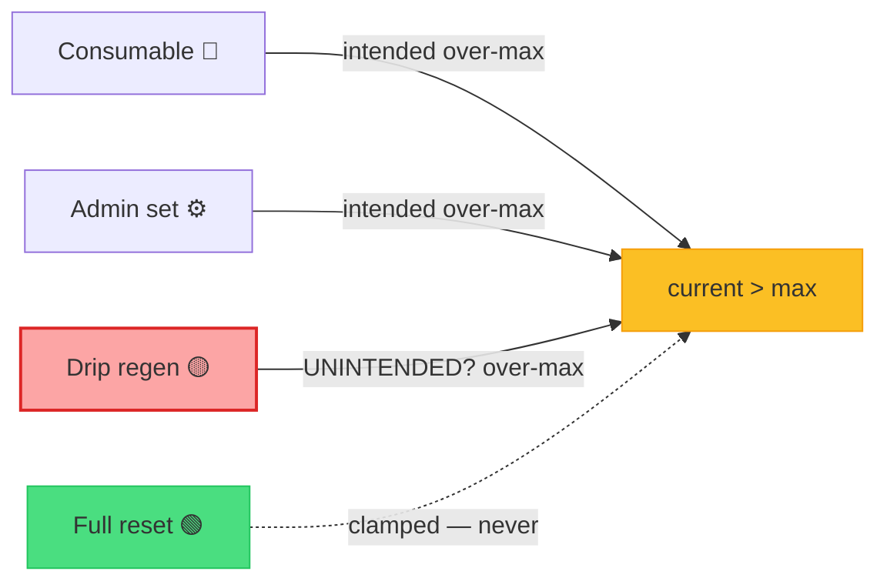

---

## Glossary

| Term | Definition |
|---|---|
| **Numerator (`current`)** | How much stamina the player has right now. The only truly persisted "real" state. Decreases on `usePoints`, increases on regen/boost. |
| **Denominator (`max`)** | The player's capacity cache. For stamina it is **recomputed to `effectiveMax` on every read** — it is derived, not authored. |
| **`effectiveMax`** | `min(config.maxStamina + permanentBoost, MAX_STAMINA)`. The true ceiling that full-reset regen fills to. |
| **`permanentBoost`** | Sum of `staminaBoost` (numerically coerced) across all **non-consumable** held items. Raises `effectiveMax` — nothing else ("bigger tank"). |
| **`latestRegenAnchor`** | `max(lastUse, lastRegeneration)` — the later of last spend and last applied regen. The single anchor for regen, timer displays, and Set Refresh. |
| **Full reset** | Regen mode (amount = blank/null): each interval refills `current` to `effectiveMax`, **clamped** — never over-max. |
| **Drip** | Regen mode (amount = N): each interval adds `N` to `current`; `lastRegeneration` advances by applied periods. Currently **not clamped** (can overshoot — item (e) in Recent Changes). |
| **`lastUse`** | ms epoch of the player's last *spend* — **always** stamped by `usePoints`. One half of the regen anchor. Reset by admin set. |
| **`lastRegeneration`** | ms epoch of the last *applied* regen — the other half of the anchor (goes stale at MAX, which is why the anchor takes the later of the two). |
| **Consumable boost** | A used-up item that adds to `current`, may exceed max, and does **not** reset the regen timer. |
| **Over-max** | `current > effectiveMax`. Legitimately reached via consumables and admin sets (and — disputed — drip). Regen never raises `current` *above* max; the player must spend down first. |
| **Max-reconcile** | The on-read snap of stored stamina `max` to `effectiveMax` (stamina only). |
| **`charges[]` (legacy)** | The removed Phase-2 per-charge array. Migrated away lazily (one-way) on regen read or admin set — see Data Shape. |
| **Phase 1 / Phase 2 (historical)** | The old split: Phase 1 = single cooldown, Phase 2 = per-charge tracking once a permanent item was held. **Removed 2026-07-16** — everyone is on the single anchor-based timer now. |

---

## Key Code Map

| Concern | Location |
|---|---|
| Init from config | `pointsManager.js:121` `initializeEntityPoints` |
| Read + regen + save | `pointsManager.js:212` `getEntityPoints` |
| Regen anchor | `pointsManager.js:304` `latestRegenAnchor` |
| Core regen (full-reset & drip, legacy-charges migration) | `pointsManager.js:314` `calculateRegenerationWithCharges` (historical name) |
| Legacy regen | `pointsManager.js:397` `calculateRegeneration` |
| Spend (always stamps `lastUse`) | `pointsManager.js:429` `usePoints` |
| Admin set (over-max, anchor reset, drops legacy charges) | `pointsManager.js:598` `setEntityPoints` |
| Admin set refresh (time-shift cooldown) | `pointsManager.js:562` `setRegenCountdown` + `:525` `getRegenRemainingMs`; modal `safariMapAdmin.js:838` `createRefreshModal`; submit `spm_refresh_modal_*` in app.js |
| Consumable over-max add | `pointsManager.js:791` `addBonusPoints` |
| Permanent boost sum (numeric coercion) | `pointsManager.js:16` `calculatePermanentStaminaBoost` |
| Write-side numeric coercion | `entityManager.js:136-141` (`updateEntityFields`, schema `type: 'number'`) |
| Generic item modifiers (Phase 5) | `pointsManager.js:54` `calculateAttributeModifiers` |
| Time-until-regen (display) | `pointsManager.js:465` `getTimeUntilRegeneration` |
| Default points config (`STAMINA_MAX‖1`) | `pointsManager.js:194` `getDefaultPointsConfig` |
| Server config resolution | `safariManager.js:9621` `getStaminaConfig` |
| Consumable `staminaBoost` field | `safariManager.js:2655` (item creation) |
| Custom-terms stamina defaults | `safariManager.js:5608` `resetCustomTerms` |
| Server Stamina config modal | `app.js:16448-16542` |
| Modal validation & save | `app.js:47442-47533` |
| Per-player set + modal | `safariMapAdmin.js:636` `setPlayerStamina`, `:767` `createStaminaModal` |
| Input ceiling constant | `config/safariLimits.js:38` `MAX_STAMINA` |
| Player-facing wording | `staminaGuide.js` (Safari Guide pages 1-3, Prod Guide pages 2-3) |

---

## Related Documentation

- [Attributes.md](Attributes.md) — generic player stats/resources/regeneration (stamina is the original special case)
- [SafariMapMovement.md](SafariMapMovement.md) — where the 1-stamina-per-move cost is spent
- [SafariInitialization.md](SafariInitialization.md) — player init flow and config resolution
- [Safari.md](Safari.md) — Safari system overview
- `staminaGuide.js` — in-product player & host guides

---

*This document is the authoritative reference for CastBot's stamina architecture. The numerator/denominator split, the on-read regen-and-save model, and the over-max rules are the three things to remember; everything else follows from them.*
