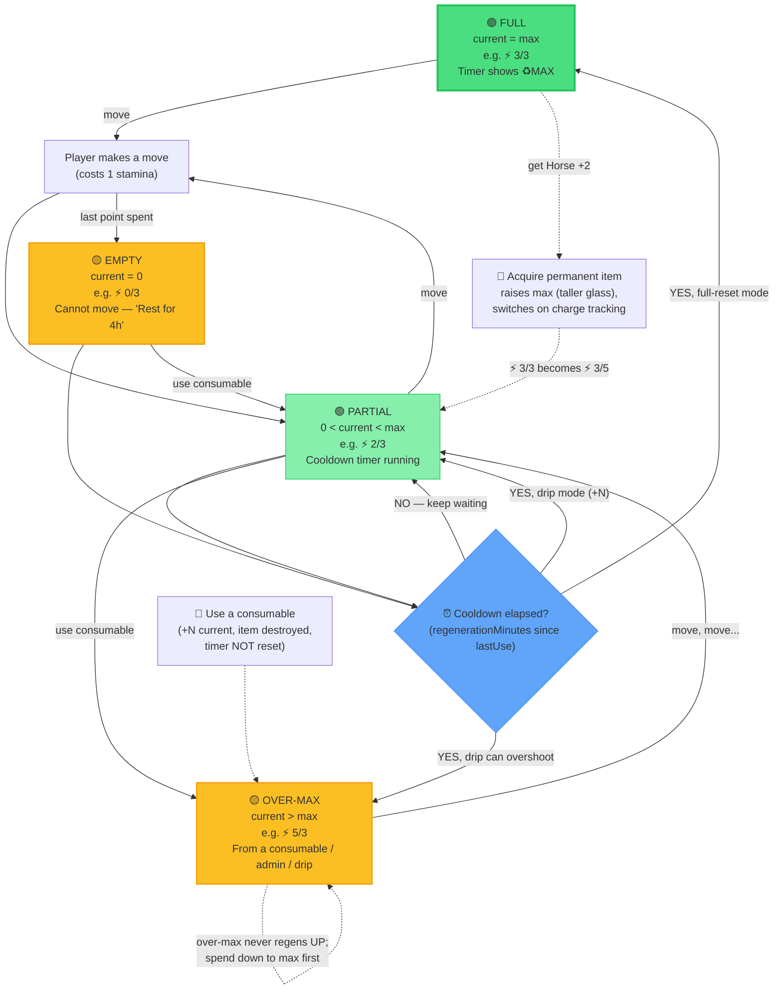
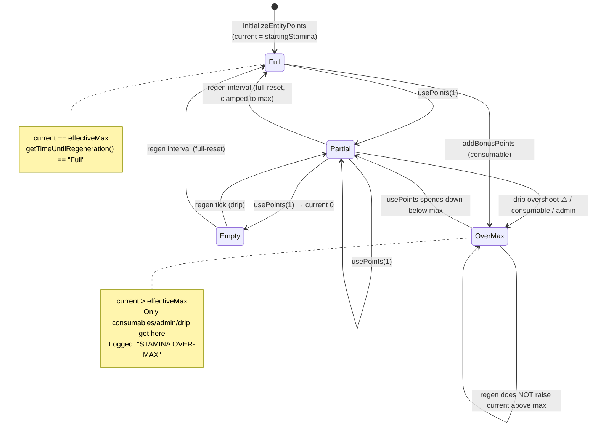
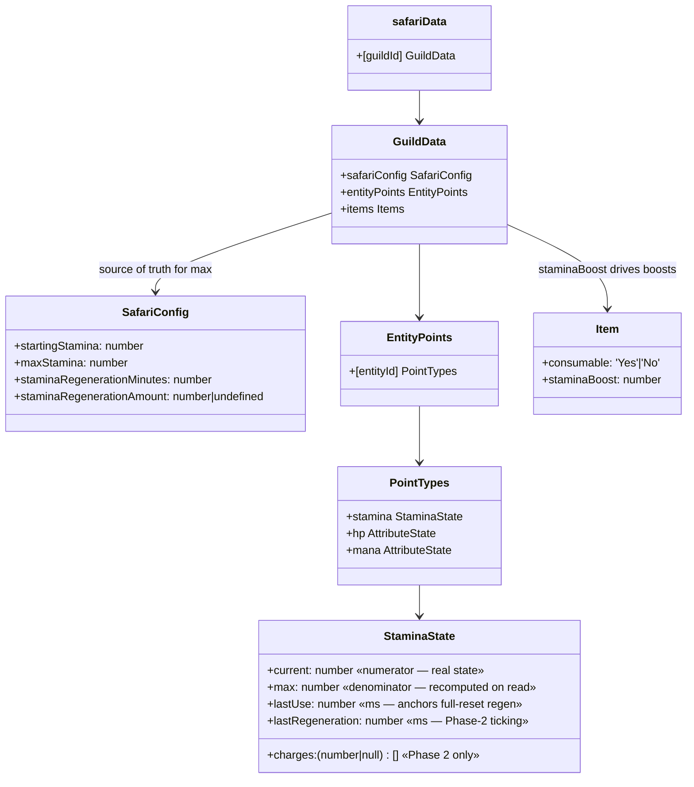
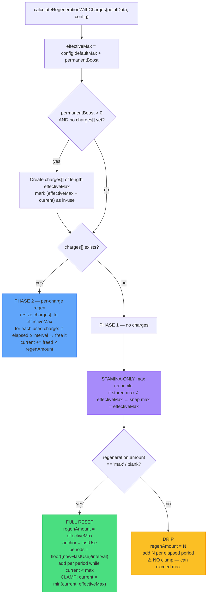
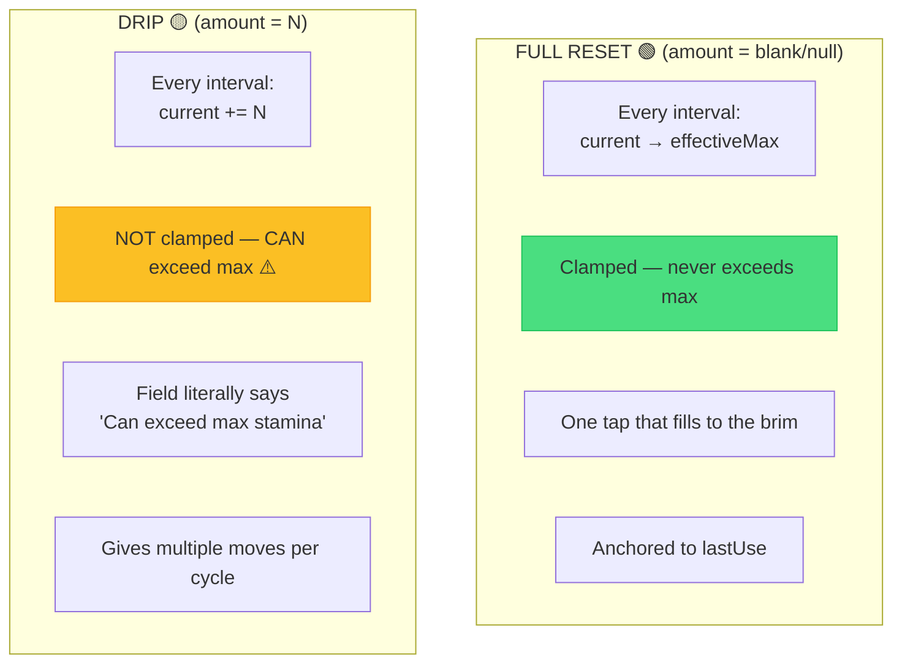
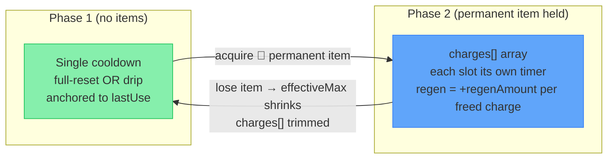
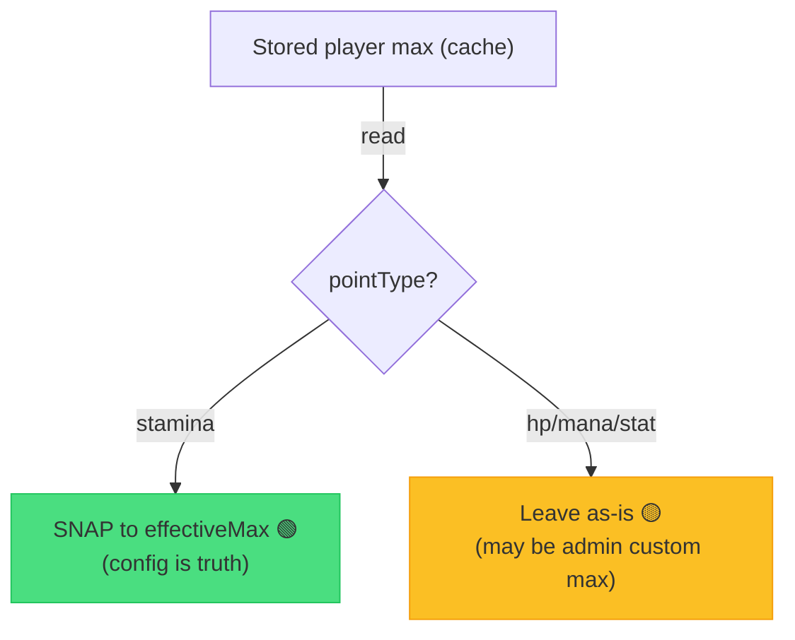
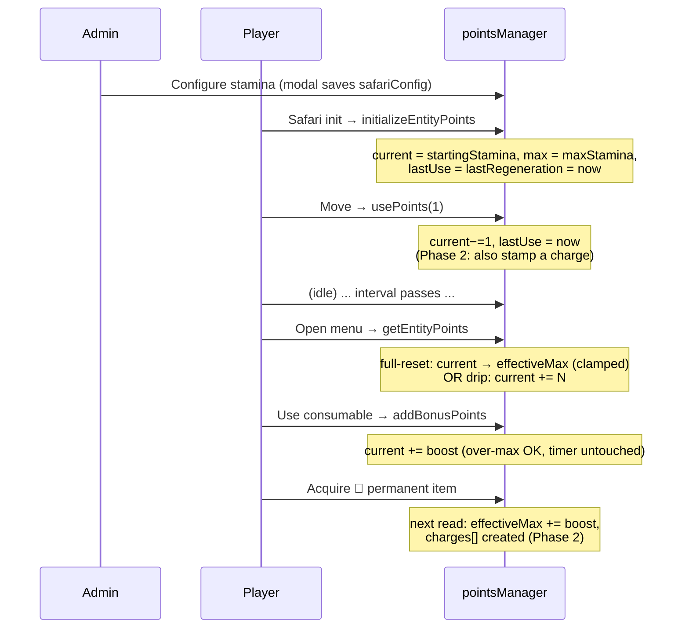
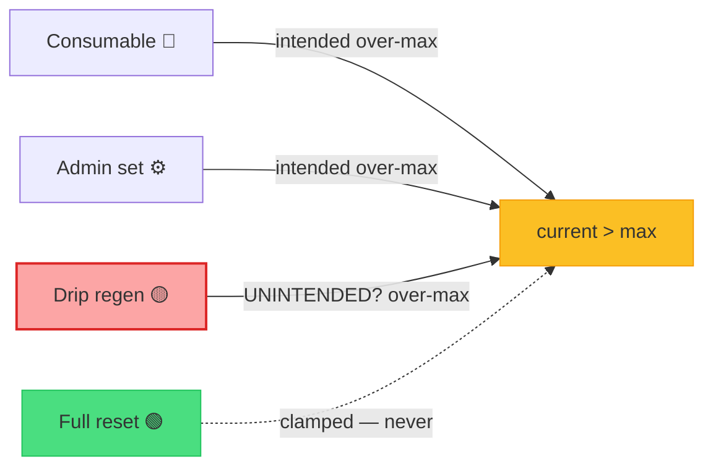

# Stamina Architecture

**Status**: 🟢 Production (As-Built)
**Last Updated**: June 2026
**Purpose**: Authoritative, plain-English-first reference for how CastBot's Safari stamina system actually works — current vs max, regeneration cycles, consumable boosts, and permanent item boosts — after years of organic growth.

---

## Executive Summary

Stamina is the **movement budget** of the Safari map game. Every map move costs **1 stamina**. When a player runs out, they wait for it to regenerate. That simple idea has accreted five interacting mechanisms that are easy to confuse:

| # | Mechanism | One-line summary |
|---|-----------|------------------|
| 1 | **Current (numerator)** | How much stamina you have *right now* — the moves you can spend. |
| 2 | **Max (denominator)** | Your normal capacity. Regen (in full-reset mode) fills *up to* here, never past. |
| 3 | **Regeneration cycle** | Every `regenerationMinutes`, stamina comes back — either a **full reset** to max, or a **drip** of N. |
| 4 | **Consumable boost** | An item you *use up* to add temporary stamina — the one legitimate way to go **over max**. |
| 5 | **Permanent boost** | A non-consumable item you *hold* that **raises your max** (and switches on per-charge tracking). |

**The single most important rule to internalize:** there is one number that is *current* (the numerator) and one number that is *max* (the denominator), and they are governed by **different rules**. `max` is almost entirely **derived from config + items** (CastBot recalculates and overwrites it on every read). `current` is the **real state** that goes down when you move and up when you regenerate.

```
effectiveMax = serverConfig.maxStamina + permanentBoostFromItems
current can EXCEED effectiveMax — but only via consumables / admin / drip-mode (see §7)
```

### The glass-of-water metaphor

Think of stamina as a **glass of water**:

- **`max` is the height of the glass.** A permanent item (a Horse 🐎) gives you a *taller glass*. The server config sets the default glass height.
- **`current` is how much water is in it.** Moving pours water out. Regeneration pours water back in.
- **Full-reset regen** = a tap that, every cycle, fills the glass **right to the brim and stops**.
- **Drip regen** = a tap that adds **a fixed splash** each cycle — and (today) will *overflow the glass* if you let it (a known inconsistency — see §10).
- **A consumable** = pouring an *extra bottle* in. The water can rise **above the rim** (over-max). It just sits there above the brim until you drink it down.

---

## The Hero Diagram — Functional Flow (non-technical)

This is the diagram to read first. It shows every state stamina can be in, the arrows between them, and five worked reset examples in plain English. (RED = a buggy/edge state, YELLOW = caution/over-max, GREEN = healthy.)



### Five reset examples (read alongside the diagram)

| # | Scenario | Config | Walk-through |
|---|----------|--------|--------------|
| **(a)** | **Spend 1 → full reset** | max 1, regen 12h, blank amount | `⚡ 1/1` → move → `⚡ 0/1` → wait 12h → **`⚡ 1/1`** (refilled to max, stops there). |
| **(b)** | **Drip climbing** | max 10, regen 60m, amount **3** | `⚡ 0/10` → +60m → `⚡ 3/10` → +60m → `⚡ 6/10` → +60m → `⚡ 9/10` → +60m → **`⚡ 12/10`** ⚠️ (drip overshoots — see §10). |
| **(c)** | **Consumable over-max then deplete** | max 119 (e.g. big config), Energy Drink +2 | `⚡ 119/119` → use drink → **`⚡ 121/119`** → move → `120/119` → move → `119/119` → move → `118/119` (now back under max, normal regen resumes). |
| **(d)** | **Permanent +10 ring** | base max 99, Ring of Vigor (non-consumable, staminaBoost 10) | `effectiveMax = 99 + 10 = 109`. Display `⚡ 99/109`. Charge system activates: a 109-slot `charges[]` array, each bonus charge regenerating on its **own** timer. |
| **(e)** | **Admin set sticks** | admin types 98 via Player Admin | `setEntityPoints(…, 98, …, allowOverMax)` resets **both** `lastUse` and `lastRegeneration` to now, so the value **holds** for a full interval instead of being instantly regenerated away. On the next read, `max` is reconciled to the server's `effectiveMax`. |

---

## State Diagram (technical)



---

## Where everything lives — Data Shape



### The stamina record (per player, per guild)

```javascript
// safariData[guildId].entityPoints["player_<userId>"].stamina
{
  current: 2,                // numerator — the only "real" persisted state
  max: 3,                    // denominator — RECOMPUTED to effectiveMax on every read
  lastUse: 1718900000000,    // ms epoch of last spend — anchors full-reset regen
  lastRegeneration: 1718900000000, // ms epoch — used for Phase-2 charge ticking
  charges: [null, null, 1718900000000]  // ONLY present once a permanent boost exists
}
```

- **`entityId`** is always `player_<userId>` for players. (Enemies/NPCs use other prefixes; only `player_` entities have inventories, so only they get item boosts — `calculatePermanentStaminaBoost` early-returns `0` otherwise. `pointsManager.js:16`.)
- **`charges[]` does not exist** for a vanilla player. It is **lazily created** the first time `getEntityPoints` runs *and* the player holds a permanent-boost item (`pointsManager.js:300-310`). This is the Phase-1 → Phase-2 switch.
- **Config does NOT live on the player.** `startingStamina / maxStamina / regenerationMinutes / regenerationAmount` live in `safariData[guildId].safariConfig` and are read fresh every time via `getStaminaConfig()` (`safariManager.js:9542`). The player's stored `max` is just a cache that gets reconciled.

---

## Config Resolution — `getStaminaConfig()`

`safariManager.js:9542`. Per-server config with a `.env` fallback chain. This is the **source of truth** for `max`.

```javascript
const config = {
  startingStamina:   safariConfig.startingStamina   ?? parseInt(process.env.STAMINA_MAX || '1'),
  maxStamina:        safariConfig.maxStamina        ?? parseInt(process.env.STAMINA_MAX || '1'),
  regenerationMinutes: safariConfig.staminaRegenerationMinutes ?? parseInt(process.env.STAMINA_REGEN_MINUTES || '3'),
  regenerationAmount: safariConfig.staminaRegenerationAmount ?? null,  // null = full reset
  defaultStartingCoordinate: customTerms.defaultStartingCoordinate || 'A1'
};
```

> ⚠️ **The `STAMINA_MAX || '1'` footgun.** If a server has **never** opened the Stamina config modal, `safariConfig.maxStamina` is `undefined`, so both starting and max stamina fall back to `process.env.STAMINA_MAX` — and if *that* is unset, **`1`**. New servers therefore default to a max of **1**, which surprises hosts who expect a generous default. (Note the inconsistency: `resetCustomTerms` seeds `maxStamina: 10` / `regen: 60min` — `safariManager.js:5553` — but the *live fallback* in `getStaminaConfig` and `getDefaultPointsConfig` is `1` / `3min`. The seed only applies when custom terms are explicitly reset.) `getDefaultPointsConfig()` (`pointsManager.js:190`) carries the same `STAMINA_MAX || '1'` default for the legacy points path.

**`regenerationAmount` semantics — the field that controls everything:**

| Stored value | Meaning | Mode |
|---|---|---|
| `null` / `undefined` (field deleted) | "max" | **Full reset** — refill to `effectiveMax` each interval, clamped. |
| a number `N` (1–99) | `N` | **Drip** — add `N` each interval (can overshoot — §10). |

The admin sets this via the **Regeneration Amount** field in the Stamina config modal. Blank or `0` → stored as `null` (the `delete` branch). A number → stored as that number (`app.js:47917`, save at `app.js:47969-47974`).

---

## The Read Path — `getEntityPoints()` does the work

There is **no background job**. Stamina is **calculated lazily on read** ("on-demand calculation"). Every time the game needs a player's stamina — they open the menu, try to move, use an item — `getEntityPoints()` runs, computes elapsed-time regen, and **saves the whole safari file** if anything changed.


> 💡 **Read = write.** Because `getEntityPoints` saves when regen advances the clock, *reading* stamina can mutate and persist data. This is why the `lastUse` anchoring (below) matters so much — a bug here means every menu open could mint or destroy stamina.

### Decision flow inside `calculateRegenerationWithCharges()`

`pointsManager.js:292`. This one function handles **both** the no-boost path (Phase 1) and the per-charge path (Phase 2), and within Phase 1 both full-reset and drip.



### Why full-reset anchors to `lastUse`, not `lastRegeneration`

`pointsManager.js:395-423`. The cooldown clock starts from **when the player last spent stamina** (`lastUse`), because `lastRegeneration` goes stale while a player sits at MAX (it never advances if no regen happens). Anchoring to `lastUse` means: "12h after your last move, you refill" — exactly the player-facing promise in the guide. The loop applies regen **period by period**, stopping the moment `current >= effectiveMax`, then (in max mode only) does a final `Math.min` clamp so it can never overshoot.

---

## Full Reset vs Drip — side-by-side



| Aspect | Full reset (`null`) | Drip (`N`) |
|---|---|---|
| Config field | blank / `0` | a number 1–99 |
| Per interval | refill to `effectiveMax` | `+N` |
| Can exceed max? | **No** (clamped, `pointsManager.js:417-419`) | **Yes** (intentional today — §10) |
| Use case | classic "1 move per 12h" | "give 5 moves per cycle even if max is 1" |
| Anchor | `lastUse` | elapsed periods since anchor |

---

## Consumable Boosts — temporary over-max

`safariManager.js:2612` defines the `staminaBoost` field on items. A **consumable** (`consumable: 'Yes'`) with `staminaBoost > 0` is the *intended* way to exceed max.

When used (`app.js:15886`, `app.js:16104`):

```javascript
const newStamina = await addBonusPoints(guildId, entityId, 'stamina', item.staminaBoost);
```

`addBonusPoints` (`pointsManager.js:790`):
- Adds to `current` **without capping at max** → over-max is allowed.
- **Does NOT reset the regen timer** — deliberate, so a player 5 minutes from a natural refill still gets it. (Comment: "consumable items don't punish players by restarting their cooldown.")
- The item is consumed (removed from inventory) separately by the use handler.

In Phase 2 (charges present), `usePoints` only updates `lastUse` when a *real charge* is consumed, **not** when spending bonus/consumable stamina (`pointsManager.js:499-502`) — so popping a consumable and moving on it doesn't disturb charge cooldowns.

---

## Permanent Boosts & the Charge System (Phase 2)

A **non-consumable** item (`consumable: 'No'`) with `staminaBoost > 0` is a **permanent boost**. `calculatePermanentStaminaBoost` (`pointsManager.js:15`) sums the `staminaBoost` of all such held items:

```
effectiveMax = config.maxStamina + permanentBoost
```

The first time a player with a permanent boost has their stamina read, `calculateRegenerationWithCharges` **switches them from Phase 1 to Phase 2** (`pointsManager.js:300-310`):

- It creates a `charges[]` array of length `effectiveMax`.
- `null` = an available charge; a timestamp = an in-use charge regenerating on its **own** clock.
- Each in-use charge becomes available again `interval` ms after it was spent — so charges refill **individually and continuously**, not all-at-once. This is nicer UX for high-max players (you might see `⚡ 2/4` while two charges are still cooling down).
- The array is auto-resized if `effectiveMax` changes (item gained/lost), extending with `null` (available) or trimming the tail (`pointsManager.js:314-325`).



> Note the **modifier generalization** (Phase 5, `calculateAttributeModifiers`, `pointsManager.js:50`): the legacy `staminaBoost` field is now treated as a special case of a generic `attributeModifiers` system (`operation: 'addMax'`). Stamina keeps the old field for backward compatibility; other attributes (mana, hp) use `attributeModifiers`.

---

## The Max-Reconcile — why your stored `max` keeps changing

`pointsManager.js:375-388`. For **stamina only**, every read snaps the stored `max` to the freshly computed `effectiveMax`:

```javascript
if (pointType === 'stamina' && newData.max !== effectiveMax) {
    newData.max = effectiveMax;   // config + item boosts win, always
    hasChanged = true;
}
```

**Why this exists:** stamina `max` is *purely derived* (server config + item boosts), so snapping it is always correct. It fixes players stuck at a stale `max` (e.g. `1`, set before the admin ever configured `maxStamina`) that no amount of regen would otherwise correct.

**Why it's scoped to stamina (commit `242fea63`):** attributes like HP/Mana support an admin-set *custom per-player max* (`setPlayerAttribute`), which this would clobber. For non-stamina the mismatch is **logged only**, never changed (`pointsManager.js:385-387`).



---

## Admin Set — making a value stick

Host path: `/menu` → 🧭 Player Admin → ⚡ Stamina → `createStaminaModal` (`safariMapAdmin.js:766`) → `setPlayerStamina` (`safariMapAdmin.js:635`) → `setEntityPoints(…, allowOverMax=true)` (`pointsManager.js:591`).

Key behaviors of `setEntityPoints`:
- `current = max(0, value)` — never below 0.
- If `max` given: `max = max(1, value)`; clamps `current` to `max` **unless** `allowOverMax` (admin path passes `true`, so admins can grant over-max).
- **Resets BOTH `lastUse` AND `lastRegeneration` to now** (`pointsManager.js:620-621`). This is critical (commit `2dd0f314`): because Phase-1 full-reset anchors to `lastUse`, only resetting `lastRegeneration` left a stale `lastUse` — the *very next read* thought a full period had elapsed and **instantly regenerated the admin's value away** (set 98 → immediately refilled). Treating a set as a fresh anchor makes it stick until the next interval.
- Syncs `charges[]` to the new `current` if charges exist (`pointsManager.js:624-633`).

The modal (`createStaminaModal`) deliberately shows the admin the **base max** (server config), subtracting item boosts, so they edit the base capacity, not the boosted total. Both inputs are capped at `MAX_STAMINA` digits.

---

## The Input Ceiling — `MAX_STAMINA`

`config/safariLimits.js:38`. **One constant, `MAX_STAMINA = 999`**, is the single source of truth for the highest stamina value an admin may *type* — for both current and max, in **both** the server Stamina config modal **and** the per-player Set Stamina modal. `MAX_STAMINA_DIGITS` derives the modal `max_length` from it. This replaced scattered magic `99`s. It bounds only what can be typed; over-max above the denominator is still reachable via consumables/admin (commit history: "magic-99 removal").

Validation (`app.js:47919-47942`): starting `0–MAX_STAMINA`, max `1–MAX_STAMINA` and `>= starting`, regen minutes `1–99999`, regen amount blank or `1–99`.

---

## Lifecycle: Init → Spend → Regen → Boost



---

## Recent Changes & Known Inconsistencies

| Item | What changed / status | Reference |
|---|---|---|
| **(a) Over-mint bug fixed** 🟢 | Full-reset regen used to add the full amount *per period without a final cap*, so a partially-full player could mint over-max (e.g. `98 + 99 = 197`). Now max-mode clamps with `Math.min(current, effectiveMax)`. Drip mode is intentionally left un-clamped. | commit `2dd0f314`; `pointsManager.js:417-419` |
| **(b) Admin set now sticks** 🟢 | `setEntityPoints` resets **both** `lastUse` and `lastRegeneration`, so an admin-set value is no longer instantly regenerated away on the next read. | commit `2dd0f314`; `pointsManager.js:620-621` |
| **(c) `MAX_STAMINA` single constant** 🟢 | Replaced scattered magic `99`s with one `MAX_STAMINA = 999` ceiling used by every stamina input + derived `MAX_STAMINA_DIGITS`. | `config/safariLimits.js:38,53-54` |
| **(d) Max-reconcile scoped to stamina** 🟢 | Stamina `max` is snapped to `effectiveMax` on read; attributes (hp/mana) are left alone to preserve admin-set custom maxes. | commits `869c03df`, `242fea63`; `pointsManager.js:381-388` |
| **(e) ⚠️ Drip mode still overshoots max** 🔴 **OPEN** | In drip mode, `current += N` is **not** clamped, and the config field's own help text says *"Can exceed max stamina."* This **contradicts the stated design rule** that *only consumables* should exceed max. It is currently *intentional* (a way to hand out multiple moves per cycle even when max is low), but it muddies the over-max model. **Pending decision:** either (1) keep drip-over-max and document it as a third legitimate over-max source, or (2) clamp drip to `effectiveMax` and force hosts to raise max instead. Flagged for Reece. | `pointsManager.js:373-432` (no clamp in drip branch); `app.js:16634` (field text); tests note "does NOT cap at max" |



---

## Glossary

| Term | Definition |
|---|---|
| **Numerator (`current`)** | How much stamina the player has right now. The only truly persisted "real" state. Decreases on `usePoints`, increases on regen/boost. |
| **Denominator (`max`)** | The player's capacity cache. For stamina it is **recomputed to `effectiveMax` on every read** — it is derived, not authored. |
| **`effectiveMax`** | `config.maxStamina + permanentBoost`. The true ceiling that full-reset regen fills to. |
| **`permanentBoost`** | Sum of `staminaBoost` across all **non-consumable** held items. Raises `effectiveMax`; activates the charge system. |
| **`charges[]`** | Phase-2 array (length `effectiveMax`). `null` = available, timestamp = in-use & regenerating individually. Created lazily once a permanent boost exists. |
| **Full reset** | Regen mode (amount = blank/null): each interval refills `current` to `effectiveMax`, **clamped** — never over-max. |
| **Drip** | Regen mode (amount = N): each interval adds `N` to `current`. Currently **not clamped** (can overshoot — §10). |
| **`lastUse`** | ms epoch of the player's last *spend*. **Anchors Phase-1 full-reset regen.** Reset by admin set. |
| **`lastRegeneration`** | ms epoch used for Phase-2 charge ticking and partial-period accounting. Goes stale at MAX (hence full-reset uses `lastUse` instead). |
| **Consumable boost** | A used-up item that adds to `current`, may exceed max, and does **not** reset the regen timer. |
| **Over-max** | `current > effectiveMax`. Legitimately reached via consumables and admin sets (and — disputed — drip). Regen never raises `current` *above* max; the player must spend down first. |
| **Max-reconcile** | The on-read snap of stored stamina `max` to `effectiveMax` (stamina only). |
| **Phase 1 / Phase 2** | Phase 1 = no permanent items, single cooldown. Phase 2 = permanent item held, per-charge tracking. |

---

## Key Code Map

| Concern | Location |
|---|---|
| Init from config | `pointsManager.js:117` `initializeEntityPoints` |
| Read + regen + save | `pointsManager.js:208` `getEntityPoints` |
| Core regen (Phase 1 & 2, full-reset & drip) | `pointsManager.js:292` `calculateRegenerationWithCharges` |
| Legacy regen | `pointsManager.js:439` `calculateRegeneration` |
| Spend | `pointsManager.js:471` `usePoints` |
| Admin set (over-max, anchor reset) | `pointsManager.js:591` `setEntityPoints` |
| Consumable over-max add | `pointsManager.js:790` `addBonusPoints` |
| Permanent boost sum | `pointsManager.js:15` `calculatePermanentStaminaBoost` |
| Generic item modifiers (Phase 5) | `pointsManager.js:50` `calculateAttributeModifiers` |
| Time-until-regen (display) | `pointsManager.js:521` `getTimeUntilRegeneration` |
| Default points config (`STAMINA_MAX‖1`) | `pointsManager.js:190` `getDefaultPointsConfig` |
| Server config resolution | `safariManager.js:9542` `getStaminaConfig` |
| Consumable `staminaBoost` field | `safariManager.js:2612` (item creation) |
| Custom-terms stamina defaults | `safariManager.js:5553` `resetCustomTerms` |
| Server Stamina config modal | `app.js:16578-16645` |
| Modal validation & save | `app.js:47900-47976` |
| Per-player set + modal | `safariMapAdmin.js:635` `setPlayerStamina`, `:766` `createStaminaModal` |
| Input ceiling constant | `config/safariLimits.js:38` `MAX_STAMINA` |
| Player-facing wording | `staminaGuide.js` (Safari Guide pages 1-3, Prod Guide pages 2-3) |

---

## Related Documentation

- [Attributes.md](Attributes.md) — generic player stats/resources/regeneration (stamina is the original special case)
- [SafariMapMovement.md](SafariMapMovement.md) — where the 1-stamina-per-move cost is spent
- [SafariInitialization.md](SafariInitialization.md) — player init flow and config resolution
- [Safari.md](Safari.md) — Safari system overview
- `staminaGuide.js` — in-product player & host guides

---

*This document is the authoritative reference for CastBot's stamina architecture. The numerator/denominator split, the on-read regen-and-save model, and the over-max rules are the three things to remember; everything else follows from them.*
