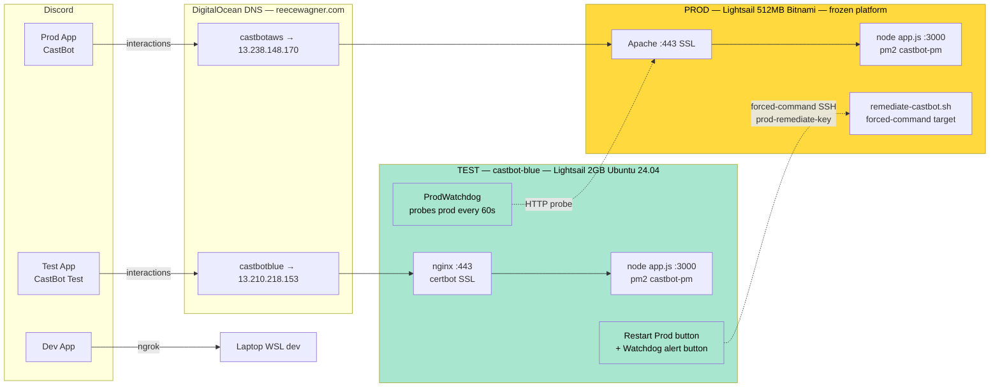

# 🧪 CastBot TEST Instance (castbot-blue) — Blue/Green Staging

**Status:** ✅ Active (live since 2026-06-12)
**Type:** Infrastructure / Deployment / Ops
**Related:** [InfrastructureArchitecture](../infrastructure-security/InfrastructureArchitecture.md) · [BackupStrategy](BackupStrategy.md) · [ServerRestartNotifications](ServerRestartNotifications.md) · [RaP 0915 — Memory Leak OOM](../01-RaP/0915_20260603_MemoryLeakOOM_Analysis.md)

> Promoted from RaP 0914 (the planning doc) once the instance was live. The verbatim design prompt and the full options analysis that produced these decisions are preserved at the bottom under **Origin**.

---

## Overview

**`castbot-blue`** is a second, always-on AWS Lightsail box running a near-copy of the prod stack with its own Discord app, domain, and SSL. It serves three jobs:

1. **Staging gate** — `dev-restart.sh` deploys to test automatically on every change, so changes soak on a real Lightsail box (real SSL, real PM2, prod-scale data) before any prod deploy.
2. **Out-of-band ops console** — a bot that's *up when prod is down*, so the "Restart Prod" button and the automated watchdog can remediate prod when its own process is dead and its own buttons are useless.
3. **Prod-in-waiting** — built on the stack we want prod to be on (Ubuntu 24.04 + nginx, not the retired Bitnami image), so a future cutover is a static-IP swap rather than a rebuild. The box is "blue"; the legacy Bitnami prod box is implicitly "green"/legacy.

The name describes the **box** (`castbot-blue`); `INSTANCE_ROLE=test` in its `.env` describes its current **role**. At a future flip, the role flag flips to prod; the box name doesn't.

---

## At a Glance — The Two Boxes

| | **PROD** (legacy) | **TEST** (`castbot-blue`) |
|---|---|---|
| IP | `13.238.148.170` | `13.210.218.153` |
| SSH alias | `castbot-lightsail` | `castbot-blue` |
| SSH user | `bitnami` | `ubuntu` |
| SSH key | `~/.ssh/castbot-key.pem` | `~/.ssh/castbot-blue-key.pem` |
| Repo path | `/opt/bitnami/projects/castbot` | `/home/ubuntu/castbot` |
| OS / stack | Lightsail 512MB Bitnami, Apache+SSL (nginx dormant) | Lightsail 2GB Ubuntu 24.04, nginx + certbot (snap) |
| Public domain | `castbotaws.reecewagner.com` | `castbotblue.reecewagner.com` |
| Region | ap-southeast-2a (Sydney) | ap-southeast-2a (Sydney) |
| Runtime | Node 22, PM2 `castbot-pm` | Node 22, PM2 `castbot-pm` (same name on purpose) |
| `.env` role | `PRODUCTION=TRUE` | `PRODUCTION=FALSE`, `INSTANCE_ROLE=test` |
| Deploy command | `npm run deploy-remote-wsl` (permissioned) | `npm run deploy-test` (free; also automatic on `dev-restart.sh`) |
| Cost/mo | ~$3.50 (grandfathered) | ~$12 (2GB dual-stack) |

The PM2 process name is **deliberately identical** (`castbot-pm`) on both boxes so every existing script and runbook works unchanged on either.

---

## Architecture



---

## Deployment — Where TEST Fits

```
dev laptop ──auto-commit──▶ GitHub main ──auto-deploy──▶ TEST (soak/verify)
                                        └─deploy-remote-wsl (manual, permissioned)──▶ PROD
```

**Single `main` branch for everything.** Test's value is *environment* fidelity, not *branch* isolation. Promotion discipline replaces branch discipline: **a prod deploy should always have been on test first.**

### Commands

| Command | What it does |
|---|---|
| `./scripts/dev/dev-restart.sh "msg"` | Tests → commit → push → restart DEV → **auto-deploy to TEST** |
| `./scripts/dev/dev-restart.sh -dev-only "msg"` | Restart DEV only; skip the TEST deploy |
| `npm run deploy-test` | Manual full deploy to test (`deploy-remote-wsl.js --target test`) |
| `npm run deploy-test-dry` | Preview a test deploy |
| `npm run logs-test` | `ssh castbot-blue 'pm2 logs castbot-pm --lines 80 --nostream'` |
| `npm run ssh-test` | SSH helper into the test box |

### How the `--target` flag works

`deploy-remote-wsl.js` reads `--target test` (or `--test`) and swaps the connection target via env vars, falling back to hardcoded defaults (`deploy-remote-wsl.js:26-42`):

| Variable | Test default | Prod default |
|---|---|---|
| `TEST_LIGHTSAIL_HOST` / `LIGHTSAIL_HOST` | `13.210.218.153` | `13.238.148.170` |
| `TEST_LIGHTSAIL_USER` / `LIGHTSAIL_USER` | `ubuntu` | `bitnami` |
| `TEST_LIGHTSAIL_PATH` / `LIGHTSAIL_PATH` | `/home/ubuntu/castbot` | `/opt/bitnami/projects/castbot` |
| SSH key | `castbot-blue-key.pem` | `castbot-key.pem` |

The **`dev-restart.sh` auto-deploy** (the common path) is lighter than a full `deploy-test`: it SSHes to `castbot-blue`, `git pull`s, runs `npm install` only if `package*.json` changed, runs `deploy-commands` only if `commands.js` changed, then `pm2 restart castbot-pm`. The standalone `npm run deploy-test` does a full deploy (forced install + command re-registration).

**Prod rules are unchanged and stricter:** dry-run first, explicit permission, foreground, one permission = one deploy.

---

## Developing ON the Test Box (remote Claude Code)

Since 2026-06-14 the box hosts a `claude` CLI (`/usr/bin/claude`, 2.1.177), so Claude Code can run **on the box** for always-on remote dev — and the in-Discord **Moai** advisor (`spawn('claude', …)` at `app.js:39659`) now works there too, same binary + `~/.claude` creds. Full analysis: [RaP 0913](../01-RaP/0913_20260614_RemoteDevTestBox_Analysis.md).

**Two working trees, one sync layer.** The repo lives on the dev laptop *and* on the box (`/home/ubuntu/castbot`, which is also the deploy target). Both push to GitHub `main`; that's the only sync path.

| You are… | Finish a change with | It does |
|---|---|---|
| on the **laptop** | `./scripts/dev/dev-restart.sh "msg"` | tests → commit → push → restart dev → deploy to box |
| on the **box** | `./scripts/dev/box-restart.sh "msg"` | commit → `pull --rebase` → push → tests → `pm2 restart castbot-pm` |

**Iron rule:** never leave uncommitted changes in the box tree — always finish via `box-restart.sh`. If you forget, the laptop's `dev-restart.sh` auto-stashes the dirty box tree before pulling (recover with `git stash list` on the box) — a backstop, not a substitute.

**Connect:** `ssh castbot-blue` → `tmux attach -t vibe` (or `tmux new -s vibe`) → `claude`. Or `claude remote-control` to drive from the claude.ai / mobile UI. Box has a 2 GB swapfile (RaP 0913) so a heavy session can't OOM the watchdog.

> **⚠️ Sessions MUST root in the repo.** SSH drops you in `/home/ubuntu`, but `claude` only loads this project's CLAUDE.md + the SessionStart/Stop hooks when launched from inside `/home/ubuntu/castbot`. The box's `~/.bashrc` auto-`cd`s into the repo for exactly this reason — if it's ever lost (box rebuild), re-add `cd ~/castbot` to `~/.bashrc`. The hooks also self-detect the box by path (`/home/ubuntu/castbot/.git`) as a backstop, but CLAUDE.md context only loads from the repo cwd.

---

## Restart Prod — Manual Out-of-Band Remediation

When prod's bot is down, prod's own buttons are dead — but the test bot is a separate app on a separate box, so its buttons keep working. The **Restart Prod** button lives in the **Data menu (`data_admin`) → Cleanup & Restart** row.

- **Custom IDs:** `restart_prod` (confirm screen) → `restart_prod_confirm` (executes). Both ButtonHandlerFactory-based (`app.js:8201-8267`).
- **Double gate:** restricted to Reece's user ID (`391415444084490240`) *and* no-ops unless `process.env.INSTANCE_ROLE === 'test'`. The button ships in the shared codebase everywhere but only functions on the test box.
- **Mechanism:** `restart_prod_confirm` runs `ssh -i /home/ubuntu/.ssh/prod-remediate-key bitnami@13.238.148.170` with a 90s timeout. That key is registered in prod's `authorized_keys` as a **forced-command** — it can *only* execute `/home/bitnami/remediate-castbot.sh`, nothing else. Even a fully compromised test box can do exactly one thing with this key: run the remediation script.

### `remediate-castbot.sh` (lives on prod, not in this repo)

The script is prod-owned (so its contents can't be swapped from the test box) and supports two modes via the SSH command argument:

- **default (remediate):** if the web layer is down, stop nginx and start Apache; then `pm2 restart castbot-pm` (preserves `NODE_OPTIONS`); print `pm2 list`. Idempotent — safe to mash.
- **`status`:** read-only diagnostics (used by the watchdog for its alert body).

> ⚠️ The script is **not version-controlled** because it lives outside the repo's deploy path on the prod box. If prod is ever rebuilt, this script and the forced-command `authorized_keys` entry must be re-created. Keep a copy with the deployment runbooks.

---

## Prod Watchdog — Automated Liveness Monitor

`src/monitoring/prodWatchdog.js` — an external prod liveness probe that runs *inside the test process*. Prod's own monitors can't report prod being down (a dead process writes no logs); the always-on test box probes prod from the outside.

- **Probe:** HTTP `GET https://castbotaws.reecewagner.com/interactions` every 60s (exercises DNS + Apache + SSL + bot exactly as Discord does). Healthy = any status < 500; no-response or 5xx = unhealthy.
- **State machine:** `evaluateProbe()` is pure and unit-tested (`tests/prodWatchdog.test.js`). Threshold defaults to **1** (alert on first failure). While down, it re-alerts every 30 min; it posts a recovery message when prod responds again.
- **Alert (preferred path):** posts **as the bot** to `#private-bugs` (`1335678517907816530`) with a Components V2 container, an `@mention`, the read-only `status` diagnostics, and a one-click **"Restart Prod Now"** button (custom_id `restart_prod_confirm` — the same handler the manual flow uses). This requires CastBot-Test to be a member of the community server.
- **Alert (fallback):** if posting as the bot fails, it pings via `PROD_WATCHDOG_WEBHOOK_URL` (a manual webhook can't carry a working button, so it includes a "restart via TEST bot" instruction instead).
- **Posture:** read-only on prod, alert-only — it never auto-remediates. Bulletproof: every tick is wrapped so an error can never crash the test box.
- **Gating:** no-ops unless `INSTANCE_ROLE=test` *and* `PROD_WATCHDOG_WEBHOOK_URL` is set. Started in the client `ready` handler (`app.js:1868-1869`).

This is the "Option C auto-watchdog" the planning doc deferred to phase 2 — it's now live alongside the manual button.

---

## Configuration Reference

### Environment variables

Set on the **test box's** `.env` (not the dev-laptop `.env`, which has none of these):

| Variable | Purpose |
|---|---|
| `INSTANCE_ROLE=test` | Master switch. Gates Restart Prod, the watchdog, and monitor behavior. Empty/absent on prod and dev. |
| `PRODUCTION=FALSE` | Standard env flag |
| `PROD_WATCHDOG_WEBHOOK_URL` | Fallback alert webhook (→ `#private-bugs`). Watchdog is disabled if unset. |
| `PROD_WATCHDOG_INTERVAL_MS` | Probe cadence (default 60000) |
| `PROD_WATCHDOG_THRESHOLD` | Consecutive failures before DOWN alert (default 1) |

Dev-laptop `.env` carries the **connection** vars for deploys: `TEST_LIGHTSAIL_HOST/USER/PATH` and `TEST_SSH_KEY_PATH`. `INSTANCE_ROLE` is also injected at deploy-notify time by `deploy-remote-wsl.js` so restart notifications are labeled **TEST** (orange) vs **PRODUCTION** (blue).

### SSH config (`~/.ssh/config`)

```
Host castbot-blue
    HostName 13.210.218.153
    User ubuntu
    IdentityFile "~/.ssh/castbot-blue-key.pem"
    StrictHostKeyChecking no
    ServerAliveInterval 60
    ServerAliveCountMax 3
```

### Keys

- `~/.ssh/castbot-blue-key.pem` — laptop → test box (full SSH).
- `/home/ubuntu/.ssh/prod-remediate-key` (on the test box) — test box → prod, **forced-command only** (`remediate-castbot.sh`).
- `/home/ubuntu/.ssh/github-castbot` (on the test box) — test box → GitHub, **write-enabled deploy key** (`castbot-blue`). Lets `box-restart.sh` push commits made on the box. Box `~/.ssh/config` routes `github.com` to this key; `origin` is the SSH URL `git@github.com:extremedonkey/castbot.git`. Added 2026-06-15 (RaP 0913).

---

## Data Seeding & Safety

- Test box is seeded from a **prod data copy** (playerData.json, safariContent.json) for realistic load and leak-lab parity.
- **`scheduledJobs.json` is seeded empty** — scheduled jobs could otherwise fire outbound webhooks/DMs from the test bot.
- The test bot isn't installed in prod guilds, so most API calls would 403 anyway; empty scheduled jobs is the cheap belt-and-suspenders.
- **Backup service is skipped on the test box** (`INSTANCE_ROLE=test`): its data is a prod copy, so backing it up would duplicate dumps. The health monitor and PM2 error logger *are* enabled on test.

---

## The Future Flip (planned, not yet executed)

The box was built for an eventual blue/green cutover that retires the legacy Bitnami prod box. **None of this has run yet** — it's recorded here so the box keeps being maintained for it:

1. Same PM2 process name + same deploy mechanism on both boxes → the flip needs no script changes.
2. Issue a cert for the **prod** domain on the test box *before* flip day via DNS-01 (`certbot-dns-digitalocean` + DO API token) — DNS-01 doesn't need DNS to point at the box yet.
3. **Flip sequence (~30-60s downtime):** stop test identity → final data delta rsync from prod → swap `.env` to prod creds + `PRODUCTION=TRUE` → stop prod bot → detach static IP `13.238.148.170` from old box, attach to test box → start bot (nginx already has the prod vhost+cert) → verify → hold old box 48h for rollback, then delete. Discord sees nothing: domain, IP, and endpoint URL all unchanged.

---

## Why These Choices (condensed)

- **Ubuntu 24.04 + nginx, not Bitnami:** Broadcom retired Bitnami from AWS Marketplace/Lightsail (2026-06-10); the Node.js blueprint stopped getting updates. Since the test box is the *future prod*, committing it to a dead platform made no sense. nginx also eliminates the recurring "post-reboot nginx grabs port 80, Apache can't bind, interactions dead" outage class that the two-server Bitnami image causes.
- **Subdomain (`castbotblue.reecewagner.com`), not a new domain:** a brand-new A record resolves worldwide in ~1-5 min (propagation is only slow for *changed* records), and certbot can issue immediately. A vanity domain is additive at any time with zero downtime, so it never needed to block the build.
- **2GB box:** it's the future prod, so under-provisioning would force a rebuild before flip. 2GB is ~4.5× current prod RAM, which also makes it a free "leak lab" for RaP 0915's heap-dump work (dumps freeze prod ~74s; harmless on the spare box).

---

<details>
<summary><strong>Origin — RaP 0914 design prompt (verbatim) & decisions</strong></summary>

This doc was promoted from `docs/01-RaP/0914_20260612_CastBotTestInstance_Analysis.md`. The original analysis weighed Bitnami-vs-Ubuntu, subdomain-vs-vanity-domain, instance size, and three Restart-Prod mechanisms (forced-command SSH / Lightsail API reboot / auto-watchdog). The settled decisions:

1. **AWS access:** IAM access key — Claude ran the AWS CLI locally for provisioning.
2. **DNS name:** `castbotblue.reecewagner.com` (role-neutral blue/green naming). Instance name: `castbot-blue`.
3. **Size:** 2GB / 2 vCPU dual-stack, ap-southeast-2a.
4. **Stack:** Ubuntu 24.04 LTS + nginx + certbot (snap) + Node 22 + PM2.
5. **DigitalOcean API token:** yes — used for DNS records + future DNS-01 certs.

> **Original prompt (verbatim):**
>
> Dear Fable, Please review the attached context / RaPs that were created with older and less powerful claude models, and also review the recent and still recurrent issue @docs/01-RaP/0915_20260603_MemoryLeakOOM_Analysis.md
>
> Familiarise yourself with CastBot's full-stack architecture (see @"docs/infrastructure-security/Castbot Documentation (Outdated).pptx" and other files )  including IP, DNS, etc. I want to in this session (or as soon as possible) stand up a new "CastBot Test" instance, deployed to AWS using a very similar architecture to Prod, exploring here a few possible tactical changes to make, with the view to eventually 'flip' test and prod around as part of a future deployment strategy
>
> Lets make a new refreshed RaP covering this prompt and associated changes, with the following in mind
> 1) Where possible I would prefer /you/ to do many of these changes as possible; which may mean for example prioritising getting the lightsail instance and SSH access set up (recognise I'll need to do DNS, discord bot registration etc)
> 2) I want to /consider/ (if not too much effort) setting up a new DNS for TEST, for this i'm happy to register a new domain name like castbot.com, currently prod points to my personal name castbot.reecewagner.com which i dont love, however unlikely the security considerations are. The other option would be castbottest.reecewagner.com or something similar. But I know DNS propagation takes a while and the interactions API won't work without proper SSL which needs DNS and im impatient so it might just be easier to use a new subdomain on my personal domain..
> 3) The current lightsail instance uses bitnami, I saw this notification, please provide considerations for staying on bitnami vs moving off including architectural (changing the prod stack is a lot of effort that I can't be bothered doing right now so if it makes our architecture more consistent, happy to stick with bitnami)
> 4) I've had several outages / issues with prod when i've been out and about; since TEST will provide an always on feature I'd like to investigate a simple feature like adding a 'Restart Prod' button in the reeces_stuff menu (since normally if prod is down, the bot is down, and such a button wouldn't work), please provide options and considerations
> 5) Reconfirm your plan of architectural changes at each layer including any finnicky steps
> 6) I think we already planned these changes but review our current deployment approach (including git) and scripts and let me know where test fits in (I have some views)
> 7) Come up with a full setup plan from start to finish we can punch through including discord registration, dns setup, etc plus the actual instance
>
> Lets ultrathink go

</details>

---

🔁 *Blue/green isn't two environments — it's one environment and its understudy, rehearsing until the night it goes on.*
