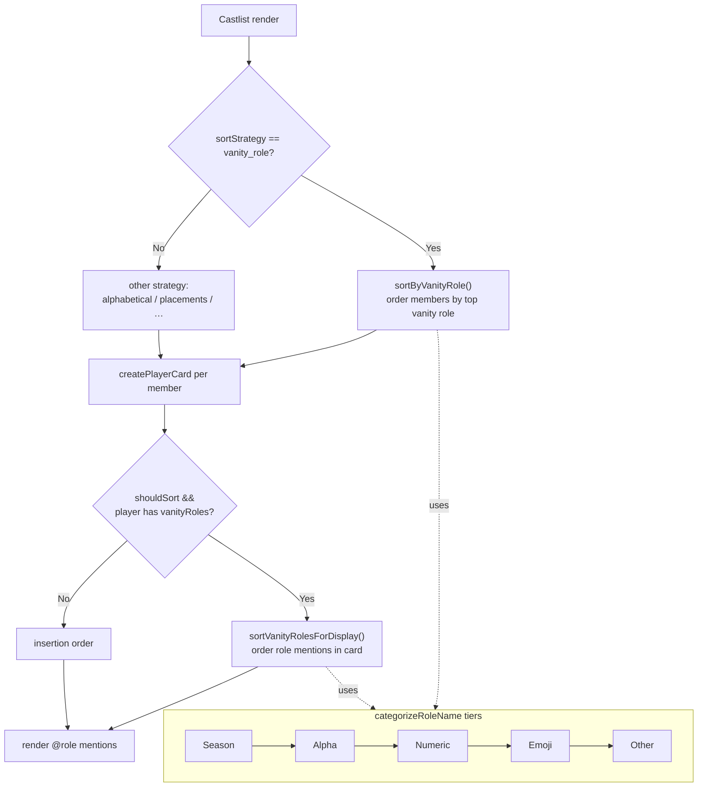

# Vanity Role Sort & Display Order

**Status**: 🟢 Active (in production)
**Shipped**: 2025-11-01 (commit `902fad67`)
**Category**: Castlist Display
**Related**: [Castlist V3](CastlistV3.md), [Tribe Swap/Merge](TribeSwapMerge.md), [Placements](Placements.md)

> **Doc history**: Promoted from RaP-0998 (`0998_20251101_VanityRoleSortDisplay_TechnicalDesign.md`).
> The original design recommended "Option B (utility function)" — that is exactly what shipped.
> The pre-implementation "Current Implementation (unsorted)" snapshot from the RaP has been
> replaced below with the **actual** shipped code, validated against the codebase.

---

## What It Does

"Vanity roles" are the extra tribe roles shown as mentions on a player's castlist card — e.g. old
tribes preserved as cosmetic indicators by [Tribe Swap/Merge](TribeSwapMerge.md). They live at
`playerData[guildId].players[userId].vanityRoles[]` (an array of role IDs).

This feature controls **ordering** in two independent places:

1. **Member ordering within a tribe** — when a castlist uses the `vanity_role` sort strategy, members
   are grouped/ordered by their highest-priority vanity role.
2. **Role ordering within a single player's card** — the vanity role mentions on one card are shown in
   a consistent priority order instead of raw `playerData.json` insertion order.

Both use one shared categorization with five priority tiers:

```
Season  →  Alpha  →  Numeric  →  Emoji  →  Other
 (S1)      (A-Z)      (1-N)      (🏆…)    (fallback)
```

The **Emoji tier** was the headline addition: roles like `🏆Winners` now sort *after* numeric roles
rather than landing in an undefined "other" bucket.

---

## Where It Lives (validated)

| Concern | Function | Location |
|---|---|---|
| Season number parsing (`S1`, `Season 6.5`) | `parseSeasonNumber()` | `castlistSorter.js:265` |
| Tier categorization (season/alpha/numeric/emoji/other) | `categorizeRoleName()` | `castlistSorter.js:290` |
| **Member** ordering by vanity role | `sortByVanityRole()` | `castlistSorter.js:339` |
| **In-card** role ordering (display utility) | `sortVanityRolesForDisplay()` (exported) | `castlistSorter.js:456` |
| Display integration (gated render) | `createPlayerCard()` | `castlistV2.js:209-237` |
| Import into display layer | `import { … sortVanityRolesForDisplay }` | `castlistV2.js:15` |
| `vanity_role` offered as a sort strategy | sort select option lists | `castlistHandlers.js:142, 276, 654` |
| Strategy dispatch | `case 'vanity_role':` | `castlistSorter.js:55` |

The display sort is gated:

```javascript
// castlistV2.js:213
const shouldSort = tribeData?.castlistSettings?.sortStrategy === 'vanity_role';
```

So the in-card ordering only activates for castlists whose sort strategy is `vanity_role`. Other
castlists render vanity roles in insertion order (unchanged behavior).

---

## How It Works

### Tier categorization (`categorizeRoleName`)

```javascript
// castlistSorter.js:290 (actual)
function categorizeRoleName(roleName) {
  if (!roleName) return { category: 'other', value: '' };

  const seasonData = parseSeasonNumber(roleName);            // "S1 - …", "Season 6.5"
  if (seasonData) return { category: 'season', value: seasonData.number, original: roleName };

  const firstChar = roleName.charAt(0);
  if (/[a-z]/i.test(firstChar)) return { category: 'alpha',   value: roleName.toLowerCase(), original: roleName };
  if (/\d/.test(firstChar))    return { category: 'numeric', value: parseInt(roleName.match(/^(\d+)/)?.[1] ?? 0), original: roleName };
  if (!/[a-z0-9]/i.test(firstChar)) return { category: 'emoji', value: roleName, original: roleName };  // 🏆Winners, 😀Happy

  return { category: 'other', value: roleName, original: roleName };
}
```

### Member ordering (`sortByVanityRole`)

For each member it resolves their vanity role IDs to names, categorizes each, picks the **highest
priority** role (priority `season > alpha > numeric > emoji > other`, ties broken alphabetically),
buckets the member, sorts each bucket, then concatenates:

```javascript
// castlistSorter.js:446
return [...seasonRoles, ...alphaRoles, ...numericRoles, ...emojiRoles, ...noVanityRoles];
```

Members with no vanity roles, or whose role IDs can't be resolved to names, fall into the
`noVanityRoles` bucket (sorted alphabetically by display name) and render last.

### In-card ordering (`sortVanityRolesForDisplay`)

A pure utility on `{id, name}` objects — same tiers, same priority order, returns the sorted list
(category metadata stripped). Used by `createPlayerCard`:

```javascript
// castlistV2.js:228-235 (actual)
const orderedRoles = shouldSort
  ? sortVanityRolesForDisplay(rolesWithNames)
  : rolesWithNames;
if (orderedRoles.length > 0) {
  vanityRolesInfo = orderedRoles.map(r => `<@&${r.id}>`).join(' ');
}
```

Unresolvable role IDs are filtered out before sorting (the `member.guild.roles.cache.get(roleId)`
lookup returns nothing → skipped), so deleted roles silently disappear from the card.

### Flow



---

## Data Dependency

- **Source of vanity roles**: [Tribe Swap/Merge](TribeSwapMerge.md) writes `vanityRoles[]` when an
  admin keeps old tribes visible after a swap.
- **Cleanup**: the **Clear Vanity Roles** tool (Data menu → `data_clear_vanity`, module
  `vanityRoleManager.js`) wipes `vanityRoles[]` for all members of a chosen role.
- This feature only **reads** `vanityRoles[]`; it never mutates player data.

---

## Edge Cases & Behavior

| Situation | Behavior |
|---|---|
| Player has no `vanityRoles` | Renders nothing extra; sorts into `noVanityRoles` bucket (last) |
| Vanity role ID no longer exists in Discord | Silently filtered from display; member treated as "no vanity" for member-sort |
| Non-`vanity_role` castlist | In-card order = insertion order (no behavior change) |
| Mixed tiers on one card | Ordered Season → Alpha → Numeric → Emoji → Other |
| `S6.5` / `Season 11` | Parsed as decimal/multi-digit season numbers, sorted numerically |

---

## Alternatives Considered (historical)

The original RaP weighed three options for the in-card display sort:

- **Option A** — sort inline in `castlistV2.js`: rejected (duplicates categorization logic, DRY violation).
- **Option B** — shared exported utility in `castlistSorter.js`, called from the display layer: **chosen & shipped**.
- **Option C** — mutate Discord.js member objects during member sort: rejected (object mutation, tight coupling).

Option B keeps sorting logic in `castlistSorter.js` and lets the display layer opt in — the dependency
direction (display → sorter) is correct and survived the castlist architecture migration unchanged.

---

## Original Trigger Prompt (preserved)

> User requested two enhancements to vanity role sorting:
> 1. **Add Emoji Sort Tier**: Roles starting with emojis (e.g., `@🏆Winners`) should sort AFTER
>    Season/Sx, Alphabetical, and Numeric roles.
> 2. **Order Vanity Roles in Display**: When showing a player's vanity roles in the castlist card,
>    display them in sorted order (Season → Alpha → Numeric → Emoji) instead of `playerData.json`
>    insertion order.
>
> User's specific question: *"Does implementing #2 introduce any tech debt or high-risk tradeoffs,
> considering our transitional architectural state?"* — Answer: No. Option B was implemented and has
> run in production since 2025-11-01 with no follow-up issues.
