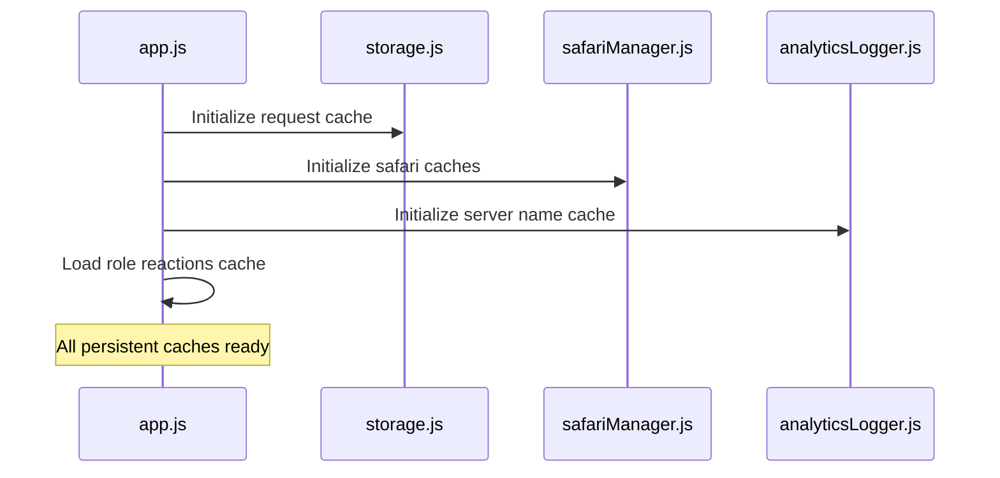
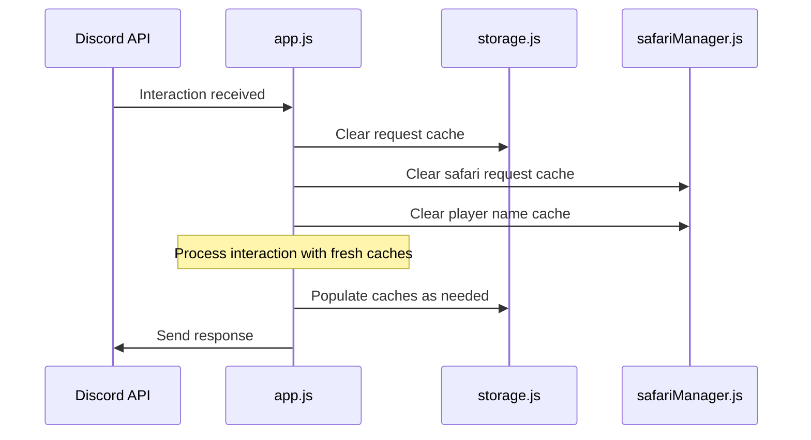

# CastBot Cache Management Guide

## Overview

CastBot uses multiple caching layers to optimize performance and reduce redundant operations. This guide documents all cache implementations, their lifecycles, and management strategies.

## Cache Architecture Overview

```mermaid
graph TB
    subgraph "Request Level"
        RC[Request Cache<br/>storage.js]
        SRC[Safari Request Cache<br/>safariManager.js]
        PNC[Player Name Cache<br/>safariManager.js]
    end

    subgraph "Application Level"
        SNC[Server Name Cache<br/>analyticsLogger.js]
        RRC[Role Reaction Cache<br/>app.js]
        STC[Scheduled Tasks Cache<br/>app.js]
        PIC[Processed Interactions<br/>app.js]
    end

    subgraph "Discord.js Level"
        MGC[Member Cache<br/>Discord.js]
        RGC[Role Cache<br/>Discord.js]
        CHC[Channel Cache<br/>Discord.js]
        MSC[Message Cache<br/>Discord.js]
    end

    subgraph "Analytics Level"
        RLQ[Rate Limit Queue<br/>analyticsLogger.js]
        BLM[Button Label Map<br/>analyticsLogger.js]
    end

    RC --> |Cleared per request| SRC
    SRC --> |Cleared per request| PNC
    SNC --> |Persistent| RRC
    RRC --> |Persistent| STC

    MGC --> |Size limited| RGC
    RGC --> |Size limited| CHC
    CHC --> |Size limited| MSC
```



## Cache Inventory

### 🔄 Request-Scoped Caches

#### 1. Request Cache (`storage.js`)
```javascript
const requestCache = new Map();
```
- **Purpose**: Cache file reads within single request
- **Lifecycle**: Cleared at start of each Discord interaction
- **Size**: Unbounded (but short-lived)
- **Contents**: File data, playerData.json chunks

#### 2. Safari Request Cache (`safariManager.js`)
```javascript
const safariRequestCache = new Map();
```
- **Purpose**: Cache safari content within request
- **Lifecycle**: Cleared at start of each interaction
- **Size**: Unbounded (but short-lived)
- **Contents**: Safari configuration data

#### 3. Player Name Cache (`safariManager.js`)
```javascript
const playerNameCache = new Map();
```
- **Purpose**: Consistent player names within operation
- **Lifecycle**: Cleared per operation
- **Size**: Small (active players only)
- **Contents**: userId → displayName mappings

### 🏛️ Application-Level Caches

#### 4. Server Name Cache (`analyticsLogger.js`) ⭐ NEW
```javascript
const serverNameCache = new Map();
```
- **Purpose**: Eliminate 739KB file reads for server names
- **Lifecycle**: Persistent until restart
- **Size**: Small (one entry per server)
- **Contents**: guildId → serverName mappings
- **Impact**: 98% reduction in file I/O

#### 5. Role Reaction Cache (`app.js`)
```javascript
client.roleReactions = new Map();
```
- **Purpose**: Store role reaction mappings
- **Lifecycle**: Persistent, loaded at startup
- **Size**: Based on configured reactions
- **Contents**: Reaction configuration data

#### 6. Scheduled Safari Tasks (`app.js`)
```javascript
const scheduledSafariTasks = new Map();
```
- **Purpose**: Track scheduled safari operations
- **Lifecycle**: Persistent until completion
- **Size**: Based on active schedules
- **Contents**: Task scheduling information

#### 7. Processed Interactions (`app.js`)
```javascript
const processedInteractions = new Map();
```
- **Purpose**: Prevent duplicate interaction processing
- **Lifecycle**: Persistent (potential leak source)
- **Size**: **⚠️ UNBOUNDED** - Grows indefinitely
- **Risk**: High memory leak potential

### 🎮 Discord.js Caches

#### 8. Guild Member Cache
```javascript
// Current: Unbounded (PROBLEM)
// Recommended: Limited
makeCache: Options.cacheWithLimits({
  GuildMemberManager: 200
})
```
- **Purpose**: Cache Discord member objects
- **Current State**: **⚠️ UNBOUNDED**
- **Risk**: High memory usage with large servers

#### 9. Role Cache
```javascript
// Recommended limit
RoleManager: 100
```
- **Purpose**: Cache Discord role objects
- **Current State**: **⚠️ UNBOUNDED**
- **Risk**: Medium memory usage

#### 10. Message Cache
```javascript
// Recommended limit
MessageManager: 50
```
- **Purpose**: Cache Discord message objects
- **Current State**: **⚠️ UNBOUNDED**
- **Risk**: High memory usage (messages are large)

#### 11. Channel Cache
```javascript
// Usually not a problem, but can be limited
ChannelManager: 100
```
- **Purpose**: Cache Discord channel objects
- **Current State**: Unbounded but typically small

### 📊 Analytics Caches

#### 12. Rate Limit Queue (`analyticsLogger.js`)
```javascript
const runtimeState = {
  rateLimitQueue: [],  // Max 50 entries
  lastMessageTime: 0
};
```
- **Purpose**: Queue analytics messages during rate limiting
- **Size**: Limited to 50 entries
- **Lifecycle**: Processed and cleared automatically

#### 13. Button Label Map (`analyticsLogger.js`)
```javascript
const BUTTON_LABEL_MAP = { /* static mapping */ };
```
- **Purpose**: Map button IDs to human-readable labels
- **Type**: Static configuration (not a cache)
- **Size**: Fixed

## Cache Lifecycle Management

### Startup Sequence


### Request Processing


## Memory Optimization Strategies

### ✅ Implemented Optimizations

#### Server Name Caching (2025-01-22)
- **Problem**: 739KB file read per interaction
- **Solution**: Persistent Map cache with fallback
- **Impact**: 98% reduction in file I/O

#### Request Cache Clearing
- **Implementation**: Automatic clearing at interaction start
- **Impact**: Prevents memory accumulation between requests

### 🚨 Critical Issues to Address

#### 1. Discord.js Cache Limits (HIGH PRIORITY)
**Problem**: Unbounded member, role, message caches
**Solution**:
```javascript
const client = new Client({
  intents: [...],
  makeCache: Options.cacheWithLimits({
    MessageManager: 50,        // Limit message cache
    GuildMemberManager: 200,   // Limit member cache
    RoleManager: 100,          // Limit role cache
    UserManager: 100,          // Limit user cache
    ChannelManager: 100        // Limit channel cache
  })
});
```
**Impact**: Prevent cache from growing beyond reasonable limits

#### 2. Processed Interactions Cleanup (MEDIUM PRIORITY)
**Problem**: `processedInteractions` Map grows indefinitely
**Solution**: Add TTL-based cleanup or size limits
```javascript
// Add cleanup logic
setInterval(() => {
  const cutoff = Date.now() - (60 * 60 * 1000); // 1 hour
  for (const [key, timestamp] of processedInteractions) {
    if (timestamp < cutoff) {
      processedInteractions.delete(key);
    }
  }
}, 5 * 60 * 1000); // Clean every 5 minutes
```

#### 3. Member Fetching Optimization (MEDIUM PRIORITY)
**Problem**: Excessive `guild.members.fetch()` calls
**Pattern**: Cache and reuse member objects within requests
```javascript
// Instead of multiple fetches
const member = await guild.members.fetch(userId);

// Use cached member where possible
const member = guild.members.cache.get(userId) || await guild.members.fetch(userId);
```

### 📈 Monitoring and Alerting

#### Cache Size Monitoring
```javascript
// Add to monitoring scripts
function logCacheStats() {
  console.log('📊 Cache Statistics:');
  console.log(`Request Cache: ${requestCache.size} entries`);
  console.log(`Server Name Cache: ${serverNameCache.size} entries`);
  console.log(`Processed Interactions: ${processedInteractions.size} entries`);
  console.log(`Guild Members: ${client.guilds.cache.reduce((acc, guild) => acc + guild.members.cache.size, 0)} members`);
}
```

#### Memory Pressure Detection
```javascript
// Monitor heap usage relative to cache sizes
if (process.memoryUsage().heapUsed > 250 * 1024 * 1024) { // 250MB
  console.warn('⚠️ High memory usage detected, consider cache cleanup');
  logCacheStats();
}
```

## Best Practices

### Cache Design Principles
1. **Request-Scoped**: Clear between operations
2. **Size Limits**: Always set maximum bounds
3. **TTL**: Implement time-based expiration for long-lived caches
4. **Monitoring**: Track cache hit/miss ratios and sizes
5. **Fallback**: Always have a strategy when cache misses

### Anti-Patterns to Avoid
- ❌ Unbounded Maps without cleanup
- ❌ Persistent caches that never clear
- ❌ Caching large objects unnecessarily
- ❌ Duplicate caching at multiple levels
- ❌ Cache without monitoring

### Cache Sizing Guidelines
- **Small objects** (IDs, names): 1000+ entries OK
- **Medium objects** (user data): 100-500 entries
- **Large objects** (Discord members): 50-200 entries
- **Very large objects** (messages): 10-50 entries

## Emergency Cache Management

### Memory Crisis Response
```bash
# 1. Check cache sizes via logs
npm run logs-prod | grep -E "cache|Cache"

# 2. Restart to clear all caches
pm2 restart castbot-pm

# 3. Monitor recovery
pm2 info castbot-pm | grep "Heap Usage"
```

### Cache Debugging
```javascript
// Add temporary cache size logging
setInterval(() => {
  const memUsage = process.memoryUsage();
  console.log(`Memory: ${Math.round(memUsage.heapUsed / 1024 / 1024)}MB, Caches: ${getCacheSummary()}`);
}, 30000); // Every 30 seconds
```

## Performance Metrics

### Cache Effectiveness Metrics
- **Hit Rate**: Percentage of cache hits vs misses
- **Memory Usage**: Bytes consumed per cache
- **Response Time**: Impact on request processing
- **Eviction Rate**: How often items are removed

### Target Performance
- **Cache Hit Rate**: >90% for stable caches
- **Memory per Cache**: <10MB per cache
- **Lookup Time**: <1ms for cache operations
- **Cleanup Frequency**: Every 5-15 minutes for TTL caches

## Related Documentation

- [Performance Debugging Guide](../troubleshooting/PerformanceDebugging.md)
- [Infrastructure Architecture](../infrastructure/InfrastructureArchitecture.md)
- [Request Scoped Caching](../enablers/RequestScopedCaching.md)

---

*Last Updated: 2025-01-22 - Added server name cache optimization and Discord.js cache limit recommendations*