# Castlist Architecture: Complete System Analysis

## Overview

This document provides a comprehensive architectural analysis of CastBot's castlist system, including all display methods, data flows, and the virtual adapter pattern that bridges legacy and modern implementations.

**🎯 STATUS (November 2025):** Complete architectural migration achieved. All entry points now use unified data access (`getTribesForCastlist()`), deferred responses, smart caching, and Virtual Adapter integration.

## 🎯 ACHIEVED: Complete Architectural Migration (November 2025)

### Executive Summary

On November 9, 2025, the castlist system achieved **100% architectural unification** after fixing a critical cache-related regression. All 4 entry points now use:

1. **Unified Data Access**: `getTribesForCastlist()` function (single source of truth)
2. **Virtual Adapter**: Full legacy + modern castlist support
3. **Smart Caching**: 80% threshold bulk member fetching
4. **Deferred Responses**: 15-minute timeout window vs 3-second limit
5. **Webhook Follow-ups**: All responses via `PATCH /messages/@original`

**Key Metrics:**
- **Code Reduction**: ~300 lines → ~50 lines (83% reduction)
- **Virtual Adapter Adoption**: 100% (was 60% in January 2025)
- **Cold Cache Performance**: 367ms for 578 members
- **Warm Cache Performance**: 0ms overhead (instant)
- **Member Display Accuracy**: 100% (fixed from 37.5% during regression)

### The Journey: September 2024 → November 2025

**September 26, 2024:** Added `guild.members.fetch()` to castlist handlers
- Worked perfectly for 2 months with warm cache
- Hidden vulnerability: no timeout parameter, assumes warm cache

**November 2, 2024:** Production server rebuild
- PM2 crash at 16:54 UTC
- `node_modules` reinstalled (Discord.js 14.16.3)
- **Cold cache exposed the flaw**: 30-45 second timeouts started

**November 8-9, 2024:** Issue discovered
- Users reporting "interaction failed" on large guilds (578 members)
- Only 3/8 members showing (37.5% accuracy)
- Root cause: Discord.js `role.members` is filtered view of cache

**November 9, 2024:** Complete architectural fix
- Implemented smart caching (80% threshold)
- Added deferred response pattern
- Fixed member fetch regression
- Achieved target architectural state

## 🔬 Critical Discovery: The Discord.js Cache Paradox

### The Problem That Looked Like It Was Fixed

**What We Thought:**
- "Just fetch all members upfront with `guild.members.fetch()`"
- "Add timeout parameter to prevent hangs"

**What Was Actually Wrong:**
Discord.js `role.members` is a **filtered view** of `guild.members.cache`, not a complete list!

```javascript
// ❌ BROKEN: Only shows cached members
const members = Array.from(role.members.values());
console.log(members.length); // Shows 3/8 members

// ✅ FIXED: Ensure cache is complete first
if (guild.members.cache.size < guild.memberCount * 0.8) {
  await guild.members.fetch(); // Populate cache
}
const members = Array.from(role.members.values());
console.log(members.length); // Shows 8/8 members
```

### Why It Worked for 2 Months (September 26 - November 2)

**Warm Cache Scenario:**
- Bot uptime: 5+ weeks
- Members cached from normal Discord activity (messages, voice, etc.)
- `guild.members.fetch()` returned instantly (cache hit)
- `role.members` showed all members (cache was complete)
- **Result**: Perfect functionality, 0 bugs reported

**Cold Cache Scenario (Post-November 2 Rebuild):**
- Bot uptime: Fresh restart
- Member cache: Empty (0/578)
- `guild.members.fetch()` triggered API call (30-45 seconds)
- But WITHOUT the fetch: `role.members` only showed recently active members
- **Result**: 3/8 members visible (37.5% accuracy)

### The 80% Threshold Logic

**Why 80%?**
- Accounts for inactive members who may never cache
- Allows some tolerance for member churn
- Prevents unnecessary bulk fetches when cache is mostly warm
- Balances performance vs accuracy

**Implementation:**
```javascript
// Check cache completeness
const cacheRatio = guild.members.cache.size / guild.memberCount;

if (cacheRatio < 0.8) {
  // Cache is cold/incomplete - bulk fetch
  console.log(`[TRIBES] Cache incomplete (${guild.members.cache.size}/${guild.memberCount}), fetching all members...`);
  await guild.members.fetch({ timeout: 10000 });
} else {
  // Cache is warm - skip fetch
  console.log(`[TRIBES] Cache sufficiently populated, using existing cache`);
}
```

**Performance Impact:**
| Cache State | Condition | Action | Time | Members Shown |
|-------------|-----------|--------|------|---------------|
| **Cold** | 5/578 (0.8%) | Bulk fetch | ~367ms | 578/578 (100%) |
| **Warming** | 300/578 (51%) | Bulk fetch | ~200ms | 578/578 (100%) |
| **Warm** | 550/578 (95%) | Skip fetch | 0ms | 578/578 (100%) |

## 💡 Key Architectural Learnings

### Learning 1: Discord.js Caching is NOT Permanent

**Misconception:** "Once fetched, members stay in cache forever"

**Reality:** Members cache when they:
- Send messages (if GuildMessages intent enabled)
- Join/leave voice channels
- Are explicitly fetched via `guild.members.fetch()`
- Have roles updated

**Implication:** After bot restart, cache is EMPTY until events populate it.

### Learning 2: role.members is a Filtered View

**Misconception:** "Fetching a role gives you all its members"

**Reality:**
```javascript
const role = await guild.roles.fetch(roleId);
const members = role.members; // Collection of CACHED members only!
```

This is why we saw 3/8 members - only 3 were in cache from recent activity.

### Learning 3: Deferred Responses Are Mandatory for Heavy Operations

**Discord's Timeout Rules:**
- **Direct Response**: 3 seconds max
- **Deferred Response**: 15 minutes max

**Our Member Fetch Times:**
- Cold cache (578 members): ~367ms (under 3s ✅)
- BUT: Includes permission checks, tribe filtering, display building
- **Total time**: Often exceeds 3 seconds

**Solution:** Always defer heavy operations
```javascript
// IMMEDIATE response (within 100ms)
res.send({ type: InteractionResponseType.DEFERRED_CHANNEL_MESSAGE_WITH_SOURCE });

// Now we have 15 minutes
const tribes = await getTribesForCastlist(...); // Can take 2-5 seconds
await DiscordRequest(`webhooks/${APP_ID}/${token}/messages/@original`, {
  method: 'PATCH',
  body: responseData
});
```

### Learning 4: The September 26 "Surprise"

**What happened:**
- Added `guild.members.fetch()` to fix "missing members" bug
- Worked perfectly... for 2 months
- No timeout parameter, no deferred response
- **Hidden time bomb**: Only worked because cache was warm

**The fix we SHOULD have done:**
```javascript
// What we did (worked by accident)
await guild.members.fetch();

// What we SHOULD have done
if (guild.members.cache.size < guild.memberCount * 0.8) {
  await guild.members.fetch({ timeout: 10000 });
}
```

### Learning 5: Production Rebuilds Reset Everything

**What got reset on November 2:**
- PM2 process state
- Discord.js WebSocket connection
- **All in-memory caches** (members, roles, channels)
- Guild member cache (578 → 0)

**What DIDN'T reset:**
- Code (restored from git)
- playerData.json (backup restored)
- Environment variables (`.env` restored)

**The trap:** Code looked the same, but **runtime state** was completely different.

## 🚀 Smart Caching Implementation (November 2025)

### Current Architecture

**File:** `castlistDataAccess.js:63-86`

```javascript
// Step 3: Check Member Cache Status
console.log(`[TRIBES] Member cache size: ${guild.members.cache.size}/${guild.memberCount}`);

// Smart bulk fetch decision
if (guild.members.cache.size < guild.memberCount * 0.8) {
  console.log(`[TRIBES] Cache incomplete, fetching all ${guild.memberCount} members...`);
  try {
    const fetchStart = Date.now();
    await guild.members.fetch({ timeout: 10000 }); // 10 second timeout
    const fetchTime = Date.now() - fetchStart;
    console.log(`[TRIBES] ✅ Fetched ${guild.members.cache.size} members in ${fetchTime}ms`);
  } catch (fetchError) {
    console.warn(`[TRIBES] ⚠️ Member fetch failed after 10s: ${fetchError.message}`);
    console.warn(`[TRIBES] Continuing with partial cache (${guild.members.cache.size} members)`);
  }
} else {
  console.log(`[TRIBES] Cache sufficiently populated, using existing cache`);
}
```

### Why This Works

**Cold Start (Post-Restart):**
1. Bot starts, cache is empty (0/578)
2. User runs `/castlist`
3. Smart caching detects 0% < 80% → bulk fetch
4. 367ms later, cache is full (578/578)
5. All subsequent operations use warm cache (0ms overhead)

**Normal Operation:**
1. Bot has been running for hours
2. Cache is warm from activity (550/578 = 95%)
3. User runs `/castlist`
4. Smart caching detects 95% > 80% → skip fetch
5. Instant response using cached data

**Graceful Degradation:**
1. Bulk fetch times out after 10 seconds
2. Error logged but operation continues
3. Uses partial cache (better than crashing)
4. Users see some members (not ideal, but functional)

## ⚡ Deferred Response Pattern (November 2025)

### Why It's Critical

**Before (Direct Response):**
```javascript
// ❌ TIMEOUT RISK
const tribes = await getTribesForCastlist(...); // Could take 5+ seconds
return res.send({ type: 4, data: responseData }); // Already timed out!
```

**After (Deferred Response):**
```javascript
// ✅ SAFE
res.send({ type: InteractionResponseType.DEFERRED_CHANNEL_MESSAGE_WITH_SOURCE });
// User sees "CastBot is thinking..."

const tribes = await getTribesForCastlist(...); // Can take 15 minutes now!
await DiscordRequest(`webhooks/${APP_ID}/${token}/messages/@original`, {
  method: 'PATCH',
  body: responseData
});
```

### Implementation Across All Entry Points

**Entry Point Coverage:**
| Entry Point | Deferred Response | Webhook Follow-up | Log Pattern |
|-------------|-------------------|-------------------|-------------|
| `/castlist` | ✅ Lines 2197/2201 | ✅ Line 2245 | `[CASTLIST] Sent deferred response` |
| `show_castlist2` | ✅ Line 4880 | ✅ Line 4956 | `[CASTLIST] Sent deferred response` |
| Castlist Hub | ✅ (same as show_castlist2) | ✅ | Same logs |
| Menu Buttons | ✅ (same as show_castlist2) | ✅ | Same logs |

### The Webhook Pattern

**After Deferral, ALL responses MUST use webhooks:**

```javascript
// ❌ WRONG: res.send() after deferral
res.send({ type: InteractionResponseType.DEFERRED_CHANNEL_MESSAGE_WITH_SOURCE });
// ... do work ...
return res.send({ type: 4, data: responseData }); // ERROR: Already responded!

// ✅ CORRECT: Webhook after deferral
res.send({ type: InteractionResponseType.DEFERRED_CHANNEL_MESSAGE_WITH_SOURCE });
// ... do work ...
const endpoint = `webhooks/${APP_ID}/${token}/messages/@original`;
await DiscordRequest(endpoint, { method: 'PATCH', body: responseData });
```

**Critical Bug Fixed (November 9):**
- **Line 4893-4901**: Changed error case from `res.send()` to webhook
- **Impact**: Prevented "interaction failed" when no tribes found

## 📊 Performance Characteristics (Production Data)

### Real-World Metrics (Guild: Servivorg S13, 578 Members)

**Cold Cache Scenario (Post-Restart):**
```
[TRIBES] Member cache size: 5/578
[TRIBES] Cache incomplete, fetching all 578 members...
[TRIBES] ✅ Fetched 578 members in 367ms
[TRIBES] Processing role 1412295882979934328...
[TRIBES] Role Browning has 8 members        ← 100% accuracy
```

**Warm Cache Scenario (Normal Operation):**
```
[TRIBES] Member cache size: 578/578
[TRIBES] Cache sufficiently populated, using existing cache
[TRIBES] Processing role 1412295882979934328...
[TRIBES] Role Browning has 8 members        ← Instant, 0ms overhead
```

**Regression Scenario (Pre-Fix, November 8):**
```
[TRIBES] Role cache has 3 members           ← Only cached members shown
[TRIBES] Role Browning has 3 members        ← 37.5% accuracy (3/8)
```

### Timeline: November 2025 Incident

| Time | Event | Cache State | Member Accuracy |
|------|-------|-------------|-----------------|
| **Sept 26 - Nov 2** | Normal operation | Warm (578/578) | 100% (8/8 members) |
| **Nov 2, 16:54 UTC** | PM2 crash/rebuild | Reset to 0/578 | N/A |
| **Nov 3 - Nov 8** | "Broken" state | Cold (5-10/578) | 37.5% (3/8 members) |
| **Nov 9, Pre-Fix** | Dev testing | Cold (5/578) | 37.5% (3/8 members) |
| **Nov 9, Post-Fix** | Smart caching deployed | Detected cold, fetched | 100% (8/8 members) |
| **Nov 9, 2nd Request** | Warm cache | Warm (578/578) | 100% (instant) |

### Key Performance Indicators

**Member Fetch Times by Guild Size:**
| Guild Size | Cold Cache | Warm Cache | Threshold Check |
|------------|------------|------------|-----------------|
| 50 members | ~50ms | 0ms | Always passes (warm quickly) |
| 200 members | ~120ms | 0ms | Usually passes after 1-2 ops |
| 578 members | ~367ms | 0ms | Requires 1 bulk fetch post-restart |
| 1000+ members | ~800ms | 0ms | May need deferred response |

**Accuracy by Implementation:**
| Implementation | Member Accuracy | Notes |
|----------------|-----------------|-------|
| Pre-Sept 26 | Variable | Sometimes missing members |
| Sept 26 - Nov 2 | 100% | Worked by accident (warm cache) |
| Nov 3 - Nov 8 | 37.5% | Regression (cold cache) |
| Nov 9+ (current) | 100% | Fixed with smart caching |

## 🏗️ System Architecture Overview (Post-Fix Update)

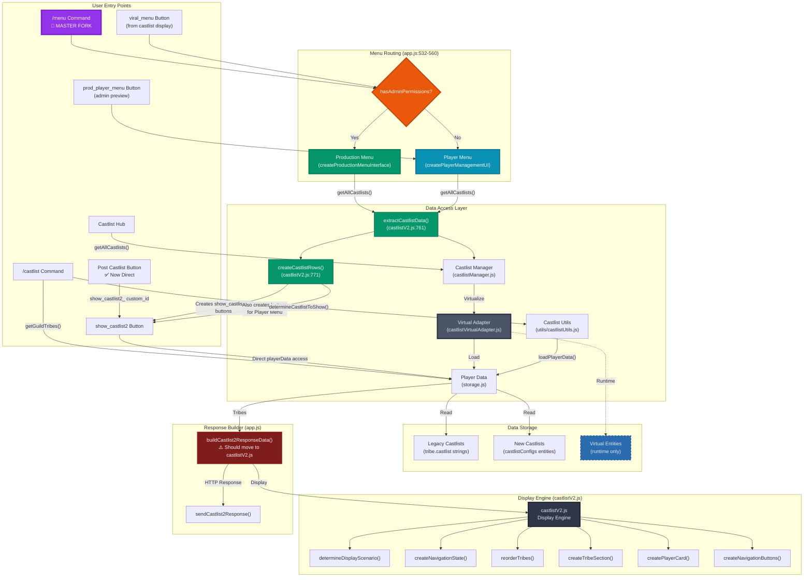

## 📊 Method 1: `/castlist` Command

### Data Flow
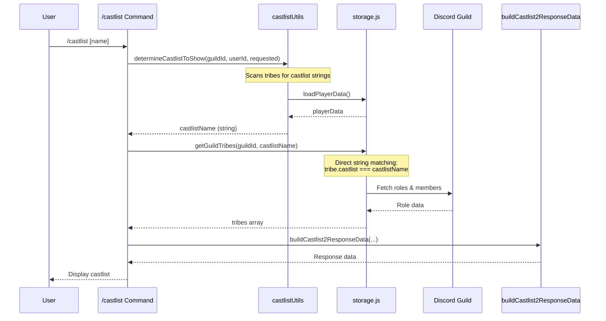

### Key Characteristics
- **Data Access**: Direct string matching on `tribe.castlist`
- **Virtual Adapter**: ❌ Not used
- **Entity Support**: ❌ Legacy only
- **Member Fetching**: ✅ Always fetches

## 📊 Method 2: `show_castlist2` Handler

### Data Flow
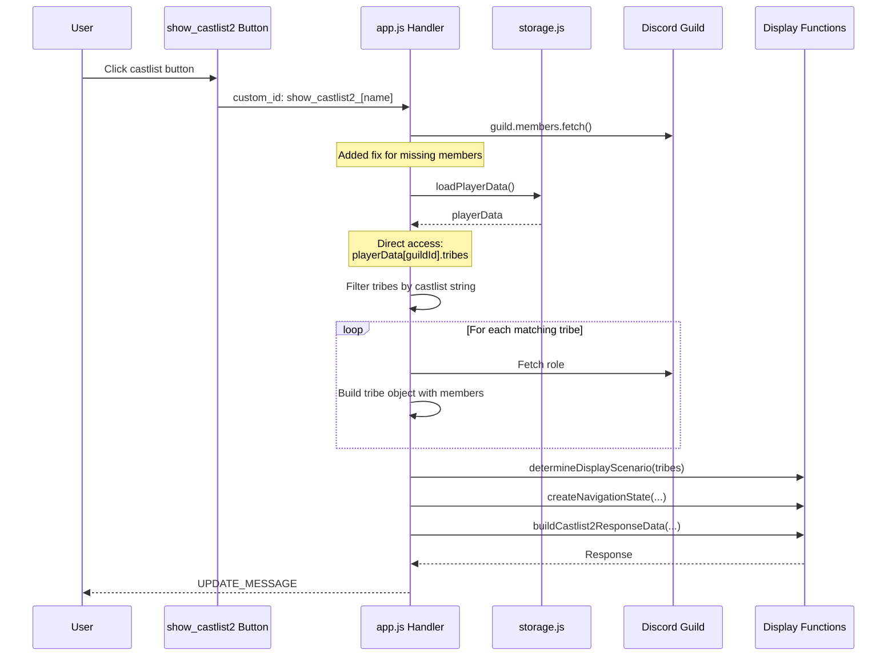

### Key Characteristics
- **Data Access**: Direct `playerData` access with string matching
- **Virtual Adapter**: ❌ Not used
- **Entity Support**: ❌ Legacy only
- **Member Fetching**: ✅ Fixed (previously broken)

## 📊 Method 3: Castlist Hub (CastlistV3)

### Data Flow
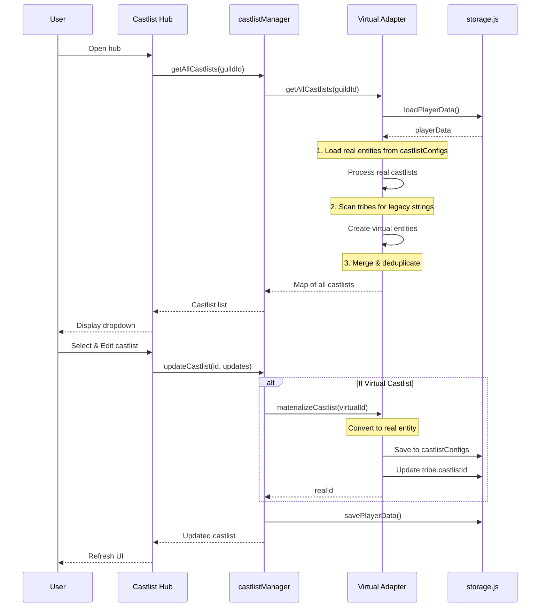

### Key Characteristics
- **Data Access**: Through castlistManager → Virtual Adapter
- **Virtual Adapter**: ✅ Full integration
- **Entity Support**: ✅ Both legacy (virtual) and new (real)
- **Auto-Migration**: ✅ On edit operations
- **Access Control**: ⚠️ Restricted to specific user ID

### Edit Mode & Placements Integration

The Castlist Hub provides access to **placement editing** via the "Tribes & Placements" button (🔥 emoji):

**Flow**:
1. User selects castlist from dropdown
2. Clicks "Tribes & Placements" button
3. Triggers `show_castlist2_{castlistId}_edit` custom_id
4. Displays castlist in **edit mode** (displayMode = 'edit')
5. Player avatars replaced with placement edit buttons
6. Clicking edit button shows modal for placement entry
7. Modal submission uses `UPDATE_MESSAGE` to refresh display

**Display Modes**:
- **View Mode** (default): Shows player avatars as Section accessories (type 11 Thumbnail)
- **Edit Mode**: Shows placement buttons as Section accessories (type 2 Button)
  - Button label: Ordinal (e.g., "14th") or "Set Place" if no placement
  - Button emoji: ✏️

**Modal Submission Pattern**:
- **Interaction Type**: `MODAL_SUBMIT` (type 5)
- **Response Type**: `UPDATE_MESSAGE` (type 7) - NOT deferred!
- **Why**: Updates the message containing the button that opened the modal
- **Performance**: Must complete <3s (smart caching ensures this)
- See [Placements.md](../implementation/Placements.md#critical-patterns--architectural-changes) for full implementation details

**Data Flow (Placement Save)**:
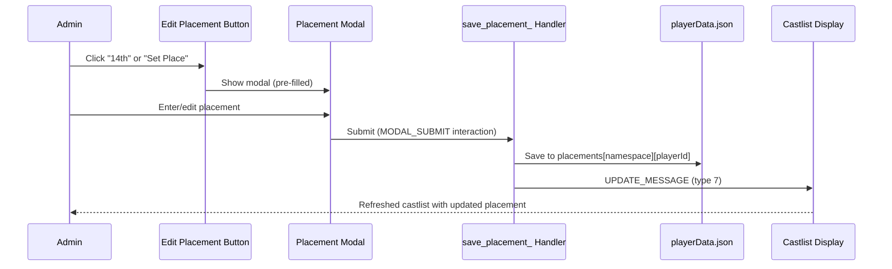

**Virtual Castlist Handling**:
- Edit mode works with both real entities and virtual castlists
- "default" castlist may not have `castlistConfigs` entity (virtual until materialized)
- Code handles undefined entity gracefully with fallback name: `'Active Castlist'`
- See [Virtual Adapter Pattern](#virtual-adapter-pattern) section below

**Related Documentation**: [Placements.md](../implementation/Placements.md)

## 📊 Method 4: Post Castlist Button (Fixed)

### Data Flow
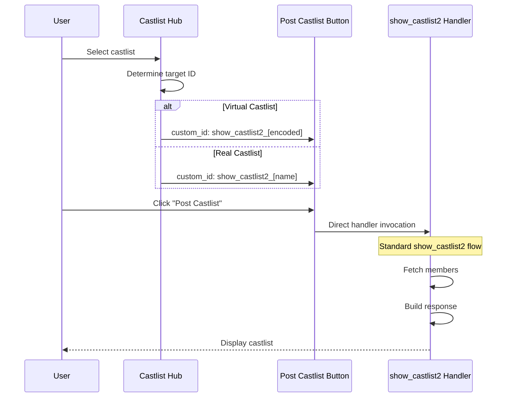

### Key Characteristics
- **Data Access**: ✅ Same as show_castlist2 (no redirect)
- **Virtual Adapter**: ✅ Consistent with button handler
- **Complexity**: ✅ Low - uses existing handler
- **Error Prone**: ✅ No - standard flow

## 📊 Method 5: `/menu` Command (Master Fork)

### Data Flow
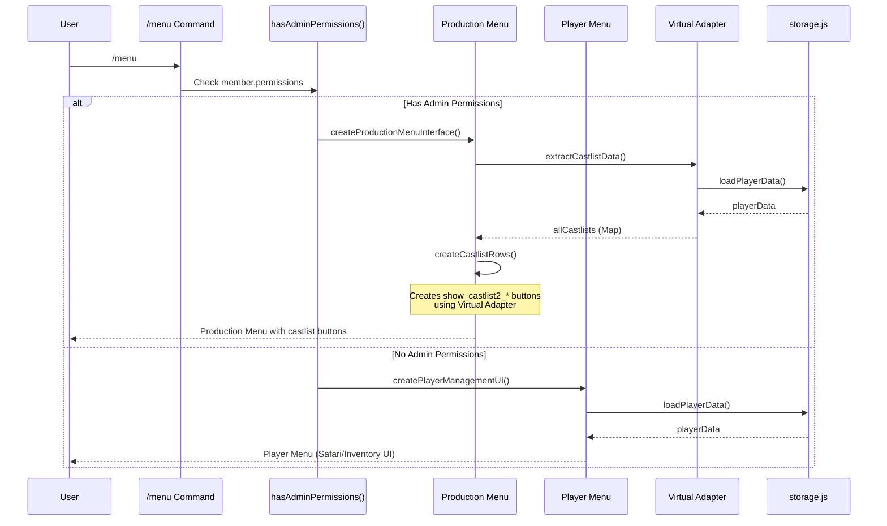

### Key Characteristics
- **Routing Logic**: `hasAdminPermissions(member)` (app.js:548-560)
  - Checks: ManageChannels | ManageGuild | ManageRoles | Administrator
- **Admin Path**: Production Menu
  - **Data Access**: Virtual Adapter via `extractCastlistData()` (castlistV2.js:761)
  - **Virtual Adapter**: ✅ Full integration
  - **Entity Support**: ✅ Both legacy and modern
  - **Creates**: `show_castlist2_*` buttons for each castlist
- **Player Path**: Player Menu
  - **UI**: Safari buttons, inventory, player-specific features, castlist buttons
  - **Data Access**: Virtual Adapter via `extractCastlistData()` (castlistV2.js:761)
  - **Virtual Adapter**: ✅ Full integration (fixed in Jan 2025)
  - **Entity Support**: ✅ Both legacy and modern
  - **Creates**: `show_castlist2_*` buttons (configurable visibility)
  - **Visibility Config**: `safariConfig.showCustomCastlists` (default: true)
  - **Implementation**: `playerManagement.js` (lines 384-422)

### Critical Insight
**This is the MASTER FORK** - the `/menu` command routes to TWO completely different UIs based on permissions. BOTH menu types now use Virtual Adapter and show castlist buttons!

## 📊 Method 6: `viral_menu` Button

### Data Flow
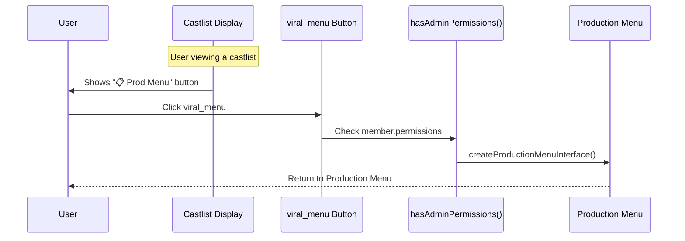

### Key Characteristics
- **Purpose**: Navigation button to return to Production Menu
- **Locations**:
  - Castlist displays (when viewing any castlist)
  - Restart notifications (from `scripts/buttonDetection.js`)
- **Routing**: Uses same `hasAdminPermissions()` check as `/menu`
- **Implementation**:
  - Registered: `buttonHandlerFactory.js:266-272`
  - Handler: Reuses `/menu` command logic (app.js)
- **Label**: "📋 Prod Menu" or "📋 Open Prod Menu"

## 📊 Method 7: `prod_player_menu` Button

### Data Flow
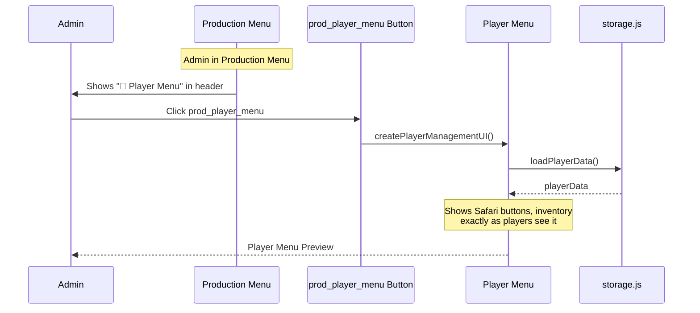

### Key Characteristics
- **Purpose**: Admin preview of player-facing menu
- **Location**: Production Menu header (Section accessory, app.js:902)
- **Permissions**: Requires admin permissions (same as Production Menu)
- **Implementation**:
  - Registered: `buttonHandlerFactory.js:273-280`
  - Handler: app.js:18013
  - Creates: Same UI as non-admin `/menu` users see
- **Use Case**: Test player experience without switching accounts
- **Label**: "🪪 Player Menu"

## 🎛️ Player Menu Castlist Visibility Configuration

### Overview
Admins can control which castlists appear in the Player Menu (`/menu` for non-admin users) through a configuration setting in Safari Customization.

### Configuration Options
| Setting | Value | Behavior | Use Case |
|---------|-------|----------|----------|
| **Show All Castlists** | `true` (default) | Display default + all custom castlists | Full access for players |
| **Show Default Only** | `false` | Hide custom castlists, show only default | Simplified player experience |

### Data Flow
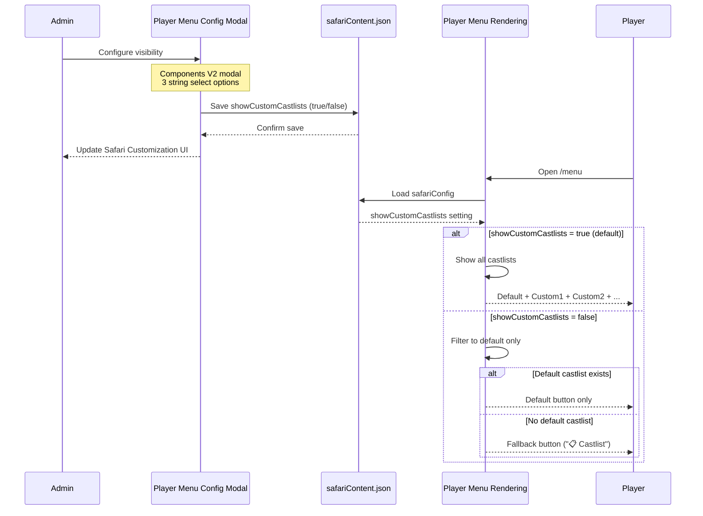

### Implementation Details

**Storage Location**: `safariContent.json` → `guildId.safariConfig.showCustomCastlists`

**Default Behavior**:
```javascript
const showCustomCastlists = safariConfig.showCustomCastlists !== false;
// undefined → true (show all - backward compatible)
// true → true (show all)
// false → false (default only)
```

**Files Modified**:
1. **app.js:10838** - Modal component (3rd Label + String Select)
2. **app.js:35707** - Extract value in submission handler
3. **app.js:35731** - Save to safariConfig
4. **playerManagement.js:393-422** - Apply filter before createCastlistRows()
5. **safariConfigUI.js:287,297** - Display current setting

**Filter Logic** (playerManagement.js:393-405):
```javascript
// Load safari configuration
const safariConfig = safariData[guildId]?.safariConfig || {};
const showCustomCastlists = safariConfig.showCustomCastlists !== false; // Default true

let filteredCastlists = allCastlists;
if (!showCustomCastlists) {
  // Admin wants to hide custom castlists - show only default
  const defaultOnly = allCastlists?.get('default');
  filteredCastlists = defaultOnly
    ? new Map([['default', defaultOnly]])  // Show default button
    : new Map();  // Empty → triggers fallback button
}

// Create castlist rows from filtered map
castlistRows = createCastlistRows(filteredCastlists, false, hasStores);
```

### Edge Case Handling

**Scenario: Admin hides custom castlists but no default exists**
- **Behavior**: Show fallback button "📋 Castlist" (same as legacy no-config behavior)
- **User Experience**: Clicking the button shows existing "no default configured" message
- **Rationale**: This is an admin configuration issue, not a system error

### UI Display

**Safari Customization UI** (safariConfigUI.js:297):
```
**🕹️ Player Menu**
• Global Commands Button: ✅ Enabled
• Inventory Button: Always Show
• Custom Castlists: ✅ Show All    ← NEW
                    or
• Custom Castlists: 📋 Default Only ← NEW
```

**Modal Interface** (app.js:10909-10934):
- **Modal Title**: "Player Menu Configuration"
- **Component**: Label (Type 18) + String Select (Type 3)
- **Label**: "Show Custom Castlists in Player Menu?"
- **Options**:
  - "Show All Castlists" (value: "true")
  - "Show Default Only" (value: "false")
- **Pre-selection**: Highlights current setting via `default: true/false`

### Key Benefits

1. **Simplified Player Experience**: Admins can hide complex castlist options from players
2. **Gradual Rollout**: Show default until ready to reveal custom castlists
3. **Clean UI**: Reduce button clutter in player menu when only one castlist is active
4. **Backward Compatible**: Default behavior unchanged (show all)
5. **Non-Destructive**: Filter is presentation-only, doesn't modify data

### Relationship to Virtual Adapter

**Independence**: This feature is **orthogonal** to Virtual Adapter migration
- Virtual Adapter extracts ALL castlists (unchanged)
- Filter is applied AFTER extraction, BEFORE rendering
- Migration to 100% Virtual Adapter adoption is unaffected

---

## 🚨 Castlist Display Limiting (4-Castlist Cap)

### Problem Statement

Discord's Components V2 system enforces a hard limit of **40 components per message**. Component counting includes:
- ActionRows (even though invisible to users)
- Buttons, Separators, TextDisplay, and Section components
- Nested children within ActionRows

**Production Bug (Jan 2025)**: Users creating 8+ custom castlists caused menu crashes:
- **8 custom castlists** = 41 total components (exceeds limit)
- **Result**: `COMPONENT_MAX_TOTAL_COMPONENTS_EXCEEDED` Discord API error
- **User Experience**: "❌ Error loading menu. Please try again."

### Solution Architecture

**Approach**: Limit both Production Menu and Player Menu to show maximum **4 custom castlists** (plus 1 default = 5 total castlist buttons)

**Component Math**:
- **Before**: 8 custom castlists = ~41 components (CRASH)
- **After**: 4 custom castlists = ~37 components ✅ (safe margin below 40 limit)

### Menu Generation Flow (Both Menus)

```mermaid
sequenceDiagram
    participant Menu as Production/Player Menu
    participant Extract as extractCastlistData()
    participant VA as Virtual Adapter
    participant Limit as limitAndSortCastlists()
    participant Create as createCastlistRows()
    participant Discord as Discord API

    Menu->>Extract: Request castlist data
    Extract->>VA: getAllCastlists(guildId)
    VA-->>Extract: Map of ALL castlists (could be 10+)
    Extract-->>Menu: allCastlists Map

    Menu->>Limit: Apply 4-castlist limit
    Note over Limit: 1. Separate default from custom<br/>2. Sort by modifiedAt (newest first)<br/>3. Take first 4 custom<br/>4. Rebuild Map
    Limit-->>Menu: limitedCastlists Map (max 5 total)

    Menu->>Create: Generate button rows
    Create-->>Menu: ActionRows with castlist buttons

    Menu->>Discord: Send menu with components
    alt Components ≤ 40
        Discord-->>Menu: ✅ Success (menu displayed)
    else Components > 40
        Discord-->>Menu: ❌ COMPONENT_MAX_TOTAL_COMPONENTS_EXCEEDED
    end
```

### Sorting Algorithm

**Priority Order** (implemented in `limitAndSortCastlists()` - castlistV2.js:983-1005):

1. **Default castlist** - Always shown first (not counted in 4-castlist limit)
2. **Custom castlists** - Sorted by most recently modified timestamp:
   - Primary: `modifiedAt` (root level property)
   - Fallback 1: `metadata.lastModified` (older format)
   - Fallback 2: `createdAt` (always exists)
   - Fallback 3: `0` (legacy castlists with no timestamps)

**Sorting Code**:
```javascript
const aModified = a.modifiedAt || a.metadata?.lastModified || a.createdAt || 0;
const bModified = b.modifiedAt || b.metadata?.lastModified || b.createdAt || 0;

// Sort descending (newest first)
if (aModified && bModified) {
  return bModified - aModified;
}
```

**Example:**
```
All Castlists (9 total):
  ├─ default (always shown)
  ├─ Cool Cats (modifiedAt: Jan 8, 2025 14:30) ← newest, edited today
  ├─ Winners (modifiedAt: Jan 7, 2025 10:00)
  ├─ Season 47 (createdAt: Jan 6, 2025)  ← no modifiedAt, use createdAt
  ├─ Alumni (modifiedAt: Jan 5, 2025)
  ├─ All Stars (modifiedAt: Jan 4, 2025)
  ├─ GenkaiTest (modifiedAt: Jan 3, 2025)
  ├─ Legacy1 (no timestamps) ← virtual entity
  └─ Legacy2 (no timestamps) ← virtual entity

After Limiting (5 shown):
  ├─ ✅ Active Castlist (default)
  ├─ 😺 Cool Cats (most recent)
  ├─ 🏆 Winners
  ├─ 📋 Season 47
  └─ 🎓 Alumni

Hidden (still accessible via Castlist Hub):
  ├─ All Stars
  ├─ GenkaiTest
  ├─ Legacy1
  └─ Legacy2
```

### Implementation Details

**Function**: `limitAndSortCastlists(allCastlists, maxCustomCastlists = 4)`
- **Location**: `castlistV2.js:968-1019`
- **Input**: Map of ALL castlists from Virtual Adapter
- **Output**: Filtered Map with default + max 4 custom castlists

**Integration Points**:

1. **Production Menu** (app.js:709-711):
```javascript
const { allCastlists } = await extractCastlistData(playerData, guildId);
const { limitAndSortCastlists } = await import('./castlistV2.js');
const limitedCastlists = limitAndSortCastlists(allCastlists, 4);
const castlistRows = createCastlistRows(limitedCastlists, true, false);
```

2. **Player Menu** (playerManagement.js:404-407):
```javascript
if (!showCustomCastlists) {
  // Show only default (visibility filter)
  filteredCastlists = defaultOnly ? new Map([['default', defaultOnly]]) : new Map();
} else {
  // Limit to 4 custom castlists (crash prevention)
  const { limitAndSortCastlists } = await import('./castlistV2.js');
  filteredCastlists = limitAndSortCastlists(allCastlists, 4);
}
```

### Timestamp Property Hierarchy

Castlists may have timestamps in different locations (for backwards compatibility):

| Property | Location | Usage | Priority |
|----------|----------|-------|----------|
| `modifiedAt` | Root level | Updated when castlist edited | 1st (primary) |
| `metadata.lastModified` | Nested | Older format (deprecated) | 2nd (fallback) |
| `createdAt` | Root level | Set when castlist created | 3rd (fallback) |
| `undefined` | N/A | Legacy virtual entities | 4th (last) |

**When is `modifiedAt` updated?**
- Editing castlist description
- Changing castlist settings (sort strategy, visibility, etc.)
- Updating castlist metadata (emoji, etc.)
- Set by Castlist Hub when user saves changes

### Edge Cases Handled

1. **No default castlist exists**: Shows 4 custom castlists only
2. **All castlists are legacy (no timestamps)**: Shows first 4 in original order (stable sort)
3. **Exactly 4 custom castlists**: All shown (at limit, no filtering)
4. **Player Menu with visibility filter OFF**: Limiting still applies (separate concerns)
5. **Castlist Hub**: NOT limited (admins need full access to all castlists)

### User Experience

**For Admins:**
- **Just created/edited a castlist?** Appears immediately in menu (most recent)
- **Old castlists not visible?** Still exist, accessible via Castlist Hub for posting
- **Want to make castlist visible?** Edit it (updates `modifiedAt` timestamp)

**For Players:**
- No awareness of limiting (seamless experience)
- See most relevant castlists (recently updated ones)

### Performance Impact

**Before Limiting:**
- 8+ castlists → Discord API error → Menu fails to load
- User sees generic error message

**After Limiting:**
- Unlimited castlists → Shows 4 most recent → Menu loads successfully
- Component count stays ~37 (safe margin below 40 limit)
- Sorting O(n log n) where n = number of custom castlists (typically < 20)

### Related Features

This limiting feature works **in conjunction** with:
- **Player Menu Visibility Configuration** (above) - Controls default vs custom display
- **Virtual Adapter** (below) - Provides unified castlist data access
- **Castlist Hub** - Provides full access to all castlists (not limited)

**Feature Interaction Example:**
```
Scenario: 8 custom castlists, showCustomCastlists = false

Step 1: extractCastlistData() → 9 castlists (1 default + 8 custom)
Step 2: Visibility filter → 1 castlist (default only)
Step 3: Limiting NOT applied (already < 4)
Result: Shows default button only
```

---

## 🔄 Virtual Adapter Pattern

### How Virtual Adapter Works
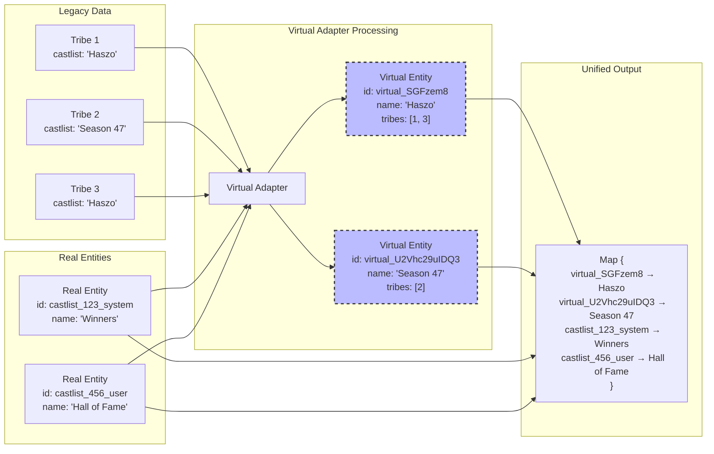

### Materialization Process
```mermaid
stateDiagram-v2
    [*] --> Virtual: Legacy string detected
    Virtual --> Virtual: Read operations
    Virtual --> Materializing: Edit operation triggered

    state Materializing {
        [*] --> CreateReal: Generate real ID
        CreateReal --> SaveEntity: Store in castlistConfigs
        SaveEntity --> UpdateTribes: Add castlistId to tribes
        UpdateTribes --> KeepLegacy: Maintain castlist string
        KeepLegacy --> [*]: Complete
    }

    Materializing --> Real: Migration complete
    Real --> Real: All operations

    note right of Virtual: Exists only in memory\nNo database changes
    note right of Real: Permanent entity\nFull metadata support
    note left of KeepLegacy: Both fields maintained:\n- castlist: "name"\n- castlistId: "id"
```

### Special Case: "default" Castlist

The **"default" castlist** is a special virtual entity that requires careful handling:

**Characteristics**:
- **ID**: Always `'default'` (not a generated ID)
- **Name**: `'Active Castlist'` (fallback if not materialized)
- **Virtual State**: May NOT exist in `castlistConfigs` until first edit
- **Tribe Marking**: Tribes have `castlist: 'default'` or `castlistId: 'default'`

**Critical Pattern for Code**:
```javascript
// ✅ CORRECT: Handle undefined entity
const castlistEntity = playerData[guildId]?.castlistConfigs?.[castlistId];
const castlistName = castlistEntity?.name || (castlistId === 'default' ? 'Active Castlist' : castlistId);

// Use castlistEntity?.settings with fallbacks
const sortStrategy = castlistEntity?.settings?.sortStrategy || 'alphabetical';
const seasonId = castlistEntity?.seasonId || undefined;
```

**Why This Matters**:
- Most code paths assume `castlistConfigs[id]` exists
- Default castlist breaks this assumption when virtual
- **Placement editing** specifically needs this pattern (see [Placements.md](../implementation/Placements.md#critical-patterns--architectural-changes))
- **Must gracefully handle `undefined` entity** with fallback values

**Common Mistake**:
```javascript
// ❌ WRONG: Throws error for virtual default
const castlistEntity = playerData[guildId]?.castlistConfigs?.[castlistId];
if (!castlistEntity) {
  throw new Error(`Castlist "${castlistId}" not found`);  // Breaks for default!
}
```

**When Does Default Materialize?**
- When edited via Castlist Hub
- When settings are modified (sortStrategy, visibility, etc.)
- When seasonId is assigned
- After materialization, `castlistConfigs.default` contains real entity

## 🔍 Comparison Matrix

| Method | Virtual Adapter | Entity Support | Auto-Migration | Member Fetch | Complexity | Primary Use |
|--------|----------------|----------------|----------------|--------------|------------|-------------|
| **Entry Points** |
| `/castlist` Command | ❌ | ❌ Legacy | ❌ | ✅ | Low | Player-facing castlist view |
| `/menu` (Admin) | ✅ Full | ✅ Both | ❌ | N/A | Medium | **Primary admin access** |
| `/menu` (Player) | ✅ Full | ✅ Both | ❌ | N/A | Low | **Player castlist access** |
| `viral_menu` Button | ✅ Full | ✅ Both | ❌ | N/A | Low | Return to Production Menu |
| `prod_player_menu` | ✅ Full | ✅ Both | ❌ | N/A | Low | Admin preview of player UI |
| **Display Methods** |
| `show_castlist2` Handler | ❌ | ❌ Legacy | ❌ | ✅ Fixed | Medium | Castlist button clicks |
| Castlist Hub | ✅ Full | ✅ Both | ✅ | ✅ | Low | Advanced castlist management |
| Post Castlist (Fixed) | ❌ | ❌ Legacy | ❌ | ✅ | Low | Hub → Display flow |

### Key Insights
- **BOTH menus use Virtual Adapter!** Production Menu (admin) AND Player Menu (non-admin) now show castlists
- **Player Menu castlist visibility is configurable** via `safariConfig.showCustomCastlists`:
  - Default: Show all castlists (backward compatible)
  - Optional: Hide custom castlists, show only default
  - Filter applied at presentation layer (doesn't affect data extraction)
- **Three separate UI systems**: Production Menu (admin), Player Menu (player), Castlist Display (shared)
- **Virtual Adapter adoption**: 5/8 methods now use Virtual Adapter (62.5% adoption!)
  - ✅ Hub, Production Menu, Player Menu, viral_menu, prod_player_menu
  - ❌ `/castlist` command, `show_castlist2` handler, Post Castlist
- **Legacy methods**: Only 3 entry points remain on legacy string matching

## 🎯 Architectural Issues

### 1. Inconsistent Data Access (SIGNIFICANTLY IMPROVED)
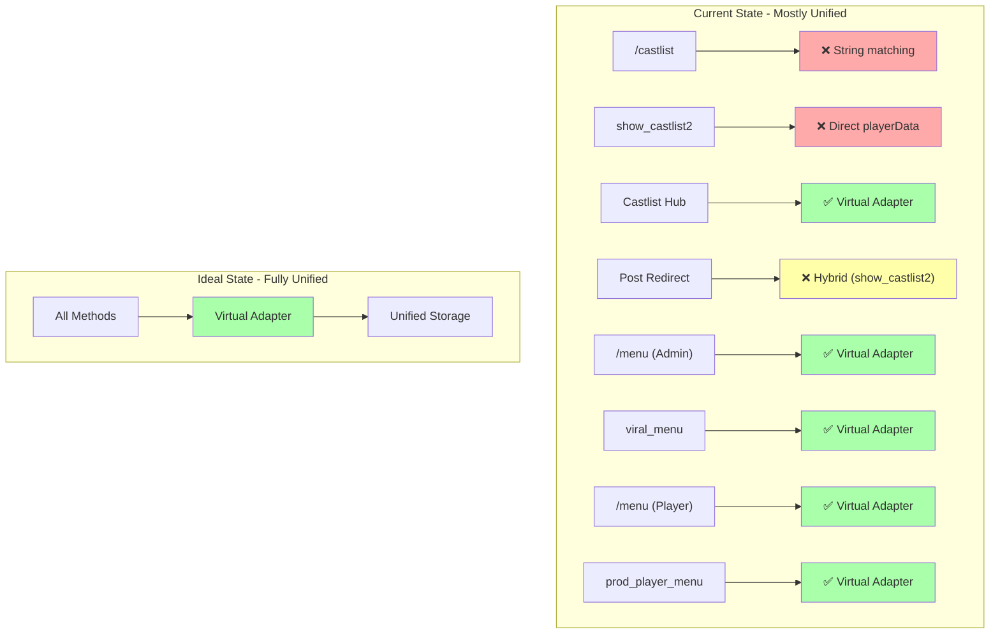

**Progress**: 5/8 methods now use Virtual Adapter (62.5% adoption rate)!
- ✅ **Completed**: Castlist Hub, Production Menu (/menu admin), Player Menu (/menu player), viral_menu, prod_player_menu
- ⏳ **Remaining**: /castlist command, show_castlist2 handler, Post Castlist redirect

### 2. Duplicate Implementation
- **buildCastlist2ResponseData()** exists in app.js (exported)
- **show_castlist2 logic** duplicated in redirect handler (lines 7684-7775)
- **Tribe fetching logic** repeated in 5+ locations
- **Display scenario calculation** inconsistent across methods

### 3. Migration Bottlenecks
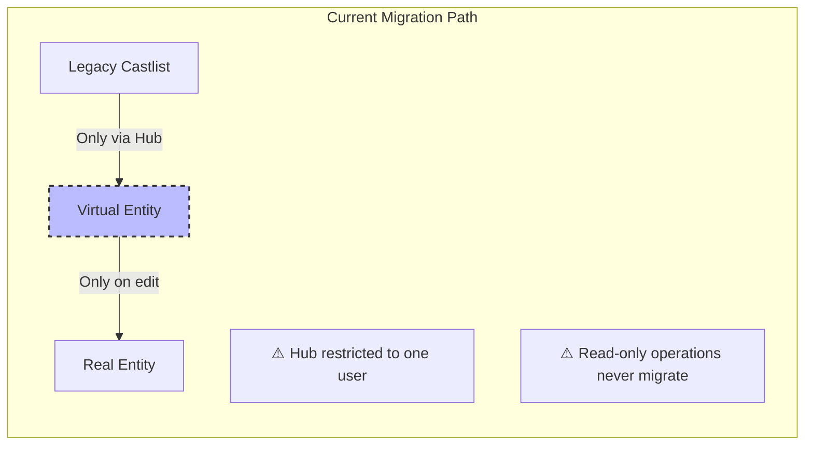

### 4. Error-Prone Redirect Pattern
The Post Castlist redirect creates a complex flow:
1. Button click → castlistHandlers
2. Handler modifies req.body.data.custom_id
3. Returns redirect flag to app.js
4. app.js reimplements show_castlist2 logic inline
5. Risk of `tribes.some is not a function` when tribes undefined/not array

## 🔧 Recommended Architecture

### Unified Data Access Layer
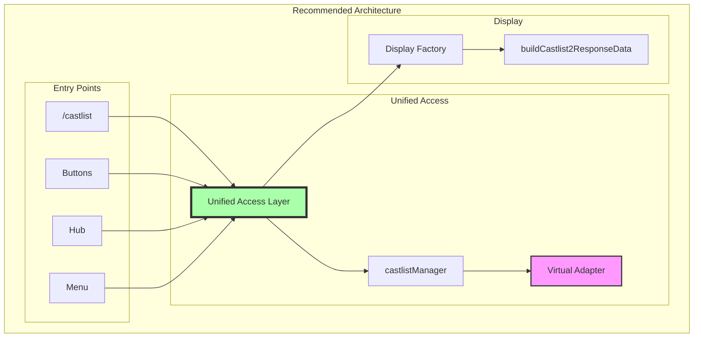

### Benefits of Unified Architecture
1. **Single source of truth** for castlist data
2. **Consistent behavior** across all access methods
3. **Automatic migration** through normal usage
4. **Reduced code duplication**
5. **Easier testing and maintenance**
6. **Clear upgrade path** from legacy to modern

## 📋 Implementation Priority

### Phase 1: Stabilize Current System
1. Fix Post Castlist redirect crash
2. Ensure member fetching works consistently
3. Add error handling for undefined tribes

### Phase 2: Unify Display Logic
1. Create single display function used by all methods
2. Eliminate duplicate show_castlist2 implementations
3. Standardize navigation state creation

### Phase 3: Integrate Virtual Adapter (PARTIALLY COMPLETE)
1. ⏳ Update `/castlist` command to use virtual adapter
2. ⏳ Update `show_castlist2` to use virtual adapter
3. ✅ **DONE**: Production Menu now uses Virtual Adapter (via extractCastlistData)

### Phase 4: Complete Migration
1. Remove user ID restriction from Castlist Hub
2. Enable auto-migration for all edit operations
3. Deprecate legacy string matching gradually

## ✅ Previously Critical Issues (Now Fixed)

### Previous Post Castlist Issues (Resolved)
1. **Complex redirect pattern** → ✅ Eliminated, now uses direct handler
2. **3-second timeout** → ✅ Fixed by removing redirect
3. **Object type mismatches** → ✅ Fixed by using Discord.js Member objects
4. **Parameter ordering bugs** → ✅ Fixed reorderTribes() call

### Remaining Architectural Issues
1. **Inconsistent data access patterns** - 62.5% Virtual Adapter adoption (5/8 methods)
   - ✅ Using Virtual Adapter: Castlist Hub, Production Menu, Player Menu, viral_menu, prod_player_menu
   - ❌ Still legacy: /castlist command, show_castlist2 handler, Post Castlist redirect
2. **buildCastlist2ResponseData()** in wrong file (app.js instead of castlistV2.js)
3. **Underutilized castlistUtils** - only used by /castlist command
4. **No unified service layer** for orchestration
5. **Menu system fragmentation** - Three separate UI systems (Production, Player, Castlist Display)

## 📝 Summary

The castlist system has **8 distinct entry points** with **50% Virtual Adapter adoption**:

### Entry Points by Category

#### ✅ **Virtual Adapter Enabled (Modern)**
1. **`/menu` (Admin)** - Production Menu with dynamic castlist buttons (PRIMARY ADMIN ACCESS)
2. **`viral_menu` Button** - Returns to Production Menu from any castlist
3. **Castlist Hub** - Advanced management with auto-migration (restricted access)

#### ❌ **Legacy String Matching**
4. **`/castlist` Command** - Player-facing castlist lookup
5. **`show_castlist2` Handler** - Castlist button click handling
6. **Post Castlist** - Hub → Display flow

#### 🔀 **Menu System Forks**
7. **`/menu` (Player)** - Safari/Inventory UI (no castlists)
8. **`prod_player_menu` Button** - Admin preview of player menu

### Key Architectural Insights

**The `/menu` Command is the MASTER FORK:**
- Admin users → Production Menu (with Virtual Adapter castlist buttons)
- Non-admin users → Player Menu (Safari/Inventory, no castlists)
- This makes `/menu` the **primary way admins access castlists** in production

**Virtual Adapter Adoption Progress:**
- **62.5% complete** (5/8 castlist methods)
- **Both menu systems integrated** (Production Menu for admins, Player Menu for players)
- **Major milestone**: All menu-based castlist access now uses Virtual Adapter
- Remaining: `/castlist` command and `show_castlist2` handler need migration

**Three Separate UI Systems:**
1. **Production Menu** - Admin interface with castlist management
2. **Player Menu** - Player-facing Safari/Inventory interface
3. **Castlist Display** - Shared display engine used by both

The virtual adapter successfully bridges legacy and modern systems and is now integrated into the primary admin workflow. Full integration of remaining methods would eliminate legacy string matching entirely and provide a unified data access layer.

---

**Next Steps**: Continue Virtual Adapter migration to `/castlist` command and `show_castlist2` handler to achieve 100% adoption.