```mermaid
sequenceDiagram
    participant Admin
    participant ProdMenu as Production Menu
    participant Button as prod_player_menu Button
    participant PlayerMenu as Player Menu
    participant Storage as storage.js

    Note over ProdMenu: Admin in Production Menu
    ProdMenu->>Admin: Shows "🪪 Player Menu" in header

    Admin->>Button: Click prod_player_menu
    Button->>PlayerMenu: createPlayerManagementUI()
    PlayerMenu->>Storage: loadPlayerData()
    Storage-->>PlayerMenu: playerData
    Note over PlayerMenu: Shows Safari buttons, inventory<br/>exactly as players see it
    PlayerMenu-->>Admin: Player Menu Preview
```

# Castlist Architecture: Complete System Analysis

## Overview

This document provides a comprehensive architectural analysis of CastBot's castlist system, including all display methods, data flows, and the virtual adapter pattern that bridges legacy and modern implementations.

## 🏗️ System Architecture Overview (Post-Fix Update)


## 📊 Method 1: `/castlist` Command

### Data Flow


### Key Characteristics
- **Data Access**: Direct string matching on `tribe.castlist`
- **Virtual Adapter**: ❌ Not used
- **Entity Support**: ❌ Legacy only
- **Member Fetching**: ✅ Always fetches

## 📊 Method 2: `show_castlist2` Handler

### Data Flow


### Key Characteristics
- **Data Access**: Direct `playerData` access with string matching
- **Virtual Adapter**: ❌ Not used
- **Entity Support**: ❌ Legacy only
- **Member Fetching**: ✅ Fixed (previously broken)

## 📊 Method 3: Castlist Hub (CastlistV3)

### Data Flow


### Key Characteristics
- **Data Access**: Through castlistManager → Virtual Adapter
- **Virtual Adapter**: ✅ Full integration
- **Entity Support**: ✅ Both legacy (virtual) and new (real)
- **Auto-Migration**: ✅ On edit operations
- **Access Control**: ⚠️ Restricted to specific user ID

## 📊 Method 4: Post Castlist Button (Fixed)

### Data Flow


### Key Characteristics
- **Data Access**: ✅ Same as show_castlist2 (no redirect)
- **Virtual Adapter**: ✅ Consistent with button handler
- **Complexity**: ✅ Low - uses existing handler
- **Error Prone**: ✅ No - standard flow

## 📊 Method 5: `/menu` Command (Master Fork)

### Data Flow


### Key Characteristics
- **Routing Logic**: `hasAdminPermissions(member)` (app.js:548-560)
  - Checks: ManageChannels | ManageGuild | ManageRoles | Administrator
- **Admin Path**: Production Menu
  - **Data Access**: Virtual Adapter via `extractCastlistData()` (castlistV2.js:761)
  - **Virtual Adapter**: ✅ Full integration
  - **Entity Support**: ✅ Both legacy and modern
  - **Creates**: `show_castlist2_*` buttons for each castlist
- **Player Path**: Player Menu
  - **UI**: Safari buttons, inventory, player-specific features, castlist buttons
  - **Data Access**: Virtual Adapter via `extractCastlistData()` (castlistV2.js:761)
  - **Virtual Adapter**: ✅ Full integration (fixed in Jan 2025)
  - **Entity Support**: ✅ Both legacy and modern
  - **Creates**: `show_castlist2_*` buttons (configurable visibility)
  - **Visibility Config**: `safariConfig.showCustomCastlists` (default: true)
  - **Implementation**: `playerManagement.js` (lines 384-422)

### Critical Insight
**This is the MASTER FORK** - the `/menu` command routes to TWO completely different UIs based on permissions. BOTH menu types now use Virtual Adapter and show castlist buttons!

## 📊 Method 6: `viral_menu` Button

### Data Flow


### Key Characteristics
- **Purpose**: Navigation button to return to Production Menu
- **Locations**:
  - Castlist displays (when viewing any castlist)
  - Restart notifications (from `scripts/buttonDetection.js`)
- **Routing**: Uses same `hasAdminPermissions()` check as `/menu`
- **Implementation**:
  - Registered: `buttonHandlerFactory.js:266-272`
  - Handler: Reuses `/menu` command logic (app.js)
- **Label**: "📋 Prod Menu" or "📋 Open Prod Menu"

## 📊 Method 7: `prod_player_menu` Button

### Data Flow


### Key Characteristics
- **Purpose**: Admin preview of player-facing menu
- **Location**: Production Menu header (Section accessory, app.js:902)
- **Permissions**: Requires admin permissions (same as Production Menu)
- **Implementation**:
  - Registered: `buttonHandlerFactory.js:273-280`
  - Handler: app.js:18013
  - Creates: Same UI as non-admin `/menu` users see
- **Use Case**: Test player experience without switching accounts
- **Label**: "🪪 Player Menu"

## 🎛️ Player Menu Castlist Visibility Configuration

### Overview
Admins can control which castlists appear in the Player Menu (`/menu` for non-admin users) through a configuration setting in Safari Customization.

### Configuration Options
| Setting | Value | Behavior | Use Case |
|---------|-------|----------|----------|
| **Show All Castlists** | `true` (default) | Display default + all custom castlists | Full access for players |
| **Show Default Only** | `false` | Hide custom castlists, show only default | Simplified player experience |

### Data Flow


### Implementation Details

**Storage Location**: `safariContent.json` → `guildId.safariConfig.showCustomCastlists`

**Default Behavior**:
```javascript
const showCustomCastlists = safariConfig.showCustomCastlists !== false;
// undefined → true (show all - backward compatible)
// true → true (show all)
// false → false (default only)
```

**Files Modified**:
1. **app.js:10838** - Modal component (3rd Label + String Select)
2. **app.js:35707** - Extract value in submission handler
3. **app.js:35731** - Save to safariConfig
4. **playerManagement.js:393-422** - Apply filter before createCastlistRows()
5. **safariConfigUI.js:287,297** - Display current setting

**Filter Logic** (playerManagement.js:393-405):
```javascript
// Load safari configuration
const safariConfig = safariData[guildId]?.safariConfig || {};
const showCustomCastlists = safariConfig.showCustomCastlists !== false; // Default true

let filteredCastlists = allCastlists;
if (!showCustomCastlists) {
  // Admin wants to hide custom castlists - show only default
  const defaultOnly = allCastlists?.get('default');
  filteredCastlists = defaultOnly
    ? new Map([['default', defaultOnly]])  // Show default button
    : new Map();  // Empty → triggers fallback button
}

// Create castlist rows from filtered map
castlistRows = createCastlistRows(filteredCastlists, false, hasStores);
```

### Edge Case Handling

**Scenario: Admin hides custom castlists but no default exists**
- **Behavior**: Show fallback button "📋 Castlist" (same as legacy no-config behavior)
- **User Experience**: Clicking the button shows existing "no default configured" message
- **Rationale**: This is an admin configuration issue, not a system error

### UI Display

**Safari Customization UI** (safariConfigUI.js:297):
```
**🕹️ Player Menu**
• Global Commands Button: ✅ Enabled
• Inventory Button: Always Show
• Custom Castlists: ✅ Show All    ← NEW
                    or
• Custom Castlists: 📋 Default Only ← NEW
```

**Modal Interface** (app.js:10909-10934):
- **Modal Title**: "Player Menu Configuration"
- **Component**: Label (Type 18) + String Select (Type 3)
- **Label**: "Show Custom Castlists in Player Menu?"
- **Options**:
  - "Show All Castlists" (value: "true")
  - "Show Default Only" (value: "false")
- **Pre-selection**: Highlights current setting via `default: true/false`

### Key Benefits

1. **Simplified Player Experience**: Admins can hide complex castlist options from players
2. **Gradual Rollout**: Show default until ready to reveal custom castlists
3. **Clean UI**: Reduce button clutter in player menu when only one castlist is active
4. **Backward Compatible**: Default behavior unchanged (show all)
5. **Non-Destructive**: Filter is presentation-only, doesn't modify data

### Relationship to Virtual Adapter

**Independence**: This feature is **orthogonal** to Virtual Adapter migration
- Virtual Adapter extracts ALL castlists (unchanged)
- Filter is applied AFTER extraction, BEFORE rendering
- Migration to 100% Virtual Adapter adoption is unaffected

## 🔄 Virtual Adapter Pattern

### How Virtual Adapter Works


### Materialization Process
```mermaid
stateDiagram-v2
    [*] --> Virtual: Legacy string detected
    Virtual --> Virtual: Read operations
    Virtual --> Materializing: Edit operation triggered

    state Materializing {
        [*] --> CreateReal: Generate real ID
        CreateReal --> SaveEntity: Store in castlistConfigs
        SaveEntity --> UpdateTribes: Add castlistId to tribes
        UpdateTribes --> KeepLegacy: Maintain castlist string
        KeepLegacy --> [*]: Complete
    }

    Materializing --> Real: Migration complete
    Real --> Real: All operations

    note right of Virtual: Exists only in memory\nNo database changes
    note right of Real: Permanent entity\nFull metadata support
    note left of KeepLegacy: Both fields maintained:\n- castlist: "name"\n- castlistId: "id"
```

## 🔍 Comparison Matrix

| Method | Virtual Adapter | Entity Support | Auto-Migration | Member Fetch | Complexity | Primary Use |
|--------|----------------|----------------|----------------|--------------|------------|-------------|
| **Entry Points** |
| `/castlist` Command | ❌ | ❌ Legacy | ❌ | ✅ | Low | Player-facing castlist view |
| `/menu` (Admin) | ✅ Full | ✅ Both | ❌ | N/A | Medium | **Primary admin access** |
| `/menu` (Player) | ✅ Full | ✅ Both | ❌ | N/A | Low | **Player castlist access** |
| `viral_menu` Button | ✅ Full | ✅ Both | ❌ | N/A | Low | Return to Production Menu |
| `prod_player_menu` | ✅ Full | ✅ Both | ❌ | N/A | Low | Admin preview of player UI |
| **Display Methods** |
| `show_castlist2` Handler | ❌ | ❌ Legacy | ❌ | ✅ Fixed | Medium | Castlist button clicks |
| Castlist Hub | ✅ Full | ✅ Both | ✅ | ✅ | Low | Advanced castlist management |
| Post Castlist (Fixed) | ❌ | ❌ Legacy | ❌ | ✅ | Low | Hub → Display flow |

### Key Insights
- **BOTH menus use Virtual Adapter!** Production Menu (admin) AND Player Menu (non-admin) now show castlists
- **Player Menu castlist visibility is configurable** via `safariConfig.showCustomCastlists`:
  - Default: Show all castlists (backward compatible)
  - Optional: Hide custom castlists, show only default
  - Filter applied at presentation layer (doesn't affect data extraction)
- **Three separate UI systems**: Production Menu (admin), Player Menu (player), Castlist Display (shared)
- **Virtual Adapter adoption**: 5/8 methods now use Virtual Adapter (62.5% adoption!)
  - ✅ Hub, Production Menu, Player Menu, viral_menu, prod_player_menu
  - ❌ `/castlist` command, `show_castlist2` handler, Post Castlist
- **Legacy methods**: Only 3 entry points remain on legacy string matching

## 🎯 Architectural Issues

### 1. Inconsistent Data Access (SIGNIFICANTLY IMPROVED)


**Progress**: 5/8 methods now use Virtual Adapter (62.5% adoption rate)!
- ✅ **Completed**: Castlist Hub, Production Menu (/menu admin), Player Menu (/menu player), viral_menu, prod_player_menu
- ⏳ **Remaining**: /castlist command, show_castlist2 handler, Post Castlist redirect

### 2. Duplicate Implementation
- **buildCastlist2ResponseData()** exists in app.js (exported)
- **show_castlist2 logic** duplicated in redirect handler (lines 7684-7775)
- **Tribe fetching logic** repeated in 5+ locations
- **Display scenario calculation** inconsistent across methods

### 3. Migration Bottlenecks


### 4. Error-Prone Redirect Pattern
The Post Castlist redirect creates a complex flow:
1. Button click → castlistHandlers
2. Handler modifies req.body.data.custom_id
3. Returns redirect flag to app.js
4. app.js reimplements show_castlist2 logic inline
5. Risk of `tribes.some is not a function` when tribes undefined/not array

## 🔧 Recommended Architecture

### Unified Data Access Layer


### Benefits of Unified Architecture
1. **Single source of truth** for castlist data
2. **Consistent behavior** across all access methods
3. **Automatic migration** through normal usage
4. **Reduced code duplication**
5. **Easier testing and maintenance**
6. **Clear upgrade path** from legacy to modern

## 📋 Implementation Priority

### Phase 1: Stabilize Current System
1. Fix Post Castlist redirect crash
2. Ensure member fetching works consistently
3. Add error handling for undefined tribes

### Phase 2: Unify Display Logic
1. Create single display function used by all methods
2. Eliminate duplicate show_castlist2 implementations
3. Standardize navigation state creation

### Phase 3: Integrate Virtual Adapter (PARTIALLY COMPLETE)
1. ⏳ Update `/castlist` command to use virtual adapter
2. ⏳ Update `show_castlist2` to use virtual adapter
3. ✅ **DONE**: Production Menu now uses Virtual Adapter (via extractCastlistData)

### Phase 4: Complete Migration
1. Remove user ID restriction from Castlist Hub
2. Enable auto-migration for all edit operations
3. Deprecate legacy string matching gradually

## ✅ Previously Critical Issues (Now Fixed)

### Previous Post Castlist Issues (Resolved)
1. **Complex redirect pattern** → ✅ Eliminated, now uses direct handler
2. **3-second timeout** → ✅ Fixed by removing redirect
3. **Object type mismatches** → ✅ Fixed by using Discord.js Member objects
4. **Parameter ordering bugs** → ✅ Fixed reorderTribes() call

### Remaining Architectural Issues
1. **Inconsistent data access patterns** - 62.5% Virtual Adapter adoption (5/8 methods)
   - ✅ Using Virtual Adapter: Castlist Hub, Production Menu, Player Menu, viral_menu, prod_player_menu
   - ❌ Still legacy: /castlist command, show_castlist2 handler, Post Castlist redirect
2. **buildCastlist2ResponseData()** in wrong file (app.js instead of castlistV2.js)
3. **Underutilized castlistUtils** - only used by /castlist command
4. **No unified service layer** for orchestration
5. **Menu system fragmentation** - Three separate UI systems (Production, Player, Castlist Display)

## 📝 Summary

The castlist system has **8 distinct entry points** with **50% Virtual Adapter adoption**:

### Entry Points by Category

#### ✅ **Virtual Adapter Enabled (Modern)**
1. **`/menu` (Admin)** - Production Menu with dynamic castlist buttons (PRIMARY ADMIN ACCESS)
2. **`viral_menu` Button** - Returns to Production Menu from any castlist
3. **Castlist Hub** - Advanced management with auto-migration (restricted access)

#### ❌ **Legacy String Matching**
4. **`/castlist` Command** - Player-facing castlist lookup
5. **`show_castlist2` Handler** - Castlist button click handling
6. **Post Castlist** - Hub → Display flow

#### 🔀 **Menu System Forks**
7. **`/menu` (Player)** - Safari/Inventory UI (no castlists)
8. **`prod_player_menu` Button** - Admin preview of player menu

### Key Architectural Insights

**The `/menu` Command is the MASTER FORK:**
- Admin users → Production Menu (with Virtual Adapter castlist buttons)
- Non-admin users → Player Menu (Safari/Inventory, no castlists)
- This makes `/menu` the **primary way admins access castlists** in production

**Virtual Adapter Adoption Progress:**
- **62.5% complete** (5/8 castlist methods)
- **Both menu systems integrated** (Production Menu for admins, Player Menu for players)
- **Major milestone**: All menu-based castlist access now uses Virtual Adapter
- Remaining: `/castlist` command and `show_castlist2` handler need migration

**Three Separate UI Systems:**
1. **Production Menu** - Admin interface with castlist management
2. **Player Menu** - Player-facing Safari/Inventory interface
3. **Castlist Display** - Shared display engine used by both

The virtual adapter successfully bridges legacy and modern systems and is now integrated into the primary admin workflow. Full integration of remaining methods would eliminate legacy string matching entirely and provide a unified data access layer.

---

**Next Steps**: Continue Virtual Adapter migration to `/castlist` command and `show_castlist2` handler to achieve 100% adoption.