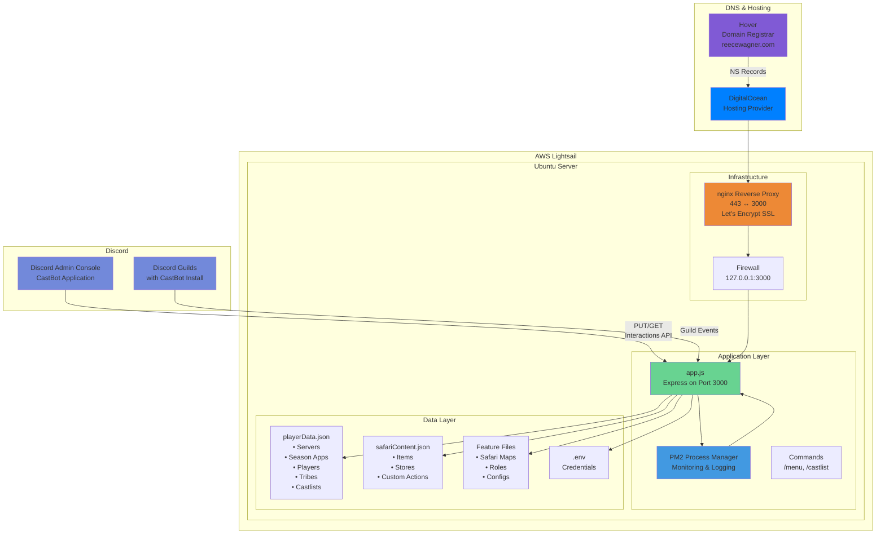
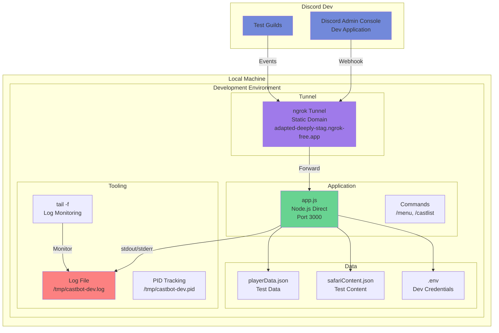

# CastBot Environment Strategy

## Overview

This document defines CastBot's environment-specific configurations, tools, and workflows. It provides a single source of truth for understanding how development and production environments differ and why these differences are intentional.

## Core Philosophy

**Different Environments, Different Needs**

Development and production environments have fundamentally different requirements:
- **Development**: Speed, simplicity, debuggability, rapid iteration
- **Production**: Reliability, monitoring, auto-recovery, performance

## Architecture Overview

### Production Architecture



### Development Architecture



## Environment Comparison

| Aspect | Development | Production |
|--------|------------|------------|
| **Infrastructure** | Local machine | AWS Lightsail (Ubuntu/Bitnami) |
| **Server IP** | localhost | 13.238.148.170 |
| **Domain** | adapted-deeply-stag.ngrok-free.app | castbot.reecewagner.com |
| **Process Manager** | Node directly | PM2 |
| **Web Server** | None (direct node) | nginx reverse proxy |
| **SSL/TLS** | ngrok handles | Let's Encrypt via nginx |
| **Port** | 3000 (tunneled) | 443→3000 (proxied) |
| **Firewall** | None needed | 127.0.0.1:3000 restricted |
| **Logging** | File + tail | PM2 logs with rotation |
| **Startup** | Manual (dev-start.sh) | PM2 saved state |
| **Restarts** | Manual (dev-restart.sh) | Auto-restart on crash |
| **Log Location** | /tmp/castbot-dev.log | ~/.pm2/logs/ |
| **Debug Output** | Full (DEBUG=true) | Minimal (unless FORCE_DEBUG) |
| **Git Integration** | Auto-commit on restart | Pull from GitHub |
| **Environment** | .env loaded manually | .env via PM2 ecosystem |
| **DNS Provider** | N/A | DigitalOcean (NS records from Hover) |
| **Node Version** | Latest available | 22.11.0 (stable) |

## Development Environment

### Process Management
```bash
# Direct node execution with output redirection
nohup node app.js > /tmp/castbot-dev.log 2>&1 &

# PID tracking for clean restarts
echo $! > /tmp/castbot-dev.pid
```

**Why not PM2?**
- Faster startup/restart cycles
- No daemon overhead
- Direct console output
- Easier to kill/restart during rapid development
- Avoids port binding issues during frequent restarts

### Logging Strategy
```bash
# Simple file logging
node app.js > /tmp/castbot-dev.log 2>&1

# Real-time monitoring
tail -f /tmp/castbot-dev.log
```

**Benefits:**
- Instant output visibility
- Easy to grep/search
- No log rotation needed (temporary files)
- Clear separation from system logs

### Development Scripts

#### dev-start.sh
- Starts ngrok tunnel with static domain
- Launches node process directly
- Tracks PID for management
- Auto-commits changes

#### dev-restart.sh
- Kills existing process by PID
- Cleans up port 3000
- Restarts with fresh node process
- Preserves ngrok tunnel

#### dev-restart-logs.sh
- Same as dev-restart.sh
- Adds continuous log tailing
- For interactive debugging sessions

#### dev-stop.sh
- Cleanly stops all processes
- Removes PID files
- Optional: stops ngrok

#### dev-status.sh
- Shows process status
- Displays ngrok URL
- Git status summary
- Recent commits

### Environment Variables
```javascript
// Development detection
const isDev = process.env.NODE_ENV !== 'production';
const DEBUG = isDev || process.env.FORCE_DEBUG === 'true';

// Usage
if (DEBUG) {
    console.log('🔍 Detailed debug information');
}
```

## Production Environment

### Infrastructure Stack

#### AWS Lightsail Instance
- **Platform**: Ubuntu with Bitnami stack
- **Instance IP**: 13.238.148.170
- **Domain**: castbot.reecewagner.com
- **Interactions Endpoint**: https://castbotaws.reecewagner.com/interactions
- **Node Version**: 22.11.0

#### Network Architecture
1. **Domain Management**
   - Registrar: Hover (reecewagner.com)
   - NS Records: Point to DigitalOcean
   - A Record: castbot.reecewagner.com → AWS IP

2. **Request Flow**
   ```
   Discord → HTTPS (443) → nginx → HTTP (3000) → Express App
   ```

3. **Security Layers**
   - nginx reverse proxy with SSL termination
   - Let's Encrypt certificates (auto-renewal)
   - Firewall restricting port 3000 to localhost only
   - PM2 process isolation

### Application Architecture

#### Core Components
- **Express Framework**: Node.js web application framework
- **discord-interactions**: v2 API for Discord integration
- **Commands System**: /menu, /castlist slash commands
- **Data Persistence**: JSON file-based storage

#### Architectural Enablers
These are the foundational systems that power CastBot's features:

1. **Button Factory** ([ButtonHandlerFactory.md](ButtonHandlerFactory.md))
   - Centralized button handler registration
   - Consistent error handling
   - Performance tracking

2. **Entity Framework** ([EntityEditFramework.md](EntityEditFramework.md))
   - CRUD operations for Safari entities
   - Unified data management
   - Field validation

3. **Menu System** ([MenuSystemArchitecture.md](MenuSystemArchitecture.md))
   - Dynamic menu generation
   - Navigation state management
   - Components V2 compliance

### Process Management (PM2)

#### PM2 Configuration
```javascript
// ecosystem.config.js
module.exports = {
  apps: [{
    name: 'castbot-pm',
    script: 'app.js',
    env: {
      NODE_ENV: 'production'
    },
    error_file: '~/.pm2/logs/castbot-pm-error.log',
    out_file: '~/.pm2/logs/castbot-pm-out.log',
    merge_logs: true,
    time: true,
    autorestart: true,
    max_restarts: 10,
    min_uptime: '10s'
  }]
};
```

#### PM2 Benefits
- **Auto-restart**: Recovers from crashes
- **Log rotation**: Prevents disk fill
- **Process monitoring**: CPU/memory tracking
- **Startup script**: Survives server reboots
- **Zero-downtime reload**: For updates

#### Approved PM2 Commands
```bash
# Safe operations
pm2 restart castbot-pm     # Preserves environment
pm2 reload castbot-pm      # Zero-downtime
pm2 logs                   # View logs
pm2 status                 # Check status
pm2 monit                  # Monitoring dashboard

# NEVER use these
pm2 delete                 # Loses environment
pm2 start app.js           # Creates duplicates
pm2 resurrect              # Incomplete state
```

### Production Deployment

```bash
# Always through deployment script
npm run deploy-remote-wsl

# What it does:
1. SSH to production server
2. Git pull latest from main
3. npm install if needed
4. pm2 restart castbot-pm
5. Verify deployment
```

### Data Storage Architecture

#### Primary Data Files

1. **playerData.json**
   ```javascript
   {
     "servers": {},           // Guild configurations
     "seasonApplications": {}, // Application forms and responses
     "players": {},           // Player profiles and stats
     "tribes": {},            // Tribe/team data
     "castlists": {}          // Season cast lists (legacy & new)
   }
   ```

2. **safariContent.json**
   ```javascript
   {
     "servers": {},           // Safari guild settings
     "items": {},             // Safari items and effects
     "stores": {},            // Safari shop configurations
     "customActions": {},     // Button actions and flows
     "soldItems": {}          // Transaction history
   }
   ```

3. **Feature-Specific Files**
   - Castlist configuration files
   - Season application templates
   - Role management data
   - Safari map definitions
   - General Safari configurations

### Production Monitoring

```bash
# Enhanced logging scripts
npm run logs-prod              # Last 100 lines
npm run logs-prod-follow       # Real-time tail
npm run logs-prod-errors       # Errors only
npm run logs-prod-safari       # Feature-specific
npm run logs-prod-stats        # Statistics
```

### Environment Variables

**Critical**: Production uses `.env` file loaded by dotenv
```javascript
// Production .env
NODE_ENV=production
DISCORD_TOKEN=xxx
DISCORD_PUBLIC_KEY=xxx
DISCORD_APPLICATION_ID=xxx
```

**Warning**: PM2 doesn't preserve env vars in saved state
- After reboot: Verify with `pm2 logs`
- If "Discord client public key" error: Environment not loaded
- Recovery: `pm2 restart castbot-pm` from app directory

## Migration Path

### Future Considerations
1. Consider Docker for environment parity (if complexity warranted)
2. Implement log aggregation for multi-server production
3. Add health checks and metrics collection
4. Consider migrating from JSON to database for data persistence
5. Implement automated backup strategies

## Best Practices

### Development
- Use `./scripts/dev/dev-restart.sh` for all restarts
- Commit frequently with descriptive messages
- Monitor logs during testing
- Clean shutdown with dev-stop.sh

### Production
- Never modify directly - always deploy from GitHub
- Monitor logs after deployment
- Use PM2 commands from approved list only
- Verify environment after server reboots

### Code
- Use environment-aware logging
- Check `isDev` for debug features
- Handle both environments in configuration
- Document environment-specific behavior

## Quick Reference

### Start Development
```bash
cd ~/castbot
./scripts/dev/dev-start.sh
```

### Restart During Development
```bash
# Quick restart
./scripts/dev/dev-restart.sh "What I changed"

# Restart with logs
./scripts/dev/dev-restart-logs.sh "What I changed"
```

### Deploy to Production
```bash
# Dry run first
npm run deploy-remote-wsl-dry

# Deploy (with permission)
npm run deploy-remote-wsl
```

### Check Logs
```bash
# Development
tail -f /tmp/castbot-dev.log

# Production
npm run logs-prod-follow
```

## Environment Detection in Code

```javascript
// Recommended pattern
import { config } from './config/envConfig.js';

const isDev = process.env.NODE_ENV !== 'production';
const isDebug = isDev || process.env.FORCE_DEBUG === 'true';

// Feature flags
if (isDev) {
    // Development-only features
    app.use('/debug', debugRouter);
}

// Logging
if (isDebug) {
    console.log('🔍 Debug:', data);
}

// Configuration
const config = {
    port: process.env.PORT || 3000,
    logLevel: isDev ? 'debug' : 'info',
    cacheEnabled: !isDev,
    requestTimeout: isDev ? 30000 : 3000
};
```

## Troubleshooting

### Development Issues

**Port 3000 already in use**
```bash
lsof -ti :3000 | xargs kill
./scripts/dev/dev-restart.sh
```

**Can't find logs**
```bash
# Check if process is running
ps aux | grep "node app.js"
# Logs should be at
tail -f /tmp/castbot-dev.log
```

### Production Issues

**Environment not loaded**
```bash
# From app directory
cd /path/to/castbot
pm2 restart castbot-pm
```

**Process not starting**
```bash
pm2 logs castbot-pm --lines 100
# Check for errors, fix, then
pm2 restart castbot-pm
```

## Related Documentation

- [LoggingStandards.md](LoggingStandards.md) - Detailed logging patterns
- [DevWorkflow.md](../workflow/DevWorkflow.md) - Development process
- [CLAUDE.md](../../CLAUDE.md) - Quick reference and safety rules
- [DefinitionOfDone.md](../workflow/DefinitionOfDone.md) - Deployment checklist
- [ButtonHandlerFactory.md](ButtonHandlerFactory.md) - Button handler patterns
- [EntityEditFramework.md](EntityEditFramework.md) - Entity management system
- [MenuSystemArchitecture.md](MenuSystemArchitecture.md) - Menu navigation system
- **Production Architecture Diagram** - Visual reference in `Castbot Architecture - Prod Only.pdf`

## Architectural Documentation

This document is derived from the production architecture diagram and real-world deployment configuration. The mermaid diagrams above provide a visual representation of both development and production environments, showing the key differences in infrastructure, tooling, and data flow.

For detailed production architecture visualization, refer to the PDF diagram which shows the complete system architecture including all components, data flows, and integration points.