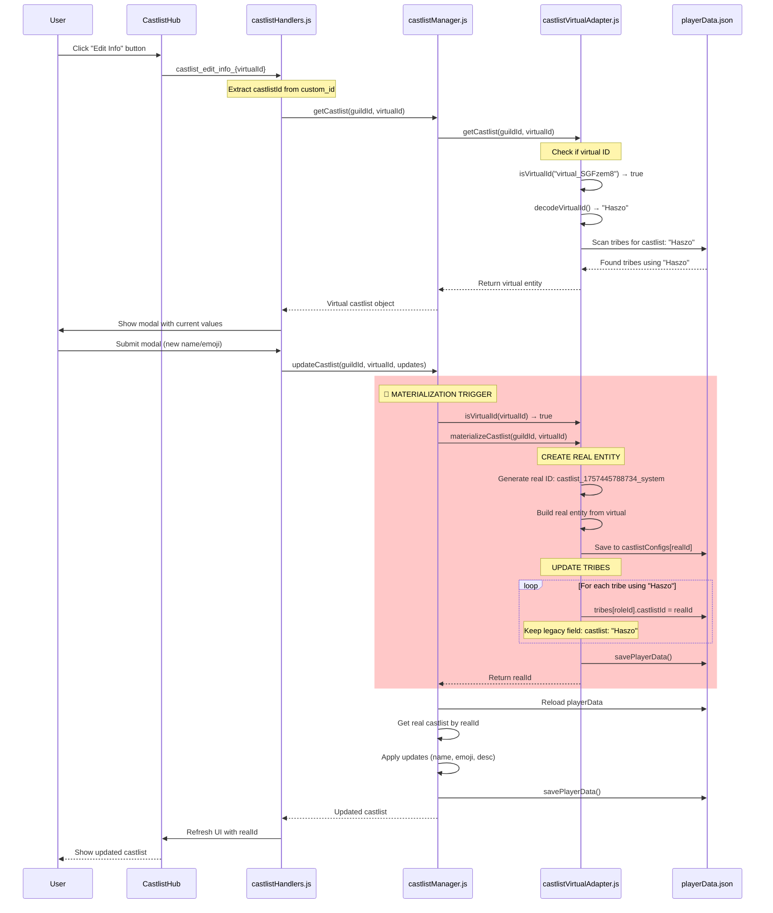

# 🗄️ ARCHIVED - Edit Castlist Season - Key Context & Data Structures

**⚠️ THIS DOCUMENT HAS BEEN ARCHIVED AND CONSOLIDATED**

**Archived Date:** November 15, 2025
**Reason:** Consolidated into [docs/features/CastlistV3-DataStructures.md](docs/features/CastlistV3-DataStructures.md)
**Consolidated Sections:**
- ✅ Placement Namespaces (Global vs Per-Season) → Section "Placement Namespaces"
- ✅ Virtual Castlist Upgrade Flow → Section "Virtual Castlist Upgrade Flow (Materialization Deep-Dive)"
- ✅ Key Architectural Insights → Enhanced "Critical Implementation Notes"
- ✅ Dual Storage patterns → "Critical Implementation Notes #1"
- ✅ Multi-Castlist Support → "Critical Implementation Notes #3"

**⚠️ DO NOT USE THIS DOCUMENT** - Refer to the consolidated source of truth instead.

---

# Original Document (Archived)

**Created:** 2025-10-02
**Purpose:** Capture critical insights from deep-dive session on season/castlist/tribe/placement architecture

---

## 🎯 Core Questions & Answers

### Q: What does "global" in placements mean?

**Answer:** It's a **temporary placeholder namespace** until season-specific placements are implemented.

**Current Structure:**
```javascript
placements: {
  global: {  // ← Temporary - not tied to any season
    playerId: {
      placement: 24,  // INTEGER not string
      updatedBy: userId,
      updatedAt: timestamp
    }
  }
}
```

**Future Structure:**
```javascript
placements: {
  "season_config_12345": {  // ← Per-season
    playerId: { placement: 1 }
  },
  "season_config_67890": {
    playerId: { placement: 3 }
  }
}
```

**Why "global" exists:**
1. Players keep placement when switching tribes (Korok → Hylian → Eliminated = still 11th)
2. Survives tribe deletion (no data loss)
3. Alumni castlists work (single "Season 13" tribe with all players)
4. Clear migration path to per-season placements

**Migration Path:** `placements.global` → `placements[seasonId]`

---

### Q: What does "default" in castlistIds mean?

**Answer:** It's the **hard-coded ID for the Active Castlist** - the special castlist representing current season's main roster.

**Data Example:**
```javascript
"tribes": {
  "1380906521084559401": {
    "castlist": "Active Castlist",  // Display name (legacy field)
    "castlistId": "castlist_1758812609810_system",  // Real entity ID (after materialization)
    "castlistIds": ["default"]  // Virtual ID (system identifier)
  }
}
```

**The Three Identifiers:**
- `castlist`: Display name for UI (legacy compatibility)
- `castlistId`: Real entity ID (after materialization)
- `castlistIds`: Array supporting multi-castlist (virtual adapter uses "default")

**Active Castlist Properties:**
- **ID:** Always "default"
- **Name:** "Active Castlist" (user-facing)
- **Type:** `system` (cannot be deleted)
- **Always First:** Appears first in dropdowns
- **Virtual Until Edited:** Starts virtual, materializes on first edit
- **Protected:** Delete button disabled

**Migration Path:** `castlist: "default"` → `castlistId: "real_id"` → `castlistIds: ["default", ...]`

---

## 📊 Complete Data Structure Hierarchy

```javascript
playerData[guildId] = {
  // 1. ACTIVE SEASON TRACKING
  activeSeason: {
    id: "config_1751549410029_user",
    name: "ReeceVivor S15!"
  },

  // 2. SEASON DEFINITIONS
  applicationConfigs: {
    "config_1751549410029_user": {
      seasonName: "ReeceVivor S15!",
      stage: "pre_swap",  // planning, applications, cast_review, etc.
      createdAt: 1751549410029,
      // ... other season config
    }
  },

  // 3. CASTLIST ENTITIES (New System)
  castlistConfigs: {
    "castlist_1758812609810_system": {
      id: "castlist_1758812609810_system",
      name: "Active Castlist",
      type: "system",  // or "alumni_placements", "winners", "custom"
      seasonId: "config_1751549410029_user",  // Optional - links to season
      createdAt: 1758812609810,
      createdBy: "system",
      settings: {
        sortStrategy: "placements",  // alphabetical, age, timezone, etc.
        showRankings: true,
        maxDisplay: 25
      },
      metadata: {
        description: "Active season castlist",
        emoji: "📋",
        isDefault: true,
        migratedFrom: "virtual_xyz",  // If migrated
        migrationDate: 1758812609810
      }
    }
  },

  // 4. TRIBES (Discord Roles → Castlist Assignment)
  tribes: {
    "roleId_123": {
      // Legacy field (kept for backwards compatibility)
      castlist: "Active Castlist",

      // New single ID (transitional)
      castlistId: "castlist_1758812609810_system",

      // NEW: Multi-castlist support
      castlistIds: ["default", "alumni_id"],  // Can be on multiple castlists

      // Tribe metadata
      emoji: "🏕️",
      color: "#5865F2",  // From Discord role API
      showPlayerEmojis: true
    }
  },

  // 5. PLAYER PLACEMENTS (Global → Will become per-season)
  placements: {
    global: {  // Temporary namespace
      "playerId_456": {
        placement: 22,  // INTEGER (1, 2, 24) not string
        updatedBy: "userId",
        updatedAt: "2025-10-01T14:10:03.351Z"
      }
    }
    // Future: "season_config_xyz": { playerId: { placement: 1 } }
  }
}
```

---

## 🔄 Virtual Castlist Upgrade Flow (Materialization)

### The Complete Journey: Legacy String → Real Entity

**Trigger:** User clicks "Edit Info" button on virtual castlist in CastlistV3 Hub

**Step-by-Step Process:**

#### 1. User Interaction
```javascript
// Hub shows castlist with virtual ID
castlistId = "virtual_SGFzem8"  // base64("Haszo")
// User clicks "Edit Info" button
custom_id = "castlist_edit_info_virtual_SGFzem8"
```

#### 2. Virtual ID Detection
```javascript
// castlistManager.js:144-148
if (castlistVirtualAdapter.isVirtualId(castlistId)) {  // "virtual_SGFzem8"
  console.log(`[CASTLIST] Materializing virtual castlist before update`);
  castlistId = await castlistVirtualAdapter.materializeCastlist(guildId, castlistId);
  // castlistId NOW = "castlist_1757445788734_system"
}
```

#### 3. Materialization Process
```javascript
// castlistVirtualAdapter.js:223-270

// A. Generate Real ID
const realId = `castlist_${Date.now()}_system`;  // "castlist_1757445788734_system"

// B. Build Real Entity
const realCastlist = {
  ...virtual,                    // Copy virtual properties
  id: realId,
  isVirtual: false,
  createdAt: Date.now(),
  createdBy: 'migration',
  metadata: {
    ...virtual.metadata,
    migratedFrom: virtualId,     // "virtual_SGFzem8"
    migrationDate: Date.now()
  }
};

// C. Save to castlistConfigs
playerData[guildId].castlistConfigs[realId] = realCastlist;

// D. Update Tribes
for (const tribeId of virtual.tribes) {
  tribes[tribeId].castlistId = realId;  // ADD new field
  // tribes[tribeId].castlist stays "Haszo" for backwards compat
}

// E. Save Everything
await savePlayerData(playerData);
return realId;  // Return to manager for updates
```

#### 4. Apply User's Updates
```javascript
// castlistManager.js:152-180
const castlist = playerData[guildId].castlistConfigs[castlistId];
// castlistId is now the real ID

castlist.name = updates.name;  // User's new name
castlist.metadata = { ...castlist.metadata, ...updates.metadata };
castlist.modifiedAt = Date.now();

await savePlayerData(playerData);
```

### Before & After Data

**BEFORE (Virtual - No Storage):**
```javascript
// Nothing in castlistConfigs - virtual only exists in memory

"tribes": {
  "1391142520787832904": {
    "castlist": "Haszo"  // String matching only
  }
}
```

**AFTER (Materialized):**
```javascript
"castlistConfigs": {
  "castlist_1757445788734_system": {
    "id": "castlist_1757445788734_system",
    "name": "Haszo2",  // User's update
    "type": "legacy",
    "metadata": {
      "migratedFrom": "virtual_SGFzem8",
      "migrationDate": 1757445788734
    }
  }
}

"tribes": {
  "1391142520787832904": {
    "castlist": "Haszo",  // Legacy field kept
    "castlistId": "castlist_1757445788734_system"  // NEW
  }
}
```

### Virtual ID Encoding/Decoding

**Encoding:**
```
"Haszo"
→ Buffer.from("Haszo").toString('base64')
→ "SGFzem8="
→ Remove padding: "SGFzem8"
→ Add prefix: "virtual_SGFzem8"
```

**Decoding:**
```
"virtual_SGFzem8"
→ Remove prefix: "SGFzem8"
→ Add padding: "SGFzem8="
→ Buffer.from("SGFzem8=", 'base64').toString('utf-8')
→ "Haszo"
```

This is **reversible** - adapter can always find original castlist name!

---

## 🔑 Key Architectural Insights

### 1. Dual Storage During Migration
- Tribes have BOTH `castlist` (string) and `castlistId` (entity reference)
- Allows gradual migration without breaking legacy code
- Safety net: if new system fails, old system still works

### 2. Multi-Castlist Support
```javascript
castlistIds: ["default", "alumni_id", "hall_of_fame"]
```
- One tribe can belong to multiple castlists
- Active Castlist (default) + specialty castlists
- First in array determines legacy `castlist` field value

### 3. Materialization Triggers
**ANY write operation:**
- ✅ Edit Info (name/emoji/description)
- ✅ Add/Remove Tribes
- ✅ Change Sort Strategy
- ✅ Any metadata update

**NEVER on read:**
- ❌ View castlist
- ❌ Display in dropdown
- ❌ Show details

### 4. Special Castlists
- **Active/Default:** ID = "default", cannot delete, always first
- **Virtual:** ID starts with "virtual_", computed on-the-fly
- **Real:** ID format: "castlist_{timestamp}_{createdBy}"

---

## 🎯 Season → Castlist → Tribe → Player → Placement Flow

**Proposed Hierarchy:**
```
Season (applicationConfig)
  ↓
Castlist (castlistConfig) - linked via seasonId
  ↓
Tribes (Discord roles) - linked via castlistIds[]
  ↓
Players (Discord members) - have roles
  ↓
Placements (per player, per season) - stored separately
```

**Current Reality:**
- ✅ Season definitions exist (applicationConfigs)
- ✅ Castlists can link to seasons (seasonId field)
- ✅ Tribes link to castlists (castlistIds array)
- ⚠️ Placements are GLOBAL (not per-season yet)
- ⚠️ No enforcement of one placement per player per season

**Implementation Goal:**
```javascript
// Future placement structure
placements: {
  "season_config_12345": {
    "playerId": {
      placement: 3,
      updatedBy: userId,
      updatedAt: timestamp
    }
  }
}
```

**Why This Matters:**
- Player can have placement 3 in Season 12, placement 1 in Season 15
- Castlist with `seasonId: "season_config_12345"` reads from that season's placements
- Cross-season castlists (Winners) can aggregate from multiple seasons
- Data integrity: one placement per player per season enforced

---

## 📝 Implementation Notes

### Current State (Oct 2025)
- ✅ Virtual adapter working in production
- ✅ Materialization on edit working
- ✅ Multi-castlist array support implemented
- ✅ Global placements functional
- ⚠️ Season-specific placements planned but not implemented
- ⚠️ No season context passed to castlist hub yet

### Next Steps for Season Integration
1. Pass `activeSeason` from storage to castlist hub
2. Add `seasonId` to castlist creation wizard
3. Implement per-season placement storage
4. Update placement editor to use season context from castlist
5. Migration script: `placements.global` → `placements[seasonId]`

### Files to Modify
- `castlistHub.js` - Read activeSeason from playerData
- `castlistManager.js` - Accept seasonId in createCastlist
- `castlistHandlers.js` - Pass season context for placements
- Placement editor modal - Use castlist.seasonId for placement storage

---

## 🚨 Critical Reminders

1. **"global" is temporary** - Not a permanent design, migrate to per-season
2. **"default" is special** - Hard-coded ID, cannot delete, system type
3. **Both fields during migration** - `castlist` (legacy) + `castlistId` (new) for safety
4. **Placements are global** - Player keeps placement across tribe changes (by design)
5. **Virtual IDs are base64** - Reversible encoding of original castlist name
6. **Materialization is one-way** - Virtual → Real, never Real → Virtual

---

## 📊 Mermaid Diagram: Virtual Castlist Upgrade Flow

**NOTE:** Mermaid diagrams cannot be viewed in Claude Code chat. Only create them when saving to markdown files.



---

## 🔗 Related Documentation

- [CastlistV3.md](/home/reece/castbot/docs/features/CastlistV3.md) - Complete architecture
- [CastlistV3-FeatureStatus.md](/home/reece/castbot/docs/features/CastlistV3-FeatureStatus.md) - Implementation status
- [SeasonLifecycle.md](/home/reece/castbot/docs/concepts/SeasonLifecycle.md) - Season management
- [RaP/0997](/home/reece/castbot/RaP/0997_20250129_CastlistPlacementEditor_Analysis.md) - Placement editor
- [RaP/0995](/home/reece/castbot/RaP/0995_20251002_CastlistRolesFetchOptimization_Analysis.md) - Performance optimization

---

**Last Updated:** 2025-10-02
**Context:** Deep-dive session on season/castlist/placement architecture and virtual castlist materialization
