# 🗄️ ARCHIVED - Edit Castlist Season Modal Selector - Design Document

**⚠️ THIS DOCUMENT HAS BEEN ARCHIVED AND CONSOLIDATED**

**Archived Date:** November 15, 2025
**Reason:** Consolidated into [docs/features/CastlistV3-DataStructures.md](docs/features/CastlistV3-DataStructures.md)
**Consolidated Sections:**
- ✅ Season ID vs Config ID distinction (lines 395-465) → Section "🔑 Season ID vs Config ID - CRITICAL DISTINCTION"
- ✅ Lookup patterns → "Lookup Pattern" subsection in Season Model
- ✅ Implementation evidence → Code examples in Season Model section

**Implementation Status:** ✅ **FULLY IMPLEMENTED** in castlistHandlers.js (handleEditInfoModal function, lines 1112-1121)

**⚠️ DO NOT USE THIS DOCUMENT** - Refer to the consolidated source of truth and actual code implementation instead.

---

# Original Document (Archived)

**Created:** 2025-10-03
**Purpose:** Add season association functionality to castlist Edit Info modal using Label-wrapped String Select (Components V2)

---

## 🎯 Overview

Allow castlists to be associated with seasons via the Edit Info modal. Uses the new Components V2 modal capabilities (Label + String Select) to enable season selection directly in modals.

**Key Features**:
- 📋 Season selector in Edit Info modal
- 🔗 Store `seasonId` in castlistConfigs
- 🗑️ Clear season association (set to null)
- 👁️ Display season in castlist details
- 🔄 Live UI updates after modal submission

---

## 📊 Current vs Future State

### Current Castlist Display
```
📋 Active Castlist22
Castlist for active phase of the game.
Type: system | Created: a day ago

Tribes Using This Castlist:
🏕️ @SendMessages
```

### Future Castlist Display (With Season)
```
📋 Active Castlist22
Castlist for active phase of the game.
Type: system | Created: a day ago
Season: 🎮 ReeceVivor S15!        ← NEW

Tribes Using This Castlist:
🏕️ @SendMessages
```

---

## 🏗️ Architecture Diagrams

### User Flow: Season Association


---

### Data Flow: Season Association

```mermaid
flowchart TD
    Start([User clicks Edit Info]) --> LoadData[Load Castlist Data]
    LoadData --> LoadSeasons[Load All Seasons]

    LoadSeasons --> BuildOptions{Build Season Options}
    BuildOptions --> AddNone["Add 'No Season' option"]
    AddNone --> AddSeasons[Add all seasons sorted by date]
    AddSeasons --> PreSelect{Current season?}

    PreSelect -->|Yes| MarkDefault[Mark current season as default]
    PreSelect -->|No| MarkNone[Mark 'No Season' as default]

    MarkDefault --> ShowModal[Display Modal]
    MarkNone --> ShowModal

    ShowModal --> UserSelect{User Action}

    UserSelect -->|Select season| ExtractID[Extract season config ID]
    UserSelect -->|Select 'None'| ExtractNone[Extract 'none' value]
    UserSelect -->|No change| ExtractUndefined[No season_id in data]

    ExtractID --> UpdateSeasonID[updates.seasonId = configId]
    ExtractNone --> UpdateNull[updates.seasonId = null]
    ExtractUndefined --> UpdateUndefined[updates.seasonId = undefined]

    UpdateSeasonID --> CallManager[Call castlistManager.updateCastlist]
    UpdateNull --> CallManager
    UpdateUndefined --> CallManager

    CallManager --> CheckValue{seasonId value?}

    CheckValue -->|null| DeleteField["delete castlist.seasonId"]
    CheckValue -->|'config_123'| SetField["castlist.seasonId = 'config_123'"]
    CheckValue -->|undefined| SkipField[No change to seasonId]

    DeleteField --> SaveData[Save playerData]
    SetField --> SaveData
    SkipField --> SaveData

    SaveData --> RefreshUI[Refresh Hub UI]
    RefreshUI --> DisplayCheck{Has seasonId?}

    DisplayCheck -->|Yes| LookupSeason[Lookup season by ID]
    DisplayCheck -->|No| NoSeasonLine[Skip season line]

    LookupSeason --> SeasonExists{Season exists?}
    SeasonExists -->|Yes| ShowSeason["Display: Season: 🎮 Season Name"]
    SeasonExists -->|No| ShowDeleted["Display: Season: ⚠️ Deleted season"]

    ShowSeason --> End([Display Updated UI])
    ShowDeleted --> End
    NoSeasonLine --> End

    style Start fill:#e1f5e1
    style End fill:#e1f5e1
    style DeleteField fill:#ffe1e1
    style SetField fill:#e1e5ff
    style ShowModal fill:#fff4e1
```



---

### Modal Structure (Components V2)

```mermaid
classDiagram
    class Modal {
        +custom_id: castlist_edit_info_modal_{id}
        +title: "Edit Castlist Info"
        +components: Array~Component~
    }

    class TextDisplay {
        +type: 10
        +content: "### Castlist Information"
    }

    class NameLabel {
        +type: 18 (Label)
        +label: "Castlist Name"
        +component: TextInput
    }

    class NameInput {
        +type: 4 (Text Input)
        +custom_id: "name"
        +style: 1 (Short)
        +required: true
        +value: currentName
    }

    class EmojiLabel {
        +type: 18 (Label)
        +label: "Emoji"
        +component: TextInput
    }

    class EmojiInput {
        +type: 4 (Text Input)
        +custom_id: "emoji"
        +style: 1 (Short)
        +required: false
        +value: currentEmoji
    }

    class DescriptionLabel {
        +type: 18 (Label)
        +label: "Description"
        +component: TextInput
    }

    class DescriptionInput {
        +type: 4 (Text Input)
        +custom_id: "description"
        +style: 2 (Paragraph)
        +required: false
        +value: currentDescription
    }

    class SeasonLabel {
        +type: 18 (Label)
        +label: "Associated Season"
        +description: "Link to a season (optional)"
        +component: StringSelect
    }

    class SeasonSelect {
        +type: 3 (String Select)
        +custom_id: "season_id"
        +required: false
        +min_values: 0
        +max_values: 1
        +options: Array~SeasonOption~
    }

    class SeasonOption {
        +label: "🎮 Season Name"
        +value: "config_id"
        +description: "Stage • Updated: date"
        +default: boolean
    }

    Modal "1" --> "1" TextDisplay
    Modal "1" --> "1" NameLabel
    Modal "1" --> "1" EmojiLabel
    Modal "1" --> "1" DescriptionLabel
    Modal "1" --> "1" SeasonLabel

    NameLabel "1" --> "1" NameInput
    EmojiLabel "1" --> "1" EmojiInput
    DescriptionLabel "1" --> "1" DescriptionInput
    SeasonLabel "1" --> "1" SeasonSelect

    SeasonSelect "1" --> "0..*" SeasonOption
```

---

## 📁 Data Structure

### Castlist Config Structure

**Before Season Association:**
```json
{
  "castlist_1759422854044_system": {
    "id": "castlist_1759422854044_system",
    "name": "Active Castlist22",
    "type": "system",
    "createdAt": 1759422854045,
    "createdBy": "migration",
    "settings": {
      "sortStrategy": "alphabetical",
      "showRankings": false,
      "maxDisplay": 25,
      "visibility": "public"
    },
    "metadata": {
      "description": "Castlist for active phase of the game",
      "emoji": "📋"
    },
    "modifiedAt": 1759422874788,
    "modifiedBy": "system"
  }
}
```

**After Season Association:**
```json
{
  "castlist_1759422854044_system": {
    "id": "castlist_1759422854044_system",
    "name": "Active Castlist22",
    "type": "system",
    "seasonId": "season_abc123def456",  // ← NEW FIELD (actual seasonId from applicationConfig)
    "createdAt": 1759422854045,
    "createdBy": "migration",
    "settings": {
      "sortStrategy": "alphabetical",
      "showRankings": false,
      "maxDisplay": 25,
      "visibility": "public"
    },
    "metadata": {
      "description": "Castlist for active phase of the game",
      "emoji": "📋"
    },
    "modifiedAt": 1759423506123,
    "modifiedBy": "391415444084490240"
  }
}
```

**After Clearing Season (Multi-Season Castlist):**
```json
{
  "castlist_winners_123": {
    "id": "castlist_winners_123",
    "name": "Winners Circle",
    "type": "system",
    // seasonId: null or absent → uses placements.global namespace
    "createdAt": 1759422854045,
    "createdBy": "migration",
    "settings": {
      "sortStrategy": "alphabetical",
      "showRankings": false,
      "maxDisplay": 25,
      "visibility": "public"
    },
    "metadata": {
      "description": "Castlist for active phase of the game",
      "emoji": "📋"
    },
    "modifiedAt": 1759423712456,
    "modifiedBy": "391415444084490240"
  }
}
```

### Season Option Structure

```javascript
// Season options array for String Select
const seasonOptions = [
  // Most recent seasons first (up to 24)
  {
    label: '🎮 ReeceVivor S15!',
    value: 'season_abc123def456',  // ← applicationConfig.seasonId (NOT configId)
    description: 'Starting Phase • Updated: 10/2/2025',
    default: currentSeasonId === 'season_abc123def456'
  },
  {
    label: '📝 Season 14 - The Comeback',
    value: 'season_xyz789ghi012',  // ← applicationConfig.seasonId
    description: 'Complete • Updated: 9/15/2025',
    default: currentSeasonId === 'season_xyz789ghi012'
  },
  // ... up to 24 seasons

  // No Season option ALWAYS LAST (even if 25+ seasons)
  {
    label: '🌟 No Season (Winners, Alumni, etc.)',
    value: 'none',
    description: 'Used where players are across multiple seasons',
    default: !currentSeasonId  // Pre-select if no season
  }
];
```

---

## 🔗 Data Structure: applicationConfigs vs seasonId

### Important Distinction

**applicationConfigs** is the current storage location for season data, but contains its own **seasonId** field:

```json
"applicationConfigs": {
  "config_1759634522896_391415444084490240": {  // ← Config key (internal)
    "seasonId": "season_cac1b81de8914c79",      // ← Actual season ID (use this!)
    "seasonName": "S16 The NU Season",
    "stage": "pre_swap",
    "createdAt": 1759634522900,
    "lastUpdated": 1759634522900,
    "questions": []
  }
}
```

### What We Store in Castlists

**Castlists store the SEASON ID, not the config ID:**

```json
"castlist_123_system": {
  "seasonId": "season_cac1b81de8914c79"  // ← Links to applicationConfig.seasonId
}
```

### Why This Matters

**Future-proofing**: When seasons are eventually moved to their own top-level structure:

```json
// FUTURE structure (not implemented yet)
{
  "seasons": {
    "season_cac1b81de8914c79": {  // ← seasonId becomes the key
      "name": "S16 The NU Season",
      "stage": "pre_swap"
    }
  },
  "applicationConfigs": {
    "config_123": {
      "seasonId": "season_cac1b81de8914c79",  // ← Still links to season
      "questions": []
    }
  },
  "castlistConfigs": {
    "castlist_456": {
      "seasonId": "season_cac1b81de8914c79"  // ← No migration needed!
    }
  }
}
```

**Result**: Castlists won't need migration when seasons are split out.

### Lookup Pattern

**Finding a season by seasonId:**

```javascript
// Current implementation (nested in applicationConfigs)
const season = Object.values(playerData[guildId]?.applicationConfigs || {})
  .find(config => config.seasonId === castlist.seasonId);

// Future implementation (seasons as top-level)
const season = playerData[guildId]?.seasons?.[castlist.seasonId];
```

---

## 🔧 Implementation Details

### Part 1: Modal Creation

**File:** `castlistHandlers.js` (handleCastlistButton(), edit_info case)

```javascript
// Special handling for Edit Info - show modal
if (buttonType === 'edit_info') {
  const castlist = await castlistManager.getCastlist(context.guildId, castlistId);

  if (!castlist) {
    return { /* error response */ };
  }

  // Import season helper
  const { getSeasonStageEmoji, getSeasonStageName } = await import('./seasonSelector.js');

  // Load seasons for dropdown
  const playerData = await loadPlayerData();
  const seasons = playerData[context.guildId]?.applicationConfigs || {};
  const currentSeasonId = castlist.seasonId || null;

  // Build season options (most recent first)
  const allSeasons = Object.entries(seasons)
    .sort(([,a], [,b]) => {
      const aTime = a.lastUpdated || a.createdAt || 0;
      const bTime = b.lastUpdated || b.createdAt || 0;
      return bTime - aTime;
    });

  // CRITICAL: Hard limit to 24 seasons (Discord limit is 25 total including "No Season")
  const maxSeasons = 24;
  const selectedSeasons = allSeasons.slice(0, maxSeasons);
  const droppedCount = allSeasons.length - maxSeasons;

  const seasonOptions = selectedSeasons.map(([configId, season]) => {
    const stage = season.stage || 'planning';
    const emoji = getSeasonStageEmoji(stage);
    const stageName = getSeasonStageName(stage);
    const lastUpdate = new Date(season.lastUpdated || season.createdAt || 0);

    return {
      label: `${emoji} ${season.seasonName}`.substring(0, 100),
      value: season.seasonId,  // ← Use applicationConfig.seasonId, not configId
      description: `${stageName} • Updated: ${lastUpdate.toLocaleDateString()}`.substring(0, 100),
      default: season.seasonId === currentSeasonId
    };
  });

  // Add "No Season" option at the BOTTOM (always included, position 25)
  seasonOptions.push({
    label: '🌟 No Season (Winners, Alumni, etc.)',
    value: 'none',
    description: 'Used where players are across multiple seasons',
    default: !currentSeasonId
  });

  // Log if seasons were dropped
  if (droppedCount > 0) {
    console.log(`[CASTLIST] Showing ${maxSeasons} most recent seasons, ${droppedCount} older seasons not displayed`);
  }

  // Build modal with Components V2 structure
  const modal = {
    type: 9, // MODAL
    data: {
      custom_id: `castlist_edit_info_modal_${castlistId}`,
      title: 'Edit Castlist Info',
      components: [
        // Header text
        {
          type: 10, // Text Display
          content: '### Castlist Information\n\nEdit the details below:'
        },

        // Name field (Label + Text Input)
        {
          type: 18, // Label
          label: 'Castlist Name',
          component: {
            type: 4, // Text Input
            custom_id: 'name',
            style: 1, // Short
            required: true,
            value: castlist.name || '',
            max_length: 100
          }
        },

        // Emoji field
        {
          type: 18, // Label
          label: 'Emoji',
          description: 'Single emoji to represent this castlist',
          component: {
            type: 4, // Text Input
            custom_id: 'emoji',
            style: 1, // Short
            required: false,
            value: castlist.metadata?.emoji || '',
            max_length: 10,
            placeholder: '📋'
          }
        },

        // Description field
        {
          type: 18, // Label
          label: 'Description',
          description: 'Optional description for this castlist',
          component: {
            type: 4, // Text Input
            custom_id: 'description',
            style: 2, // Paragraph
            required: false,
            value: castlist.metadata?.description || '',
            max_length: 200,
            placeholder: 'Describe this castlist...'
          }
        },

        // NEW: Season selector (Label + String Select)
        {
          type: 18, // Label
          label: 'Associated Season',
          description: 'Link this castlist to a specific season (optional)',
          component: {
            type: 3, // String Select
            custom_id: 'season_id',
            placeholder: 'Choose a season...',
            required: false,
            min_values: 0, // Allow deselecting all
            max_values: 1,
            options: seasonOptions
          }
        }
      ]
    }
  };

  return modal;
}
```

### Part 2: Modal Submission Handler

**File:** `app.js` (search for existing `castlist_edit_info_modal_` handler)

```javascript
} else if (custom_id.startsWith('castlist_edit_info_modal_')) {
  const castlistId = custom_id.replace('castlist_edit_info_modal_', '');
  const guildId = req.body.guild_id;
  const userId = req.body.member?.user?.id || req.body.user?.id;

  // Extract all fields from modal components
  const components = data.components || [];
  const fields = {};

  components.forEach(row => {
    row.components?.forEach(comp => {
      if (comp.custom_id === 'name') fields.name = comp.value;
      if (comp.custom_id === 'emoji') fields.emoji = comp.value;
      if (comp.custom_id === 'description') fields.description = comp.value;

      // NEW: Extract season selection
      if (comp.custom_id === 'season_id') {
        const selectedValues = comp.values || [];

        if (selectedValues.length === 0) {
          // User deselected all (min_values: 0)
          fields.seasonId = 'none';
        } else {
          fields.seasonId = selectedValues[0]; // "none" or actual config ID
        }
      }
    });
  });

  // Prepare updates object
  const updates = {
    name: fields.name,
    metadata: {
      emoji: fields.emoji,
      description: fields.description
    },
    modifiedBy: userId
  };

  // Handle season association
  if (fields.seasonId === 'none') {
    // User selected "No Season" - remove association (uses placements.global)
    updates.seasonId = null;
  } else if (fields.seasonId) {
    // User selected a season
    updates.seasonId = fields.seasonId;
  }
  // If fields.seasonId is undefined, season field wasn't in modal (shouldn't happen)

  // Update castlist
  await castlistManager.updateCastlist(guildId, castlistId, updates);

  // Refresh hub with updated castlist
  const hubData = await createCastlistHub(guildId, {
    selectedCastlistId: castlistId,
    activeButton: null
  });

  return res.send({
    type: InteractionResponseType.CHANNEL_MESSAGE_WITH_SOURCE,
    data: hubData
  });
}
```

### Part 3: Manager Update Logic

**File:** `castlistManager.js` (updateCastlist method)

```javascript
async updateCastlist(guildId, castlistId, updates) {
  const playerData = await loadPlayerData();

  // ... existing validation ...

  // Apply updates
  if (updates.name !== undefined) castlist.name = updates.name;
  if (updates.type !== undefined) castlist.type = updates.type;

  // NEW: Handle season association
  if (updates.seasonId !== undefined) {
    if (updates.seasonId === null) {
      // Remove season association
      delete castlist.seasonId;
      console.log(`[CASTLIST] Removed season association from '${castlist.name}'`);
    } else {
      // Set season association
      castlist.seasonId = updates.seasonId;

      // Validate season exists
      const season = playerData[guildId]?.applicationConfigs?.[updates.seasonId];
      if (season) {
        console.log(`[CASTLIST] Associated '${castlist.name}' with season '${season.seasonName}'`);
      } else {
        console.warn(`[CASTLIST] Warning: Season ${updates.seasonId} not found`);
      }
    }
  }

  if (updates.settings) {
    castlist.settings = { ...castlist.settings, ...updates.settings };
  }

  if (updates.metadata) {
    castlist.metadata = { ...castlist.metadata, ...updates.metadata };
  }

  // ... rest of method ...
}
```

### Part 4: Display Update

**File:** `castlistHub.js` (createCastlistDetailsSection)

```javascript
async function createCastlistDetailsSection(guildId, castlist) {
  const playerData = await loadPlayerData();
  const tribes = playerData[guildId]?.tribes || {};

  // Get tribes using this castlist
  const tribesUsingCastlist = await castlistManager.getTribesUsingCastlist(guildId, castlist.id);

  // Build tribes display
  let tribesDisplay = '';
  if (tribesUsingCastlist.length > 0) {
    const tribesList = tribesUsingCastlist.map(roleId => {
      const tribe = tribes[roleId];
      if (!tribe) return null;
      const emoji = tribe.emoji || '🏕️';
      return `${emoji} <@&${roleId}>`;
    }).filter(Boolean);
    tribesDisplay = tribesList.join('\n');
  } else {
    tribesDisplay = '-# No tribes currently using this castlist';
  }

  // NEW: Get season name if associated
  let seasonLine = '';
  if (castlist.seasonId) {
    const season = playerData[guildId]?.applicationConfigs?.[castlist.seasonId];

    if (season) {
      // Season exists - display with emoji
      const { getSeasonStageEmoji } = await import('./seasonSelector.js');
      const stageEmoji = getSeasonStageEmoji(season.stage || 'planning');
      seasonLine = `-# Season: ${stageEmoji} ${season.seasonName}\n`;
    } else {
      // Season was deleted
      seasonLine = `-# Season: ⚠️ Deleted season (ID: ${castlist.seasonId})\n`;
    }
  }

  // Build the details section
  const content = `> **\`${castlist.metadata?.emoji || '📋'} ${castlist.name}\`**\n` +
    `-# ${castlist.metadata?.description || 'No description'}\n` +
    `-# Type: ${castlist.type} | Created: <t:${Math.floor((castlist.createdAt || Date.now()) / 1000)}:R>\n` +
    seasonLine + // NEW: Season line
    (castlist.isVirtual ? `-# ⚠️ Legacy castlist - will be upgraded on first edit\n` : '') +
    `\n**Tribes Using This Castlist:**\n${tribesDisplay}`;

  return {
    type: 10, // Text Display
    content: content
  };
}
```

---

## 🎨 UI Examples

### Modal Display (Before Submission)

```
┌─────────────────────────────────────────┐
│         Edit Castlist Info              │
├─────────────────────────────────────────┤
│                                         │
│  ### Castlist Information               │
│  Edit the details below:                │
│                                         │
│  ─────────────────────────────────────  │
│                                         │
│  Castlist Name                          │
│  ┌─────────────────────────────────┐   │
│  │ Active Castlist22               │   │
│  └─────────────────────────────────┘   │
│                                         │
│  Emoji                                  │
│  Single emoji to represent this         │
│  castlist                               │
│  ┌─────────────────────────────────┐   │
│  │ 📋                              │   │
│  └─────────────────────────────────┘   │
│                                         │
│  Description                            │
│  Optional description for this          │
│  castlist                               │
│  ┌─────────────────────────────────┐   │
│  │ Castlist for active phase of    │   │
│  │ the game                        │   │
│  └─────────────────────────────────┘   │
│                                         │
│  Associated Season                      │
│  Link this castlist to a specific       │
│  season (optional)                      │
│  ┌─────────────────────────────────┐   │
│  │ 🎮 ReeceVivor S15!         [v]  │   │ ← Selected
│  └─────────────────────────────────┘   │
│                                         │
│         [Cancel]      [Submit]          │
└─────────────────────────────────────────┘
```

### Dropdown Options

```
┌─────────────────────────────────────────┐
│ 🎮 ReeceVivor S15!                  ✓   │ ← Currently selected
│ Starting Phase • Updated: 10/2/2025     │
├─────────────────────────────────────────┤
│ 🏆 Season 14 - The Comeback             │
│ Complete • Updated: 9/15/2025           │
├─────────────────────────────────────────┤
│ 📝 Season 13 - Return to Form           │
│ Applications Open • Updated: 8/1/2025   │
├─────────────────────────────────────────┤
│ ... (up to 24 seasons)                  │
├─────────────────────────────────────────┤
│ 🌟 No Season (Winners, Alumni, etc.)    │ ← ALWAYS LAST
│ Used where players are across multiple… │
└─────────────────────────────────────────┘
```

### Hub Display After Update

```
┌─────────────────────────────────────────────────────────┐
│  📋 Castlists | Manage All Cast Lists                   │
│  4 castlists (4 managed, 0 legacy)                      │
│                                                          │
│  Select a castlist to manage...                         │
│  ┌───────────────────────────────────────────────┐     │
│  │ 📋 Active Castlist22                    [v]   │     │
│  └───────────────────────────────────────────────┘     │
│                                                          │
│  ━━━━━━━━━━━━━━━━━━━━━━━━━━━━━━━━━━━━━━━━━━━━━━━━━━━━━  │
│                                                          │
│  > **`📋 Active Castlist22`**                           │
│  -# Castlist for active phase of the game              │
│  -# Type: system | Created: a day ago                   │
│  -# Season: 🎮 ReeceVivor S15!              ← NEW       │
│                                                          │
│  **Tribes Using This Castlist:**                        │
│  🏕️ @SendMessages                                       │
│                                                          │
│  ━━━━━━━━━━━━━━━━━━━━━━━━━━━━━━━━━━━━━━━━━━━━━━━━━━━━━  │
│                                                          │
│  [📋 Post] [✏️ Edit Info] [🏕️ Manage Tribes] [⚙️ ...]  │
└─────────────────────────────────────────────────────────┘
```

---

## ⚠️ Edge Cases & Solutions

### Edge Case 1: Season Deleted After Association

**Scenario**: Castlist has `seasonId: "config_123"`, but season was deleted from applicationConfigs

**Detection**:
```javascript
const season = playerData[guildId]?.applicationConfigs?.[castlist.seasonId];
if (!season) {
  // Season was deleted
}
```

**Display Solution**:
```
-# Season: ⚠️ Deleted season (ID: config_123)
```

**Modal Solution**: Don't show deleted season in dropdown (it won't appear in season options)

---

### Edge Case 2: No Seasons Available

**Scenario**: Guild has no seasons in applicationConfigs yet

**Detection**:
```javascript
const seasons = playerData[guildId]?.applicationConfigs || {};
if (Object.keys(seasons).length === 0) {
  // No seasons
}
```

**Solution**: Only show "No Season" option, optionally add helper text
```javascript
if (seasonOptions.length === 1) { // Only "None" option
  seasonOptions[0].description = 'No seasons available - create one first';
}
```

---

### Edge Case 3: User Deselects All (min_values: 0)

**Scenario**: User clicks the dropdown and deselects the current season without choosing another

**Behavior**: `comp.values` returns empty array `[]`

**Solution**: Treat empty array as "none"
```javascript
if (comp.custom_id === 'season_id') {
  const selectedValues = comp.values || [];
  fields.seasonId = selectedValues.length === 0 ? 'none' : selectedValues[0];
}
```

---

### Edge Case 4: 25+ Seasons Available (Discord Limit)

**Scenario**: Guild has more than 24 seasons (dropdown limit is 25 including "No Season" option)

**Discord Behavior**: String Select with >25 options causes Discord client to crash or fail to display modal

**Error Handling Strategy**: Gracefully limit to most recent 24 seasons + "No Season" option (total 25)

**Implementation**:
```javascript
// Build season options (most recent first)
const allSeasons = Object.entries(seasons)
  .sort(([,a], [,b]) => {
    const aTime = a.lastUpdated || a.createdAt || 0;
    const bTime = b.lastUpdated || b.createdAt || 0;
    return bTime - aTime; // Most recent first
  });

// CRITICAL: Hard limit to 24 seasons (leaves room for "No Season" at position 25)
const maxSeasons = 24;
const selectedSeasons = allSeasons.slice(0, maxSeasons);
const droppedCount = allSeasons.length - maxSeasons;

// Map to option format
const seasonOptions = selectedSeasons.map(([configId, season]) => {
  // ... option building
});

// ALWAYS add "No Season" at the end (position 25)
seasonOptions.push({
  label: '🌟 No Season (Winners, Alumni, etc.)',
  value: 'none',
  description: 'Used where players are across multiple seasons',
  default: !currentSeasonId
});

// Log if seasons were dropped
if (droppedCount > 0) {
  console.log(`[CASTLIST] Showing ${maxSeasons} most recent seasons, ${droppedCount} older seasons not displayed`);
}
```

**User Impact**:
- ✅ Modal displays successfully (no crash)
- ✅ Most recent 24 seasons visible
- ℹ️ Older seasons not accessible via this modal (use archive/search in future)
- ✅ "No Season" option always available

**Alternative Access for Old Seasons**:
If user needs to associate with a very old season (beyond 24 most recent), they would need to:
1. Archive or delete some newer seasons first, OR
2. Use future "Search Seasons" feature (not yet implemented)

---

### Edge Case 5: Season Field Not in Modal Data

**Scenario**: Older modal format or corrupted submission (shouldn't happen)

**Detection**:
```javascript
if (fields.seasonId === undefined) {
  // season_id field wasn't in submission
}
```

**Solution**: Don't update seasonId if undefined
```javascript
if (updates.seasonId !== undefined) {
  // Only update if field was in submission
}
```

---

## 🧪 Testing Checklist

### Unit Tests

- [ ] **Modal Creation**
  - [ ] Season options sorted by date (most recent first)
  - [ ] "No Season" option always LAST (position 25)
  - [ ] Current season pre-selected with `default: true`
  - [ ] **CRITICAL**: Hard limit to 25 total options (24 seasons + "No Season")
  - [ ] 25+ seasons: Only shows 24 most recent + logs dropped count
  - [ ] Empty seasons list shows only "No Season" option
  - [ ] No Discord crash when guild has 50+ seasons

- [ ] **Modal Submission**
  - [ ] Extract season_id correctly from components
  - [ ] Handle "none" value → `updates.seasonId = null`
  - [ ] Handle config ID → `updates.seasonId = "config_123"`
  - [ ] Handle empty array → `updates.seasonId = 'none'`
  - [ ] Handle undefined → no seasonId update

- [ ] **Manager Updates**
  - [ ] `seasonId = null` deletes field from castlist
  - [ ] `seasonId = "config_123"` sets field
  - [ ] `seasonId = undefined` leaves field unchanged
  - [ ] Log messages show correct actions

- [ ] **Display Updates**
  - [ ] Season line shows when seasonId exists
  - [ ] Season name retrieved from applicationConfigs
  - [ ] Season emoji from getSeasonStageEmoji()
  - [ ] Deleted season shows warning
  - [ ] No season → no season line

### Integration Tests

- [ ] **Full Flow: Associate Season**
  1. Click Edit Info on castlist without season
  2. Modal shows "No Season" pre-selected
  3. Select a season from dropdown
  4. Submit modal
  5. Hub refreshes with season displayed
  6. playerData.json has seasonId field

- [ ] **Full Flow: Change Season**
  1. Click Edit Info on castlist with season
  2. Modal shows current season pre-selected
  3. Select different season
  4. Submit modal
  5. Hub shows new season
  6. playerData.json updated with new seasonId

- [ ] **Full Flow: Clear Season**
  1. Click Edit Info on castlist with season
  2. Select "No Season"
  3. Submit modal
  4. Hub shows no season line
  5. playerData.json has seasonId field removed

- [ ] **Edge Case: Deleted Season**
  1. Associate castlist with season
  2. Delete season from applicationConfigs
  3. View castlist in hub
  4. Shows "⚠️ Deleted season" warning
  5. Edit Info modal doesn't show deleted season in dropdown

---

## 📋 Implementation Checklist

### Phase 1: Modal Updates
- [ ] Import `getSeasonStageEmoji` and `getSeasonStageName` from seasonSelector.js
- [ ] Load seasons in Edit Info handler (castlistHandlers.js)
- [ ] Build season options array with "None" + all seasons
- [ ] Add season selector to modal (Label + String Select)
- [ ] Set `min_values: 0` and `max_values: 1`
- [ ] Pre-select current season with `default: true`

### Phase 2: Submission Handler
- [ ] Extract season_id from modal components
- [ ] Handle "none" value (set to null)
- [ ] Handle config ID value (set to ID)
- [ ] Handle empty array (treat as "none")
- [ ] Pass seasonId to updateCastlist()

### Phase 3: Manager Logic
- [ ] Update castlistManager.updateCastlist() to handle seasonId
- [ ] Delete seasonId field when null
- [ ] Set seasonId field when config ID
- [ ] Skip seasonId when undefined
- [ ] Add logging for season associations

### Phase 4: Display Updates
- [ ] Update createCastlistDetailsSection()
- [ ] Check for castlist.seasonId
- [ ] Lookup season from applicationConfigs
- [ ] Build season display line with emoji
- [ ] Handle deleted season case
- [ ] Insert season line in correct position

### Phase 5: Testing
- [ ] Test with no seasons available
- [ ] Test associating season
- [ ] Test changing season
- [ ] Test clearing season
- [ ] Test deleted season display
- [ ] Test 25+ seasons (overflow)
- [ ] Verify playerData.json updates correctly

---

## 🔗 Related Documentation

- **[ComponentsV2.md](docs/standards/ComponentsV2.md)** - Label + String Select in modals (lines 260-375)
- **[seasonSelector.js](seasonSelector.js)** - Reusable season selection components
- **[000-editCastlistSeason.md](000-editCastlistSeason.md)** - Season/castlist/placement architecture
- **[CastlistV3.md](docs/features/CastlistV3.md)** - Complete castlist system architecture
- **[SeasonLifecycle.md](docs/concepts/SeasonLifecycle.md)** - Season stages and management

---

**Last Updated:** 2025-10-03
**Status:** Design Complete - Ready for Implementation
