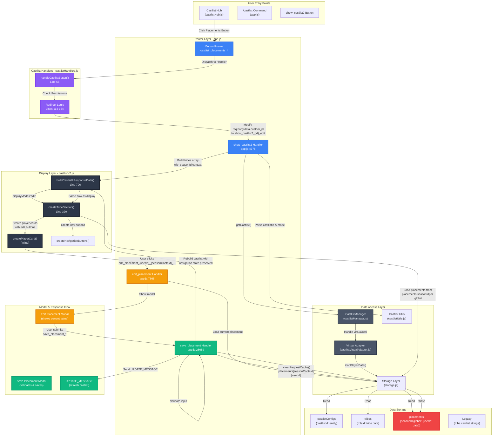
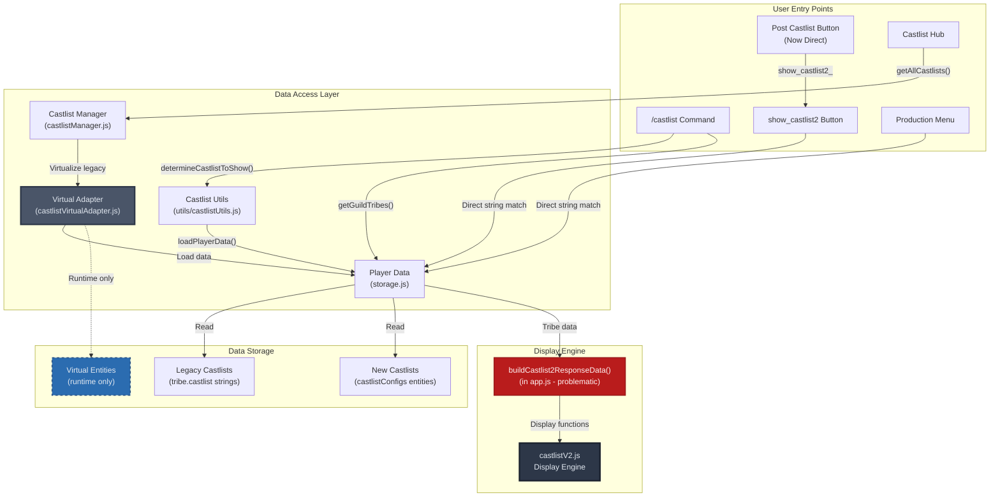
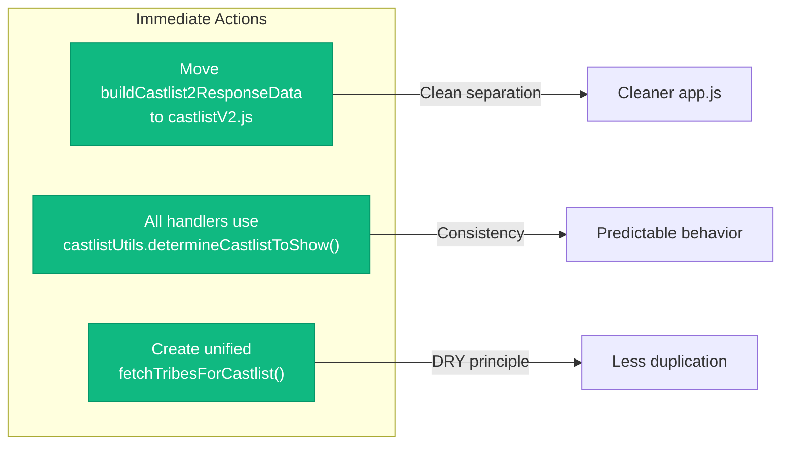
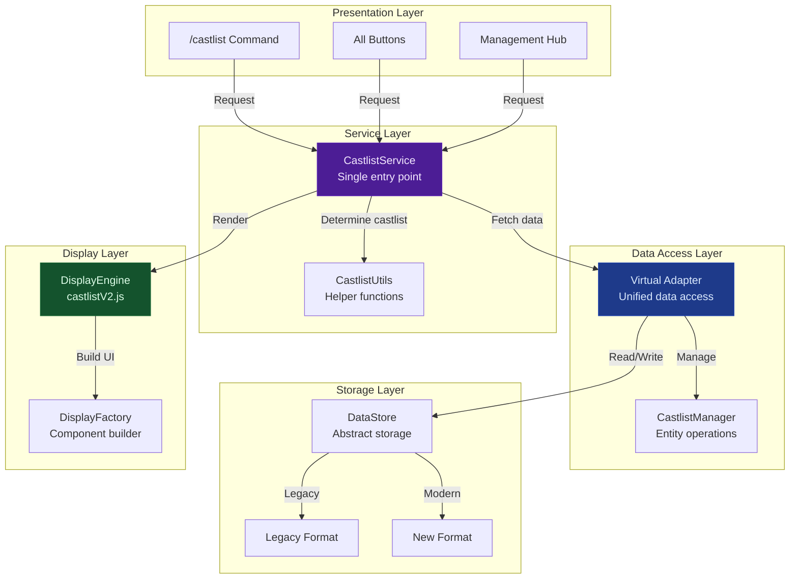
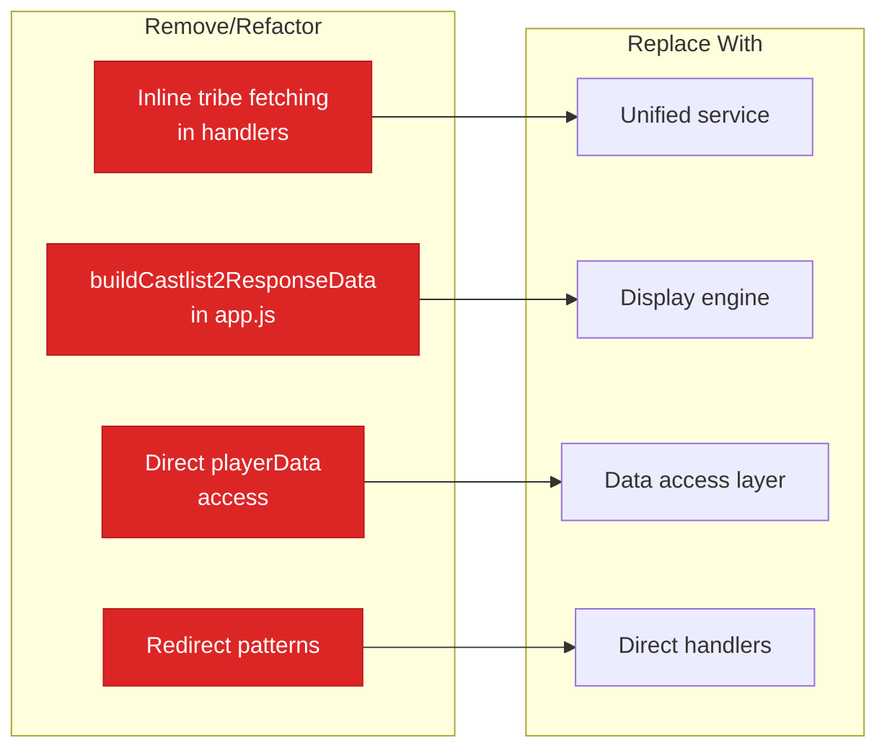
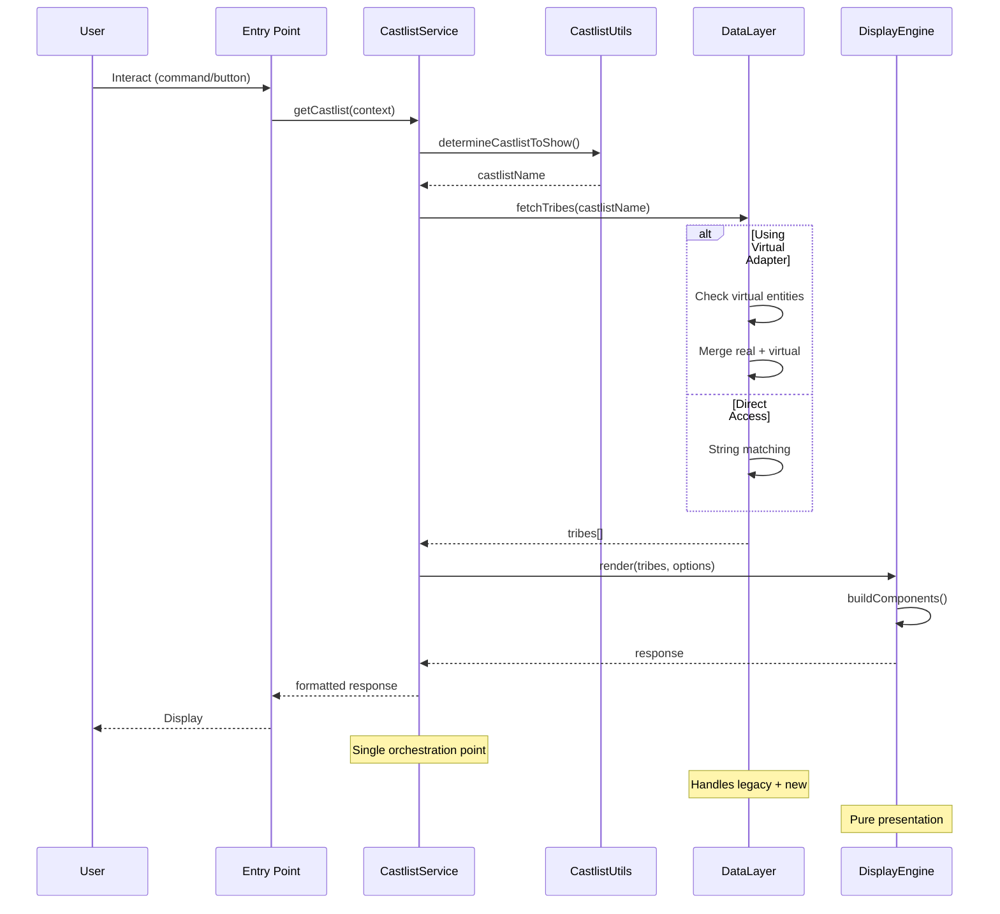
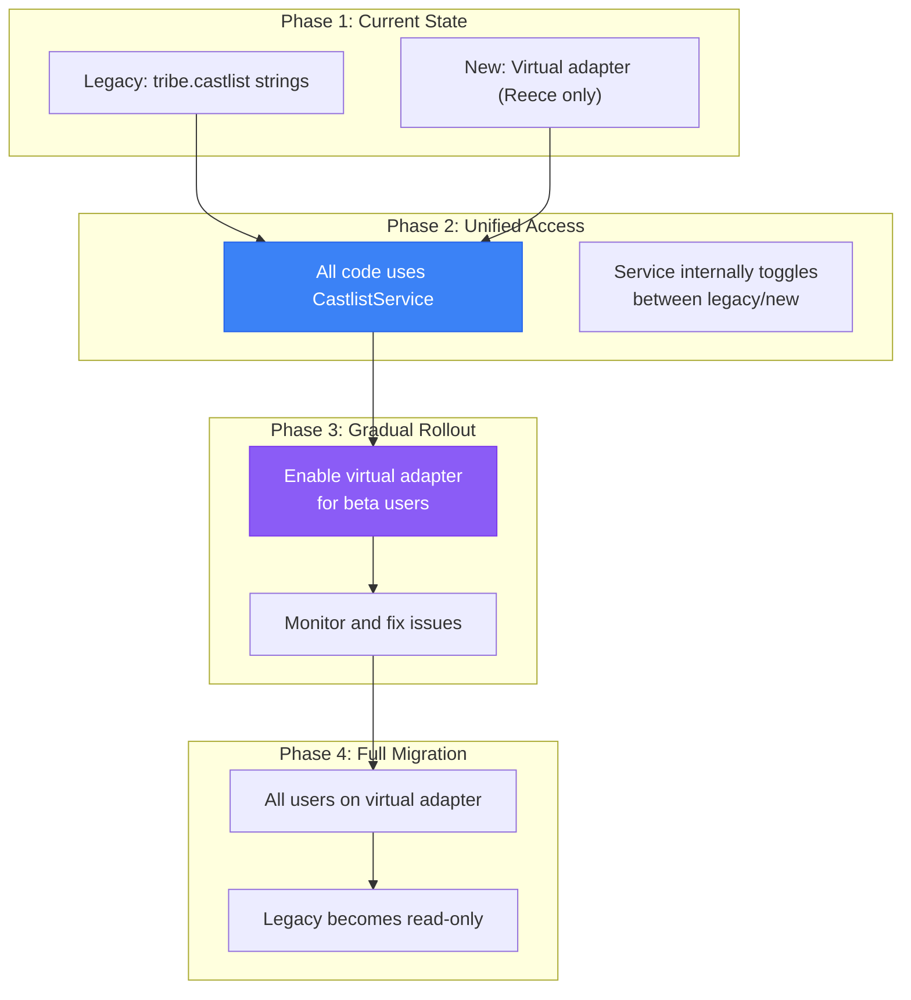

# Castlist Architecture Analysis & Recommendations

## 🎯 Executive Summary

This document provides a comprehensive architectural analysis of the castlist system, addressing immediate simplifications, ultimate target architecture, and actionable recommendations for improvement.

## 📊 Current Architecture (Updated)

### 🏗️ System Architecture Overview (Sun 5 October - Troubleshooting Castlist Placements Editor)

**Complete execution flow including Placements Editor:**



**Key Components:**

1. **Entry Point**: Castlist Hub → `castlist_placements_{castlistId}` button
2. **Handler Routing**: `castlistHandlers.js:82-164` → Redirects to `show_castlist2_{id}_edit`
3. **Display Builder**: `buildCastlist2ResponseData()` → `createTribeSection()` (loads placements)
4. **Placements Data**: Stored in `placements[seasonId][userId]` or `placements.global[userId]`
5. **Edit Flow**:
   - Click edit button → Modal with current value
   - Submit → Save to placements namespace
   - Rebuild castlist with navigation state preserved
   - UPDATE_MESSAGE response

**Critical Insights:**

- ✅ **buildCastlist2ResponseData()** is now in `castlistV2.js` (was flagged as problematic in app.js)
- ✅ **Season Context**: Determined by `castlist.seasonId` → routes to correct placement namespace
- ✅ **Navigation Preservation**: All context encoded in button IDs (castlistId, tribeIndex, tribePage, displayMode)
- ✅ **Permission Check**: Placements button requires `ManageRoles` permission
- ⚠️ **Data Access**: Placements still accessed directly via `playerData.placements` (not abstracted)

### System Overview - Dark Mode Friendly



## 🔍 Architectural Issues Identified

### 1. **buildCastlist2ResponseData() Location** ❌
**Problem**: Display logic sitting in app.js (router layer)
**Impact**: Violates separation of concerns, makes app.js bloated (21,000+ lines)
**Solution**: Move to castlistV2.js where it belongs

### 2. **Inconsistent Data Access** ⚠️
- `/castlist`: Uses castlistUtils ✅
- `show_castlist2`: Direct playerData access ❌
- `Castlist Hub`: Uses virtual adapter ✅
- `Production Menu`: Direct string matching ❌

### 3. **Underutilized castlistUtils** 📉
Only `/castlist` uses `determineCastlistToShow()` despite all entry points needing this logic

### 4. **Duplicate Entry Points** ✅
**This is actually GOOD** - different contexts need different access methods:
- Command vs Button
- Hub management vs Display
- Production tools vs User features

## 💡 Low-Hanging Fruit Recommendations

### Phase 1: Quick Wins (1-2 days)



### Implementation Priority:

1. **Move buildCastlist2ResponseData()** (30 mins)
```javascript
// FROM: app.js (line 1226)
export async function buildCastlist2ResponseData(...) { }

// TO: castlistV2.js
export async function buildCastlist2ResponseData(...) { }
```

2. **Standardize castlist determination** (1 hour)
```javascript
// All entry points should use:
const castlistName = await determineCastlistToShow(guildId, userId, requested);
```

3. **Create unified tribe fetching** (2 hours)
```javascript
// New in castlistUtils.js
export async function fetchTribesForCastlist(guildId, castlistName, guild) {
  // Single source of truth for fetching tribes
  // Handles both legacy and new formats
}
```

## 🎯 Ultimate Target Architecture

### Clean Separation Model



### Benefits of Target Architecture:
1. **Single Service Entry Point**: All requests go through CastlistService
2. **Clear Layer Separation**: Each layer has one responsibility
3. **Feature Toggle Ready**: Service layer can switch between implementations
4. **Testable**: Each layer can be tested independently
5. **Scalable**: Easy to add new display formats or storage backends

## 🗑️ Redundant/Not Useful Elements

### Current Architecture Debt:
1. **Direct playerData access** in multiple places (should go through service)
2. **Duplicate tribe fetching logic** (5+ implementations)
3. **Mixed concerns** in app.js (routing + business logic + display)
4. **Inconsistent error handling** across entry points

### Elements to Remove:


## 📐 Cleaner Data Flow Diagram



## 🎮 Feature Toggle Strategy

### Safe Migration Path



## 📋 Actionable Next Steps

### Immediate (This Week)
1. ✅ **DONE**: Fix Post Castlist timeout (eliminated redirect)
2. 🔄 Move `buildCastlist2ResponseData()` to castlistV2.js
3. 🔄 Create `fetchTribesForCastlist()` in castlistUtils
4. 🔄 Update all handlers to use castlistUtils

### Short Term (Next Sprint)
1. Create CastlistService as orchestration layer
2. Migrate show_castlist2 to use virtual adapter
3. Add feature toggle for beta testing

### Medium Term (Next Month)
1. Unify all data access through service layer
2. Extract display logic into pure functions
3. Add comprehensive error handling

### Long Term (Q2 2025)
1. Complete virtual adapter integration
2. Deprecate legacy string matching
3. Implement caching layer

## 🏆 Success Metrics

### Code Quality
- ✅ app.js reduced from 21,000 to <5,000 lines
- ✅ Zero duplicate implementations
- ✅ 100% entry points using unified service

### Performance
- ✅ <100ms castlist display time
- ✅ Zero timeout errors
- ✅ Cached responses for repeated requests

### Maintainability
- ✅ Single place to change castlist logic
- ✅ Clear separation of concerns
- ✅ Comprehensive test coverage

## 💭 Final Thoughts

The castlist system has evolved organically, leading to architectural debt. The key insight is that **multiple entry points are fine**, but **multiple data access patterns are not**.

By introducing a service layer and unifying data access through the virtual adapter, we can maintain backwards compatibility while gradually migrating to the new system. The feature toggle approach ensures zero disruption to production users while allowing iterative improvements.

The ultimate goal is not perfection, but **predictability** - every castlist display should follow the same path through the system, making bugs easier to find and features easier to add.