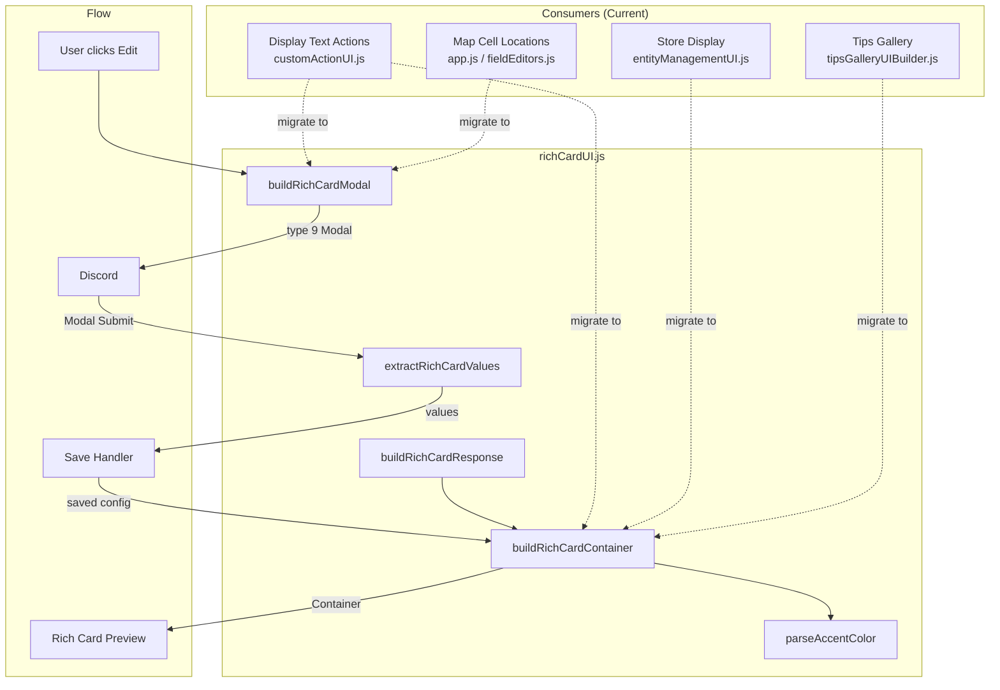

# Rich Card UI

**File:** `richCardUI.js` | **Tests:** `tests/richCardUI.test.js` (29 tests)

Shared builders for the **title / content / accent color / image** pattern that recurs across CastBot. Use this whenever you need a Discord modal that captures visual card fields and/or a Components V2 container that renders them as a rich card preview.

## Why This Exists

The same four-field pattern (title, content/description, accent color, image URL) was independently implemented in 5+ places:

| Consumer | Modal | Preview | Fields Present |
|----------|-------|---------|----------------|
| Display Text Actions (`customActionUI.js`) | Yes | Yes | All 4 |
| Display Text Actions (`app.js` legacy) | Yes | — | All 4 (duplicate) |
| Map Cell Locations (`app.js`) | Yes | Partial | 3 of 4 (no color) |
| Map Cell Locations (`fieldEditors.js`) | Yes (split) | Partial | 3 of 4 (split across modals) |
| Store display (`entityManagementUI.js`) | — | Yes | Color + description (no image modal) |
| Tips Gallery (`tipsGalleryUIBuilder.js`) | — | Yes | Fixed color + image |

Each instance duplicated:
- Modal field definitions (TextInputBuilder boilerplate)
- Color parsing logic (`#3498db` / `3498db` / `3447003` / `0x3498db`)
- Container construction (type 17 + TextDisplay + MediaGallery)

This module consolidates all of it.

## Exports

### `parseAccentColor(input)` — Color Parser

Consolidates the 5+ copies of hex/decimal color parsing scattered across the codebase.

```javascript
import { parseAccentColor } from './richCardUI.js';

parseAccentColor('#3498db');   // 3447003
parseAccentColor('3498db');    // 3447003
parseAccentColor('0x3498DB');  // 3447003
parseAccentColor('3447003');   // 3447003 (decimal string)
parseAccentColor(0xe74c3c);   // 15158332 (pass-through)
parseAccentColor(null);        // null
parseAccentColor('invalid');   // null (never throws)
```

### `buildRichCardModal(options)` — Modal Builder

Creates a type 9 (MODAL) interaction response with the four core fields, plus optional extras.

```javascript
import { buildRichCardModal } from './richCardUI.js';

// Basic usage — returns a ready-to-send modal response
return buildRichCardModal({
  customId: 'safari_display_text_save_mybutton_0',
  modalTitle: 'Edit Text Display',
  values: {                          // Pre-fill from existing data
    title: action?.config?.title || '',
    content: action?.config?.content || '',
    color: action?.config?.color || '',
    image: action?.config?.image || '',
  },
});
```

**Options:**

| Option | Type | Default | Description |
|--------|------|---------|-------------|
| `customId` | string | required | Modal custom_id |
| `modalTitle` | string | required | Title bar text |
| `values` | object | `{}` | Pre-fill values: `{ title, content, color, image }` |
| `fields` | object | `{}` | Per-field overrides (see below) |
| `extraFields` | array | `[]` | Additional fields appended after the core 4 |
| `useLabelWrap` | boolean | `false` | Use type-18 Label wrapper (Components V2 modals) instead of ActionRow |

**Field overrides** — customize labels, requirements, lengths per field:

```javascript
buildRichCardModal({
  customId: 'map_grid_edit_modal_A1',
  modalTitle: 'Edit Location A1',
  fields: {
    title:   { label: 'Location Title', required: true },
    content: { label: 'Location Description', maxLength: 1000 },
    image:   { label: 'Image URL (Discord CDN only)', placeholder: 'https://cdn.discordapp.com/...' },
  },
  extraFields: [
    { customId: 'clues', label: 'Clues (one per line)', style: 2, value: existingClues },
    { customId: 'cellType', label: 'Cell Type', required: true, value: 'unexplored' },
  ],
});
```

### `extractRichCardValues(formData)` — Modal Response Extractor

Extracts values from a modal submit interaction. Works with both ActionRow-wrapped (legacy) and Label-wrapped (Components V2) modal formats.

```javascript
import { extractRichCardValues } from './richCardUI.js';

// In a modal submit handler:
const { title, content, color, image, extra } = extractRichCardValues(interaction.data);

// 'extra' contains any non-core fields:
const clues = extra.clues;
const cellType = extra.cellType;
```

### `buildRichCardContainer(options)` — Preview Container Builder

Builds a Components V2 Container (type 17) that renders a rich card.

```javascript
import { buildRichCardContainer } from './richCardUI.js';

const container = buildRichCardContainer({
  title: 'Welcome!',           // Rendered as "# Welcome!" (H1)
  content: 'Enter the cave...', // Rendered as text display
  color: '#3498db',             // Parsed to accent_color integer
  image: 'https://cdn.discordapp.com/img.png',  // Media Gallery
  extraComponents: [            // Optional: buttons, separators, etc.
    { type: 14 },               // Separator
    actionRow,                  // Action row with buttons
  ],
});
// Returns: { type: 17, components: [...], accent_color: 3447003 }
```

**Behavior:**
- Omits title TextDisplay if `title` is empty/falsy
- Omits Media Gallery if `image` is empty/falsy
- Omits `accent_color` if `color` is empty/invalid
- `extraComponents` are appended after image (useful for navigation buttons)

### `buildRichCardResponse(cardOptions, responseOptions)` — Full Response Builder

Convenience wrapper that wraps the container in a response with `IS_COMPONENTS_V2` flag.

```javascript
import { buildRichCardResponse } from './richCardUI.js';

// Non-ephemeral (e.g., display_text actions shown to all players)
return buildRichCardResponse({
  title: config.title,
  content: config.content,
  color: config.color,
  image: config.image,
});
// Returns: { flags: 32768, components: [container] }

// Ephemeral (e.g., admin preview)
return buildRichCardResponse(cardOptions, { ephemeral: true });
// Returns: { flags: 32832, components: [container] }
```

## Migration Examples

### Before: Display Text Modal (50 lines)

```javascript
// OLD - customActionUI.js:3663-3710
const { ModalBuilder, TextInputBuilder, TextInputStyle, ActionRowBuilder } = await import('discord.js');
const modal = new ModalBuilder()
  .setCustomId(`safari_display_text_save_${buttonId}_${actionIndex}`)
  .setTitle(action ? 'Edit Text Display Action' : 'Create Text Display Action');
const titleInput = new TextInputBuilder()
  .setCustomId('action_title').setLabel('Title (optional)')...;
const contentInput = new TextInputBuilder()...;
const colorInput = new TextInputBuilder()...;
const imageInput = new TextInputBuilder()...;
modal.addComponents(
  new ActionRowBuilder().addComponents(titleInput),
  new ActionRowBuilder().addComponents(contentInput),
  new ActionRowBuilder().addComponents(colorInput),
  new ActionRowBuilder().addComponents(imageInput)
);
return { type: 9, data: modal.toJSON() };
```

### After: Display Text Modal (10 lines)

```javascript
// NEW
import { buildRichCardModal } from './richCardUI.js';

return buildRichCardModal({
  customId: `safari_display_text_save_${buttonId}_${actionIndex}`,
  modalTitle: action ? 'Edit Text Display Action' : 'Create Text Display Action',
  values: {
    title: action?.config?.title || '',
    content: action?.config?.content || '',
    color: action?.config?.color || '',
    image: action?.config?.image || '',
  },
});
```

### Before: Display Text Rendering (55 lines)

```javascript
// OLD - safariManager.js:825-880
const components = [];
if (config.title) { components.push({ type: 10, content: `# ${config.title}` }); }
components.push({ type: 10, content: config.content });
if (config.image) { components.push({ type: 12, items: [{ media: { url: config.image }, ... }] }); }
const container = { type: 17, components };
if (config.color) {
  try {
    let colorStr = config.color.toString().replace('#', '');
    if (/^[0-9A-Fa-f]{6}$/.test(colorStr)) {
      container.accent_color = parseInt(colorStr, 16);
    }
  } catch (error) { ... }
}
return { flags: (1 << 15), components: [container] };
```

### After: Display Text Rendering (1 line)

```javascript
// NEW
import { buildRichCardResponse } from './richCardUI.js';

return buildRichCardResponse(config);
```

### Map Cell Location Modal (with extra fields)

```javascript
import { buildRichCardModal } from './richCardUI.js';

return buildRichCardModal({
  customId: `map_grid_edit_modal_${coord}`,
  modalTitle: `Edit Content for Location ${coord}`,
  values: {
    title: coordData.baseContent?.title || `Location ${coord}`,
    content: coordData.baseContent?.description || '',
    image: coordData.baseContent?.image || '',
  },
  fields: {
    title:   { label: 'Location Title', required: true },
    content: { label: 'Location Description', maxLength: 1000 },
    color:   { label: 'Accent Color (optional)' },  // NEW: map cells get color support for free
    image:   { label: 'Image URL (Discord CDN only)', placeholder: 'https://cdn.discordapp.com/...' },
  },
  extraFields: [
    { customId: 'clues', label: 'Clues (one per line)', style: 2, value: (coordData.baseContent?.clues || []).join('\n'), maxLength: 500 },
  ],
});
```

## Architecture Diagram



## Testing

```bash
# Run all 29 tests
node --test tests/richCardUI.test.js

# Tests cover:
# - parseAccentColor: 9 tests (all formats, edge cases, invalid input)
# - buildRichCardModal: 6 tests (defaults, values, overrides, extras, Label wrap)
# - extractRichCardValues: 4 tests (ActionRow, Label, extras, whitespace)
# - buildRichCardContainer: 6 tests (all fields, omissions, extras)
# - buildRichCardResponse: 3 tests (flags, ephemeral, wrapping)
# - Round-trip: 1 test (modal -> extract -> container end-to-end)
```

## Related Documentation

- [ComponentsV2.md](../standards/ComponentsV2.md) — Component types used (Container, TextDisplay, MediaGallery)
- [DiscordInteractionAPI.md](../standards/DiscordInteractionAPI.md) — Modal (type 9) response format
- [LeanUserInterfaceDesign.md](../ui/LeanUserInterfaceDesign.md) — Rich Card pattern (UX standards)
- [ButtonHandlerFactory.md](ButtonHandlerFactory.md) — Handler pattern for buttons that trigger these modals
- [EntityEditFramework.md](EntityEditFramework.md) — Entity-level editing (stores use `accentColor` property)
