# buildCastlist2ResponseData() Migration Analysis

## 🤔 What Does This Function Actually Do?

### Purpose
`buildCastlist2ResponseData()` is the **final assembly function** that transforms raw castlist data into Discord UI components. Think of it as the "presentation layer" that takes tribes, members, and navigation state and builds the actual visual response users see.

### What It Does:
1. **Fetches Guild Settings** - Pronouns, timezones for member display
2. **Calculates Pagination** - Determines which members to show on current page
3. **Creates Tribe UI** - Builds the visual tribe section with member cards
4. **Adds Navigation** - Creates previous/next buttons for multi-page tribes
5. **Assembles Response** - Combines everything into Discord's component format

### Example Flow:
```
Raw Data → buildCastlist2ResponseData() → Discord UI Components
[tribes]     [Pagination]                   [Visual Castlist]
[members]    [Formatting]                   [Navigation Buttons]
[settings]   [Assembly]                     [Ready to Display]
```

### Why It's Critical:
This is the **bottleneck function** - every single castlist display must pass through it. It's the bridge between:
- **Data Layer** (tribes, members, settings)
- **Display Layer** (Discord components, visual formatting)
- **User Experience** (what players actually see)

Think of it as the **final assembly line** in a factory - all the parts come together here.

## 🏛️ Why Is It In app.js? (Historical Context)

### The Organic Growth Story


### Classic Symptoms of Organic Growth:
- ✅ Started as "quick helper function"
- ✅ "Temporary" placement became permanent
- ✅ app.js became dumping ground for shared utilities
- ✅ Never refactored because "it works"
- ✅ Now used by everything, hard to move (until now!)

### The Logical Grouping

```mermaid
graph LR
    subgraph "Display Functions (castlistV2.js)"
        A["createTribeSection()<br/>Creates tribe UI"]
        B["createPlayerCard()<br/>Creates member cards"]
        C["createNavigationButtons()<br/>Creates nav buttons"]
        D["calculateTribePages()<br/>Handles pagination"]
        E["createCastlistV2Layout()<br/>Final layout"]
    end

    subgraph "The Orchestrator"
        F["buildCastlist2ResponseData()<br/>🎭 Calls all display functions<br/>📦 Assembles final response"]
    end

    F -->|uses| A
    F -->|uses| B
    F -->|uses| C
    F -->|uses| D
    F -->|uses| E

    style F fill:#fbbf24,stroke:#f59e0b,stroke-width:3px,color:#1f2937

    Note1["❌ Currently in app.js<br/>✅ Should be in castlistV2.js<br/>with its friends"]

    F -.-> Note1
```



## 📍 Current Location Impact Assessment

### Executive Summary
**Risk Level**: 🟢 **LOW**
**Impact**: 🎯 **HIGH POSITIVE**
**Effort**: ⏱️ **30 minutes**
**Breaking Changes**: ❌ **NONE**

## 🗺️ Where It Sits in Context

### Current Architecture vs. Target Architecture


### The Migration Path

```mermaid
sequenceDiagram
    participant Dev as Developer
    participant App as app.js
    participant CV2 as castlistV2.js
    participant Git as Version Control

    Dev->>App: Cut lines 1226-1331
    Note over App: Remove buildCastlist2ResponseData

    Dev->>CV2: Paste function
    Note over CV2: Add imports for storage functions

    Dev->>App: Add import statement
    Note over App: import { buildCastlist2ResponseData } from './castlistV2.js'

    Dev->>Dev: Test all 5 methods
    Note over Dev: ✅ /castlist<br/>✅ show_castlist2<br/>✅ navigation<br/>✅ Hub<br/>✅ Prod Menu

    Dev->>Git: Commit changes
    Note over Git: "Refactor: Move display assembly to display module"

    Note over App,CV2: Result: Cleaner separation of concerns
```



## 📊 Usage Analysis: Which Methods Use This Function?

### Direct Usage Mapping


### Who Calls It?

| Caller | Location | Method | Usage Pattern |
|--------|----------|--------|---------------|
| **sendCastlist2Response()** | app.js:1336 | Internal wrapper | Used by multiple handlers |
| **show_castlist2 handler** | app.js:4908 | Direct call | Button click response |
| **/castlist command** | app.js:2160, 2262 | Via sendCastlist2Response | Command execution |
| **castlist2_nav** | app.js:27881 | Via sendCastlist2Response | Navigation buttons |
| **Post Castlist redirect** | app.js:7783 | Via sendCastlist2Response | Now eliminated, but was using it |

### Answer: **ALL 5 METHODS** use this function either directly or indirectly!

## 🔍 Risk Assessment

### Migration Dependencies


### Risk Factors Analysis

| Risk Factor | Assessment | Mitigation |
|-------------|------------|------------|
| **External Dependencies** | ✅ Low | All imports available in castlistV2.js |
| **Global Variables** | ⚠️ Medium | `client` passed as parameter |
| **Breaking Changes** | ✅ None | Function is exported, just changing location |
| **Testing Coverage** | ✅ Low Risk | All callers continue working |
| **Rollback Capability** | ✅ Easy | Simple revert if issues |

## 💡 Impact Analysis

### Positive Impacts

1. **Code Organization** 📁
   - Display logic moves to display file
   - Better separation of concerns
   - More intuitive file structure

2. **File Size Reduction** 📉
   ```
   app.js: 21,000+ lines → ~20,900 lines (-100 lines)
   castlistV2.js: ~700 lines → ~800 lines (+100 lines)
   ```

3. **Developer Experience** 👩‍💻
   - Easier to find display logic
   - Related functions in same file
   - Reduced cognitive load

4. **Future Maintenance** 🔧
   - Single place for all display logic
   - Easier to refactor display system
   - Clear module boundaries

### Negative Impacts

| Concern | Reality | Mitigation |
|---------|---------|------------|
| Import changes needed | ❌ No | Function only used internally in app.js |
| Performance impact | ❌ None | Same execution, different file |
| Breaking existing code | ❌ No | Export remains, internal calls work |

## 📝 Implementation Plan

### Step 1: Prepare castlistV2.js
```javascript
// Add to castlistV2.js imports
import { getGuildPronouns, getGuildTimezones } from './storage.js';
import { sortCastlistMembers } from './castlistSorter.js';

// Move function (lines 1226-1331 from app.js)
export async function buildCastlist2ResponseData(guild, tribes, castlistName, navigationState, member = null, channelId = null) {
  // ... existing function body ...
}
```

### Step 2: Update app.js
```javascript
// Add to imports section
import {
  buildCastlist2ResponseData,
  // ... other existing imports from castlistV2
} from './castlistV2.js';

// Remove function definition (lines 1226-1331)
// Keep the export statement for now if needed
```

### Step 3: Fix client parameter
```javascript
// In castlistV2.js, modify the createCastlistV2Layout call
const responseData = createCastlistV2Layout(
  [tribeSection],
  castlistName,
  guild,
  [navigationRow.toJSON()],
  [],
  null // Pass null instead of client (it's optional)
);
```

## 🎯 Why This is Low Risk

### 1. **No External Consumers** ✅
- Function is only used within app.js
- No other files import it
- No breaking changes for external code

### 2. **All Dependencies Available** ✅
- Most dependencies already in castlistV2.js
- Storage imports are straightforward
- No circular dependency issues

### 3. **Simple Rollback** ✅
- If issues arise, just move it back
- Git makes this trivial
- No data migration needed

### 4. **Tested Code Path** ✅
- Function works currently
- Moving location doesn't change logic
- All 5 castlist methods continue working

## 📊 Final Risk Matrix

```mermaid
graph LR
    subgraph "Risk vs Impact"
        A["This Change"]
    end

    subgraph "Scale"
        LOW["Low Risk ✅"]
        HIGH["High Impact ✅"]
    end

    A --> LOW
    A --> HIGH

    style A fill:#10b981,stroke:#059669,color:#ffffff
    style LOW fill:#22c55e,color:#ffffff
    style HIGH fill:#3b82f6,color:#ffffff
```



## 🚀 Recommendation

### DO IT NOW! Here's why:

1. **Universal Usage**: All 5 castlist methods use this function
2. **Zero Breaking Changes**: No external imports need updating
3. **Immediate Benefits**: Cleaner architecture instantly
4. **30 Minute Task**: Quick win with high impact
5. **Safe Rollback**: Easy to revert if any issues

### Expected Outcome
- ✅ app.js becomes more manageable
- ✅ Display logic properly organized
- ✅ No user-facing changes
- ✅ No performance impact
- ✅ Sets precedent for further refactoring

## 📋 Testing Checklist

After migration, test:
- [ ] `/castlist` command works
- [ ] `show_castlist2` buttons work
- [ ] Navigation buttons work
- [ ] Post Castlist button works
- [ ] Production menu castlists work

## 🎬 Conclusion

This is a **textbook example of a low-risk, high-reward refactor**. The function is:
- Self-contained
- Well-tested
- Universally used
- Easy to move

The impact is significant because **every single castlist display** goes through this function, meaning the improved organization benefits the entire castlist system immediately.

**Risk**: 🟢 LOW
**Reward**: 🎯 HIGH
**Effort**: ⏱️ MINIMAL
**Decision**: ✅ **PROCEED**