# Castlist Architecture: Complete System Analysis

## Overview

This document provides a comprehensive architectural analysis of CastBot's castlist system, including all display methods, data flows, and the virtual adapter pattern that bridges legacy and modern implementations.

## 🏗️ System Architecture Overview

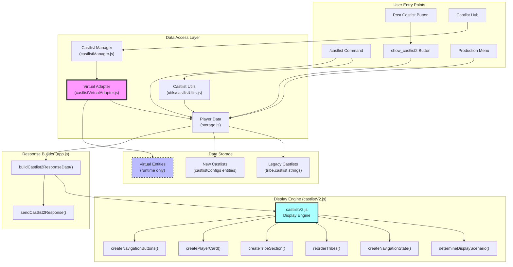

## 📊 Method 1: `/castlist` Command

### Data Flow
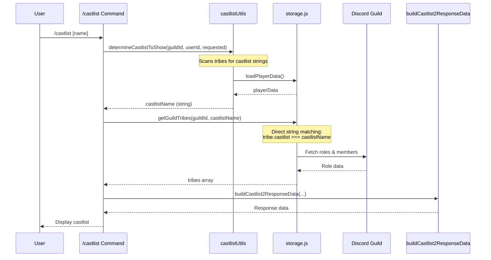

### Key Characteristics
- **Data Access**: Direct string matching on `tribe.castlist`
- **Virtual Adapter**: ❌ Not used
- **Entity Support**: ❌ Legacy only
- **Member Fetching**: ✅ Always fetches

## 📊 Method 2: `show_castlist2` Handler

### Data Flow
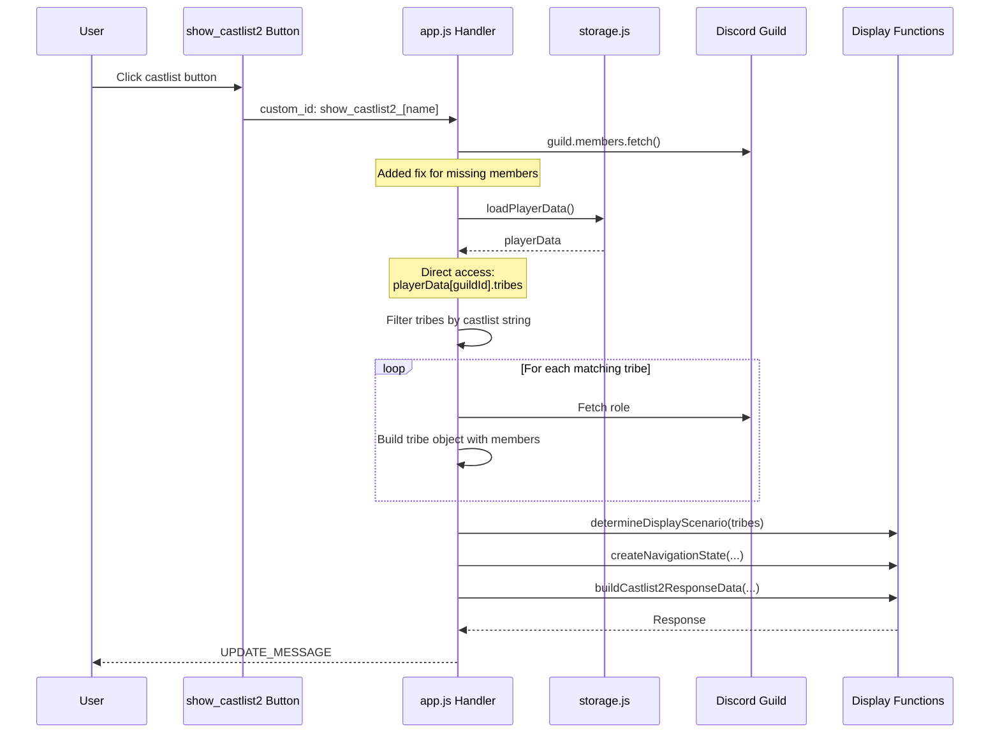

### Key Characteristics
- **Data Access**: Direct `playerData` access with string matching
- **Virtual Adapter**: ❌ Not used
- **Entity Support**: ❌ Legacy only
- **Member Fetching**: ✅ Fixed (previously broken)

## 📊 Method 3: Castlist Hub (CastlistV3)

### Data Flow
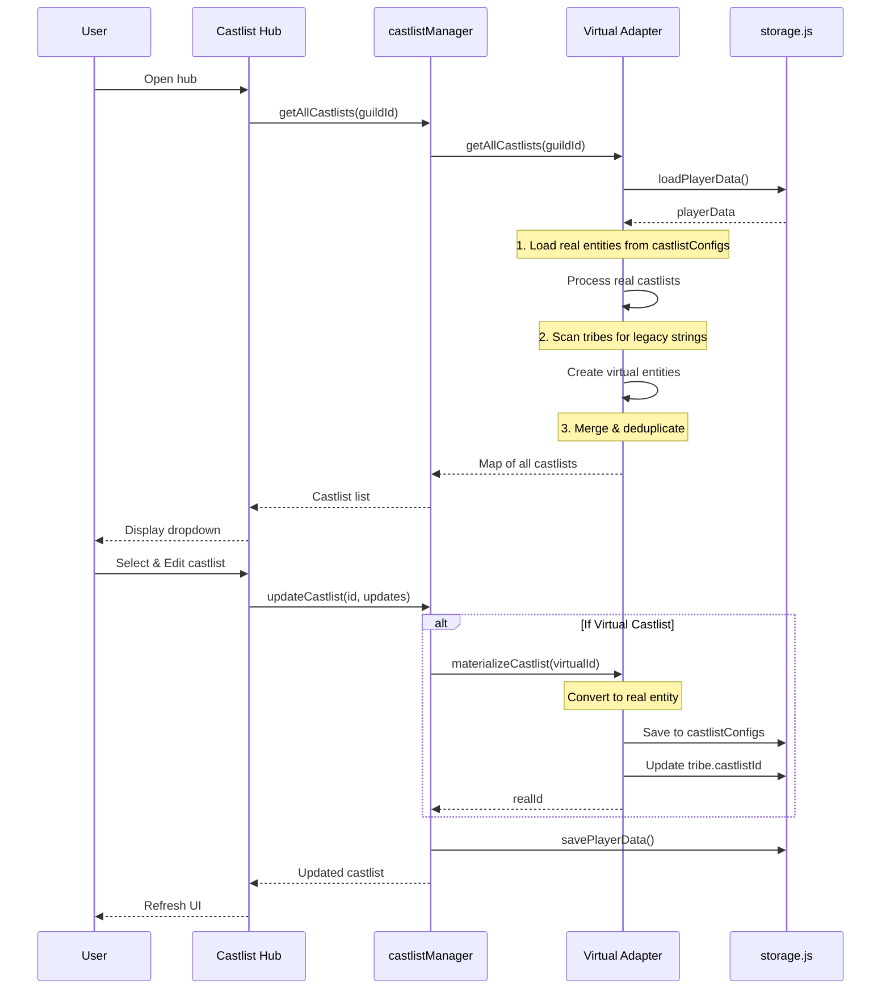

### Key Characteristics
- **Data Access**: Through castlistManager → Virtual Adapter
- **Virtual Adapter**: ✅ Full integration
- **Entity Support**: ✅ Both legacy (virtual) and new (real)
- **Auto-Migration**: ✅ On edit operations
- **Access Control**: ⚠️ Restricted to specific user ID

## 📊 Method 4: Post Castlist Button Redirect

### Data Flow
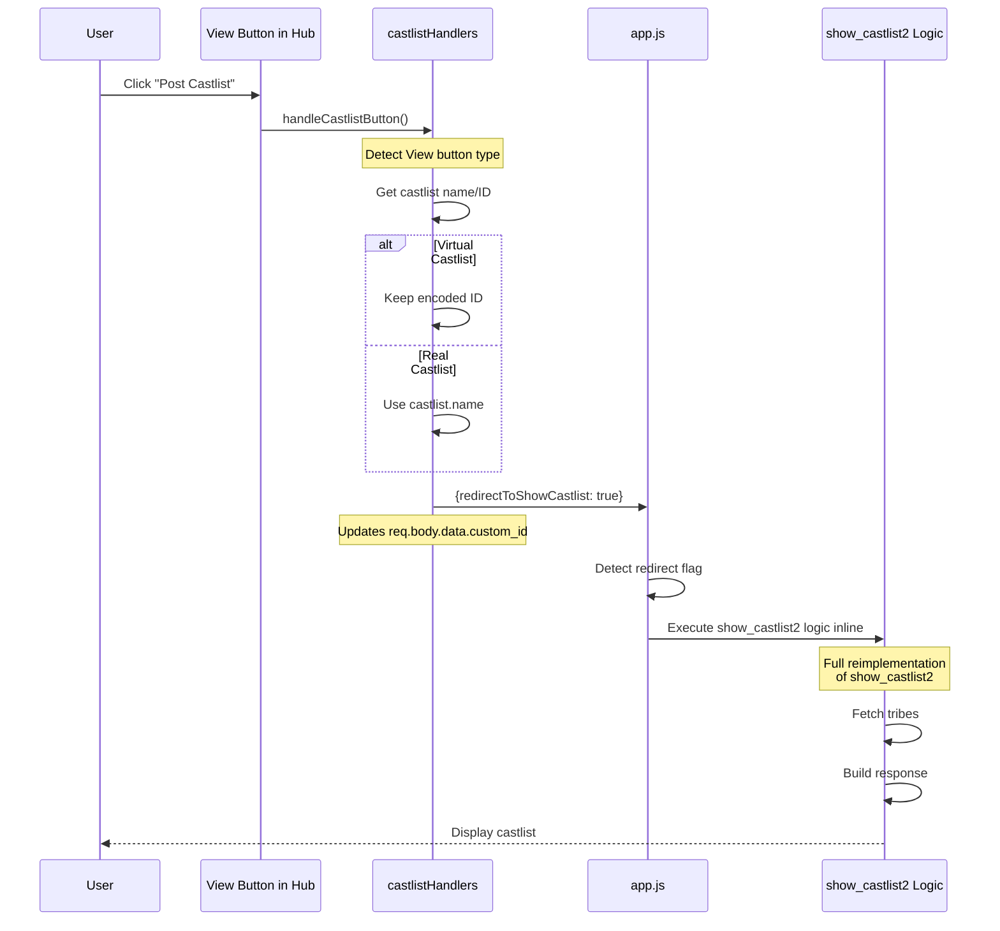

### Key Characteristics
- **Data Access**: Hybrid - starts with entity, falls back to string
- **Virtual Adapter**: ⚠️ Partial (decode only)
- **Complexity**: 🔴 High - duplicate logic
- **Error Prone**: 🔴 Yes - sync issues

## 📊 Method 5: Production Menu Buttons

### Data Flow
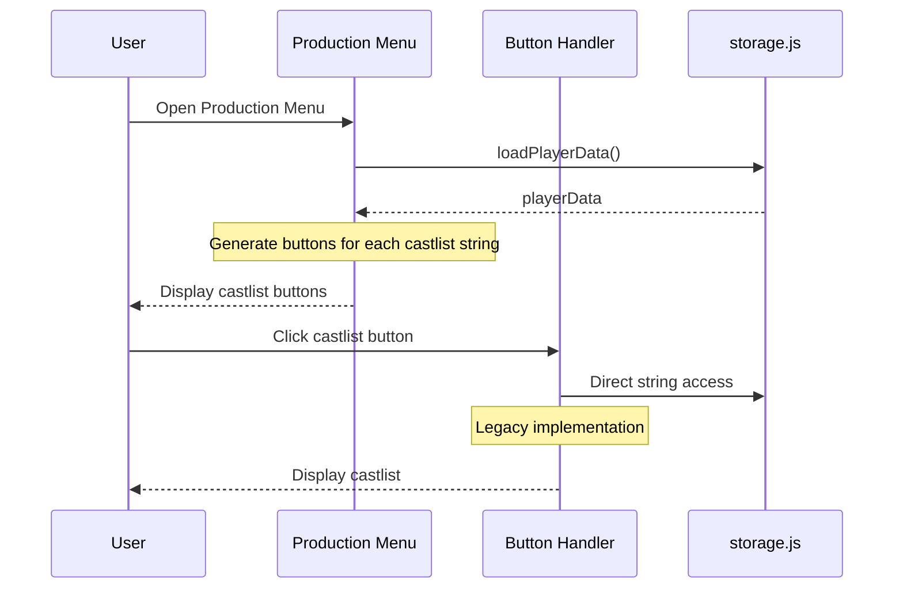

### Key Characteristics
- **Data Access**: Direct string matching
- **Virtual Adapter**: ❌ Not used
- **Entity Support**: ❌ Legacy only
- **Simplicity**: ✅ Direct but limited

## 🔄 Virtual Adapter Pattern

### How Virtual Adapter Works
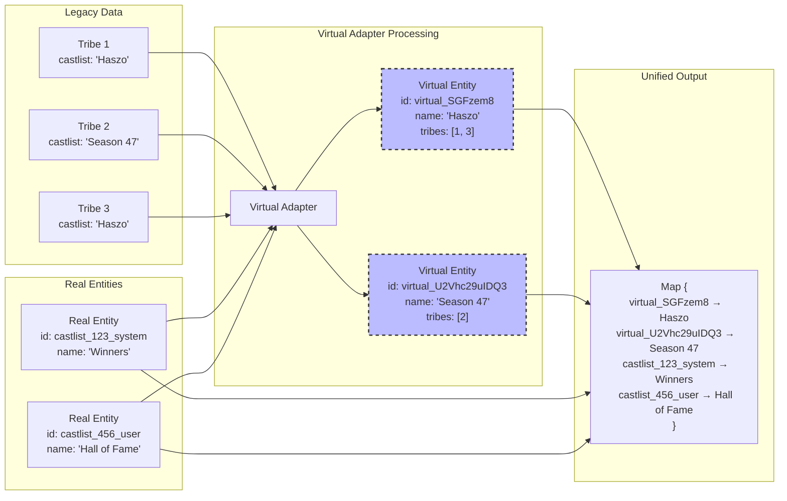

### Materialization Process
```mermaid
stateDiagram-v2
    [*] --> Virtual: Legacy string detected
    Virtual --> Virtual: Read operations
    Virtual --> Materializing: Edit operation triggered

    state Materializing {
        [*] --> CreateReal: Generate real ID
        CreateReal --> SaveEntity: Store in castlistConfigs
        SaveEntity --> UpdateTribes: Add castlistId to tribes
        UpdateTribes --> KeepLegacy: Maintain castlist string
        KeepLegacy --> [*]: Complete
    }

    Materializing --> Real: Migration complete
    Real --> Real: All operations

    note right of Virtual: Exists only in memory\nNo database changes
    note right of Real: Permanent entity\nFull metadata support
    note left of KeepLegacy: Both fields maintained:\n- castlist: "name"\n- castlistId: "id"
```

## 🔍 Comparison Matrix

| Method | Virtual Adapter | Entity Support | Auto-Migration | Member Fetch | Complexity |
|--------|----------------|----------------|----------------|--------------|------------|
| `/castlist` Command | ❌ | ❌ Legacy | ❌ | ✅ | Low |
| `show_castlist2` Handler | ❌ | ❌ Legacy | ❌ | ✅ Fixed | Medium |
| Castlist Hub | ✅ Full | ✅ Both | ✅ | ✅ | Low |
| Post Castlist Redirect | ⚠️ Partial | ⚠️ Hybrid | ❌ | ✅ | High |
| Production Menu | ❌ | ❌ Legacy | ❌ | ❓ Varies | Low |

## 🎯 Architectural Issues

### 1. Inconsistent Data Access
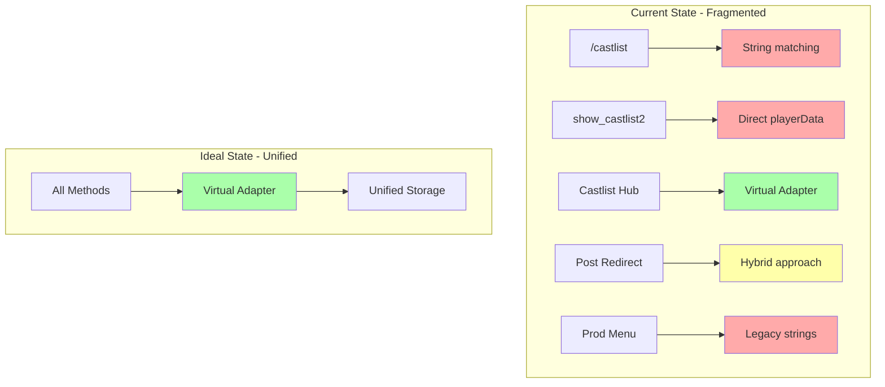

### 2. Duplicate Implementation
- **buildCastlist2ResponseData()** exists in app.js (exported)
- **show_castlist2 logic** duplicated in redirect handler (lines 7684-7775)
- **Tribe fetching logic** repeated in 5+ locations
- **Display scenario calculation** inconsistent across methods

### 3. Migration Bottlenecks
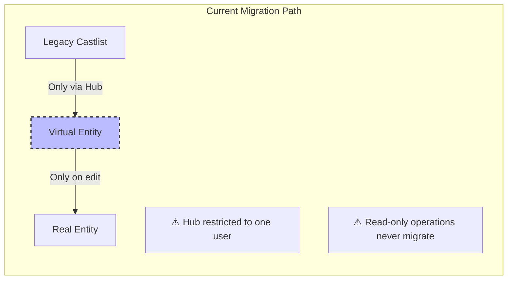

### 4. Error-Prone Redirect Pattern
The Post Castlist redirect creates a complex flow:
1. Button click → castlistHandlers
2. Handler modifies req.body.data.custom_id
3. Returns redirect flag to app.js
4. app.js reimplements show_castlist2 logic inline
5. Risk of `tribes.some is not a function` when tribes undefined/not array

## 🔧 Recommended Architecture

### Unified Data Access Layer
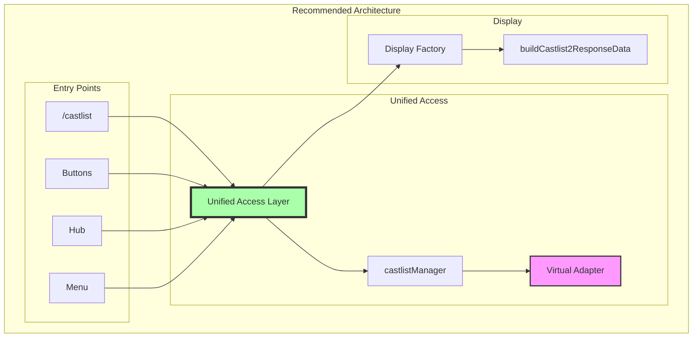

### Benefits of Unified Architecture
1. **Single source of truth** for castlist data
2. **Consistent behavior** across all access methods
3. **Automatic migration** through normal usage
4. **Reduced code duplication**
5. **Easier testing and maintenance**
6. **Clear upgrade path** from legacy to modern

## 📋 Implementation Priority

### Phase 1: Stabilize Current System
1. Fix Post Castlist redirect crash
2. Ensure member fetching works consistently
3. Add error handling for undefined tribes

### Phase 2: Unify Display Logic
1. Create single display function used by all methods
2. Eliminate duplicate show_castlist2 implementations
3. Standardize navigation state creation

### Phase 3: Integrate Virtual Adapter
1. Update `/castlist` command to use virtual adapter
2. Update `show_castlist2` to use virtual adapter
3. Update Production Menu to see all castlists

### Phase 4: Complete Migration
1. Remove user ID restriction from Castlist Hub
2. Enable auto-migration for all edit operations
3. Deprecate legacy string matching gradually

## 🚨 Critical Path Issues

### Current Crash Pattern
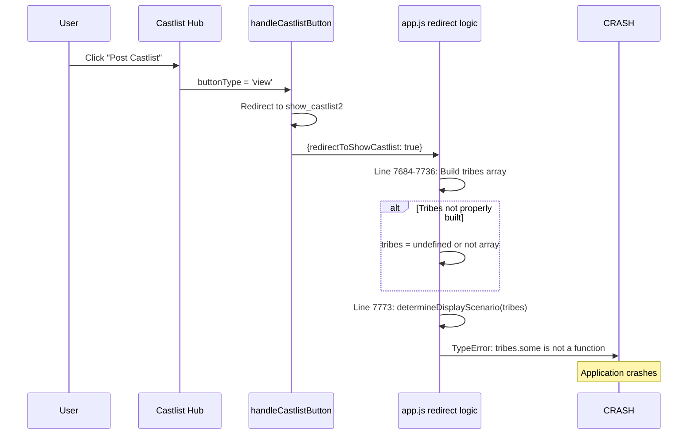

### Root Causes
1. **Inconsistent tribe fetching** between methods
2. **Missing error handling** for undefined tribes
3. **Complex redirect pattern** with inline logic duplication
4. **No validation** before calling array methods

## 📝 Summary

The castlist system currently has **5+ different display methods** with varying levels of virtual adapter integration:

1. **Most Modern**: Castlist Hub (full virtual adapter, auto-migration)
2. **Most Used**: `/castlist` command and `show_castlist2` (legacy strings only)
3. **Most Complex**: Post Castlist redirect (hybrid with duplication)
4. **Most Limited**: Production Menu (basic string matching)

The virtual adapter successfully bridges legacy and modern systems but is only fully utilized in the restricted Castlist Hub. Full integration across all methods would eliminate crashes, enable gradual migration, and provide a consistent user experience.

---

**Next Steps**: With this comprehensive understanding of the architecture, we can now address the specific crash in the Post Castlist redirect flow with full context of how it fits into the broader system.