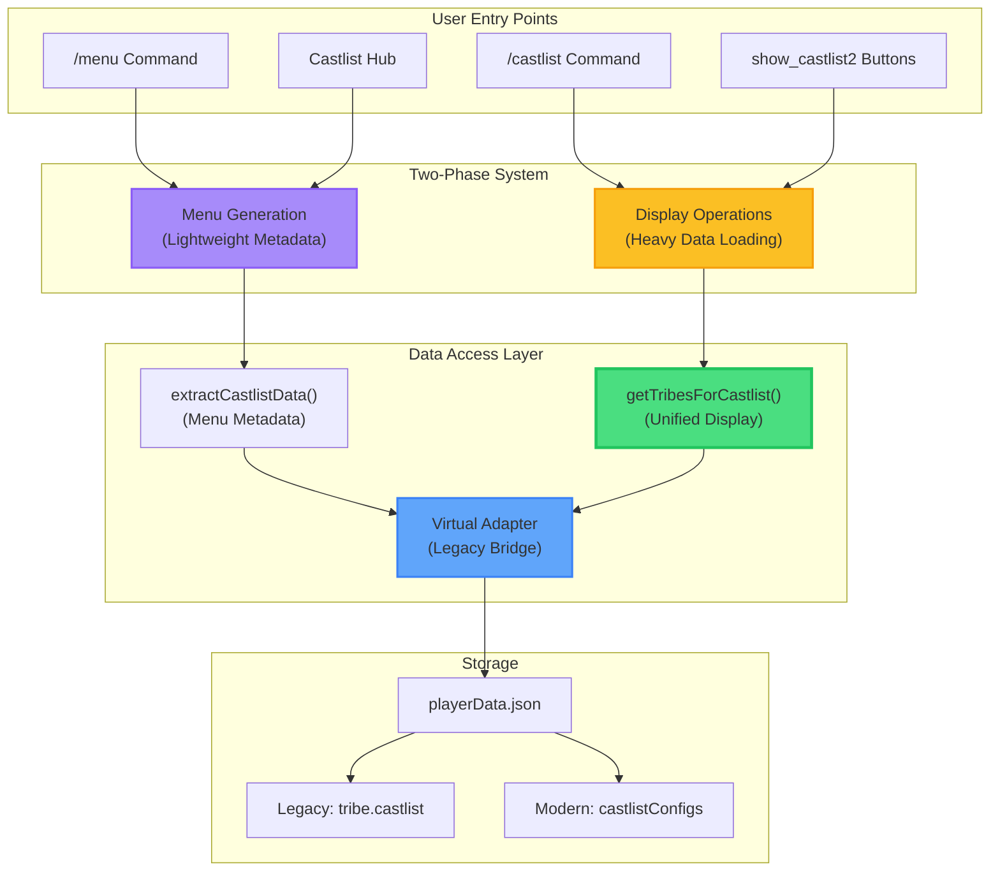
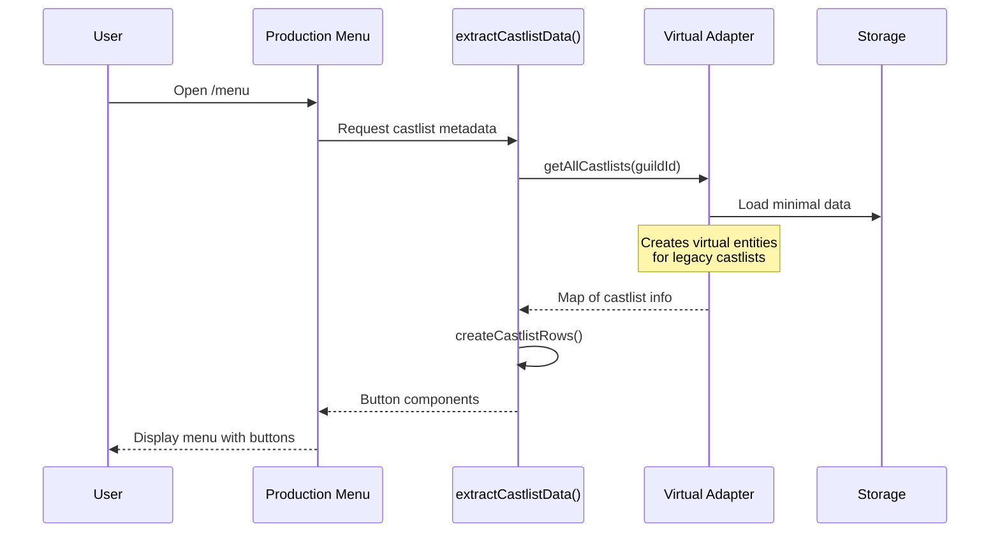
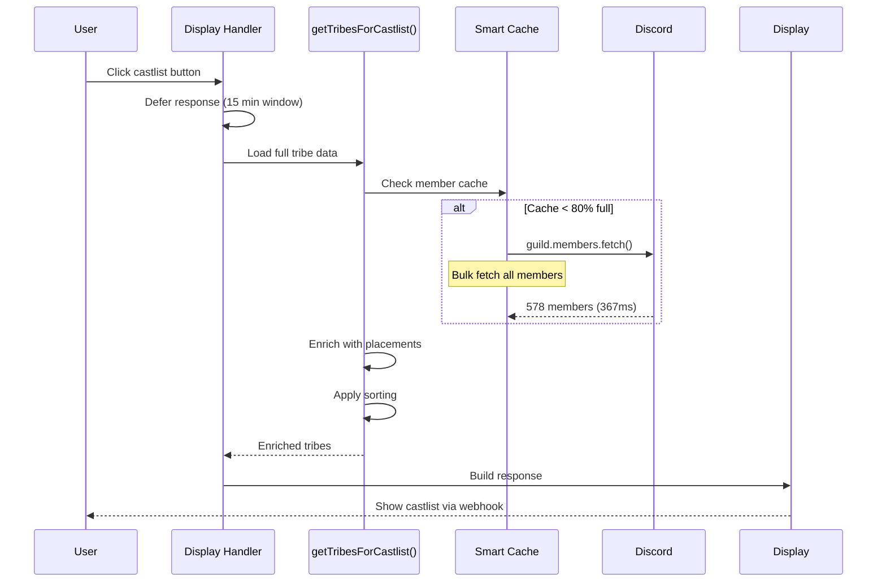
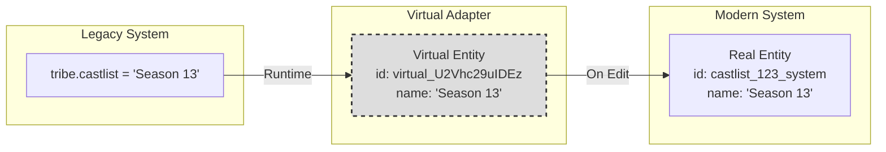
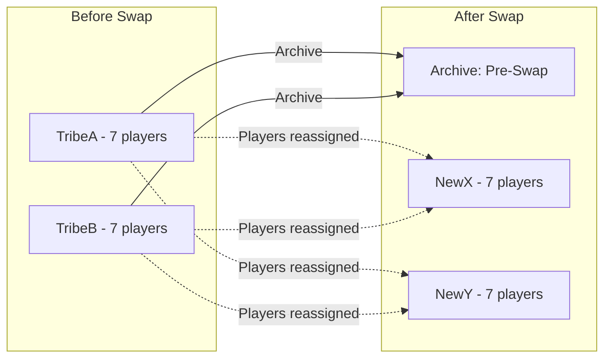

# Castlist Architecture

**Status**: 🟢 Production (As-Built)
**Last Updated**: November 2025
**Purpose**: Authoritative reference for CastBot's castlist system architecture

## Executive Summary

The castlist system is the heart of CastBot, displaying organized groups of players (tribes) across multiple interfaces. The architecture achieves **100% unified data access** through `getTribesForCastlist()` while maintaining separate lightweight menu generation for performance.

### Key Achievements
- **Unified Display**: Single data access function for all display operations
- **Smart Caching**: 80% threshold bulk member fetching (367ms for 578 members)
- **Virtual Adapter**: Legacy castlists appear as modern entities transparently
- **Deferred Responses**: 15-minute timeout window for heavy operations
- **Position-Based Parsing**: Handles arbitrary underscores in castlist IDs

## Core Architecture



## Data Flow Architecture

### Phase 1: Menu Generation (Lightweight)



**Purpose**: Generate menu buttons without loading member data
**Performance**: <100ms for any number of castlists
**Data Loaded**: Names, IDs, metadata only

### Phase 2: Display Operations (Heavy)



**Purpose**: Display castlist with full member data
**Performance**: 367ms cold cache, 0ms warm
**Data Loaded**: All members, roles, placements, metadata

## Key Components

### 1. Unified Data Access (`castlistDataAccess.js`)

The single source of truth for castlist display:

```javascript
export async function getTribesForCastlist(guildId, castlistIdentifier, client) {
  // Step 1: Resolve identifier to entity (via Virtual Adapter)
  const castlist = await castlistManager.getCastlist(guildId, castlistIdentifier);

  // Step 2: Get tribe role IDs (supports all 3 formats)
  const roleIds = await castlistManager.getTribesUsingCastlist(guildId, castlist.id);

  // Step 3: Smart cache check (80% threshold)
  if (guild.members.cache.size < guild.memberCount * 0.8) {
    await guild.members.fetch({ timeout: 10000 });
  }

  // Step 4: Enrich with Discord data and placements
  return enrichedTribes;
}
```

**Used By**: All display operations
**Key Features**: Smart caching, placement integration, Virtual Adapter support

### 2. Virtual Adapter Pattern

Bridges legacy string-based castlists with modern entity system:



**States**:
- **Virtual**: Exists only in memory, no database changes
- **Materialized**: Converted to real entity on first edit
- **Transparent**: Code doesn't need to know which type

### 3. Navigation Parsing

Position-based parsing handles variable-length castlist IDs:

```javascript
// Button: castlist2_nav_next_page_0_0_castlist_1759638936214_system_view

const parts = withoutPrefix.split('_');
// ["next", "page", "0", "0", "castlist", "1759638936214", "system", "view"]

// Position-based extraction (action is ALWAYS 2 parts)
const displayMode = parts[parts.length - 1];           // "view"
const action = `${parts[0]}_${parts[1]}`;              // "next_page"
const currentTribeIndex = parseInt(parts[2]);          // 0
const currentTribePage = parseInt(parts[3]);           // 0
const castlistId = parts.slice(4, parts.length - 1).join('_');
// "castlist_1759638936214_system"
```

**Key Insight**: Actions are always 2 words, mode is always last → extract variable-length ID from middle

For detailed parsing documentation, see [CastlistNavigationParsing.md](CastlistNavigationParsing.md).

### 4. Placement Editor Integration

Edit mode allows inline placement editing for alumni/ranking displays:

```mermaid
graph TB
    subgraph "Edit Mode Flow"
        HUB[Castlist Hub]
        TP[Tribes & Placements Button]
        EM[Edit Mode Display]
        BTN[Placement Button]
        MOD[Modal Input]
        SAV[Save Handler]
    end

    HUB -->|Select castlist| TP
    TP -->|show_castlist2_id_edit| EM
    EM -->|Shows buttons not thumbnails| BTN
    BTN -->|Click "14th"| MOD
    MOD -->|Enter placement| SAV
    SAV -->|UPDATE_MESSAGE| EM

    style EM fill:#fbbf24,stroke:#f59e0b
    style SAV fill:#4ade80,stroke:#22c55e
```

**Storage**: Global namespace `playerData[guildId].placements.global[playerId]`
**Not** per-tribe (survives tribe changes)
**Full Documentation**: [Placements.md](Placements.md)

### 5. Sorting System (`castlistSorter.js`)

Configurable sorting strategies set via Castlist Hub:

```javascript
export function sortCastlistMembers(members, tribeData, options = {}) {
  // Clear stale placement data
  members.forEach(member => {
    delete member.displayPrefix;
    delete member.placement;
  });

  // Determine strategy from castlistSettings
  const sortingStrategy = tribeData.castlistSettings?.sortStrategy || 'alphabetical';

  switch (sortingStrategy) {
    case 'placements':       // Alumni rankings (1st, 2nd, 3rd...)
    case 'alphabetical':     // A-Z by display name
    case 'reverse_alpha':    // Z-A by display name
    case 'vanity_role':      // By vanity role (S1, S2, then alpha)
    // Legacy strategies (age, timezone, join_date) are deprecated
  }
}
```

**Placement Sorting**: Shows active players first, then ranked by placement
**Vanity Sorting**: Prioritizes season roles (S1, S2) before alphabetical

## Season & Tribe Management Integration

### Active Season Context

The active season provides default context for all castlist operations:

```javascript
// From SeasonLifecycle.md
{
  "activeSeason": {
    "id": "config_1751549410029_391415444084490240",
    "name": "Season 47: Redemption Island",
    "stage": "applications"
  }
}
```

**Impact**: Default castlist automatically tied to active season
**Display**: Production Menu header shows active season name
**Documentation**: [SeasonLifecycle.md](../concepts/SeasonLifecycle.md)

### Tribe Swap/Merge Operations

Dramatic reorganizations that affect castlist structure:



**Features**:
- Creates archive castlist with old tribes
- Optional vanity roles keep old tribes visible
- Auto-randomize with 15-second dramatic reveals
- Updates default castlist with new configuration

**Documentation**: [TribeSwapMerge.md](TribeSwapMerge.md)

## Legacy System (Being Retired)

The original castlist system used simple string matching:

```javascript
// Legacy storage in playerData.json
{
  "tribes": {
    "roleId_123": {
      "castlist": "Season 13",  // Simple string
      "emoji": "🏝️",
      "color": "#4A90E2"
    }
  }
}

// Legacy lookup
function getGuildTribes(guildId, castlistName) {
  return tribes.filter(t => t.castlist === castlistName);
}
```

**Migration Path**: Virtual Adapter creates entities on-demand, materializes on edit
**Backwards Compatible**: Both systems work simultaneously
**Future**: Remove `tribe.castlist` field when all servers migrated

## Performance Characteristics

| Operation | Cold Cache | Warm Cache | Notes |
|-----------|------------|------------|-------|
| Menu Generation | <100ms | <100ms | Metadata only |
| Display (50 members) | ~150ms | 0ms | Quick fetch |
| Display (578 members) | ~367ms | 0ms | Bulk fetch triggered |
| Display (1000+ members) | ~800ms | 0ms | May need deferred |
| Navigation | 0ms | 0ms | Uses cached data |
| Placement Edit | ~200ms | ~200ms | Database write |

## Entry Point Summary

| Entry Point | Data Function | Response Pattern | Documentation |
|-------------|---------------|------------------|---------------|
| `/castlist` | getTribesForCastlist() | Direct response | Built-in command |
| `/menu` → Castlist Hub | extractCastlistData() | Ephemeral menu | [MenuSystemArchitecture.md](../enablers/MenuSystemArchitecture.md) |
| `show_castlist2_` buttons | getTribesForCastlist() | Deferred + webhook | [ButtonHandlerFactory.md](../enablers/ButtonHandlerFactory.md) |
| Navigation buttons | getTribesForCastlist() | UPDATE_MESSAGE | [CastlistNavigationParsing.md](CastlistNavigationParsing.md) |
| Placement edit | getTribesForCastlist() | UPDATE_MESSAGE | [Placements.md](Placements.md) |

## Critical Implementation Notes

### Discord.js Member Caching
- `role.members` is a **filtered view** of cache, not complete list
- Must bulk fetch if cache < 80% full
- Cache resets on bot restart (hence November 2024 incident)

### Button ID Limits
- Discord maximum: 100 characters
- Entity IDs can be long: `castlist_1759638936214_system`
- Solution: Use type suffix instead of full guild/user ID

### Component Limits
- Maximum 40 components per message (recursive count)
- Castlist display limit: 4 custom + 1 default
- Solution: Sort by most recent, hide overflow

### Deferred Response Requirements
- Discord timeout: 3 seconds for direct response
- Member fetch alone can take 367ms
- Solution: Always defer for display operations

## Related Documentation

### Core Systems
- [Placements.md](Placements.md) - Placement editor system
- [CastlistNavigationParsing.md](CastlistNavigationParsing.md) - Button parsing details
- [SeasonLifecycle.md](../concepts/SeasonLifecycle.md) - Active season context
- [TribeSwapMerge.md](TribeSwapMerge.md) - Tribe reorganization

### Technical Infrastructure
- [ComponentsV2.md](../standards/ComponentsV2.md) - UI component standards
- [DiscordInteractionAPI.md](../standards/DiscordInteractionAPI.md) - Interaction patterns
- [ButtonHandlerFactory.md](../enablers/ButtonHandlerFactory.md) - Button implementation

### Migration & Analysis
- [RaP/0978](../../RaP/0978_20251115_CastlistArchitecture_AuditReport.md) - Architecture audit
- [DataArchitecture.md](DataArchitecture.md) - Legacy data structures

## Future Considerations

### Complete Virtual Adapter Migration
- Remove `tribe.castlist` field when all servers migrated
- Simplify storage to only use `tribe.castlistId`
- Estimated: Q2 2025

### Enhanced Sorting
- Implement timezone and join_date sorting
- Add custom order support for manual arrangement
- Player preference memory

### Performance Optimization
- Implement request-level caching for navigation
- Pre-warm cache for scheduled events
- CDN for avatar images

---

This document serves as the authoritative reference for CastBot's castlist architecture. For implementation details on specific subsystems, follow the linked documentation.