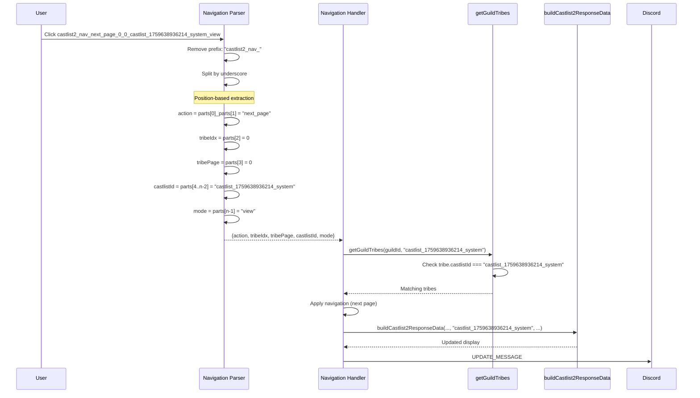

# Castlist Navigation & Button Parsing

**Created**: 2025-10-05
**Status**: ✅ Production - As-Built Documentation
**Purpose**: Complete reference for castlist button ID formats, parsing logic, and identifier resolution

---

## 🎯 Overview

Castlist navigation uses a **two-phase system**:
1. **Display Phase**: User clicks castlist button → Handler resolves identifier → Displays first page
2. **Navigation Phase**: User clicks page/tribe buttons → Parser extracts context → Handler displays requested page

This document explains how button IDs are formatted, parsed, and resolved across **legacy** and **migrated** castlist systems.

---

## 📋 Button ID Formats

### Display Buttons (Entry Points)

**Format**: `show_castlist2_{identifier}`

**Examples**:
```javascript
show_castlist2_default                      // Default castlist (special case)
show_castlist2_legacyList                   // Legacy name (may be migrated)
show_castlist2_ForeverLegacyCastlist        // Pure legacy name (never migrated)
show_castlist2_castlist_1759638936214_system // Direct entity ID (rare)
```

**Key Characteristics**:
- Single underscore separator
- Identifier can be: legacy name, entity ID, or "default"
- Handler must resolve identifier → entity ID for navigation buttons

---

### Navigation Buttons (Pagination)

**Format**: `castlist2_nav_{action}_{tribeIdx}_{tribePage}_{castlistId}_{mode}`

**Examples**:
```javascript
// Simple case (default castlist)
castlist2_nav_next_page_0_0_default_view

// Migrated castlist (ID has underscores!)
castlist2_nav_next_page_0_0_castlist_1759638936214_system_view

// Legacy name
castlist2_nav_next_tribe_1_0_ForeverLegacyCastlist_edit

// Multi-tribe navigation
castlist2_nav_last_tribe_2_1_default_view
```

**Components**:
| Position | Component | Type | Examples | Notes |
|----------|-----------|------|----------|-------|
| 0-1 | `action` | 2 words | `next_page`, `last_tribe`, `next_tribe`, `last_page` | Always 2 underscore-separated words |
| 2 | `tribeIdx` | integer | `0`, `1`, `2` | Current tribe index (0-based) |
| 3 | `tribePage` | integer | `0`, `1` | Current page within tribe (0-based) |
| 4 to n-2 | `castlistId` | variable | `default`, `legacyList`, `castlist_1759638936214_system` | **CAN HAVE UNDERSCORES** |
| n-1 | `mode` | single word | `view`, `edit` | Display mode |

**CRITICAL**: The `castlistId` component can contain underscores, making naive parsing impossible. Parser must use position-based extraction.

---

## 🔄 Identifier Resolution Flow

The system supports three identifier states during the legacy → entity migration:

### State 1: Default Castlist (Special Case)

**Tribe Data**:
```json
{
  "roleId_123": {
    "castlist": "default",
    "castlistId": "default"
  }
}
```

**Flow**:
1. Display button: `show_castlist2_default`
2. Identifier: `"default"`
3. Resolution: Skip (default is always valid)
4. Navigation uses: `"default"`

**Navigation button**: `castlist2_nav_next_page_0_0_default_view`

---

### State 2: Pure Legacy (Not Yet Migrated)

**Tribe Data**:
```json
{
  "roleId_456": {
    "castlist": "ForeverLegacyCastlist"
    // No castlistId field - never migrated
  }
}
```

**Flow**:
1. Display button: `show_castlist2_ForeverLegacyCastlist`
2. Identifier: `"ForeverLegacyCastlist"`
3. Resolution (app.js:4837-4855):
   - Check: `"ForeverLegacyCastlist".startsWith('castlist_')` → `false`
   - Check: `"ForeverLegacyCastlist" === 'default'` → `false`
   - Search `castlistConfigs` for `name="ForeverLegacyCastlist"` → **NOT FOUND**
   - Log: `⚠️ Could not resolve legacy name`
   - Fallback: `castlistIdForNavigation = "ForeverLegacyCastlist"` (use name as-is)
4. Navigation uses: `"ForeverLegacyCastlist"` (name)

**Navigation button**: `castlist2_nav_next_page_0_0_ForeverLegacyCastlist_view`

**Storage Lookup**: `getGuildTribes()` checks `tribe.castlist === "ForeverLegacyCastlist"` → **MATCH**

---

### State 3: Migrated Castlist (Dual Storage)

**Tribe Data**:
```json
{
  "roleId_789": {
    "castlist": "legacyList",                        // Legacy field (kept for backwards compat)
    "castlistId": "castlist_1759638936214_system"    // New field (authoritative)
  }
}
```

**Castlist Entity**:
```json
{
  "castlistConfigs": {
    "castlist_1759638936214_system": {
      "id": "castlist_1759638936214_system",
      "name": "legacyList",
      "type": "system",
      "createdAt": 1759638936215,
      "createdBy": "migration",
      "metadata": {
        "migratedFrom": "virtual_bGVnYWN5TGlzdA",  // base64("legacyList")
        "migrationDate": 1759638936215
      }
    }
  }
}
```

**Flow**:
1. Display button: `show_castlist2_legacyList` ← **Still uses NAME**
2. Identifier: `"legacyList"`
3. Resolution (app.js:4837-4855):
   ```javascript
   // Check if already an ID
   if (!requestedCastlist.startsWith('castlist_') && requestedCastlist !== 'default') {
     // Search castlistConfigs for matching name
     const castlistConfigs = playerData[guildId]?.castlistConfigs || {};
     const matchingEntity = Object.values(castlistConfigs)
       .find(config => config.name === requestedCastlist);

     if (matchingEntity?.id) {
       castlistIdForNavigation = matchingEntity.id;  // ✅ Found!
       console.log(`✅ Resolved legacy name '${requestedCastlist}' to entity ID '${castlistIdForNavigation}'`);
     }
   }
   ```
   - Search finds: `{ id: "castlist_1759638936214_system", name: "legacyList" }`
   - Resolution: `castlistIdForNavigation = "castlist_1759638936214_system"`
4. Pass to `buildCastlist2ResponseData(guild, tribes, castlistIdForNavigation, ...)`
5. Navigation buttons created with: `"castlist_1759638936214_system"`

**Navigation button**: `castlist2_nav_next_page_0_0_castlist_1759638936214_system_view`

**Storage Lookup**: `getGuildTribes()` checks `tribe.castlistId === "castlist_1759638936214_system"` → **MATCH**

---

## 🔍 Parser Implementation

### Position-Based Parsing (Current - Working)

**Location**: `app.js:28118-28140`

**Algorithm**:
```javascript
// Input: castlist2_nav_next_page_0_0_castlist_1759638936214_system_view
const withoutPrefix = custom_id.substring('castlist2_nav_'.length);
// Result: "next_page_0_0_castlist_1759638936214_system_view"

const parts = withoutPrefix.split('_');
// Result: ["next", "page", "0", "0", "castlist", "1759638936214", "system", "view"]

// Position-based extraction (actions are ALWAYS 2 parts)
const displayMode = parts[parts.length - 1];           // "view"
const action = `${parts[0]}_${parts[1]}`;              // "next_page"
const currentTribeIndex = parseInt(parts[2]);          // 0
const currentTribePage = parseInt(parts[3]);           // 0
const castlistId = parts.slice(4, parts.length - 1).join('_');
// "castlist_1759638936214_system"
```

**Why Position-Based Works**:
1. **Actions are always 2 words**: `next_page`, `last_tribe`, `next_tribe`, `last_page`
2. **Indices are always single numbers**: `0`, `1`, `2`, etc.
3. **Mode is always single word**: `view` or `edit`
4. **castlistId is variable length**: Can have 0+ underscores

**Key Insight**: By knowing the action is positions [0-1] and mode is position [n-1], we can extract the variable-length castlistId from the middle.

---

### Failed Approaches (Historical Context)

#### Attempt 1: Magic String Search for "castlist" Word

**Code** (BROKEN):
```javascript
// FAILED APPROACH - Don't use this!
let castlistIdStartIdx = -1;
for (let i = parts.length - 2; i >= 2; i--) {
  if (parts[i] === 'castlist' || (parts[i] === 'default' && i === parts.length - 2)) {
    castlistIdStartIdx = i;
    break;
  }
}
```

**Why It Failed**:
- **Legacy names**: `"ForeverLegacyCastlist".split('_')` → `["ForeverLegacyCastlist"]` (no "castlist" word to find)
- **IDs with wrong position**: Finds "castlist" at position 4, but assumes index starts there
- **Names containing "castlist"**: `"MyCastlist"` would match incorrectly

**Symptoms**:
```
❌ Could not find castlist in nav button ID: castlist2_nav_next_page_0_0_legacyList_view
Error: Invalid navigation button format - missing castlist identifier
```

#### Attempt 2: Substring Search

**Issue**: Cannot reliably determine where castlistId ends and mode begins without markers.

---

## 🎮 Display Modes

### View Mode (Public Display)

**Characteristics**:
- Public-facing display
- All users can see
- Navigation buttons enabled
- **No** placement editing buttons
- Read-only interaction

**Example Button**: `castlist2_nav_next_page_0_0_default_view`

**Response Type**: `CHANNEL_MESSAGE_WITH_SOURCE` (new message) or `UPDATE_MESSAGE` (refresh)

**Components**:
- Header with castlist name
- Player cards with thumbnails
- Navigation buttons (◀ Last | Manage Profile | Next ▶)
- Viral growth button (Add to your ORG)

---

### Edit Mode (Admin Editing)

**Characteristics**:
- Admin-only access (requires `MANAGE_ROLES` permission)
- Same navigation buttons as view mode
- **Additional** placement edit buttons on each player card
- Allows editing player placements inline

**Example Button**: `castlist2_nav_next_page_0_0_default_edit`

**Response Type**: `UPDATE_MESSAGE` (always updates existing message)

**Components**:
- Header with castlist name + "Edit Mode" indicator
- Player cards with placement edit buttons
- Navigation buttons (◀ Last | Manage Profile | Next ▶)
- Save/Cancel controls (if applicable)

**Placement Button Format**: `castlist_placements_{castlistId}_{userId}_{seasonId|global}`

---

## 🔄 Complete Execution Flow

### Phase 1: Display Button Click

```mermaid
sequenceDiagram
    participant User
    participant Handler as show_castlist2
    participant Resolver as Resolution Logic
    participant Builder as buildCastlist2ResponseData
    participant Discord

    User->>Handler: Click show_castlist2_legacyList
    Handler->>Handler: Extract identifier: "legacyList"
    Handler->>Resolver: Resolve "legacyList" → entity ID?

    alt Is already entity ID?
        Resolver->>Resolver: Check startsWith('castlist_')
        Note over Resolver: "legacyList" → false
    end

    alt Is default?
        Resolver->>Resolver: Check === 'default'
        Note over Resolver: "legacyList" → false
    end

    Resolver->>Resolver: Search castlistConfigs for name="legacyList"
    Resolver->>Resolver: Found: castlist_1759638936214_system
    Resolver-->>Handler: castlistIdForNavigation = "castlist_1759638936214_system"

    Handler->>Builder: buildCastlist2ResponseData(..., "castlist_1759638936214_system", ...)
    Builder->>Builder: Create navigation buttons with ID
    Builder-->>Handler: Response with buttons
    Handler->>Discord: Display castlist
```



### Phase 2: Navigation Button Click



---

## 🧪 Testing Scenarios

### Test 1: Default Castlist Navigation

**Setup**:
- Tribe has: `castlist: "default"`
- Button: `show_castlist2_default`

**Expected**:
1. Resolution: Skip (default always valid)
2. Navigation button: `castlist2_nav_next_page_0_0_default_view`
3. Parser extracts: `castlistId = "default"`
4. Storage lookup: `tribe.castlist === "default"` → MATCH ✅

**Result**: Navigation works for default castlist

---

### Test 2: Migrated Castlist (Name → ID)

**Setup**:
- Tribe has: `castlist: "legacyList"`, `castlistId: "castlist_1759638936214_system"`
- Entity exists: `{ id: "castlist_1759638936214_system", name: "legacyList" }`
- Button: `show_castlist2_legacyList`

**Expected**:
1. Resolution finds entity: `castlistIdForNavigation = "castlist_1759638936214_system"`
2. Navigation button: `castlist2_nav_next_page_0_0_castlist_1759638936214_system_view`
3. Parser extracts: `castlistId = "castlist_1759638936214_system"`
4. Storage lookup: `tribe.castlistId === "castlist_1759638936214_system"` → MATCH ✅

**Result**: Navigation works for migrated castlist using entity ID

---

### Test 3: Pure Legacy (Never Migrated)

**Setup**:
- Tribe has: `castlist: "ForeverLegacyCastlist"` (no castlistId)
- No entity in castlistConfigs
- Button: `show_castlist2_ForeverLegacyCastlist`

**Expected**:
1. Resolution finds no entity: `castlistIdForNavigation = "ForeverLegacyCastlist"` (fallback to name)
2. Navigation button: `castlist2_nav_next_page_0_0_ForeverLegacyCastlist_view`
3. Parser extracts: `castlistId = "ForeverLegacyCastlist"`
4. Storage lookup: `tribe.castlist === "ForeverLegacyCastlist"` → MATCH ✅

**Result**: Navigation works for pure legacy castlist using name

---

### Test 4: Edit Mode Navigation

**Setup**:
- Migrated castlist: `castlistId: "castlist_1759638936214_system"`
- User is admin
- Button: `show_castlist2_legacyList` (from edit mode menu)

**Expected**:
1. Resolution: Same as Test 2
2. Navigation button: `castlist2_nav_next_page_0_0_castlist_1759638936214_system_edit`
3. Parser extracts: `mode = "edit"`
4. Response includes placement edit buttons

**Result**: Edit mode navigation works with same parsing logic

---

### Test 5: Multi-Underscore ID

**Setup**:
- Entity ID: `castlist_1759638936214_system_special_variant`
- Button: `castlist2_nav_next_page_0_0_castlist_1759638936214_system_special_variant_view`

**Expected**:
1. Parser splits into: `["next", "page", "0", "0", "castlist", "1759638936214", "system", "special", "variant", "view"]`
2. Extracts: `castlistId = parts.slice(4, 9).join('_') = "castlist_1759638936214_system_special_variant"`
3. Storage lookup matches

**Result**: Parser handles arbitrary underscores in castlist IDs ✅

---

## 📂 Implementation Files

### Core Resolution & Display

| File | Lines | Function | Purpose |
|------|-------|----------|---------|
| `app.js` | 4769-4960 | `show_castlist2` handler | Entry point for castlist display |
| `app.js` | 4837-4855 | Resolution logic | Resolves legacy names → entity IDs |
| `app.js` | 4949 | Pass to builder | `buildCastlist2ResponseData(..., castlistIdForNavigation, ...)` |

### Navigation Parsing & Handling

| File | Lines | Function | Purpose |
|------|-------|----------|---------|
| `app.js` | 28100-28250 | Navigation handler | Handles `castlist2_nav_*` buttons |
| `app.js` | 28118-28140 | Position-based parser | Extracts action, indices, ID, mode |
| `app.js` | 28149 | Tribe fetching | `getGuildTribes(guildId, castlistId)` |

### Display & Button Creation

| File | Lines | Function | Purpose |
|------|-------|----------|---------|
| `castlistV2.js` | 797-900 | `buildCastlist2ResponseData()` | Main response builder |
| `castlistV2.js` | 488-540 | `createNavigationButtons()` | Generates nav buttons with castlistId |
| `castlistV2.js` | 870-871 | Button creation call | Passes `castlistId` to button factory |

### Storage Layer

| File | Lines | Function | Purpose |
|------|-------|----------|---------|
| `storage.js` | 233-270 | `getGuildTribes()` | Fetches tribes, checks BOTH `castlist` and `castlistId` |

---

## 🔗 Related Documentation

### Castlist System
- **[CastlistV3.md](CastlistV3.md)** - Virtual adapter pattern, migration strategy
- **[CastlistArchitecture.md](../architecture/CastlistArchitecture.md)** - Complete system overview with all 5 access methods
- **[000-editCastlistSeason.md](../../000-editCastlistSeason.md)** - Data structure reference

### Debugging & Analysis
- **[RaP/0992](../../RaP/0992_20251005_CastlistNavigation_GetGuildTribes_Mismatch.md)** - The debugging session that identified these issues
- **[RaP/0993](../../RaP/0993_20251005_CastlistNavigation_BrokenParsing.md)** - (Superseded) Initial incorrect diagnosis

### Technical Foundations
- **[ButtonHandlerFactory.md](../enablers/ButtonHandlerFactory.md)** - Button creation patterns
- **[ComponentsV2.md](../standards/ComponentsV2.md)** - Discord UI components

---

## 📊 Migration State Tracking

### How to Determine Castlist State

```javascript
const tribe = playerData[guildId].tribes[roleId];

// State 1: Default (special)
if (tribe.castlist === 'default' || tribe.castlistId === 'default') {
  // Always valid, no resolution needed
}

// State 2: Pure Legacy (not migrated)
if (tribe.castlist && !tribe.castlistId) {
  // Never migrated - use name for everything
  // Navigation will use: tribe.castlist
}

// State 3: Migrated (dual storage)
if (tribe.castlist && tribe.castlistId) {
  // Migrated - entity exists in castlistConfigs
  // Navigation will use: tribe.castlistId (authoritative)
  // Display buttons may still use: tribe.castlist (backwards compat)
}
```

### Migration Metadata

Migrated castlists include migration tracking:

```json
{
  "castlistConfigs": {
    "castlist_1759638936214_system": {
      "metadata": {
        "migratedFrom": "virtual_bGVnYWN5TGlzdA",  // base64("legacyList")
        "migrationDate": 1759638936215
      }
    }
  }
}
```

---

## 🚨 Common Pitfalls & Solutions

### Pitfall 1: Passing Name Instead of Resolved ID

**Symptom**: Navigation buttons created with legacy names, parser fails to find "castlist" marker

**Cause**:
```javascript
// ❌ WRONG: Passing requestedCastlist (name)
await buildCastlist2ResponseData(guild, tribes, requestedCastlist, ...);
```

**Fix**:
```javascript
// ✅ CORRECT: Passing castlistIdForNavigation (resolved ID)
await buildCastlist2ResponseData(guild, tribes, castlistIdForNavigation, ...);
```

**Location**: `app.js:4949`

---

### Pitfall 2: Using Magic String Search in Parser

**Symptom**: Parser throws "missing castlist identifier" for valid legacy names

**Cause**: Searching for "castlist" word doesn't work for names like "ForeverLegacyCastlist"

**Fix**: Use position-based parsing (current implementation)

**Location**: `app.js:28118-28140`

---

### Pitfall 3: Assuming Single-Word Actions

**Symptom**: Parser extracts wrong castlistId because it assumes action is 1 word

**Fix**: Actions are **always** 2 words: `next_page`, `last_tribe`, `next_tribe`, `last_page`

---

### Pitfall 4: Forgetting Dual Field Check in Storage

**Symptom**: `getGuildTribes()` only finds legacy OR migrated tribes, not both

**Cause**: Only checking `tribe.castlist` or only checking `tribe.castlistId`

**Fix**: Check BOTH fields (current implementation in `storage.js:233-270`)

```javascript
const matches = (
  tribeData.castlist === castlistIdentifier ||        // Legacy name
  tribeData.castlistId === castlistIdentifier ||      // New ID
  // ... other checks
);
```

---

## 📈 Historical Evolution

### Version 1: Direct String Matching (Original)
- Buttons used names directly
- No entity system
- Fragile: typos broke everything

### Version 2: Magic String Parser (Failed)
- Tried to parse entity IDs by searching for "castlist" word
- Broke for legacy names containing "castlist"
- Broke for names without "castlist"

### Version 3: Position-Based Parser (Current - Oct 2025)
- Knows action is always 2 words
- Extracts variable-length castlistId from middle
- Works for ALL identifier formats
- Robust for migration scenarios

**Key Insight**: The breakthrough was realizing we don't need to search for markers when we know the structure has fixed positions at both ends.

---

## 🎯 Future Considerations

### Eventual Migration Completion

When all castlists are migrated:
1. Display buttons can switch to using IDs: `show_castlist2_castlist_1759638936214_system`
2. Resolution logic becomes simpler (no name lookup needed)
3. Storage can deprecate `tribe.castlist` field
4. Parser remains unchanged (already handles all cases)

### Multi-Castlist Support

Future enhancement: Tribes on multiple castlists simultaneously

**Data Structure**:
```json
{
  "castlistIds": ["default", "castlist_alumni_123", "castlist_winners_456"]
}
```

**Resolution Impact**: Need to determine WHICH castlist to display (user preference or UI choice)

**Parser Impact**: None (parser doesn't care about multi-assignment)

---

## ✅ Quick Reference Cheat Sheet

### For Debugging Navigation Issues

1. **Check resolution logs**:
   ```
   🔍 Resolution check: requestedCastlist='...', isID=..., isDefault=...
   ✅ Resolved legacy name '...' to entity ID '...'
   ```

2. **Check parser logs**:
   ```
   Parsed navigation: {action, currentTribeIndex, currentTribePage, castlistId, displayMode}
   ```

3. **Verify button format**:
   - Display: `show_castlist2_{identifier}`
   - Navigation: `castlist2_nav_{action}_{idx}_{page}_{id}_{mode}`

4. **Check tribe data**:
   - Has `castlistId`? → Migrated, use ID
   - Only `castlist`? → Pure legacy, use name

### For Creating New Navigation Features

1. **Always use resolved ID**: `castlistIdForNavigation`, not `requestedCastlist`
2. **Pass to builders**: `buildCastlist2ResponseData(..., castlistIdForNavigation, ...)`
3. **Trust the parser**: Position-based parsing handles all cases
4. **Check both fields in storage**: `tribe.castlist || tribe.castlistId`

---

**Last Updated**: 2025-10-05
**Maintainer**: Reece (extremedonkey)
**Status**: Production - As-Built

