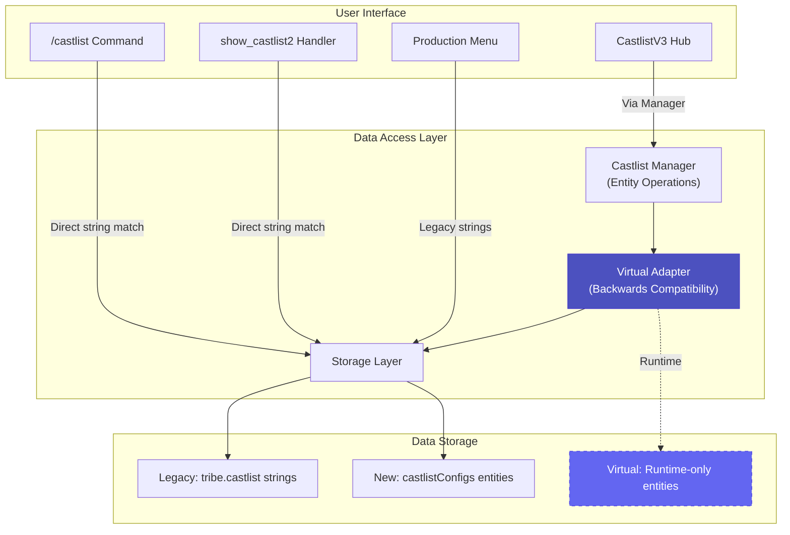
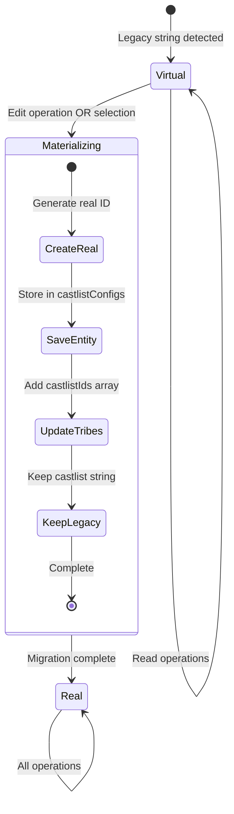

# CastlistV3: Entity-Based Castlist System

## Overview

**Status**: ✅ Infrastructure Complete | 🟡 Features Partial | 🔴 Legacy Retirement Pending
**Created**: September 2025
**Last Major Update**: November 2025 - Default castlist bugs fixed, materialization simplified

CastlistV3 is a complete architectural redesign of CastBot's castlist system, moving from string-based matching to proper entity management with backwards compatibility via the Virtual Adapter pattern.

**This document reflects the ACTUAL IMPLEMENTATION as of November 2025.**

## 🏗️ System Architecture

### Three-Layer Data Model



The system maintains **three overlapping data models** for backwards compatibility:

1. **Legacy Model** - String-based castlists (what 99% of users use today)
2. **Virtual Entity Model** - Runtime bridge layer (transparent to users)
3. **Real Entity Model** - CastlistV3 entities (currently restricted to admin testing)

## 📊 Data Structures

### 1. Legacy Castlist (Production Reality)

```javascript
// In playerData[guildId].tribes
"tribes": {
  "1297206459301367914": {  // Role ID
    "castlist": "production",  // STRING identifier (legacy)
    "emoji": "🔥",
    "color": "#e74c3c"
  }
}
```

**Characteristics:**
- Castlist is just a STRING
- No central storage (duplicated across tribes)
- Typos break everything ("Alumni" vs "Almuni" = different castlists)
- No metadata or settings

### 2. Virtual Entity (Bridge Layer)

```javascript
// Generated on-the-fly, NOT saved
{
  "id": "virtual_SGFzem8",  // base64("Haszo")
  "name": "Haszo",
  "type": "legacy",
  "isVirtual": true,
  "tribes": ["1391142520787832904"],
  "settings": {
    "sortStrategy": "alphabetical"
  }
}
```

**Virtual IDs use base64 encoding**: `virtual_${Buffer.from(name).toString('base64')}`

### 3. Real Entity (CastlistV3)

```javascript
// In playerData[guildId].castlistConfigs
"castlistConfigs": {
  "castlist_1759638936214_system": {
    "id": "castlist_1759638936214_system",
    "name": "Castbot MVPs",
    "type": "custom",
    "seasonId": "season_cac1b81de8914c79",  // Optional
    "createdAt": 1759638936215,
    "createdBy": "391415444084490240",
    "settings": {
      "sortStrategy": "alphabetical",
      "showRankings": true
    },
    "metadata": {
      "description": "The best players ever!",
      "emoji": "🏆"
    }
  }
}
```

### 4. Tribe Relationship (Dual Storage)

```javascript
// Tribes maintain BOTH fields for backwards compatibility
"tribes": {
  "1333822520737927281": {
    "castlist": "Castbot MVPs",           // Legacy (kept forever)
    "castlistIds": ["castlist_1759..."]   // New (array for multi-castlist)
  }
}
```

## 🎯 The Default/Active Castlist

The **default castlist** (ID: "default", Name: "Active Castlist") is the heart of CastBot - it represents the active season's main player roster.

### Special Handling

1. **Always First**: Appears first in all dropdowns
2. **Cannot Delete**: Protected from deletion
3. **Virtual Until Needed**: Exists as virtual entity until first edit
4. **Materialization on Selection**: Converts to real entity when selected (as of Nov 2025 fix)

### Fixed Issues (November 2025)

Three critical bugs were fixed:
1. **Overly Broad Fallback**: Removed logic that included ALL tribes without castlist fields
2. **Wrong String Values**: Fixed "Active Castlist" being saved instead of "default"
3. **Early Materialization**: Moved from tribe management to selection time, eliminating 40+ lines of duplicate code

## 🔄 Virtual Adapter Pattern

### How It Works



### Automatic Materialization Triggers

Virtual castlists become real entities when:
1. **Selected from dropdown** (including default - NEW as of Nov 2025)
2. **Edited via Hub** (metadata, settings, etc.)
3. **Updated programmatically** via `castlistManager.updateCastlist()`

## 🚀 Current Implementation Status

### ✅ What Works in Production

1. **Virtual Adapter** - Makes legacy castlists appear as entities
2. **Basic CRUD** - Create, view, edit, delete via Hub
3. **Multi-Castlist Support** - One tribe can belong to multiple castlists
4. **Backwards Compatibility** - All legacy code continues working
5. **Default Castlist** - Properly handles materialization and display
6. **Alphabetical Sorting** - Fully functional

### 🟡 Partial Implementations

1. **Placement Sorting** - Function exists but needs Placement Editor data
2. **CastlistV3 Hub** - Fully functional but restricted to admin (user ID: 391415444084490240)

### ❌ Not Implemented

Features that were designed but never built:
- Manual ordering UI
- Swap/merge functionality
- 4 additional sort strategies (Reverse Alpha, Age, Timezone, Join Date)
- Create New Castlist entry point in dropdown

See [docs/implementation/CastlistV3_legacyRetirement.md](../implementation/CastlistV3_legacyRetirement.md) for planned work.

## 📦 Key Implementation Files

### Core System (2,731+ lines)
- **castlistManager.js** (405 lines) - Entity CRUD operations
- **castlistVirtualAdapter.js** (273 lines) - Virtual entity bridge
- **castlistHub.js** (528 lines) - Management UI (admin only)
- **castlistHandlers.js** (388 lines) - Button/interaction handlers
- **castlistV2.js** (767+ lines) - Display engine
- **castlistUtils.js** (267 lines) - Utility functions

### Key Functions

```javascript
// Get all castlists (real + virtual)
const allCastlists = await castlistManager.getAllCastlists(guildId);

// Materialize virtual to real
if (castlistVirtualAdapter.isVirtualId(castlistId)) {
  castlistId = await castlistVirtualAdapter.materializeCastlist(guildId, castlistId);
}

// Check if virtual
const isVirtual = castlistVirtualAdapter.isVirtualId(id);
```

## 🎮 How to Use CastlistV3 (Admin Only)

1. **Access Hub**: `/menu` → Production Menu → Castlist Hub (admin restricted)
2. **Select Castlist**: Dropdown shows Active → Real → Virtual castlists
3. **Edit Operations**:
   - **View** - Displays castlist using show_castlist2
   - **Edit Info** - Change name, emoji, description
   - **Add/Remove Tribes** - Manage role associations
   - **Delete** - Remove castlist (except Active/Default)

## 🔍 Access Method Comparison

| Method | Virtual Adapter | Entity Support | User Access |
|--------|----------------|----------------|-------------|
| `/castlist` Command | ❌ No | Legacy only | All users |
| `show_castlist2` Handler | ❌ No | Legacy only | All users |
| CastlistV3 Hub | ✅ Full | Both | Admin only |
| Production Menu | ❌ No | Legacy only | Production team |

## 💡 Key Architectural Decisions

### 1. Virtual Adapter Pattern
Instead of forcing migration, legacy castlists appear as entities transparently. This allows gradual migration through normal usage.

### 2. Dual Storage Forever
Tribes maintain both `castlist` (string) and `castlistIds` (array) permanently. This ensures zero breaking changes.

### 3. Materialization on Selection
As of November 2025, castlists (including default) materialize when selected from dropdown, not when edited. This eliminates duplicate code paths.

### 4. Multi-Castlist Support
One tribe can belong to multiple castlists via the `castlistIds` array. This enables flexible organization.

## 🚨 Critical Implementation Notes

### For Future Development

1. **NEVER remove the castlist string field** - Legacy code depends on it
2. **Default castlist special handling** - ID is "default", name is "Active Castlist"
3. **Virtual IDs use base64** - Pattern: `virtual_${base64(name)}`
4. **Materialization is one-way** - Virtual → Real, never reverse
5. **Check both fields** - Always check `castlist` AND `castlistIds` when finding tribes

### Common Pitfalls

```javascript
// ❌ WRONG - Only checks new field
if (tribe.castlistIds?.includes(castlistId))

// ✅ CORRECT - Checks both legacy and new
if (tribe.castlist === castlistId ||
    tribe.castlistIds?.includes(castlistId))
```

## 📊 Migration Statistics

The system can track migration progress:

```javascript
const stats = await castlistManager.getMigrationStats(guildId);
// Returns: { total, real, virtual, migrationPercentage }
```

## 🎯 Success Metrics

- **Zero breaking changes** - All legacy code continues working
- **Transparent migration** - Users don't notice the change
- **Data integrity** - No castlist data lost during migration
- **Performance maintained** - No noticeable slowdown

## 📚 Related Documentation

- **Technical Details**: [CastlistV3-DataStructures.md](CastlistV3-DataStructures.md)
- **Legacy Retirement**: [docs/implementation/CastlistV3_legacyRetirement.md](../implementation/CastlistV3_legacyRetirement.md)
- **Architecture**: [docs/architecture/CastlistArchitecture.md](../architecture/CastlistArchitecture.md)
- **Feature Status**: [CastlistV3-FeatureStatus.md](CastlistV3-FeatureStatus.md)

---

**Last Updated**: November 2025 - Post default castlist bug fixes and architectural simplification