# CastBot Data Architecture

## Complete Data Management System

### Main Data Storage Architecture

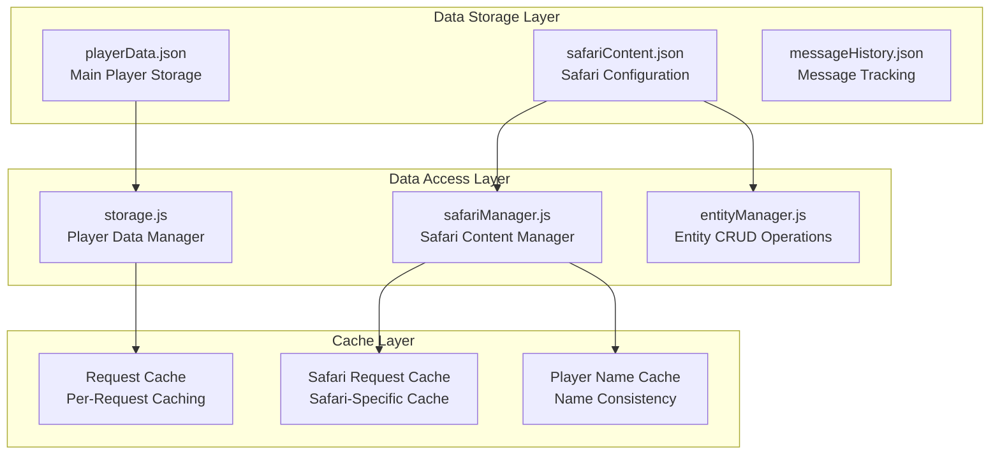

### Data Structure Hierarchy

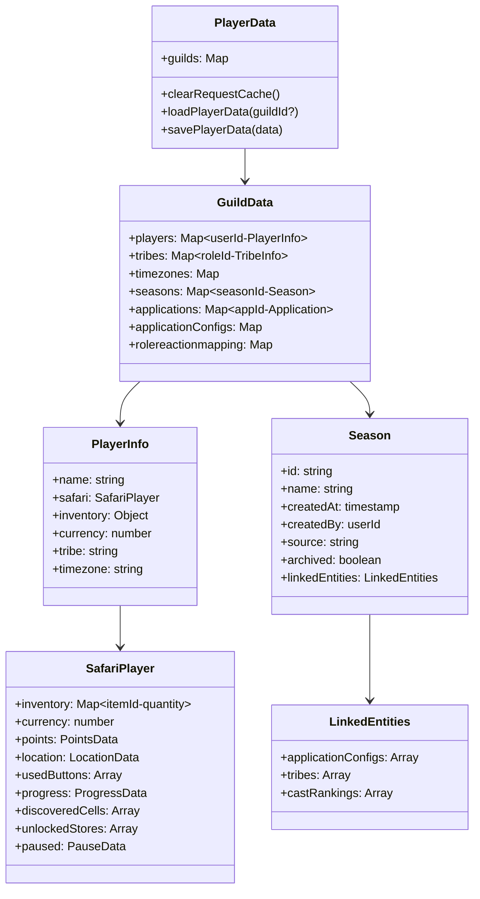

### Safari Content Architecture

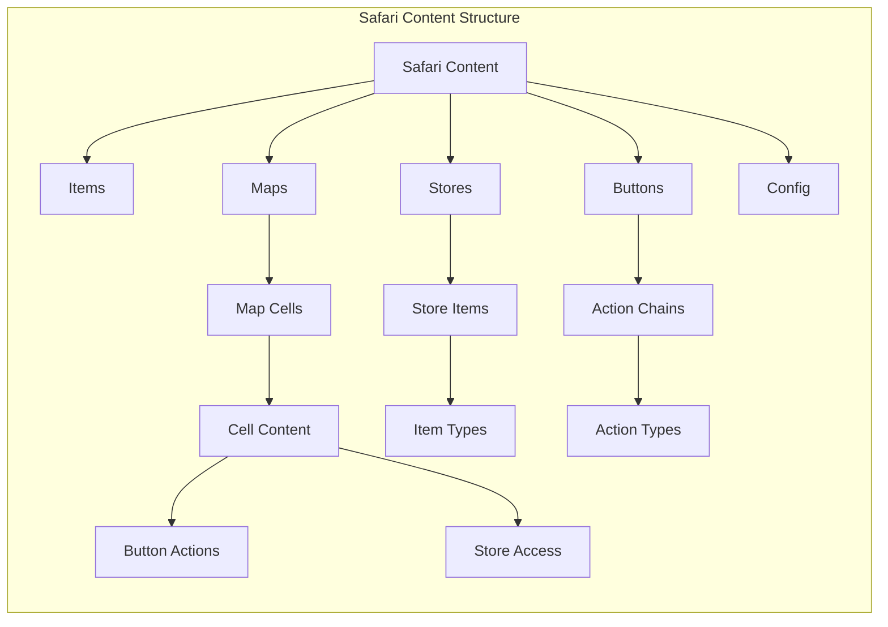

### Entity Management System

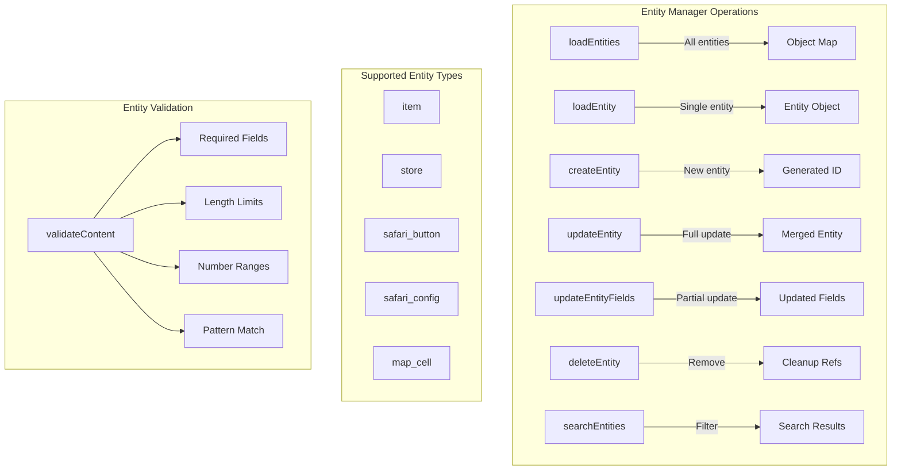

### CRUD Operations Flow

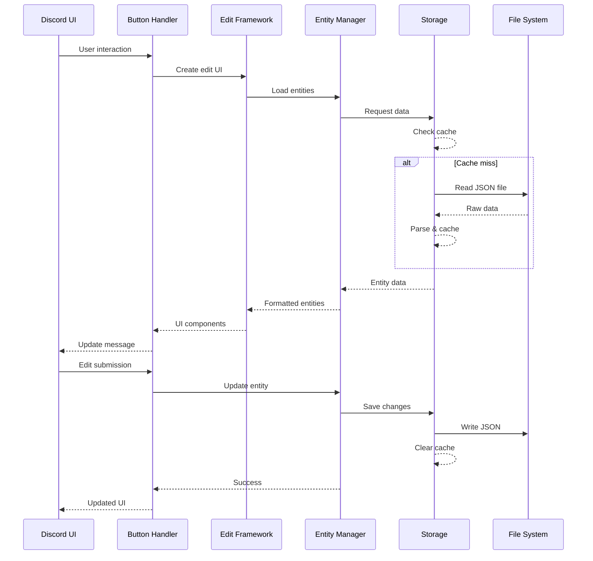

### Season & Application Management

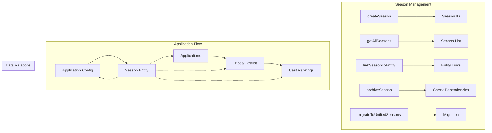

### Cache Management System

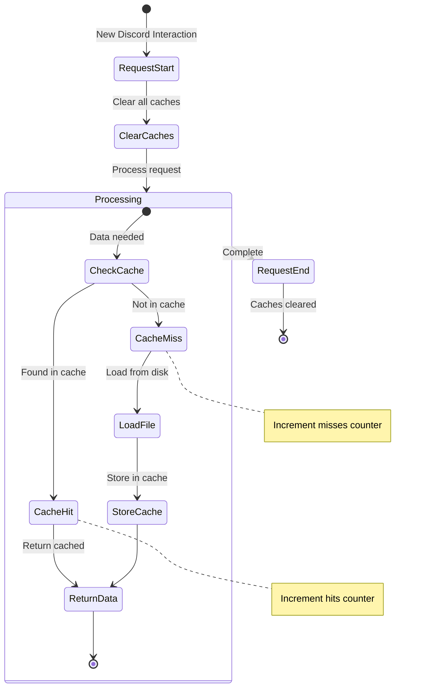

### Data Update Functions by Module

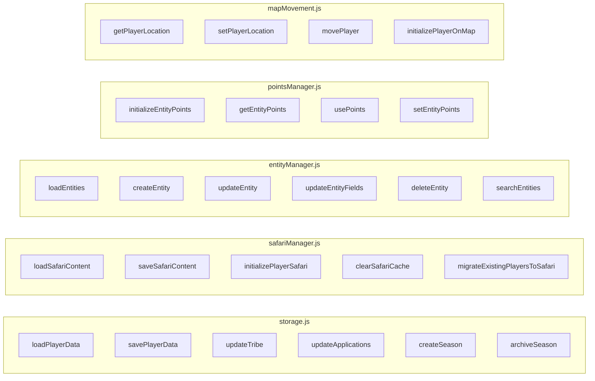

### Data File Structure

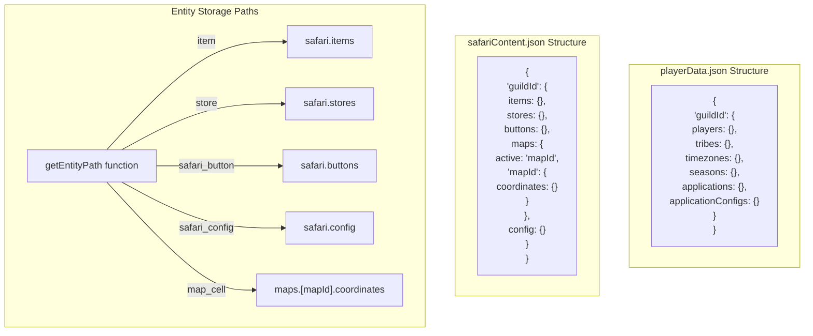

### Edit Framework Configuration

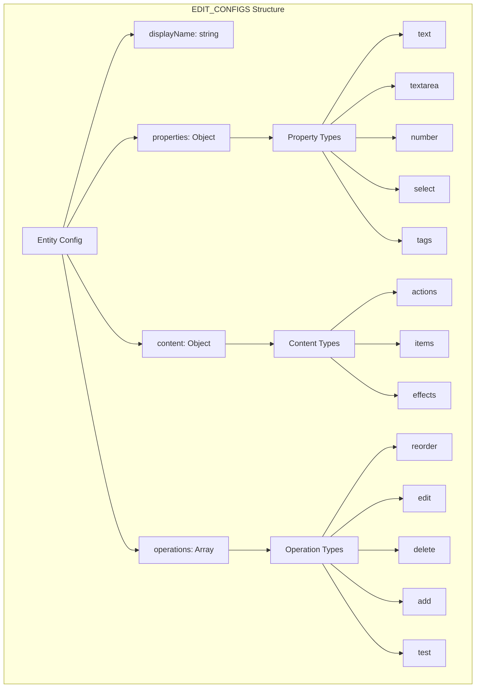

### Button Handler Pattern

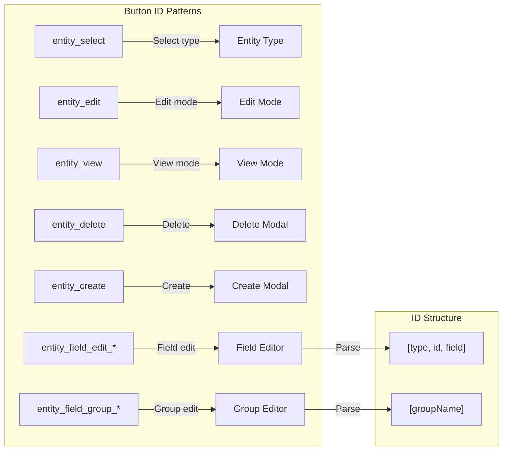

## Key Features

### 1. **Request-Scoped Caching**
- Caches cleared at start of each Discord interaction
- Prevents stale data across requests
- Tracks cache hits/misses for performance monitoring

### 2. **Entity Management**
- Unified CRUD operations for all Safari entities
- Type-specific validation and defaults
- Automatic ID generation and metadata tracking

### 3. **Season Registry**
- Centralized season management
- Links between seasons and entities (apps, tribes, rankings)
- Migration support for legacy data

### 4. **Data Integrity**
- Validation before writes
- Reference cleanup on deletes
- Atomic updates (all or nothing)

### 5. **Search Capabilities**
- Case-insensitive substring search
- Searches multiple fields (name, description, tags)
- Returns filtered entity objects

## Performance Optimizations

1. **Lazy Loading**: Data loaded only when needed
2. **Request Caching**: Same data not read twice per request
3. **Selective Updates**: Only modified fields written
4. **Efficient Search**: In-memory filtering vs. database queries

## Migration Strategies

1. **Safari Migration**: `migrateExistingPlayersToSafari()`
2. **Season Migration**: `migrateToUnifiedSeasons()`
3. **Backwards Compatibility**: Legacy data structures supported