# Placements Feature: Complete Implementation Guide

**Created**: January 2025
**Status**: ✅ Production
**Purpose**: Zero-context reference for understanding the Placements feature end-to-end

---

## 📋 Table of Contents

1. [Overview](#overview)
2. [Critical Patterns & Architectural Changes](#critical-patterns--architectural-changes)
3. [Architecture & Integration](#architecture--integration)
4. [Data Structure](#data-structure)
5. [User Flow](#user-flow)
6. [Implementation Details](#implementation-details)
7. [Button ID Patterns](#button-id-patterns)
8. [Season-Based Namespacing](#season-based-namespacing)
9. [Ordinal Display Logic](#ordinal-display-logic)
10. [Code Locations](#code-locations)
11. [Troubleshooting](#troubleshooting)

---

## Critical Patterns & Architectural Changes

### ⚠️ CRITICAL: Modal Submission Response Pattern (Fixed November 2025)

**Problem**: Original implementation used `DEFERRED_UPDATE_MESSAGE` (type 6) + webhook PATCH pattern for modal submissions, causing "Something went wrong" errors.

**Root Cause**:
- `DEFERRED_UPDATE_MESSAGE` is for button/select clicks, NOT modal submissions
- Modal submit interactions don't have a message to "update" - they're responses to a form
- The webhook token from modal submit can't update `@original` (no original message exists for this interaction)
- See [DiscordInteractionAPI.md](../standards/DiscordInteractionAPI.md) for interaction type specifications

**Correct Pattern**:
```javascript
// ✅ CORRECT: Modal submission response (app.js:30716-30719)
return res.send({
  type: InteractionResponseType.UPDATE_MESSAGE,  // Type 7, not 6!
  data: castlistResponse  // Updates the message with the button that opened the modal
});
```

**Why This Works**:
- Modal submissions CAN use `UPDATE_MESSAGE` to update the message containing the button that opened the modal
- This is a direct response (not deferred), so must complete within 3 seconds
- Smart caching ([CastlistArchitecture.md](../architecture/CastlistArchitecture.md)) ensures operations complete quickly:
  - Cache warm (>80%): 0ms overhead
  - Cache cold (<80%): ~367ms for 578 members (well under 3s limit)

**Previous (Incorrect) Pattern**:
```javascript
// ❌ WRONG: Deferred response + webhook (doesn't work for modals)
await res.send({
  type: InteractionResponseType.DEFERRED_UPDATE_MESSAGE  // Type 6 - wrong!
});
// ... do work ...
await DiscordRequest(`webhooks/.../messages/@original`, { method: 'PATCH' });  // Fails!
```

**Fix Applied**: November 15, 2025 (commit 025a668d)
- Removed deferred response pattern
- Changed to direct `UPDATE_MESSAGE` response
- Simplified error handling (no `res.headersSent` check needed)

### 🔑 Virtual Castlist Entity Handling (November 2025)

**Problem**: "default" castlist is a **virtual entity** that may not exist in `castlistConfigs` until materialized.

**Pattern**:
```javascript
// ✅ CORRECT: Handle undefined castlistEntity (app.js:30616-30617)
const castlistEntity = playerData[guildId]?.castlistConfigs?.[castlistId];
const castlistName = castlistEntity?.name || (castlistId === 'default' ? 'Active Castlist' : castlistId);
```

**Why This Matters**:
- Default castlist exists as tribes with `castlist: 'default'` field
- It only gets a `castlistConfigs` entity when edited via Castlist Hub
- Code must gracefully handle `undefined` entity with fallback names
- See [CastlistArchitecture.md - Virtual Adapter Pattern](../architecture/CastlistArchitecture.md#virtual-adapter-pattern)

**Common Mistake**:
```javascript
// ❌ WRONG: Throws error for virtual castlists
const castlistEntity = playerData[guildId]?.castlistConfigs?.[castlistId];
if (!castlistEntity) {
  throw new Error(`Castlist "${castlistId}" not found`);  // Breaks for default!
}
```

---

## Overview

### What is the Placements Feature?

The Placements feature allows production team members to **edit player placements directly from the castlist view** without leaving the interface. It's designed for alumni castlists (showing past season winners), Hall of Fame displays, and tracking player rankings across seasons.

### Key Characteristics

- **Edit Mode Display**: Replaces player avatar thumbnails with placement edit buttons
- **Modal-Based Editing**: Click button → modal opens → enter placement → saves instantly
- **Global Storage**: Placements are stored per-player, per-season (or globally), NOT per-tribe or per-castlist
- **Ordinal Display**: Shows "1st", "2nd", "14th" on buttons (not raw numbers)
- **Permission-Gated**: Only production team (Manage Roles permission) can edit
- **Zero UI Impact**: View mode unchanged - this feature is invisible to regular users

### Critical Design Decision: Why Season-Based, Not Tribe-Based?

**Placements are tied to SEASONS, not TRIBES or CASTLISTS.**

#### The Problem with Tribe-Based Storage

```javascript
// ❌ WRONG: Tribe-based placement (loses data on tribe changes)
playerData[guildId].tribePlacements[tribeId][playerId] = { placement: 11 };

// Problem scenarios:
// 1. Tribe swap: Player moved from "Korok" → "Hylian" → Placement LOST
// 2. Tribe deletion: Old tribe removed → All placements LOST
// 3. Alumni castlist: Single "Season 13" tribe → Can't distinguish players from different seasons
```

#### The Solution: Season-Based Storage

```javascript
// ✅ CORRECT: Season-based placement (survives tribe changes)
playerData[guildId].placements[seasonId][playerId] = { placement: 11 };

// OR for cross-season castlists (Winners Hall of Fame, etc.):
playerData[guildId].placements['global'][playerId] = { placement: 11 };
```

**Why this works:**

1. **Alumni Castlists**: Single "Season 13" tribe with all 18 past players → Each player's placement preserved
2. **In-Progress Seasons**: Player moves between tribes during swaps → Placement follows the player
3. **Multi-Season Castlists**: "Winners" castlist with champions from 10 seasons → Each has their own placement
4. **Data Integrity**: Deleting a tribe doesn't delete placement data

### Real-World Example

**Scenario**: LOSTvivor Season 1 Alumni Castlist

- **Tribe**: "S1 Alumni" (single Discord role)
- **Players**: 17 players across 3 pages
- **Placements**:
  - Eliot: 1st (Winner)
  - Dave: 6th (Underdog)
  - Alyssa: 11th
  - Geo: 14th (as shown in logs)
  - Clare: 17th
  - Collin: 19th

**Data Structure**:
```json
{
  "1127596863885934652": {
    "placements": {
      "global": {
        "883720052224954368": { "placement": 1, "updatedBy": "...", "updatedAt": "..." },
        "765705051162804264": { "placement": 6, "updatedBy": "...", "updatedAt": "..." },
        "475402113443168256": { "placement": 11, "updatedBy": "...", "updatedAt": "..." },
        "233762709932474370": { "placement": 14, "updatedBy": "...", "updatedAt": "..." },
        "1003727413047480340": { "placement": 17, "updatedBy": "...", "updatedAt": "..." },
        "206564376692523010": { "placement": 19, "updatedBy": "...", "updatedAt": "..." }
      }
    }
  }
}
```

**Key Insight**: All players in this castlist use the `global` namespace because this is a cross-season "winners" type castlist. If it were season-specific, they'd use `season_[seasonId]`.

---

## Architecture & Integration

### How Placements Integrate with Castlists

Placements are **part of the castlist display system**, not a standalone feature. They depend on:

1. **Castlist Display Engine** (`castlistV2.js`) - Renders player cards
2. **Display Modes** - View mode (thumbnails) vs Edit mode (placement buttons)
3. **Navigation State** - Preserves tribe index, page number, and mode across edits
4. **Virtual Adapter** - Resolves castlist IDs (may be legacy names or entity IDs)

### System Flow Diagram

```mermaid
sequenceDiagram
    participant Admin
    participant Hub as Castlist Hub
    participant Display as Castlist Display (castlistV2.js)
    participant EditBtn as Edit Placement Button
    participant Modal as Placement Modal
    participant Save as save_placement_ Handler
    participant Storage as playerData.json

    Admin->>Hub: Click "Tribes & Placements"
    Hub->>Display: show_castlist2_{castlistId}_edit
    Note over Display: displayMode = 'edit'
    Display->>Display: Load placements from namespace
    Display->>Display: createPlayerCard(..., displayMode='edit')
    Display->>EditBtn: Render button with ordinal label
    EditBtn-->>Admin: Show "14th" or "Set Place"

    Admin->>EditBtn: Click edit button
    EditBtn->>Modal: Show modal with current placement
    Modal-->>Admin: Input field pre-filled (if placement exists)

    Admin->>Modal: Enter "14" → Submit
    Modal->>Save: save_placement_{userId}_{namespace}_castlist_{id}_{tribe}_{page}_{mode}
    Save->>Save: Validate input (1-99 or empty)
    Save->>Storage: playerData[guildId].placements[namespace][userId]
    Save->>Storage: { placement: 14, updatedBy, updatedAt }
    Save->>Display: Refresh castlist in edit mode
    Display-->>Admin: Updated button label "14th"
```



### Relationship to Castlist Architecture

From [CastlistArchitecture.md](../architecture/CastlistArchitecture.md), there are **8 entry points** to castlist displays:

| Entry Point | Placements Support | Notes |
|-------------|-------------------|-------|
| `/castlist` Command | ❌ View only | No edit mode |
| `show_castlist2` Handler | ✅ Full support | Edit mode available |
| Castlist Hub | ✅ **Primary access** | "Tribes & Placements" button triggers edit mode |
| `/menu` (Admin) | ✅ Via Hub | Production Menu → Castlist Hub |
| `/menu` (Player) | ❌ View only | Player Menu has no edit permissions |
| `viral_menu` Button | ✅ Via Hub | Returns to Production Menu |
| `prod_player_menu` | ❌ View only | Admin preview of player menu |
| Post Castlist Button | ❌ View only | Direct display, no edit |

**Primary Workflow**: Production Menu → Castlist Hub → Select Castlist → Click "Tribes & Placements" → Edit Mode Display

---

## Data Structure

### Storage Location

**File**: `playerData.json`
**Path**: `playerData[guildId].placements[namespace][playerId]`

### Full Schema

```javascript
{
  "guildId": "1127596863885934652",  // Discord guild (server) ID
  "placements": {
    "global": {  // Namespace for cross-season placements (Winners, All Stars, etc.)
      "playerId_1": {
        "placement": 11,  // INTEGER (1-99), NOT string
        "updatedBy": "391415444084490240",  // Discord user ID of admin who set it
        "updatedAt": "2025-01-29T14:35:10.001Z"  // ISO 8601 timestamp
      },
      "playerId_2": {
        "placement": 14,
        "updatedBy": "391415444084490240",
        "updatedAt": "2025-01-29T14:37:22.456Z"
      }
    },
    "season_abc123def456": {  // Namespace for season-specific placements
      "playerId_3": {
        "placement": 1,  // Winner of Season X
        "updatedBy": "userId",
        "updatedAt": "..."
      }
    }
  }
}
```

### Namespace Strategy

**Two Namespace Types:**

1. **`global`** - For castlists that span multiple seasons or have no season association
   - **Use Cases**: Winners Hall of Fame, All Stars, Multi-Season Alumni
   - **Example**: "Champions Castlist" showing 10 winners from 10 different seasons

2. **`season_{seasonId}`** - For season-specific castlists
   - **Use Cases**: "Season 13 Alumni", "Season 47 Final 5"
   - **Example**: `season_03859e4abc554bb5` for Season 13 placements
   - **Migration Path**: When season system is fully implemented, castlists will have `seasonId` field

### Determining Namespace at Runtime

**Location**: `castlistV2.js:278-279`

```javascript
// Get season identifier from castlist settings
const seasonContext = tribeData?.castlistSettings?.seasonId || 'global';
```

**Logic**:
- If castlist has `seasonId` in settings → Use `season_{seasonId}`
- Otherwise → Use `global` (default for all current castlists)

### Data Type Constraints

| Field | Type | Constraints | Example |
|-------|------|-------------|---------|
| `placement` | Integer | 1-99, required if entry exists | `14` |
| `updatedBy` | String | Discord user ID (snowflake) | `"391415444084490240"` |
| `updatedAt` | String | ISO 8601 timestamp | `"2025-01-29T14:35:10.001Z"` |

**CRITICAL**: Placement is stored as INTEGER, not string!

```javascript
// ❌ WRONG - String storage
playerData[guildId].placements.global[playerId].placement = "14";

// ✅ CORRECT - Integer storage
playerData[guildId].placements.global[playerId].placement = 14;
```

### Multiple Castlists, Same Placement

**Scenario**: Player "Geo" appears in 3 different castlists:
1. "S1 Alumni" (all Season 1 players)
2. "Mid-Game Boots" (players eliminated mid-season)
3. "Gender Minority Players" (subset of players)

**Question**: Does each castlist store a separate placement?

**Answer**: **NO! There is ONE placement per player per namespace.**

```json
{
  "placements": {
    "global": {
      "233762709932474370": { "placement": 14 }
    }
  }
}
```

**All three castlists** will show "14th" for Geo because they all query the same `global` namespace.

**Why This Works**:
- Placements represent **when a player was eliminated from the season**
- A player can only have ONE placement per season
- Multiple castlists are just different views of the same underlying data

**When Would They Differ?**:
- If castlists have different `seasonId` values:
  - "S1 Alumni" → `seasonId: "season_s1"` → Shows placement from `placements.season_s1`
  - "S2 Alumni" → `seasonId: "season_s2"` → Shows placement from `placements.season_s2`
  - "All Winners" → `seasonId: undefined` → Shows placement from `placements.global`

---

## User Flow

### Complete Interaction Sequence

#### Step 1: Enter Edit Mode

**Entry Point**: Castlist Hub

1. Admin opens `/menu` (requires Manage Roles permission)
2. Clicks "Castlist Hub" from Production Menu
3. Selects target castlist from dropdown (e.g., "LOSTvivor S1 Cast")
4. Clicks **"Tribes & Placements"** button (🔥 emoji)

**What Happens**:
- Handler triggers `show_castlist2_{castlistId}_edit` custom_id
- Display mode switches from `view` → `edit`
- Player card accessories change: Thumbnails → Placement buttons

#### Step 2: View Current State

**Visual Change**:

**View Mode** (Before):
```
┌─────────────────────────────┐
│ **Geo (S1 - 14th)**         │  [Avatar Image]
│ They/Them, He/Him           │
└─────────────────────────────┘
```

**Edit Mode** (After):
```
┌─────────────────────────────┐
│ **Geo (S1 - 14th)**         │  [✏️ 14th]
│ They/Them, He/Him           │
└─────────────────────────────┘
```

**Button States**:
- **Has Placement**: Shows ordinal (e.g., "14th", "1st", "22nd")
- **No Placement**: Shows "Set Place"

#### Step 3: Edit Placement

**Action**: Click placement button (e.g., "✏️ 14th")

**Modal Display**:
```
╔═══════════════════════════════════╗
║  Edit Season Placement            ║
╠═══════════════════════════════════╣
║  Placement (1-99)                 ║
║  ┌───────────────────────────┐    ║
║  │ 14                        │    ║  ← Pre-filled with current value
║  └───────────────────────────┘    ║
║  Enter whole number only (1 =     ║
║  Winner, 2 = Runner-up, etc.).    ║
║  Leave blank if still in game.    ║
╠═══════════════════════════════════╣
║            [Submit]               ║
╚═══════════════════════════════════╝
```

**Modal Custom ID**: `save_placement_233762709932474370_global_castlist_1762658874559_1127596863885934652_0_0_edit`

**Breakdown**:
```
save_placement_
  {playerId}_             → 233762709932474370
  {namespace}_            → global
  castlist_{castlistId}_  → castlist_1762658874559_1127596863885934652
  {tribeIndex}_           → 0
  {tribePage}_            → 0
  {displayMode}           → edit
```

#### Step 4: Submit Changes

**Admin Actions**:
- **Option 1**: Enter new placement (e.g., change "14" → "15")
- **Option 2**: Clear field (remove placement, player still in game)
- **Option 3**: Cancel (no changes)

**Validation**:
- Must be integer 1-99
- Empty is allowed (clears placement)
- Leading zeros accepted ("09" → 9)
- Invalid input shows error: "❌ Please enter a whole number (1-99)"

#### Step 5: Data Persistence

**Save Handler** (`app.js:30440-30520`):

```javascript
// Extract value from modal
const placementInput = components[0].component.value?.trim();  // "14"

// Validate format
if (placementInput && !/^\d{1,2}$/.test(placementInput)) {
  return error("❌ Please enter a whole number (1-99)");
}

// Convert to integer
const placementValue = placementInput ? parseInt(placementInput, 10) : null;

// Save or delete
if (placementValue !== null) {
  playerData[guildId].placements[namespace][playerId] = {
    placement: 14,  // INTEGER
    updatedBy: "391415444084490240",
    updatedAt: "2025-01-29T14:35:10.001Z"
  };
} else {
  delete playerData[guildId].placements[namespace][playerId];
}

await savePlayerData(playerData);
```

**Console Output** (from logs):
```
✏️ DEBUG: Placement modal submitted for player 233762709932474370 (namespace: global)
📍 DEBUG: Navigation context: castlist=castlist_1762658874559_1127596863885934652, tribe=0, page=0, mode=edit
✅ Loaded playerData.json (944312 bytes, 101 guilds)
✅ Saved placement 14 to global for player 233762709932474370
✅ Backup created: /opt/bitnami/projects/castbot/playerData.json.backup
✅ Saved playerData.json (944529 bytes, 101 guilds)
```

#### Step 6: Refresh Display

**Automatic Refresh**:
- Handler calls `show_castlist2_{castlistId}_edit` again
- Loads updated placement data from `playerData.json`
- Re-renders player card with new button label
- Preserves navigation state (same tribe, same page, same mode)

**Navigation Preservation** (from logs):
```
📍 Navigation safety check: requested tribe 0, safe tribe 0, allTribes count: 1
Tribe S1 Alumni: 17 players across 3 pages
Page distribution: 6, 6, 5 players
```

**Updated Button**:
```javascript
{
  type: 2,  // Button
  custom_id: "edit_placement_233762709932474370_global_castlist_..._0_0_edit",
  label: "14th",  // ← Updated from modal input
  style: 2,
  emoji: { name: "✏️" }
}
```

---

## Implementation Details

### File Structure Overview

```
castbot/
├── app.js                      # Main handlers (edit_placement_, save_placement_)
├── castlistV2.js              # Display engine, button creation, ordinal logic
├── castlistSorter.js          # Placement-based sorting algorithm
├── castlistHub.js             # "Tribes & Placements" button
├── castlistHandlers.js        # castlist_placements_ handler
├── storage.js                 # loadPlayerData(), savePlayerData()
└── playerData.json            # Placement data storage
```

### Handler Breakdown

#### 1. `castlist_placements_` Handler

**Location**: `castlistHandlers.js` (implied from feature docs)

**Purpose**: Triggered when admin clicks "Tribes & Placements" button in Castlist Hub

**Flow**:
```javascript
else if (custom_id.startsWith('castlist_placements_')) {
  const castlistId = custom_id.replace('castlist_placements_', '');

  // Permission check
  if (!hasAdminPermissions(member)) {
    return ephemeralError("Production permissions required");
  }

  // Trigger edit mode display
  const editCustomId = `show_castlist2_${castlistId}_edit`;
  req.body.data.custom_id = editCustomId;
  // Continue to show_castlist2 handler...
}
```

#### 2. `edit_placement_` Handler (Button Click)

**Location**: `app.js:8516-8566`

**Purpose**: Shows modal when admin clicks edit button on player card

**Custom ID Pattern**:
```
edit_placement_{playerId}_{seasonContext}_{castlistId}_{tribeIndex}_{tribePage}_{displayMode}
```

**Parsing Logic** (handles underscores in castlistId AND seasonContext):

```javascript
const parts = custom_id.split('_');

// Work backwards from the end (these are always single parts)
const displayMode = parts[parts.length - 1];      // 'edit'
const tribePage = parts[parts.length - 2];        // '0'
const tribeIndex = parts[parts.length - 3];       // '0'

// Find castlist by searching for "castlist_" pattern
let castlistIdStartIdx = -1;
for (let i = parts.length - 4; i >= 3; i--) {
  if (parts[i] === 'castlist') {
    castlistIdStartIdx = i;
    break;
  } else if (parts[i] === 'default' && i === parts.length - 4) {
    castlistIdStartIdx = i;  // Special case for 'default' castlist
    break;
  }
}

const playerId = parts[2];  // Always at index 2

// Handle both formats
if (parts[castlistIdStartIdx] === 'default') {
  castlistId = 'default';
  seasonContext = parts.slice(3, castlistIdStartIdx).join('_') || 'global';
} else {
  seasonContext = parts.slice(3, castlistIdStartIdx).join('_') || 'global';
  castlistId = parts.slice(castlistIdStartIdx, parts.length - 3).join('_');
}
```

**Why This Parsing is Necessary**:
- **castlistId** can contain underscores: `castlist_1762658874559_1127596863885934652`
- **seasonContext** can contain underscores: `season_03859e4abc554bb5` or just `global`
- **Simple split('_')** doesn't work - need position-based extraction

**Handler Logic** (Button Factory pattern):

```javascript
return ButtonHandlerFactory.create({
  id: 'edit_placement',
  handler: async (context) => {
    const { guildId, client } = context;

    // Load current placement from correct namespace
    const { loadPlayerData } = await import('./storage.js');
    const playerData = await loadPlayerData();
    const placement = playerData[guildId]?.placements?.[seasonContext]?.[playerId]?.placement;

    // Create modal with pre-filled value
    const modal = {
      custom_id: `save_placement_${playerId}_${seasonContext}_${castlistId}_${tribeIndex}_${tribePage}_${displayMode}`,
      title: "Edit Season Placement",
      components: [
        {
          type: 18,  // Label (Components V2)
          label: "Placement (1-99)",
          description: "Enter whole number only (1 = Winner, 2 = Runner-up, etc.). Leave blank if still in game.",
          component: {
            type: 4,  // Text Input
            custom_id: "placement",
            value: placement ? placement.toString() : "",  // Pre-fill if exists
            placeholder: "e.g., 1, 2, 24",
            max_length: 2,
            required: false  // Allow clearing
          }
        }
      ]
    };

    return {
      type: InteractionResponseType.MODAL,
      data: modal
    };
  }
})(req, res, client);
```

**Modal Components V2 Structure**:

```javascript
{
  type: 18,  // Label (NEW type, replaces ActionRow + TextInput pattern)
  label: "Placement (1-99)",
  description: "Instructions...",
  component: {
    type: 4,  // Text Input
    custom_id: "placement",
    value: "14",  // ← Pre-filled from playerData
    placeholder: "e.g., 1, 2, 24",
    max_length: 2,
    required: false
  }
}
```

**Key Insight**: Using Label (type 18) instead of deprecated ActionRow + TextInput pattern for modals.

#### 3. `save_placement_` Handler (Modal Submit)

**Location**: `app.js:30440-30520`

**Purpose**: Saves placement data and refreshes display

**Custom ID Pattern**: Same as modal custom_id
```
save_placement_{playerId}_{seasonContext}_castlist_{castlistId}_{tribeIndex}_{tribePage}_{displayMode}
```

**Parsing Logic**: Similar to edit_placement_ (works backwards from known positions)

**Validation**:

```javascript
const placementInput = components[0].component.value?.trim();

// Must be 1-99 or empty
if (placementInput && !/^\d{1,2}$/.test(placementInput)) {
  return res.send({
    type: InteractionResponseType.CHANNEL_MESSAGE_WITH_SOURCE,
    data: {
      content: '❌ Please enter a whole number (1-99)',
      flags: InteractionResponseFlags.EPHEMERAL
    }
  });
}
```

**Save Logic**:

```javascript
const placementValue = placementInput ? parseInt(placementInput, 10) : null;

const { loadPlayerData, savePlayerData } = await import('./storage.js');
const playerData = await loadPlayerData();

// Initialize structure
if (!playerData[guildId].placements) {
  playerData[guildId].placements = {};
}
if (!playerData[guildId].placements[seasonContext]) {
  playerData[guildId].placements[seasonContext] = {};
}

// Save or delete
if (placementValue !== null) {
  playerData[guildId].placements[seasonContext][playerId] = {
    placement: placementValue,  // INTEGER
    updatedBy: userId,
    updatedAt: new Date().toISOString()
  };
  console.log(`✅ Saved placement ${placementValue} to ${seasonContext} for player ${playerId}`);
} else {
  delete playerData[guildId].placements[seasonContext][playerId];
  console.log(`🗑️ Cleared placement from ${seasonContext} for player ${playerId}`);
}

await savePlayerData(playerData);
```

**Refresh Display**:

```javascript
// Reconstruct show_castlist2 custom_id with edit mode
const refreshCustomId = `show_castlist2_${castlistId}_edit`;

// Trigger full castlist refresh (will reload placement data)
// This maintains navigation state (tribe index, page, mode)
// Handler continues to show_castlist2 logic...
```

### Display Engine Integration

#### Loading Placements for Edit Mode

**Location**: `castlistV2.js:~700-720` (buildCastlist2ResponseData function)

**Logic**:

```javascript
// Determine namespace from castlist settings
const seasonContext = tribeData?.castlistSettings?.seasonId || 'global';

// Load all placements for this namespace
let allPlacements = {};
if (displayMode === 'edit') {
  const placementsForNamespace = playerData[guildId]?.placements?.[seasonContext] || {};
  allPlacements = placementsForNamespace;

  console.log(`[PLACEMENT UI] Loading placements from namespace: ${seasonContext} (${Object.keys(allPlacements).length} placements found)`);
}
```

**Why Pre-Load?**:
- Performance: Load once for entire tribe, not per-player
- Consistency: All players see placements from same namespace
- Debugging: Single log line shows how many placements loaded

#### Creating Edit Buttons

**Location**: `castlistV2.js:192-292` (createPlayerCard function)

**Parameters**:
```javascript
function createPlayerCard(
  member,           // Discord.js Member object
  playerData,       // CastBot player data (age, pronouns, etc.)
  pronouns,
  timezone,
  formattedTime,
  showEmoji,
  displayMode,      // 'view' or 'edit'
  tribeData,        // Tribe metadata (castlist settings)
  guildId,          // Discord guild ID
  allPlacements,    // Pre-loaded placements for namespace
  castlistId,       // Castlist entity ID or legacy name
  navigationState   // { currentTribeIndex, currentTribePage }
)
```

**Edit Mode Button Creation**:

```javascript
if (displayMode === 'edit') {
  // Get placement from pre-loaded data
  const placement = allPlacements[member.user.id]?.placement;

  // Helper function for ordinal suffixes
  const getOrdinalLabel = (placement) => {
    if (!placement) return "Set Place";

    const num = typeof placement === 'number' ? placement : parseInt(placement);
    if (isNaN(num)) return "Set Place";

    // Handle special cases 11-13
    if (num % 100 >= 11 && num % 100 <= 13) {
      return `${num}th`;
    }

    // Standard ordinal rules
    switch (num % 10) {
      case 1: return `${num}st`;
      case 2: return `${num}nd`;
      case 3: return `${num}rd`;
      default: return `${num}th`;
    }
  };

  // Get season identifier for button context
  const seasonContext = tribeData?.castlistSettings?.seasonId || 'global';

  // Encode full navigation state
  const tribeIndex = navigationState?.currentTribeIndex ?? 0;
  const tribePage = navigationState?.currentTribePage ?? 0;

  accessory = {
    type: 2,  // Button
    custom_id: `edit_placement_${member.user.id}_${seasonContext}_${castlistId}_${tribeIndex}_${tribePage}_${displayMode}`,
    label: getOrdinalLabel(placement),
    style: 2,  // Secondary
    emoji: { name: "✏️" }
  };
} else {
  // View mode - create thumbnail
  accessory = {
    type: 11,  // Thumbnail
    media: {
      url: member.user.displayAvatarURL({ size: 128, extension: 'png' })
    },
    description: `${displayName}'s avatar`
  };
}
```

**Section Component** (player card container):

```javascript
return {
  type: 9,  // Section
  components: [
    {
      type: 10,  // TextDisplay
      content: `**${displayName}**\n${basicInfo}`
    }
  ],
  accessory: accessory  // ← Button (edit) or Thumbnail (view)
};
```

**From Logs** (actual component structure):

```json
{
  "type": 9,
  "components": [
    {
      "type": 10,
      "content": "**Geo (S1 - 14th)**\nThey/Them, He/Him"
    }
  ],
  "accessory": {
    "type": 2,
    "custom_id": "edit_placement_233762709932474370_global_castlist_1762658874559_1127596863885934652_0_0_edit",
    "label": "14th",
    "style": 2,
    "emoji": { "name": "✏️" }
  }
}
```

---

## Button ID Patterns

### Pattern Overview

All placement-related buttons encode **full navigation context** to preserve state across interactions.

### Edit Placement Button

**Pattern**:
```
edit_placement_{playerId}_{seasonContext}_{castlistId}_{tribeIndex}_{tribePage}_{displayMode}
```

**Example 1**: Global namespace, entity castlist
```
edit_placement_233762709932474370_global_castlist_1762658874559_1127596863885934652_0_0_edit
│              │                    │      │                                            │ │ │
│              │                    │      │                                            │ │ └─ displayMode: 'edit'
│              │                    │      │                                            │ └─── tribePage: 0
│              │                    │      │                                            └───── tribeIndex: 0
│              │                    │      └──────────────────────────────────────────────── castlistId
│              │                    └───────────────────────────────────────────────────── castlist marker
│              └──────────────────────────────────────────────────────────────────────── seasonContext: 'global'
└─────────────────────────────────────────────────────────────────────────────────────── playerId (Discord user ID)
```

**Example 2**: Season namespace, default castlist
```
edit_placement_883720052224954368_season_abc123_default_2_1_edit
│              │                    │             │       │ │ │
│              │                    │             │       │ │ └─ displayMode: 'edit'
│              │                    │             │       │ └─── tribePage: 1
│              │                    │             │       └───── tribeIndex: 2
│              │                    │             └───────────── castlistId: 'default'
│              │                    └─────────────────────────── seasonContext: 'season_abc123'
│              └──────────────────────────────────────────────── playerId
└─────────────────────────────────────────────────────────────── prefix
```

**Parsing Challenges**:
- **Underscores in castlistId**: `castlist_1762658874559_1127596863885934652` (3 underscores!)
- **Underscores in seasonContext**: `season_03859e4abc554bb5` (1 underscore)
- **Default castlist**: No "castlist_" prefix, just `default`

**Solution**: Work backwards from known positions:
1. Last part is always `displayMode`
2. Second-to-last is always `tribePage`
3. Third-to-last is always `tribeIndex`
4. Search backwards for "castlist" marker or "default"
5. Everything between playerId and castlist marker is `seasonContext`
6. Everything from castlist marker to navigation params is `castlistId`

### Save Placement Modal

**Pattern**: Identical to edit button (preserves all navigation context)
```
save_placement_{playerId}_{seasonContext}_castlist_{castlistId}_{tribeIndex}_{tribePage}_{displayMode}
```

**Why Identical?**:
- Modal submit handler needs same context as button click
- After saving, handler refreshes display at exact same position (tribe, page, mode)
- No information loss during round-trip (button → modal → save → refresh)

### Tribes & Placements Button

**Pattern**:
```
castlist_placements_{castlistId}
```

**Example**:
```
castlist_placements_castlist_1762658874559_1127596863885934652
```

**Purpose**: Simpler pattern since it only needs to know which castlist to open in edit mode.

---

## Season-Based Namespacing

### Current Implementation: `global` Namespace

**Default Behavior** (as of January 2025):
- All placements stored in `global` namespace
- Reason: Season system not yet fully implemented
- `tribeData?.castlistSettings?.seasonId` returns `undefined` for all castlists
- Falls back to `'global'`

**Code**:
```javascript
const seasonContext = tribeData?.castlistSettings?.seasonId || 'global';
```

### Future Implementation: Per-Season Placements

**Migration Path**:

#### Phase 1: Add seasonId to Castlist Configs

```javascript
// castlistConfigs entity
{
  "id": "castlist_alumni_s13",
  "name": "Season 13 Alumni",
  "seasonId": "season_03859e4abc554bb5",  // ← NEW FIELD
  "settings": {
    "sortStrategy": "placements"
  }
}
```

#### Phase 2: Placements Migrate Automatically

**Before** (all in global):
```json
{
  "placements": {
    "global": {
      "player1": { "placement": 1 },
      "player2": { "placement": 14 }
    }
  }
}
```

**After** (separated by season):
```json
{
  "placements": {
    "global": {
      "playerX": { "placement": 1 }  // Still used for cross-season castlists
    },
    "season_03859e4abc554bb5": {
      "player1": { "placement": 1 },  // S13 winner
      "player2": { "placement": 14 }   // S13 14th place
    },
    "season_def789ghi012": {
      "player3": { "placement": 1 }   // S14 winner
    }
  }
}
```

**No Code Changes Needed**:
- `seasonContext` automatically uses castlist's `seasonId`
- Edit buttons encode correct namespace
- Save handler stores to correct namespace
- Display loads from correct namespace

#### Phase 3: Multi-Season Castlist Example

**Scenario**: "Winners Hall of Fame" castlist showing champions from 10 seasons

**Castlist Config**:
```javascript
{
  "id": "castlist_winners_hof",
  "name": "Winners Hall of Fame",
  "seasonId": undefined,  // ← No season (multi-season castlist)
  "settings": {
    "sortStrategy": "placements"
  }
}
```

**Player Data**:
```javascript
// Each player's placement stored in THEIR season
{
  "placements": {
    "season_s01": { "eliot": { "placement": 1 } },
    "season_s02": { "jane": { "placement": 1 } },
    "season_s03": { "bob": { "placement": 1 } },
    // ... 7 more seasons
  }
}
```

**Problem**: How to display when namespace is `global` but placements are in season-specific namespaces?

**Solution**: Two approaches:

1. **Approach A**: Copy placements to `global` namespace when adding to multi-season castlist
   ```javascript
   // When admin adds "Eliot" to Winners HOF castlist
   playerData[guildId].placements.global["eliot"] =
     playerData[guildId].placements.season_s01["eliot"];
   ```

2. **Approach B**: Store season reference in player metadata
   ```javascript
   {
     "placements": {
       "global": {
         "eliot": {
           "placement": 1,
           "sourceSeasonId": "season_s01"  // Track where placement came from
         }
       }
     }
   }
   ```

**Recommendation**: Approach B (preserves data lineage, enables "click to view season" features)

---

## Ordinal Display Logic

### The getOrdinalLabel Function

**Location**: `castlistV2.js:258-276`

**Purpose**: Convert integer placement (14) to ordinal string ("14th")

**Full Implementation**:

```javascript
const getOrdinalLabel = (placement) => {
  if (!placement) return "Set Place";

  const num = typeof placement === 'number' ? placement : parseInt(placement);
  if (isNaN(num)) return "Set Place";

  // Handle special cases 11-13 (11th, 12th, 13th NOT 11st, 12nd, 13rd)
  if (num % 100 >= 11 && num % 100 <= 13) {
    return `${num}th`;
  }

  // Standard ordinal rules
  switch (num % 10) {
    case 1: return `${num}st`;   // 1st, 21st, 31st, 41st, etc.
    case 2: return `${num}nd`;   // 2nd, 22nd, 32nd, 42nd, etc.
    case 3: return `${num}rd`;   // 3rd, 23rd, 33rd, 43rd, etc.
    default: return `${num}th`;  // 4th-10th, 14th-20th, 24th-30th, etc.
  }
};
```

### Edge Cases Handled

| Input | Output | Rule Applied |
|-------|--------|--------------|
| `null` | `"Set Place"` | No placement exists |
| `undefined` | `"Set Place"` | No placement exists |
| `1` | `"1st"` | num % 10 === 1 |
| `2` | `"2nd"` | num % 10 === 2 |
| `3` | `"3rd"` | num % 10 === 3 |
| `4` | `"4th"` | num % 10 === 4 (default) |
| `10` | `"10th"` | num % 10 === 0 (default) |
| `11` | `"11th"` | ⚠️ num % 100 >= 11 && <= 13 (special) |
| `12` | `"12th"` | ⚠️ num % 100 >= 11 && <= 13 (special) |
| `13` | `"13th"` | ⚠️ num % 100 >= 11 && <= 13 (special) |
| `14` | `"14th"` | num % 10 === 4 (default) |
| `21` | `"21st"` | num % 10 === 1 |
| `22` | `"22nd"` | num % 10 === 2 |
| `111` | `"111th"` | ⚠️ num % 100 >= 11 && <= 13 (special) |

### Why the Special 11-13 Rule?

**English Language Exception**:
- Most numbers follow pattern: 1st, 2nd, 3rd, 4th-10th
- But "eleven", "twelve", "thirteen" are irregular
- ❌ WRONG: "11st", "12nd", "13rd"
- ✅ CORRECT: "11th", "12th", "13th"

**Mathematical Rule**:
```javascript
// For numbers ending in 11, 12, 13 (any century)
if (num % 100 >= 11 && num % 100 <= 13) {
  return `${num}th`;  // Always 'th', never 'st', 'nd', 'rd'
}
```

**Examples**:
- 11, 111, 211, 311 → All end in "th"
- 12, 112, 212, 312 → All end in "th"
- 13, 113, 213, 313 → All end in "th"

### Usage in Display

**Placement Sorting** (`castlistSorter.js:104-121`):

```javascript
// Add ordinal prefix to display name
const num = parseInt(placementData.placement);
let ordinal;

if (num % 100 >= 11 && num % 100 <= 13) {
  ordinal = `${num}th`;
} else {
  switch (num % 10) {
    case 1: ordinal = `${num}st`; break;
    case 2: ordinal = `${num}nd`; break;
    case 3: ordinal = `${num}rd`; break;
    default: ordinal = `${num}th`;
  }
}

member.displayPrefix = `\`${ordinal}\` `;  // e.g., "`5th` "
```

**Result** (in player card):
```
**`14th` Geo (S1 - 14th)**
They/Them, He/Him
```

---

## Code Locations

### Primary Implementation Files

| File | Lines | Function | Purpose | Notes |
|------|-------|----------|---------|-------|
| **app.js** | 8516-8566 | `edit_placement_` handler | Shows modal when edit button clicked | ButtonHandlerFactory pattern |
| **app.js** | 30485-30742 | `save_placement_` handler | Saves modal data to playerData.json | ✅ Updated Nov 2025: Direct UPDATE_MESSAGE |
| **app.js** | 30614-30617 | Virtual castlist handling | Handles undefined castlistEntity | ✅ Added Nov 2025 |
| **app.js** | 30716-30719 | UPDATE_MESSAGE response | Direct modal response (type 7) | ✅ Fixed Nov 2025: Was webhook PATCH |
| **castlistV2.js** | 192-292 | `createPlayerCard()` | Creates player section with edit button or thumbnail | Components V2 Section |
| **castlistV2.js** | 258-276 | `getOrdinalLabel()` | Converts integer to ordinal string ("14th") | Handles 11th/12th/13th edge case |
| **castlistV2.js** | 278-292 | Button creation logic | Builds edit_placement_ custom_id | Encodes full navigation state |
| **castlistV2.js** | ~700-720 | Placement loading | Pre-loads all placements for namespace | Loads once per tribe for performance |
| **castlistSorter.js** | 80-145 | `sortByPlacements()` | Alumni placement sorting (active first, then ranked) | Uses namespace for data access |
| **castlistHub.js** | ~320 | "Tribes & Placements" button | Triggers edit mode | `show_castlist2_{id}_edit` pattern |
| **castlistHandlers.js** | TBD | `castlist_placements_` handler | Activates edit mode display | Permission check + mode switch |
| **storage.js** | N/A | `loadPlayerData()`, `savePlayerData()` | Data persistence | **CRITICAL**: Always `await`! |

### Data Storage

| File | Path | Content |
|------|------|---------|
| **playerData.json** | `[guildId].placements[namespace][playerId]` | Placement data with metadata |
| **playerData.json.backup** | Same | Auto-created backup before every save |

### Button Registry

**Location**: `buttonHandlerFactory.js:TBD`

```javascript
BUTTON_REGISTRY = {
  'edit_placement': {
    label: 'Edit Placement',
    description: 'Edit player placement/ranking',
    emoji: '✏️',
    style: 'Secondary',
    category: 'castlist_management',
    parent: 'castlist_placements'
  },
  'castlist_placements': {
    label: 'Tribes & Placements',
    description: 'Edit player placements in castlist',
    emoji: '🔥',
    style: 'Primary',
    category: 'castlist_management',
    parent: 'castlist_hub'
  }
}
```

---

## Troubleshooting

### Common Issues

#### Issue 0: "Something went wrong" Error on Modal Submit (CRITICAL - Fixed Nov 2025)

**Symptoms**:
- User enters placement value in modal and clicks Submit
- Discord shows "Something went wrong. Try again." error message
- Logs show placement saved successfully (`✅ Saved placement X to global for player...`)
- Logs show `⏰ DEBUG: Webhook interaction failed ... likely expired or invalid token`

**Root Cause**: Using wrong interaction response type for modal submissions

**Technical Details**:
- Original code used `DEFERRED_UPDATE_MESSAGE` (type 6) + webhook PATCH pattern
- `DEFERRED_UPDATE_MESSAGE` is ONLY for button/select clicks, NOT modal submissions
- Modal submit tokens can't update `@original` message (no original message exists for modal interaction)
- See [Critical Patterns](#critical-patterns--architectural-changes) section for full explanation

**Fix**:
```javascript
// ✅ CORRECT: Direct UPDATE_MESSAGE response
return res.send({
  type: InteractionResponseType.UPDATE_MESSAGE,  // Type 7
  data: castlistResponse
});
```

**Status**: ✅ **FIXED** in commit 025a668d (November 15, 2025)

**Prevention**: Always use `UPDATE_MESSAGE` (type 7) for modal submissions that need to update the original message. Never use `DEFERRED_UPDATE_MESSAGE` or webhook PATCH for modals.

#### Issue 1: Button Shows "Set Place" but Placement Exists

**Symptoms**:
- Placement saved to database (confirmed in playerData.json)
- Edit button shows "Set Place" instead of "14th"
- Other players in same castlist show correct placements

**Root Cause**: Namespace mismatch

**Diagnosis**:

```javascript
// Check what's in the database
console.log(playerData[guildId].placements);

// Expected:
{
  "global": {
    "233762709932474370": { "placement": 14 }
  }
}

// Check what namespace is being queried
console.log(`[PLACEMENT DEBUG] seasonId from castlistSettings: ${tribeData?.castlistSettings?.seasonId}`);

// If seasonId is defined but placement is in 'global', this is the mismatch
```

**Fix**:
1. Move placement to correct namespace:
   ```javascript
   // Copy from global to season namespace
   playerData[guildId].placements[`season_${seasonId}`][playerId] =
     playerData[guildId].placements.global[playerId];
   ```
2. OR update castlist settings to remove seasonId:
   ```javascript
   delete playerData[guildId].castlistConfigs[castlistId].settings.seasonId;
   ```

#### Issue 2: Modal Shows Empty Value Despite Placement Existing

**Symptoms**:
- Click "14th" button
- Modal opens with empty input field
- Expected: Input field pre-filled with "14"

**Root Cause**: Placement stored as string, not integer

**Diagnosis**:

```javascript
// Check type
const placement = playerData[guildId].placements.global[playerId].placement;
console.log(`Type: ${typeof placement}, Value: ${placement}`);

// ❌ BAD: Type: string, Value: "14"
// ✅ GOOD: Type: number, Value: 14
```

**Fix**:

```javascript
// Migrate all string placements to integers
const placements = playerData[guildId].placements.global;
for (const playerId in placements) {
  if (typeof placements[playerId].placement === 'string') {
    placements[playerId].placement = parseInt(placements[playerId].placement, 10);
  }
}
await savePlayerData(playerData);
```

#### Issue 3: Navigation Lost After Save (Returns to Different Tribe/Page)

**Symptoms**:
- Edit placement on Tribe 2, Page 2
- Save placement
- Display refreshes to Tribe 1, Page 1

**Root Cause**: Navigation context not encoded in custom_id

**Diagnosis**:

```javascript
// Check modal custom_id format
console.log(custom_id);

// ❌ BAD: save_placement_233762709932474370_global_castlist_1762658874559_1127596863885934652
// ✅ GOOD: save_placement_233762709932474370_global_castlist_1762658874559_1127596863885934652_2_2_edit
//                                                                                                  │ │ │
//                                                                                    tribeIndex ───┘ │ │
//                                                                                      tribePage ─────┘ │
//                                                                                    displayMode ───────┘
```

**Fix**: Ensure edit button encodes navigation state:

```javascript
const tribeIndex = navigationState?.currentTribeIndex ?? 0;
const tribePage = navigationState?.currentTribePage ?? 0;

const customId = `edit_placement_${playerId}_${seasonContext}_${castlistId}_${tribeIndex}_${tribePage}_${displayMode}`;
```

#### Issue 4: Placement Sort Not Working

**Symptoms**:
- Castlist settings: `sortStrategy: "placements"`
- Players not sorted by placement (shows alphabetical instead)
- Placements exist in database

**Root Cause**: Alumni placement sorting requires namespace parameter

**Diagnosis**:

```javascript
// Check if sortByPlacements is receiving namespace
console.log('[PLACEMENT SORT] Namespace:', seasonContext);
console.log('[PLACEMENT SORT] Placements loaded:', Object.keys(allPlacements).length);

// If namespace is undefined or placements is empty, sort falls back to alphabetical
```

**Fix**:

```javascript
// In buildCastlist2ResponseData
const seasonContext = tribeData?.castlistSettings?.seasonId || 'global';
const placementsForNamespace = playerData[guildId]?.placements?.[seasonContext] || {};

// Pass to sorter
sortedMembers = sortByPlacements(members, placementsForNamespace);
```

#### Issue 5: "Invalid button ID format" Error

**Symptoms**:
```
❌ Could not find 'castlist' or 'default' in button ID: edit_placement_...
Error: Invalid button ID format - missing castlist identifier
```

**Root Cause**: Custom_id parsing failed (castlist marker not found)

**Diagnosis**:

```javascript
// Log the full custom_id
console.log('Parsing custom_id:', custom_id);

// Example problematic ID:
// edit_placement_123_global_mycastlist_0_0_edit
//                           └─ Missing "castlist_" prefix!

// Parser searches for "castlist" literal, doesn't find it
```

**Fix**: Ensure castlistId is passed correctly:

```javascript
// ❌ WRONG: Using legacy name directly
const customId = `edit_placement_${playerId}_${namespace}_${castlistName}_${idx}_${page}_${mode}`;

// ✅ CORRECT: Prefix entity IDs with "castlist_" OR handle "default" specially
const castlistPrefix = (castlistId === 'default') ? '' : 'castlist_';
const customId = `edit_placement_${playerId}_${namespace}_${castlistPrefix}${castlistId}_${idx}_${page}_${mode}`;
```

### Debugging Commands

```bash
# Check placement data structure
grep -A10 '"placements"' playerData.json

# Find all placement edit handlers
grep -n "edit_placement_\|save_placement_" app.js

# Check button creation logic
grep -n "getOrdinalLabel\|displayMode === 'edit'" castlistV2.js

# Monitor placement saves in real-time
tail -f /tmp/castbot-dev.log | grep "PLACEMENT\|Saved placement"

# Count total placements across all namespaces
jq '[.[] | .placements // {} | to_entries[] | .value | length] | add' playerData.json
```

### Log Patterns

**Normal Operation**:
```
✏️ DEBUG: Placement modal submitted for player 233762709932474370 (namespace: global)
📍 DEBUG: Navigation context: castlist=castlist_1762658874559_1127596863885934652, tribe=0, page=0, mode=edit
✅ Loaded playerData.json (944312 bytes, 101 guilds)
✅ Saved placement 14 to global for player 233762709932474370
✅ Backup created: /opt/bitnami/projects/castbot/playerData.json.backup
✅ Saved playerData.json (944529 bytes, 101 guilds)
🔄 Refreshing castlist with updated placement
[PLACEMENT UI] Loading placements from namespace: global (1 placements found)
```

**Error Patterns**:
```
❌ Could not find 'castlist' in modal ID: save_placement_...
❌ Please enter a whole number (1-99)
⚠️ Placement data missing for namespace: season_abc123
```

---

## Future Enhancements

### Planned Features

1. **Display Placements in View Mode**
   - Show ordinal prefix in player names: "`1st` Eliot"
   - Only for castlists with `sortStrategy: 'placements'`
   - Requires minimal changes to createPlayerCard()

2. **Bulk Placement Operations**
   - "Clear All Placements" button in Castlist Hub
   - Import placements from CSV file
   - Copy placements between namespaces (global → season_X)

3. **Placement History Tracking**
   - Audit log of placement changes
   - Show "Last updated by X on Y" in modal
   - Undo/redo functionality

4. **Season System Integration**
   - Auto-create season namespaces when new season starts
   - Migrate placements from active → season namespace on season end
   - Season selector in Castlist Hub

5. **Placement Analytics**
   - "View Season Stats" button showing placement distribution
   - Average placement by player across seasons
   - Tribe performance analysis (which tribe had best avg placement)

### Migration Path to Full Season Support

**Phase 1**: Add seasonId to castlist settings (DONE in concept)
**Phase 2**: Update placement loading to check seasonId (DONE)
**Phase 3**: Create season management UI (IN PROGRESS)
**Phase 4**: Auto-migration of global → season placements (NOT STARTED)
**Phase 5**: Multi-season analytics dashboard (FUTURE)

---

## Summary

### Key Takeaways for Zero-Context Understanding

1. **Placements are season-scoped, not tribe-scoped**
   - One placement per player per season (or globally)
   - Multiple castlists can show same placement
   - Survives tribe changes and deletions

2. **Edit mode is separate from view mode**
   - Same castlist, different display (thumbnails vs buttons)
   - Triggered by "Tribes & Placements" button in Castlist Hub
   - Only accessible to production team (Manage Roles permission)

3. **Navigation context is preserved**
   - Button custom_ids encode tribe index, page, mode
   - Modal submission refreshes exact same view
   - User never loses their place in the castlist

4. **Data structure is forward-compatible**
   - Current: All placements in `global` namespace
   - Future: Separate namespace per season (`season_{seasonId}`)
   - Migration requires zero code changes (already built in)

5. **Ordinal display logic handles edge cases**
   - Special handling for 11th, 12th, 13th (not 11st, 12nd, 13rd)
   - Consistent display across edit buttons and sorted castlists
   - "Set Place" for players with no placement

### Critical Files to Understand

- **app.js:8516-8566** - Edit button handler (shows modal)
- **app.js:30440-30520** - Save handler (persists data)
- **castlistV2.js:192-292** - Player card creation (edit button vs thumbnail)
- **castlistV2.js:258-276** - Ordinal conversion (14 → "14th")
- **playerData.json** - Data storage (`placements[namespace][playerId]`)

### Button ID Quick Reference

```
edit_placement_{playerId}_{seasonContext}_castlist_{castlistId}_{tribeIndex}_{tribePage}_{displayMode}
save_placement_{playerId}_{seasonContext}_castlist_{castlistId}_{tribeIndex}_{tribePage}_{displayMode}
castlist_placements_{castlistId}
```

### Data Structure Quick Reference

```json
{
  "guildId": {
    "placements": {
      "global": {
        "playerId": {
          "placement": 14,
          "updatedBy": "userId",
          "updatedAt": "2025-01-29T14:35:10.001Z"
        }
      },
      "season_{seasonId}": {
        "playerId": { ... }
      }
    }
  }
}
```

---

**Created**: January 2025
**Last Updated**: November 15, 2025 (Modal submission fix + Virtual castlist handling)
**Author**: Reece (extremedonkey)

**Change Log**:
- **Nov 15, 2025**: Fixed modal submission pattern (DEFERRED_UPDATE_MESSAGE → UPDATE_MESSAGE), Added virtual castlist entity handling
- **Jan 2025**: Initial comprehensive documentation

**Related Documentation**:
- [CastlistArchitecture.md](../architecture/CastlistArchitecture.md) - Complete castlist system overview, smart caching patterns
- [DiscordInteractionAPI.md](../standards/DiscordInteractionAPI.md) - Interaction types and response patterns
- [ComponentsV2Issues.md](../troubleshooting/ComponentsV2Issues.md) - Modal response troubleshooting
- [CastlistV3-FeatureStatus.md](../features/CastlistV3-FeatureStatus.md) - Original Placement Editor specification
- [ComponentsV2.md](../standards/ComponentsV2.md) - Discord UI component reference
