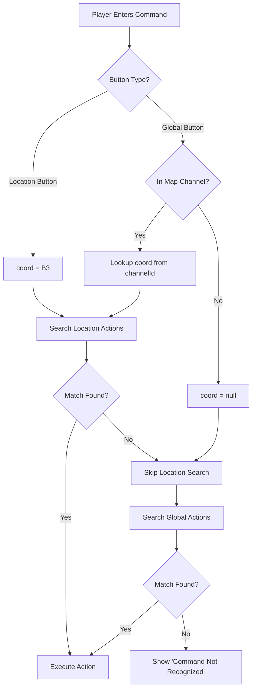

# Player Commands

## Overview

**Player Commands** is a text-based interaction system that allows players to invoke Custom Actions by typing keywords or phrases. This feature provides an alternative to button-based interactions, enabling hidden Easter eggs, secret codes, puzzle solutions, and text-based game mechanics.

`★ Architecture Context ─────────────────────────`
Player Commands serve as the **text-based trigger** for Custom Actions (formerly a Safari-only feature, now decoupled from Safari). While Custom Actions can be triggered by buttons, string selects, modals, or role selections, Player Commands specifically handle the **modal text input trigger type**.
`───────────────────────────────────────────────`

---

## Custom Actions: The Foundation

### What Are Custom Actions?

Custom Actions are CastBot's dynamic, configurable action system that allows production teams to create interactive experiences without code changes. Originally part of the Safari system, Custom Actions have been architecturally decoupled to support broader use cases.

**Core Characteristics:**
- **Trigger-Agnostic**: Can be invoked by buttons, text commands, selects, time events, etc.
- **Multi-Step Workflows**: Chain multiple actions together (display text → give item → follow-up)
- **Location-Flexible**: Assignable to specific map locations, multiple locations, or no location (global)
- **Many-to-Many**: Actions can be assigned to multiple coordinates; coordinates can have multiple actions

### Custom Action Types

| Action Type | Description | Use Case |
|------------|-------------|----------|
| **Display Text** | Show formatted message with optional image | Story beats, lore reveals, puzzle clues |
| **Give Item** | Award items with usage limits | Hidden treasures, Easter egg rewards |
| **Give Currency** | Award/deduct currency with limits | Secret bonuses, puzzle prizes |
| **Follow-up Action** | Trigger another Custom Action | Multi-step narratives, branching stories |
| **Conditional Action** | Execute actions based on conditions | Player-specific responses, state-based logic |
| **Calculate Results** | Process round outcomes (Safari-specific) | Idol Hunt results, challenge scoring |

### Data Structure

Custom Actions are stored in `safariContent.json` under the guild's `buttons` object:

```javascript
safariData[guildId].buttons = {
  "reece_bottle_test_code_1760372981380": {
    id: "reece_bottle_test_code_1760372981380",
    label: "Secret Bottle Message",
    description: "Hidden code at Jar City",
    emoji: "🍾",
    trigger: {
      type: "modal",           // Text-based trigger
      phrases: ["6420", "four two zero", "420"]  // Keyword matches
    },
    coordinates: ["B3"],       // Assigned to B3 location
    actions: [
      {
        type: "display_text",
        config: {
          title: "You found the super secret code!!",
          content: "Woo!",
          color: "0000ff"
        },
        executeOn: "true"        // Execute when phrase matches
      }
    ]
  },
  "global_idol_hint_1234": {
    id: "global_idol_hint_1234",
    trigger: {
      type: "modal",
      phrases: ["idol", "hint", "clue"]
    },
    coordinates: [],            // No location = global action
    actions: [...]
  }
}
```

**Location Assignment:**
- **Location-Specific**: `coordinates: ["B3", "C4"]` - Only works at those coordinates
- **Global/Orphan**: `coordinates: []` - Works from any channel via Player Menu

---

## How Player Commands Work

### Invocation Methods

Player Commands can be triggered through **two complementary entry points**:

#### 1. **Location Actions > Enter Command** (Location-Specific)
- **Access**: Available in map location channels via Location Actions button
- **Button ID**: `player_enter_command_{coordinate}` (e.g., `player_enter_command_B3`)
- **Search Priority**:
  1. Actions assigned to that specific location (e.g., B3)
  2. Global actions (coordinates = [])
  3. "No match" fallback actions

**UI Path:**
```
Map Channel (#b3-jar-city)
  → Location Actions button (appears in map anchor message)
    → Enter Command button
      → Modal: "Enter Command" text input
        → Searches B3 actions + global actions
```

#### 2. **Player Menu > Enter Command** (Location-Aware Global)
- **Access**: Available in player `/menu` (if enabled per server)
- **Button ID**: `player_enter_command_global`
- **Search Priority**:
  1. **IF in a map location channel**: Actions assigned to that location
  2. **ELSE**: Global actions only (coordinates = [])
  3. "No match" fallback actions

**UI Path:**
```
Any Channel
  → /menu command (player menu)
    → Enter Command button (if enabled)
      → Modal: "Enter Command" text input
        → Detects location from channelId
          → Searches location actions + global actions
```

`★ Key Insight ─────────────────────────────────`
**Both buttons share the same backend handler**. The global button (`player_enter_command_global`) automatically detects if the user is in a map location channel by matching the Discord `channel_id` against the map's coordinate-to-channel mapping. This provides a unified player experience while maintaining location-specific functionality.
`───────────────────────────────────────────────`

### Command Resolution Flow



### Implementation Details (app.js:36022-36230)

**Modal Handler**: `player_command_modal_{coord}`

1. **Extract coordinate from modal ID**:
   ```javascript
   const coord = custom_id.replace('player_command_modal_', ''); // 'B3' or 'global'
   ```

2. **Detect actual location** (if coord === 'global'):
   ```javascript
   if (coord === 'global') {
     // Search map coordinates for matching channelId
     for (const [coordKey, coordData] of Object.entries(coordinates)) {
       if (coordData.channelId === channelId) {
         actualLocation = coordKey; // Found! User is in B3 channel
         break;
       }
     }
   }
   ```

3. **Search location actions** (if actualLocation exists):
   ```javascript
   const locationActions = actualLocation
     ? coordinates[actualLocation].buttons
     : [];

   for (const actionId of locationActions) {
     if (action.trigger.phrases.includes(command)) {
       // Execute action!
     }
   }
   ```

4. **Fallback to global actions**:
   ```javascript
   for (const actionId of Object.keys(buttons)) {
     if (action.coordinates.length === 0 &&
         action.trigger.phrases.includes(command)) {
       // Execute global action!
     }
   }
   ```

---

## Configuration: Enabling/Disabling Player Commands

### Admin Configuration UI

**Access**: `/menu` (as admin) → Safari → Customize Terms → **🕹️ Player Menu** button

This opens a configuration modal with two settings:

#### 1. **Enable Global Commands**
Controls whether the "Enter Command" button appears in player `/menu`.

**Options:**
- **Yes - Show button** (default for new servers)
  - Players can access text commands from their `/menu`
  - Button appears in player menu IF Safari is initialized

- **No - Hide button**
  - "Enter Command" button removed from player `/menu`
  - Location-specific command buttons still work (unaffected)

#### 2. **Inventory Visibility Mode**
Controls when the Inventory button appears in player `/menu`.

**Options:**
- **Always Show**: Visible to all users in `/menu`
- **After Initialization Only**: Shows as soon as player joins Safari
- **After 1st Initialize + 1st Round** (default): Shows after Safari rounds start
- **Never Show**: Hidden, only accessible via shop interface

### Implementation (app.js:10687-10783, app.js:35517-35590)

**Button Handler**: `safari_player_menu_config`
```javascript
// Load current configuration
const safariConfig = safariData[guildId]?.safariConfig || {};
const currentEnabled = safariConfig.enableGlobalCommands !== false;
const currentInventoryMode = safariConfig.inventoryVisibilityMode || 'always';

// Show modal with current settings pre-selected
return {
  type: InteractionResponseType.MODAL,
  data: {
    custom_id: 'safari_player_menu_config_modal',
    components: [
      {
        type: 18, // Label (Components V2)
        label: 'Show "Enter Command" button in player /menu?',
        component: {
          type: 3, // String Select
          custom_id: 'enable_global_commands',
          options: [
            { label: 'Yes - Show button', value: 'true', default: currentEnabled === true },
            { label: 'No - Hide button', value: 'false', default: currentEnabled === false }
          ]
        }
      },
      // ... inventory visibility component
    ]
  }
};
```

**Modal Handler**: `safari_player_menu_config_modal`
```javascript
// Extract selections from modal
const enableGlobalCommands = selectedValue === 'true'; // Boolean
const inventoryVisibilityMode = selectedValue; // String

// Update safariConfig
safariData[guildId].safariConfig.enableGlobalCommands = enableGlobalCommands;
safariData[guildId].safariConfig.inventoryVisibilityMode = inventoryVisibilityMode;
await saveSafariContent(safariData);

// Refresh customization UI
const customizationUI = await createSafariCustomizationUI(guildId, safariConfig);
return { type: InteractionResponseType.UPDATE_MESSAGE, data: customizationUI };
```

### Player Menu Integration (playerManagement.js:535-550)

The global command button is conditionally rendered based on `enableGlobalCommands`:

```javascript
// Load configuration (default to true if not set)
const safariConfig = safariData[guildId]?.safariConfig || {};
const enableGlobalCommands = safariConfig.enableGlobalCommands !== false;

if (enableGlobalCommands) {
  // Add global command button to player menu
  const { getBotEmoji } = await import('./botEmojis.js');
  const globalCommandButton = new ButtonBuilder()
    .setCustomId('player_enter_command_global')
    .setLabel('Enter Command')
    .setStyle(ButtonStyle.Secondary)
    .setEmoji(getBotEmoji('command', guildId));

  inventoryComponents.push(globalCommandButton);
}
```

**Menu Types Affected:**
- ✅ **Regular Player Menu** (`/menu` by non-admins): Shows button if enabled
- ✅ **Player Profile Preview** (`prod_player_menu` from admin menu): Shows button if enabled
- ❌ **Production Menu** (`/menu` by admins): Never shows this button (completely different UI)

---

## Creating Text-Based Custom Actions

### Step-by-Step Guide

1. **Access Custom Actions Editor**
   - Use `/menu` (as admin) → Safari → Manage Custom Actions
   - Click "Create New" from location dropdown (or select existing action)

2. **Configure Basic Information**
   - **Label**: Display name (e.g., "Secret Code")
   - **Description**: Purpose/hint (e.g., "Hidden Easter egg at Jar City")
   - **Emoji**: Button emoji (e.g., 🔐)

3. **Set Trigger to Modal**
   - **Trigger Type**: Select "Modal" (text input)
   - **Configure Phrases**: Click "Configure Phrases" button
   - Enter keywords/phrases (one per line):
     ```
     6420
     four twenty
     secret code
     ```
   - Phrases are **case-insensitive** and match exactly

4. **Assign Location(s)** (Optional)
   - **For location-specific commands**: Select coordinates (e.g., B3, C4)
   - **For global commands**: Leave coordinates empty (orphan action)

5. **Add Actions**
   - Use the "Add Action" string select to add action types
   - Configure each action (display text, give item, etc.)
   - Actions execute in order

6. **Save**
   - Click "Save" to persist the Custom Action
   - Button appears at assigned locations or is accessible globally

### Example: Hidden Easter Egg

**Scenario**: Hidden code "6420" at Jar City (B3) that gives a reward.

```javascript
{
  id: "easter_egg_jar_city_6420",
  label: "Secret Code",
  description: "Hidden Easter egg at Jar City",
  emoji: "🎁",
  trigger: {
    type: "modal",
    phrases: ["6420", "four twenty", "secret"]
  },
  coordinates: ["B3"],  // Only works at B3
  actions: [
    {
      type: "display_text",
      config: {
        title: "🎉 You cracked the code!",
        content: "You found the hidden message in the bottle!",
        color: "00ff00"
      }
    },
    {
      type: "give_item",
      config: {
        itemId: "golden_key_123",
        quantity: 1,
        limit: {
          type: "once_per_player",
          claimedBy: []
        }
      }
    }
  ]
}
```

**Player Experience:**
1. Player reads lore hint: "The code is written on the bottle..."
2. Player navigates to B3 (Jar City)
3. Player clicks Enter Command (Location Actions or /menu)
4. Player types "6420"
5. Action executes: Shows success message + gives Golden Key

---

## Key Technical Considerations

### 1. **Performance: Channel ID Lookup**

When a player uses the global command button, the system performs an O(n) search through map coordinates to detect location:

```javascript
// Linear search through coordinates (typically 16-100 coordinates)
for (const [coordKey, coordData] of Object.entries(coordinates)) {
  if (coordData.channelId === channelId) {
    actualLocation = coordKey;
    break;
  }
}
```

**Performance Impact:**
- **Small maps** (4x4 = 16 coords): ~0.1-0.2ms
- **Medium maps** (7x7 = 49 coords): ~0.2-0.5ms
- **Large maps** (10x10 = 100 coords): ~0.5-1ms

This is **negligible** compared to Discord API network latency (50-200ms), so optimization is not currently needed.

**Future Optimization** (if needed):
- Build a `channelId → coordinate` reverse lookup map on server startup
- Invalidate cache when map coordinates change
- Reduces lookup to O(1) constant time

### 2. **Deferred Response Pattern**

Both command buttons use **deferred responses** to prevent Discord's 3-second timeout:

```javascript
// Send immediate acknowledgment
await res.send({
  type: InteractionResponseType.DEFERRED_CHANNEL_MESSAGE_WITH_SOURCE,
  data: { flags: InteractionResponseFlags.EPHEMERAL }
});

// Do expensive operations asynchronously
const safariData = await loadSafariContent();
// ... search for action ...
const result = await executeButtonActions(...);

// Edit the deferred response with result
await DiscordRequest(`webhooks/${applicationId}/${token}/messages/@original`, {
  method: 'PATCH',
  body: result
});
```

This ensures commands **always respond within 3 seconds**, even if action execution takes longer.

### 3. **Phrase Matching: Case-Insensitive Exact Match**

Phrases are matched using **case-insensitive exact comparison**:

```javascript
const command = input.trim().toLowerCase();
const phrases = action.trigger.phrases || [];

if (phrases.some(phrase => phrase.toLowerCase() === command)) {
  // Match found!
}
```

**Implications:**
- `"HELLO"` matches phrase `"hello"` ✅
- `"hello world"` does NOT match phrase `"hello"` ❌ (not exact)
- Whitespace is trimmed before comparison
- No fuzzy matching or partial matches

**Best Practice**: Provide multiple phrase variants:
```javascript
phrases: ["climb", "climb tree", "climb up", "tree"]
```

### 4. **Global Actions: Orphan Pattern**

Actions with **empty coordinates array** (`coordinates: []`) are considered "orphan" or "global" actions:

```javascript
// Check if action is global/orphan
if (!action.coordinates || action.coordinates.length === 0) {
  // This action is available globally
}
```

**Important**: The location assignment is **optional** in the data model. An action without coordinates is **valid** and accessible from any channel via the global command button.

### 5. **Location Detection: Channel ID Mapping**

The system determines location by matching `channel_id` from the interaction payload against the map's coordinate data:

```javascript
// Discord interaction payload
{
  channel_id: '1418595302235176990',
  // ...
}

// safariContent.json
{
  maps: {
    active: "map_4x4_1762294890035",
    "map_4x4_1762294890035": {
      coordinates: {
        "B3": {
          channelId: '1418595302235176990',  // ← Match!
          buttons: ["action_id_123"]
        }
      }
    }
  }
}
```

**Edge Cases:**
- If `channel_id` doesn't match any coordinate → `actualLocation = null` → searches global actions only
- If multiple maps have the same `channelId` → uses `maps.active` to scope search
- If user is in DM → `channel_id` is DM channel → no location detected

### 6. **Fallback Actions: executeOn="false"**

Custom Actions support a "no match" fallback pattern:

```javascript
{
  type: "display_text",
  config: {
    content: "That command doesn't exist here. Try 'help'."
  },
  executeOn: "false"  // Only execute when NO phrase matches
}
```

This allows graceful error handling with custom messages.

---

## Common Use Cases

### 1. **Hidden Easter Eggs**
**Setup**: Location-specific codes that reveal lore or give rewards.
```
Location: B3 (Haunted Forest)
Phrases: ["whisper", "ghost", "spirit"]
Actions: Display spooky message + give Ghost Token
```

### 2. **Idol Hunt Clues**
**Setup**: Global commands that work from anywhere.
```
Location: None (global)
Phrases: ["idol", "clue", "hint"]
Actions: Display current idol location hint
```

### 3. **Puzzle Solutions**
**Setup**: Multi-step commands that progress a story.
```
Location: C4 (Puzzle Room)
Phrases: ["answer: 42", "42", "forty two"]
Actions: Display success → Follow-up to next puzzle
```

### 4. **Secret Shops**
**Setup**: Hidden commands that open special stores.
```
Location: None (global)
Phrases: ["black market", "secret shop"]
Actions: Display shop message → Follow-up to store button
```

### 5. **Character Interactions**
**Setup**: Talk to NPCs with specific phrases.
```
Location: A1 (Village)
Phrases: ["talk to elder", "elder", "speak"]
Actions: Conditional based on player inventory → Different responses
```

---

## Troubleshooting

### "This interaction failed" Error

**Causes:**
1. **Button not registered** in `BUTTON_REGISTRY` (buttonHandlerFactory.js)
2. **Handler timeout** (>3 seconds without deferred response)
3. **Invalid Components V2 structure** in action display

**Solution**: Check logs for error details and verify button registration.

### Command Not Working

**Debugging Steps:**

1. **Check phrase matching**:
   ```bash
   tail -f /tmp/castbot-dev.log | grep "Player command submitted"
   # Look for: ⌨️ DEBUG: Player command submitted - coord: B3, command: "6420"
   ```

2. **Verify action exists**:
   - Check `safariContent.json` → `buttons` → verify action ID exists
   - Verify `trigger.type === 'modal'`
   - Verify `trigger.phrases` includes the command (case-insensitive)

3. **Check location assignment**:
   - If using location button: Verify action has that coordinate in `coordinates` array
   - If using global button: Verify action has `coordinates: []` OR check channel detection

4. **Test with admin test command**:
   - Use admin Test Command button to bypass player restrictions
   - Check if action executes successfully

### Global Button Not Appearing

**Causes:**
1. **Feature disabled**: Check `safari_player_menu_config` → "Enable Global Commands" = No
2. **Safari not initialized**: Button only appears if Safari is set up
3. **Menu type**: Button doesn't appear in Production Menu (only player menus)

**Solution**:
1. Enable feature: `/menu` (admin) → Safari → Customize Terms → Player Menu → Yes
2. Verify Safari initialization: `/menu` (admin) → Safari → Check status
3. Test in player menu: `/menu` (as non-admin) or click Player Profile Preview

### Location Detection Not Working

**Symptoms**: Global button doesn't find location-specific actions when used in map channel.

**Debug**:
```bash
tail -f /tmp/castbot-dev.log | grep "DEBUG: Global button"
# Expected: 📍 DEBUG: Global button in location channel - detected B3 from channelId 1418595302235176990
# Problem: 🌍 DEBUG: Global button in non-location channel - using global-only search
```

**Causes:**
1. **Channel ID mismatch**: Map coordinate has wrong `channelId` stored
2. **Incorrect active map**: `maps.active` points to wrong map
3. **Channel recreated**: Discord generates new channel ID after recreation

**Solution**: Verify `safariContent.json` coordinate data matches actual Discord channel IDs.

---

## Related Documentation

- **[SafariCustomActions.md](SafariCustomActions.md)** - Complete Custom Actions reference (action types, configuration, usage limits)
- **[SafariCustomExperiences.md](SafariCustomExperiences.md)** - Safari Custom Experiences system design
- **[ComponentsV2.md](../standards/ComponentsV2.md)** - Discord Components V2 structure for action responses
- **[DiscordInteractionAPI.md](../standards/DiscordInteractionAPI.md)** - Modal and interaction response patterns
- **[ButtonHandlerFactory.md](../enablers/ButtonHandlerFactory.md)** - Button handler registration and patterns

---

## Summary

**Player Commands** provide a text-based interface to Custom Actions, enabling:
- ✅ Hidden Easter eggs and secret codes
- ✅ Location-specific and global commands
- ✅ Unified player experience (both buttons share backend logic)
- ✅ Per-server configuration (enable/disable via admin UI)
- ✅ Automatic location detection for global button
- ✅ Flexible phrase matching with multiple variants

The system is **production-ready** with minimal performance impact and robust error handling.
