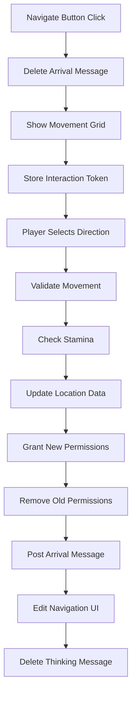

# Safari Map Explorer System Documentation

This document serves as the source of truth for the Safari Map Explorer feature - a grid-based map exploration system that allows players to upload images and explore them through Discord channels.

## Table of Contents

1. [Feature Overview](#feature-overview)
2. [Technical Architecture Options](#technical-architecture-options)
3. [Image Upload/Download Methods](#image-uploaddownload-methods)
4. [Grid Processing Approaches](#grid-processing-approaches)
5. [Channel Creation Strategy](#channel-creation-strategy)
6. [Data Storage Design](#data-storage-design)
7. [Implementation Roadmap](#implementation-roadmap)
8. [Technical Considerations](#technical-considerations)
9. [Security & Performance](#security--performance)
10. [Future Enhancements](#future-enhancements)

## Feature Overview

The Safari Map Explorer allows:
- Players to upload map images to the bot
- Automatic grid overlay and coordinate system generation (A1, B2, C3, etc.)
- Creation of Discord channels for each grid coordinate
- Players exploring the map by moving between grid channels
- Visual feedback showing explored vs unexplored areas

### Core User Flow
1. Admin uploads a map image via Discord
2. Bot processes the image and overlays a grid
3. Bot returns the gridded map to confirm coordinates
4. Bot creates Discord channels for each coordinate
5. Players explore by moving between coordinate channels

## Technical Architecture Options

### Option 1: Node.js Native with Canvas API (Recommended)
**Pros:**
- Pure JavaScript solution using `node-canvas` package
- No external dependencies or services
- Full control over image processing
- Works seamlessly in existing Node.js environment

**Cons:**
- Need to handle image processing algorithms
- More complex grid detection logic

**Key Libraries:**
- `node-canvas` - Canvas API implementation for Node.js
- `sharp` - High-performance image processing
- `jimp` - Pure JavaScript image manipulation

### Option 2: Python Microservice with OpenCV
**Pros:**
- Powerful computer vision capabilities
- Advanced grid detection algorithms
- Mature image processing ecosystem

**Cons:**
- Requires separate Python service
- Additional deployment complexity
- Inter-process communication overhead

### Option 3: External API Service
**Pros:**
- Offload processing to specialized service
- Potentially more advanced features
- Scalability handled externally

**Cons:**
- Dependency on third-party service
- Potential costs
- Privacy concerns with user uploads

## Image Upload/Download Methods

### Method 1: Discord Attachment Upload (Recommended)
```javascript
// In slash command or message handler
const attachment = interaction.options.getAttachment('map');
if (attachment.contentType?.startsWith('image/')) {
    const imageBuffer = await fetch(attachment.url).then(res => res.buffer());
    // Process image...
}
```

**Pros:**
- Native Discord functionality
- Familiar to users
- No external hosting needed

**Cons:**
- Discord CDN URLs expire
- Size limitations (8MB for non-Nitro users)

### Method 2: URL-Based Upload
```javascript
// User provides image URL
const imageUrl = interaction.options.getString('map_url');
const imageBuffer = await fetch(imageUrl).then(res => res.buffer());
```

**Pros:**
- Works with any hosted image
- No Discord size limitations

**Cons:**
- Requires users to host images
- Security concerns with external URLs

### Method 3: Multi-Step Upload Process
1. Bot creates temporary upload channel
2. User uploads image as message attachment
3. Bot processes and confirms
4. Bot deletes temporary channel

**Pros:**
- Better for large images
- More control over process

**Cons:**
- More complex user flow
- Requires channel management

## Grid Processing Approaches

### Approach 1: Fixed Grid Overlay
```javascript
// Using node-canvas
const { createCanvas, loadImage } = require('canvas');

async function addGridToImage(imageBuffer, gridSize = 10) {
    const img = await loadImage(imageBuffer);
    const canvas = createCanvas(img.width, img.height);
    const ctx = canvas.getContext('2d');
    
    // Draw original image
    ctx.drawImage(img, 0, 0);
    
    // Calculate cell dimensions
    const cellWidth = img.width / gridSize;
    const cellHeight = img.height / gridSize;
    
    // Draw grid lines
    ctx.strokeStyle = 'rgba(255, 255, 255, 0.5)';
    ctx.lineWidth = 2;
    
    // Vertical lines
    for (let x = 0; x <= gridSize; x++) {
        ctx.beginPath();
        ctx.moveTo(x * cellWidth, 0);
        ctx.lineTo(x * cellWidth, img.height);
        ctx.stroke();
    }
    
    // Horizontal lines
    for (let y = 0; y <= gridSize; y++) {
        ctx.beginPath();
        ctx.moveTo(0, y * cellHeight);
        ctx.lineTo(img.width, y * cellHeight);
        ctx.stroke();
    }
    
    // Add coordinate labels
    ctx.font = 'bold 20px Arial';
    ctx.fillStyle = 'white';
    ctx.strokeStyle = 'black';
    ctx.lineWidth = 3;
    
    for (let y = 0; y < gridSize; y++) {
        for (let x = 0; x < gridSize; x++) {
            const label = `${String.fromCharCode(65 + x)}${y + 1}`;
            const textX = x * cellWidth + cellWidth / 2 - 15;
            const textY = y * cellHeight + cellHeight / 2 + 7;
            
            ctx.strokeText(label, textX, textY);
            ctx.fillText(label, textX, textY);
        }
    }
    
    return canvas.toBuffer('image/png');
}
```

### Approach 2: Smart Grid Detection
- Detect existing grid lines in the image
- Use edge detection algorithms
- Allow manual adjustment of grid alignment

### Approach 3: User-Defined Grid Points
- User clicks corner points
- Bot calculates grid based on perspective
- More flexible for non-rectangular maps

## Channel Creation Strategy

### Strategy 1: Lazy Channel Creation (Recommended)
```javascript
// Only create channels as players explore
async function moveToCoordinate(guildId, userId, coordinate) {
    const channelName = `safari-map-${coordinate.toLowerCase()}`;
    let channel = guild.channels.cache.find(ch => ch.name === channelName);
    
    if (!channel) {
        channel = await guild.channels.create({
            name: channelName,
            type: ChannelType.GuildText,
            parent: safariCategoryId,
            permissionOverwrites: [
                {
                    id: guild.id,
                    deny: [PermissionFlagsBits.ViewChannel]
                },
                {
                    id: userId,
                    allow: [PermissionFlagsBits.ViewChannel]
                }
            ]
        });
    }
    
    // Add user to channel if not already there
    await channel.permissionOverwrites.edit(userId, {
        ViewChannel: true
    });
    
    return channel;
}
```

### Strategy 2: Pre-create All Channels
- Create all coordinate channels upfront
- Hide/show based on exploration
- Better for smaller grids

### Strategy 3: Virtual Channels
- Use a single channel with embedded messages
- Update message content based on location
- No channel spam

## Data Storage Design

### Safari Map Data Structure
```javascript
// In safariContent.json
{
    "maps": {
        "mapId_123": {
            "id": "mapId_123",
            "name": "Treasure Island",
            "guildId": "123456789",
            "imageUrl": "https://...",
            "gridSize": 10,
            "coordinates": {
                "A1": {
                    "channelId": "987654321",
                    "description": "Rocky shores with crashing waves",
                    "textPrompts": {
                        "onEnter": "The salty breeze hits your face as waves crash against jagged rocks.",
                        "onExamine": "You notice something glinting between the rocks...",
                        "onSearch": "After carefully searching, you find a weathered treasure chest!"
                    },
                    "items": [
                        {
                            "id": "treasure_chest",
                            "name": "Weathered Treasure Chest",
                            "description": "An old chest partially buried in the sand",
                            "discoverable": true,
                            "collectable": true,
                            "requiresKey": false
                        }
                    ],
                    "hiddenCommands": [
                        {
                            "trigger": "climb rocks",
                            "response": "You climb the rocks and spot a hidden cave entrance!",
                            "unlocks": "A2",
                            "requiresItem": null
                        }
                    ],
                    "navigationOptions": {
                        "north": { "to": "A2", "blocked": false, "description": "Dense jungle path" },
                        "east": { "to": "B1", "blocked": false, "description": "Sandy beach continues" },
                        "south": { "to": null, "blocked": true, "description": "Treacherous cliffs" },
                        "west": { "to": null, "blocked": true, "description": "Open ocean" }
                    },
                    "exploredBy": ["userId1", "userId2"],
                    "cellType": "coast",
                    "difficulty": 1,
                    "requiresPermission": false,
                    "customData": {
                        "weatherEffect": "windy",
                        "ambientSound": "ocean_waves.mp3"
                    }
                },
                "A2": {
                    "channelId": null,
                    "description": "Dense jungle with towering trees",
                    "textPrompts": {
                        "onEnter": "Thick vines and exotic sounds surround you in this verdant jungle.",
                        "onExamine": "The canopy blocks most sunlight, creating an eerie green glow.",
                        "onSearch": "You hear movement in the undergrowth..."
                    },
                    "items": [],
                    "hiddenCommands": [
                        {
                            "trigger": "follow sound",
                            "response": "You discover a small clearing with ancient ruins!",
                            "unlocks": "secret_area_jungle",
                            "requiresItem": null
                        }
                    ],
                    "navigationOptions": {
                        "north": { "to": "A3", "blocked": false, "description": "Jungle path continues" },
                        "east": { "to": "B2", "blocked": true, "description": "Thick brambles block the way" },
                        "south": { "to": "A1", "blocked": false, "description": "Return to the coast" },
                        "west": { "to": null, "blocked": true, "description": "Impassable jungle" }
                    },
                    "exploredBy": [],
                    "cellType": "jungle",
                    "difficulty": 2,
                    "requiresPermission": false,
                    "customData": {
                        "weatherEffect": "humid",
                        "ambientSound": "jungle_sounds.mp3"
                    }
                }
                // ... more coordinates
            },
            "playerLocations": {
                "userId1": "A1",
                "userId2": "B3"
            },
            "createdAt": "2024-01-01T00:00:00Z",
            "createdBy": "adminUserId"
        }
    }
}
```

### Player Progress Structure
```javascript
// In playerData.json
{
    "guildId": {
        "players": {
            "userId": {
                "safari": {
                    "mapProgress": {
                        "mapId_123": {
                            "currentLocation": "A1",
                            "exploredCoordinates": ["A1", "A2", "B1"],
                            "itemsFound": ["treasure_chest"],
                            "movementHistory": [
                                { "from": null, "to": "A1", "timestamp": "..." },
                                { "from": "A1", "to": "A2", "timestamp": "..." }
                            ]
                        }
                    }
                }
            }
        }
    }
}
```

## Enhanced Grid Cell Data Structure Design

### Current Implementation Status
✅ **Grid Generation:** Complete - can overlay grids on pre-defined server images
✅ **Coordinate System:** Complete - supports multiple schemas and programmatic reference
✅ **Grid Rendering:** Can render full maps with grid overlay (e.g., map_grid_10x10.png)
✅ **Tile Extraction:** Proven capability to extract individual grid cells from maps
✅ **Map Creation System:** Complete - generates maps and Discord infrastructure
✅ **Data Storage:** Complete - integrated with Safari system via safariContent.json
✅ **UI Integration:** Complete - Map Explorer added to Safari menu system
✅ **Player Movement:** Complete - full navigation system with Navigate button pattern
✅ **Permission Management:** Complete - automatic channel access control
✅ **Admin Controls:** Complete - Map Admin interface for player management
🔄 **Cell Content Management:** Next phase - editing individual cell content

### Technical Capabilities

#### Core Grid System
- **Base Map:** Using pre-defined `img/map.png` as source image for all generated maps
- **Grid Overlay:** MapGridSystem class generates grids of various sizes (5x5, 8x8, 10x10, 12x12)
- **Recommended Style:** Thick grid lines (4px) with white borders for maximum visibility
- **Coordinate System:** Standard letter-number format (A1-E5 for 5x5 grid)

#### Image Processing & Extraction
- **Tile Extraction:** ✅ PROVEN - Can extract individual grid cells from rendered maps
  - Successfully extracted map_c8.png (250x250px tile from 10x10 grid)
  - Can identify exact pixel coordinates for any grid cell
  - **Capability confirmed:** Can draw player icons or markers on specific coordinates
  - Created proof-of-concept tiles: map_a1.png, map_e5.png, map_a5.png, map_e1.png

#### File Storage & Organization
- **Map Storage:** `img/{guildId}/map_{gridSize}x{gridSize}_{timestamp}.png`
- **Base Image:** Always uses `img/map.png` as the source (hardcoded for MVP)
- **Directory Structure:** Guild-specific folders for organized map storage
- **Tile Storage:** Future capability for `img/{guildId}/tiles/` individual cell images

### Architecture Decisions

#### 1. Interface Integration
- **Menu System:** Reuse existing button-menu interface via /menu (player menu)
- **Safari Buttons:** Leverage existing Safari button system for cell interactions
- **Management UI:** New 'Map' button in prod_safari_menu container interface
- **Channel Creation:** One Discord channel per grid coordinate in 🗺️ Map category

#### 2. Grid Specifications
- **Recommended Size:** 5x5 (25 cells) for most servers
- **Maximum Size:** 8x8 (64 cells) - larger grids become unwieldy
- **Coordinate System:** Standard letter-number (A1-E5 for 5x5)
- **Base Map:** Using hardcoded `img/map.png` for initial implementation

#### 3. Player State Management
- **Shared Base Content:** All players see same cell descriptions
- **Individual State:** Each player tracks their own progress/items found
- **Chest Options:** Configurable as either individual (each player can loot) or shared (first come, first served)
- **Movement System:** Stamina-based with configurable moves per turn

#### 4. Content Structure per Cell
- **Description Text:** Primary content describing what players see
- **Safari Buttons:** Interactive elements using existing Safari action system
- **Clues/Hints:** Embedded in descriptions or revealed through actions
- **Items:** Discoverable objects that integrate with Safari inventory
- **Navigation:** Movement options to adjacent cells

#### 5. Technical Implementation

**Channel Creation Strategy:**
- Implement rate limiting: 5 channels per 5 seconds (Discord recommended)
- Recovery mechanism for interruptions
- Progress tracking and logging during creation
- Cleanup functionality for map deletion

**File Storage Pattern:**
```
img/
  {guildId}/
    map_5x5_{timestamp}.png     # Full map with grid
    map_8x8_{timestamp}.png     # Different size maps
    tiles/                      # Individual cell extracts if needed
      map_{timestamp}_A1.png
      map_{timestamp}_A2.png
```

**Data Integration:**
- ✅ **IMPLEMENTED:** Extends `safariContent.json` with new `maps` section
- ✅ **IMPLEMENTED:** Links Discord channel IDs to grid coordinates
- ✅ **IMPLEMENTED:** Stores complete map metadata and coordinate data
- 🔄 **PLANNED:** Player position tracking and exploration state
- 🔄 **PLANNED:** Integration with existing Safari currency/shop systems

#### Discord Infrastructure Management
- **Category Creation:** Creates "🗺️ Map Explorer" category for map channels
- **Channel Creation:** Generates one channel per coordinate (#a1, #a2, etc.)
- **Rate Limiting:** 5 channels per 5 seconds to comply with Discord API limits
- **Permission Management:** Channels hidden by default, revealed as players explore
- **Cleanup System:** Complete removal of channels and data when map is deleted
- **Recovery Handling:** Graceful error handling for interrupted channel creation

### Movement System Integration

#### Current Button Handlers
- `safari_navigate_{userId}_{coordinate}` - Shows movement options grid
- `safari_move_{coordinate}` - Executes movement to target coordinate
- `safari_show_movement_{userId}_{coordinate}` - Admin-triggered movement display
- `map_admin_*` - Full suite of admin controls

#### Map-Specific Safari Button Actions (Planned)
New action types to be added to the Safari button system:
- `move_player` - Moves player to adjacent grid cell
- `check_location` - Validates player is at specific coordinate
- `give_map_item` - Adds location-specific item to inventory
- `mark_searched` - Marks location as searched by player
- `mark_chest_opened` - Records chest as opened (for shared chests)
- `broadcast_discovery` - Announces major discoveries server-wide
- `unlock_path` - Opens new movement options
- `trigger_event` - Starts location-based events

These will extend the existing Safari action system without breaking current functionality.

## Implementation Roadmap

### Phase 1: Core Image Processing ✅ COMPLETED
1. ✅ Implement image upload command
2. ✅ Add grid overlay functionality
3. ✅ Return processed image to user
4. ✅ Store map metadata

### Navigation Implementation Architecture

#### User Flow
1. **Initialization**: Player uses `/menu` → clicks "Start Exploring"
2. **First Channel**: Receives welcome message with Navigate button at A1
3. **Navigation**: Click Navigate → ephemeral movement grid appears
4. **Movement**: Select direction → permissions update → arrive at new location
5. **Continuation**: New Navigate button in arrival message

#### Technical Flow


#### Key Design Decisions
- **Ephemeral Navigation**: Reduces channel clutter
- **Navigate Button Pattern**: Clean interface, self-deleting
- **Permission Order**: Grant-then-remove prevents lockouts
- **Message Editing**: Updates original UI to prevent confusion
- **Deferred Handling**: Manages long-running permission updates

### Phase 2A: Basic Map Creation & Management ✅ COMPLETED

#### Core Implementation
1. ✅ **UI Integration:** Added Map Explorer button to Safari menu (Row 2, Position 5)
2. ✅ **Interface Design:** Created Map Explorer submenu with state management
3. ✅ **Map Generation:** Implemented Create Map functionality
4. ✅ **Map Deletion:** Implemented Delete Map functionality
5. ✅ **Data Persistence:** Integrated with Safari content system

#### Create Map Process (Detailed)
- ✅ Generates 5x5 grid overlay on hardcoded `img/map.png`
- ✅ Saves processed image to `img/{guildId}/map_5x5_{timestamp}.png`
- ✅ Creates Discord category "🗺️ Map Explorer" 
- ✅ Creates 25 channels (#a1 through #e5) with proper rate limiting
- ✅ Stores complete map data structure in `safariContent.json`
- ✅ Progress reporting during channel creation process
- ✅ Error handling and recovery for interrupted operations

#### Delete Map Process (Detailed)
- ✅ Removes all map channels with rate limiting (2 second delays)
- ✅ Deletes the map category
- ✅ Cleans up generated map image files
- ✅ Preserves base `map.png` file for future use
- ✅ Removes map data from safariContent.json storage
- ✅ Progress reporting during cleanup process

#### Technical Architecture Completed
- ✅ **File Structure:** `mapExplorer.js` - 400+ lines of core functionality
- ✅ **Button Handlers:** 3 new handlers in app.js (safari_map_explorer, map_create, map_delete)
- ✅ **Data Layer:** Safari content integration with load/save pattern
- ✅ **UI Components:** Components V2 interface with proper state management
- ✅ **Error Handling:** Comprehensive try/catch with user feedback
- ✅ **Documentation:** Button handlers registered in BUTTON_HANDLER_REGISTRY.md

#### MapGridSystem Capabilities
- ✅ **Grid Generation:** Supports 5x5, 8x8, 10x10, 12x12 grids
- ✅ **Styling Options:** Customizable border size, line width, fonts, colors
- ✅ **Coordinate Systems:** Standard (A1-E5), chess-style (a1-e5), numbers-only (1-1 to 5-5)
- ✅ **Programmatic Access:** Coordinate ↔ pixel conversion functions
- ✅ **Marker System:** Can highlight specific cells and draw on coordinates
- ✅ **Tile Extraction:** Proven capability to extract individual grid cells

#### Data Structure Implementation
```json
{
  "guildId": {
    "maps": {
      "active": "map_5x5_1704236400000",
      "map_5x5_1704236400000": {
        "id": "map_5x5_1704236400000",
        "name": "Adventure Island",
        "gridSize": 5,
        "imageFile": "img/391415444084490240/map_5x5_1704236400000.png",
        "category": "1234567890",
        "coordinates": {
          "A1": {
            "channelId": "1234567891",
            "baseContent": { /* cell content */ },
            "navigation": { /* movement options */ }
          }
        },
        "playerStates": { /* individual player progress */ },
        "globalState": { /* shared map state */ },
        "config": { /* map settings */ }
      }
    }
  }
}
```

### Phase 2B: Player Movement System ✅ COMPLETED
1. ✅ **Navigation Interface:** Navigate button with ephemeral movement grid
2. ✅ **Movement Validation:** 8-directional movement with adjacency checks
3. ✅ **Stamina Integration:** Points-based movement limitation
4. ✅ **Permission Flow:** Automatic channel access management
5. ✅ **Admin Tools:** Complete player management interface

### Phase 2D: Cell Content Management (Next Steps)
1. 🔄 Extend entityManagementUI.js for cell content editing
2. 🔄 Implement map cell editor interface
3. 🔄 Add Safari button integration for location-specific content
4. 🔄 Create interactive elements at coordinates

### Phase 2C: Movement & Exploration ✅ COMPLETED
1. ✅ **Movement Commands:** Navigate button + directional movement grid
2. ✅ **Stamina System:** Entity points integration with configurable regeneration
3. ✅ **Permission Management:** Automatic grant/remove with proper ordering
4. ✅ **Player State Tracking:** Complete progress tracking per map

#### Implementation Details
- **Navigation Pattern:** Players click Navigate → see movement options → select direction
- **UI Updates:** Original navigation message edited to show completion
- **Arrival System:** New Navigate button posted in destination channel
- **Security:** Channel validation prevents using stale movement buttons

### Phase 3: Exploration Features
1. Add fog of war (show/hide unexplored areas)
2. Implement item placement system
3. Create movement restrictions (walls, obstacles)
4. Add visual progress tracking

### Phase 4: Advanced Features
1. Multi-floor/layer support
2. NPC placement and interactions
3. Quest/objective system
4. Collaborative exploration

## Technical Considerations

### Discord Limitations
- **Channel Limit**: 500 channels per server
  - Solution: Use categories, lazy creation, or virtual channels
- **Rate Limits**: Channel creation is rate-limited
  - Solution: Queue channel creation, use batching
- **Permission Overwrites**: Limited to 500 per channel
  - Solution: Use role-based permissions for groups

### Map Creation File Size Limitations
- **Large Image Files**: Maps with large file sizes can cause deployment aborts
  - **Symptom**: Dev restart/deployment process fails silently during file upload
  - **Root Cause**: Image files exceeding upload limits during git push operations
  - **Solution**: Compress images or use external hosting for large map files
  - **Prevention**: Add file size validation in map upload process
  - **Workaround**: Use smaller source images or optimize PNG compression before upload

### Image Processing
- **Memory Usage**: Large images can consume significant memory
  - Solution: Stream processing, image size limits
- **Processing Time**: Complex grids may take time
  - Solution: Async processing, progress indicators
- **Storage**: Processed images need persistent storage
  - Solution: Use CDN, compress images, cleanup old maps

### User Experience
- **Mobile Support**: Ensure map images are mobile-friendly
- **Navigation**: Easy movement between coordinates
- **Visual Feedback**: Clear indication of current location
- **Discovery**: Hints about adjacent areas

## Security & Performance

### Security Measures
1. **Image Validation**
   ```javascript
   const allowedTypes = ['image/png', 'image/jpeg', 'image/webp'];
   const maxSize = 10 * 1024 * 1024; // 10MB
   
   if (!allowedTypes.includes(attachment.contentType)) {
       throw new Error('Invalid image type');
   }
   if (attachment.size > maxSize) {
       throw new Error('Image too large');
   }
   ```

2. **Rate Limiting**
   - Limit map uploads per user/guild
   - Throttle movement commands
   - Queue channel operations

3. **Permission Checks**
   - Admin-only map creation
   - Validate player access to coordinates
   - Prevent coordinate spoofing

### Performance Optimization
1. **Image Caching**
   - Cache processed grid images
   - Store thumbnails for quick preview
   - CDN integration for fast delivery

2. **Lazy Loading**
   - Create channels on-demand
   - Load coordinate data as needed
   - Paginate large exploration histories

3. **Batch Operations**
   - Group channel creations
   - Bulk permission updates
   - Aggregate database writes

## Future Enhancements

### Advanced Map Features
1. **Dynamic Maps**
   - Time-based changes (day/night)
   - Weather effects
   - Random events

2. **Interactive Elements**
   - Clickable areas within coordinates
   - Mini-games at locations
   - Resource gathering

3. **Social Features**
   - See other players on map
   - Leave messages at coordinates
   - Collaborative objectives

### Integration Possibilities
1. **Safari Shop Integration**
   - Buy map tools (compass, telescope)
   - Unlock new areas with currency
   - Trade discovered items

2. **Combat System**
   - Territory control
   - PvP zones
   - Monster encounters

3. **Quest System**
   - Location-based objectives
   - Treasure hunts
   - Exploration achievements

### Technical Enhancements
1. **AI Integration**
   - Auto-generate location descriptions
   - Dynamic NPC conversations
   - Procedural map generation

2. **3D Visualization**
   - WebGL map preview
   - Interactive 3D exploration
   - VR/AR potential

3. **External Tools**
   - Web-based map editor
   - Mobile companion app
   - Analytics dashboard

---

**Note**: This document is a living specification and will be updated as the feature is developed. For the latest implementation status, refer to the [BACKLOG.md](../BACKLOG.md) and [CLAUDE.md](../CLAUDE.md) files.