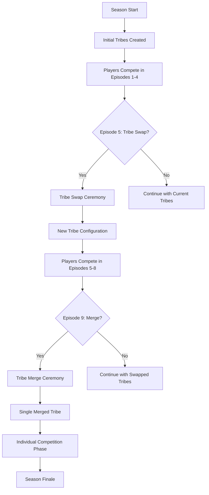

# Tribe Swap/Merge System

## Overview

**Status**: 🟢 PRODUCTION READY (with known issues)
**Created**: November 2024
**Category**: Season Management
**Related Systems**: [Season Lifecycle](../concepts/SeasonLifecycle.md), [Castlist V3](CastlistV3.md), [Tribe Manager](../implementation/TribeManager.md)

The Tribe Swap/Merge system enables dramatic tribe reorganizations during active seasons, automatically reassigning players to new tribes with optional dramatic reveal ceremonies and maintaining historical records through castlist archival.

## Season Lifecycle Use Case

### Typical Survivor Season Flow



### When to Use Tribe Swap/Merge

**Tribe Swap** (Episode 5-8):
- Mix up tribe dynamics mid-season
- Prevent one tribe from dominating
- Create new social dynamics
- Typically 2-3 new tribes from 2-4 old tribes

**Tribe Merge** (Episode 9-12):
- Transition to individual competition
- Combine all remaining tribes into one
- Typically happens when ~12-14 players remain
- Creates single tribe for rest of season

**Example Timeline**:
```
Episode 1-4:  TribeA (8 players) + TribeB (8 players) = 16 total
Episode 5:    SWAP → NewTribeX (8) + NewTribeY (8) = 16 total
Episode 9:    MERGE → MergedTribe (12 remaining players)
Episode 14:   Winner declared from MergedTribe
```

## How to Use (User Interface)

### Prerequisites

**Required Permissions**:
- Manage Roles OR Manage Channels

**Required Setup**:
1. Active Season configured (see [Season Lifecycle](../concepts/SeasonLifecycle.md))
2. Default castlist with 2+ tribes
3. Players assigned to tribe Discord roles
4. New Discord roles created for post-swap tribes

### Step-by-Step: Performing a Tribe Swap

#### 1. Navigate to Castlist Hub

```
/menu → Production Menu → Castlists
```

#### 2. Select Default Castlist

Use the `castlist_select` dropdown to choose **"Default"** (also labeled as "Active Castlist")

**Result**: Swap/Merge button becomes enabled

#### 3. Click Swap/Merge Button

Located in the bottom row of the Castlist Hub interface:
- Button Label: `Swap/Merge`
- Button Style: Secondary (gray)
- Emoji: 🔀
- **Only enabled when Default castlist is selected**

#### 4. Configure Swap in Modal

The modal presents 5 configuration options:

##### Field 1: New Tribe Roles (Role Select)
```
Label: New Tribe Roles
Description: Select 2+ roles that will become your new tribes
Type: Multi-select Role picker
Min: 2 roles
Max: 10 roles
```

**Example**: Select Discord roles `@MergedTribe` for a merge, or `@NewX` + `@NewY` for a swap

##### Field 2: Archive Castlist Name (Text Input)
```
Label: Archive Castlist Name
Description: Name for archived tribes (e.g., "OG Tribes", "Pre-Merge")
Type: Short text input
Required: Yes
Max Length: 50 characters
```

**Example**: `Pre-Swap Tribes`, `Original Tribes`, `Episodes 1-4 Tribes`

##### Field 3: Create Vanity Roles? (String Select)
```
Label: Create Vanity Roles?
Description: Keep old tribe roles visible on new castlist
Options:
  - ✅ Yes - Keep old tribes visible
    "Players show both old and new tribes"
  - ❌ No - Hide old tribes
    "Only new tribes visible"
```

**Recommended**:
- **Yes** for swaps (shows player history)
- **No** for early merges (cleaner display)

##### Field 4: Have CastBot Randomize Swap? (String Select)
```
Label: Have CastBot Randomize Swap?
Description: Automatic random assignment with dramatic reveal
Options:
  - 🎭 Yes - Automate via CastBot
    "Dramatic 15-second reveal sequence"
  - ✋ No - Swap Manually
    "Manually assign roles after creation"
```

**Manual Mode**: Creates archive and new tribes, but you assign roles yourself
**Auto Mode**: Full ceremony with 15-second reveals

##### Field 5: Odd Player Number Behaviour (String Select)
```
Label: Odd Player Number Behaviour
Description: What to do if players don't divide evenly
Options:
  - 🎲 Randomise odd player into a tribe
    "CastBot assigns extra players randomly"
  - ✋ Manually handle
    "You assign extra players later"
```

**Example**: 13 players → 2 new tribes
- Randomise: Automatically creates 7-player and 6-player tribes
- Manual: Stops at 12, leaves 1 player for you to assign

#### 5. Submit and Watch

**If Auto-Randomize = Yes**:
1. Modal closes
2. Channel receives opening ceremony message
3. 15-second pause
4. Players revealed one-by-one (round-robin by tribe)
5. 15-second pause between each reveal
6. Completion message posted
7. Castlist hub refreshes (ephemeral)

**If Auto-Randomize = No**:
1. Modal closes
2. Archive created
3. New tribes added to default castlist
4. Completion message posted
5. You manually assign Discord roles

### Example Scenarios

#### Scenario 1: Classic Tribe Swap (2 → 2)
```
Before: TribeA (7 players) + TribeB (7 players) = 14 total
Action: Swap/Merge with NewX + NewY roles
After:  NewX (7 players) + NewY (7 players) = 14 total
Archive: "Pre-Swap Tribes" contains TribeA + TribeB
Vanity: Yes → Players show both old and new tribes on castlist
```

#### Scenario 2: Tribe Merge (3 → 1)
```
Before: TribeA (5) + TribeB (4) + TribeC (5) = 14 total
Action: Swap/Merge with MergedTribe role
After:  MergedTribe (14 players)
Archive: "Pre-Merge Tribes" contains TribeA + TribeB + TribeC
Vanity: No → Only merged tribe shows on default castlist
```

#### Scenario 3: Uneven Swap (2 → 3)
```
Before: TribeA (8) + TribeB (9) = 17 total
Action: Swap/Merge with NewX + NewY + NewZ roles
Config: Odd Player Behaviour = Randomise
After:  NewX (6) + NewY (6) + NewZ (5) = 17 total
Note: 17 ÷ 3 = 5 remainder 2, so two tribes get 6 players
```

## Modal Behavior

### Component Structure (Components V2)

```javascript
{
  type: 9, // MODAL
  data: {
    custom_id: 'tribe_swap_merge_modal',
    title: 'Tribe Swap/Merge',
    components: [
      {
        type: 18, // Label (NEW Sept 2025)
        label: 'New Tribe Roles',
        description: 'Select 2+ roles that will become your new tribes',
        component: {
          type: 6, // Role Select (NEW in modals!)
          custom_id: 'new_tribe_roles',
          min_values: 2,
          max_values: 10
        }
      },
      // ... 4 more Label-wrapped components
    ]
  }
}
```

### Validation Rules

**On Submit**:
1. ✅ Archive name not empty
2. ✅ At least 2 new tribe roles selected
3. ✅ Current default castlist has tribes
4. ✅ Current tribes have players
5. ❌ If any fail → Ephemeral error message

### Data Extraction

```javascript
// Modal components are wrapped in Label (type 18)
const getFieldValue = (customId) => {
  for (const row of components) {
    // Label wrapper
    if (row?.type === 18 && row?.component) {
      if (row.component.custom_id === customId) {
        return row.component.value || row.component.values || null;
      }
    }
    // Legacy ActionRow format (backwards compatibility)
    else if (row?.components && Array.isArray(row.components)) {
      const field = row.components.find(c => c?.custom_id === customId);
      if (field) return field.value || field.values || null;
    }
  }
  return null;
};

// Extract values
const archiveName = getFieldValue('archive_name'); // string
const vanityRoles = getFieldValue('vanity_roles')?.[0]; // 'yes' or 'no'
const autoRandomize = getFieldValue('auto_randomize')?.[0]; // 'yes' or 'no'
const oddPlayerBehaviour = getFieldValue('odd_player_behaviour')?.[0]; // 'randomise' or 'manual'

// New tribe role IDs from resolved roles
const newTribeRoleIds = Object.keys(req.body.data.resolved?.roles || {});
```

## Technical Design

### Deferred Response Pattern

Since swap operations take >3 seconds (especially with dramatic reveals), we use deferred responses:

```javascript
// 1. Immediately send deferred response
await res.send({
  type: InteractionResponseType.DEFERRED_CHANNEL_MESSAGE_WITH_SOURCE
});

// 2. Perform long-running operations
await performSwap(); // Can take minutes!

// 3. Send follow-up with result
await fetch(`https://discord.com/api/v10/webhooks/${appId}/${token}`, {
  method: 'POST',
  body: JSON.stringify({ ...hubData })
});
```

### Dramatic Reveal Algorithm

**Round-Robin Assignment**:
```javascript
// Fisher-Yates shuffle
const shuffled = shuffleArray(playerArray);

// Round-robin distribution
let currentTribeIndex = 0;
for (const player of shuffled) {
  const tribeRoleId = newTribeRoleIds[currentTribeIndex];

  // Reveal
  await postRevealMessage(player, tribeRoleId);
  await delay(15000); // 15 seconds

  // Assign
  await player.roles.add(tribeRoleId);

  // Next tribe
  currentTribeIndex = (currentTribeIndex + 1) % newTribeRoleIds.length;
}
```

**Example Distribution** (14 players, 2 tribes):
```
Round 1: NewX[0], NewY[1]
Round 2: NewX[2], NewY[3]
Round 3: NewX[4], NewY[5]
Round 4: NewX[6], NewY[7]
Round 5: NewX[8], NewY[9]
Round 6: NewX[10], NewY[11]
Round 7: NewX[12], NewY[13]
Result: NewX (7 players), NewY (7 players)
```

### Odd Player Handling

**Scenario**: 13 players, 2 tribes

**Option 1: Randomise**
```javascript
totalToAssign = 13; // All players
// Round-robin naturally handles: 7 and 6
```

**Option 2: Manual**
```javascript
basePerTribe = Math.floor(13 / 2); // 6
totalToAssign = 6 * 2; // 12
playersToAssign = shuffled.slice(0, 12);
unassignedPlayers = shuffled.slice(12); // 1 player
// Post "Manual Assignment Required" message
```

### Archive Castlist Structure

```javascript
{
  id: `castlist_archive_${timestamp}`,
  name: 'Pre-Swap Tribes', // User-provided
  type: 'custom',
  createdAt: 1762212309078,
  createdBy: '391415444084490240', // User ID
  metadata: {
    description: 'Archived from tribe swap on 11/3/2024',
    emoji: '📦'
  }
}
```

**Stored in**: `playerData[guildId].castlists[archiveCastlistId]`

### Tribe Migration Logic

#### Before Swap
```javascript
// Default castlist
tribes: {
  '123': { // TribeA
    castlistId: 'default',
    castlistIds: ['default']
  },
  '456': { // TribeB
    castlistId: 'default',
    castlistIds: ['default']
  }
}
```

#### After Swap (Vanity = No)
```javascript
tribes: {
  // OLD TRIBES (moved to archive)
  '123': {
    castlistId: 'castlist_archive_XXX',
    castlistIds: ['castlist_archive_XXX']
  },
  '456': {
    castlistId: 'castlist_archive_XXX',
    castlistIds: ['castlist_archive_XXX']
  },

  // NEW TRIBES (on default)
  '789': { // NewX
    castlistId: 'default',
    castlistIds: ['default']
  },
  '012': { // NewY
    castlistId: 'default',
    castlistIds: ['default']
  }
}
```

#### After Swap (Vanity = Yes)
```javascript
tribes: {
  // OLD TRIBES (on BOTH archive and default)
  '123': {
    castlistId: 'castlist_archive_XXX', // Primary
    castlistIds: ['castlist_archive_XXX', 'default'], // Multi-castlist
    isVanity: true // Flag for UI rendering
  },
  '456': {
    castlistId: 'castlist_archive_XXX',
    castlistIds: ['castlist_archive_XXX', 'default'],
    isVanity: true
  },

  // NEW TRIBES (on default)
  '789': {
    castlistId: 'default',
    castlistIds: ['default']
  },
  '012': {
    castlistId: 'default',
    castlistIds: ['default']
  }
}
```

**Result**: When viewing default castlist, players show under BOTH old and new tribes

### Discord Role Assignments

**Important**: The system does NOT remove old Discord roles from players!

**Before Swap**:
- Player has `@TribeA` Discord role

**After Swap (auto-randomize)**:
- Player has `@TribeA` AND `@NewX` Discord roles
- Both roles remain on the player

**Why?**:
1. Preserves tribe history in Discord member list
2. Allows vanity display on castlists
3. Enables "tribe alumni" functionality
4. Prevents accidental role removal

**Manual Cleanup** (if desired):
Admins can manually remove old tribe roles after swap using Discord's role management

### REST API Message Sending

**Why not discord.js `channel.send()`?**

```javascript
// ❌ discord.js expects Builder objects
await channel.send({
  components: [{ type: 17, ... }] // Raw JSON fails!
});

// ✅ REST API accepts raw Components V2 JSON
await fetch(`https://discord.com/api/v10/channels/${channelId}/messages`, {
  method: 'POST',
  headers: {
    'Authorization': `Bot ${process.env.DISCORD_TOKEN}`,
    'Content-Type': 'application/json'
  },
  body: JSON.stringify({
    flags: (1 << 15),
    components: [{ type: 17, ... }] // Raw JSON works!
  })
});
```

**Pattern Used For**:
- Opening ceremony message
- Player reveal messages (one per player)
- Unassigned players message
- Completion summary message

## UI/UX Flow

### Button States

**Before Castlist Selection**:
```
Swap/Merge button: disabled (gray)
Tooltip: "Select a castlist first"
```

**Default Castlist Selected**:
```
Swap/Merge button: enabled (clickable)
Tooltip: "Create dramatic tribe swap with role assignment"
```

**Non-Default Castlist Selected**:
```
Swap/Merge button: disabled (gray)
Tooltip: "Only available for default castlist"
```

### Message Sequence (Auto-Randomize)

**Total Time**: `(playerCount * 15s) + 15s` opening

**Example** (10 players):
```
00:00 - Opening ceremony posted
00:15 - Player 1 reveal
00:30 - Player 2 reveal
00:45 - Player 3 reveal
...
02:30 - Player 10 reveal
02:45 - Completion message
```

### Reveal Message Format

```
╔═══════════════════════════════════════╗
║  # NEWTRIBEX                          ║
║                                       ║
║  ## Alice!                            ║
║                              [Avatar] ║
╚═══════════════════════════════════════╝
Accent Color: Tribe role color
```

**Components V2 Structure**:
```javascript
{
  type: 17, // Container
  accent_color: 0xFF5733, // Tribe color
  components: [{
    type: 9, // Section
    components: [{
      type: 10, // Text Display
      content: '# NEWTRIBEX\n\n## Alice!'
    }],
    accessory: {
      type: 11, // Thumbnail
      media: { url: 'https://cdn.discordapp.com/avatars/...' }
    }
  }]
}
```

## Logging Standards

### Log Prefixes

All swap operations use `🔀 [TRIBE SWAP]` prefix for easy filtering:

```bash
# Filter swap logs
tail -f /tmp/castbot-dev.log | grep "🔀 \[TRIBE SWAP\]"
```

### Comprehensive Log Output

```
🔀 [TRIBE SWAP] Processing swap/merge modal for guild 1331657596087566398
🔀 [TRIBE SWAP] Config: {archiveName: 'Pre-Swap', newTribeCount: 2, vanityRoles: 'yes', autoRandomize: 'yes', oddPlayerBehaviour: 'randomise'}
🔀 [TRIBE SWAP] Found 2 current tribes on default castlist
🔀 [TRIBE SWAP] Found 14 players in current tribes
🔀 [TRIBE SWAP] Starting dramatic reveal for 14 players
🔀 [TRIBE SWAP] 1/14: Alice swapped from TribeA → NewX
🔀 [TRIBE SWAP] 2/14: Bob swapped from TribeB → NewY
...
🔀 [TRIBE SWAP] 14/14: Zara swapped from TribeA → NewY
🔀 [TRIBE SWAP] Dramatic reveal complete - assigned 14 players
🔀 [TRIBE SWAP] Created archive castlist: Pre-Swap (castlist_archive_1762212309078)
🔀 [TRIBE SWAP] Moving 2 old tribes to archive...
🔀 [TRIBE SWAP]   - Moved "TribeA" (1234567890) to archive
🔀 [TRIBE SWAP]   - Moved "TribeB" (0987654321) to archive
🔀 [TRIBE SWAP] Adding 2 new tribes to default castlist...
🔀 [TRIBE SWAP]   + Added "NewX" (1111111111) to default
🔀 [TRIBE SWAP]   + Added "NewY" (2222222222) to default
🔀 [TRIBE SWAP] Enabling vanity roles - old tribes will be visible on default castlist
🔀 [TRIBE SWAP]   ✨ Vanity: "TribeA" now on both archive AND default
🔀 [TRIBE SWAP]   ✨ Vanity: "TribeB" now on both archive AND default
🔀 [TRIBE SWAP] ✅ Swap complete! Archive: Pre-Swap
🔀 [TRIBE SWAP] 📊 Summary: 14 players, 2 new tribes, 2 old tribes archived
```

## Known Issues

**Issue 1**: Messages may fail to post (401 Unauthorized)
- **Cause**: Incorrect bot token environment variable
- **Status**: Fixed in latest version
- **Workaround**: Ensure `DISCORD_TOKEN` is set correctly

**Issue 2**: Archive castlist not appearing in dropdown
- **Cause**: Under investigation
- **Status**: Archive IS created in playerData.json
- **Workaround**: Refresh castlist hub, check playerData.json manually

**Issue 3**: Old tribes showing on default when vanity disabled
- **Cause**: Logic error in vanity role handling
- **Status**: Under investigation
- **Expected**: Old tribes only on archive when vanity = no
- **Actual**: Old tribes may appear on both

## Future Enhancements

### Phase 1: Bug Fixes (Priority)
- [ ] Fix archive castlist visibility in dropdown
- [ ] Fix vanity role logic when disabled
- [ ] Add error recovery for failed role assignments
- [ ] Add confirmation dialog before swap

### Phase 2: UX Improvements
- [ ] Preview mode (show what will happen before swap)
- [ ] Customizable reveal timing (5s, 10s, 15s, 30s options)
- [ ] Skip ceremony option (instant swap)
- [ ] Tribe size balancing suggestions

### Phase 3: Advanced Features
- [ ] Manual player assignment UI (drag-and-drop)
- [ ] Tribe swap templates (common patterns)
- [ ] History view (all past swaps for season)
- [ ] Undo last swap (within 5 minutes)
- [ ] Tribe swap preview in DM to admins

### Phase 4: Integration
- [ ] Integration with Season Planner
- [ ] Integration with Episode Manager
- [ ] Automated swap scheduling
- [ ] Cross-season swap analytics

## Related Documentation

- **[Season Lifecycle](../concepts/SeasonLifecycle.md)** - Season management concepts
- **[Castlist V3](CastlistV3.md)** - Castlist system architecture
- **[Tribe Manager](../implementation/TribeManager.md)** - Original tribe management design
- **[Components V2](../standards/ComponentsV2.md)** - Modal and component structure
- **[Button Handler Factory](../enablers/ButtonHandlerFactory.md)** - Button implementation

## Troubleshooting

### Swap/Merge Button Disabled

**Problem**: Button appears gray and won't click

**Solution**:
1. Verify you have Manage Roles permission
2. Select "Default" from castlist dropdown
3. Ensure default castlist has tribes

### No Players Found Error

**Problem**: Modal submits but says "No players found in current tribes"

**Solution**:
1. Verify Discord members have tribe roles assigned
2. Check guild members are cached: `await guild.members.fetch()`
3. Verify tribe roles still exist in Discord

### Ceremony Messages Not Posting

**Problem**: Modal closes but no messages appear in channel

**Solution**:
1. Check logs for REST API errors
2. Verify `DISCORD_TOKEN` environment variable
3. Ensure bot has SEND_MESSAGES permission in channel
4. Check for rate limiting

### Archive Castlist Not Showing

**Problem**: Archive created but doesn't appear in dropdown

**Solution**:
1. Refresh castlist hub (close and reopen)
2. Check `playerData.json` for archive entry
3. Verify castlist has valid structure
4. Clear request cache

---

**Last Updated**: November 2024
**Implementation Status**: Production Ready (with known issues)
**Maintainer**: CastBot Dev Team
