# Action Reordering Implementation Design

## Overview

This document outlines the design and implementation considerations for adding up/down reordering capabilities to Custom Actions in the Safari system. The goal is to allow administrators to control the execution order of actions within a Custom Action button, addressing the current gap where actions execute in creation order only.

**Status**: 🔄 **Active Design** - Component budget constraints identified, solution in progress
**Date**: September 23, 2025
**Context**: Safari Custom Actions currently lack manual sequencing controls

## Problem Statement

### Current Limitation
Custom Actions in the Safari system execute in array position order based on when they were created. There's no UI mechanism for administrators to reorder actions after creation, forcing them to delete and recreate actions to achieve desired execution sequences.

### User Impact
- **Administrative overhead**: Complex action sequences require careful planning during creation
- **Error-prone workflows**: Mistakes in ordering require complete action recreation
- **Limited flexibility**: No ability to adjust action sequences based on testing or changing requirements

### Business Value
- **Reduced admin complexity**: Enable intuitive drag-and-drop style reordering
- **Improved user experience**: Match established patterns from Season Applications
- **Enhanced flexibility**: Support iterative development of Custom Actions

## Analysis of Existing Patterns

### Season Applications Question Reordering

**Location**: Season Application Question Builder
**Pattern Discovered**: Simple, effective up/down button approach

**Technical Implementation**:
```javascript
// Custom ID Pattern
`season_question_up_{configId}_{questionIndex}_{currentPage}`
`season_question_down_{configId}_{questionIndex}_{currentPage}`

// Array Manipulation (Simple Swap)
const temp = config.questions[questionIndex];
config.questions[questionIndex] = config.questions[questionIndex - 1];
config.questions[questionIndex - 1] = temp;
```

**UI Structure**:
```
Question 1: "What's your name?"
[⬆️ Up] [✏️ Edit] [🗑️ Delete]

Question 2: "What's your experience?"
[⬆️ Up] [✏️ Edit] [🗑️ Delete]
```

**Key Benefits**:
- ✅ **Simple implementation**: Direct array swapping, ~40 lines per handler
- ✅ **Proven pattern**: Already working in production
- ✅ **Intuitive UX**: Clear visual metaphor for reordering
- ✅ **Minimal complexity**: No utility functions or shared logic needed

### Safari Actions Reordering (Action Management)

**Location**: Safari Action Edit Framework (`safari_action_move_up`, `safari_action_move_down`)
**Pattern Discovered**: Sophisticated utility-based approach

**Technical Implementation**:
```javascript
// Custom ID Pattern
`safari_action_move_up_{buttonId}_{actionIndex}`

// Utility Function Approach
const success = await reorderButtonAction(guildId, buttonId, fromIndex, toIndex);

// Array Manipulation with Order Field Updates
const [movedAction] = actions.splice(fromIndex, 1);
actions.splice(toIndex, 0, movedAction);
actions.forEach((action, index) => {
    action.order = index + 1; // Update order metadata
});
```

**Key Benefits**:
- ✅ **Reusable logic**: Centralized `reorderButtonAction()` utility
- ✅ **Better validation**: Comprehensive bounds checking and error handling
- ✅ **Metadata maintenance**: Updates order field for debugging/auditing
- ✅ **Extensible**: Framework supports complex reordering scenarios

**Complexity Trade-offs**:
- ⚠️ **More implementation time**: ~90 minutes vs 30 minutes for simple approach
- ⚠️ **Additional abstractions**: Utility functions and shared state management

## Critical Discovery: Execution vs Order Field

### Key Insight: Array Position Rules Execution

Through analysis of `safariManager.js`, we discovered that action execution is **100% array-position based**:

```javascript
// Execution code in safariManager.js
const actionsToExecute = button.actions.filter(action => {
    const executeOn = action.executeOn || 'true';
    return executeOn === conditionsResultString;
});
// Actions execute in array order - NO order field consulted
```

### Implications for Implementation

**✅ Zero Migration Risk**:
- Existing Custom Actions continue working unchanged
- No data structure modifications required
- No breaking changes to execution logic

**✅ Simple Reordering Logic**:
- Just rearrange array elements (like Season Applications)
- Skip order field manipulation entirely
- Execution automatically follows new array positions

**✅ Perfect Backward Compatibility**:
- Current system already designed for this approach
- Array position is the authoritative execution order
- Order field appears to be metadata-only

## Discord Components V2 Constraint Analysis

### Current Custom Action Editor Component Usage

**Comprehensive Component Count** (using `countComponents` function logic):

#### Base UI Components (25 total)
1. Container (type 17)
2. Header "Custom Action Editor" (type 10)
3. Action Info Section (type 9)
4. Action Info Text Display (nested)
5. Action Info Button (accessory)
6. Separator
7. Trigger Section (type 9)
8. Trigger Text Display (nested)
9. Trigger Button (accessory)
10. Conditions Section (type 9)
11. Conditions Text Display (nested)
12. Conditions Button (accessory)
13. Coordinates Section (type 9)
14. Coordinates Text Display (nested)
15. Coordinates Button (accessory)
16. Separator
17. TRUE Actions Header (type 10)
18. Separator (between TRUE/FALSE)
19. FALSE Actions Header (type 10)
20. FALSE Actions Placeholder (type 10) *(when no false actions)*
21. Final Separator
22. Final Action Row (type 1)
23. Final Button 1
24. Final Button 2
25. Final Button 3

#### Current Action Structure (15 total for 5 actions)
- **Per Action**: Section + nested Text Display + accessory Button = **3 components**
- **5 actions maximum**: 5 × 3 = **15 components**

#### Total Current Usage
**Base UI (25) + Actions (15) = 40 components** *(exactly at Discord's limit!)*

### Proposed Action Structure Impact

#### New Structure Per Action (4 components)
```
1. Text Display (standalone) = 1 component
2. Action Row = 1 component
3. ⬆️ Up Button = 1 component
4. ✏️ Edit Button = 1 component
```

#### Component Budget Crisis
- **Proposed total**: 25 + (5 × 4) = **45 components**
- **Discord limit**: 40 components
- **Overflow**: **5 components over limit** ❌

### Component Optimization Strategies

#### Option 1: Reduce Base UI Components
**Target**: Remove 5+ base components to make room
**Candidates**:
- Merge some sections (Trigger + Conditions into one section)
- Remove some separators
- Consolidate action buttons

#### Option 2: Implement Pagination
**Target**: Show fewer actions per page
**Implementation**:
```javascript
class CustomActionManager {
  constructor() {
    this.itemsPerPage = 3; // Reduced from 5
    this.currentPage = 0;
  }

  getActionsForPage(actions, page = 0) {
    const start = page * this.itemsPerPage;
    return actions.slice(start, start + this.itemsPerPage);
  }
}
```
**Component savings**: 3 actions × 4 = 12 components vs 20 = **8 component savings**

#### Option 3: Compact Action Structure
**Target**: Reduce components per action
**Approach**: Use Section with accessory for both buttons
```
1. Section with Text Display = 1 component
2. Up Button (accessory) = 1 component
3. Edit Button (somehow combined?) = ???
```

## Proposed Technical Solutions

### Solution 1: Quick Implementation (Season Applications Pattern)

**Approach**: Direct array swapping with single "Up" button only
**Implementation Time**: ~45 minutes
**Component Structure**:
- Text Display (1) + Action Row (1) + Up Button (1) + Edit Button (1) = **4 per action**

**Pros**:
- ✅ Minimal implementation complexity
- ✅ Proven pattern from Season Applications
- ✅ Zero migration issues
- ✅ Cycling behavior (up button moves action up, cycles to bottom)

**Cons**:
- ❌ **5 components over Discord limit**
- ❌ Single direction movement only
- ❌ Requires pagination or UI reduction

### Solution 2: Pagination-First Approach

**Approach**: Implement pagination to reduce per-page component usage
**Implementation Time**: ~90 minutes (pagination + reordering)
**Component Structure**: Show 3 actions per page maximum

**Component Math**:
- Base UI: 25 components
- Actions: 3 × 4 = 12 components
- Pagination: 2-3 additional components
- **Total**: ~39-40 components ✅

**Pros**:
- ✅ Fits within Discord limits
- ✅ Scalable for future expansion
- ✅ Maintains full up/down button functionality
- ✅ Sets foundation for larger action lists

**Cons**:
- ⚠️ More complex implementation
- ⚠️ Pagination UX overhead for small action lists
- ⚠️ Additional state management required

### Solution 3: Hybrid Optimization

**Approach**: Combine UI simplification with single "Up" button
**Implementation Time**: ~60 minutes
**Target**: Remove 5+ base UI components + use 4-component action structure

**UI Simplifications**:
- Merge Trigger + Conditions into single section (-3 components)
- Remove some separators (-2 components)
- **Savings**: 5 components total

**Final Math**:
- Simplified Base UI: 20 components
- Actions: 5 × 4 = 20 components
- **Total**: 40 components ✅

## Recommended Implementation Plan

### Phase 1: Component Budget Resolution (Priority: HIGH)

**Goal**: Get action reordering to fit within 40-component limit

**Option A - UI Simplification**:
1. Audit base UI components for consolidation opportunities
2. Merge related sections where logical (Trigger + Conditions)
3. Remove non-essential separators
4. Target: 5 component reduction

**Option B - Pagination Implementation**:
1. Implement pagination for actions (3 actions per page)
2. Add navigation controls (Previous/Next)
3. Maintain current base UI structure

**Recommendation**: **Option A (UI Simplification)** for faster implementation

### Phase 2: Action Reordering Implementation

**Approach**: Season Applications pattern with array swapping
**Timeline**: 2-3 hours after Phase 1 completion

**Implementation Steps**:
1. **Update Action UI Structure**:
   - Convert from Section + accessory to Text Display + Action Row
   - Add Up button and Edit button in Action Row
   - Update `getActionListComponents` function

2. **Add Reordering Handlers**:
   ```javascript
   // In app.js
   } else if (custom_id.startsWith('custom_action_up_')) {
     return ButtonHandlerFactory.create({
       id: 'custom_action_up',
       handler: async (context) => {
         // Extract actionId and actionIndex from custom_id
         // Perform array swap logic (Season Applications pattern)
         // Refresh Custom Action Editor UI
       }
     })(req, res, client);
   ```

3. **Update Button Registry**:
   ```javascript
   // In buttonHandlerFactory.js
   'custom_action_up_*': {
     label: 'Move Action Up',
     description: 'Move action higher in execution order',
     emoji: '⬆️',
     style: 'Secondary',
     category: 'safari_management'
   }
   ```

4. **Data Manipulation Logic**:
   ```javascript
   // Simple array swap (no order field needed)
   const temp = actions[actionIndex];
   actions[actionIndex] = actions[actionIndex - 1];
   actions[actionIndex - 1] = temp;
   ```

### Phase 3: Testing and Validation

**Test Cases**:
1. ✅ Single action (no up button - disabled state)
2. ✅ Two actions (up button on second action moves to first)
3. ✅ Five actions (full cycling behavior)
4. ✅ Mixed TRUE/FALSE actions (maintain executeOn separation)
5. ✅ Component count validation (stay within 40 limit)

**Acceptance Criteria**:
- [ ] Actions reorder correctly in UI
- [ ] Actions execute in new order when button clicked
- [ ] Component count stays ≤ 40
- [ ] No breaking changes to existing Custom Actions
- [ ] Up button cycling works intuitively (top action cycles to bottom)

## Technical Architecture Details

### Component Structure Changes

**Before (Current - 3 components per action)**:
```javascript
{
  type: 9, // Section
  components: [{
    type: 10, // Text Display
    content: getActionSummary(action, index + 1, guildItems, guildButtons)
  }],
  accessory: {
    type: 2, // Button
    custom_id: `safari_edit_action_${actionId}_${actualIndex}`,
    label: "Edit",
    style: 2,
    emoji: { name: "📝" }
  }
}
```

**After (Proposed - 4 components per action)**:
```javascript
// Text Display (1 component)
{
  type: 10, // Text Display
  content: getActionSummary(action, index + 1, guildItems, guildButtons)
},
// Action Row with buttons (1 + 2 components)
{
  type: 1, // Action Row
  components: [
    {
      type: 2, // Up Button
      custom_id: `custom_action_up_${actionId}_${actualIndex}`,
      label: '',
      style: 2,
      emoji: { name: '⬆️' },
      disabled: actualIndex === 0 // Disable for first action
    },
    {
      type: 2, // Edit Button
      custom_id: `safari_edit_action_${actionId}_${actualIndex}`,
      label: 'Edit',
      style: 2,
      emoji: { name: '📝' }
    }
  ]
}
```

### Data Flow Architecture

```mermaid
flowchart TD
    A[User clicks ⬆️ Up button] --> B[Extract actionId + actionIndex from custom_id]
    B --> C[Load Safari Content]
    C --> D[Validate action exists and index > 0]
    D --> E[Perform array swap]
    E --> F[Save Safari Content]
    F --> G[Refresh Custom Action Editor UI]
    G --> H[User sees reordered actions]

    D -->|Invalid| I[Show error message]
    E -->|First action| J[Cycle to bottom of array]
```



### Custom ID Pattern

**Format**: `custom_action_up_{actionId}_{actionIndex}`

**Examples**:
- `custom_action_up_fresh_meat_button_2` - Move action at index 2 up
- `custom_action_up_shop_entrance_0` - Move first action (cycles to bottom)

**Parsing Logic**:
```javascript
const prefix = 'custom_action_up_';
const remaining = context.customId.replace(prefix, '');
const parts = remaining.split('_');
const actionIndex = parseInt(parts.pop()); // Get index from end
const actionId = parts.join('_'); // Join remaining as actionId
```

## Future Enhancements

### Advanced Reordering Features
- **Drag-and-drop simulation**: Multi-step up/down for faster reordering
- **Bulk reordering**: Modal with numbered list for complete reorganization
- **Copy action position**: Duplicate action at specific position

### Pagination Improvements
- **Smart pagination**: Group TRUE and FALSE actions separately
- **Jump to page**: Quick navigation for large action lists
- **Search within actions**: Filter actions by type or content

### UX Enhancements
- **Visual feedback**: Highlight recently moved actions
- **Undo functionality**: Revert last reordering operation
- **Preview mode**: Show execution order before saving

## Risk Assessment

### High Risk
- ❌ **Component limit violation**: Current implementation exceeds Discord's 40-component limit
- ❌ **UI complexity regression**: More buttons per action increases cognitive load

### Medium Risk
- ⚠️ **Implementation complexity**: More complex than initially estimated
- ⚠️ **Testing surface area**: Multiple action configurations to validate

### Low Risk
- ✅ **Data corruption**: Array manipulation is well-understood and safe
- ✅ **Performance impact**: Minimal - just array reordering operations
- ✅ **Backward compatibility**: Execution logic unchanged

## Success Metrics

### Functional Requirements
- [ ] **Action reordering works**: Up button moves actions higher in execution order
- [ ] **Cycling behavior**: First action wraps to bottom of list
- [ ] **UI responsiveness**: Immediate visual feedback after reordering
- [ ] **Component budget compliance**: Total components ≤ 40

### User Experience Requirements
- [ ] **Intuitive operation**: Clear visual metaphor for up movement
- [ ] **Error prevention**: Up button disabled appropriately
- [ ] **Consistent patterns**: Matches Season Applications UX expectations

### Technical Requirements
- [ ] **Zero breaking changes**: Existing Custom Actions unaffected
- [ ] **Performance maintained**: No degradation in UI responsiveness
- [ ] **Maintainable code**: Follow established ButtonHandlerFactory patterns

## Conclusion

Action reordering for Custom Actions is a valuable enhancement that addresses a real administrative pain point. However, the implementation faces a critical constraint: Discord's 40-component limit. The Custom Action Editor currently uses exactly 40 components at maximum capacity, requiring either UI simplification or pagination before adding reordering functionality.

**Recommended path forward**:
1. **Phase 1**: UI simplification to reduce base components by 5
2. **Phase 2**: Implement single "Up" button with cycling behavior
3. **Phase 3**: Consider pagination for future scalability

This approach balances implementation speed, user experience, and technical constraints while setting a foundation for future enhancements.

---

**Document Status**: 📋 **Complete** - Ready for implementation planning
**Next Steps**: UI component audit and simplification planning
**Owner**: Development Team
**Review Date**: Upon completion of Phase 1