# Safari Button Bundling Implementation

**Status**: 🚧 IN PROGRESS
**Priority**: CRITICAL
**Started**: November 17, 2025
**Target Completion**: November 18, 2025
**Dependencies**: safariManager.js, app.js, utils.js

## 📋 Problem Statement

Safari Custom Actions with `display_text` followed by `give_item`/`give_currency` actions are sending multiple ephemeral follow-up messages that replace each other, causing users to only see the last message. Additionally, webhook failures occur on first click of anchor buttons.

**Key Issues**:
1. Messages sent as separate follow-ups (second replaces first)
2. Webhook token expiration on anchor buttons
3. Wrong location tracking (shows E2 instead of actual D7)
4. No visual indication of bundled actions in edit UI

## 🎯 Solution Overview

Transform the message sending architecture from multiple follow-ups to single bundled messages, with immediate response deferral and proper context preservation.

## 📊 Current vs Target Architecture

### Current (Broken) Flow


### Target (Fixed) Flow

```mermaid
sequenceDiagram
    participant User
    participant Discord
    participant Handler
    participant Safari

    User->>Discord: Click button
    Discord->>Handler: Interaction
    Handler->>Discord: IMMEDIATE Defer ✅
    Handler->>Safari: Process all actions
    Safari-->>Handler: All results
    Handler->>Handler: Bundle into single message
    Handler->>Discord: Update deferred (ONE message)
    Discord->>User: Sees complete bundled result
```


## 🔧 Implementation Steps

### Step 1: Add Immediate Deferral ⚡ CRITICAL

**File**: `/home/reece/castbot/app.js`
**Location**: Around line 15000+ (safari button handler)

```javascript
// FIND this pattern:
} else if (custom_id.startsWith('safari_')) {
    // existing code...

// REPLACE WITH:
} else if (custom_id.startsWith('safari_')) {
    // IMMEDIATE DEFER - Critical for webhook timeout prevention
    res.send({
        type: InteractionResponseType.DEFERRED_MESSAGE_UPDATE,
        data: { flags: 1 << 6 } // Ephemeral
    });

    // Now we have 15 minutes to process
    try {
        const result = await processSafariButton(custom_id, req, client);
        await updateDeferredResponse(req.body.token, result);
    } catch (error) {
        console.error('Safari button error:', error);
        await updateDeferredResponse(req.body.token, {
            content: '❌ An error occurred processing this action.'
        });
    }
    return; // Important: exit after handling deferred

// ALSO ADD for test buttons:
} else if (custom_id.startsWith('custom_action_test')) {
    // Same deferral pattern
    res.send({
        type: InteractionResponseType.DEFERRED_MESSAGE_UPDATE,
        data: { flags: 1 << 6 }
    });
    // ... rest of handler
```

### Step 2: Implement Bundling Detection

**File**: Create new `/home/reece/castbot/safariActionBundler.js`

```javascript
/**
 * Safari Action Bundler - Groups display_text with subsequent actions
 * @module safariActionBundler
 */

/**
 * Detects bundles in action sequences
 * A bundle starts with display_text and includes subsequent give_item/currency/follow_up actions
 * @param {Array} actions - Array of action objects with type and config
 * @returns {Array} Array of bundles with parent and children
 */
export function detectBundles(actions) {
    const bundles = [];
    let currentBundle = null;

    for (let i = 0; i < actions.length; i++) {
        const action = actions[i];

        if (action.type === 'display_text') {
            // Save previous bundle if exists
            if (currentBundle) {
                bundles.push(currentBundle);
            }
            // Start new bundle with display_text as parent
            currentBundle = {
                parent: action,
                children: []
            };
        } else if (currentBundle &&
                   ['give_item', 'give_currency', 'follow_up_action'].includes(action.type)) {
            // Add to current bundle
            currentBundle.children.push(action);
        } else {
            // Non-bundleable action or no current bundle
            if (currentBundle) {
                bundles.push(currentBundle);
                currentBundle = null;
            }
            // Standalone action
            bundles.push({
                parent: null,
                children: [action]
            });
        }
    }

    // Don't forget the last bundle
    if (currentBundle) {
        bundles.push(currentBundle);
    }

    return bundles;
}

/**
 * Formats actions for UI display with visual bundling indicators
 * @param {Array} actions - Array of actions
 * @returns {String} Formatted string with tree structure
 */
export function formatActionsWithBundleIndicators(actions) {
    const bundles = detectBundles(actions);
    const lines = [];
    let actionNumber = 1;

    for (const bundle of bundles) {
        if (bundle.parent) {
            // Parent with children - show tree structure
            const parentEmoji = getActionEmoji(bundle.parent.type);
            lines.push(`${actionNumber}. ${parentEmoji} ${bundle.parent.type}: "${bundle.parent.config.title || 'Untitled'}"`);

            bundle.children.forEach((child, index) => {
                const isLast = index === bundle.children.length - 1;
                const prefix = isLast ? '   └──' : '   ├──';
                const emoji = getActionEmoji(child.type);
                const details = formatActionDetails(child);
                lines.push(`${prefix} ${emoji} ${details}`);
            });
            actionNumber++;
        } else {
            // Standalone actions
            bundle.children.forEach(child => {
                const emoji = getActionEmoji(child.type);
                lines.push(`${actionNumber}. ${emoji} ${formatActionDetails(child)}`);
                actionNumber++;
            });
        }
    }

    return lines.join('\n');
}

function getActionEmoji(type) {
    const emojis = {
        'display_text': '📄',
        'give_item': '🎁',
        'give_currency': '💰',
        'follow_up_action': '🔗',
        'conditional': '🔀',
        'give_role': '🎭',
        'calculate_results': '🎲'
    };
    return emojis[type] || '▪️';
}

function formatActionDetails(action) {
    switch(action.type) {
        case 'give_item':
            const limit = action.config.limit?.type || 'unlimited';
            return `Give Item: ${action.config.itemName || action.config.itemId} x${action.config.quantity} (${limit})`;
        case 'give_currency':
            return `Give Currency: ${action.config.amount} (${action.config.limit?.type || 'unlimited'})`;
        case 'follow_up_action':
            return `Follow-up: ${action.config.buttonText || action.config.targetActionId}`;
        default:
            return action.type;
    }
}
```

### Step 3: Modify executeButtonActions in safariManager.js

**File**: `/home/reece/castbot/safariManager.js`
**Function**: `executeButtonActions` (around line 5000-6000)

```javascript
// FIND the executeButtonActions function
async function executeButtonActions(button, userId, guildId, client, channelId, member) {
    // ... existing code ...

// REPLACE the entire response handling section with:

import { detectBundles } from './safariActionBundler.js';
import { InteractionResponseType } from 'discord-interactions';
import { countComponents, validateComponentLimit } from './utils.js';

async function executeButtonActions(button, userId, guildId, client, channelId, member) {
    console.log(`🚀 DEBUG: Executing button actions for ${button.id} by user ${userId}`);

    // ... existing action filtering code ...

    // NEW: Detect bundles instead of sequential execution
    const bundles = detectBundles(actionsToExecute);
    const allResponses = [];

    for (const bundle of bundles) {
        const bundleResponse = await executeSingleBundle(bundle, {
            userId,
            guildId,
            channelId,
            member,
            client,
            button
        });

        if (bundleResponse) {
            allResponses.push(bundleResponse);
        }
    }

    // Return responses for Discord to send
    return allResponses;
}

/**
 * Execute a single bundle (display_text with its children)
 */
async function executeSingleBundle(bundle, context) {
    const components = [];

    // Step 1: Add display_text if present
    if (bundle.parent?.type === 'display_text') {
        const config = bundle.parent.config;

        // Build embed for display text
        const embed = {
            title: config.title || undefined,
            description: config.content || '',
            color: config.color ? parseInt(config.color.replace('#', ''), 16) : 0x5865F2
        };

        if (config.image) {
            embed.image = { url: config.image };
        }

        components.push({
            type: 10, // Text Display
            components: [{
                type: 1,
                embeds: [embed]
            }]
        });

        // Add separator if we have children
        if (bundle.children.length > 0) {
            components.push({ type: 14 }); // Separator
        }
    }

    // Step 2: Process all child actions and collect results
    const results = [];

    for (const child of bundle.children) {
        let result;

        switch (child.type) {
            case 'give_item':
                result = await processGiveItemAction(child, context);
                break;
            case 'give_currency':
                result = await processGiveCurrencyAction(child, context);
                break;
            case 'follow_up_action':
                // Follow-ups become buttons, not text results
                continue;
            default:
                console.warn(`Unknown action type in bundle: ${child.type}`);
                continue;
        }

        if (result) {
            results.push(result);
        }
    }

    // Step 3: Add results as a single text component
    if (results.length > 0) {
        const resultLines = results.map(r => {
            const emoji = r.success ?
                (r.type === 'item' ? '✅' : '💰') :
                '❌';
            return `${emoji} ${r.message}`;
        }).join('\n');

        components.push({
            type: 10, // Text Display
            components: [{
                type: 1,
                embeds: [{
                    description: resultLines,
                    color: results.every(r => r.success) ? 0x00FF00 : // All success = green
                           results.some(r => r.success) ? 0xFFFF00 :  // Mixed = yellow
                           0xFF0000  // All failed = red
                }]
            }]
        });
    }

    // Step 4: Add follow-up buttons if present
    const followUps = bundle.children.filter(c => c.type === 'follow_up_action');
    if (followUps.length > 0) {
        const buttonRow = {
            type: 1, // Action Row
            components: []
        };

        for (const followUp of followUps.slice(0, 5)) { // Max 5 buttons per row
            buttonRow.components.push({
                type: 2, // Button
                custom_id: `safari_${context.guildId}_${followUp.config.targetActionId}_${Date.now()}`,
                label: followUp.config.buttonText || 'Continue',
                emoji: followUp.config.emoji ? { name: followUp.config.emoji } : undefined,
                style: followUp.config.style || 1 // Primary
            });
        }

        components.push(buttonRow);
    }

    // Step 5: Validate component count
    const container = {
        type: 17, // Container
        components: components
    };

    try {
        validateComponentLimit([container], "Safari Bundle");
    } catch (error) {
        console.error('Bundle exceeded component limit:', error);
        // Fallback to simplified message
        return {
            content: '⚠️ Action response too complex to display fully. Some results hidden.',
            flags: 1 << 6
        };
    }

    // Return bundled response
    return {
        components: [container],
        flags: 1 << 6 // Ephemeral
    };
}

/**
 * Process give_item action with usage limit checking
 */
async function processGiveItemAction(action, context) {
    const { userId, guildId } = context;
    const config = action.config;

    // Check usage limits
    if (config.limit?.type === 'once_per_player') {
        if (config.limit.claimedBy?.includes(userId)) {
            return {
                type: 'item',
                success: false,
                message: `${config.itemName || config.itemId} - Already claimed`
            };
        }
    } else if (config.limit?.type === 'once_globally') {
        if (config.limit.claimedBy) {
            const claimerName = await getUsername(config.limit.claimedBy);
            return {
                type: 'item',
                success: false,
                message: `${config.itemName || config.itemId} - Already claimed by ${claimerName}`
            };
        }
    }

    // Give the item
    try {
        await addItemToInventory(userId, guildId, config.itemId, config.quantity);

        // Update claim tracking
        if (config.limit?.type === 'once_per_player') {
            if (!config.limit.claimedBy) config.limit.claimedBy = [];
            config.limit.claimedBy.push(userId);
            await saveSafariContent(); // Save the updated limits
        } else if (config.limit?.type === 'once_globally') {
            config.limit.claimedBy = userId;
            await saveSafariContent();
        }

        return {
            type: 'item',
            success: true,
            message: `Received ${config.quantity}x ${config.itemName || config.itemId}`
        };
    } catch (error) {
        console.error('Error giving item:', error);
        return {
            type: 'item',
            success: false,
            message: `Failed to give ${config.itemName || config.itemId}`
        };
    }
}

// Similar for processGiveCurrencyAction...
```

### Step 4: Fix Location Context

**File**: `/home/reece/castbot/app.js`
**Location**: Safari button handler section

```javascript
// In the safari button handler, pass channel context:
const context = {
    userId: req.body.member.user.id,
    guildId: req.body.guild_id,
    channelId: req.body.channel_id,
    channelName: req.body.channel.name, // Critical for location
    member: req.body.member,
    client: client
};

// Extract location from channel name
const locationMatch = context.channelName.match(/^([a-z])(\d+)/i);
if (locationMatch) {
    context.location = `${locationMatch[1].toUpperCase()}${locationMatch[2]}`; // "D7"
}

// Pass context through to executeButtonActions
const result = await executeButtonActions(button, context);
```

### Step 5: Update Edit UI with Bundle Indicators

**File**: `/home/reece/castbot/safariManager.js`
**Function**: Where entity edit UI is built

```javascript
import { formatActionsWithBundleIndicators } from './safariActionBundler.js';

// In the function that builds the edit UI:
function buildCustomActionEditUI(customAction) {
    // ... existing code ...

    // When displaying actions list:
    const actionsDisplay = formatActionsWithBundleIndicators(customAction.actions);

    // Add to embed
    embed.addField(
        `✅ Actions (${customAction.actions.length})`,
        `\`\`\`\n${actionsDisplay}\n\`\`\``,
        false
    );

    // ... rest of UI building
}
```

### Step 6: Testing Checklist

Create test Custom Action with:
1. Display text
2. Give item (once per player)
3. Give currency (unlimited)
4. Another display text
5. Follow-up action

**Test Scenarios**:
- [ ] First time user - all items received
- [ ] Second click - "already claimed" messages
- [ ] Mixed state - some items claimed, some new
- [ ] Anchor button click - no webhook failure
- [ ] Test button click - same behavior as anchor
- [ ] Location shows correctly in logs (D7 not E2)
- [ ] Component count stays under 40
- [ ] Visual indicators show in edit UI

## 🎯 Success Criteria

1. **Single Message**: Display text and ALL results in ONE message
2. **No Webhook Failures**: Immediate defer prevents timeout
3. **Correct Location**: Shows actual coordinate (D7) not player position
4. **Visual Bundling**: Tree structure in edit UI
5. **Mixed Resolution**: Each give_item resolves independently

## 📝 Notes for Next Developer

**Key Files Modified**:
- `/home/reece/castbot/app.js` - Defer logic and context passing
- `/home/reece/castbot/safariManager.js` - Bundle execution
- `/home/reece/castbot/safariActionBundler.js` - NEW bundling utilities

**Critical Points**:
1. MUST defer immediately or webhook times out
2. Follow-up messages REPLACE each other for ephemeral
3. Bundle detection is order-dependent (display_text starts bundle)
4. Component limit is 40 INCLUDING all nested components

**Testing Required**:
- Test with 10+ give_item actions (stress test)
- Test with no display_text (standalone items)
- Test with multiple display_texts (multiple bundles)

## 🔍 Debugging

If messages still replace each other:
1. Check that bundling is actually happening (add console.logs)
2. Verify only ONE response is sent per bundle
3. Check that deferred update is used, not multiple follow-ups

If webhook still fails:
1. Ensure defer is FIRST thing (before any async operations)
2. Check that response type is DEFERRED_MESSAGE_UPDATE
3. Verify token is passed correctly to updateDeferredResponse

---

**Implementation started by**: Claude (Opus 4.1)
**Ready for**: Another Claude instance to continue implementation
**Current step**: Need to implement code changes in specified files