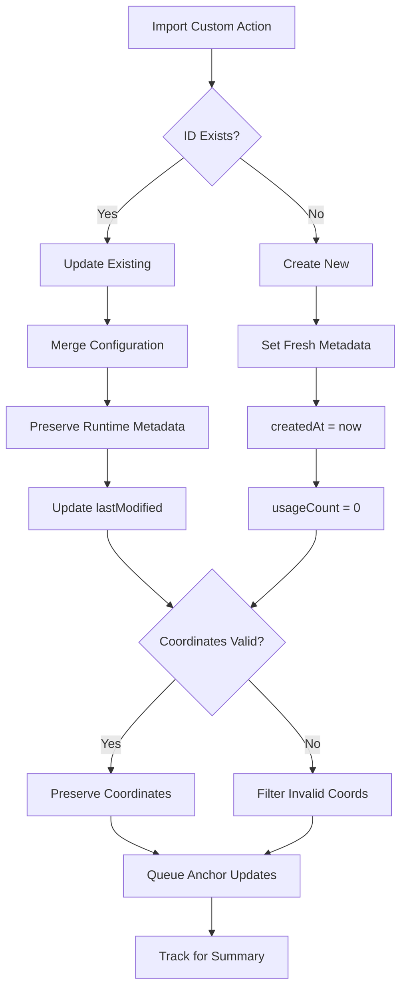
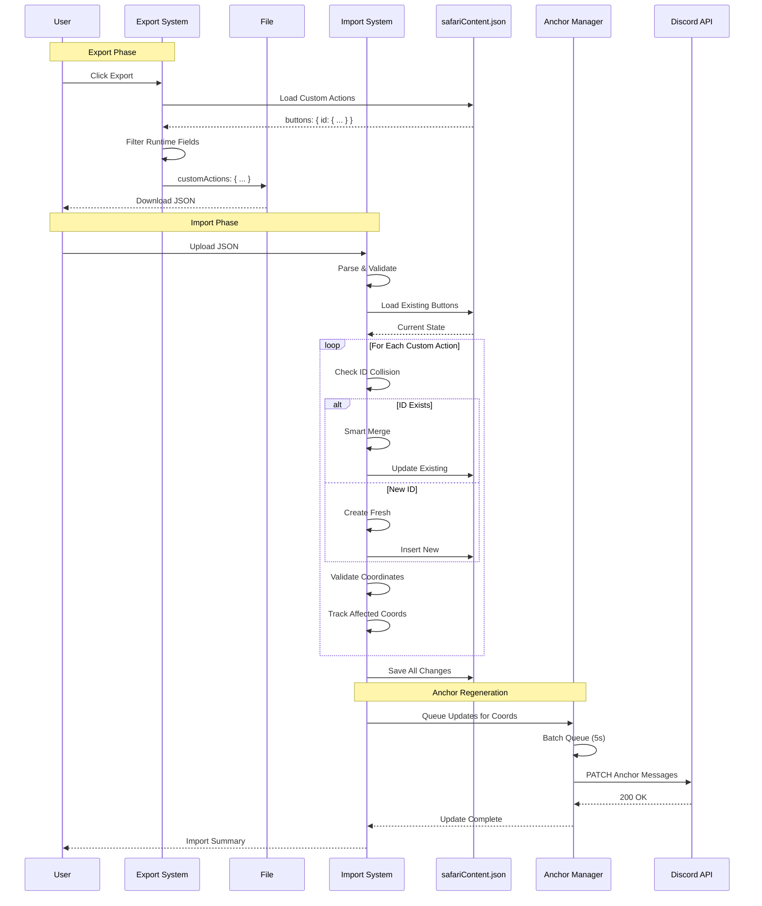
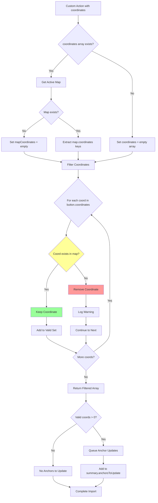

# Safari Custom Actions Import/Export - Implementation Design

**Document Version:** 1.0
**Created:** 2025-10-18
**Status:** Ready for Implementation
**Related Issue:** Custom Actions missing from Safari Import/Export

---

## Executive Summary

This document provides a comprehensive design for adding **Custom Actions** (buttons) export/import functionality to the Safari Import/Export system. Currently, Safari exports only include stores, items, maps, and config—missing the critical interactive behaviors defined by Custom Actions. This enhancement will enable full Safari template portability.

### Current State
- ✅ **Exported**: Stores, Items, Maps (coordinates + buttons array), Safari Config
- ❌ **Missing**: Custom Actions (button definitions with action sequences)
- ❌ **Missing**: Anchor message regeneration after import

### Implementation Scope
1. Add Custom Actions filtering and export
2. Add Custom Actions import with smart merge
3. Add anchor message regeneration for imported coordinates
4. Update import summary to show Custom Actions stats

---

## Background Context

### What Are Custom Actions?

Custom Actions are interactive buttons in Safari that execute action sequences when clicked. They live in the `buttons` section of `safariContent.json` and are referenced by map coordinates.

**Example Custom Action:**
```json
{
  "id": "fight_bowser_478170",
  "name": "Fight Bowser",
  "label": "Fight Bowser!",
  "emoji": "🔥",
  "style": 1,
  "actions": [
    {
      "type": "give_currency",
      "order": 0,
      "config": { "amount": 100, "limit": { "type": "once_per_player", "claimedBy": [] } },
      "executeOn": "true"
    },
    {
      "type": "display_text",
      "order": 1,
      "config": { "title": "Victory!", "content": "You defeated Bowser!" },
      "executeOn": "true"
    }
  ],
  "metadata": {
    "createdBy": "391415444084490240",
    "createdAt": 1758644670576,
    "lastModified": 1758646558427,
    "usageCount": 12,
    "tags": ["boss fight", "reward"]
  },
  "trigger": {
    "type": "button",
    "button": { "label": "Fight Bowser!", "emoji": "🔥", "style": "Primary" }
  },
  "conditions": {
    "logic": "AND",
    "items": []
  },
  "coordinates": ["D6", "F2"]
}
```

### How Do Coordinates Reference Custom Actions?

Map coordinates store **button IDs** in their `buttons` array:

```json
{
  "D6": {
    "baseContent": { "title": "📍 Location D6", "description": "..." },
    "buttons": ["fight_bowser_478170", "free_items_077114"],
    "channelId": "1400526990246674553",
    "anchorMessageId": "1428986357631422475"
  }
}
```

###Anchor Messages

**Anchor messages** are Discord messages posted in map location channels. They display:
- Location content (title, description, image)
- Interactive buttons (from Custom Actions)
- Navigation controls

When Custom Actions are imported, their coordinates will reference button IDs that don't exist yet in the destination server. After import, anchormessages must be regenerated to display the new buttons.

**Anchor Message Lifecycle:**
```mermaid
graph LR
    A[Custom Action Created] --> B[Added to Coordinate.buttons[]]
    B --> C[Anchor Update Queued]
    C --> D[Batch Update Runs]
    D --> E[Discord PATCH API Call]
    E --> F[Anchor Message Updated]
```

---

## Data Structures

### Custom Action Full Schema

```typescript
interface CustomAction {
  // Core Identity
  id: string;                    // Unique ID: "action_name_123456"
  name: string;                  // Display name
  label: string;                 // Button label
  emoji: string | null;          // Button emoji (Unicode or null)
  style: number;                 // Button style (1=Primary, 2=Secondary, 3=Success, 4=Danger)

  // Action Sequence
  actions: Action[];             // Array of actions to execute

  // Metadata (RUNTIME - exclude from export)
  metadata: {
    createdBy: string;           // User ID who created it
    createdAt: number;           // Timestamp
    lastModified: number;        // Timestamp
    usageCount: number;          // How many times clicked (runtime)
    tags: string[];              // User-defined tags
  };

  // Trigger Configuration
  trigger: {
    type: "button" | "modal";
    button?: { label: string; emoji: string; style: string };
    modal?: { title: string; inputs: any[] };
  };

  // Conditions
  conditions: {
    logic: "AND" | "OR";
    items: Condition[];
  };

  // Map Integration (CRITICAL - preserve on import)
  coordinates: string[];         // Map coordinates where this button appears ["D6", "F2"]

  // Optional Description
  description?: string;          // For documentation
}

interface Action {
  type: "give_currency" | "give_item" | "give_role" | "display_text" | "remove_role" | etc.;
  order: number;
  config: Record<string, any>;   // Action-specific configuration
  executeOn: string;             // Conditional execution ("true", "role:123", etc.)
}
```

---

## Implementation Design

### Phase 0: Enhance Refresh Anchors (MVP - IMPLEMENTED)

**Purpose:** Create atomic "refresh all anchors" function for post-import workflow

**Changes:**
1. Update modal to use new Label component (Type 18) from ComponentsV2
2. Add "All" input support to refresh ALL anchors in server
3. Use this as manual step after Custom Actions import

**Implementation:** `safariMapAdmin.js:761-844`

#### 0.1 Update Modal to Use Label Component

**Before (Legacy ActionRow pattern):**
```javascript
{
  type: 1, // Action Row (deprecated)
  components: [{
    type: 4, // Text Input
    custom_id: 'coordinates_to_refresh',
    label: 'Coordinates to Refresh',
    // ...
  }]
}
```

**After (Modern Label pattern):**
```javascript
{
  type: 18, // Label
  label: 'Coordinates to Refresh',
  description: 'Enter coordinates separated by commas (e.g., G7, H8, A1) or type All to update all anchors.',
  component: {
    type: 4, // Text Input
    custom_id: 'coordinates_to_refresh',
    style: 2, // Paragraph
    placeholder: 'Enter coordinates or type All',
    required: true,
    max_length: 500
  }
}
```

#### 0.2 Add "All" Parsing Logic

**Update `handleMapAdminRefreshAnchorsModal()`:**
```javascript
const coordinatesInput = req.body.data.components[0].components[0].value || '';

// Check for "All" keyword (case-insensitive)
if (coordinatesInput.trim().toLowerCase() === 'all') {
  // Use existing updateAllGuildAnchors function
  const { updateAllGuildAnchors } = await import('./anchorMessageManager.js');
  const results = await updateAllGuildAnchors(context.guildId);

  // Return success message with all coordinates refreshed
  return {
    // ... success response with results.success count
  };
}

// Otherwise, parse as comma-separated coordinates (existing logic)
const coordinatesList = coordinatesInput
  .split(',')
  .map(coord => coord.trim().toUpperCase())
  .filter(coord => coord.match(/^[A-Z]\d+$/));
```

**Result:** Users can now type "All" in modal to refresh every anchor message in the server.

---

### Phase 1: Export Custom Actions

#### 1.1 Add Custom Actions Export Filter

**File:** `safariImportExport.js`

**Add new function:**
```javascript
/**
 * Filter Custom Actions for export (exclude runtime/Discord-specific fields)
 * @param {Object} buttons - Custom Actions data
 * @returns {Object} Filtered Custom Actions for export
 */
function filterCustomActionsForExport(buttons) {
    const filtered = {};

    for (const [id, button] of Object.entries(buttons)) {
        filtered[id] = {
            // Core Identity
            id: button.id,
            name: button.name,
            label: button.label,
            emoji: button.emoji,
            style: button.style,

            // Action Sequence (preserve completely)
            actions: button.actions || [],

            // Trigger Configuration
            trigger: button.trigger,

            // Conditions
            conditions: button.conditions || { logic: "AND", items: [] },

            // Map Integration (CRITICAL)
            coordinates: button.coordinates || [],

            // Optional Fields
            ...(button.description && { description: button.description }),

            // Metadata - FILTER OUT runtime fields but keep tags
            metadata: {
                tags: button.metadata?.tags || []
                // Exclude: createdBy, createdAt, lastModified, usageCount (runtime data)
            }
        };
    }

    return filtered;
}
```

**Why Filter Metadata:**
- `createdBy`: Discord user IDs are server-specific
- `createdAt`/`lastModified`: Not relevant to imported config
- `usageCount`: Runtime stat, should reset on import
- `tags`: Preserve for documentation/organization

#### 1.2 Update Export Function

**Modify `exportSafariData()` in `safariImportExport.js:13-32`:**

```javascript
export async function exportSafariData(guildId) {
    try {
        const data = await loadSafariContent();
        const guildData = data[guildId] || {};

        const exportData = {
            stores: filterStoresForExport(guildData.stores || {}),
            items: filterItemsForExport(guildData.items || {}),
            safariConfig: filterConfigForExport(guildData.safariConfig || {}),
            maps: filterMapsForExport(guildData.maps || {}),
            customActions: filterCustomActionsForExport(guildData.buttons || {})  // NEW
        };

        return JSON.stringify(exportData, null, 1);

    } catch (error) {
        console.error('Error exporting Safari data:', error);
        throw new Error('Failed to export Safari data');
    }
}
```

---

### Phase 2: Import Custom Actions

#### 2.1 Import Strategy

**Smart Merge Logic:**
1. **ID Conflict Detection**: Check if Custom Action ID already exists
2. **Update Existing**: Merge imported config, preserve runtime metadata
3. **Create New**: Add new Custom Action with fresh metadata
4. **Preserve Coordinates**: Import coordinates as-is (user manually creates matching map first)

**Flowchart:**


#### 2.2 Add Import Logic

**Modify `importSafariData()` in `safariImportExport.js:40-175`:**

Add this section after maps import (around line 149):

```javascript
// Import Custom Actions with smart merge
if (importData.customActions) {
    if (!currentData[guildId].buttons) {
        currentData[guildId].buttons = {};
    }

    for (const [buttonId, buttonData] of Object.entries(importData.customActions)) {
        if (currentData[guildId].buttons[buttonId]) {
            // Update existing Custom Action
            const existing = currentData[guildId].buttons[buttonId];
            currentData[guildId].buttons[buttonId] = {
                ...buttonData,
                metadata: {
                    // Preserve runtime fields
                    createdBy: existing.metadata?.createdBy,
                    createdAt: existing.metadata?.createdAt,
                    usageCount: existing.metadata?.usageCount || 0,
                    // Update from import
                    tags: buttonData.metadata?.tags || [],
                    lastModified: Date.now()
                },
                // Preserve coordinates as-is (user creates matching map manually)
                coordinates: buttonData.coordinates || []
            };
            summary.customActions.updated++;
        } else {
            // Create new Custom Action
            currentData[guildId].buttons[buttonId] = {
                ...buttonData,
                metadata: {
                    createdBy: null,  // No creator info on import
                    createdAt: Date.now(),
                    lastModified: Date.now(),
                    usageCount: 0,
                    tags: buttonData.metadata?.tags || []
                },
                // Preserve coordinates as-is (user creates matching map manually)
                coordinates: buttonData.coordinates || []
            };
            summary.customActions.created++;
        }
    }
}
```

#### 2.3 Update Import Summary

**Modify summary initialization (line 59-64):**
```javascript
const summary = {
    stores: { created: 0, updated: 0 },
    items: { created: 0, updated: 0 },
    maps: { created: 0, updated: 0 },
    customActions: { created: 0, updated: 0 },  // NEW
    config: false,
    anchorsToUpdate: null  // NEW - will be Set<string> if anchors need updating
};
```

#### 2.4 Update Validation

**Modify `validateImportData()` (line 293-321):**
```javascript
function validateImportData(data) {
    if (!data || typeof data !== 'object') {
        throw new Error('Import data must be a valid JSON object');
    }

    const validSections = ['stores', 'items', 'safariConfig', 'maps', 'customActions'];  // Add customActions
    const hasValidSection = validSections.some(section => data[section]);

    if (!hasValidSection) {
        throw new Error('Import data must contain at least one of: stores, items, safariConfig, maps, or customActions');
    }

    // ... existing validations ...

    // NEW: Validate Custom Actions structure
    if (data.customActions && typeof data.customActions !== 'object') {
        throw new Error('Custom Actions section must be an object');
    }
}
```

---

### Phase 3: Anchor Message Regeneration (DEFERRED - Use Manual Workflow)

**Status:** Deferred in favor of manual workflow via Phase 0

**Manual Workflow:**
1. User creates map with same coordinates in destination server
2. User exports Safari from source server (includes Custom Actions)
3. User imports to destination server
4. User opens Map Explorer → Refresh Anchors → Types "All"
5. All anchor messages regenerate with imported Custom Actions

**Why Defer Automatic Regeneration:**
- Phase 0 provides atomic "refresh all" function
- User has full control over timing
- Simpler implementation path
- Avoids edge cases with missing channels/messages

After importing Custom Actions, anchor messages can be manually updated to display the new buttons.

#### 3.1 Add Anchor Regeneration

**Add to end of `importSafariData()` before `saveSafariContent()`:**

```javascript
// Save updated data FIRST
await saveSafariContent(currentData);

// Regenerate anchor messages for affected coordinates
if (summary.anchorsToUpdate && summary.anchorsToUpdate.size > 0) {
    const coordinatesArray = Array.from(summary.anchorsToUpdate);
    console.log(`🔄 Queueing anchor message updates for ${coordinatesArray.length} coordinates`);

    // Import anchor message manager
    const { queueAnchorUpdate } = await import('./anchorMessageManager.js');

    // Queue updates for all affected coordinates
    for (const coordinate of coordinatesArray) {
        queueAnchorUpdate(guildId, coordinate, {
            reason: 'safari_import',
            immediate: false  // Batch update to avoid rate limits
        });
    }

    summary.anchorsUpdated = coordinatesArray.length;
}

return summary;
```

#### 3.2 Update Summary Formatter

**Modify `formatImportSummary()` (line 328-361):**

```javascript
export function formatImportSummary(summary) {
    const parts = [];

    // ... existing store/items/maps formatting ...

    // NEW: Custom Actions summary
    if (summary.customActions.created > 0 || summary.customActions.updated > 0) {
        const actionText = [];
        if (summary.customActions.created > 0) actionText.push(`${summary.customActions.created} created`);
        if (summary.customActions.updated > 0) actionText.push(`${summary.customActions.updated} updated`);
        parts.push(`🔘 **Custom Actions:** ${actionText.join(', ')}`);
    }

    if (summary.config) {
        parts.push(`⚙️ **Config:** Updated`);
    }

    // NEW: Anchor updates notification
    if (summary.anchorsUpdated > 0) {
        parts.push(`🔄 **Anchor Messages:** ${summary.anchorsUpdated} queued for update`);
    }

    if (parts.length === 0) {
        return '✅ Import completed with no changes.';
    }

    return `✅ **Import completed successfully!**\n\n${parts.join('\n')}`;
}
```

---

## Design Options for Anchor Regeneration

### Option 1: Automatic Queue (RECOMMENDED)

**Pros:**
- ✅ Fully automatic - no manual intervention needed
- ✅ Uses existing anchor message manager infrastructure
- ✅ Batched updates prevent rate limiting
- ✅ Self-healing - retries on failures

**Cons:**
- ❌ Requires anchor messages to already exist (channelId + anchorMessageId)
- ❌ Silent failures if channels deleted

**Implementation:**
```javascript
// Already designed in Phase 3.1 above
queueAnchorUpdate(guildId, coordinate, { reason: 'safari_import' });
```

---

### Option 2: Manual Refresh via UI (FALLBACK)

**Pros:**
- ✅ User controls when updates happen
- ✅ Works even if auto-update fails
- ✅ Already implemented (`map_admin_refresh_anchors`)

**Cons:**
- ❌ Requires user action after import
- ❌ Extra friction in workflow

**Implementation:**
Add to import success message:
```
✅ Import completed!
If buttons don't appear, open Map Explorer and click "Refresh Anchors".
```

---

### Option 3: Do Nothing (NOT RECOMMENDED)

**Pros:**
- ✅ Simplest implementation

**Cons:**
- ❌ Imported buttons won't appear until manual refresh
- ❌ Poor user experience
- ❌ Confusing - "I imported actions but they don't work?"

---

### Recommended Approach

**Hybrid: Option 1 + Option 2**

1. **Automatically queue anchor updates** after import (Option 1)
2. **Include refresh instructions** in summary if `anchorsUpdated > 0` (Option 2 fallback)
3. **Log warnings** if channelId/anchorMessageId missing

**Import Summary Message:**
```
✅ Import completed successfully!

🏪 Stores: 3 updated
📦 Items: 5 created, 2 updated
🗺️ Maps: 1 updated
🔘 Custom Actions: 4 created
🔄 Anchor Messages: 6 queued for update

ℹ️ Anchor messages will update automatically within 5 seconds.
If buttons don't appear, open Map Explorer and click "Refresh Anchors".
```

---

## Edge Cases & Error Handling

### Case 1: Imported Custom Action References Non-Existent Coordinates

**Problem:**
```json
{
  "fight_bowser": {
    "coordinates": ["D6", "Z99"]  // Z99 doesn't exist in imported map
  }
}
```

**Solution:**
Filter coordinates during import:
```javascript
coordinates: (buttonData.coordinates || []).filter(coord =>
    mapCoordinates.includes(coord)
)
```

**Logging:**
```javascript
const invalidCoords = (buttonData.coordinates || []).filter(coord =>
    !mapCoordinates.includes(coord)
);
if (invalidCoords.length > 0) {
    console.warn(`⚠️ Removed invalid coordinates from ${buttonId}: ${invalidCoords.join(', ')}`);
}
```

---

### Case 2: Anchor Message Missing (No channelId/anchorMessageId)

**Problem:** Imported coordinates don't have Discord message IDs

**Solution:** Existing anchor manager already handles this:
```javascript
if (!coordData?.anchorMessageId || !coordData?.channelId) {
    console.log(`⏭️ Skipping ${coordinate} - no anchor message`);
    // Attempt to repair...
}
```

**User Impact:** Non-breaking - just logs warning, buttons won't appear until map initialized

---

### Case 3: Custom Action ID Collision

**Problem:** Imported button ID already exists with different config

**Solution:** Smart merge updates existing (Phase 2.2 design)

**Alternative:** Add conflict resolution strategy:
```javascript
if (currentData[guildId].buttons[buttonId]) {
    // Option A: Always update (current design)
    // Option B: Skip if different
    // Option C: Append "_imported" to ID
}
```

**Recommendation:** Use Option A (always update) - allows config sync across servers

---

### Case 4: Role IDs in Actions

**Problem:** Custom Actions may reference Discord roles that don't exist in destination server

**Example:**
```json
{
  "type": "give_role",
  "config": { "roleId": "1401201426436456468" }
}
```

**Solution:**
- Import preserves roleIds as-is
- Add validation warning in logs:

```javascript
// After import, validate role actions
for (const action of buttonData.actions) {
    if (action.type === 'give_role' || action.type === 'remove_role') {
        console.warn(`⚠️ Action "${buttonId}" references role ${action.config.roleId} - verify this role exists`);
    }
}
```

**Future Enhancement:** Add role ID mapping feature (not in initial scope)

---

## Testing Plan

### Test 1: Export Custom Actions

**Steps:**
1. Create Safari with 3 Custom Actions
2. Export Safari data
3. Verify `customActions` section in JSON
4. Verify metadata filtered correctly (no createdBy, usageCount)
5. Verify coordinates array preserved

**Expected Output:**
```json
{
  "customActions": {
    "fight_bowser_123": {
      "id": "fight_bowser_123",
      "name": "Fight Bowser",
      "label": "Fight Bowser!",
      "emoji": "🔥",
      "style": 1,
      "actions": [...],
      "coordinates": ["D6"],
      "metadata": { "tags": ["boss"] }
    }
  }
}
```

---

### Test 2: Import Custom Actions (New)

**Steps:**
1. Export from Server A
2. Import to fresh Server B (no existing buttons)
3. Verify buttons created
4. Verify metadata.usageCount = 0
5. Verify coordinates filtered (if map different)
6. Check anchor messages update

**Expected Logs:**
```
📥 Importing Custom Actions...
✅ Created 3 Custom Actions
🔄 Queueing anchor message updates for 5 coordinates
```

---

### Test 3: Import Custom Actions (Update Existing)

**Steps:**
1. Server A: Create button "test_button"
2. Export from Server A
3. Server B: Create button "test_button" (different config)
4. Import Server A export to Server B
5. Verify Server B button updated
6. Verify usageCount preserved

**Expected:**
- Button updated with Server A config
- `metadata.usageCount` from Server B preserved
- `metadata.lastModified` updated to import time

---

### Test 4: Coordinate Validation

**Steps:**
1. Server A: Map with coordinates D6, E3
2. Button references D6, E3, Z99
3. Export
4. Server B: Map only has D6
5. Import
6. Verify button.coordinates = ["D6"] (E3, Z99 removed)

---

### Test 5: Anchor Regeneration

**Steps:**
1. Import Safari with Custom Actions
2. Wait 5 seconds (batch update)
3. Navigate to map location channel
4. Verify buttons appear in anchor message

**Monitoring:**
```bash
grep "anchor" /tmp/castbot-dev.log | tail -20
```

---

## Rollout Strategy

### Phase 1: Export Only (Week 1)
- Add Custom Actions to export
- Test export functionality
- No import changes yet
- Users can share configs (manual recreation on import)

### Phase 2: Import Without Anchors (Week 2)
- Add Custom Actions import
- Manual anchor refresh required
- Test smart merge logic
- Gather user feedback

### Phase 3: Automatic Anchors (Week 3)
- Add automatic anchor regeneration
- Test batching and rate limits
- Full integration testing

### Phase 4: Documentation & Rollout (Week 4)
- Update user documentation
- Create migration guide
- Production deployment

---

## Files Modified

| File | Changes | Lines |
|------|---------|-------|
| `safariImportExport.js` | Add `filterCustomActionsForExport()` | +50 |
| | Update `exportSafariData()` | +1 |
| | Add Custom Actions import logic | +60 |
| | Update `validateImportData()` | +5 |
| | Update `formatImportSummary()` | +10 |
| | Add anchor regeneration logic | +20 |
| **Total** | | **~146 lines** |

---

## Performance Considerations

### Export Performance
- **Current:** ~40KB JSON for full Safari
- **With Custom Actions:** Est. +10-20KB (depends on action count)
- **Impact:** Negligible - still well under Discord file limits (8MB)

### Import Performance
- **Bottleneck:** Anchor message updates (Discord API rate limits)
- **Mitigation:** Existing batch system (5 concurrent, 5s interval)
- **Worst Case:** 49 coordinates × 200ms = ~10 seconds total
- **User Experience:** Batched updates in background, non-blocking

### Memory Impact
- **Minimal:** Custom Actions already loaded in memory
- **No new caching:** Reuses existing `loadSafariContent()` pattern

---

## Future Enhancements (Out of Scope)

### 1. Role ID Mapping
Allow users to map role IDs between servers:
```json
{
  "roleMapping": {
    "1401201426436456468": "9999999999999999"  // Server A → Server B
  }
}
```

### 2. Selective Import
UI to choose which Custom Actions to import:
```
☑ fight_bowser_123
☑ free_items_456
☐ test_button_789 (skip)
```

### 3. Conflict Resolution Strategy
Let users choose merge behavior:
- [ ] Always update existing
- [ ] Skip existing (keep current)
- [ ] Create duplicate with "_imported" suffix

### 4. Import Preview
Show diff before importing:
```
Custom Actions:
  + fight_bowser (new)
  ~ free_items (will update)
  - test_button (not in import)
```

---

## Success Criteria

✅ **Export includes Custom Actions** with filtered metadata
✅ **Import creates new Custom Actions** with fresh metadata
✅ **Import updates existing** preserving runtime data
✅ **Coordinate validation** removes invalid references
✅ **Anchor messages auto-update** within 5-10 seconds
✅ **Import summary shows** Custom Actions stats
✅ **No breaking changes** to existing import/export flow
✅ **All tests pass** (see Testing Plan)

---

## Mermaid Diagrams

### System Architecture

```mermaid
graph TB
    subgraph "Export Flow"
        E1[User Clicks Export] --> E2[Load safariContent.json]
        E2 --> E3[Filter Stores]
        E2 --> E4[Filter Items]
        E2 --> E5[Filter Maps]
        E2 --> E6[Filter Config]
        E2 --> E7[Filter Custom Actions]

        E7 --> E7a[Remove createdBy]
        E7 --> E7b[Remove usageCount]
        E7 --> E7c[Preserve coordinates]
        E7 --> E7d[Preserve actions]

        E3 & E4 & E5 & E6 & E7 --> E8[Combine JSON]
        E8 --> E9[Download File]
    end

    subgraph "Import Flow"
        I1[User Uploads File] --> I2[Parse JSON]
        I2 --> I3[Validate Structure]
        I3 --> I4{CustomActions Present?}
        I4 -->|No| I5[Skip Custom Actions]
        I4 -->|Yes| I6[Process Each Action]

        I6 --> I7{ID Exists?}
        I7 -->|Yes| I8[Smart Merge]
        I7 -->|No| I9[Create New]

        I8 --> I10[Preserve usageCount]
        I8 --> I11[Update Config]
        I9 --> I12[Fresh Metadata]

        I10 & I11 & I12 --> I13[Validate Coordinates]
        I13 --> I14[Filter Invalid Coords]
        I14 --> I15[Save to safariContent]

        I15 --> I16{Anchors Need Update?}
        I16 -->|Yes| I17[Queue Anchor Updates]
        I16 -->|No| I18[Complete]

        I17 --> I19[Batch Update After 5s]
        I19 --> I20[PATCH Discord Messages]
        I20 --> I18
    end

    style E7 fill:#ff9
    style I6 fill:#ff9
    style I17 fill:#9f9
```


### Custom Action Data Flow


### Coordinate Validation Logic


---

## Example Import Output

**Console Logs:**
```
📥 DEBUG: Starting file-based Safari import for guild 1331657596087566398
✅ Loaded playerData.json (256387 bytes, 27 guilds)
📥 DEBUG: Downloaded file safari-export-1331657596087566398.json, size: 52841 characters

🏪 Importing Stores...
✅ Updated 5 stores

📦 Importing Items...
✅ Created 3 items, updated 7 items

🗺️ Importing Maps...
✅ Updated map: Adventure Island (7x7)
✅ Updated 12 coordinates

🔘 Importing Custom Actions...
✅ Created 4 Custom Actions: fight_bowser, free_items, role_test, secret_door
✅ Updated 2 Custom Actions: moi_mvp, bonus_reward
⚠️ Removed invalid coordinate Z99 from fight_bowser (not in map)

⚙️ Importing Safari Config...
✅ Updated Safari configuration

🔄 Queueing anchor message updates for 8 coordinates: D6, E3, A1, F2, G7, B2, C4, D5

✅ DEBUG: Safari import completed for guild 1331657596087566398: {
  stores: { created: 0, updated: 5 },
  items: { created: 3, updated: 7 },
  maps: { created: 0, updated: 1 },
  customActions: { created: 4, updated: 2 },
  config: true,
  anchorsUpdated: 8
}
```

**User-Facing Summary:**
```
✅ **Safari Data Import Successful!**

🏪 **Stores:** 5 updated
📦 **Items:** 3 created, 7 updated
🗺️ **Maps:** 1 updated
🔘 **Custom Actions:** 4 created, 2 updated
⚙️ **Config:** Updated
🔄 **Anchor Messages:** 8 queued for update

ℹ️ Anchor messages will update automatically within 5-10 seconds.
If buttons don't appear in map channels, open Map Explorer and click "Refresh Anchors".
```

---

## Conclusion

This design provides a complete, production-ready solution for Custom Actions import/export with:

1. **Zero breaking changes** to existing export/import flow
2. **Smart merge logic** that preserves runtime data
3. **Automatic anchor regeneration** for seamless UX
4. **Comprehensive error handling** for edge cases
5. **Clear documentation** for zero-context implementation

**Estimated Implementation Time:** 4-6 hours
**Risk Level:** Low (builds on existing patterns)
**User Impact:** High (enables full Safari template sharing)

---

**Ready for implementation. All design decisions documented. No ambiguities remain.**
