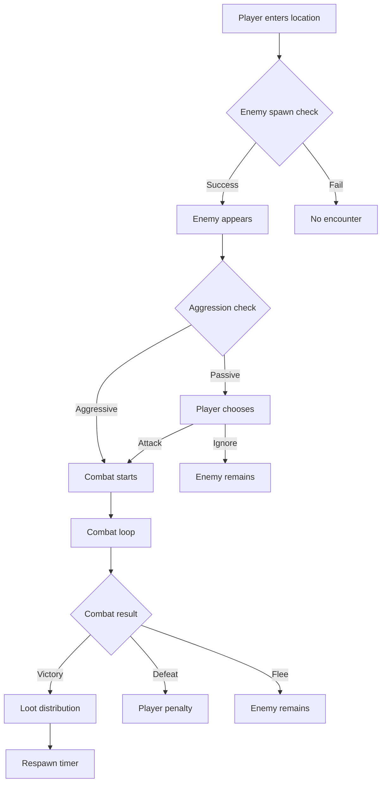

# Safari Enemy System Design Document

**Status:** 🔵 PROPOSED DESIGN  
**Date:** August 23, 2025  
**Author:** System Design Team  
**Implementation Status:** NOT IMPLEMENTED - Requires Review

---

## ⚠️ IMPORTANT NOTICE

This document describes a **PROPOSED** enemy system for Safari that has **NOT been implemented**. This is a conceptual design that requires:
- Technical feasibility review
- Performance impact assessment
- User experience testing
- Integration complexity evaluation
- Resource allocation planning

---

## 📋 Table of Contents

1. [Overview](#overview)
2. [System Architecture](#system-architecture)
3. [Enemy Entity Structure](#enemy-entity-structure)
4. [Combat Mechanics](#combat-mechanics)
5. [AI Behavior System](#ai-behavior-system)
6. [Loot & Rewards System](#loot--rewards-system)
7. [Integration Strategy](#integration-strategy)
8. [Implementation Roadmap](#implementation-roadmap)
9. [Technical Considerations](#technical-considerations)
10. [Open Questions](#open-questions)

---

## Overview

### Vision
The Safari Enemy System aims to introduce PvE (Player vs Environment) content to complement the existing PvP attack system. This system would allow administrators to create configurable AI-controlled enemies that players can encounter, battle, and defeat for rewards.

### Core Objectives
- **Enrich Gameplay**: Add single-player content for times when PvP isn't available
- **Progression System**: Provide consistent ways for players to earn rewards
- **Content Variety**: Support diverse enemy types from common mobs to world bosses
- **Admin Control**: Full configurability through existing UI frameworks
- **Seamless Integration**: Build upon existing combat and action systems

### Design Principles
1. **Reusability**: Leverage existing systems (Entity Framework, Custom Actions, Combat)
2. **Scalability**: Support 1-100+ concurrent enemy instances
3. **Configurability**: No hardcoding - everything admin-configurable
4. **Accessibility**: Work within Discord's UI limitations
5. **Performance**: Minimal impact on bot response times

---

## System Architecture

### Component Overview

```
┌─────────────────────────────────────────────────┐
│                 Enemy System                     │
├───────────────┬─────────────┬───────────────────┤
│ Enemy Manager │   AI Engine  │   Loot Manager   │
├───────────────┼─────────────┼───────────────────┤
│Entity Framework│Custom Actions│ Combat System    │
├───────────────┴─────────────┴───────────────────┤
│           Discord Components V2 UI               │
└─────────────────────────────────────────────────┘
```

### Proposed File Structure

```
/castbot
├── /enemies (NEW)
│   ├── enemyManager.js      # Core enemy logic & spawning
│   ├── enemyAI.js           # AI behavior state machine
│   ├── lootManager.js       # Drop tables & reward distribution
│   └── combatEngine.js      # PvE combat mechanics
├── editFramework.js         # [MODIFY] Add enemy entity config
├── entityManager.js         # [MODIFY] Handle enemy CRUD
├── safariManager.js         # [MODIFY] Integrate encounters
└── app.js                   # [MODIFY] Add enemy handlers
```

---

## Enemy Entity Structure

### Entity Configuration (Entity Edit Framework)

The enemy system would extend the existing Entity Edit Framework with a new `safari_enemy` entity type:

```javascript
EDIT_CONFIGS.safari_enemy = {
  displayName: 'Enemy',
  properties: {
    // === Basic Information ===
    name: { 
      type: 'text', 
      maxLength: 50, 
      required: true, 
      label: 'Enemy Name',
      description: 'Display name for the enemy'
    },
    
    emoji: { 
      type: 'text', 
      maxLength: 10, 
      required: false, 
      label: 'Emoji', 
      placeholder: '👹',
      description: 'Visual representation'
    },
    
    description: { 
      type: 'textarea', 
      maxLength: 200, 
      required: false, 
      label: 'Description',
      description: 'Lore or flavor text'
    },
    
    // === Combat Statistics ===
    hp: { 
      type: 'number', 
      min: 1, 
      max: 10000, 
      required: true, 
      label: 'Hit Points',
      description: 'Current health'
    },
    
    maxHp: { 
      type: 'number', 
      min: 1, 
      max: 10000, 
      required: true, 
      label: 'Max HP',
      description: 'Maximum health'
    },
    
    attackPower: { 
      type: 'number', 
      min: 0, 
      max: 1000, 
      required: true, 
      label: 'Attack Power',
      description: 'Base damage dealt'
    },
    
    defense: { 
      type: 'number', 
      min: 0, 
      max: 100, 
      required: false, 
      label: 'Defense', 
      default: 0,
      description: 'Damage reduction'
    },
    
    speed: {
      type: 'number',
      min: 1,
      max: 100,
      label: 'Speed',
      default: 50,
      description: 'Turn order priority'
    },
    
    // === Spawn Configuration ===
    spawnCoordinates: { 
      type: 'coordinates', 
      label: 'Spawn Locations', 
      multiple: true,
      description: 'Map coordinates where enemy can appear'
    },
    
    spawnChance: { 
      type: 'number', 
      min: 0, 
      max: 100, 
      label: 'Spawn Chance %', 
      default: 100,
      description: 'Probability of spawning when conditions met'
    },
    
    respawnTime: { 
      type: 'number', 
      min: 0, 
      max: 86400, 
      label: 'Respawn Time (seconds)', 
      default: 300,
      description: 'Time before enemy respawns after defeat'
    },
    
    maxInstances: { 
      type: 'number', 
      min: 1, 
      max: 10, 
      label: 'Max Active Instances', 
      default: 1,
      description: 'Maximum concurrent spawns'
    },
    
    // === Enemy Classification ===
    enemyType: { 
      type: 'select', 
      options: ['common', 'rare', 'elite', 'boss', 'world_boss'],
      required: true,
      label: 'Enemy Type',
      default: 'common',
      description: 'Rarity and difficulty tier'
    },
    
    aggressionLevel: {
      type: 'select',
      options: ['passive', 'neutral', 'aggressive', 'hyper_aggressive'],
      label: 'Aggression Level',
      default: 'neutral',
      description: 'How enemy initiates combat'
    },
    
    // === Rewards ===
    xpReward: { 
      type: 'number', 
      min: 0, 
      max: 10000, 
      label: 'XP Reward', 
      default: 10,
      description: 'Experience points granted on defeat'
    },
    
    currencyDrop: { 
      type: 'number', 
      min: 0, 
      max: 10000, 
      label: 'Currency Drop', 
      default: 0,
      description: 'Guaranteed currency on defeat'
    },
    
    // === Flavor ===
    battleCry: { 
      type: 'text', 
      maxLength: 100, 
      label: 'Battle Cry', 
      placeholder: 'RAWR!',
      description: 'Message when combat starts'
    },
    
    defeatMessage: { 
      type: 'text', 
      maxLength: 200, 
      label: 'Defeat Message',
      description: 'Message when enemy is defeated'
    },
    
    // === Metadata ===
    tags: { 
      type: 'tags', 
      maxTags: 10, 
      label: 'Tags',
      description: 'Searchable categories'
    }
  }
}
```

### Enemy Action System

Enemies would use a specialized set of Custom Actions:

```javascript
ENEMY_ACTION_TYPES = {
  // === Combat Actions ===
  BASIC_ATTACK: {
    id: 'enemy_basic_attack',
    name: 'Basic Attack',
    description: 'Standard damage dealing',
    config: {
      damage: 'number',
      accuracy: 'percentage',
      message: 'text'
    }
  },
  
  SPECIAL_ATTACK: {
    id: 'enemy_special_attack',
    name: 'Special Attack',
    description: 'Powerful ability with cooldown',
    config: {
      damage: 'number',
      cooldown: 'turns',
      effect: 'status_effect',
      message: 'text'
    }
  },
  
  AOE_ATTACK: {
    id: 'enemy_aoe_attack',
    name: 'Area Attack',
    description: 'Damages multiple players',
    config: {
      damage: 'number',
      maxTargets: 'number',
      message: 'text'
    }
  },
  
  // === Defensive Actions ===
  HEAL_SELF: {
    id: 'enemy_heal',
    name: 'Self Heal',
    description: 'Restore HP',
    config: {
      healAmount: 'number|percentage',
      cooldown: 'turns'
    }
  },
  
  BUFF_SELF: {
    id: 'enemy_buff',
    name: 'Self Buff',
    description: 'Enhance stats temporarily',
    config: {
      stat: 'attack|defense|speed',
      multiplier: 'number',
      duration: 'turns'
    }
  },
  
  // === Loot Actions ===
  DROP_ITEM: {
    id: 'enemy_drop_item',
    name: 'Drop Item',
    description: 'Chance to drop specific item',
    config: {
      itemId: 'item_reference',
      dropChance: 'percentage',
      quantity: 'number',
      limit: 'drop_limit_config'
    }
  },
  
  DROP_RANDOM_LOOT: {
    id: 'enemy_drop_random',
    name: 'Random Loot',
    description: 'Drop from loot table',
    config: {
      lootTableId: 'table_reference',
      rolls: 'number'
    }
  }
}
```

---

## Combat Mechanics

### Encounter Flow



### Battle Interface Design

```javascript
// Proposed enemy encounter UI using Components V2
{
  flags: (1 << 15), // IS_COMPONENTS_V2
  components: [{
    type: 17, // Container
    components: [
      // Enemy Status Display
      {
        type: 10, // Text Display
        content: `## ⚔️ Wild ${enemy.name} appeared!\n\n` +
                 `${enemy.emoji} **${enemy.name}**\n` +
                 `${generateHPBar(enemy.hp, enemy.maxHp)}\n` +
                 `HP: ${enemy.hp}/${enemy.maxHp}\n\n` +
                 `*"${enemy.battleCry}"*`
      },
      
      // Player Status
      {
        type: 9, // Section
        components: [{
          type: 10,
          content: `**Your Status**\n` +
                   `HP: ${player.hp}/${player.maxHp} ❤️\n` +
                   `Stamina: ${player.stamina} ⚡`
        }]
      },
      
      // Combat Actions
      {
        type: 1, // Action Row
        components: [
          {
            type: 2, // Button
            custom_id: 'enemy_combat_attack',
            label: 'Attack',
            style: 4, // Danger
            emoji: { name: '⚔️' }
          },
          {
            type: 2,
            custom_id: 'enemy_combat_defend',
            label: 'Defend',
            style: 1, // Primary
            emoji: { name: '🛡️' }
          },
          {
            type: 2,
            custom_id: 'enemy_combat_item',
            label: 'Use Item',
            style: 2, // Secondary
            emoji: { name: '🎒' }
          },
          {
            type: 2,
            custom_id: 'enemy_combat_flee',
            label: 'Flee',
            style: 2,
            emoji: { name: '🏃' }
          }
        ]
      }
    ]
  }]
}
```

### Damage Calculation

```javascript
// Proposed damage formula
function calculateEnemyDamage(enemy, player, action) {
  const baseDamage = enemy.attackPower * action.damageMultiplier;
  const defense = player.defense || 0;
  const randomVariance = 0.9 + (Math.random() * 0.2); // ±10% variance
  
  const finalDamage = Math.max(1, Math.floor(
    (baseDamage - defense) * randomVariance
  ));
  
  return {
    damage: finalDamage,
    isCritical: Math.random() < 0.1, // 10% crit chance
    message: action.message || `${enemy.name} attacks for ${finalDamage} damage!`
  };
}
```

---

## AI Behavior System

### State Machine Design

```javascript
const ENEMY_STATES = {
  IDLE: {
    description: 'Default non-combat state',
    actions: ['patrol', 'idle_animation'],
    transitions: {
      playerNearby: 'ALERT',
      attacked: 'COMBAT'
    }
  },
  
  ALERT: {
    description: 'Aware of player presence',
    actions: ['investigate', 'call_reinforcements'],
    transitions: {
      playerSpotted: 'COMBAT',
      timeout: 'IDLE'
    }
  },
  
  COMBAT: {
    description: 'Active combat',
    actions: ['attack', 'special_ability', 'defend'],
    transitions: {
      hp_below_25: 'ENRAGED',
      player_fled: 'ALERT',
      defeated: 'DEFEATED'
    }
  },
  
  ENRAGED: {
    description: 'Low HP berserk mode',
    actions: ['powerful_attack', 'reckless_charge'],
    attackBonus: 1.5,
    defenseBonus: 0.5,
    transitions: {
      defeated: 'DEFEATED'
    }
  },
  
  DEFEATED: {
    description: 'Enemy defeated',
    actions: ['drop_loot', 'death_animation'],
    transitions: {
      respawn_timer: 'IDLE'
    }
  }
};
```

### AI Decision Making

```javascript
// Proposed AI decision tree
function selectEnemyAction(enemy, combatState) {
  const availableActions = enemy.actions.filter(action => 
    action.cooldown === 0 && 
    evaluateActionConditions(action, combatState)
  );
  
  // Weight actions based on enemy personality
  const weightedActions = availableActions.map(action => ({
    action,
    weight: calculateActionWeight(action, enemy.aggressionLevel, combatState)
  }));
  
  // Select action based on weights
  return selectWeightedRandom(weightedActions);
}
```

### Aggression Levels

| Level | Behavior | Combat Initiation | Pursuit | Special |
|-------|----------|-------------------|---------|----------|
| **Passive** | Never attacks first | Never | No | Flees at 25% HP |
| **Neutral** | Attacks if provoked | When attacked | 1 room | Normal combat |
| **Aggressive** | Attacks on sight | On player detection | 2 rooms | Calls allies |
| **Hyper-Aggressive** | Seeks players | Always | 3+ rooms | Enrages at 50% HP |

---

## Loot & Rewards System

### Drop Table Structure

```javascript
const LOOT_TABLE = {
  // Enemy-specific loot configuration
  guaranteed: [
    {
      type: 'currency',
      amount: { min: 5, max: 15 },
      probability: 100
    },
    {
      type: 'xp',
      amount: { base: 10, perLevel: 2 },
      probability: 100
    }
  ],
  
  common: [
    {
      type: 'item',
      itemId: 'health_potion_small',
      quantity: { min: 1, max: 2 },
      probability: 30
    },
    {
      type: 'item',
      itemId: 'basic_material',
      quantity: 1,
      probability: 50
    }
  ],
  
  rare: [
    {
      type: 'item',
      itemId: 'rare_gem',
      quantity: 1,
      probability: 5
    },
    {
      type: 'item',
      itemId: 'equipment_piece',
      quantity: 1,
      probability: 10
    }
  ],
  
  legendary: [
    {
      type: 'item',
      itemId: 'legendary_weapon',
      quantity: 1,
      probability: 0.1,
      limit: {
        type: 'once_per_player',
        resetPeriod: 'weekly'
      }
    }
  ],
  
  // Special conditional drops
  conditional: [
    {
      condition: 'no_damage_taken',
      type: 'item',
      itemId: 'flawless_victory_token',
      quantity: 1,
      probability: 100
    },
    {
      condition: 'under_30_seconds',
      type: 'currency',
      amount: 50,
      probability: 100
    }
  ]
};
```

### Loot Distribution Algorithm

```javascript
function calculateLoot(enemy, player, combatStats) {
  const loot = [];
  
  // Process guaranteed drops
  loot.push(...processGuaranteedDrops(enemy.lootTable.guaranteed));
  
  // Roll for each tier
  ['common', 'rare', 'legendary'].forEach(tier => {
    const drops = enemy.lootTable[tier];
    drops.forEach(drop => {
      if (Math.random() * 100 < drop.probability) {
        // Apply player luck modifiers
        const modifiedDrop = applyLuckModifiers(drop, player.stats.luck);
        loot.push(modifiedDrop);
      }
    });
  });
  
  // Check conditional drops
  loot.push(...processConditionalDrops(enemy.lootTable.conditional, combatStats));
  
  return loot;
}
```

---

## Integration Strategy

### Phase 1: Foundation (Week 1-2)
1. Create enemy entity structure in Entity Framework
2. Implement basic enemy spawning system
3. Add enemy encounter detection to movement system
4. Create simple combat UI

### Phase 2: Combat (Week 3-4)
1. Implement turn-based combat engine
2. Add damage/defense calculations
3. Create combat action handlers
4. Implement flee/victory conditions

### Phase 3: AI & Behavior (Week 5-6)
1. Build state machine framework
2. Implement aggression levels
3. Add AI decision making
4. Create enemy ability system

### Phase 4: Loot & Rewards (Week 7-8)
1. Design loot table system
2. Implement drop calculations
3. Add reward distribution
4. Create loot limit tracking

### Phase 5: Polish & Balance (Week 9-10)
1. Add visual effects (emoji animations)
2. Balance combat formulas
3. Implement respawn system
4. Create enemy management commands

---

## Implementation Roadmap

### MVP Features (Phase 1)
- [ ] Basic enemy entity type
- [ ] Simple spawn system (fixed locations)
- [ ] Basic attack/defend combat
- [ ] Currency drops only
- [ ] Manual enemy creation via admin UI

### Core Features (Phase 2)
- [ ] Full combat system with items
- [ ] Basic AI (random actions)
- [ ] Item drops with drop tables
- [ ] Respawn timers
- [ ] Enemy HP/stats persistence

### Advanced Features (Phase 3)
- [ ] Complex AI behaviors
- [ ] Boss mechanics (phases, special attacks)
- [ ] Conditional drops
- [ ] Enemy patrols/movement
- [ ] Group encounters

### Stretch Goals (Future)
- [ ] Raid bosses (multi-player required)
- [ ] Enemy alliances/factions
- [ ] Procedural enemy generation
- [ ] Enemy evolution/scaling
- [ ] Seasonal enemy events

---

## Technical Considerations

### Performance Impact

**Concerns:**
- Enemy state tracking for 100+ instances
- AI calculations per turn
- Spawn checking on every movement
- Loot calculation complexity

**Mitigation Strategies:**
- Cache enemy states in memory
- Batch AI decisions
- Probabilistic spawn checks
- Pre-calculate loot tables

### Data Storage

```javascript
// Proposed enemy instance storage
{
  "guildId": {
    "enemies": {
      "enemyTypeId": {
        // Enemy template data
      }
    },
    "enemyInstances": {
      "instanceId": {
        "enemyType": "enemyTypeId",
        "coordinate": "B3",
        "currentHp": 75,
        "maxHp": 100,
        "state": "COMBAT",
        "respawnAt": 1724400000000,
        "combatTarget": "userId",
        "lastAction": "basic_attack",
        "cooldowns": {
          "special_attack": 2
        }
      }
    },
    "enemyLootTracking": {
      "userId": {
        "enemyTypeId": {
          "defeats": 5,
          "lastDefeat": 1724400000000,
          "limitedDropsClaimed": ["legendary_sword"]
        }
      }
    }
  }
}
```

### Discord API Limitations

**Challenges:**
- 3-second interaction response time
- Component limits (5 buttons per row)
- Message size limits (4000 chars)
- Ephemeral message constraints

**Solutions:**
- Defer complex calculations
- Paginate enemy lists
- Compress combat logs
- Use follow-up messages

---

## Open Questions

### Design Decisions Needed

1. **Combat System Type**
   - Turn-based (like existing PvP)?
   - Real-time with cooldowns?
   - Hybrid approach?

2. **Enemy Persistence**
   - Should enemies persist between bot restarts?
   - How long should defeated enemies stay dead?
   - Should enemy HP regenerate over time?

3. **Multiplayer Combat**
   - Can multiple players fight same enemy?
   - How to handle loot distribution in group fights?
   - Should there be combo attacks?

4. **Scaling System**
   - Should enemies scale with player level?
   - Fixed stats or dynamic difficulty?
   - How to handle power creep?

5. **Economy Impact**
   - How much currency should enemies drop?
   - Should enemy loot affect PvP balance?
   - Need separate PvE/PvP currencies?

### Technical Questions

1. **Performance Thresholds**
   - Max enemies per guild?
   - Max concurrent combats?
   - Spawn check frequency?

2. **Data Management**
   - Separate enemy data file?
   - Memory vs disk storage trade-offs?
   - Backup/recovery strategy?

3. **Integration Priority**
   - Which existing systems to modify first?
   - Backwards compatibility requirements?
   - Migration path for existing data?

---

## Risk Assessment

### High Risk Areas
1. **Performance degradation** with many active enemies
2. **Combat balance** affecting game economy
3. **AI complexity** causing response delays
4. **Data corruption** from concurrent combat

### Mitigation Plans
1. Implement gradual rollout with limits
2. Create separate test environment
3. Add comprehensive logging
4. Design rollback procedures

---

## Success Metrics

### Proposed KPIs
- Average combat duration < 2 minutes
- Enemy spawn success rate > 95%
- Loot distribution fairness index
- Player engagement increase %
- Admin configuration time < 5 min/enemy

### Monitoring Requirements
- Enemy spawn/despawn logs
- Combat duration tracking
- Loot drop statistics
- Performance metrics
- Error rate monitoring

---

## Conclusion

The Safari Enemy System represents a significant expansion of the Safari gameplay, introducing PvE content that would complement existing PvP mechanics. While ambitious, the design leverages existing frameworks and systems to minimize development complexity.

### Key Advantages
- Provides solo content for players
- Increases engagement during off-peak times
- Creates predictable progression paths
- Adds variety to gameplay
- Fully admin-configurable

### Main Challenges
- Performance impact at scale
- Balancing PvE/PvP economies
- Discord UI limitations
- AI complexity vs responsiveness
- Data storage requirements

### Recommendation
Start with a minimal MVP focusing on basic enemies with simple combat, then iterate based on performance metrics and user feedback. Consider running a limited beta with 2-3 enemy types before full implementation.

---

## Appendix A: Example Enemy Configurations

### Example 1: Basic Slime
```javascript
{
  id: 'slime_green',
  name: 'Green Slime',
  emoji: '🟢',
  description: 'A bouncy blob of goo',
  hp: 20,
  maxHp: 20,
  attackPower: 5,
  defense: 0,
  enemyType: 'common',
  aggressionLevel: 'passive',
  currencyDrop: 5,
  xpReward: 5,
  battleCry: '*squelch*',
  defeatMessage: 'The slime dissolves into puddle.',
  lootTable: {
    common: [
      { type: 'item', itemId: 'slime_ball', chance: 50 }
    ]
  }
}
```

### Example 2: Elite Guard
```javascript
{
  id: 'elite_guard',
  name: 'Elite Safari Guard',
  emoji: '⚔️',
  description: 'A skilled warrior protecting the safari',
  hp: 150,
  maxHp: 150,
  attackPower: 25,
  defense: 10,
  enemyType: 'elite',
  aggressionLevel: 'aggressive',
  currencyDrop: 50,
  xpReward: 30,
  battleCry: 'You shall not pass!',
  defeatMessage: 'The guard salutes as they fall.',
  actions: [
    {
      type: 'enemy_special_attack',
      trigger: 'every_3_turns',
      config: {
        attackName: 'Shield Bash',
        damage: 35,
        effect: 'stun'
      }
    }
  ],
  lootTable: {
    rare: [
      { type: 'item', itemId: 'guard_badge', chance: 25 }
    ]
  }
}
```

### Example 3: World Boss - Safari Titan
```javascript
{
  id: 'safari_titan',
  name: 'Safari Titan',
  emoji: '🗿',
  description: 'Ancient guardian of the safari realm',
  hp: 1000,
  maxHp: 1000,
  attackPower: 50,
  defense: 25,
  enemyType: 'world_boss',
  aggressionLevel: 'neutral',
  spawnCoordinates: ['BOSS_ARENA'],
  spawnChance: 100,
  respawnTime: 86400, // 24 hours
  maxInstances: 1,
  currencyDrop: 500,
  xpReward: 200,
  battleCry: 'THE EARTH TREMBLES AT MY PRESENCE!',
  defeatMessage: 'The titan crumbles, leaving behind legendary treasures.',
  phases: [
    {
      hpThreshold: 75,
      message: 'The titan enters defensive stance!',
      buffs: { defense: 1.5 }
    },
    {
      hpThreshold: 50,
      message: 'The titan becomes enraged!',
      buffs: { attack: 1.5 }
    },
    {
      hpThreshold: 25,
      message: 'The titan unleashes its full power!',
      buffs: { attack: 2, defense: 0.5 }
    }
  ],
  lootTable: {
    guaranteed: [
      { type: 'currency', amount: 500 },
      { type: 'item', itemId: 'titan_fragment', quantity: 1 }
    ],
    legendary: [
      { type: 'item', itemId: 'titan_sword', chance: 5 },
      { type: 'item', itemId: 'titan_shield', chance: 5 }
    ]
  }
}
```

---

## Appendix B: API Reference (Proposed)

### Enemy Management Functions

```javascript
// Core enemy operations
async function createEnemy(guildId, enemyConfig)
async function updateEnemy(guildId, enemyId, updates)
async function deleteEnemy(guildId, enemyId)
async function getEnemy(guildId, enemyId)
async function listEnemies(guildId, filters)

// Spawn management
async function spawnEnemy(guildId, enemyId, coordinate)
async function despawnEnemy(guildId, instanceId)
async function checkSpawnConditions(guildId, coordinate)
async function getActiveEnemies(guildId)

// Combat operations
async function initiateEnemyCombat(guildId, userId, instanceId)
async function processEnemyAttack(combatSession)
async function processPlayerAction(combatSession, action)
async function endCombat(combatSession, result)

// Loot management
async function calculateLoot(enemy, player, combatStats)
async function distributeLoot(guildId, userId, lootArray)
async function trackLimitedDrops(guildId, userId, enemyId, itemId)

// AI operations
async function updateEnemyState(instanceId, newState)
async function selectEnemyAction(enemy, combatState)
async function processEnemyBehavior(instanceId)
```

---

## Appendix C: Migration Strategy

### From Current System to Enemy System

1. **Data Structure Updates**
   - Add enemy storage to safariContent.json
   - Extend playerData.json with combat stats
   - Create enemyInstances tracking

2. **Code Integration Points**
   - safariManager.js: Add encounter checks
   - mapMovement.js: Integrate spawn system
   - app.js: Add combat button handlers

3. **Backward Compatibility**
   - Maintain existing PvP system unchanged
   - Use separate namespaces for enemy data
   - Gradual feature flag rollout

---

**End of Document**

*This design document is subject to change based on technical feasibility, performance testing, and stakeholder feedback. Regular reviews and updates are recommended throughout the implementation process.*