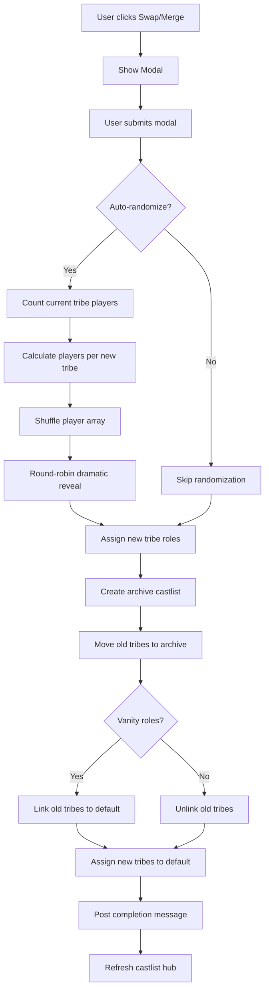

# Tribe Swap/Merge System

## Overview

**Status**: 🟢 IMPLEMENTATION READY
**Created**: November 2024
**Purpose**: Enable dramatic tribe swaps and merges with automatic role assignment and castlist archival

This feature allows production members to create exciting tribe swap moments by:
- Archiving current tribes to a named castlist (point-in-time snapshot)
- Creating new tribe roles and randomly assigning players
- Revealing assignments one-by-one with dramatic 15-second pauses
- Optionally maintaining old tribe roles as "vanity" indicators on new castlist

## User Requirements (Verbatim)

> Given a user selects the default Castlist from castlist_select, enable the Swap/Merge button
> Given the user clicks the Swap/Merge button, show a Modal with:
> - Role Select "Select the roles of the new tribe(s) your existing tribes will be swapping / merging into"
> - Text Input "Archive Castlist Name" - "Give a name for your current tribes (e.g. OG Tribes, Swap 1 tribes)"
> - String select "Create Vanity Roles" - Yes/No - "Makes the previous tribe role visible on the new castlist"
> - String select "Have CastBot randomize swap" - Yes - Automate via CastBot / No - Swap Manually
> - String select "Odd Player Number Behaviour" - "Randomise odd player into a tribe" / "Manually handle"
>
> On save:
> * Count players in all tribe roles, divide by new tribe count
> * Create dramatic reveal messages (round-robin style, 15 second pauses)
> * Assign new tribe roles to players
> * Create archive castlist with old tribes
> * Move new tribes to default castlist
> * If vanity enabled, keep old tribe roles visible on new castlist
> * Post completion message, refresh hub

## User Flow

### Step 1: Enable Button
```
Production Menu → Castlists → Select "Default" Castlist
→ Swap/Merge button becomes enabled (previously disabled/hidden)
```

### Step 2: Configure Swap
```
Click "Swap/Merge" button
→ Modal appears with 5 inputs:
   1. Role Select: Choose new tribe roles (multi-select, 2-10 roles)
   2. Text Input: Archive castlist name (e.g., "OG Tribes", "Pre-Merge")
   3. String Select: Vanity roles? (Yes/No)
   4. String Select: Auto-randomize? (Yes - Automate / No - Manual)
   5. String Select: Odd player handling (Randomise / Manually handle)
```

### Step 3: Dramatic Reveal (If Auto-Randomize = Yes)
```
Public channel message sequence:
"🎭 TRIBE SWAP CEREMONY 🎭"
(15 second pause)
"🔥 NewTribeA... ERIK!"
(15 second pause)
"💧 NewTribeB... LISA!"
(15 second pause)
"🔥 NewTribeA... SUSHANT!"
... continues round-robin until all players assigned
```

### Step 4: Backend Processing
```
1. Archive old tribes:
   - Create new castlist: "OG Tribes"
   - Move OldTribeA, OldTribeB, OldTribeC to archive castlist
   - Players keep old tribe roles (Discord roles unchanged)

2. Create new tribes:
   - Add NewTribeA, NewTribeB to default castlist
   - Assign new tribe roles to players based on reveal

3. Vanity roles (if enabled):
   - Link old tribe roles to new default castlist
   - Players now have BOTH old and new tribe roles
   - Old tribes show on castlist as "vanity" indicators

4. Complete:
   - Post "✅ Swap complete!" message
   - Refresh castlist hub UI
```

## Technical Design

### Modal Structure (Components V2 Compliant)

```javascript
{
  type: 9, // MODAL
  data: {
    custom_id: 'tribe_swap_merge_modal',
    title: 'Tribe Swap/Merge',
    components: [
      // 1. Role Select (NEW! Supported as of Sept 2025)
      {
        type: 18, // Label
        label: 'New Tribe Roles',
        description: 'Select 2+ roles that will become your new tribes',
        component: {
          type: 6, // Role Select
          custom_id: 'new_tribe_roles',
          placeholder: 'Choose new tribe roles...',
          min_values: 2,
          max_values: 10 // Reasonable limit
        }
      },
      // 2. Archive Castlist Name
      {
        type: 18, // Label
        label: 'Archive Castlist Name',
        description: 'Name for archived tribes (e.g., "OG Tribes", "Pre-Merge")',
        component: {
          type: 4, // Text Input
          custom_id: 'archive_name',
          style: 1, // Short
          placeholder: 'Pre-Swap Tribes',
          max_length: 50,
          required: true
        }
      },
      // 3. Vanity Roles
      {
        type: 18, // Label
        label: 'Create Vanity Roles?',
        description: 'Keep old tribe roles visible on new castlist',
        component: {
          type: 3, // String Select
          custom_id: 'vanity_roles',
          options: [
            {
              label: 'Yes - Keep old tribes visible',
              value: 'yes',
              description: 'Players show both old and new tribes',
              emoji: { name: '✅' }
            },
            {
              label: 'No - Hide old tribes',
              value: 'no',
              description: 'Only new tribes visible',
              emoji: { name: '❌' }
            }
          ]
        }
      },
      // 4. Auto-Randomize
      {
        type: 18, // Label
        label: 'Have CastBot Randomize Swap?',
        description: 'Automatic random assignment with dramatic reveal',
        component: {
          type: 3, // String Select
          custom_id: 'auto_randomize',
          options: [
            {
              label: 'Yes - Automate via CastBot',
              value: 'yes',
              description: 'Dramatic 15-second reveal sequence',
              emoji: { name: '🎭' }
            },
            {
              label: 'No - Swap Manually',
              value: 'no',
              description: 'Manually assign roles after creation',
              emoji: { name: '✋' }
            }
          ]
        }
      },
      // 5. Odd Player Behaviour
      {
        type: 18, // Label
        label: 'Odd Player Number Behaviour',
        description: 'What to do if players don\'t divide evenly',
        component: {
          type: 3, // String Select
          custom_id: 'odd_player_behaviour',
          options: [
            {
              label: 'Randomise odd player into a tribe',
              value: 'randomise',
              description: 'CastBot assigns extra players randomly',
              emoji: { name: '🎲' }
            },
            {
              label: 'Manually handle',
              value: 'manual',
              description: 'You assign extra players later',
              emoji: { name: '✋' }
            }
          ]
        }
      }
    ]
  }
}
```

### Data Flow



### Algorithm: Round-Robin Reveal

```javascript
// Input: players array, newTribes array
// Output: assignments { tribeRoleId: [playerIds] }

function performRoundRobinReveal(players, newTribes, channel) {
  const shuffled = shuffleArray([...players]);
  const assignments = {};
  newTribes.forEach(tribe => assignments[tribe.roleId] = []);

  let currentTribeIndex = 0;

  for (const player of shuffled) {
    const tribe = newTribes[currentTribeIndex];

    // Post dramatic reveal
    await postRevealMessage(channel, tribe, player);

    // Wait 15 seconds
    await delay(15000);

    // Assign
    assignments[tribe.roleId].push(player.id);

    // Next tribe (round-robin)
    currentTribeIndex = (currentTribeIndex + 1) % newTribes.length;
  }

  return assignments;
}
```

### Odd Player Handling

**Scenario**: 13 players, 2 new tribes
- Base: 13 / 2 = 6 players per tribe (floor division)
- Remainder: 13 % 2 = 1 odd player

**Behaviour Options**:
1. **Randomise**: Odd player goes to random tribe (one tribe gets 7, other gets 6)
2. **Manual**: Odd player not assigned, admin assigns later

**Implementation**:
```javascript
const basePerTribe = Math.floor(totalPlayers / newTribes.length);
const remainderPlayers = totalPlayers % newTribes.length;

if (oddPlayerBehaviour === 'randomise') {
  // Round-robin naturally handles this - some tribes get +1
  // Example: 13 players, 2 tribes → 7, 6
} else if (oddPlayerBehaviour === 'manual') {
  // Stop reveal early, leave last N players unassigned
  const playersToAssign = shuffled.slice(0, basePerTribe * newTribes.length);
  const unassignedPlayers = shuffled.slice(basePerTribe * newTribes.length);

  // Reveal assigned players only
  // Post message: "⏸️ Remaining {N} players awaiting manual assignment"
}
```

## Implementation Details

### File Changes

#### 1. `castlistHub.js` - Add Button
```javascript
// In button array for default castlist
{
  type: 2, // Button
  custom_id: 'castlist_swap_merge',
  label: 'Swap/Merge',
  emoji: { name: '🔄' },
  style: 2, // Secondary
  disabled: false // Only enabled when default castlist selected
}
```

#### 2. `buttonHandlerFactory.js` - Register Button
```javascript
'castlist_swap_merge': {
  label: 'Swap/Merge Tribes',
  description: 'Create dramatic tribe swap with role assignment',
  emoji: '🔄',
  style: 'Secondary',
  category: 'castlist',
  parent: 'castlist_hub_main'
}
```

#### 3. `app.js` - Button Handler (Shows Modal)
```javascript
} else if (custom_id === 'castlist_swap_merge') {
  return ButtonHandlerFactory.create({
    id: 'castlist_swap_merge',
    requiresPermission: PermissionFlagsBits.ManageRoles,
    permissionName: 'Manage Roles',
    handler: async (context) => {
      // Return modal
      return {
        type: 9, // MODAL
        data: {
          custom_id: 'tribe_swap_merge_modal',
          title: 'Tribe Swap/Merge',
          components: [ /* modal components */ ]
        }
      };
    }
  })(req, res, client);
}
```

#### 4. `app.js` - Modal Submit Handler
```javascript
} else if (custom_id === 'tribe_swap_merge_modal') {
  try {
    const guildId = req.body.guild_id;
    const channelId = req.body.channel_id;
    const userId = req.body.member.user.id;

    // Extract modal values
    const newTribeRoleIds = /* from resolved.roles */;
    const archiveName = /* from text input */;
    const vanityRoles = /* from select */;
    const autoRandomize = /* from select */;
    const oddPlayerBehaviour = /* from select */;

    // Validate
    if (newTribeRoleIds.length < 2) {
      return ephemeralError('Please select at least 2 new tribe roles');
    }

    // Get current default castlist tribes
    const currentTribes = await getDefaultCastlistTribes(guildId);

    if (currentTribes.length === 0) {
      return ephemeralError('No tribes found on default castlist');
    }

    // Count players in current tribes
    const guild = await client.guilds.fetch(guildId);
    const allPlayers = await getAllTribePlayers(guild, currentTribes);

    if (allPlayers.length === 0) {
      return ephemeralError('No players found in current tribes');
    }

    // If auto-randomize, perform dramatic reveal
    let assignments = {};
    if (autoRandomize === 'yes') {
      assignments = await performDramaticReveal(
        guild,
        channelId,
        allPlayers,
        newTribeRoleIds,
        oddPlayerBehaviour
      );
    }

    // Create archive castlist
    const archiveCastlistId = await createArchiveCastlist(
      guildId,
      archiveName,
      currentTribes
    );

    // Move new tribes to default castlist
    await moveNewTribesToDefault(
      guildId,
      newTribeRoleIds,
      guild
    );

    // Handle vanity roles
    if (vanityRoles === 'yes') {
      await linkOldTribesToDefault(guildId, currentTribes);
    }

    // Post completion message
    await postCompletionMessage(channelId, allPlayers.length, newTribeRoleIds.length);

    // Return success (update to show castlist hub)
    return {
      type: 7, // UPDATE_MESSAGE
      data: await createCastlistHub(guildId, {
        selectedCastlistId: 'default',
        activeButton: null
      }, client)
    };

  } catch (error) {
    console.error('[TRIBE SWAP] Error:', error);
    return ephemeralError('Swap failed: ' + error.message);
  }
}
```

### Helper Functions

#### `getAllTribePlayers(guild, tribes)`
```javascript
async function getAllTribePlayers(guild, tribes) {
  const players = new Set();

  for (const tribe of tribes) {
    const role = guild.roles.cache.get(tribe.roleId);
    if (role) {
      role.members.forEach(member => players.add(member));
    }
  }

  return Array.from(players);
}
```

#### `performDramaticReveal(guild, channelId, players, newTribeRoleIds, oddBehaviour)`
```javascript
async function performDramaticReveal(guild, channelId, players, newTribeRoleIds, oddBehaviour) {
  const channel = await guild.channels.fetch(channelId);
  const shuffled = shuffleArray([...players]);
  const assignments = {};
  newTribeRoleIds.forEach(id => assignments[id] = []);

  // Opening ceremony
  await channel.send({
    flags: (1 << 15), // IS_COMPONENTS_V2
    components: [{
      type: 17, // Container
      accent_color: 0xFF6B6B,
      components: [{
        type: 10, // Text Display
        content: '# 🎭 TRIBE SWAP CEREMONY 🎭\n\n*The moment you\'ve all been waiting for...*'
      }]
    }]
  });

  await delay(15000);

  // Calculate how many to assign (handle odd players)
  const basePerTribe = Math.floor(shuffled.length / newTribeRoleIds.length);
  const totalToAssign = oddBehaviour === 'manual'
    ? basePerTribe * newTribeRoleIds.length
    : shuffled.length;

  const playersToAssign = shuffled.slice(0, totalToAssign);
  const unassignedPlayers = shuffled.slice(totalToAssign);

  // Round-robin reveal
  let currentTribeIndex = 0;

  for (const player of playersToAssign) {
    const tribeRoleId = newTribeRoleIds[currentTribeIndex];
    const tribeRole = guild.roles.cache.get(tribeRoleId);

    // Get player's avatar
    const avatarUrl = player.user.displayAvatarURL({ size: 128 });

    // Dramatic reveal message
    await channel.send({
      flags: (1 << 15),
      components: [{
        type: 17,
        accent_color: tribeRole.color || 0x5865F2,
        components: [
          {
            type: 9, // Section
            components: [{
              type: 10,
              content: `# ${tribeRole.name.toUpperCase()}\n\n## ${player.user.username}!`
            }],
            accessory: {
              type: 11, // Thumbnail
              media: { url: avatarUrl }
            }
          }
        ]
      }]
    });

    // Assign
    assignments[tribeRoleId].push(player.id);
    await player.roles.add(tribeRoleId);

    // Wait 15 seconds
    await delay(15000);

    // Next tribe
    currentTribeIndex = (currentTribeIndex + 1) % newTribeRoleIds.length;
  }

  // Handle unassigned players
  if (unassignedPlayers.length > 0) {
    await channel.send({
      flags: (1 << 15),
      components: [{
        type: 17,
        components: [{
          type: 10,
          content: `# ⏸️ Manual Assignment Required\n\n${unassignedPlayers.length} player(s) awaiting tribe assignment:\n${unassignedPlayers.map(p => `- ${p.user.username}`).join('\n')}`
        }]
      }]
    });
  }

  return assignments;
}
```

#### `createArchiveCastlist(guildId, archiveName, oldTribes)`
```javascript
async function createArchiveCastlist(guildId, archiveName, oldTribes) {
  const { loadPlayerData, savePlayerData } = await import('./storage.js');
  const playerData = await loadPlayerData();

  // Generate unique castlist ID
  const timestamp = Date.now();
  const archiveCastlistId = `castlist_archive_${timestamp}`;

  // Create archive castlist
  if (!playerData[guildId].castlists) {
    playerData[guildId].castlists = {};
  }

  playerData[guildId].castlists[archiveCastlistId] = {
    id: archiveCastlistId,
    name: archiveName,
    type: 'custom',
    createdAt: timestamp,
    createdBy: 'tribe_swap_system',
    tribes: oldTribes.map(t => t.roleId)
  };

  // Update old tribes to point to archive
  for (const tribe of oldTribes) {
    const tribeData = playerData[guildId].tribes[tribe.roleId];
    if (tribeData) {
      // Add to castlistIds array (multi-castlist support)
      if (!tribeData.castlistIds) tribeData.castlistIds = [];
      tribeData.castlistIds.push(archiveCastlistId);

      // Remove from default
      tribeData.castlistIds = tribeData.castlistIds.filter(id => id !== 'default');
      tribeData.castlistId = archiveCastlistId; // Set primary
    }
  }

  await savePlayerData(playerData);
  return archiveCastlistId;
}
```

#### `moveNewTribesToDefault(guildId, newTribeRoleIds, guild)`
```javascript
async function moveNewTribesToDefault(guildId, newTribeRoleIds, guild) {
  const { loadPlayerData, savePlayerData } = await import('./storage.js');
  const playerData = await loadPlayerData();

  // Ensure tribes structure exists
  if (!playerData[guildId].tribes) {
    playerData[guildId].tribes = {};
  }

  for (const roleId of newTribeRoleIds) {
    const role = guild.roles.cache.get(roleId);

    // Create or update tribe
    if (!playerData[guildId].tribes[roleId]) {
      playerData[guildId].tribes[roleId] = {
        castlistIds: [],
        emoji: null,
        displayName: null,
        color: role.color ? `#${role.color.toString(16).padStart(6, '0')}` : null
      };
    }

    const tribe = playerData[guildId].tribes[roleId];

    // Link to default castlist
    if (!tribe.castlistIds) tribe.castlistIds = [];
    if (!tribe.castlistIds.includes('default')) {
      tribe.castlistIds.push('default');
    }
    tribe.castlistId = 'default';
    tribe.castlist = 'default'; // Legacy field
  }

  await savePlayerData(playerData);
}
```

#### `linkOldTribesToDefault(guildId, oldTribes)`
```javascript
async function linkOldTribesToDefault(guildId, oldTribes) {
  const { loadPlayerData, savePlayerData } = await import('./storage.js');
  const playerData = await loadPlayerData();

  // Add old tribes back to default as "vanity" roles
  for (const tribe of oldTribes) {
    const tribeData = playerData[guildId].tribes[tribe.roleId];
    if (tribeData) {
      if (!tribeData.castlistIds) tribeData.castlistIds = [];

      // Add default back (players will have both old and new roles)
      if (!tribeData.castlistIds.includes('default')) {
        tribeData.castlistIds.push('default');
      }

      // Mark as vanity
      tribeData.isVanity = true;
    }
  }

  await savePlayerData(playerData);
}
```

#### `postCompletionMessage(channelId, playerCount, tribeCount)`
```javascript
async function postCompletionMessage(channel, playerCount, tribeCount) {
  await channel.send({
    flags: (1 << 15),
    components: [{
      type: 17,
      accent_color: 0x00FF00,
      components: [{
        type: 10,
        content: `# ✅ Tribe Swap Complete!\n\n**Summary:**\n- **${playerCount}** players reassigned\n- **${tribeCount}** new tribes created\n- Previous tribes archived\n\nThe game continues... 🎮`
      }]
    }]
  });
}
```

## Testing Checklist

### Pre-Swap Validation
- [ ] Button only enabled when default castlist selected
- [ ] Button requires Manage Roles permission
- [ ] Modal opens with all 5 components
- [ ] Role Select allows 2-10 roles
- [ ] Archive name required (max 50 chars)

### Auto-Randomize Flow
- [ ] Players counted correctly from tribe roles
- [ ] Shuffle algorithm randomizes order
- [ ] Round-robin assignment works (tribe A, B, C, A, B, C...)
- [ ] 15-second delays between reveals
- [ ] Player avatars display correctly
- [ ] Tribe colors applied to reveal messages

### Odd Player Handling
- [ ] "Randomise" option assigns all players
- [ ] "Manual" option stops early and shows unassigned list
- [ ] Remainder players calculated correctly (totalPlayers % newTribes.length)

### Manual Swap Flow
- [ ] Auto-randomize "No" skips reveal
- [ ] Archive created without role assignment
- [ ] New tribes added to default
- [ ] Admin can manually assign roles after

### Castlist Manipulation
- [ ] Archive castlist created with unique ID
- [ ] Old tribes moved to archive castlist
- [ ] New tribes added to default castlist
- [ ] Players keep old tribe roles (Discord roles unchanged)

### Vanity Roles
- [ ] "Yes" option links old tribes to default
- [ ] Old tribes visible on new castlist
- [ ] Players show both old and new tribe roles
- [ ] "No" option removes old tribes from default

### UI/UX
- [ ] Completion message posts in channel
- [ ] Castlist hub refreshes automatically
- [ ] All messages use Components V2
- [ ] No "interaction failed" errors

### Error Handling
- [ ] No tribes on default → Error message
- [ ] No players in tribes → Error message
- [ ] Less than 2 new tribes → Error message
- [ ] Channel fetch fails → Graceful error
- [ ] Role assignment fails → Rollback

## Related Documentation

- [Season Lifecycle](../concepts/SeasonLifecycle.md) - Season and tribe management concepts
- [TribeManager](TribeManager.md) - Original tribe management design (not implemented yet)
- [Components V2](../standards/ComponentsV2.md) - Modal and component structure
- [Castlist V3](../features/CastlistV3.md) - Castlist system architecture
- [Button Handler Factory](../enablers/ButtonHandlerFactory.md) - Button implementation patterns

---

**Implementation Date**: November 2024
**Complexity**: High (dramatic reveal timing, multi-step data manipulation)
**Risk Level**: Medium (modifies tribe assignments and creates new castlists)
**Estimated Time**: 2-3 hours (full implementation + testing)
