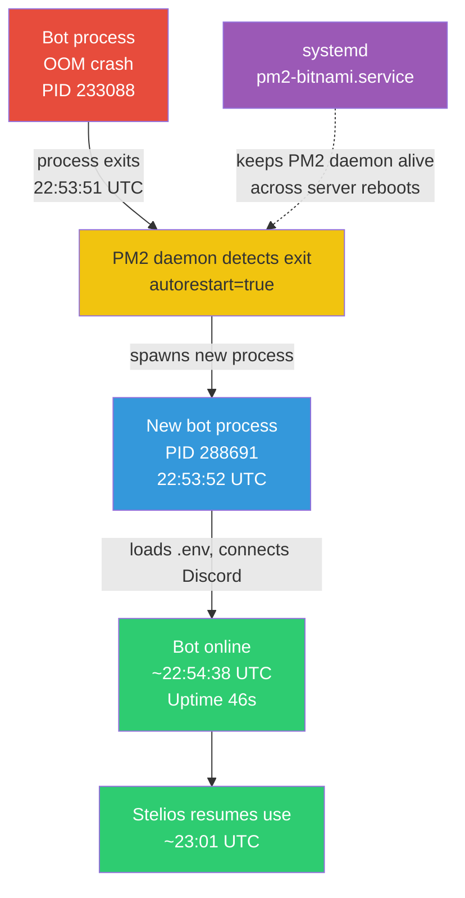
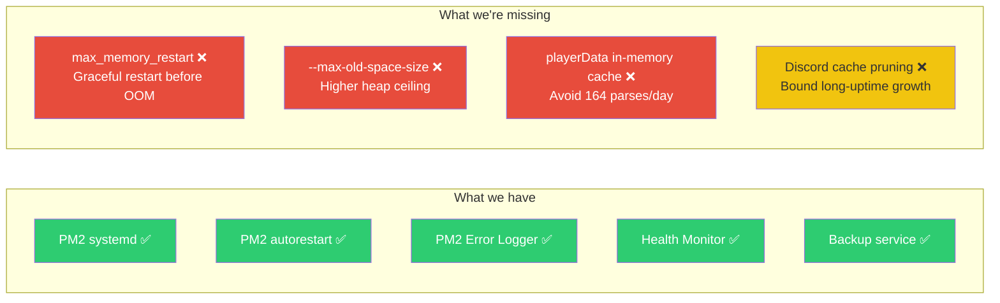

# Incident 03: V8 Heap OOM Crash — JSON.parse Exhaustion

**Date**: 2026-04-19 22:53:51 UTC (2026-04-20 06:53 AWST)
**Duration**: ~50 seconds (auto-recovered)
**Severity**: P3 — Brief outage, auto-recovered, no manual intervention required
**Detected by**: Reece (next morning, via PM2 Error Logger Discord post)
**Root Cause**: V8 heap ceiling hit during `JSON.parse()` of 3MB `playerData.json`
**Recovery**: Automatic — PM2 autorestart triggered, bot back online in ~50s
**Compounding Factor**: NONE — incident #2 fixes (PM2 systemd, autorestart) worked as designed

## TL;DR

Bot ran out of heap mid-`JSON.parse()` of `playerData.json` (3MB). V8 default heap ceiling on this 447MB server is ~256MB. Bot had been up for 6.3 days, accumulating ~239MB of resident heap. Parsing one more 3MB JSON file (which transiently allocates ~10x as much string memory inside V8) tipped it over.

PM2 autorestart kicked in within ~50 seconds. **No user intervention needed** — this is exactly the resilience improvement we put in place after [Incident 02](02-MapImageOOMCrash.md).

## Timeline (UTC / AWST)

| UTC | AWST | Event |
|---|---|---|
| 22:34:xx | 06:34 | Stelios uses `/menu`, browses challenges in Survivor CrossWorlds (S1: Hawai'i) |
| 22:52:xx | 06:52 | Stelios opens Castlist Hub, navigates tribes |
| 22:53:xx | 06:53 | Stelios clicks ✏️ Edit Tribe — bot continues serving |
| **22:53:51.032** | **06:53:51** | **V8 OOM in `Builtin_JsonParse` — process dies (PID 233088)** |
| 22:53:52.833 | 06:53:52 | New process boots (PID 288691), Logger initialized |
| 22:54:xx | 06:54 | Discord client ready, [RestartTracker] records restart #20 |
| 22:54:xx | 06:54 | Ultrathink Health Monitor scheduled report posts: Health 40/100, Uptime 46s |
| 22:55:xx | 06:55 | PM2 Error Logger captures crash trace from rotated error log, posts to #error |
| 23:01:xx | 07:01 | Stelios resumes interactions normally — full recovery confirmed |

## Crash Trace Analysis

```
[233088:0x55b558665000] 543971981 ms: Mark-Compact (reduce) 239.4 (256.1) -> 239.2 (255.1) MB,
                                       last resort; GC in old space requested
[233088:0x55b558665000] 543972345 ms: Mark-Compact (reduce) 239.2 (255.1) -> 239.2 (255.1) MB,
                                       last resort; GC in old space requested

FATAL ERROR: CALL_AND_RETRY_LAST Allocation failed - JavaScript heap out of memory

 8: v8::internal::FactoryBase::NewRawTwoByteString
 9: v8::internal::Builtin_JsonParse                ← The smoking gun
```

**Translation:**
- Heap was at 239MB / 256MB max — V8 ran two consecutive "last resort" Mark-Compact GCs in 364ms
- Both GCs freed ~0MB (heap was genuinely full, not garbage-fillable)
- Next allocation request was for `NewRawTwoByteString` inside `Builtin_JsonParse`
- V8 couldn't allocate the string buffer needed to parse the JSON → process killed

The last log line before the crash was a `Loaded playerData.json (3024761 bytes, 147 guilds)` entry. The 3MB JSON was loaded into the heap fine, but parsing it (which materializes UTF-16 strings, ~2x source size) needed more headroom than V8 could give.

## Root Cause: Three Compounding Factors

### Factor 1: V8 default heap ceiling is too tight for this server
- Server has 447MB RAM total
- Node.js v22.12.0 with no `--max-old-space-size` flag → V8 picks a conservative ~256MB heap ceiling
- Baseline bot resident heap after warmup: ~150–250MB depending on Discord.js cache size

### Factor 2: `playerData.json` is 3MB and loaded fresh on every interaction
- File grew to **3,024,761 bytes** with 147 guilds
- `loadPlayerData()` has a request-scoped cache, but it's cleared on every save and is per-request
- On April 19 alone: **164 loads** + **58 saves** of the full 3MB file
- Each load = `fs.readFileSync` + `JSON.parse` of 3MB → transient ~6-10MB string allocation in V8

### Factor 3: No `max_memory_restart` configured in PM2
- `pm2 jlist` shows `max_memory_restart: None`
- This means PM2 has no chance to gracefully restart before V8 hits its ceiling
- The ONLY safety net is V8's own OOM kill → harder crash, harder to diagnose

## Why It Took 6.3 Days to Crash

The crash trace timestamp `543971981 ms` ≈ 543,972 seconds ≈ 6.3 days of process uptime. This matches the previous restart on April 13 (per `restartHistory.json`).

Heap usage drifted upward over 6.3 days, likely from:
- Discord.js member/message cache accumulating across 140+ guilds
- V8 fragmentation from constant 3MB allocate/free cycles
- Long-running interval handlers retaining closures (PM2 logger, health monitor, backup service, scheduler)

This is a slow leak — not catastrophic, but the headroom shrinks until any "normal" operation tips it over. Stelios's tribe edit was the trigger, not the cause.

## What Worked (Resilience Wins)

The PM2/systemd recovery chain set up after [Incident 02](02-MapImageOOMCrash.md) **performed exactly as designed**:



**Confirmed working:**
- ✅ `pm2-bitnami.service` is enabled and active (since 2026-03-21 18:37 UTC, 4 weeks)
- ✅ PM2 process `autorestart: true`
- ✅ PM2 logrotate configured (rotated logs daily, error log captured the OOM trace)
- ✅ Bot restored without human intervention
- ✅ PM2 Error Logger surfaced the trace to Discord within 2 minutes
- ✅ Ultrathink Health Monitor flagged restart count alert

**Would the server have been crashed/unusable without autorestart?** No. Only the Node.js bot process died — Apache, nginx, and the Lightsail instance itself were unaffected. Without PM2 autorestart, the bot would simply have been offline until manual SSH intervention (potentially hours, given the 06:53 AWST timing).

## What Didn't Work (Gaps Exposed)



## Recommended Fixes (Priority Order)

### P0 — Do Now (5 minutes, prod SSH)

**Set PM2 max-memory-restart** so we get a graceful restart at, say, 350MB instead of a hard V8 OOM:

```bash
# On prod
pm2 restart castbot-pm --max-memory-restart 350M
pm2 save
```

This means:
- At 350MB resident, PM2 restarts the bot proactively (no OOM trace, no Stelios mid-click)
- We get predictable, daily-ish restarts instead of mystery OOM crashes every 6.3 days
- Each restart is ~50s — same recovery profile as today's incident, but predictable

### P0 — Do Now (5 minutes, code change + deploy)

**Set `--max-old-space-size=384` via Node args** to give V8 more heap before it gives up. Combined with max-memory-restart at 350MB, we get a 30MB safety buffer:

```bash
# Update PM2 ecosystem to pass node arg
pm2 restart castbot-pm --node-args="--max-old-space-size=384"
pm2 save
```

### P1 — Next Session (2 hours, code change)

**Cache `playerData` in memory** with file-mtime-based invalidation. Right now we parse 3MB JSON 164 times/day. With caching:
- Load once at startup
- Reload only when file mtime changes (i.e., another process touched it)
- Saves: 163 unnecessary parses/day = ~500MB/day of churn pressure

This is the single highest-leverage fix for long-term heap stability.

### P2 — Future (1 hour)

**Discord.js cache pruning** — set explicit limits on member/message caches:
```javascript
const client = new Client({
  makeCache: Options.cacheWithLimits({
    MessageManager: 50,        // Was: unlimited
    GuildMemberManager: 200,   // Was: unlimited per guild
  })
});
```

### P3 — Evaluate

**Server RAM upgrade**: $5/mo to bump from 447MB → 1GB would double headroom and basically eliminate this class of incident. Probably the highest ROI long-term fix if monthly cost is acceptable.

## What This Tells Us About Our Resilience

This incident is **a healthy outcome** compared to Incident 02:

| Metric | Incident 02 (Mar 20) | Incident 03 (Apr 19) |
|---|---|---|
| Outage duration | ~62 minutes | ~50 seconds |
| Manual intervention | Required (SSH from phone) | None |
| AWS Console restart needed | Yes (didn't help) | No |
| Detection | User-facing (Reece at event) | Automated (Discord post) |
| Severity | P1 | P3 |

The infrastructure improvements from Incident 02 (PM2 systemd, log rotation, autorestart) **transformed an hour-long P1 into a 50-second P3 that recovered before Reece woke up**. The PM2 Error Logger turned an invisible failure into a Discord notification.

The remaining work is to push the failure mode further upstream: from "V8 hard OOM at random uptime" → "PM2 graceful restart at predictable threshold" → "in-memory cache means no JSON parse pressure at all."

## Action Items

- [ ] **P0**: Set `pm2 restart castbot-pm --max-memory-restart 350M && pm2 save` on prod
- [ ] **P0**: Set `--max-old-space-size=384` via PM2 node-args
- [ ] **P1**: Implement playerData in-memory cache with mtime invalidation (separate doc/RaP)
- [ ] **P2**: Investigate Discord.js cache limits
- [ ] **P3**: Evaluate Lightsail upgrade to 1GB RAM ($5/mo)
- [ ] **Quick win**: Reduce `[PM2Logger] Check: env=prod` log spam (firing every 60s, fills logs with no signal)

## Related

- [Incident 02 — MapImageOOMCrash](02-MapImageOOMCrash.md) — earlier P1 OOM, motivated the systemd/autorestart fixes that saved us today
- [Incident 01 — MapImageOversizeOOM](01-MapImageOversizeOOM.md)
- [PM2ErrorLogger.md](../03-features/PM2ErrorLogger.md) — the monitoring that surfaced this
- [ProductionMonitoring.md](../infrastructure-security/ProductionMonitoring.md) — Ultrathink Health Monitor

---

**Last Updated**: 2026-04-20
**Status**: Bot is online and stable; P0 fixes pending Reece approval before applying to prod
