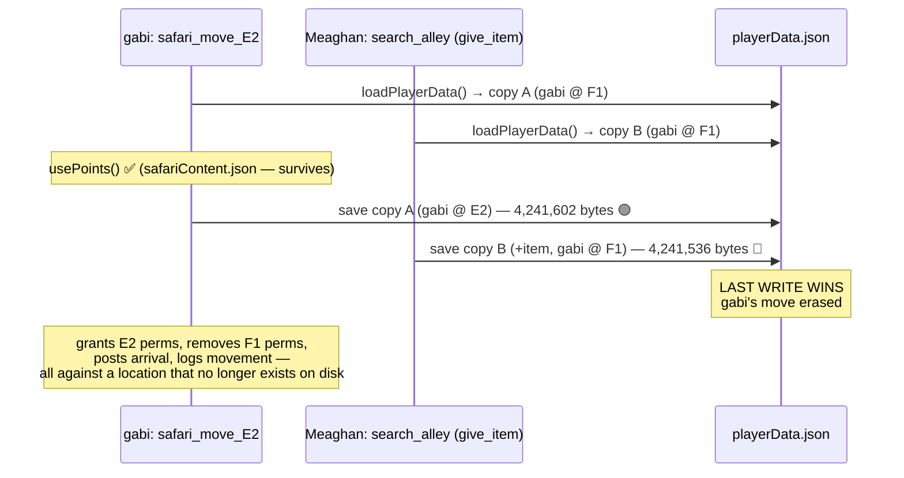

# Incident 05: Lost Movement Race — playerData.json Concurrent Load-Modify-Save Clobber

**Status**: 🟢 Tactical fix (Option A, `withStorageLock` on the four incident writers) **LIVE ON PROD 2026-07-15** (commit `95429121`, deployed on Reece's explicit permission). Validated on TEST under real concurrency first (two users moving in the same second — both writes survived, save sizes monotonically increasing). Residual: other playerData writers still unserialized (wrap as touched); end-state = RaP 0915 in-memory store.
**Date**: 2026-07-15
**Moved**: from `docs/01-RaP/0896_...` to incidents (Reece, 2026-07-15)
**Severity**: Production data loss (player state), silent, intermittent
**Related**: [0915 Memory Footprint / playerData cache](0915_20260628_MemoryLeak_Analysis.md) *(root-fix vehicle)*, the unresolved DNC/completion persistence bug (suspect list included `storage.js:11` global requestCache — this incident confirms the bug class)

---

## Original Context (Trigger Prompt)

> So a production admin user has reported a bug where a player has been initialised in G1, moved to F1, then moved to E2, but her movement to E2 hasn't been recognised officially by castbot, although i can see it in logs etc. The logs show some unusual disrepencies:
> Pg1 (newest): 📜 Activity Log — gabi!
> Image
> 📍 Current: F1 · Explored: 2/49 cells
> ⚡ Stamina: 2/3 (Resets in 11h 34m)
> ⬜ Visited · 🟧 Current Location
> Page 2/2 · 24 entries
> 26 minutes ago ⚡ Action (F1) — 💬 Talk to Printer
> • Text: "Hear ye...I'm trying to work here, what do you need?"
> • Text: "If you want me to print you a pamphlet you best be bringi..."
> 27 minutes ago ⚡ Action (F1) — 💬 Talk to Editor
> • Text: "Heed my words...for I am the one publishing them, might y..."
> • Text: "Hello there friend, the written word is quite powerful an..."
> 27 minutes ago 🗺️ Movement — Moved from G1 to F1 (⚡3/999 ♻️11h 30m → 2/999 ♻️11h 59m) ⚡2/999 cd: 11h 59m
> 38 minutes ago ⚡ Action (G1) — 🎣 Cast a Line
> • Text: "You grab a fishing rod and cast with all your might..."
> • Give Item: :hudsonfish~1: Fish (x1)
> 50 minutes ago ⚡ Action (G1) — 💰 $
> • Currency: +5
> 50 minutes ago 🪙 Currency (G1) — Gained 5 Coins from Button: _873786
> 50 minutes ago ⚡ Action (G1) — 🎣 Cast a Line
> • Text: "You grab a fishing rod and cast with all your might..."
> • Give Item: :hudsonfish~1: Fish (x1)
> 50 minutes ago 🧰 Item (G1) — Picked up :hudsonfish~1: Fish x1
> 54 minutes ago 🚀 Init (G1) — Initialized at G1 with +50 Coins (total: 50) (⚡0/999 → 3/999 ♻️MAX) ⚡3/999
> Pg2:📜 Activity Log — gabi!
> Image
> 📍 Current: F1 · Explored: 2/49 cells
> ⚡ Stamina: 2/3 (Resets in 11h 34m)
> ⬜ Visited · 🟧 Current Location
> Page 2/2 · 24 entries
> 24 minutes ago ⚡ Action (F1) — 💬 Talk to Printer
> • Text: "Hear ye...I'm trying to work here, what do you need?"
> • Text: "If you want me to print you a pamphlet you best be bringi..."
> 25 minutes ago ⚡ Action (F1) — 💬 Talk to Editor
> • Text: "Heed my words...for I am the one publishing them, might y..."
> • Text: "Hello there friend, the written word is quite powerful an..."
> 25 minutes ago 🗺️ Movement — Moved from G1 to F1 (⚡3/999 ♻️11h 30m → 2/999 ♻️11h 59m) ⚡2/999 cd: 11h 59m
> 36 minutes ago ⚡ Action (G1) — 🎣 Cast a Line
> • Text: "You grab a fishing rod and cast with all your might..."
> • Give Item: :hudsonfish~1: Fish (x1)
> 50 minutes ago ⚡ Action (G1) — 💰 $
> • Currency: +5
> 50 minutes ago 🪙 Currency (G1) — Gained 5 Coins from Button: _873786
> 50 minutes ago ⚡ Action (G1) — 🎣 Cast a Line
> • Text: "You grab a fishing rod and cast with all your might..."
> • Give Item: :hudsonfish~1: Fish (x1)
> 50 minutes ago 🧰 Item (G1) — Picked up :hudsonfish~1: Fish x1
> 54 minutes ago 🚀 Init (G1) — Initialized at G1 with +50 Coins (total: 50) (⚡0/999 → 3/999 ♻️MAX) ⚡3/999
>
> [Image #1] [Image #5]
> User Report: [Image #4] [Image #6]
> [Image #7]
> Feel free to check pm2 logs
>
> But based on what the admin is reporting I see a genuine disrepency, my functional underrstanding of this is:
> * User initialised in G1, receives the non-ephemeral 'Gabi is at G1' navigate message, she does stuff, clicks that and it goes to F1
> * Does stuff in F1, clicks either the non-Ephemeral button in the channel, or uses the anchor message button > Explore > Navigate or similar
> * Seemingly according to logs was able to do stuff in F1, but then also E2
>
> Also can you just alleviate a fear of me: the logs show stamina values of X/999 which the admin had for testing, it looks like he's changed that back down to X/3 but I just wanna make sure all of his players dont suddenly have near unlimited movement 27 minutes ago 🗺️ Movement — Moved from F1 to E2 (⚡2/999 ♻️11h 53m → 1/999 ♻️11h 59m) ⚡1/999 cd: 11h 59m
>
> Could you also modifgy if possible player logs to show when a move is an Admin Move vs Player using the Navigate buttons, AND only if its low effort low risk show which Navigate Pane they used? Please update this in the server-specific global Safari Logs as well, accessible from /menu > Settings
> e.g. instead of
> 44 minutes ago 🗺️ Movement — Moved from G1 to F1 (⚡3/999 ♻️11h 30m → 2/999 ♻️11h 59m) ⚡2/999 cd: 11h 59m
> show
> 44 minutes ago 🗺️ ADMIN Movement — Moved from G1 to F1 (⚡3/999 ♻️11h 30m → 2/999 ♻️11h 59m) ⚡2/999 cd: 11h 59m
> ultrathink

*(Guild: Thespi Hunt `1524773737973682267`, player gabi! `689666699917787187`, admin Jason. 2026-07-14 ~9:59PM guild-local time.)*

---

## 🤔 Plain English: What Actually Happened

gabi clicked **Move to E2** at almost the same moment another player (Meaghan) clicked **Search Alley** (a give-item custom action) in a different cell. Both handlers do the same dance on the *same file*: load all of `playerData.json` into memory, change their little corner of it, and write the **whole file** back.

Both loaded the same "before" snapshot. gabi's move wrote back a world where she's at E2. A moment later, Meaghan's item handler wrote back **its** world — built from the snapshot where gabi was still at F1. gabi's move was erased from disk as if it never happened.

Everything that *doesn't* live in `playerData.json` survived, which is exactly why the symptoms looked so schizophrenic:

| Evidence | Where it lives | Survived? |
|---|---|---|
| Stamina deducted (2→1) | `safariContent.json` (different file) | ✅ |
| Movement log entry "Moved from F1 to E2" | Safari Log / activity history (written later by batched flush) | ✅ |
| Channel permissions (E2 granted, F1 removed) | Discord itself | ✅ |
| "has arrived at E2" message | Discord itself | ✅ |
| `currentLocation = E2` | `playerData.json` | ❌ **clobbered** |
| `E2` in `exploredCoordinates` | `playerData.json` | ❌ **clobbered** (map shows 2/49) |

So gabi was *physically* in the E2 channel (permissions say so) while the bot's record said F1 — hence clicking Navigate in E2 produced "❌ You are no longer at E2. Your current location is F1" (the stale-channel guard at `app.js:4685` doing its job against corrupted state).

**The smoking gun in her activity log:** for the very same clicks, `⚡ Action (E2)` entries sit next to `🧰 Item (F1)` / `🪙 Currency (F1)` entries. Action entries take their location from the *channel* the button was clicked in (E2); item/currency entries read the player's *stored* location (already reverted to F1). Two sources of truth disagreeing in the same second = lost write.

## 📊 Prod Log Evidence (pm2, castbot-pm-out.log ~line 88600-88810)

The file-size fingerprints make it irrefutable:

```
✅ Loaded playerData.json (4241423 bytes)   ← gabi's safari_move_E2 loads (pre-move state)
🗑️ Clearing request cache ...              ← Meaghan's search_alley interaction arrives mid-move
✅ Loaded playerData.json (4241423 bytes)   ← Meaghan's give_item loads the SAME pre-move state
✅ Saved playerData (4241602 bytes)         ← gabi's setPlayerLocation saves (F1→E2 written) ✔
✅ Saved playerData (4241536 bytes)         ← Meaghan's item save lands AFTER, from pre-move copy ✘
✅ Loaded playerData.json (4241536 bytes)   ← E2 move is gone from disk
...
✅ SUCCESS: safari_move_E2 - player moved successfully   ← move flow never knew
```

`4241602 > 4241536`: the second save is *smaller* because it contains Meaghan's new item but **not** gabi's movement-history entry, explored coordinate, or new location.



## 🏛️ Why the Architecture Allows This

- `atomicSave` has a **write mutex** — it prevents interleaved/corrupt *writes*, and it worked perfectly here. Both writes were clean. It cannot prevent a **stale read-modify-write**: the atomicity boundary needed is *load→mutate→save*, not just *save*.
- `withStorageLock(fn)` (`storage.js:20`) exists for **exactly this** — it serializes whole load-modify-save cycles — but almost nothing uses it. `setPlayerLocation` (`mapMovement.js:42`), the give_item/currency mutation paths in `safariManager.js`, and most other playerData writers each do their own unserialized `loadPlayerData → mutate → savePlayerData`.
- The `requestCache` (`storage.js:11`) is **global, not per-request**, cleared at the start of each interaction and after each save — so overlapping deferred handlers routinely hold *different* snapshots of the same file (as here), or occasionally the *same mutable object*. Either mode can lose writes.
- The activity-log batcher (`activityLogger.js`) already had to work around this ("flushed in a single load-modify-save cycle to avoid racing with other saves") — the workaround protects *its own* entries but any whole-file save can still clobber concurrent field-level changes.

**Odds**: any two playerData-mutating interactions whose load→save windows overlap can eat each other. Deferred safari handlers hold the window open for seconds (Discord REST calls happen mid-cycle in some paths). On a busy safari night with players spam-clicking custom actions, this is not rare — it's a background error rate. This is very likely the same mechanism as the unresolved DNC/completion persistence bug (same suspect was already on file).

## 💡 Fix Options

| Option | What | Risk | Verdict |
|---|---|---|---|
| **A. Serialize cycles with `withStorageLock`** | Wrap every playerData load-modify-save (setPlayerLocation, give_item, currency, claims, etc.) in the existing lock | Low-medium: must find all ~write sites; adds latency serialization but writes are already mutex-serialized at the tail | 🟢 Tactical fix, incremental |
| **B. Single in-memory playerData store** | One canonical in-mem object; handlers mutate it directly; debounced flusher persists (the RaP 0915 root fix — also solves the OOM re-parse cost) | Higher: architectural, needs care around restarts/backups | 🟢 Strategic fix — A converges into B |
| **C. Field-level patch writes** | Writers submit path-scoped patches applied against fresh state under the lock | Medium: new API, migration | 🟡 Variant of A with nicer semantics |
| **D. Do nothing, admin re-moves players** | Status quo | Silent state loss keeps happening; hosts lose trust | 🔴 |

**Recommendation**: A now (start with the highest-traffic writers: movement, give_item, currency), B as the destination per RaP 0915. **Not deployed to prod without explicit permission — active games running.**

### Option A — IMPLEMENTED 2026-07-15 (dev + test)

The four incident-class writers now run their load→mutate→save cycles under `withStorageLock`:

| Writer | File | Notes |
|---|---|---|
| `setPlayerLocation` | `mapMovement.js` | whole body wrapped (the write that was erased) |
| `updateCurrency` | `safariManager.js` | lock covers load→save only; Safari Log posting stays outside |
| `addItemToInventory` | `safariManager.js` | locked only when it owns the cycle (skips lock when caller passes `existingPlayerData` — caller owns the cycle); the writer that did the erasing |
| `removeItemFromInventory` | `safariManager.js` | same pattern (the `take` half of give_item) |

Guardrails so the lock stays safe as the codebase grows:
- **`withStorageLock` JSDoc** (storage.js) — full when/when-not decision guide: load inside the lock, nothing slow (no Discord calls/image renders) inside, not re-entrant (never call another lock-taker from inside).
- **CLAUDE.md** — new "🔴 CRITICAL: playerData Writes — Use the Storage Lock" section with the wrap pattern.
- **`tests/storageLock.test.js`** — reproduces the unlocked lost-update, proves both writes survive under the lock, proves an error inside the lock can't jam the queue.

**Known remaining gap (why status is 🟡 not 🟢):** the lock only protects lock-users from each other. Other playerData writers (stores, claims, admin edits, etc.) are still unserialized and can clobber/be clobbered. Migrate writers incrementally as touched; the real end-state is the RaP 0915 in-memory store.

## ⚠️ The Stamina 999 Fear — Cleared

At incident time the guild config was `starting=3, max=999, regen=720min, regenAmount=1` (drip +1/12h). Admin has since set `max=3`. Verified directly against prod `safariContent.json` (read-only):

- `safariConfig`: `{starting: 3, max: 3, regenMin: 720, regenAmt: 1}`
- **24 stamina records, 0 players with `current > 3`.**

Three reasons nobody gets near-unlimited movement: (1) `max` is *derived* — the stamina-only reconcile (`pointsManager.js:381`) snaps every player's stored max to the config value on their next read, which the activity screenshots already show (`2/3`); (2) only *max* was ever 999 — currents were 0–3 the whole time; (3) `regenAmount=1` drip adds one point per period only while `current < effectiveMax`, so it can never overshoot a max of 3.

## ✅ Shipped With This Analysis (dev + test only)

Movement-source log markers (the admin's ask):
- Player activity log + global Safari Log now render `🗺️ ADMIN Movement` / `ADMIN MOVEMENT` for Player-Admin moves and `TELEPORT Movement` / `TELEPORT MOVEMENT` for action-outcome teleports (which also pass `adminMove:true` internally — labeling off that flag alone would have mislabeled teleports as admin moves).
- When a Navigate click originates from a pane whose coordinate differs from the player's origin cell (the stale-pane case this incident produced), logs append `` `via X pane` ``.
- Plumbing: `movePlayer(options.moveSource/viaChannelId)` → `logPlayerMovement(moveSource/viaPane)` → activity entry `src`/`via` fields + `analyticsLogger` SAFARI_MOVEMENT header. Backfill parser phrasing preserved. Tests: `tests/activityLogger.test.js`.
