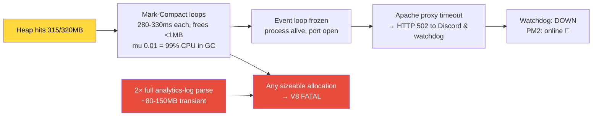

# Incident 06: Heap-Drift GC Death Spiral — 502s While "Online", Analytics Killing Blow

**Date**: 2026-07-19 07:33–07:41 UTC (15:33–15:41 AWST)
**Duration**: ~7 min degraded (502s), ~1 min hard down, auto+manual recovery
**Severity**: P3 — watchdog detected, remediation button worked, no data loss
**Detected by**: ProdWatchdog (HTTP 502 at 07:34:54Z) → Reece paged in #private-bugs
**Root Cause**: V8 heap drift reached the 320MB `--max-old-space-size` ceiling after only 17.7h uptime; GC death spiral froze the event loop (502s while PM2 showed "online"); FATAL heap OOM at ~07:40:37Z
**Killing blow**: Two back-to-back Server Usage Analytics runs (07:39:58 + 07:40:18) parsed the entire 20.6MB / 111,035-line `user-analytics.log` into ~109k entry objects on a heap with <5MB headroom
**Recovery**: PM2 autorestart (~07:41:17) + Reece's Restart Prod button (07:41:29, double-restarted an already-recovered process — harmless)

## TL;DR

The ~3–5-day V8 heap OOM class (incident 03) has compressed to **hours** because the workload exploded: 183 guilds (was 165 on Jul 6), `playerData.json` at 5.3MB (was 3.79MB), **two live safari seasons** (THES CrossWorlds + Thespi Hunt, installed Jul 9) driving 200–400 interactions/hour, and **3,338 full playerData parses/day** (was 164/day in April — a 20× increase, ≈17GB/day of transient string allocation). Heap drift is now ~13MB/h under load; the 320MB ceiling arrives in ~17h. The 24h scheduled auto-restart (enabled) no longer covers the window.

This week both OOM classes fired:
- **Kernel OOM kills** Jul 16 ×3 (00:33, 16:45, 17:14) and Jul 17 ×2 (18:59, 20:27) — node killed at 315–330MB anon-RSS (map-build spike era). Stopped after swap was raised to 1.6GB.
- **V8 heap FATAL** Jul 19 (this incident) — pure drift into the 320MB cap; swap can't help a V8 ceiling.

## Timeline (UTC, 2026-07-19)

| Time | Event |
|---|---|
| Jul 18 13:55:43 | PID 569014 boots (previous crash recovery) |
| ~07:33 | Heap pinned at ~315/320MB; Mark-Compact death spiral begins (mu 0.166 → 0.009 = >99% CPU in GC); event loop frozen; Apache starts returning 502 |
| 07:34:54 | ProdWatchdog DOWN alert: probe HTTP 502; SSH `status` shows castbot-pm "online, 17h, 255.9mb" — alive but thrashing (RSS < heap because ~60MB of heap was swapped out) |
| 07:39:58 | Reece (investigating) opens Data menu, runs **Server Usage Stats**: full parse of 20.6MB analytics log → 111,035 lines → 108,849 entry objects |
| 07:40:18 | **Second full parse** (`server_stats_page_0` page navigation) — same cost again |
| ~07:40:37 | `FATAL ERROR: Reached heap limit Allocation failed` (uptime 63,893,924ms). Kernel writes a **1.1GB core dump** to the repo dir (~40s), delaying respawn |
| 07:41:17 | PM2 autorestart boots new process (restart #5) |
| 07:41:29 | Reece clicks **Restart Prod Now** → remediation script restarts again (PID 576313, restart #6); brief 503 during boot |
| 07:43 | PM2ErrorLogger posts the crash trace to #error ✅ |

## Why "Prod Down" While PM2 Said "Online"

This is the correct mental model for the watchdog's "502 but PM2 online" alerts: **GC death spiral**, not Apache failure. The final Mark-Compacts freed <1MB — the heap was genuinely full of live/pinned data, not lazy garbage.

## Do the Bulk Analytics Buttons Permanently Retain RAM?

**No — but they are the single most allocation-violent buttons in the bot.** `serverUsageAnalytics.js` reads the whole `user-analytics.log` (20.6MB, no rotation since inception), splits to 111k line strings, and builds ~109k entry objects (each retaining its `rawLine`). All of it is function-scoped and GC'd after the response renders — RaP 0903's audit rated the layer clean, and the current process settled back to normal heap after the same buttons were used post-restart. Two caveats:

1. **Transient peak is ~80–150MB** — harmless at 100MB heap, instantly fatal at 315MB. It's the same "trigger surface" pattern as incident 03's JSON.parse: the drift loads the gun, a big parse pulls the trigger.
2. V8 keeps the grown committed heap after the spike (higher RSS high-water mark until next restart) — that's pages, not leaked objects.

Ultramonitor/health checks are cheap in-process metric reads — not a factor.

## Root Cause Chain (3 layers)

1. **Ceiling**: 448MB box → `--max-old-space-size=320`. Fixed capacity.
2. **Drift acceleration** (the real change): heap 85→315MB in 17.7h (~13MB/h; was ~2.4MB/h in June). Drivers, all growth-related:
   - 183 guilds (+18 in 2 weeks), playerData 5.3MB (+40%), safariContent 3.7MB (+55%)
   - Two concurrent live safari seasons; Thespi Hunt players grind map moves/pickups all day (analytics: 200–400 interactions/hour sustained)
   - **3,338 playerData parses/day + 1,500+ safariContent ops/day** — every interaction cold-parses 5.3MB (request cache clears at interaction start, plus `forceFresh` double-parses on custom-action conditions)
   - Discord.js caches (members/channels/messages) scale with guild count and safari-channel traffic
3. **Trigger allocations**: analytics full-file parse (this incident), map builds (Jul 16–17 kernel kills), castlist images, big JSON parses — any of them lands the blow late in the cycle.

## What Worked / What Didn't

**Worked**: ProdWatchdog 502 detection (caught the *degraded* phase, before process death) · SSH `status` diagnostics in the alert · Restart Prod button end-to-end · PM2 autorestart · pm2ErrorLogger trace to #error · 1.6GB swap eliminated the kernel-OOM class (zero kernel kills since Jul 17).

**Didn't / gaps exposed**:
- **24h auto-restart cadence is now insufficient** — ceiling arrives in ~17h under weekend load; every day ends with a multi-hour danger window.
- **`user-analytics.log` never rotates** (20.6MB and growing ~1MB/day at current traffic); Server Stats cost grows with it, unbounded, and the parse has no memory pre-flight guard (map builds got one; analytics didn't).
- **Core dumps enabled** (`ulimit -c unlimited` under PM2): every V8 abort writes a >1GB core (secrets included — full memory image with .env tokens) to the repo dir, adds ~40s to recovery, and eats disk (6.7GB free; ~4–5 more crashes = disk full = data-file writes fail = far worse incident class). `?? core` is untracked — must never be committed.
- Remediation restarted an already-recovered process (watchdog recovery message and Reece's click raced) — cosmetic, but the alert could show "recovered since" state.
- Minor noise: analytics activity parser treats AWST log timestamps as UTC (negative "Diff: -8 hours"); safari-log posts to a deleted channel in guild 1331657596087566398 stack-trace on every event.

## Recommended Actions (priority order)

| # | Action | Type | Effort |
|---|---|---|---|
| 1 | **Shorten 🌙 Auto-Restart interval 24h → 12h** (Data menu modal — no code, no deploy) | Config | 1 min |
| 2 | **Delete the 1.1GB `core`; disable core dumps** for the PM2 unit (`LimitCORE=0` in `pm2-bitnami.service` or `kernel.core_pattern`) — it contains live Discord tokens | Prod ops (permission) | 5 min |
| 3 | **Rotate `user-analytics.log`** (logrotate daily/weekly, keep ~42 days to match the analytics window) + make Server Stats read a bounded tail instead of the whole file, with a heap-headroom pre-flight like map builds | Ops + code | small |
| 4 | **playerData in-memory cache with mtime invalidation** — incident 03's P1, three months overdue and now the dominant churn source (3,338 parses/day) | Code (careful, cache-adjacent — needs Reece sign-off per prior incidents) | medium |
| 5 | **Compact JSON in prod** (`JSON.stringify(data)` env-gated) — the open decision from RaP 0903; at 5.3MB it's now worth ~1.5–2MB per parse/save | Code (Reece decides) | tiny |
| 6 | **1GB+ Lightsail migration** — the box is now genuinely under-provisioned for the workload; verify static-IP reattach path (RaP 0896 §F) | Infra | planned window |

## Related

- [Incident 03 — V8HeapOOMCrash](03-V8HeapOOMCrash.md) — same crash class at 6.3-day cadence (Apr 2026)
- [RaP 0915 — Memory Leak OOM](../01-RaP/0915_20260603_MemoryLeakOOM_Analysis.md) · [RaP 0903 — Memory Footprint](../01-RaP/0903_20260706_MemoryFootprint_Analysis.md) · [RaP 0896 — Map Creation Memory](../01-RaP/0896_20260718_MapCreationMemoryResilience_Analysis.md)
- [ScheduledRestart.md](../03-features/ScheduledRestart.md) — the 🌙 auto-restart (enabled 24h at time of incident)
- [TestInstanceBlueGreen.md](../03-features/TestInstanceBlueGreen.md) — watchdog + Restart Prod plumbing (both performed as designed)

---

**Last Updated**: 2026-07-19
**Status**: Bot online (restart #6, PID 576313); next planned restart 09:48 UTC; actions pending Reece's calls
