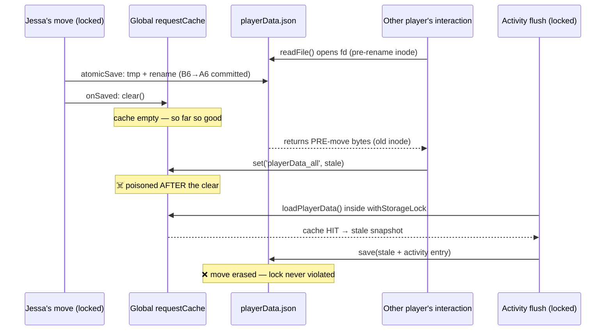

# Incident 07: Cache-Poisoned Lost Move — Stale In-Flight Read Beats the Storage Lock

**Status**: 🟢 Tactical fix built 2026-07-20 (lock-entry cache drop + generation guard, playerData AND safariContent twins) — deployed to TEST via win-restart; awaiting prod deploy on Reece's word. Detector script validates against the incident log (2 hits on the day). Residual: unserialized non-lock writers (incident 05's caveat) still open; end-state remains RaP 0915 in-memory store.
**Date**: incident 2026-07-18 17:15 UTC, diagnosed 2026-07-20
**Severity**: Production data loss (player state), silent, intermittent — the incident-05 class resurfacing THROUGH the incident-05 fix
**Related**: [05-LostMovementRace.md](05-LostMovementRace.md) *(parent incident — this is its sequel)*, RaP 0911 *(flagged the global request-cache singleton as a latent race — this incident confirms it)*, RaP 0915 *(root-fix vehicle)*

---

## Original Context (Trigger Prompt)

> Review all Recent RAPs and associated code about stamina issues plus anything in features, trying to diagnose a complex movement bug, we had some recent concurrency issues and guards but might not have got them all
>
> Then SSH into prod and find out what happened with this user issue (has been manually rectified) but would like to know root cause and potential fix
>
> Jason [THES],  — 10:21
> @Reece we are having another 'it says I am at this position, but I am really at this other position' issues. Jessa is supposed to be on B6 and it says she's on B6, but it's registering her physically on A6
>
> Server ID is 1524773737973682267
> Jessa's user ID is 822895744414384230 - should be present in logs, actua discord username is jessa.9
> A6 ID is 1524780466346135703 - should be in safariContent.json
> B6 ID is 1524780467855822919 - as above

## 🤔 What Actually Happened (Plain English)

Jessa **really did move herself B6→A6** on Jul 18 at 17:15:38 UTC. The move executed completely: stamina 1→0, A6 permissions granted, B6 permissions removed, arrival message posted in A6, Safari Log entry sent. Her playerData location write **committed to disk**.

Two seconds later, **the move's own activity-log flush erased it.**

The flush did everything right by incident-05 rules — it ran under `withStorageLock` and called `loadPlayerData()` *inside* the lock. But that load was a **cache hit on a poisoned snapshot**: a concurrent player's interaction had read playerData while Jessa's save was mid-rename, gotten the PRE-move bytes, and stored them in the **global request cache** — *after* the save's `onSaved` cache-clear had already run. The flush mutated that stale snapshot and saved it. Jessa's `currentLocation: A6` and her movementHistory entry vanished; the record reverted to B6.

Everything NOT in playerData survived (incident 05's "schizophrenic state" table again): Discord permissions said A6, stamina was spent, the arrival message sat in A6. Hence Jason's report — "says B6, physically A6." The record was wrong, not her body. The manual rectification (admin move B6→A6→B6 on Jul 20) restored the *stale* record; her actually-chosen position was A6, and she permanently lost the 1⚡ from the wiped move.

## 📊 The Byte-Fingerprint Timeline (prod log `castbot-pm-out__2026-07-19_00-00-00.log`)

| Line | Event | playerData bytes |
|---|---|---|
| 150077 | Jessa clicks `safari_move_A6` (from B6) | loads 5,178,900 (pre-move) |
| 150131 | Concurrent `safari_navigate_…_D4` (another player) starts; kicks off a disk read | — |
| 150136 | Jessa's `setPlayerLocation` (under lock) **saves the move** | **5,179,057** ✅ |
| 150137 | The concurrent read **completes with pre-move bytes** — it opened the file before the atomic rename — and caches them, AFTER `onSaved` cleared the cache | **5,178,900** ☠️ poison |
| 150196 | Safari Log: "Jessa moved B6→A6 (⚡1/3 → 0/3)" — perms flipped, arrival msg posted | — |
| ~150245 | Activity flush (2s batch, under lock): `loadPlayerData()` = **cache hit on the poison** (no "Loaded" line in the log), appends its ~237-byte entry, saves | **5,179,137** = 5,178,900 + 237 ❌ move erased |

`node scripts/detect-stale-reads.js` finds this exact signature (Loaded ≠ last Saved) — plus a **second** stale-read window the same day (line 189978, −179 bytes). The window is not rare.

## 🔬 Why the Incident-05 Fix Didn't Catch It

Two mechanisms stacked:

1. **Reads are unserialized by design** (`storage.js` — "pure reads never need the lock"). A `readFile` that opens the file before `atomicSave`'s `fs.rename` reads the old inode and can complete after the save — and after `onSaved`'s cache clear, so it re-poisons the cache the clear was meant to protect.
2. **The request cache is a global singleton shared across concurrent interactions** (RaP 0911 called this "a pre-existing latent race"). `loadPlayerData()` inside `withStorageLock` had no cache bypass, so a locked cycle could faithfully serialize itself around a snapshot that was already stale.

The lock's guarantee — "load inside the lock = fresh" — was silently conditional on the cache being trustworthy. It wasn't.

## 💡 The Fix (two independent guards, playerData + safariContent twins)

1. **Lock-entry cache drop** — `withStorageLock` (and `withSafariLock`, via `registerSafariCacheDrop` to avoid a circular import) clears the request cache immediately before `fn` runs, inside the queued continuation. Locked cycles now ALWAYS read disk. Cost: one extra ~5MB parse per locked cycle (write paths only — rare vs reads). Log marker when it matters: `🔒 Storage lock: dropped N cached entries for fresh cycle`.
2. **Generation guard** — `savePlayerData`/`saveSafariContent` bump a generation counter in `onSaved`; every read path captures the counter before its first `await` and **refuses to cache** the result if a save landed mid-read (`⚠️ Stale … read discarded from cache`). This closes the poison-after-clear window for ALL readers, not just locked cycles. Failure mode of a bug here: an uncached read (perf), never a wrong write.

Tests: `tests/storageCacheGuard.test.js` (real `storage.js` import via the `__storageInternals` seam — poisoned-cache-into-locked-cycle, mid-read save rejection, the full incident-07 interleaving, hook ordering). Detector: `scripts/detect-stale-reads.js` (scan any pm2 out-log; exit 1 on findings).

## ⚠️ What This Fix Does NOT Cover

- **Non-lock playerData writers** (`initializePlayerOnMap`, `resetExplored`, stores/claims/admin edits) can still clobber lock users — incident 05's line-175 caveat stands. Wrap as touched.
- A **non-lock writer's save racing a locked cycle's disk read** — tiny window, requires an unserialized writer mid-rename at the exact moment; shrinks to zero as writers migrate to the lock.
- The real fix remains **RaP 0915**: in-memory authoritative store, disk as journal. Both incidents die permanently there.

## 🔎 Post-Deploy Verification

1. One move on TEST → grep logs: every `Activity log: flushed` should be preceded by its own fresh `Loaded playerData.json` (or a `🔒 Storage lock: dropped …` marker). The incident's signature was a flush with NO load line.
2. Rapid-fire: 3–4 moves in quick succession while spamming /menu + inventory between clicks (the 2s flush timer is the race window) → `movementHistory` must be gapless.
3. Run `node scripts/detect-stale-reads.js <log>` over the day's log — findings should each pair with a `⚠️ Stale read discarded` guard line (window occurred, poison rejected).
