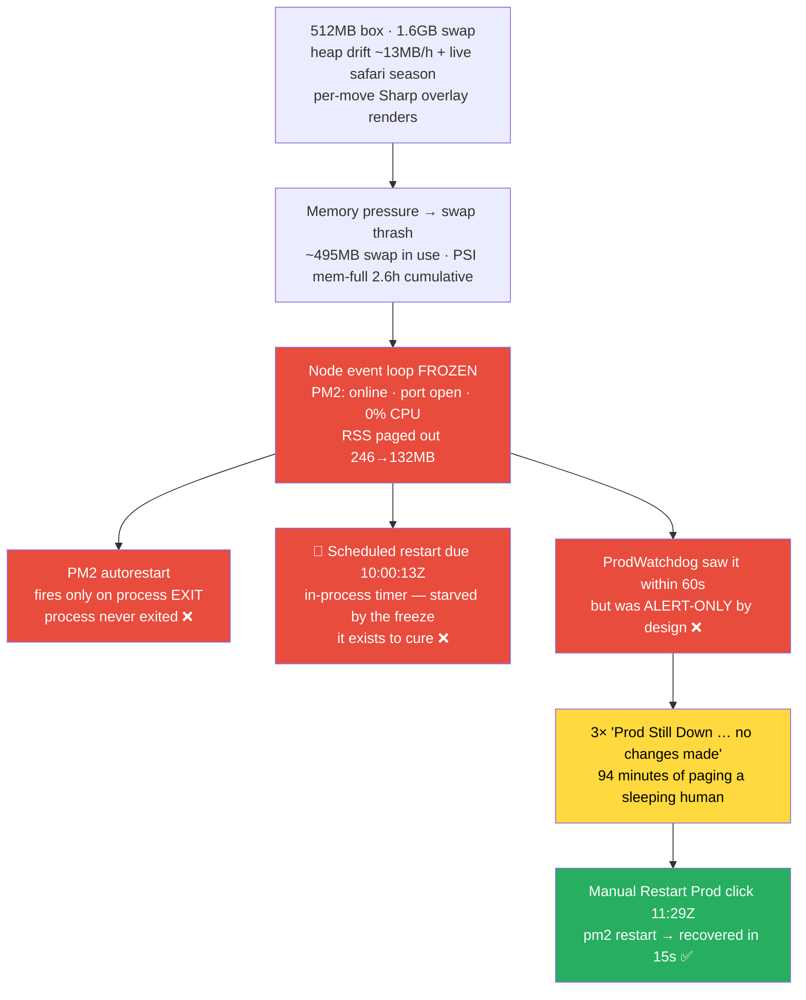

# Incident 08: Swap-Thrash Frozen Loop — 94 Minutes Down While Every Auto-Restart Layer Watched

**Date**: 2026-07-27 — flapping from 07:29 UTC, hard down 09:56:13–11:30:04 UTC (17:56–19:30 AWST)
**Duration**: ~94 min hard outage (all ~183 guilds), preceded by ~2.5h of intermittent flapping
**Severity**: P1 — full prod outage, prolonged, recovery required manual action
**Detected by**: ProdWatchdog (castbot-blue) — DOWN at 09:56:13Z, 3× "Prod Still Down" reminders
**Root Cause**: Node event loop entered a terminal stall under memory pressure / swap thrash on the 512MB Lightsail nano — process stayed "online" in PM2 (port open, 0% CPU, RSS paged out 246→132MB) while answering nothing, so **no existing restart layer could fire**: PM2 autorestart needs a process *exit*, the 🌙 scheduled restart is an in-process timer that was starved by the very freeze it exists to cure (due 10:00:13Z, 4 minutes after the hang began), and the ProdWatchdog was **alert-only by design**
**Killing blow context**: 11.5h of heap drift + live safari load (per-move Sharp overlay renders) on a box already running ~495MB deep into swap
**Recovery**: Reece's **Restart Prod Now** button at 11:29:30Z → forced-command `pm2 restart` → HTTP 200 within 15 seconds of the next probe. **No reboot occurred** — the box has been up since 2026-06-11; the "manual reboot" was in fact the remediation button, and it proves the fix was always one SSH command away

## TL;DR

Prod hung for 94 minutes with the watchdog *watching it happen* — posting "Prod Still Down … no changes made" every 30 minutes — because every automated recovery layer had a structural blind spot for a process that is **frozen but not dead**. The hang itself is the incident-06 memory-pressure class wearing a new mask: instead of a FATAL heap OOM (which PM2 heals in ~50s), the 1.6GB swap added on Jul 17 let the process *survive* in an unusable state — the exact "honest trade" RaP 0896 warned about ("swap converts a hard kill into thrash latency … SSH itself froze"). The one mechanism that could have fired — the forced-command SSH remediation — worked flawlessly **7 out of 7 times** during the outage (as read-only `status` probes), but nothing was allowed to invoke it in restart mode except a human finger.

**Fixed in this incident:** the watchdog now escalates — after 15 minutes of *continuous* downtime it runs the same forced-command remediation itself (max 2 attempts per episode, 30-min cooldown, env-gated), then keeps paging. Replayed against this incident's timeline, the outage ends at **+15 minutes instead of +94**.

## Original Context (Trigger Prompt)

> Just had a major, prolonged prod outage until i manually rebooted, please review the incidents folder and perform a full root cause analysis, plug any gaps. I want to also know why it didn't auto restart as thought we had implemented something like that.
>
> In particular that 'prod still down' message is of concern.
>
> Document it all in a RaP in incidents once fixed
>
> *(followed by the #🚨outages alert transcript, and: "Explain this to me in relation to our recent string of issues")*

Note: forensics show **no reboot occurred** (box boot time 2026-06-11 12:44:39, PID continuity 654254→659807 via `pm2 restart` only). Recovery came from the **Restart Prod Now** button at 11:29:30Z — which is good news: the remediation path works; it just needed permission to act on its own.

## Timeline (UTC, 2026-07-26 → 27)

| Time | Event |
|---|---|
| Jul 26 14:26:11 | Reece sets 🌙 auto-restart to **12h** interval, 30m warning (incident 06 action #1 — done the day before this incident) |
| Jul 26 22:00:13 | Planned 🌙 restart fires (restart #31). Watchdog (threshold=1) alerts on the ~1-min 503 blip — the first "Prod Down/Recovered" pair in the transcript is the *planned nightly restart*, not a fault |
| Jul 27 07:29–07:41 | First stall burst: 17 Apache `AH01102` proxy timeouts to `localhost:3000`; external probes time out while local curl still returns 200 (box-wide sluggishness); recovers |
| 08:00–09:39 | Mostly healthy (1 proxy error at 08:24; whispers processed normally) |
| 09:30:13 | 🌙 scheduler posts T-30 warning for the 10:00 restart — the loop is still limping |
| ~09:40 | **Terminal stall begins**: every `/interactions` request now times out at Apache (26 AH01102 in hour 09, 94 in hour 10) |
| 09:47–09:53 | Watchdog flaps down/up twice; forced-command `status` probes over SSH **succeed** |
| 09:49:35 | Last completed work by the old process (safari activity-overlay upload); final interactions processed with webhook tokens already 616–689s expired — the event loop was minutes behind before it stopped entirely |
| 09:56:13 | **Hard down begins** — watchdog DOWN alert |
| 10:00:13 | 🌙 scheduled restart **due — never executes**. The 10:00 backup + health-check timer callbacks emitted their first lines only at ~11:29, as the process was being killed. Frozen, not dead |
| 10:26:13 / 10:56:13 / 11:26:13 | Three "🔴 Prod Still Down" REMINDER alerts at the exact 30-min re-alert cadence, each carrying read-only diagnostics stamped "no changes made". RSS visibly draining to swap across them: 246.9 → 166.5 → 132.3MB at 0% CPU |
| 09:47–11:26 | SSH forced-command `status` probes succeed at 09:47:30, 09:50:18, 10:26:14, 10:56:14, 11:26:14 (per prod's `remediate-castbot.log`) — **remediation was reachable the entire outage**; only interactive-style SSH intermittently timed out at banner exchange |
| 11:29:30 | Reece clicks **Restart Prod Now** (#🚨outages) |
| 11:29:31 | `remediate-castbot.sh mode=[restart]` → `pm2 restart castbot-pm` |
| 11:29:46 | New process (PID 659807, restart #32); brief 503 while booting; scheduler re-arms for 22:00Z |
| 11:30:04 | Watchdog: **RECOVERY** (HTTP 200). Hard down ≈ 94 minutes |

## Why Nothing Auto-Restarted (the question this incident answers)

1. **PM2 autorestart** (+ systemd `pm2-bitnami.service`) revives a process that *exits*. In incidents 03 and 06 the V8 FATAL OOM crashed the process and PM2 healed it in ~50s. This time swap absorbed the pressure, so V8 never hit its ceiling — the process survived, uselessly. PM2 saw "online" the whole time (restart counter pinned at 31).
2. **🌙 Scheduled auto-restart** *was* enabled (12h — the incident-06 follow-up was actually done on Jul 26) and was due at 10:00:13Z, four minutes into the hard hang. It posted its T-30 warning at 09:30 while the loop still limped, but `executeRestart` is a `setTimeout` callback inside the frozen process — it never ran. **An in-process restart mechanism cannot save you from a frozen event loop, by construction.** On the post-remediation boot it re-armed for 22:00Z, correctly skipping the missed slot.
3. **ProdWatchdog** detected the outage within 60 seconds and had working SSH access to prod for the entire 94 minutes — but its documented posture was "read-only on prod, alert-only — it never auto-remediates." The **"Prod Still Down"** messages that concerned Reece are its 30-minute REMINDER loop doing exactly (and only) what it was built to do: re-page the human, attach read-only diagnostics ("no changes made"), and wait.

The gap, precisely: **the only actor that could restart prod was external, and the only external actor was asleep.**

## Relation to the Recent String of Issues

This is chapter five of one continuing story — an under-provisioned 448MB box carrying a workload that has roughly tripled since April:

- **Incidents 01/02 (Mar)**: map-image memory spikes OOM'd the box; PM2/systemd supervision added.
- **Incident 03 (Apr)**: V8 heap ceiling reached after 6.3 days of drift → FATAL OOM → PM2 auto-healed in ~50s. The playerData in-memory cache was recommended (P1) and remains unbuilt.
- **Jul 16–17**: five kernel OOM kills during map builds → **swap raised to 1.6GB**, which stopped the kills but — as RaP 0896 stated at the time — "converts a hard kill (10s outage, systemd self-heals) into thrash latency … SSH itself froze."
- **Incident 06 (Jul 19)**: drift accelerated to ~13MB/h under two live safari seasons; GC death spiral froze the loop for ~7 min before the FATAL OOM *crashed* the process and PM2 healed it. The doc declared the 24h restart cadence insufficient and the box "genuinely under-provisioned" (1GB migration: still pending).
- **Incident 08 (today)**: same pressure, but swap kept the process *alive* through the freeze — removing the crash that had been functioning as the de-facto auto-restart. The failure mode every prior incident accidentally avoided finally happened: **hung, not dead — and nothing restarts "hung."**

The flapping earlier in the window (07:29–07:41, and the previous evening's blips) was the same box drowning slowly — external probes timing out while local curl succeeded, SSH banner-exchange timeouts — until it went fully under at ~09:40. Lightsail burst-credit throttling may have contributed to the box-wide sluggishness but can't be confirmed from the box (no sysstat; steal counters can't be dated) — worth a glance at the Lightsail CPU burst-capacity graph for 07:00–12:00Z.

## Also Found: the Remediation Script's Apache Branch Was Unreachable

Prod's `remediate-castbot.sh` (previously untracked, now versioned at [scripts/prod/remediate-castbot.sh](../../scripts/prod/remediate-castbot.sh)) had a latent defect: `web_status()` ran `curl -w "%{http_code}" … || echo "DOWN"` — on failure curl still prints its code, then the echo *appends*, producing `000DOWN`/`503DOWN` (visible verbatim in the alert transcript). The `!= "DOWN"` check therefore always classified the web layer as responding, making the nginx/Apache repair branch unreachable — defeating the AWS-reboot scenario the script was written for. Harmless this time (Apache was up; the bot restart was the fix), but fixed in the repo copy. **Deploying the fixed script to prod needs Reece's explicit go-ahead** (one `scp`, path in the script header).

## What Worked / What Didn't

**Worked**: ProdWatchdog detection (60s), exact 30-min reminder cadence, SSH `status` diagnostics in every alert, forced-command security model (7/7 successful restricted probes during the outage), Restart Prod button end-to-end (click → recovery in 34s), 🌙 scheduler's *design* (fired cleanly at 22:00Z the night before; correctly re-armed after recovery), no data loss.

**Didn't / gaps exposed**:
- **No layer restarts a frozen-but-alive process** (the headline gap — now fixed, see below).
- 🌙 scheduler's warning succeeded but its restart starved — "warning posted" is not "restart guaranteed"; only an external actor is immune.
- Watchdog SSH diagnostics existed only inside Discord alert bodies — blue's own logs couldn't answer what prod looked like at alert time (now logged locally).
- Watchdog threshold=1 alert-paired every planned nightly restart and every flap (six DOWN/RECOVERED pairs before the real outage) — noise that trains alert fatigue. `PROD_WATCHDOG_THRESHOLD=2` was the documented intent in ScheduledRestart.md's deploy checklist but was never set on blue (now set).
- `remediate-castbot.sh` untracked + Apache branch unreachable (repo copy fixed; prod deploy pending).
- Prod forensics blind spots: no sysstat/sar, `dmesg` restricted, no readable syslog — box-level history reconstruction leaned on PSI counters, Apache logs, and PM2 logs.

## Fixes Shipped (2026-07-27, this incident)

**ProdWatchdog auto-remediation escalation** ([src/monitoring/prodWatchdog.js](../../src/monitoring/prodWatchdog.js), tests in [tests/prodWatchdog.test.js](../../tests/prodWatchdog.test.js)):
- After **15 minutes of continuous downtime** (measured from the *first* failed probe, so the alert threshold doesn't delay it), the watchdog runs the same forced-command remediation as the button — the key can execute nothing else on prod.
- Bounded: **max 2 attempts per down-episode, 30-min cooldown** between them; any healthy probe resets the episode (flapping can never accumulate into a remediation). After the budget is exhausted, reminders continue with "manual action required."
- Every alert now states the down-duration and what the watchdog will do next ("Auto-remediation in ~Xm if still down" / "exhausted — manual action required"), remediation output is posted to Discord *and* logged locally, and SSH diagnostics are persisted in blue's logs.
- Env knobs (all optional): `PROD_WATCHDOG_AUTO_REMEDIATE=0` disables; `…_AUTO_REMEDIATE_AFTER_MS`, `…_AUTO_REMEDIATE_COOLDOWN_MS`, `…_AUTO_REMEDIATE_MAX`, and `PROD_WATCHDOG_REALERT_MS` (previously hardcoded) tune it.
- Unit tests include a replay of this incident's probe sequence: outage ends at **+15m instead of +94m**.
- False-positive cost is bounded: 15 consecutive failed probes are required, and the worst case (blue-side network illusion) is a ~5s `pm2 restart` of a healthy prod, at most twice.

**Config**: `PROD_WATCHDOG_THRESHOLD=2` set on castbot-blue (kills nightly planned-restart false alerts and single-probe flap noise; detection now ~2 min, escalation timing unaffected).

## Recommended Actions

| # | Action | Type | Status |
|---|---|---|---|
| 1 | Watchdog auto-remediation escalation (15m sustained → forced-command restart, 2/episode, 30m cooldown) | Code | ✅ Done 2026-07-27 |
| 2 | `PROD_WATCHDOG_THRESHOLD=2` on blue | Config | ✅ Done 2026-07-27 |
| 3 | Version-control + fix `remediate-castbot.sh` (web_status `000DOWN` bug → Apache branch unreachable) | Code | ✅ repo copy done; **⏳ prod deploy awaits Reece's word** (`scp scripts/prod/remediate-castbot.sh castbot-lightsail:/home/bitnami/remediate-castbot.sh`) |
| 4 | Persist SSH diagnostics + remediation output in blue's local logs | Code | ✅ Done 2026-07-27 |
| 5 | **1GB+ Lightsail migration** — incident 06 #6, now the root capacity fix: 11.5h of normal load was enough to put a 447MB box ~495MB into swap | Infra | ⏳ Reece (urgent — this incident is what "under-provisioned" costs) |
| 6 | playerData in-memory cache (incident 03 P1, incident 06 #4 — the dominant churn source) | Code | ⏳ |
| 7 | Check Lightsail **CPU burst capacity** graph for Jul 27 07:00–12:00Z; consider installing sysstat on prod for future forensics | Prod ops | ⏳ Reece |
| 8 | Test-box restart self-announce (silent watchdog restarts) | Code | ✅ Already exists (app.js `🟦 [TEST] restart self-announce` — observed firing during this deploy; CLAUDE.md's "known gap" note was stale and has been corrected) |

## Related

- [Incident 06 — HeapDriftGCDeathSpiral](06-HeapDriftGCDeathSpiral.md) — same memory-pressure class; crashed instead of hanging
- [Incident 03 — V8HeapOOMCrash](03-V8HeapOOMCrash.md) — the drift class at 6-day cadence
- [RaP 0896 — Map Creation Memory](../01-RaP/0896_20260718_MapCreationMemoryResilience_Analysis.md) — the swap "honest trade" that predicted this failure mode
- [RaP 0903 — Memory Footprint](../01-RaP/0903_20260706_MemoryFootprint_Analysis.md) · [RaP 0915 — Memory Leak OOM](../01-RaP/0915_20260603_MemoryLeakOOM_Analysis.md)
- [ScheduledRestart.md](../03-features/ScheduledRestart.md) — the 🌙 restart (worked the night before; structurally cannot fire mid-freeze)
- [TestInstanceBlueGreen.md](../03-features/TestInstanceBlueGreen.md) — watchdog + Restart Prod plumbing (posture updated by this incident)

---

**Last Updated**: 2026-07-27
**Status**: Prod online (restart #32, PID 659807, revision 88acdd27); watchdog escalation deployed to blue; prod-side script fix and 1GB migration awaiting Reece
