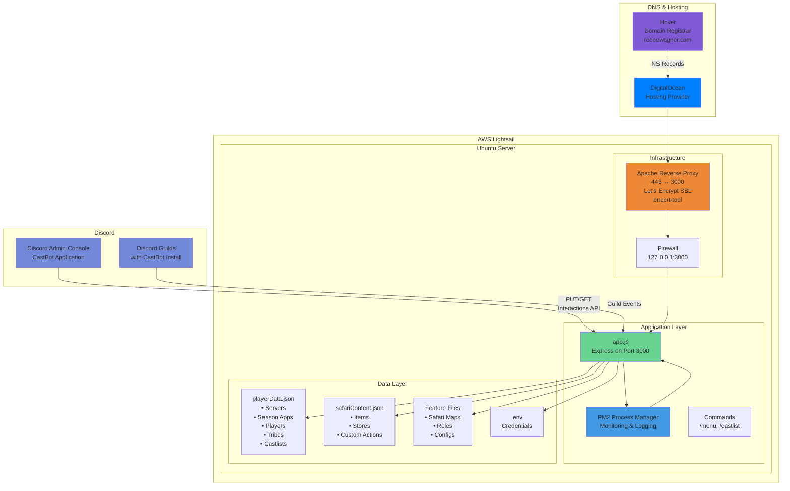
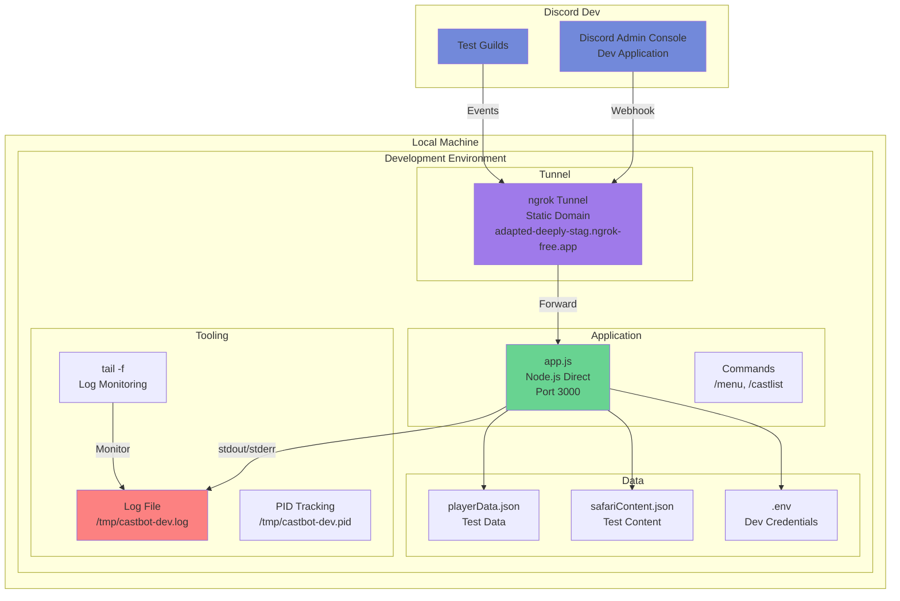

# CastBot Environment Strategy

## Overview

This document defines CastBot's environment-specific configurations, tools, and workflows. It provides a single source of truth for understanding how development and production environments differ and why these differences are intentional.

## Core Philosophy

**Different Environments, Different Needs**

Development and production environments have fundamentally different requirements:
- **Development**: Speed, simplicity, debuggability, rapid iteration
- **Production**: Reliability, monitoring, auto-recovery, performance

## Architecture Overview

### Production Architecture



### Development Architecture



## Environment Comparison

| Aspect | Development | Production |
|--------|------------|------------|
| **Infrastructure** | Local machine | AWS Lightsail (Ubuntu/Bitnami) |
| **Server IP** | localhost | 13.238.148.170 (Static IP) |
| **Domain** | adapted-deeply-stag.ngrok-free.app | castbotaws.reecewagner.com |
| **Process Manager** | Node directly | PM2 |
| **Web Server** | None (direct node) | Apache reverse proxy |
| **SSL/TLS** | ngrok handles | Let's Encrypt via Apache (bncert-tool) |
| **SSL Cert Location** | N/A | /opt/bitnami/letsencrypt/certificates/ |
| **Port** | 3000 (tunneled) | 443→3000 (proxied by Apache) |
| **Firewall** | None needed | 127.0.0.1:3000 restricted |
| **Logging** | File + tail | PM2 logs with rotation |
| **Startup** | Manual (dev-start.sh) | PM2 saved state |
| **Restarts** | Manual (dev-restart.sh) | Auto-restart on crash |
| **Log Location** | /tmp/castbot-dev.log | ~/.pm2/logs/ |
| **Debug Output** | Full (DEBUG=true) | Minimal (unless FORCE_DEBUG) |
| **Git Integration** | Auto-commit on restart | Pull from GitHub |
| **Environment** | .env loaded manually | .env via PM2 ecosystem |
| **DNS Provider** | N/A | DigitalOcean (NS records from Hover) |
| **Node Version** | Latest available | 22.11.0 (stable) |

## Development Environment

### Process Management
```bash
# Direct node execution with output redirection
nohup node app.js > /tmp/castbot-dev.log 2>&1 &

# PID tracking for clean restarts
echo $! > /tmp/castbot-dev.pid
```

**Why not PM2?**
- Faster startup/restart cycles
- No daemon overhead
- Direct console output
- Easier to kill/restart during rapid development
- Avoids port binding issues during frequent restarts

### Logging Strategy
```bash
# Simple file logging
node app.js > /tmp/castbot-dev.log 2>&1

# Real-time monitoring
tail -f /tmp/castbot-dev.log
```

**Benefits:**
- Instant output visibility
- Easy to grep/search
- No log rotation needed (temporary files)
- Clear separation from system logs

### Development Scripts

#### dev-start.sh
- Starts ngrok tunnel with static domain
- Launches node process directly
- Tracks PID for management
- Auto-commits changes

#### dev-restart.sh
- Kills existing process by PID
- Cleans up port 3000
- Restarts with fresh node process
- Preserves ngrok tunnel

#### dev-restart-logs.sh
- Same as dev-restart.sh
- Adds continuous log tailing
- For interactive debugging sessions

#### dev-stop.sh
- Cleanly stops all processes
- Removes PID files
- Optional: stops ngrok

#### dev-status.sh
- Shows process status
- Displays ngrok URL
- Git status summary
- Recent commits

### Environment Variables
```javascript
// Development detection
const isDev = process.env.NODE_ENV !== 'production';
const DEBUG = isDev || process.env.FORCE_DEBUG === 'true';

// Usage
if (DEBUG) {
    console.log('🔍 Detailed debug information');
}
```

## Production Environment

### Infrastructure Stack

#### AWS Lightsail Instance
- **Platform**: Ubuntu 20.04 LTS with Bitnami LAMP Stack
- **Instance Specifications**: 512 MB RAM, 2 vCPUs, 20 GB SSD
- **AWS Region**: ap-southeast-2a (Sydney)
- **Static IP**: 13.238.148.170
- **IPv6 Address**: 2406:da1c:5b:7a00:450e:d561:e949:d529
- **Private IPv4**: 172.26.0.160
- **Domain**: castbotaws.reecewagner.com
- **Interactions Endpoint**: https://castbotaws.reecewagner.com/interactions
- **Discord Application ID**: 1319912453248647170
- **Node Version**: 22.11.0
- **Web Server**: Apache (via Bitnami)
- **SSL Management**: bncert-tool (Bitnami HTTPS Configuration Tool)

#### Network Architecture
1. **Domain Management**
   - **Primary Domain**: reecewagner.com
   - **Registrar**: Hover
   - **DNS Provider**: DigitalOcean
   - **NS Records**: Point to DigitalOcean nameservers
   - **A Record**: castbotaws.reecewagner.com → 13.238.148.170
   - **TTL**: 300 seconds

2. **Request Flow**
   ```
   Discord → HTTPS (443) → Apache → HTTP (3000) → Express App
            ↓
      Let's Encrypt SSL Termination
            ↓
      Reverse Proxy (mod_proxy)
            ↓
      localhost:3000 (PM2/Node)
   ```

3. **SSL/TLS Configuration**
   - **Certificate Authority**: Let's Encrypt (ACME v2)
   - **Management Tool**: bncert-tool + Lego client
   - **Certificate Path**: `/opt/bitnami/letsencrypt/certificates/castbotaws.reecewagner.com.{crt,key}`
   - **Apache Config**: `/opt/bitnami/apache/conf/vhosts/myapp-https-vhost.conf`
   - **Auto-Renewal**: Cron job runs daily at 19:39 UTC
   - **Renewal Command**: `/opt/bitnami/letsencrypt/lego renew && Apache graceful restart`
   - **Certificate Validity**: 90 days (auto-renewed at 30 days remaining)

4. **Security Layers**
   - **Apache reverse proxy** with SSL termination on port 443
   - **Let's Encrypt certificates** with automated renewal
   - **Firewall**: Port 3000 restricted to localhost only (127.0.0.1)
   - **PM2 process isolation** (non-root user execution)
   - **HTTP→HTTPS redirect** on port 80

### Application Architecture

#### Core Components
- **Express Framework**: Node.js web application framework
- **discord-interactions**: v2 API for Discord integration
- **Commands System**: /menu, /castlist slash commands
- **Data Persistence**: JSON file-based storage

#### Architectural Enablers
These are the foundational systems that power CastBot's features:

1. **Button Factory** ([ButtonHandlerFactory.md](../enablers/ButtonHandlerFactory.md))
   - Centralized button handler registration
   - Consistent error handling
   - Performance tracking

2. **Entity Framework** ([EntityEditFramework.md](../enablers/EntityEditFramework.md))
   - CRUD operations for Safari entities
   - Unified data management
   - Field validation

3. **Menu System** ([MenuSystemArchitecture.md](../enablers/MenuSystemArchitecture.md))
   - Dynamic menu generation
   - Navigation state management
   - Components V2 compliance

### Process Management (PM2)

#### PM2 Configuration
```javascript
// ecosystem.config.js
module.exports = {
  apps: [{
    name: 'castbot-pm',
    script: 'app.js',
    env: {
      NODE_ENV: 'production'
    },
    error_file: '~/.pm2/logs/castbot-pm-error.log',
    out_file: '~/.pm2/logs/castbot-pm-out.log',
    merge_logs: true,
    time: true,
    autorestart: true,
    max_restarts: 10,
    min_uptime: '10s'
  }]
};
```

#### PM2 Benefits
- **Auto-restart**: Recovers from crashes
- **Log rotation**: Prevents disk fill
- **Process monitoring**: CPU/memory tracking
- **Startup script**: Survives server reboots
- **Zero-downtime reload**: For updates

#### Approved PM2 Commands
```bash
# Safe operations
pm2 restart castbot-pm     # Preserves environment
pm2 reload castbot-pm      # Zero-downtime
pm2 logs                   # View logs
pm2 status                 # Check status
pm2 monit                  # Monitoring dashboard

# NEVER use these
pm2 delete                 # Loses environment
pm2 start app.js           # Creates duplicates
pm2 resurrect              # Incomplete state
```

### Production Deployment

```bash
# Always through deployment script
npm run deploy-remote-wsl

# What it does:
1. SSH to production server
2. Git pull latest from main
3. npm install if needed
4. pm2 restart castbot-pm
5. Verify deployment
```

### Data Storage Architecture

#### Primary Data Files

1. **playerData.json**
   ```javascript
   {
     "servers": {},           // Guild configurations
     "seasonApplications": {}, // Application forms and responses
     "players": {},           // Player profiles and stats
     "tribes": {},            // Tribe/team data
     "castlists": {}          // Season cast lists (legacy & new)
   }
   ```

2. **safariContent.json**
   ```javascript
   {
     "servers": {},           // Safari guild settings
     "items": {},             // Safari items and effects
     "stores": {},            // Safari shop configurations
     "customActions": {},     // Button actions and flows
     "soldItems": {}          // Transaction history
   }
   ```

3. **Feature-Specific Files**
   - Castlist configuration files
   - Season application templates
   - Role management data
   - Safari map definitions
   - General Safari configurations

### Production Monitoring

**Comprehensive Health Monitoring** (see [Production Monitoring Guide](ProductionMonitoring.md)):

```bash
# Health monitoring (ultrathink edition)
npm run monitor-prod           # Full health dashboard
npm run monitor-prod-quick     # Essential metrics (fastest)
npm run monitor-prod-memory    # Memory analysis & optimization tracking
npm run monitor-prod-alerts    # Alert conditions & recommendations
npm run monitor-prod-cache     # Cache performance & effectiveness

# Enhanced logging scripts
npm run logs-prod              # Last 100 lines
npm run logs-prod-follow       # Real-time tail
npm run logs-prod-errors       # Errors only
npm run logs-prod-safari       # Feature-specific
npm run logs-prod-stats        # Statistics
```

### Environment Variables

**Critical**: Production uses `.env` file loaded by dotenv
```javascript
// Production .env
NODE_ENV=production
DISCORD_TOKEN=xxx
DISCORD_PUBLIC_KEY=xxx
DISCORD_APPLICATION_ID=xxx
```

**Warning**: PM2 doesn't preserve env vars in saved state
- After reboot: Verify with `pm2 logs`
- If "Discord client public key" error: Environment not loaded
- Recovery: `pm2 restart castbot-pm` from app directory

## Migration Path

### Future Considerations
1. Consider Docker for environment parity (if complexity warranted)
2. Implement log aggregation for multi-server production
3. Add health checks and metrics collection
4. Consider migrating from JSON to database for data persistence
5. Implement automated backup strategies

## Best Practices

### Development
- Use `./scripts/dev/dev-restart.sh` for all restarts
- Commit frequently with descriptive messages
- Monitor logs during testing
- Clean shutdown with dev-stop.sh

### Production
- Never modify directly - always deploy from GitHub
- Monitor logs after deployment
- Use PM2 commands from approved list only
- Verify environment after server reboots

### Code
- Use environment-aware logging
- Check `isDev` for debug features
- Handle both environments in configuration
- Document environment-specific behavior

## Quick Reference

### Start Development
```bash
cd ~/castbot
./scripts/dev/dev-start.sh
```

### Restart During Development
```bash
# Quick restart
./scripts/dev/dev-restart.sh "What I changed"

# Restart with logs
./scripts/dev/dev-restart-logs.sh "What I changed"
```

### Deploy to Production
```bash
# Dry run first
npm run deploy-remote-wsl-dry

# Deploy (with permission)
npm run deploy-remote-wsl
```

### Check Logs
```bash
# Development
tail -f /tmp/castbot-dev.log

# Production
npm run logs-prod-follow
```

## Environment Detection in Code

```javascript
// Recommended pattern
import { config } from './config/envConfig.js';

const isDev = process.env.NODE_ENV !== 'production';
const isDebug = isDev || process.env.FORCE_DEBUG === 'true';

// Feature flags
if (isDev) {
    // Development-only features
    app.use('/debug', debugRouter);
}

// Logging
if (isDebug) {
    console.log('🔍 Debug:', data);
}

// Configuration
const config = {
    port: process.env.PORT || 3000,
    logLevel: isDev ? 'debug' : 'info',
    cacheEnabled: !isDev,
    requestTimeout: isDev ? 30000 : 3000
};
```

## Troubleshooting

### Development Issues

**Port 3000 already in use**
```bash
lsof -ti :3000 | xargs kill
./scripts/dev/dev-restart.sh
```

**Can't find logs**
```bash
# Check if process is running
ps aux | grep "node app.js"
# Logs should be at
tail -f /tmp/castbot-dev.log
```

### Production Issues

#### 🚨 CRITICAL: After AWS Lightsail Restart

**Problem**: Bot appears "online" in PM2 but Discord commands fail immediately with "interaction failed"

**Root Cause**: AWS restarts stop Apache, nginx auto-starts instead, blocking port 80 and preventing Apache from starting. This means:
- No HTTPS on port 443 (Discord can't reach bot)
- Bot's Discord client connects (outgoing works)
- Incoming webhook requests fail (HTTPS broken)

**Quick Diagnosis** (30 seconds):
```bash
# SSH to production
ssh -i ~/.ssh/castbot-key.pem bitnami@13.238.148.170

# Check which service is on port 80/443
sudo netstat -tlnp | grep -E ':(80|443)'

# Expected output:
tcp6  :::443  :::*  LISTEN  <pid>/httpd   # Apache on 443 ✅
tcp6  :::80   :::*  LISTEN  <pid>/httpd   # Apache on 80 ✅

# Problem output:
tcp   :::80   :::*  LISTEN  <pid>/nginx   # nginx blocking! ❌
# (no line for 443 = HTTPS down)
```

**The Fix** (2 minutes):
```bash
# Stop nginx, start Apache
sudo systemctl stop nginx
sudo /opt/bitnami/apache/bin/apachectl start

# Verify Apache is running on both ports
sudo netstat -tlnp | grep -E ':(80|443)'

# Test HTTPS endpoint
curl -I https://castbotaws.reecewagner.com/interactions
# Expected: HTTP/1.1 200 OK

# Verify bot is accessible
pm2 list
# Status should remain: online
```

**Prevent Future Occurrences**:
```bash
# Enable Apache auto-start (already done if you ran setup)
sudo systemctl enable bitnami

# Disable nginx auto-start (already done if you ran setup)
sudo systemctl disable nginx

# Verify configuration
systemctl is-enabled bitnami  # Should show: enabled
systemctl is-enabled nginx    # Should show: disabled
```

#### HTTPS/SSL Troubleshooting Checklist

**When Discord commands immediately fail**, run this diagnostic:

```bash
# 1. Check ports (most common issue)
sudo netstat -tlnp | grep -E ':(80|443)'
# Expected: httpd on both 80 and 443
# If nginx appears: Stop nginx, start Apache (see above)

# 2. Check Apache status
systemctl status bitnami
# Expected: active (running)
# If inactive: sudo /opt/bitnami/apache/bin/apachectl start

# 3. Check SSL certificates
sudo ls -la /opt/bitnami/apache/conf/*.crt
# Should show symlinks with recent dates
# If missing: SSL certificates lost, see recovery below

# 4. Test HTTPS endpoint locally
curl -I https://localhost:443/interactions
# Expected: HTTP/1.1 200 OK
# If failed: Apache not proxying correctly

# 5. Test HTTPS endpoint externally
curl -I https://castbotaws.reecewagner.com/interactions
# Expected: HTTP/1.1 200 OK
# If failed: DNS or firewall issue

# 6. Check bot status
pm2 list
# Status: online (not errored/stopped)
# Memory: ~60-150MB (normal range)
# Restarts (↺): Should not be increasing

# 7. Check bot logs for errors
pm2 logs castbot-pm --lines 50 --nostream
# Look for:
# ✅ "Listening on port 3000"
# ✅ "Discord client is ready!"
# ✅ "DST state loaded"
# ❌ "Cannot find package" errors
# ❌ "ECONNREFUSED" errors
```

#### Bot-Initiated Health Monitoring

**Key Insight**: Even when Apache is down and Discord can't reach the bot, the bot's Discord client remains connected! This means the bot can send alerts even when it can't receive commands.

**How It Works**:
```
Discord → HTTPS (443) → ❌ Apache Down → Bot (unreachable)
Bot → Discord Gateway (WebSocket) → ✅ Still Connected → Can send messages!
```

**Proposed Health Check Script** (`/opt/bitnami/projects/castbot/scripts/health-check.sh`):

```bash
#!/bin/bash
# CastBot Production Health Check
# Runs every 5 minutes via cron
# Alerts to Discord if Apache/HTTPS fails

HEALTH_LOG="/var/log/castbot-health.log"
ALERT_CHANNEL_ID="<your-admin-channel-id>"

log_message() {
    echo "[$(date '+%Y-%m-%d %H:%M:%S')] $1" | tee -a "$HEALTH_LOG"
}

# Check 1: Apache running on port 443?
if ! sudo netstat -tlnp | grep -q ':::443.*httpd'; then
    log_message "❌ CRITICAL: Apache not listening on port 443!"

    # Try to restart Apache
    log_message "Attempting to restart Apache..."
    sudo systemctl stop nginx 2>/dev/null
    sudo /opt/bitnami/apache/bin/apachectl start

    # Alert to Discord via bot (bot client is still connected!)
    cd /opt/bitnami/projects/castbot
    node -e "
        import('./healthAlert.js').then(module => {
            module.sendHealthAlert({
                severity: 'CRITICAL',
                issue: 'Apache not running on port 443',
                action: 'Attempted auto-restart',
                channelId: '$ALERT_CHANNEL_ID'
            });
        });
    "

    sleep 3

    # Verify restart succeeded
    if sudo netstat -tlnp | grep -q ':::443.*httpd'; then
        log_message "✅ Apache successfully restarted"
    else
        log_message "❌ FAILED: Apache restart failed, manual intervention required"
    fi
else
    log_message "✅ Apache healthy on port 443"
fi

# Check 2: HTTPS endpoint responding?
HTTPS_STATUS=$(curl -s -o /dev/null -w "%{http_code}" https://localhost:443/interactions)
if [ "$HTTPS_STATUS" != "200" ]; then
    log_message "❌ WARNING: HTTPS endpoint returned $HTTPS_STATUS"
else
    log_message "✅ HTTPS endpoint responding"
fi

# Check 3: Bot process healthy?
PM2_STATUS=$(pm2 jlist | jq -r '.[] | select(.name=="castbot-pm") | .pm2_env.status')
if [ "$PM2_STATUS" != "online" ]; then
    log_message "❌ WARNING: Bot status is $PM2_STATUS, attempting restart"
    pm2 restart castbot-pm
else
    log_message "✅ Bot process healthy"
fi
```

**Setup Health Monitoring**:
```bash
# Create health alert module (in castbot directory)
cat > /opt/bitnami/projects/castbot/healthAlert.js << 'EOF'
import { Client, GatewayIntentBits } from 'discord.js';
import dotenv from 'dotenv';
dotenv.config();

export async function sendHealthAlert({ severity, issue, action, channelId }) {
    const client = new Client({ intents: [GatewayIntentBits.Guilds] });

    await client.login(process.env.DISCORD_TOKEN);

    const channel = await client.channels.fetch(channelId);
    await channel.send({
        embeds: [{
            title: `🚨 ${severity}: Production Health Alert`,
            description: `**Issue**: ${issue}\n**Action Taken**: ${action}`,
            color: severity === 'CRITICAL' ? 0xFF0000 : 0xFFA500,
            timestamp: new Date().toISOString(),
            footer: { text: 'CastBot Health Monitor' }
        }]
    });

    await client.destroy();
}
EOF

# Install health check script
sudo cp /opt/bitnami/projects/castbot/scripts/health-check.sh /usr/local/bin/
sudo chmod +x /usr/local/bin/health-check.sh

# Add to crontab (runs every 5 minutes)
(crontab -l 2>/dev/null; echo "*/5 * * * * /usr/local/bin/health-check.sh") | crontab -
```

**Limitations**:
- If bot process crashes completely, no alerts sent
- If Discord Gateway connection breaks, no alerts sent
- If entire server is down, no alerts possible
- Consider external monitoring (e.g., UptimeRobot) as backup

#### SSL Certificate Issues

**Certificate Expired or Missing**:
```bash
# Check certificate validity
sudo openssl x509 -in /opt/bitnami/letsencrypt/certificates/castbotaws.reecewagner.com.crt -noout -dates

# If expired or missing, regenerate:
sudo /opt/bitnami/bncert-tool
# Follow prompts:
# - Domain: castbotaws.reecewagner.com
# - Enable HTTP to HTTPS redirect: Yes
# - Enable non-www to www redirect: No
# - Enable www to non-www redirect: No

# Verify renewal cron job exists
sudo crontab -l | grep letsencrypt
# Should show: 39 19 * * * sudo /opt/bitnami/letsencrypt/lego...
```

#### Environment not loaded
```bash
# From app directory
cd /opt/bitnami/projects/castbot
pm2 restart castbot-pm
```

#### Process not starting
```bash
pm2 logs castbot-pm --lines 100
# Check for errors, fix, then
pm2 restart castbot-pm
```

#### Port Conflicts

**nginx blocking Apache**:
```bash
# Check what's using ports
sudo lsof -i :80
sudo lsof -i :443

# If nginx is running:
sudo systemctl stop nginx
sudo systemctl disable nginx

# Start Apache
sudo /opt/bitnami/apache/bin/apachectl start
```

### Post-AWS-Restart Checklist

After ANY AWS Lightsail restart (planned or unplanned), verify these in order:

#### 1. Apache Service (Most Critical)
```bash
# Check Apache is running on both ports
sudo netstat -tlnp | grep -E ':(80|443)'
# Expected: httpd on both 80 and 443

# If Apache not running:
sudo systemctl stop nginx
sudo /opt/bitnami/apache/bin/apachectl start
```

#### 2. HTTPS Endpoint
```bash
# Test endpoint responds
curl -I https://castbotaws.reecewagner.com/interactions
# Expected: HTTP/1.1 200 OK

# If fails: Check Apache vhost config
sudo cat /opt/bitnami/apache/conf/vhosts/myapp-https-vhost.conf
# Verify ProxyPass line: ProxyPass / http://localhost:3000/
```

#### 3. Bot Process
```bash
# Check PM2 status
pm2 list
# Status should be: online
# Restarts (↺) should not be increasing

# Check bot logs
pm2 logs castbot-pm --lines 20
# Look for:
# ✅ "Discord client is ready!"
# ✅ "Listening on port 3000"
```

#### 4. Discord Commands
Test in Discord:
- `/menu` - Should respond within 1-2 seconds
- `/castlist` - Should display castlist
- Click any button - Should not show "interaction failed"

#### 5. Verification Complete
```bash
# Record successful restart
echo "$(date): AWS restart verified, all systems operational" >> /var/log/castbot-restarts.log
```

### Critical Files Reference

**If things break**, these are the files to check:

```bash
# SSL Certificates
/opt/bitnami/letsencrypt/certificates/castbotaws.reecewagner.com.crt
/opt/bitnami/letsencrypt/certificates/castbotaws.reecewagner.com.key

# Apache Configuration
/opt/bitnami/apache/conf/vhosts/myapp-https-vhost.conf  # HTTPS + reverse proxy
/opt/bitnami/apache/conf/vhosts/myapp-http-vhost.conf   # HTTP redirect

# Bot Data
/opt/bitnami/projects/castbot/playerData.json           # 933KB, 99 guilds
/opt/bitnami/projects/castbot/safariContent.json        # Safari items/stores
/opt/bitnami/projects/castbot/.env                      # Discord credentials

# Logs
~/.pm2/logs/castbot-pm-out.log                         # Bot stdout
~/.pm2/logs/castbot-pm-error.log                        # Bot errors
/opt/bitnami/apache/logs/error_log                      # Apache errors
```

## Related Documentation

- [LoggingStandards.md](../standards/LoggingStandards.md) - Detailed logging patterns
- [DevWorkflow.md](../workflow/DevWorkflow.md) - Development process
- [CLAUDE.md](../../CLAUDE.md) - Quick reference and safety rules
- [DefinitionOfDone.md](../workflow/DefinitionOfDone.md) - Deployment checklist
- [ButtonHandlerFactory.md](../enablers/ButtonHandlerFactory.md) - Button handler patterns
- [EntityEditFramework.md](../enablers/EntityEditFramework.md) - Entity management system
- [MenuSystemArchitecture.md](../enablers/MenuSystemArchitecture.md) - Menu navigation system
- **Production Architecture Diagram** - Visual reference in `Castbot Architecture - Prod Only.pdf`

## Architectural Documentation

This document is derived from the production architecture diagram and real-world deployment configuration. The mermaid diagrams above provide a visual representation of both development and production environments, showing the key differences in infrastructure, tooling, and data flow.

For detailed production architecture visualization, refer to the PDF diagram which shows the complete system architecture including all components, data flows, and integration points.