# Discord Pattern Logging - Learning Guide

**Purpose**: Learn Discord API patterns through **passive observation** of logs. When you see the same pattern 100 times, you internalize it without memorizing documentation.

---

## 📊 Visual Pattern Overview

### **The 5 Core Discord Interaction Patterns**

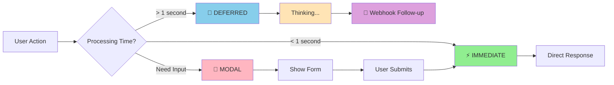

---

## 🎯 Quick Start: What You'll See in Logs Now

### **Before** (Hard to learn from):
```
Processing unified menu command
[MENU] ✅ Sent deferred response (ephemeral)
[MENU] 📤 Sending menu via webhook PATCH to @original
```

### **After** (Easy to learn from):
```
Processing unified menu command [🎯 SLASH]
[MENU] ✅ Sent deferred response [🔄 DEFERRED-NEW] [🔒 EPHEMERAL]
[MENU] 📤 Sending menu via webhook [🔗 WEBHOOK-PATCH] [🔒 EPHEMERAL]
```

**What you learn instantly:**
- This is a **slash command** 🎯
- It uses **deferred response pattern** 🔄 (creates "thinking..." state, gets 15-minute window)
- Response is sent via **webhook** 🔗 (follow-up after deferred)
- Message is **ephemeral** 🔒 (only visible to you)

---

## 📚 Pattern Reference Guide

### **🔄 Response Types** (How Discord API flow works)

| **Tag** | **Meaning** | **3-Second Rule** | **When to Use** | **Traditional Pattern** |
|---------|------------|-------------------|----------------|------------------------|
| `[⚡ IMMEDIATE-NEW]` | Creates new message instantly | ❌ Must respond <3s | Quick slash commands | **Request-Response** (Synchronous) |
| `[⚡ IMMEDIATE-UPDATE]` | Updates existing message instantly | ❌ Must respond <3s | Button clicks (most common) | **Request-Response** (Synchronous) |
| `[🔄 DEFERRED-NEW]` | "Thinking..." then webhook | ✅ Buys 15 minutes | Heavy slash commands | **Request-Acknowledge-Reply** (Async) |
| `[🔄 DEFERRED-UPDATE]` | Silent ACK then webhook | ✅ Buys 15 minutes | Heavy button processing | **Request-Acknowledge-Reply** (Async) |
| `[📝 MODAL]` | Shows a form | ❌ Must respond <3s | Collect user input | **Two-Phase Commit** (Interactive) |
| `[🔗 WEBHOOK-PATCH]` | Updates @original via webhook | N/A (follow-up) | After deferred response | **Callback Pattern** (Async continuation) |
| `[🔗 WEBHOOK-POST]` | Sends new message via webhook | N/A (follow-up) | Additional follow-up | **Event Notification** (Pub-Sub style) |

### **🔒 Visibility** (Who can see the message)

| **Tag** | **Meaning** | **Discord Shows** |
|---------|------------|-------------------|
| `[🔒 EPHEMERAL]` | Only visible to user who clicked | "Only you can see this" |
| `[👁️ PUBLIC]` | Visible to everyone in channel | Normal message |

### **🎯 Interaction Source** (What triggered this)

| **Tag** | **Meaning** | **Example** |
|---------|------------|-------------|
| `[🎯 SLASH]` | Slash command | `/menu`, `/castlist` |
| `[🔘 BUTTON]` | Button click | Production Menu button |
| `[📋 SELECT]` | Select menu | String select, user select |
| `[📝 SUBMIT]` | Modal submission | Form submitted |

### **✨ Architecture Pattern** (Code quality)

| **Tag** | **Meaning** | **What It Means** |
|---------|------------|-------------------|
| `[✨ FACTORY]` | Uses ButtonHandlerFactory | Modern, maintainable code |
| `[🪨 LEGACY]` | Old-style handler | Technical debt (to migrate) |
| `[📂 UNIFIED]` | Uses unified data access | Modern architecture pattern |

---

## 🎓 Learning Examples: Real Logs Explained

### **Example 1: Slash Command with Heavy Processing**

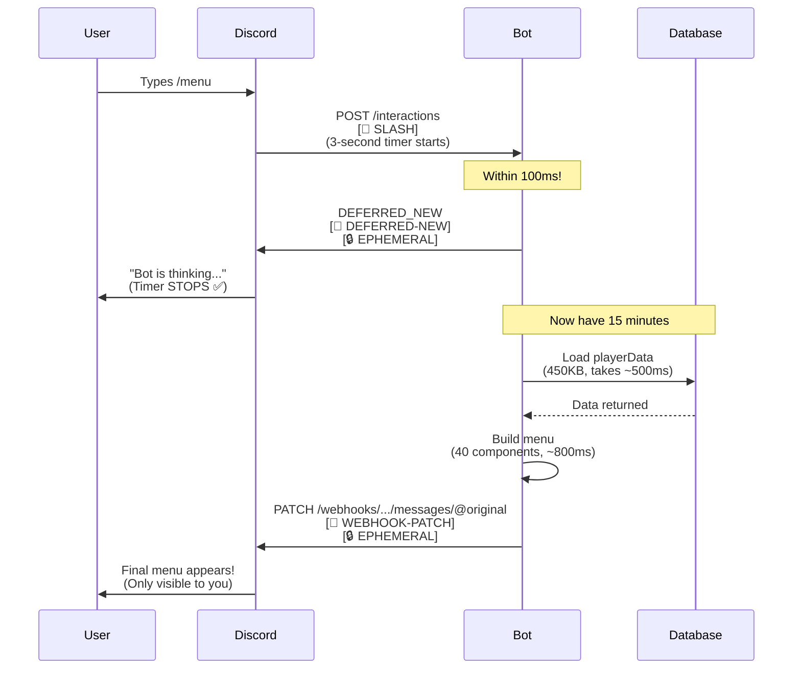

**Logs you'll see:**
```
Received command: menu [🎯 SLASH]
[MENU] ✅ Sent deferred response [🔄 DEFERRED-NEW] [🔒 EPHEMERAL]
[MENU] ⏱️ Guild fetched: CastBot
[MENU] ⏱️ PlayerData loaded (450285 bytes, 30 guilds)
[MENU] 📋 Production menu interface created
[MENU] 📤 Sending menu via webhook [🔗 WEBHOOK-PATCH] [🔒 EPHEMERAL]
[MENU] ✅ Menu sent successfully via webhook
```

**What you learn:**
1. **🎯 SLASH** - User typed `/menu` command
2. **🔄 DEFERRED-NEW** - Bot immediately tells Discord "I'm thinking..." (stops 3-second timer)
3. **Heavy processing** - Loads data, builds menu (takes time)
4. **🔗 WEBHOOK-PATCH** - Bot sends final menu via webhook (within 15-minute window)
5. **🔒 EPHEMERAL** - Only the user who typed `/menu` sees it

**Pattern:** DEFERRED → Process → WEBHOOK (for commands that take >1 second)

---

### **Example 2: Button Click (Instant Update)**

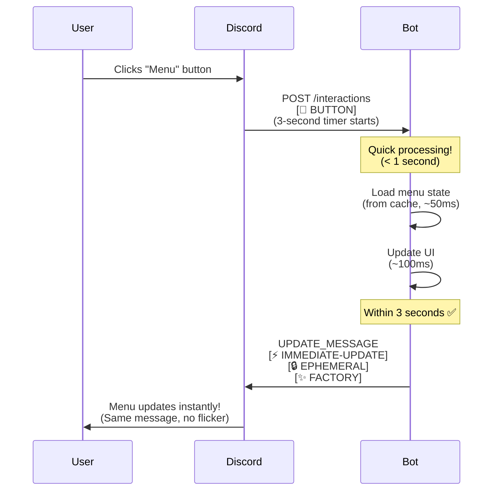

**Logs you'll see:**
```
Processing MESSAGE_COMPONENT: viral_menu [🔘 BUTTON]
🔍 ButtonHandlerFactory sending response [⚡ IMMEDIATE-UPDATE] [🔒 EPHEMERAL] [✨ FACTORY]
```

**What you learn:**
1. **🔘 BUTTON** - User clicked a button
2. **⚡ IMMEDIATE-UPDATE** - Bot responds within 3 seconds (no deferred needed)
3. **🔒 EPHEMERAL** - Updated message still only visible to user
4. **✨ FACTORY** - Uses modern ButtonHandlerFactory pattern (good code!)

**Pattern:** IMMEDIATE-UPDATE (for button clicks that are fast)

---

### **Example 3: Modal Form**

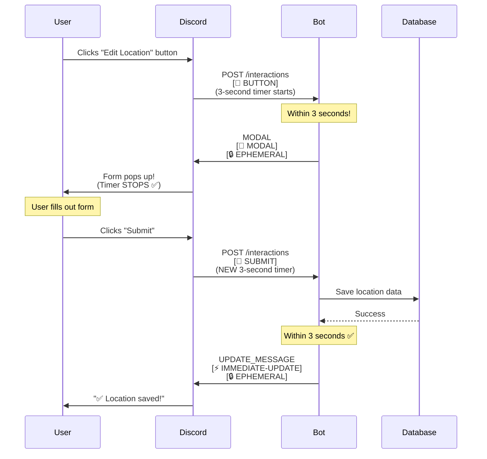

**Logs you'll see:**
```
Processing MESSAGE_COMPONENT: safari_location_edit [🔘 BUTTON]
Showing modal: safari_location_edit [📝 MODAL] [🔒 EPHEMERAL]

[User fills out form and clicks Submit]

Processing MODAL_SUBMIT: safari_location_edit [📝 SUBMIT]
✅ Saved location data
Sending response [⚡ IMMEDIATE-UPDATE] [🔒 EPHEMERAL]
```

**What you learn:**
1. **🔘 BUTTON** - User clicked "Edit Location" button
2. **📝 MODAL** - Bot shows a form (must respond within 3 seconds)
3. **📝 SUBMIT** - User submitted the form
4. **⚡ IMMEDIATE-UPDATE** - Bot processes and responds (updates original message)

**Pattern:** BUTTON → MODAL → SUBMIT → IMMEDIATE-UPDATE

---

## 🔗 Understanding Webhooks (The Confusing Part Explained)

### **What Are Webhooks?**

Webhooks are **follow-up messages** after you've already responded to an interaction.

### **Complete Webhook Flow Diagram**

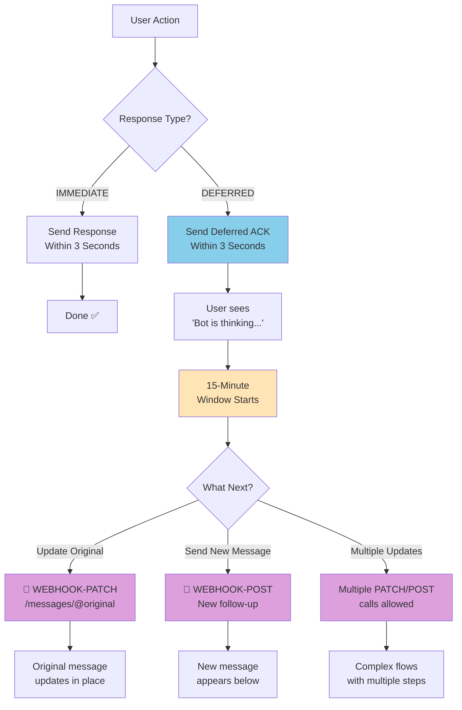

### **When Do You Use Webhooks?**

**Scenario 1: Deferred Response Flow (Most Common)**
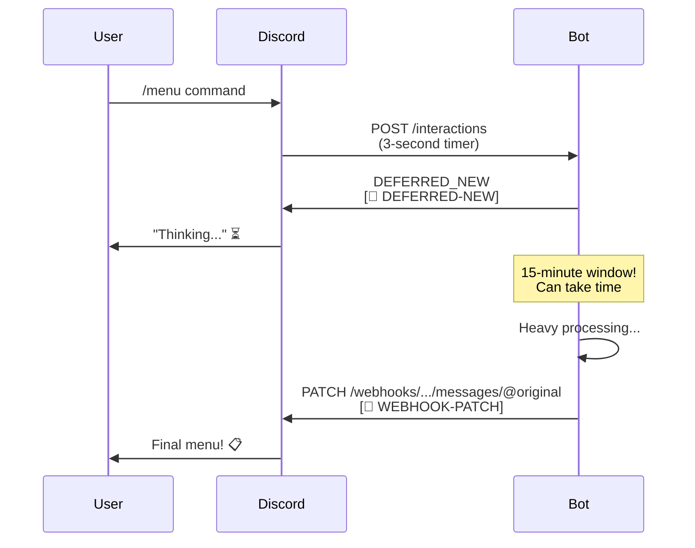

**Scenario 2: Additional Follow-up Messages**
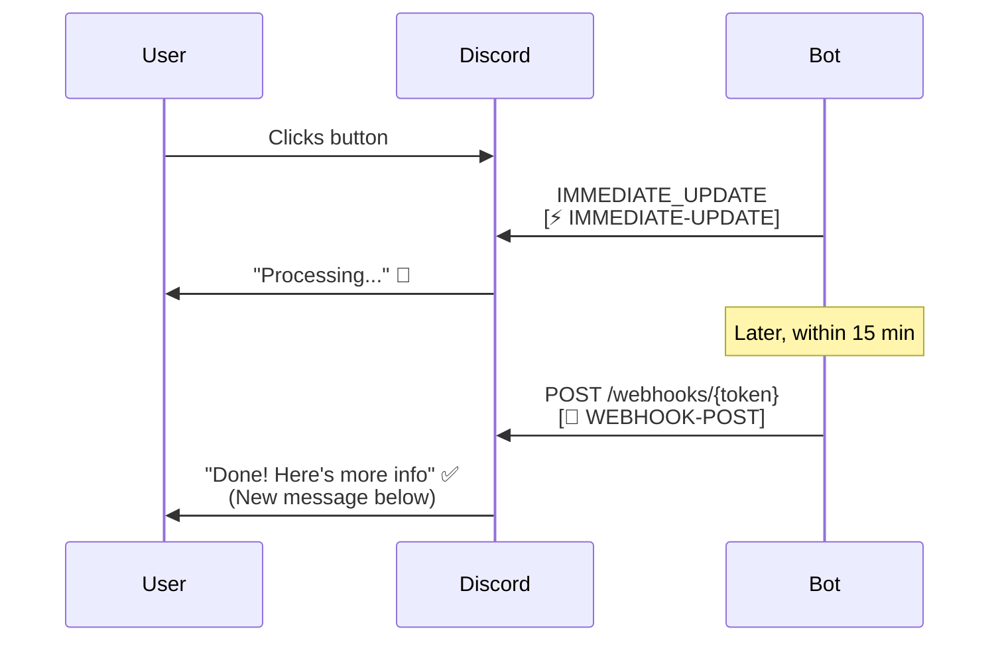

### **Why Use Webhooks?**

1. **Time Extension**: Deferred response gives you 15 minutes instead of 3 seconds
2. **Multiple Messages**: Can send additional messages after initial response
3. **Edit Original**: Can update the original message later

---

## 🎯 Learning Paths

### **Path 1: Button Handler Beginner**

Watch for these patterns in logs:
```
🔍 BUTTON DEBUG: Checking handlers for tips_next_0 [✨ FACTORY]
🔍 ButtonHandlerFactory sending response [⚡ IMMEDIATE-UPDATE] [✨ FACTORY]
```

**What to learn:**
- Modern buttons use `[✨ FACTORY]` pattern
- Button clicks use `[⚡ IMMEDIATE-UPDATE]` (update existing message)
- Most button responses are `[🔒 EPHEMERAL]` (private)

**After seeing 50 examples:** You'll know that buttons should use IMMEDIATE-UPDATE, not DEFERRED

---

### **Path 2: Slash Command Intermediate**

Watch for these patterns:
```
Received command: menu [🎯 SLASH]
[MENU] ✅ Sent deferred response [🔄 DEFERRED-NEW] [🔒 EPHEMERAL]
[MENU] 📤 Sending menu via webhook [🔗 WEBHOOK-PATCH] [🔒 EPHEMERAL]
```

**What to learn:**
- Heavy commands use DEFERRED → WEBHOOK pattern
- DEFERRED stops the 3-second timer
- WEBHOOK-PATCH sends the actual content

**After seeing 50 examples:** You'll internalize when to defer vs respond immediately

---

### **Path 3: Advanced - Understanding Timing**

Watch for timing patterns:
```
[MENU] ✅ Sent deferred response [🔄 DEFERRED-NEW]  ← This must happen <3s
[MENU] ⏱️ PlayerData loaded (450285 bytes, 30 guilds)  ← Can take time
[MENU] 📤 Sending menu via webhook [🔗 WEBHOOK-PATCH]  ← Within 15 minutes
```

**What to learn:**
- Deferred response MUST be sent within 3 seconds
- Then you have 15 minutes for heavy processing
- Webhook sends the final result

**After seeing 50 examples:** You'll understand why analytics must be non-blocking (RaP 0976)

---

## 🛠️ How to Use the Logging Utility

### **Import the Tags**
```javascript
const { discordLogTags: tags } = await import('./src/utils/discordLogTags.js');
```

### **Add to Your Logs**
```javascript
// Slash command
console.log(`Processing command: ${name} ${tags.source.SLASH}`);

// Deferred response
console.log(`Sent deferred ${tags.response.DEFERRED_NEW} ${tags.visibility.EPHEMERAL}`);

// Webhook follow-up
console.log(`Sending via webhook ${tags.response.WEBHOOK_PATCH} ${tags.visibility.PUBLIC}`);

// Button click
console.log(`Processing button ${tags.source.BUTTON} ${tags.pattern.FACTORY}`);
```

### **Helper Functions** (Auto-Detect Tags)
```javascript
import { getResponseTag, getVisibilityTag, getComponentTag } from './src/utils/discordLogTags.js';

// Auto-detect response type
const responseTag = getResponseTag(InteractionResponseType.UPDATE_MESSAGE);
// Returns: "[⚡ IMMEDIATE-UPDATE]"

// Auto-detect visibility
const visibilityTag = getVisibilityTag(InteractionResponseFlags.EPHEMERAL);
// Returns: "[🔒 EPHEMERAL]"

// Auto-detect component limit status
const componentTag = getComponentTag(38, 40);
// Returns: "[⚠️ COMPONENTS-NEAR]" (35-40 range)
```

---

## 📊 Common Patterns You'll See

### **Pattern: Slash Command (Fast)**

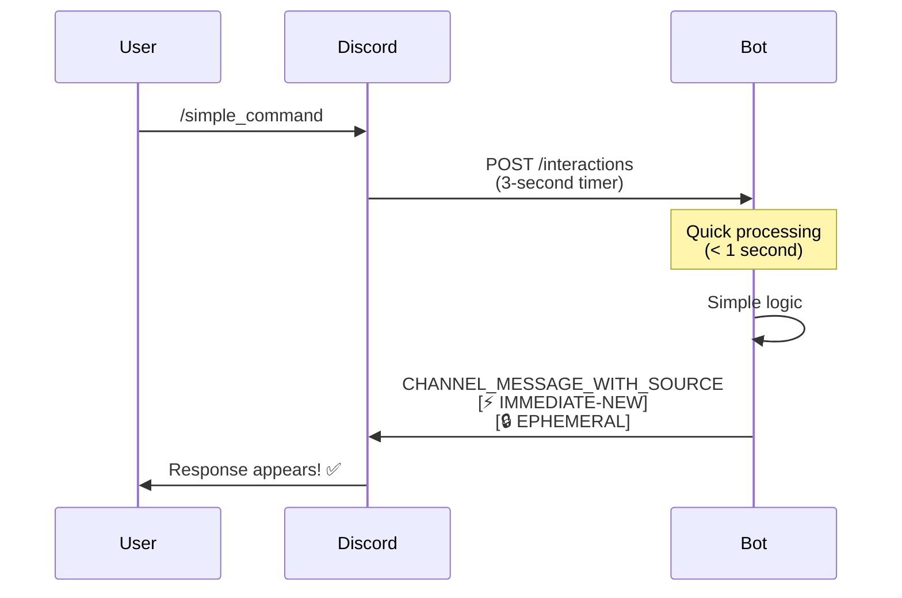

**Logs:**
```
Received command: simple_command [🎯 SLASH]
Sending response [⚡ IMMEDIATE-NEW] [🔒 EPHEMERAL]
```
**When**: Command finishes in <1 second

---

### **Pattern: Slash Command (Slow)**

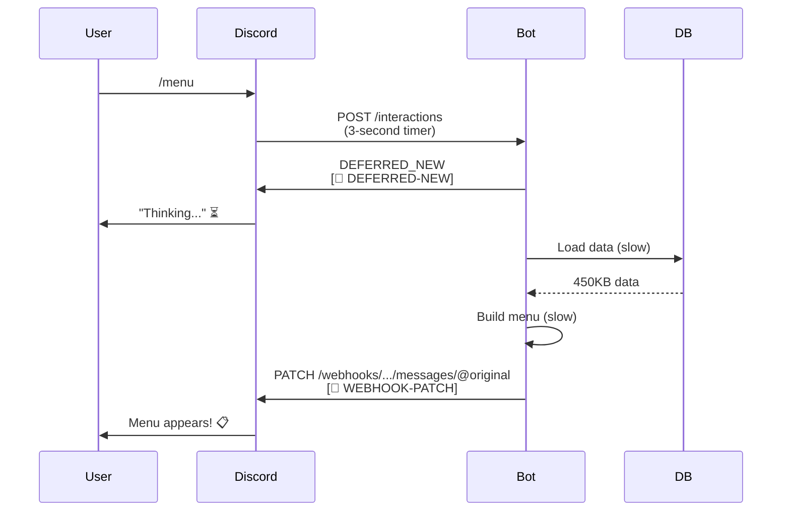

**Logs:**
```
Received command: menu [🎯 SLASH]
Sent deferred [🔄 DEFERRED-NEW] [🔒 EPHEMERAL]
[Processing...]
Sending via webhook [🔗 WEBHOOK-PATCH] [🔒 EPHEMERAL]
```
**When**: Command takes >1 second (common for /menu, /castlist)

---

### **Pattern: Button Update**

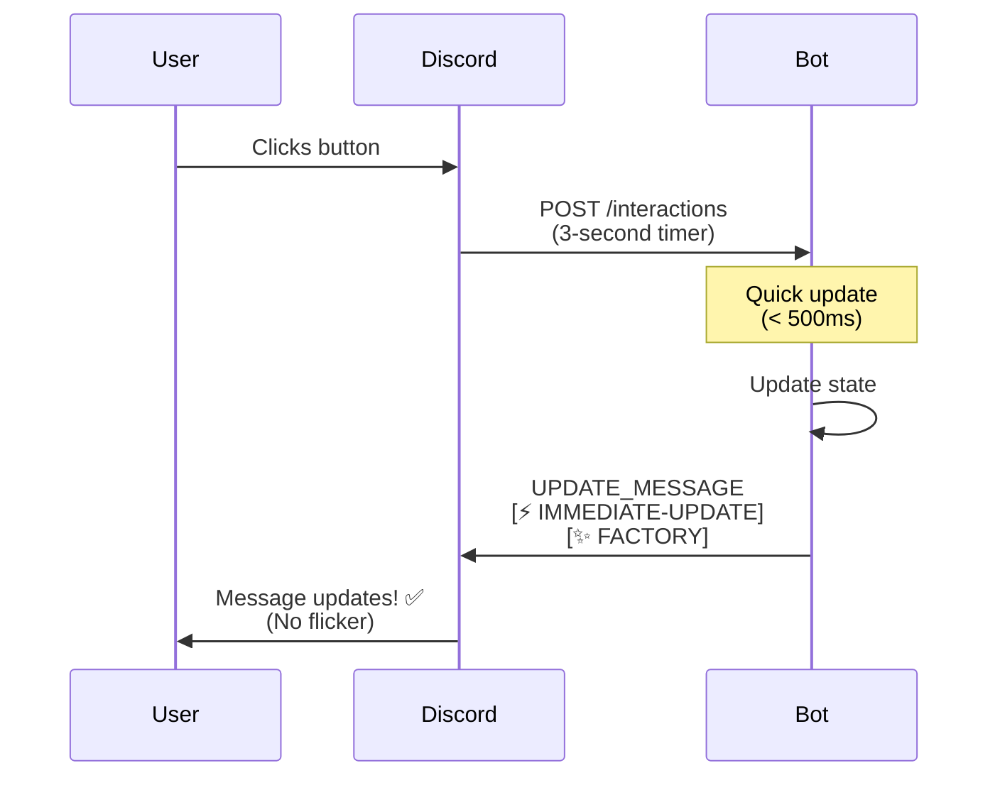

**Logs:**
```
Processing MESSAGE_COMPONENT: button_id [🔘 BUTTON]
Sending response [⚡ IMMEDIATE-UPDATE] [🔒 EPHEMERAL] [✨ FACTORY]
```
**When**: Button click updates the same message (most common)

---

### **Pattern: Modal Form**

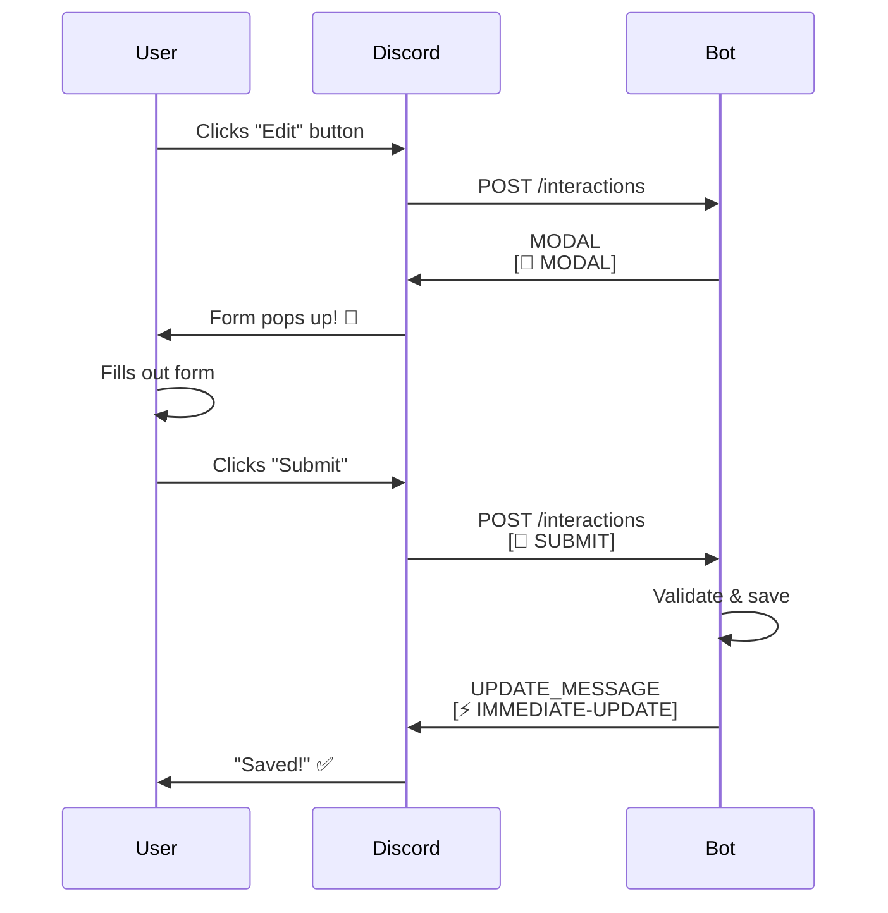

**Logs:**
```
Showing modal [📝 MODAL] [🔒 EPHEMERAL]
[User fills form]
Processing MODAL_SUBMIT [📝 SUBMIT]
Sending response [⚡ IMMEDIATE-UPDATE] [🔒 EPHEMERAL]
```
**When**: Collecting user input via form

---

## 🎓 Learning Exercises

### **Exercise 1: Identify Patterns**

Look at your logs and answer:
1. Which commands use DEFERRED-NEW? (Look for `[🔄 DEFERRED-NEW]`)
2. Which buttons use FACTORY? (Look for `[✨ FACTORY]`)
3. Which interactions are PUBLIC? (Look for `[👁️ PUBLIC]`)

**Goal**: After 1 week, you should recognize patterns instantly

---

### **Exercise 2: Predict Behavior**

Before clicking a button, predict:
1. Will it use IMMEDIATE or DEFERRED?
2. Will it be EPHEMERAL or PUBLIC?
3. Will it UPDATE or create NEW message?

**Then click and check logs to verify your prediction**

**Goal**: Build intuition about Discord API behavior

---

### **Exercise 3: Debug Using Logs**

When something fails:
1. Check for `[⚡ IMMEDIATE-*]` - Did response come within 3 seconds?
2. Check for `[🔄 DEFERRED-*]` - Was deferred response sent early enough?
3. Check for `[🔗 WEBHOOK-*]` - Did webhook follow-up fail?

**Goal**: Use logs to diagnose Discord timeout issues

---

## 🎓 Decision Tree: Which Pattern Should I Use?

```mermaid
flowchart TD
    Start[User Interaction] --> Q1{What type?}

    Q1 -->|Slash Command| Q2{Processing time?}
    Q1 -->|Button Click| Q3{Update message?}
    Q1 -->|Need User Input| Modal[Show MODAL<br/>[📝 MODAL]]

    Q2 -->|< 1 second| Fast[IMMEDIATE-NEW<br/>[⚡ IMMEDIATE-NEW]]
    Q2 -->|> 1 second| Slow[DEFERRED-NEW<br/>[🔄 DEFERRED-NEW]<br/>then WEBHOOK-PATCH<br/>[🔗 WEBHOOK-PATCH]]

    Q3 -->|Yes, fast update| Update[IMMEDIATE-UPDATE<br/>[⚡ IMMEDIATE-UPDATE]]
    Q3 -->|Yes, slow update| DeferUpdate[DEFERRED-UPDATE<br/>[🔄 DEFERRED-UPDATE]<br/>then WEBHOOK-PATCH]
    Q3 -->|No, new message| NewMsg[IMMEDIATE-NEW<br/>[⚡ IMMEDIATE-NEW]]

    Modal --> ModalSubmit[User submits]
    ModalSubmit --> Update

    style Fast fill:#90EE90
    style Slow fill:#87CEEB
    style Update fill:#90EE90
    style DeferUpdate fill:#87CEEB
    style Modal fill:#FFB6C1
```

**Quick Rules:**
1. **Button click updating same message?** → `[⚡ IMMEDIATE-UPDATE]` (most common!)
2. **Slash command < 1 second?** → `[⚡ IMMEDIATE-NEW]`
3. **Slash command > 1 second?** → `[🔄 DEFERRED-NEW]` → `[🔗 WEBHOOK-PATCH]`
4. **Need user input?** → `[📝 MODAL]` → (user submits) → `[⚡ IMMEDIATE-UPDATE]`

---

## 📚 Traditional Software Patterns Explained

Understanding how Discord patterns map to traditional software architecture:

### **Request-Response (Synchronous)**
```
User → Request → Server processes → Response → User
[⚡ IMMEDIATE-*] patterns
```
**Traditional examples:**
- HTTP GET/POST requests
- Function calls with immediate return
- RPC (Remote Procedure Call)

**Discord usage:** Button clicks, fast slash commands

---

### **Request-Acknowledge-Reply (Asynchronous)**
```
User → Request → Server ACK → User sees "processing..."
      → Server processes (background) → Reply → User
[🔄 DEFERRED-*] + [🔗 WEBHOOK-PATCH] patterns
```
**Traditional examples:**
- Message queues (RabbitMQ, Kafka)
- Long-polling HTTP
- Job queues (Sidekiq, Celery)

**Discord usage:** Heavy slash commands (/menu, /castlist)

---

### **Two-Phase Commit (Interactive)**
```
Phase 1: User → Request → Server shows form → User
Phase 2: User fills form → Submit → Server validates → Response
[📝 MODAL] → [📝 SUBMIT] → [⚡ IMMEDIATE-UPDATE]
```
**Traditional examples:**
- Database transactions (prepare → commit)
- Wizard-style UIs
- Form validation flows

**Discord usage:** Modals (edit location, create item, etc.)

---

### **Callback Pattern (Async Continuation)**
```
Initial response → Long operation → Callback with result
[🔄 DEFERRED-*] → processing → [🔗 WEBHOOK-PATCH]
```
**Traditional examples:**
- JavaScript Promises/async-await
- Node.js callbacks
- Event listeners

**Discord usage:** Webhook follow-ups after deferred response

---

### **Event Notification (Pub-Sub Style)**
```
Action → Event published → Subscribers notified
[🔗 WEBHOOK-POST] for additional messages
```
**Traditional examples:**
- Pub-Sub systems (Redis, Google Pub/Sub)
- Event-driven architecture
- Observer pattern

**Discord usage:** Sending additional follow-up messages

---

### **Pattern Comparison Table**

| **Discord Pattern** | **Traditional Pattern** | **Blocking?** | **Timeout** | **Use Case** |
|---------------------|------------------------|---------------|-------------|--------------|
| IMMEDIATE | Request-Response | ✅ Yes | 3 seconds | Quick operations |
| DEFERRED + WEBHOOK | Request-Acknowledge-Reply | ❌ No | 15 minutes | Heavy processing |
| MODAL → SUBMIT | Two-Phase Commit | ✅ Yes (per phase) | 3s each phase | User input needed |
| WEBHOOK-PATCH | Callback | ❌ No | 15 minutes | Update original message |
| WEBHOOK-POST | Event Notification | ❌ No | 15 minutes | Send new messages |

---

## 🔗 Related Documentation

- **[DiscordInteractionAPI.md](../standards/DiscordInteractionAPI.md)** - Complete API reference
- **[ButtonHandlerFactory.md](../enablers/ButtonHandlerFactory.md)** - Button patterns
- **[ButtonInteractionLogging.md](../standards/ButtonInteractionLogging.md)** - Button logging details
- **[RaP 0976](../../RaP/0976_20251116_Analytics_Nonblocking_Optimization.md)** - Why timing matters

---

## 💡 Tips for Learning

1. **Keep logs visible** - Run `tail -f /tmp/castbot-dev.log` in a terminal
2. **Click slowly** - Give yourself time to read the logs
3. **Notice patterns** - After 10-20 interactions, patterns emerge
4. **Ask questions** - If you see a pattern you don't understand, ask Claude Code to explain
5. **Experiment** - Try different buttons and commands to see different patterns

---

**Remember**: The goal is **passive learning**. You don't need to memorize this document. Just observe the logs, and the patterns will become second nature! 🚀
