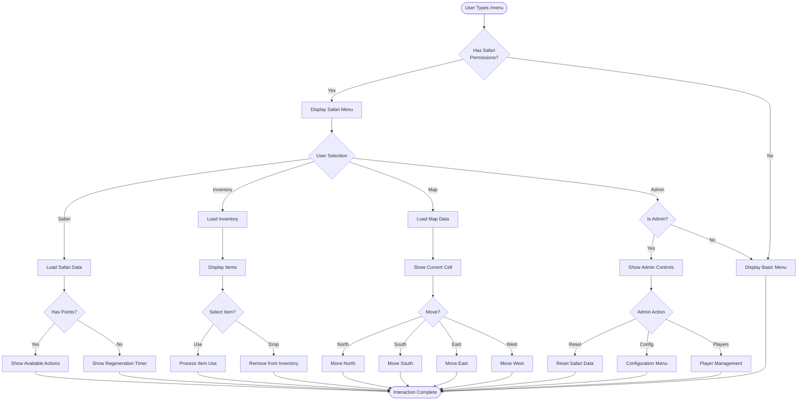
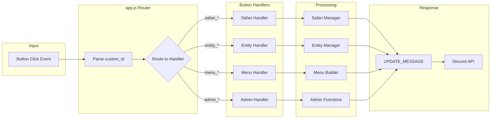

# Flowchart Diagram

## CastBot Interaction Flow

```mermaid
flowchart TD
    Start([User Types /menu]) --> CheckPerms{Has Safari<br/>Permissions?}
    
    CheckPerms -->|Yes| ShowMenu[Display Safari Menu]
    CheckPerms -->|No| ShowBasic[Display Basic Menu]
    
    ShowMenu --> UserChoice{User Selection}
    
    UserChoice -->|Safari| LoadSafari[Load Safari Data]
    UserChoice -->|Inventory| LoadInv[Load Inventory]
    UserChoice -->|Map| LoadMap[Load Map Data]
    UserChoice -->|Admin| AdminCheck{Is Admin?}
    
    LoadSafari --> CheckPoints{Has Points?}
    CheckPoints -->|Yes| ShowActions[Show Available Actions]
    CheckPoints -->|No| ShowRegen[Show Regeneration Timer]
    
    LoadInv --> DisplayItems[Display Items]
    DisplayItems --> ItemAction{Select Item?}
    ItemAction -->|Use| UseItem[Process Item Use]
    ItemAction -->|Drop| DropItem[Remove from Inventory]
    
    LoadMap --> ShowLocation[Show Current Cell]
    ShowLocation --> Movement{Move?}
    Movement -->|North| MoveN[Move North]
    Movement -->|South| MoveS[Move South]
    Movement -->|East| MoveE[Move East]
    Movement -->|West| MoveW[Move West]
    
    AdminCheck -->|Yes| AdminMenu[Show Admin Controls]
    AdminCheck -->|No| ShowBasic
    
    AdminMenu --> AdminAction{Admin Action}
    AdminAction -->|Reset| ResetSafari[Reset Safari Data]
    AdminAction -->|Config| ConfigMenu[Configuration Menu]
    AdminAction -->|Players| PlayerMgmt[Player Management]
    
    ShowActions --> End([Interaction Complete])
    ShowRegen --> End
    UseItem --> End
    DropItem --> End
    MoveN --> End
    MoveS --> End
    MoveE --> End
    MoveW --> End
    ResetSafari --> End
    ConfigMenu --> End
    PlayerMgmt --> End
    ShowBasic --> End
```

## Button Handler Decision Tree

```mermaid
flowchart LR
    subgraph Input
        ButtonClick[Button Click Event]
    end
    
    subgraph Router ["app.js Router"]
        ButtonClick --> Parse[Parse custom_id]
        Parse --> Route{Route to Handler}
    end
    
    subgraph Handlers ["Button Handlers"]
        Route -->|safari_*| SafariHandler[Safari Handler]
        Route -->|entity_*| EntityHandler[Entity Handler]
        Route -->|menu_*| MenuHandler[Menu Handler]
        Route -->|admin_*| AdminHandler[Admin Handler]
    end
    
    subgraph Processing
        SafariHandler --> SafariLogic[Safari Manager]
        EntityHandler --> EntityLogic[Entity Manager]
        MenuHandler --> MenuLogic[Menu Builder]
        AdminHandler --> AdminLogic[Admin Functions]
    end
    
    subgraph Response
        SafariLogic --> UpdateMsg[UPDATE_MESSAGE]
        EntityLogic --> UpdateMsg
        MenuLogic --> UpdateMsg
        AdminLogic --> UpdateMsg
        UpdateMsg --> Discord[Discord API]
    end
```