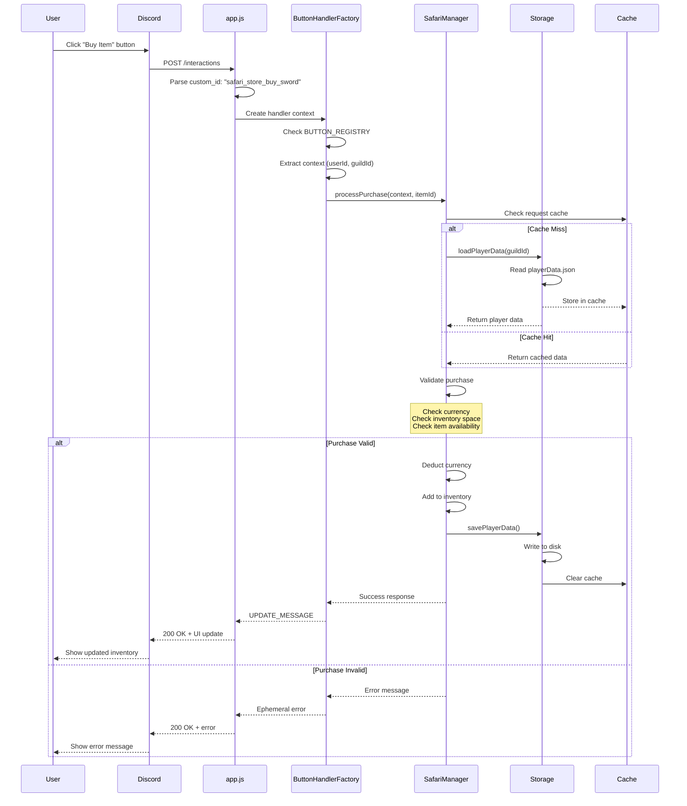
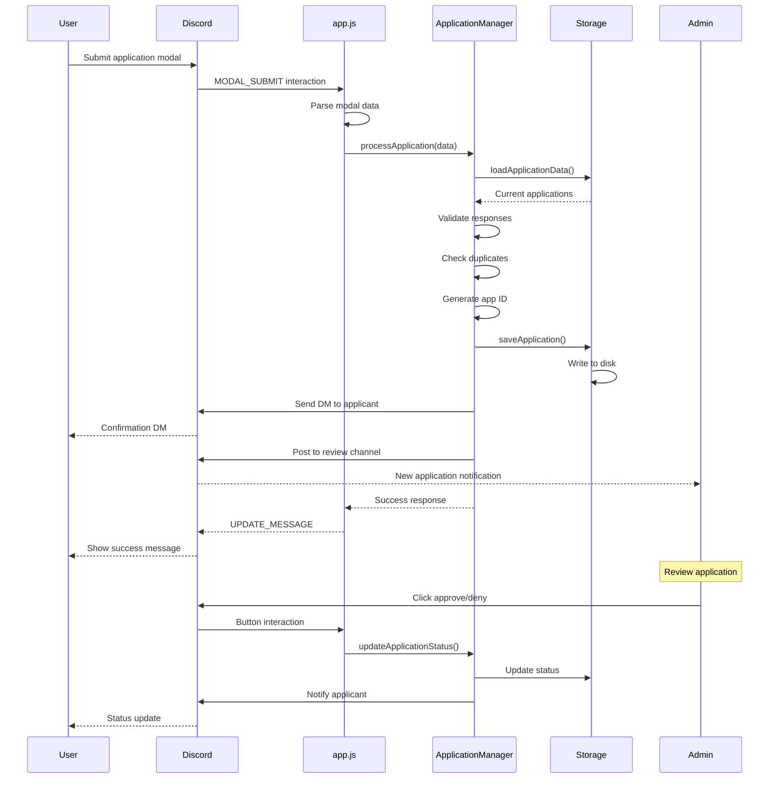

# Sequence Diagram

## Safari Store Purchase Flow

```mermaid
sequenceDiagram
    participant User
    participant Discord
    participant App as app.js
    participant BHF as ButtonHandlerFactory
    participant SM as SafariManager
    participant Storage
    participant Cache

    User->>Discord: Click "Buy Item" button
    Discord->>App: POST /interactions
    App->>App: Parse custom_id: "safari_store_buy_sword"
    App->>BHF: Create handler context
    
    BHF->>BHF: Check BUTTON_REGISTRY
    BHF->>BHF: Extract context (userId, guildId)
    BHF->>SM: processPurchase(context, itemId)
    
    SM->>Cache: Check request cache
    alt Cache Miss
        SM->>Storage: loadPlayerData(guildId)
        Storage->>Storage: Read playerData.json
        Storage-->>Cache: Store in cache
        Storage-->>SM: Return player data
    else Cache Hit
        Cache-->>SM: Return cached data
    end
    
    SM->>SM: Validate purchase
    Note over SM: Check currency<br/>Check inventory space<br/>Check item availability
    
    alt Purchase Valid
        SM->>SM: Deduct currency
        SM->>SM: Add to inventory
        SM->>Storage: savePlayerData()
        Storage->>Storage: Write to disk
        Storage->>Cache: Clear cache
        SM-->>BHF: Success response
        BHF-->>App: UPDATE_MESSAGE
        App-->>Discord: 200 OK + UI update
        Discord-->>User: Show updated inventory
    else Purchase Invalid
        SM-->>BHF: Error message
        BHF-->>App: Ephemeral error
        App-->>Discord: 200 OK + error
        Discord-->>User: Show error message
    end
```

## Application Submission Flow

```mermaid
sequenceDiagram
    participant User
    participant Discord
    participant App as app.js
    participant AM as ApplicationManager
    participant Storage
    participant Admin

    User->>Discord: Submit application modal
    Discord->>App: MODAL_SUBMIT interaction
    
    App->>App: Parse modal data
    App->>AM: processApplication(data)
    
    AM->>Storage: loadApplicationData()
    Storage-->>AM: Current applications
    
    AM->>AM: Validate responses
    AM->>AM: Check duplicates
    AM->>AM: Generate app ID
    
    AM->>Storage: saveApplication()
    Storage->>Storage: Write to disk
    
    AM->>Discord: Send DM to applicant
    Discord-->>User: Confirmation DM
    
    AM->>Discord: Post to review channel
    Discord-->>Admin: New application notification
    
    AM-->>App: Success response
    App-->>Discord: UPDATE_MESSAGE
    Discord-->>User: Show success message
    
    Note over Admin: Review application
    Admin->>Discord: Click approve/deny
    Discord->>App: Button interaction
    App->>AM: updateApplicationStatus()
    AM->>Storage: Update status
    AM->>Discord: Notify applicant
    Discord-->>User: Status update
```