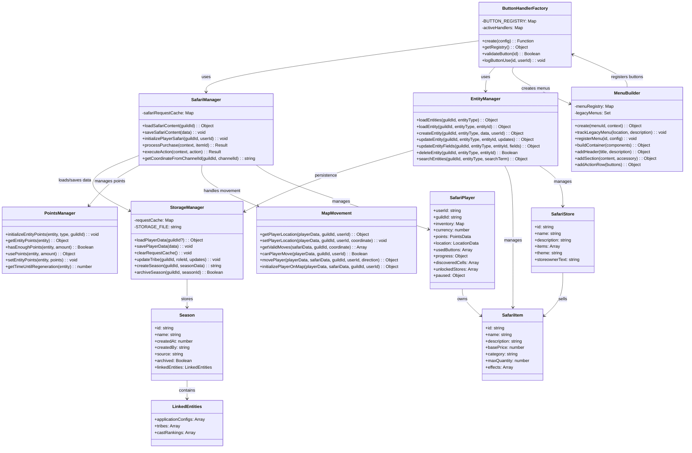
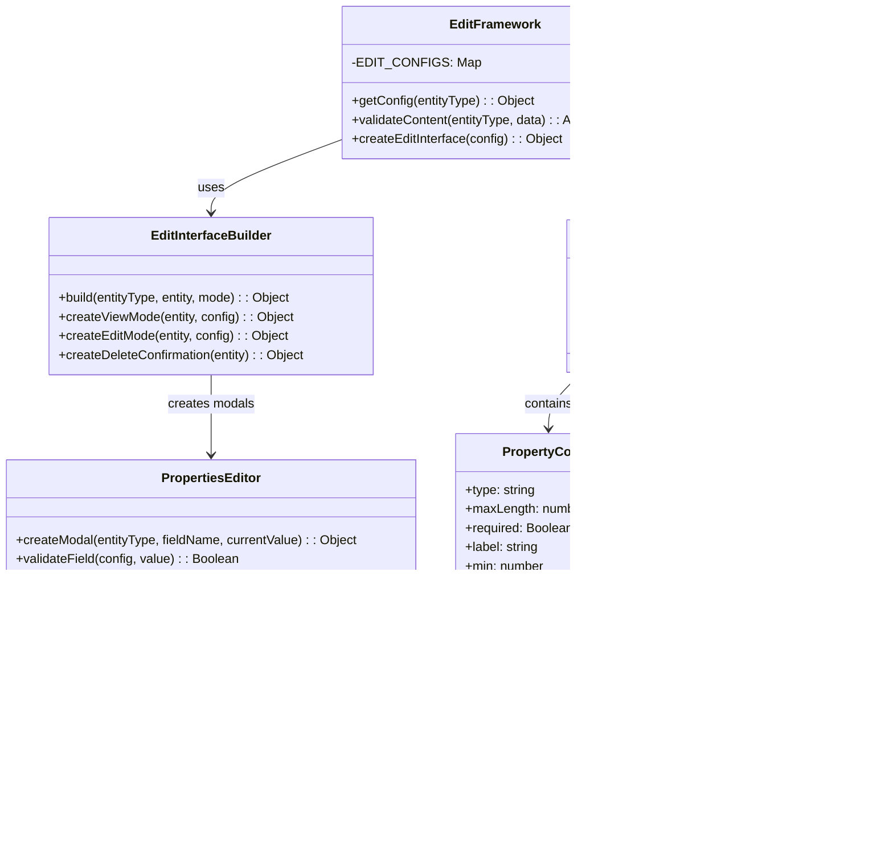

# Class Diagram

## CastBot Core Classes and Relationships

```mermaid
classDiagram
    class ButtonHandlerFactory {
        -BUTTON_REGISTRY: Map
        -activeHandlers: Map
        +create(config): Function
        +getRegistry(): Object
        +validateButton(id): Boolean
        +logButtonUse(id, userId): void
    }
    
    class SafariManager {
        -safariRequestCache: Map
        +loadSafariContent(guildId): Object
        +saveSafariContent(data): void
        +initializePlayerSafari(guildId, userId): void
        +processPurchase(context, itemId): Result
        +executeAction(context, action): Result
        +getCoordinateFromChannelId(guildId, channelId): string
    }
    
    class EntityManager {
        +loadEntities(guildId, entityType): Object
        +loadEntity(guildId, entityType, entityId): Object
        +createEntity(guildId, entityType, data, userId): Object
        +updateEntity(guildId, entityType, entityId, updates): Object
        +updateEntityFields(guildId, entityType, entityId, fields): Object
        +deleteEntity(guildId, entityType, entityId): Boolean
        +searchEntities(guildId, entityType, searchTerm): Object
    }
    
    class StorageManager {
        -requestCache: Map
        -STORAGE_FILE: string
        +loadPlayerData(guildId?): Object
        +savePlayerData(data): void
        +clearRequestCache(): void
        +updateTribe(guildId, roleId, updates): void
        +createSeason(guildId, seasonData): string
        +archiveSeason(guildId, seasonId): Boolean
    }
    
    class PointsManager {
        +initializeEntityPoints(entity, type, guildId): void
        +getEntityPoints(entity): Object
        +hasEnoughPoints(entity, amount): Boolean
        +usePoints(entity, amount): Object
        +setEntityPoints(entity, points): void
        +getTimeUntilRegeneration(entity): number
    }
    
    class MapMovement {
        +getPlayerLocation(playerData, guildId, userId): Object
        +setPlayerLocation(playerData, guildId, userId, coordinate): void
        +getValidMoves(safariData, guildId, coordinate): Array
        +canPlayerMove(playerData, guildId, userId): Boolean
        +movePlayer(playerData, safariData, guildId, userId, direction): Object
        +initializePlayerOnMap(playerData, safariData, guildId, userId): Object
    }
    
    class MenuBuilder {
        -menuRegistry: Map
        -legacyMenus: Set
        +create(menuId, context): Object
        +trackLegacyMenu(location, description): void
        +registerMenu(id, config): void
        +buildContainer(components): Object
        +addHeader(title, description): Object
        +addSection(content, accessory): Object
        +addActionRow(buttons): Object
    }
    
    class SafariPlayer {
        +userId: string
        +guildId: string
        +inventory: Map
        +currency: number
        +points: PointsData
        +location: LocationData
        +usedButtons: Array
        +progress: Object
        +discoveredCells: Array
        +unlockedStores: Array
        +paused: Object
    }
    
    class Season {
        +id: string
        +name: string
        +createdAt: number
        +createdBy: string
        +source: string
        +archived: Boolean
        +linkedEntities: LinkedEntities
    }
    
    class LinkedEntities {
        +applicationConfigs: Array
        +tribes: Array
        +castRankings: Array
    }
    
    class SafariItem {
        +id: string
        +name: string
        +description: string
        +basePrice: number
        +category: string
        +maxQuantity: number
        +effects: Array
    }
    
    class SafariStore {
        +id: string
        +name: string
        +description: string
        +items: Array
        +theme: string
        +storeownerText: string
    }
    
    ButtonHandlerFactory --> SafariManager: uses
    ButtonHandlerFactory --> EntityManager: uses
    ButtonHandlerFactory --> MenuBuilder: creates menus
    
    SafariManager --> StorageManager: loads/saves data
    SafariManager --> PointsManager: manages points
    SafariManager --> MapMovement: handles movement
    SafariManager --> SafariPlayer: manages
    
    EntityManager --> StorageManager: persistence
    EntityManager --> SafariItem: manages
    EntityManager --> SafariStore: manages
    
    StorageManager --> Season: stores
    Season --> LinkedEntities: contains
    
    SafariPlayer --> SafariItem: owns
    SafariStore --> SafariItem: sells
    
    MenuBuilder --> ButtonHandlerFactory: registers buttons
```

## Entity Edit Framework Classes

```mermaid
classDiagram
    class EditFramework {
        -EDIT_CONFIGS: Map
        +getConfig(entityType): Object
        +validateContent(entityType, data): Array
        +createEditInterface(config): Object
    }
    
    class EditInterfaceBuilder {
        +build(entityType, entity, mode): Object
        +createViewMode(entity, config): Object
        +createEditMode(entity, config): Object
        +createDeleteConfirmation(entity): Object
    }
    
    class PropertiesEditor {
        +createModal(entityType, fieldName, currentValue): Object
        +validateField(config, value): Boolean
        +formatFieldDisplay(config, value): string
    }
    
    class FieldEditor {
        +editTextField(config, value): Object
        +editNumberField(config, value): Object
        +editSelectField(config, value, options): Object
        +editTagsField(config, value): Object
    }
    
    class EntityConfig {
        +displayName: string
        +properties: Map
        +content: ContentConfig
        +operations: Array
    }
    
    class PropertyConfig {
        +type: string
        +maxLength: number
        +required: Boolean
        +label: string
        +min: number
        +max: number
    }
    
    class ContentConfig {
        +type: string
        +label: string
        +maxItems: number
        +itemLabel: string
        +itemLabelPlural: string
    }
    
    EditFramework --> EntityConfig: defines
    EditFramework --> EditInterfaceBuilder: uses
    EditInterfaceBuilder --> PropertiesEditor: creates modals
    PropertiesEditor --> FieldEditor: delegates editing
    EntityConfig --> PropertyConfig: contains
    EntityConfig --> ContentConfig: contains
```