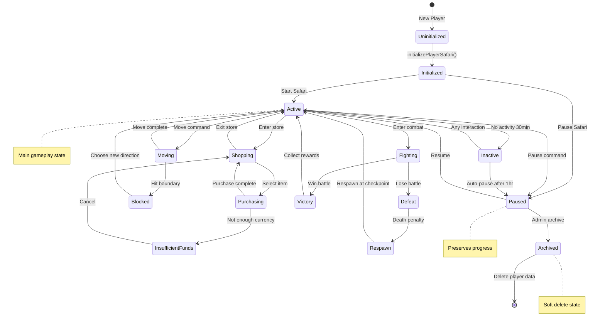
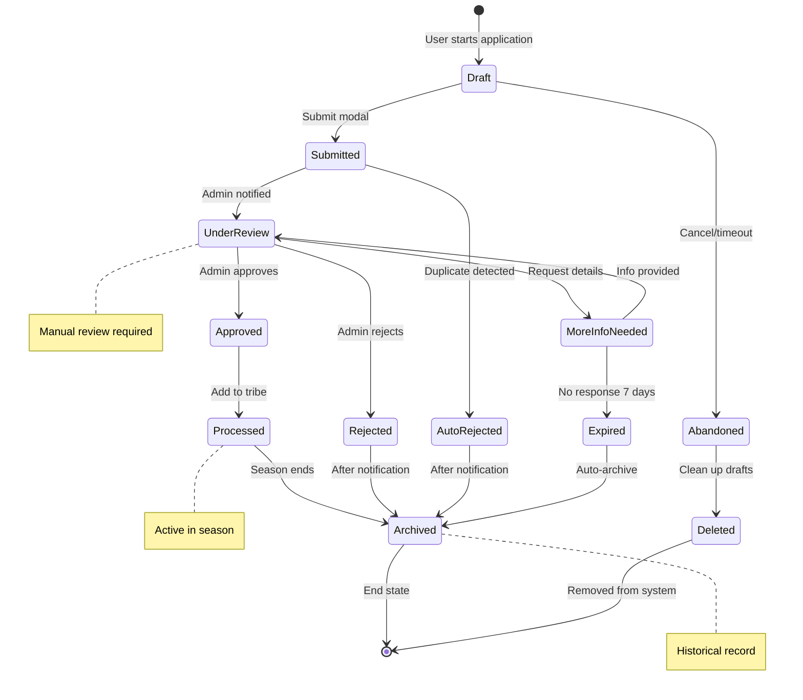
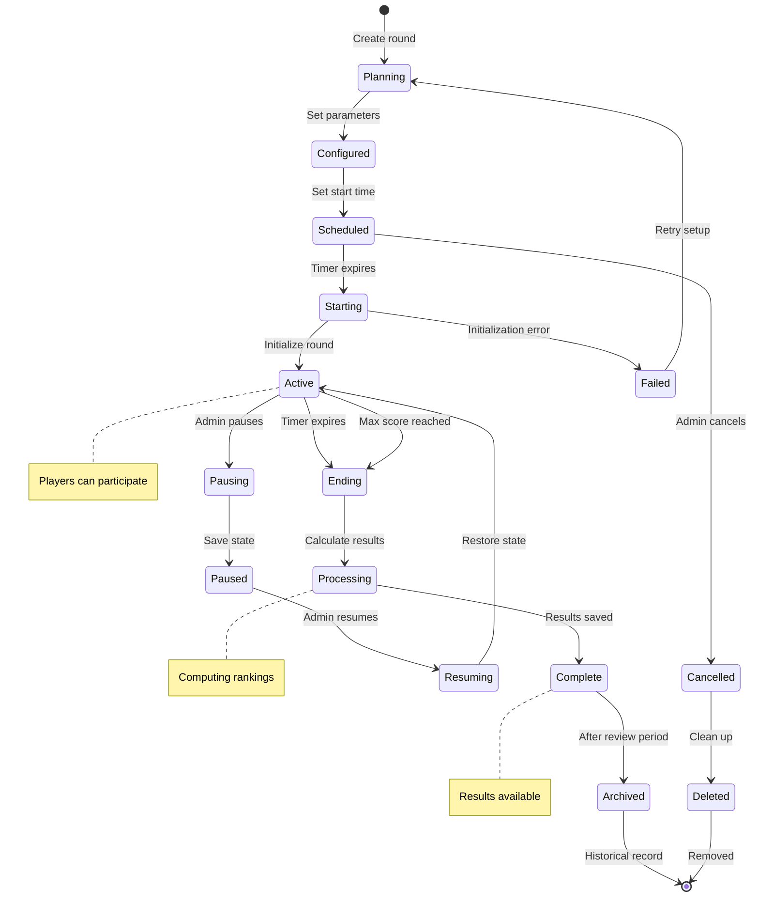

# State Diagram

## Safari Player State Machine

```mermaid
stateDiagram-v2
    [*] --> Uninitialized: New Player
    
    Uninitialized --> Initialized: initializePlayerSafari()
    
    Initialized --> Active: Start Safari
    Initialized --> Paused: Pause Safari
    
    Active --> Moving: Move command
    Active --> Shopping: Enter store
    Active --> Fighting: Enter combat
    Active --> Paused: Pause command
    Active --> Inactive: No activity 30min
    
    Moving --> Active: Move complete
    Moving --> Blocked: Hit boundary
    Blocked --> Active: Choose new direction
    
    Shopping --> Purchasing: Select item
    Purchasing --> Shopping: Purchase complete
    Purchasing --> InsufficientFunds: Not enough currency
    InsufficientFunds --> Shopping: Cancel
    Shopping --> Active: Exit store
    
    Fighting --> Victory: Win battle
    Fighting --> Defeat: Lose battle
    Victory --> Active: Collect rewards
    Defeat --> Respawn: Death penalty
    Respawn --> Active: Respawn at checkpoint
    
    Paused --> Active: Resume
    Paused --> Archived: Admin archive
    
    Inactive --> Active: Any interaction
    Inactive --> Paused: Auto-pause after 1hr
    
    Archived --> [*]: Delete player data
    
    note right of Active: Main gameplay state
    note right of Paused: Preserves progress
    note right of Archived: Soft delete state
```

## Application Processing States

```mermaid
stateDiagram-v2
    [*] --> Draft: User starts application
    
    Draft --> Submitted: Submit modal
    Draft --> Abandoned: Cancel/timeout
    
    Submitted --> UnderReview: Admin notified
    Submitted --> AutoRejected: Duplicate detected
    
    UnderReview --> Approved: Admin approves
    UnderReview --> Rejected: Admin rejects
    UnderReview --> MoreInfoNeeded: Request details
    
    MoreInfoNeeded --> UnderReview: Info provided
    MoreInfoNeeded --> Expired: No response 7 days
    
    Approved --> Processed: Add to tribe
    Processed --> Archived: Season ends
    
    Rejected --> Archived: After notification
    AutoRejected --> Archived: After notification
    Expired --> Archived: Auto-archive
    Abandoned --> Deleted: Clean up drafts
    
    Archived --> [*]: End state
    Deleted --> [*]: Removed from system
    
    note right of UnderReview: Manual review required
    note right of Processed: Active in season
    note right of Archived: Historical record
```

## Round Management State Machine

```mermaid
stateDiagram-v2
    [*] --> Planning: Create round
    
    Planning --> Configured: Set parameters
    Configured --> Scheduled: Set start time
    
    Scheduled --> Starting: Timer expires
    Scheduled --> Cancelled: Admin cancels
    
    Starting --> Active: Initialize round
    Starting --> Failed: Initialization error
    
    Active --> Pausing: Admin pauses
    Active --> Ending: Timer expires
    Active --> Ending: Max score reached
    
    Pausing --> Paused: Save state
    Paused --> Resuming: Admin resumes
    Resuming --> Active: Restore state
    
    Ending --> Processing: Calculate results
    Processing --> Complete: Results saved
    
    Complete --> Archived: After review period
    Failed --> Planning: Retry setup
    Cancelled --> Deleted: Clean up
    
    Archived --> [*]: Historical record
    Deleted --> [*]: Removed
    
    note right of Active: Players can participate
    note right of Processing: Computing rankings
    note right of Complete: Results available
```