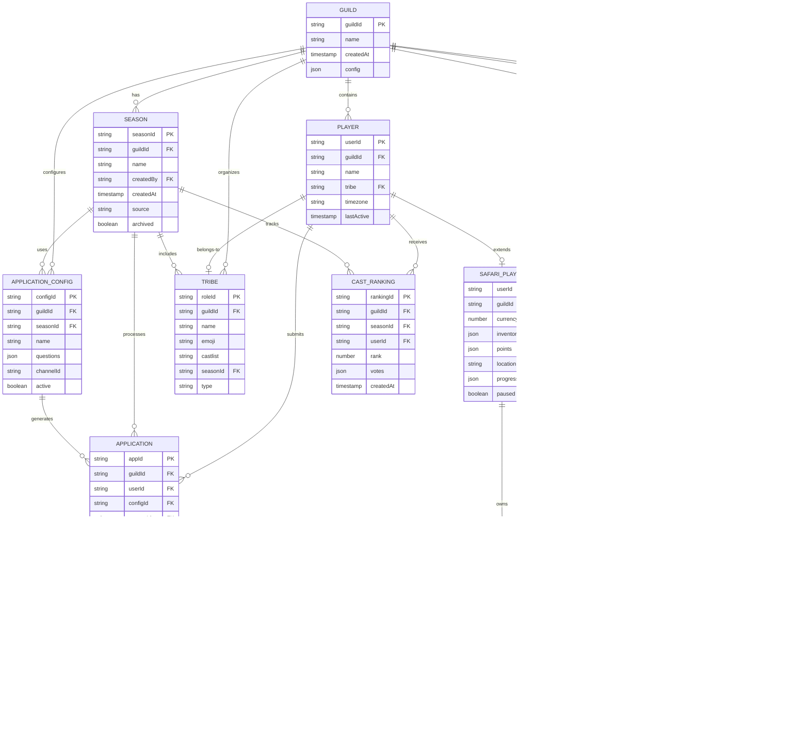
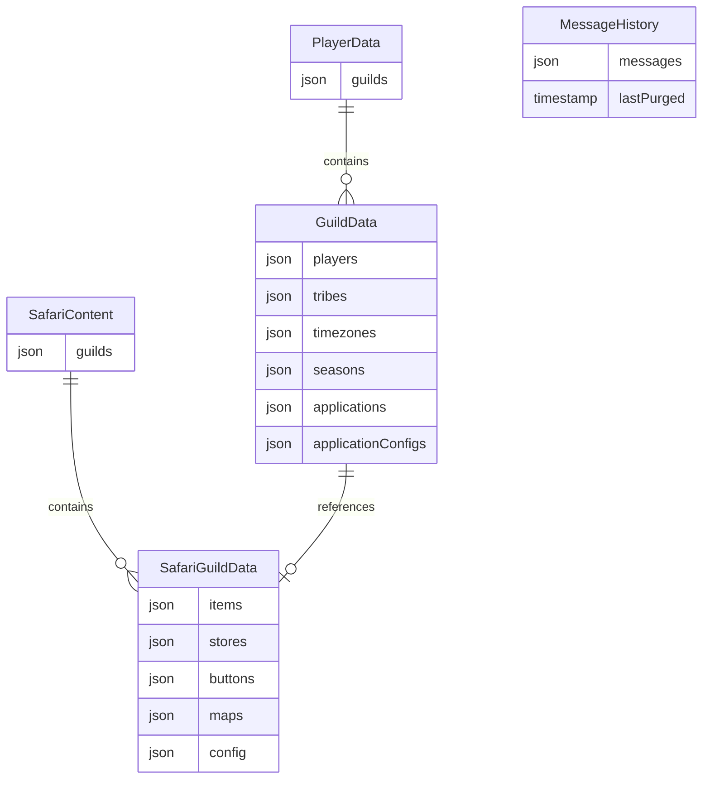

# Entity Relationship Diagram

## CastBot Database Schema

```mermaid
erDiagram
    GUILD {
        string guildId PK
        string name
        timestamp createdAt
        json config
    }
    
    PLAYER {
        string userId PK
        string guildId FK
        string name
        string tribe FK
        string timezone
        timestamp lastActive
    }
    
    SAFARI_PLAYER {
        string userId PK
        string guildId FK
        number currency
        json inventory
        json points
        string location
        json progress
        boolean paused
    }
    
    SEASON {
        string seasonId PK
        string guildId FK
        string name
        string createdBy FK
        timestamp createdAt
        string source
        boolean archived
    }
    
    APPLICATION {
        string appId PK
        string guildId FK
        string userId FK
        string configId FK
        string seasonId FK
        json responses
        string status
        timestamp submittedAt
    }
    
    APPLICATION_CONFIG {
        string configId PK
        string guildId FK
        string seasonId FK
        string name
        json questions
        string channelId
        boolean active
    }
    
    TRIBE {
        string roleId PK
        string guildId FK
        string name
        string emoji
        string castlist
        string seasonId FK
        string type
    }
    
    SAFARI_ITEM {
        string itemId PK
        string guildId FK
        string name
        string description
        number basePrice
        string category
        number maxQuantity
        json effects
    }
    
    SAFARI_STORE {
        string storeId PK
        string guildId FK
        string name
        string description
        json items
        string theme
        string location FK
    }
    
    SAFARI_MAP {
        string mapId PK
        string guildId FK
        string name
        boolean active
        json coordinates
    }
    
    MAP_CELL {
        string coordinate PK
        string mapId FK
        string guildId FK
        string channelId
        json baseContent
        json adjacentCells
    }
    
    SAFARI_BUTTON {
        string buttonId PK
        string guildId FK
        string name
        string label
        json actions
        json conditions
    }
    
    CAST_RANKING {
        string rankingId PK
        string guildId FK
        string seasonId FK
        string userId FK
        number rank
        json votes
        timestamp createdAt
    }
    
    GUILD ||--o{ PLAYER : contains
    GUILD ||--o{ SEASON : has
    GUILD ||--o{ SAFARI_ITEM : defines
    GUILD ||--o{ SAFARI_STORE : has
    GUILD ||--o{ SAFARI_MAP : contains
    GUILD ||--o{ APPLICATION_CONFIG : configures
    GUILD ||--o{ TRIBE : organizes
    
    PLAYER ||--o| SAFARI_PLAYER : extends
    PLAYER ||--o{ APPLICATION : submits
    PLAYER ||--o| TRIBE : belongs-to
    PLAYER ||--o{ CAST_RANKING : receives
    
    SEASON ||--o{ APPLICATION : processes
    SEASON ||--o{ APPLICATION_CONFIG : uses
    SEASON ||--o{ TRIBE : includes
    SEASON ||--o{ CAST_RANKING : tracks
    
    APPLICATION_CONFIG ||--o{ APPLICATION : generates
    
    SAFARI_MAP ||--o{ MAP_CELL : contains
    MAP_CELL ||--o{ SAFARI_BUTTON : displays
    MAP_CELL ||--o| SAFARI_STORE : hosts
    
    SAFARI_STORE ||--o{ SAFARI_ITEM : sells
    SAFARI_PLAYER ||--o{ SAFARI_ITEM : owns
```

## Simplified Data Relationships

```mermaid
erDiagram
    PlayerData {
        json guilds
    }
    
    GuildData {
        json players
        json tribes  
        json timezones
        json seasons
        json applications
        json applicationConfigs
    }
    
    SafariContent {
        json guilds
    }
    
    SafariGuildData {
        json items
        json stores
        json buttons
        json maps
        json config
    }
    
    MessageHistory {
        json messages
        timestamp lastPurged
    }
    
    PlayerData ||--o{ GuildData : contains
    SafariContent ||--o{ SafariGuildData : contains
    GuildData ||--o| SafariGuildData : references
```