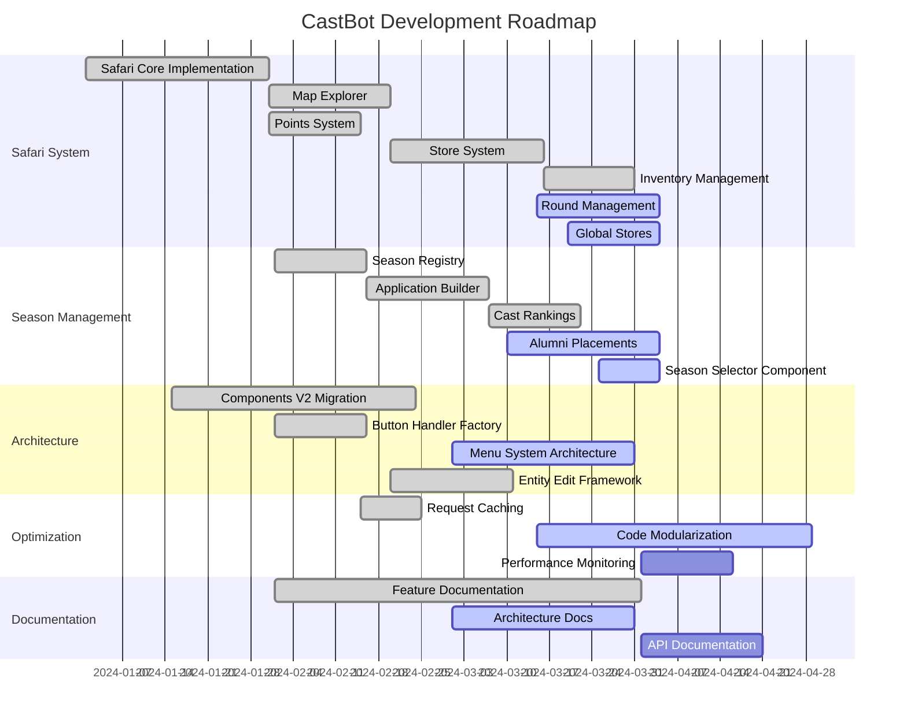
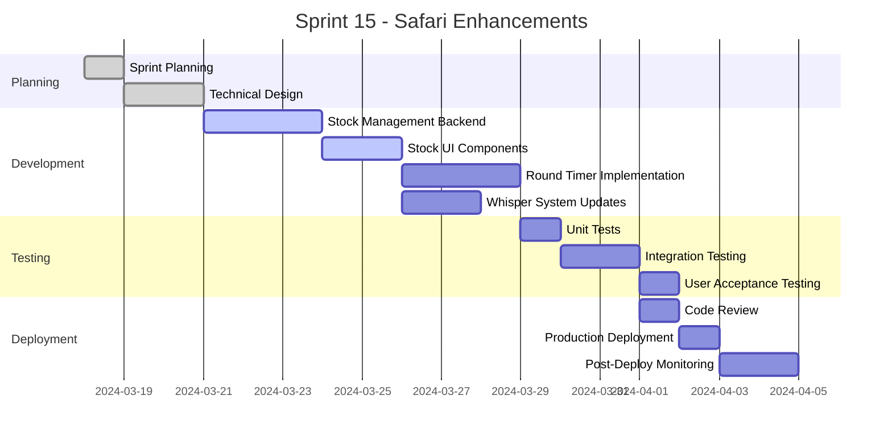

# Gantt Chart

## CastBot Feature Development Timeline

```mermaid
gantt
    title CastBot Development Roadmap
    dateFormat YYYY-MM-DD
    
    section Safari System
    Safari Core Implementation    :done, safari1, 2024-01-01, 30d
    Map Explorer                  :done, safari2, after safari1, 20d
    Points System                 :done, safari3, after safari1, 15d
    Store System                  :done, safari4, after safari2, 25d
    Inventory Management          :done, safari5, after safari4, 15d
    Round Management              :active, safari6, 2024-03-15, 20d
    Global Stores                 :active, safari7, 2024-03-20, 15d
    
    section Season Management
    Season Registry               :done, season1, 2024-02-01, 15d
    Application Builder           :done, season2, after season1, 20d
    Cast Rankings                 :done, season3, after season2, 15d
    Alumni Placements            :active, season4, 2024-03-10, 25d
    Season Selector Component    :active, season5, 2024-03-25, 10d
    
    section Architecture
    Components V2 Migration       :done, arch1, 2024-01-15, 40d
    Button Handler Factory        :done, arch2, 2024-02-01, 15d
    Menu System Architecture      :active, arch3, 2024-03-01, 30d
    Entity Edit Framework         :done, arch4, 2024-02-20, 20d
    
    section Optimization
    Request Caching               :done, opt1, 2024-02-15, 10d
    Code Modularization          :active, opt2, 2024-03-15, 45d
    Performance Monitoring        :opt3, 2024-04-01, 15d
    
    section Documentation
    Feature Documentation         :done, doc1, 2024-02-01, 60d
    Architecture Docs            :active, doc2, 2024-03-01, 30d
    API Documentation            :doc3, 2024-04-01, 20d
```

## Sprint Planning Example

```mermaid
gantt
    title Sprint 15 - Safari Enhancements
    dateFormat YYYY-MM-DD
    
    section Planning
    Sprint Planning              :done, plan, 2024-03-18, 1d
    Technical Design             :done, design, after plan, 2d
    
    section Development
    Stock Management Backend     :active, dev1, 2024-03-21, 3d
    Stock UI Components          :active, dev2, after dev1, 2d
    Round Timer Implementation   :dev3, after dev2, 3d
    Whisper System Updates       :dev4, after dev2, 2d
    
    section Testing
    Unit Tests                   :test1, after dev3, 1d
    Integration Testing          :test2, after test1, 2d
    User Acceptance Testing      :test3, after test2, 1d
    
    section Deployment
    Code Review                  :review, after test2, 1d
    Production Deployment        :deploy, after test3, 1d
    Post-Deploy Monitoring       :monitor, after deploy, 2d
```